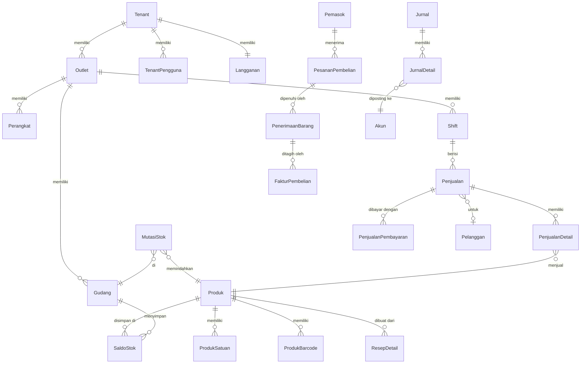

<!-- DIBUAT OTOMATIS dari PRD.md oleh Alat/PecahPrd.py. JANGAN DIEDIT LANGSUNG: ubah PRD.md lalu jalankan ulang skrip. -->

## 15. Model Data (Skema Database)

> Semua nama tabel dan kolom memakai **Bahasa Indonesia, PascalCase, bentuk tunggal** (keputusan D-05, aturan lengkap di §13.7). Contoh: tabel `Penjualan`, kolom `IdOutlet`, `TanggalBisnis`, `TotalAkhir`.

### 15.1 Konvensi

- PK `Id BIGINT UNSIGNED AUTO_INCREMENT` (internal) + `Uuid CHAR(26)` ULID (publik, offline, dan API).
- Foreign key: `Id` + nama tabel rujukan, misal `IdTenant`, `IdOutlet`, `IdProduk`. Jika satu tabel merujuk tabel yang sama dua kali, tambahkan peran: `IdGudangAsal`, `IdGudangTujuan`.
- `IdTenant` di semua tabel milik tenant. Indeks komposit diawali `IdTenant`.
- Nama indeks: `Idx{Tabel}{Kolom...}`, unique: `Uniq{Tabel}{Kolom...}`, foreign key: `Fk{Tabel}{Kolom}`. Contoh: `IdxPenjualanIdTenantIdOutletTanggalBisnis`. Jika melebihi 64 karakter (batas MySQL), singkat secara konsisten.
- Uang: `DECIMAL(18,2)`. Harga pokok per unit: `DECIMAL(19,6)`. Jumlah (qty): `DECIMAL(18,4)`. Persen/tarif: `DECIMAL(9,6)`.
- Waktu: `TIMESTAMP` UTC + `TanggalBisnis DATE` (tanggal bisnis menurut zona waktu outlet & jam tutup buku, misal kafe yang tutup jam 02:00 tetap masuk tanggal kemarin).
- Kolom waktu standar: `DibuatPada`, `DiubahPada`, `DihapusPada` (soft delete, **hanya** untuk master data). Dokumen transaksi tidak pernah dihapus.
- Kolom boolean diawali `Is`/`Apakah` **tidak** dipakai. Gunakan kata sifat/status yang jelas: `Aktif`, `Pkp`, `Otomatis`, `BolehMinus`.
- Kolom snapshot (nama produk, harga, pajak) di baris transaksi agar laporan historis stabil.
- `DibuatOleh`, `DiubahOleh`, `IdPerangkat` di dokumen transaksi.
- Tabel detail memakai pola `{Induk}Detail` (misal `PenjualanDetail`, `JurnalDetail`) agar berurutan dengan induknya saat diurutkan.

### 15.2 ERD Inti

### 15.3 Tabel Utama (ringkas)

**Tenancy & Organisasi**

| Tabel | Kolom kunci |
|---|---|
| `Tenant` | Id, Uuid, Nama, Slug (unik), Npwp, Pkp, ZonaWaktu, Pengaturan JSON (F-01: `PathLogo`, `Sektor` daftar kode template, `PembulatanTunai {Kelipatan, Arah}`, `StokBolehMinus`, `MetodeHpp`; v1.79: `Struk` pengaturan struk), Status (Aktif; status penghapusan data ditambah P-07), Penanda (Uji/Demo/Internal, null = tenant biasa; P-07 BR-P07.8) |
| `Paket` / `PaketFitur` | Kode, Nama, Status (Draf/Aktif/Diarsipkan), HargaNegosiasi, MasaTrialHari, BatasOutlet, BatasPerangkatPerOutlet, BatasPengguna, BatasSku, KuotaPesanWaBulanan, BatasPenyimpananMb (batas `null` = tak terbatas), Urutan / IdPaket, KunciFitur |
| `HargaPaket` | IdPaket, HargaBulanan, HargaTahunan (decimal 18,2), BerlakuMulai, BerlakuSampai, TerapkanKePelangganLama, Status (Draf/MenungguTinjauan/Terbit), IdPenggunaPengelolaPengaju, DiajukanPada, PutaranTinjauan, DaftarIdPenyusun JSON. Harga paket hanya ada di tabel ini (berversi, BR-P04.1) |
| `Langganan` | IdTenant (unik), IdPaket, Status (Trial/Aktif/Tertunggak/Ditangguhkan/Berhenti/Gratis), StatusSebelumDitangguhkan (diisi saat tangguhkan manual, P-07 BR-P07.4), TrialBerakhirPada, PeriodeMulai, PeriodeSelesai, SiklusTagihan (Bulanan/Tahunan) |
| `TagihanLangganan` | IdTenant, Nomor, Jumlah, Status, DibayarPada, RefGateway. Rincian P-08 Fase 0: `Jumlah` disimpan sebagai `Total`; Jenis (Aktivasi/Perpanjangan), IdPaket, IdHargaPaket (snapshot), Siklus, JumlahBulan, Subtotal, IdKuponLangganan, KodeKupon, Diskon, IdTarifPajak, TarifPpn, PengaliDppPembilang/PengaliDppPenyebut, DasarPengenaanPajak, JumlahPpn, TerbitPada, JatuhTempoPada, DibatalkanPada, AlasanBatal, PeriodeMulai, PeriodeSelesai, MulaiLanggananPaket (jangkar grandfathering), IdPenggunaPembuat (kosong = diterbitkan sistem, v4.04), PengingatTerakhir/PengingatTerakhirPada (tahap pengingat terakhir BR-P08.12, v4.04). `MilikTenant`; angka tidak berubah setelah terbit, tidak pernah dihapus. Penghitung nomor: `NomorUrutTagihanLangganan` (Tahun unik, NomorTerakhir) |
| `Pengguna` | Id, Uuid, Nama, Email, NoHp, KataSandi, Rahasia2fa, KodePemulihan2fa (terenkripsi), DuaFaktorAktifPada (BR-00.8) |
| `TenantPengguna` | IdTenant, IdPengguna, Pemilik, IdPeran (peran utama di tenant), SemuaOutlet, HashPin, VerifierPinOffline (terenkripsi, F-06), Status (Aktif/Nonaktif), DinonaktifkanPada. Tanpa `MilikTenant` (dibaca lintas tenant untuk pemilih tenant, §13.4) |
| `Merek` | IdTenant, Nama |
| `Outlet` | IdTenant, IdMerek, Kode, Nama, Alamat, KodeKota, ZonaWaktu, TemplateSektor, JamTutupBuku (misal 04:00), ProfilPajak JSON (Pkp, Nitku, PungutPbjt, `BiayaLayanan {Aktif, Persen}`, `HargaTermasukPajak`), PengaturanKasir JSON (v3.51: `JenisPesanan`, `JenisPesananBawaan`; null = otomatis), Status (Aktif/Diarsipkan), KodeDikunciPada (BR-02.2), DiarsipkanPada, IdTemplateSektorVersi & TemplateSektorDiterapkanPada (F-01, BR-P03.1; nullable) |
| `OutletFitur` | IdTenant, IdOutlet, KunciFitur, Aktif, Konfigurasi JSON. Menyimpan pilihan template; fitur efektif = fitur paket ∩ `OutletFitur`. `pos.retail` menyimpan `{ModeKasir, ModeKasirDefault}` (F-01) |
| `ProgresPanduanAwal` | IdTenant (unik), IdOutlet, StatusLangkah JSON `{Langkah: {Status: Belum/Dilewati/Selesai, Pada}}`, SelesaiPada, IdPenggunaPenyelesai (F-01) |
| `Gudang` | IdTenant, IdOutlet, Kode, Nama, Jenis (Toko/Dapur/Bar/Gudang/Rusak/DalamPerjalanan), Status (Aktif/Diarsipkan), DiarsipkanPada |
| `Perangkat` | IdTenant, IdOutlet, Uuid, Kode (unik per tenant, tidak dipakai ulang), Nama, Jenis (Kasir/Kds/Gudang/Pelayan/Salesman), Platform (Android/Ios/Windows), VersiOs, VersiAplikasi, VersiSkemaSinkron, TokenPush, ProfilHardware JSON (printer, laci, layar kedua), HashToken (SHA-256 device token, F-02b), DiaktifkanPada, TerakhirAktifPada, JumlahOutboxTertunda, DicabutPada. KunciPinOffline (terenkripsi, F-06; dikosongkan saat dicabut) |
| `PerangkatPengguna` | IdPengguna, IdTokenAksesPengguna (nullable), Uuid, Nama, Platform (Android/Ios), Token (terenkripsi), HashToken (unik), Aktif, TerakhirTerdaftarPada. Milik akun lintas tenant; satu pemasangan Owner menerima notifikasi tenant aktif yang boleh diakses akun itu |
| `NotifikasiPengguna` | IdTenant, IdPengguna, Uuid, Jenis (Persetujuan/SelisihKas/StokKritis/PerangkatOffline/PiutangJatuhTempo), Kunci idempotensi, Judul, Isi, Data JSON, DibacaPada, DikirimPada, GagalPada, PesanGalat; unik IdTenant+IdPengguna+Kunci |
| `KodeAktivasi` | IdTenant, IdOutlet, IdPerangkat, HashKode (HMAC-SHA256), KedaluwarsaPada, DipakaiPada, DibatalkanPada, IdPenggunaPembuat. Data platform tanpa `MilikTenant` (dicari lewat `HashKode` sebelum tenant diketahui, F-02b) |
| `RilisAplikasi` | Aplikasi (Pos/Pemilik), Platform, Kanal (Beta/Stabil), Versi, Build, Status (Draf/Aktif/Dihentikan), PersenRollout, UrlUnduh, CatatanRilis, VersiMinimum, VersiMinimumBerlakuPada, PerbaikanKeamanan, DiterbitkanPada, DihentikanPada, AlasanDihentikan, DibuatOleh (rincian v1.82) |
| `OutletPengguna` | IdTenant, IdOutlet, IdPengguna, IdPeran (tidak dipakai untuk anggota `SemuaOutlet`) |
| `Peran` / `PeranIzin` | IdTenant, Uuid, Kode (peran bawaan §19.1; kosong = kustom), Nama, Keterangan, Bawaan / IdTenant, IdPeran, KunciIzin |
| `UndanganPengguna` | IdTenant, Uuid, Email, HashToken, IdPeran, SemuaOutlet, DaftarIdOutlet JSON, IdPenggunaPengundang, BerlakuSampai (72 jam), DiterimaPada, IdPenggunaPenerima, DibatalkanPada. Tanpa `MilikTenant` (dibuka penerima sebelum menjadi anggota; dicari lewat hash token) |

**Katalog & Harga**

| Tabel | Kolom kunci |
|---|---|
| `Kategori` | IdTenant, Uuid, IdInduk, Nama, IdStasiunDapur (kolom dibuat F-10), Urutan |
| `Produk` | IdTenant, Uuid, Sku, Nama, NamaStruk, Jenis, IdKategori, Merek, IdSatuanDasar, Pelacakan (Tidak/Batch/Seri), IdKelompokPajak, MetodeHpp (belum dipakai; metode HPP per tenant), BolehMinus, Aktif, TampilDiPos, TampilOnline, IdInduk (varian), AtributVarian JSON, KunciVarian (unik per induk), HargaTermasukPajak (null = ikut outlet), PathGambar (disk privat), DiarsipkanPada, DihapusPada (soft delete, SKU dikosongkan) (F-03) |
| `Satuan` | IdTenant, Uuid, Nama, Simbol, BolehDesimal, KodeStandar (unik per tenant, dari `SatuanStandar`; F-01) |
| `ProdukSatuan` | IdTenant, Uuid, IdProduk, IdSatuan, KonversiKeDasar, DefaultJual, DefaultBeli |
| `ProdukBarcode` | IdTenant, Uuid, IdProduk, IdProdukSatuan, Barcode (unik per tenant, tanpa beda huruf besar/kecil) |
| `ProdukGudang` | IdTenant, IdProduk, IdGudang, StokMinimum, StokMaksimum (batas restock per lokasi stok; F-03) |
| `NomorUrutKatalog` | IdTenant, Jenis (Sku/Barcode), NomorTerakhir (SKU otomatis `PRD-000001`, barcode internal EAN-13 berawalan `20`; F-03) |
| `PenghapusanKatalog` | IdTenant, Entitas, UuidEntitas, DihapusPada (jejak hapus untuk sinkron delta POS, append-only, retensi 90 hari; F-03) |
| `ImporProduk` / `ImporProdukBaris` | IdTenant, Uuid, IdPengguna, Sumber (Umum/Majoo/Moka/Pawoon), NamaBerkas, PathBerkas, HashBerkas, UkuranBerkas, Format, Status, KolomSumber, Pemetaan, Opsi, penghitung Jumlah*, PesanGalat, DivalidasiPada, DiterapkanMulaiPada, SelesaiPada / IdTenant, IdImporProduk, NomorBaris, Status, Aksi, KunciProduk, Data, DataAsli, Galat, IdProduk, DiterapkanPada (F-03, BR-03.6) |
| `ProdukHarga` | IdTenant, Uuid, IdProduk, IdProdukSatuan, IdDaftarHarga (null = dasar; FK F-03), KunciDaftarHarga (kolom generated `IFNULL(IdDaftarHarga,0)` untuk indeks unik), JumlahMinimum, Harga |
| `DaftarHarga` | IdTenant, Uuid, Nama, IdOutlet JSON, Kanal, TierPelanggan (kode bebas sampai tabel tier F-16), MulaiPada, SelesaiPada (UTC; diinput zona waktu tenant), Prioritas, Aktif (tidak pernah dihapus, hanya dinonaktifkan) |
| `KelompokPilihan` / `Pilihan` (modifier) | IdTenant, Uuid, Nama, MinimalPilih, MaksimalPilih, Urutan / IdTenant, IdKelompokPilihan, Nama, Harga, IdProduk (bahan, opsional), Jumlah, Aktif, Urutan |
| `ProdukKelompokPilihan` | IdTenant, Uuid, IdProduk, IdKelompokPilihan, Urutan |
| `Resep` / `ResepDetail` | IdTenant, Uuid, IdProduk, JumlahHasil, Versi, Catatan, DibuatOleh (baris tidak pernah diubah/dihapus; perubahan = versi baru, BR-03.4) / IdTenant, IdProdukBahan, Jumlah, IdSatuan, JumlahDasar (snapshot konversi), PersenSusut, Urutan |
| `PaketProdukDetail` (bundle) | IdTenant, Uuid, IdProdukPaket, IdProdukKomponen, Jumlah, AlokasiHarga (persen `decimal(9,6)`; kosong semua atau total tepat 100) |
| `RiwayatHarga` | IdTenant, IdProduk, IdProdukSatuan, IdSatuan, IdDaftarHarga, JumlahMinimum, HargaLama (null = baru), HargaBaru (null = dihapus), DiubahOleh, Sumber (Manual/PanduanAwal/Impor/Varian); append-only |

**Inventori**

| Tabel | Kolom kunci |
|---|---|
| `SaldoStok` | IdTenant, IdProduk, IdGudang, JumlahTersedia, JumlahDipesan, HppRataRata, NilaiPersediaan, IdMutasiStokTerakhir, DiubahPada. **Unik (IdTenant, IdProduk, IdGudang)** |
| `MutasiStok` | IdTenant, IdProduk, IdGudang, IdBatchStok, IdNomorSeri, JenisMutasi, Jumlah (±, satuan dasar), HppSatuan, TotalHpp, SelisihHpp, SaldoSetelah, NilaiSetelah, HppRataRataSetelah, JenisReferensi, IdReferensi, IdReferensiDetail, UuidReferensi, NomorReferensi, KunciBaris, IdMutasiAsal, IdPerangkat, TanggalBisnis, DibuatOleh. Append-only (F-05a) |
| `BatchStok` | IdTenant, Uuid, IdProduk, IdGudang, NomorBatch, TanggalKedaluwarsa, JumlahSisa, HppSatuan |
| `NomorSeri` | IdTenant, Uuid, IdProduk, Nomor (unik per produk), Status, IdGudang, IdPenjualanDetail |
| `TransferStok` / `TransferStokDetail` | IdGudangAsal, IdGudangTujuan, Status, DikirimPada, DiterimaPada / JumlahDikirim, JumlahDiterima |
| `StokOpname` / `StokOpnameDetail` | IdGudang, Status, HitungButa, SnapshotPada / JumlahSistem, JumlahFisik, Selisih, DihitungOleh |
| `PenyesuaianStok` / `PenyesuaianStokDetail` | KodeAlasan, Status, DisetujuiOleh |
| `Produksi` / `ProduksiDetail` | IdProdukHasil, Jumlah, Status / bahan terpakai |
| `LapisanFifo` (jika FIFO) | IdTenant, IdProduk, IdGudang, IdBatchStok, TanggalMasuk, JumlahAwal, JumlahSisa, HppSatuan, NilaiAwal, NilaiSisa, Habis, IdMutasiSumber |
| `StokAwal` / `StokAwalDetail` | IdTenant, Uuid, Nomor, IdGudang, IdOutlet, Tanggal, Status, Sumber (Manual/Impor), IdImporStokAwal, Catatan, JumlahBaris, TotalNilai, IdJurnal, IdJurnalPembatalan, PesanGalat, DipostingOleh/Pada, DibatalkanOleh/Pada, AlasanBatal / IdTenant, IdStokAwal, Urutan, IdProduk, NamaProduk, Sku, Jumlah, HppSatuan, Nilai, NomorBatch, TanggalKedaluwarsa, DaftarNomorSeri (F-05a) |
| `ImporStokAwal` / `ImporStokAwalBaris` | IdTenant, Uuid, IdPengguna, IdGudangBawaan, Tanggal, NamaBerkas, PathBerkas, HashBerkas, UkuranBerkas, Format, Status, KolomSumber, Pemetaan, Opsi, penghitung Jumlah*, PesanGalat, DivalidasiPada, DiterapkanPada, SelesaiPada / IdTenant, IdImporStokAwal, NomorBaris, Status, Data, DataAsli, Galat, IdStokAwal (F-05a) |

**Pembelian**

| Tabel | Kolom kunci |
|---|---|
| `Pemasok` | IdTenant, Nama, NoHp, Npwp, TerminHari, Penitip (konsinyasi) |
| `PesananPembelian` / `PesananPembelianDetail` | Nomor, IdPemasok, IdGudang, Status, PerkiraanTiba, Subtotal, Diskon, Pajak, Ongkir, Total, DisetujuiOleh / IdProduk, IdSatuan, Jumlah, Harga, Diskon, TarifPajak, JumlahDiterima |
| `PesananPenjualan` / `PesananPenjualanDetail` / `PesananPenjualanPembayaran` | F-12 bagian 2 (v1.68): Nomor `SO/…`, IdOutlet, IdShift, IdPelanggan, TanggalAmbil, Status (Dipesan/Siap/Diambil/Dibatalkan), TotalPesanan, UangMuka, UangMukaTerpakai/Dikembalikan/Hangus, IdJurnal, IdPenjualan, IdJurnalPenyelesaian / IdProduk, UuidProduk, UuidProdukSatuan, Jumlah, HargaSatuan, HargaPilihan, Pilihan / IdMetodePembayaran, JenisMetode, Jumlah, Referensi |
| `PenerimaanBarang` / `PenerimaanBarangDetail` | IdPesananPembelian, Nomor, Status, DiterimaPada, NomorSuratJalan, Lampiran / IdPesananPembelianDetail, Jumlah, NomorBatch, TanggalKedaluwarsa, HppSatuan |
| `FakturPembelian` / `FakturPembelianDetail` | NomorFakturPemasok, JatuhTempo, Total, JumlahDibayar, Status |
| `ReturPembelian` / `ReturPembelianDetail` | IdPenerimaanBarang, Alasan, Status |
| `PembayaranHutang` / `PembayaranHutangAlokasi` | IdAkun, Jumlah, Kompensasi (potong klaim promo, v1.94) / IdFakturPembelian, Jumlah |

**Kasir & Penjualan**

| Tabel | Kolom kunci |
|---|---|
| `Shift` | IdTenant, IdOutlet, IdPerangkat, Uuid (dari perangkat), Status, Bersama, DibukaOleh, DibukaPada, TanggalBisnis, KasAwal, PecahanKasAwal JSON, PerluTinjauan, AlasanTinjauan, DiterimaPada, DitutupOleh, DitutupPada, KasSeharusnya, KasAktual, Selisih, PecahanKasAkhir JSON (F-06; kolom tutup diisi F-11) |
| `BukaUlangShift` | IdTenant, Uuid (dari perangkat), IdShift, IdPerangkat, Urutan (unik per shift), Alasan, DimintaOleh, DisetujuiOleh, DibukaUlangPada, SnapshotTutup JSON, IdJurnalPembalik. Append-only (K-18) |
| `MutasiKas` | IdTenant, Uuid (dari perangkat), IdShift, Jenis (Masuk/Keluar/Setoran), IdKategoriKas, Jumlah, Catatan, PathLampiran (foto bukti K-18, privat), DicatatOleh, DicatatPada, TanggalBisnis, DisetujuiOleh, IdJurnal, DiterimaPada. Append-only (F-06) |
| `BukaLaci` | IdTenant, Uuid (dari perangkat), IdShift, IdPerangkat, Alasan, DibukaOleh, DisetujuiOleh, DibukaPada, DiterimaPada, PerluTinjauan, AlasanTinjauan. Log buka laci manual tanpa transaksi, append-only (v1.87, §19.2) |
| `KategoriKas` | IdTenant, Uuid, Nama, Jenis (Masuk/Keluar), IdAkun, Aktif, Urutan. Unik (IdTenant, Jenis, Nama) (F-06) |
| `Penjualan` | IdTenant, IdOutlet, IdShift, IdPerangkat, Uuid, **UuidKlien (unik)**, Nomor, Kanal (MakanDiTempat/BawaPulang/Antar/Online/PesanSendiri/Marketplace), IdMeja, IdPelanggan, Status, TanggalBisnis, Subtotal, TotalDiskon, BiayaLayanan, BiayaKirim & DiskonKirim (F-17 bagian 3), TotalPajak, Pembulatan, TotalAkhir, TotalDibayar, Kembalian, TotalHpp, JumlahTamu, Catatan, DisinkronPada, DibuatOfflinePada. F-07b: IdPengguna (kasir), IdPenyetujuDiskon, DiskonPesanan, DiterimaPada, PerluTinjauan, AlasanTinjauan. F-16b: PoinDitukar, DiskonPoin (bagian dari DiskonPesanan) |
| `PenjualanDetail` | IdPenjualan, Uuid, IdProduk, NamaProduk (snapshot), IdSatuan, Jumlah, HargaSatuan, JumlahDiskon, IdPromo, SnapshotPajak JSON, JumlahPajak, TotalBaris, HppSatuan, TotalHpp, Pilihan JSON, Catatan, StatusDapur, IdKaryawan (komisi), AlasanVoid. F-07b: IdTenant, UuidProdukSatuan→IdSatuan & KonversiKeDasar, HargaPilihan, Bruto, JumlahDiskonPesanan, BiayaLayanan, PajakEksklusif. F-17 bagian 3: BiayaKirim (bagian ongkir netto baris ini, dasar pajaknya) |
| `PenjualanPembayaran` | IdPenjualan, Uuid, IdMetodePembayaran, Jumlah, Status, Referensi (kode approval/ref gateway), RefEksternal (unik), DibayarPada |
| `PenjualanPajak` | IdTenant, IdPenjualan, KodeJenisPajak, Tarif, PengaliDppPembilang, PengaliDppPenyebut, DasarPengenaan, KenaBiayaKirim (F-17 bagian 3), Dpp, Jumlah (rincian pajak per dokumen per jenis, F-07b) |
| `MetodePembayaran` | IdTenant, Jenis (Tunai/QrisStatis/QrisDinamis/Edc/Transfer/Ewallet/Tempo/Deposit/Poin/Voucher/Marketplace), Nama, IdAkun, IdAkunKliring, PersenBiaya, BiayaTetap, Aktif, Uuid, IdReferensiBank, NomorRekening, NamaPemilikRekening, PathGambarQris (disk privat), Urutan (F-01), Kanal (v2.36: kanal platform metode `Marketplace`, null untuk jenis lain). `IdAkun` kosong = diturunkan dari `PemetaanAkun` menurut jenis. Tunai selalu ada. MDR dikonfigurasi per metode dengan batas kewajaran 10% (`config/pembayaran.php`); komisi platform `Marketplace` sampai 40% |
| `TagihanQris` | IdTenant, IdOutlet, IdPerangkat (**nullable** sejak v2.87: tagihan web tanpa perangkat), Sumber (Pos/TokoOnline, v2.87), IdPesananOnline (v2.87), IdMetodePembayaran, Uuid, NomorPesanan (unik), Jumlah, JumlahDiterima, Penyedia, IdReferensi, IsiQr, HalamanBayar, Status, KedaluwarsaPada, LunasPada, TerakhirDicekPada, UuidPenjualan (v2.05, F-08) |
| `PesanKeluar` | IdTenant, Uuid, Jenis, IdReferensi, Kanal (Whatsapp/Email), Tujuan (terenkripsi), Status, PesanGalat, Percobaan, TerkirimPada (v2.05, struk digital) |
| `GerbangPembayaranTenant` | IdTenant (unik), Uuid, Penyedia, Lingkungan (Sandbox/Produksi), Pengaturan, Kredensial (terenkripsi), PetunjukKredensial, StatusUji, PesanUji, DiujiPada, Aktif, TokenWebhook (unik), WebhookDiterimaPada, WebhookDitolakPada (v2.06, D-19) |
| `KatalogGerbangPembayaran` | Penyedia (unik), Diizinkan — data platform tanpa IdTenant (v2.06) |
| `ReturPenjualan` / `ReturPenjualanDetail` | IdPenjualanAsal, Nomor, Alasan, MetodeRefund, Status / IdPenjualanDetail, Jumlah, IdGudangRestok, Kondisi |
| `VoidPenjualan` | IdPenjualan, Alasan, DisetujuiOleh, DivoidOleh |
| `Persetujuan` | IdTenant, Jenis, JenisSubjek, IdSubjek, DimintaOleh, DisetujuiOleh, Metode (Pin/Otp/JarakJauh), Alasan, Jumlah |

**Meja, Dapur, Layanan**

| Tabel | Kolom kunci |
|---|---|
| `AreaMeja` / `Meja` | IdOutlet, Nama, Urutan, Status / IdOutlet, IdAreaMeja, Nama (unik per outlet), Kapasitas, PosisiX, PosisiY, Bentuk, Urutan, TokenQr (F-17), Status (Aktif/Diarsipkan; status pakai diturunkan dari pesanan terbuka) |
| `StasiunDapur` | IdTenant, Uuid, Nama (unik per tenant), Urutan, Status (tingkat tenant sejak v1.56; konfigurasi printer dapur disimpan di profil perangkat) |
| `PesananTerbuka` / `PesananTerbukaDetail` (v1.57) | IdOutlet, IdPerangkat, Uuid (dari perangkat), Nomor `OB/…`, IdMeja, Label, JumlahTamu, Status (Terbuka/Dibayar/Dibatalkan/Digabung v1.99), IdPengguna, DibukaPada, HeaderDiubahPada (LWW), IdPenjualan, DitutupPada, AlasanBatal, IdPembatal, IdPenyetujuBatal, IdPerangkatKunciBayar, KunciBayarSampai / IdPesananTerbuka, Uuid, IdProduk, UuidProdukSatuan, NamaProduk, Jumlah, HargaSatuan, HargaPilihan, Pilihan JSON, Catatan, Ronde, Status (Aktif/Dibatalkan), DikirimKeDapurPada, IdPengguna, IdPerangkat, DibatalkanPada, AlasanBatal, IdPembatal, IdPenyetujuBatal; `Penjualan.IdPesananTerbuka` |
| `PesananSendiri` | IdTenant, Uuid, IdOutlet, IdMeja, Nomor, NamaPemesan, Catatan, Baris JSON, Subtotal, Perkiraan JSON, Status (MenungguKonfirmasi/Diterima/Ditolak/Kedaluwarsa), IdPesananTerbuka, IdPemroses, IdPerangkat, AlasanTolak, HashIp, DiprosesPada (F-17 self-order v2.02/v2.07) |
| `PengaturanTokoOnline` / kolom `Outlet` | IdTenant (unik), Aktif, BayarSaatAmbilAktif, CodAktif, QrisAktif, MinimalPesanan, MenitKedaluwarsa, PesanTutup / Outlet.TokoOnlineAktif, AmbilSendiriAktif, KirimAktif (F-17 bagian 1 v2.86) |
| `PesananOnline` / `PesananOnlineDetail` | IdTenant, Uuid, KodeAkses (unik), Nomor `ON/{OUTLET}/{YYMMDD}-{SEQ4}`, IdOutlet, IdPelanggan, JenisPemenuhan (AmbilSendiri/Kirim), MetodePembayaran (BayarSaatAmbil/Cod/QrisOnline), NamaPelanggan, NoHp terenkripsi, Email terenkripsi, Alamat terenkripsi, Kelurahan, Kecamatan, Kota, Provinsi, KodePos, IdZonaPengiriman, Catatan, Subtotal, Diskon, BiayaLayanan, Pajak, Ongkir (kotor), DiskonOngkir (promo gratis ongkir, v3.01; dibayar pembeli = Ongkir − DiskonOngkir), Total, Perkiraan JSON, Status, IdPenjualan, DibayarPada, JumlahDibayar, UangMukaTerpakai, IdJurnal (J-17.1), DikembalikanPada, IdJurnalRefund (J-17.2), HashNoHp, HashIp, DikonfirmasiOleh/Pada, SelesaiPada, Alasan / IdPesananOnline, Uuid, IdProduk, UuidProduk, UuidProdukSatuan, NamaProduk, Jumlah, HargaSatuan, HargaPilihan, Pilihan JSON, Catatan, SnapshotPajak JSON, TotalBaris (F-17 bagian 1 v2.86) |
| `ZonaPengiriman` | IdTenant, Uuid, IdOutlet, Nama, KodePos JSON, Ongkir, GratisMulai, EstimasiHariMin, EstimasiHariMaks, Urutan, Aktif; kode pos aktif unik per outlet (F-10c v2.86) |
| `Kurir` | IdTenant, Uuid, Nama, NoHp terenkripsi, Jenis (Internal/PihakKetiga), NamaPenyedia, Status (Aktif/Diarsipkan) (F-10c v2.86) |
| `PengirimanPesanan` | IdTenant, Uuid, IdPesananOnline (unik), IdOutlet, IdKurir, NamaPenyedia, NomorResi, Status (SiapKemas/Dikemas/Dikirim/Diterima/Gagal/Dibatalkan), PerkiraanTibaPada, DikemasPada, DikirimPada, DiterimaPada, NamaPenerima, PathBukti, Alasan, DiubahOleh (F-10c v2.86) |
| `TiketDapur` / `TiketDapurDetail` | IdOutlet, IdStasiunDapur, IdPesananTerbuka / IdPenjualan, NomorDokumen, NamaMeja, Label, Ronde, Status (Antre/Dimasak/Siap/Disajikan), DikirimPada, MulaiPada, SiapPada, DisajikanPada / IdTiketDapur, UuidBaris, NamaProduk, Jumlah, Pilihan JSON (nama), Catatan, Status (Aktif/Dibatalkan) |
| `Reservasi` | IdOutlet, IdPelanggan, IdKaryawan, IdProdukLayanan, MulaiPada, SelesaiPada, Status, Deposit |
| `PerintahKerja` (work order) | IdOutlet, IdPelanggan, IdKendaraan, Status, Keluhan, Estimasi JSON, IdPenjualan |
| `TiketLaundry` | IdPenjualan (unik; `Uuid` & `Nomor` = penjualan), IdOutlet, IdPelanggan, NamaPelanggan, NoHp, JenisLayanan (Reguler/Express), Berat DECIMAL(8,2), Item JSON, Parfum, Catatan, Status, EstimasiSelesaiPada, SiapPada, DiambilPada, DiambilOleh, NotifikasiSiapPada (v2.25) |
| `PengaturanLaundry` | IdTenant (unik), Aktif, JamReguler, JamExpress, Parfum JSON, NotifikasiSiap, HariBelumDiambil (v2.25) |
| `Kendaraan` | IdPelanggan, NomorPolisi, Merek, Tipe, Tahun, KmTerakhir |

**CRM & Promo**

| Tabel | Kolom kunci |
|---|---|
| `Pelanggan` | IdTenant, Uuid, Nama, NoHp (ternormalisasi `62…`, unik per tenant), Email, TanggalLahir, Alamat, Tag JSON, Catatan, SetujuPemasaran, Status (Aktif/Diarsipkan), DibuatOleh, IdPerangkatPembuat (F-16a); IdTier, TierTetap, TierDievaluasiPada (F-16b); LimitKredit (null = tanpa limit), TerminHari (bawaan 30) (F-12); NoHpTerverifikasiPada (F-17 bagian 3, v3.31) |
| `KodeMasukPelanggan` | IdTenant, HashNoHp, HashKode, Percobaan, KedaluwarsaPada, DipakaiPada, HashTokenDaftar, TokenDaftarKedaluwarsaPada, HashIp (F-17 bagian 3, v3.31; semua nilai rahasia HMAC) |
| `SesiPelangganOnline` | IdTenant, IdPelanggan, HashToken (unik), KedaluwarsaPada, TerakhirDipakaiPada, DicabutPada (F-17 bagian 3, v3.31) |
| `NotifikasiPesananOnline` | IdTenant, IdPesananOnline, Peristiwa (PembayaranDiterima/Dikonfirmasi/SiapDiambil/Dikirim/Ditolak/Dibatalkan/Kedaluwarsa; unik per pesanan), Percobaan, TerkirimPada, Galat (F-17 bagian 3, v3.32) |
| `PelangganAlias` | IdTenant, Uuid (dari perangkat), IdPelanggan: Uuid pelanggan offline yang nomor HP-nya sudah terdaftar (F-16a) |
| `MutasiPoin` | IdTenant, IdPelanggan, Jenis (Perolehan/PembalikanVoid/PembalikanRetur/Kedaluwarsa/Penyesuaian/Penukaran/BatalPenukaran), Poin (±, bulat), Sisa (baris positif, FIFO), JenisSumber, IdSumber, IdSumberAsal, KedaluwarsaPada, Keterangan, IdPengguna; unik (Jenis, JenisSumber, IdSumber) (F-16b) |
| `TierPelanggan` | IdTenant, Uuid, Kode (unik per tenant), Nama, MinimalBelanja, PengaliPoin, Urutan, Status (F-16b) |
| `PengaturanLoyalti` | IdTenant (unik), Aktif, BelanjaPerPoin, NilaiTukarPoin, MinimalTukarPoin, MasaBerlakuBulan, BulanEvaluasiTier (F-16b) |
| `MutasiDeposit` | IdPelanggan, Jumlah (±), SaldoSetelah, Sumber |
| `Keanggotaan` / `KeanggotaanPemakaian` | IdPelanggan, IdProdukPaket, TotalSesi, SesiTerpakai, KedaluwarsaPada |
| `Promo` | IdTenant, Uuid, Kode (unik per tenant), Nama, Definisi JSON (Rincian F-16c), Prioritas, Eksklusif, MulaiPada, SelesaiPada, Kuota, KuotaTerpakai, Status (F-16c) |
| `PengaturanPromo` | IdTenant (unik), ModeResolusi (Terbaik/PrioritasKetat) (F-16c) |
| `Voucher` | IdPromo, Kode, MaksimalPakai, JumlahDipakai, KedaluwarsaPada, Status (F-16c bagian 2) |
| `VoucherPemakaian` | IdVoucher, UuidPenjualan, IdPenjualan, IdPerangkat, Status (Dipesan/Dipakai/Dilepas), DipesanSampai (F-16c bagian 2) |
| `KlaimPromoPemasok` | IdTenant, Uuid, IdPromo, IdPemasok, IdPenjualan, TanggalBisnis, JumlahDiskon, PersenDana, Jumlah, Status (Terbuka/Diterima/Dibatalkan), IdPenerimaanKlaimPemasok, IdOutlet, IdJurnal (J-16.6), IdJurnalBatal (v1.93); unik (IdPromo, IdPenjualan) (F-16c bagian 4b, v1.91) |
| `PenerimaanKlaimPemasok` | IdTenant, Uuid, IdPemasok, Tanggal, Jumlah, Cara (KasBank/PotongHutang, v1.94), IdAkunKasBank (kosong bila potong hutang), IdPembayaranHutang (v1.94), Keterangan, IdJurnal, DibuatOleh; J-16.5/J-16.7 (v1.91) |
| `PromoPemakaian` | IdTenant, IdPromo, IdPenjualan, IdPelanggan, TanggalBisnis, JumlahDiskon, DibatalkanPada (void, v1.90); unik (IdPromo, IdPenjualan) (F-16c) |

**Piutang & Akuntansi**

| Tabel | Kolom kunci |
|---|---|
| `Piutang` | IdTenant, Uuid, IdPelanggan, IdPenjualan (unik), IdOutlet, Nomor, TanggalBisnis, JatuhTempo, Jumlah, JumlahDibayar, JumlahDikurangi (void/retur), Status (BelumLunas/DibayarSebagian/Lunas/Dibatalkan) (F-12) |
| `PembayaranPiutang` / `PembayaranPiutangAlokasi` | IdTenant, Uuid, Nomor (unik per tenant), IdPelanggan, IdAkun, Tanggal, Jumlah, Status (Diposting/Dibatalkan), Catatan, IdJurnal, IdJurnalPembatalan, DibuatOleh, DibatalkanOleh, DibatalkanPada, AlasanBatal / IdPembayaranPiutang, IdPiutang, Jumlah (F-12) |
| `Akun` | IdTenant, Uuid, Kode, Nama, Jenis (Aset/Kewajiban/Ekuitas/Pendapatan/Hpp/Beban), IdInduk, Sistem, IdOutlet (opsional), SaldoNormal (Debit/Kredit) |
| `PemetaanAkun` | IdTenant, Kunci (nilai enum `PeranAkun`, misal `KasOutlet`, `PendapatanPenjualan`, `PiutangPencairan`; akun kliring per metode ada di `MetodePembayaran`), IdAkun, IdOutlet (override) |
| `Jurnal` | IdTenant, Uuid, Nomor, Tanggal, JenisSumber, IdSumber, UuidSumber, NomorSumber, KunciSumber, Keterangan, Otomatis, IdJurnalDibalik, Periode, TotalDebit, TotalKredit, DibuatOleh. Append-only (F-05a) |
| `JurnalDetail` | IdTenant, IdJurnal, Urutan, IdAkun, IdOutlet, Tanggal, Debit, Kredit, Memo |
| `KunciPeriode` | IdTenant, Periode (YYYY-MM), DikunciPada, DikunciOleh |
| `AsetTetap` / `PenyusutanAset` | IdTenant, Uuid, Nomor, Nama, Kelompok, IdOutlet, TanggalPerolehan, HargaPerolehan, NilaiSisa, UmurBulan, AkumulasiAwal, PeriodeMulai, SumberDana (KasBank/SaldoAwal), IdAkunSumber, Status (Aktif/Dilepas/Dibatalkan), IdJurnal, TanggalPelepasan, NilaiPelepasan, IdAkunPelepasan, IdJurnalPelepasan / IdAsetTetap, Periode (YYYY-MM, unik per aset), Jumlah, IdJurnal (FIN-10, v3.38) |
| `ImporMutasiBank` / `MutasiBank` | IdTenant, Uuid, IdAkun, NamaBerkas, JumlahBaris, Baru, Duplikat / IdAkun, IdImporMutasiBank, Tanggal, Keterangan, Masuk, Keluar, Saldo, SidikBaris (unik per akun), Status (BelumCocok/Cocok/Diabaikan), IdJurnalDetail (unik), AlasanAbaikan, DiputuskanOleh, DiputuskanPada (FIN-09, v3.39) |
| `PenitipProduk` / `DokumenKonsinyasi` / `DokumenKonsinyasiDetail` / `PembayaranKonsinyasi` | IdProduk (unik per tenant), IdPemasok / Uuid, Nomor, Jenis (Masuk/Retur), IdPemasok, IdOutlet, IdGudang, Tanggal, TotalNilai, Catatan / IdDokumenKonsinyasi, IdProduk, Jumlah, HargaSatuan, Nilai / Uuid, Nomor, IdPemasok, Tanggal, Jumlah, IdAkunKasBank, Status, IdJurnal, IdJurnalPembatalan, AlasanBatal (F-05i, v3.40) |
| `BiayaTambahanPembelian` / `BiayaTambahanPembelianDetail` | Uuid, Nomor, IdPenerimaanBarang, IdOutlet, IdPemasok (penagih, opsional), Jenis, DasarAlokasi, Tanggal, Jumlah, KePersediaan, KeHpp, IdAkunKasBank, Status, IdJurnal, IdJurnalPembatalan, AlasanBatal / IdPenerimaanBarangDetail, IdProduk, Alokasi, KePersediaan, KeHpp (INV-14, v3.41) |
| `Giro` | Uuid, Arah (Masuk/Keluar), JenisSumber, IdSumber (unik per sumber), NomorSumber, NamaPihak, NomorGiro, NamaBank, TanggalTerima, TanggalJatuhTempo, Jumlah, Status (Menunggu/Cair/Ditolak), IdAkunCair, TanggalCair, IdJurnalCair, AlasanTolak, DiputuskanOleh (F-12, v3.42) |
| `TutupHarian` | IdTenant, IdOutlet, TanggalBisnis, DitutupPada, DitutupOleh, JumlahTransaksi, PenjualanBersih, Peringatan (JSON) (v1.81, F-15) |
| `Pengeluaran` | IdOutlet, IdAkun, Jumlah, IdAkunSumberDana, Lampiran |
| `MutasiBank` / `MutasiBankDetail` | fase 3 (rekonsiliasi) |

**Pajak**

| Tabel | Kolom kunci |
|---|---|
| `JenisPajak` | Kode, Nama, Cakupan (Nasional/Daerah/Kustom) |
| `TarifPajak` | IdJenisPajak, Tarif, PengaliDppPembilang, PengaliDppPenyebut, KodeWilayah (null = nasional), BiayaLayananMasukDpp, BerlakuMulai, BerlakuSampai, Status (Draf/MenungguTinjauan/Terbit), NomorDasarHukum, TautanDasarHukum, IdPenggunaPengelolaPengaju, DiajukanPada, PutaranTinjauan (naik setiap diajukan), DaftarIdPenyusun JSON. Tarif `decimal(9,6)` persen. Master platform (P-02); override tenant (BR-P02.3) dirancang di F-03 |
| `KelompokPajak` / `KelompokPajakDetail` | IdTenant, Uuid, Nama, Kategori (KenaPpn/BebasPpn/KenaPbjt/NonPajak/Lainnya; F-03) / IdTenant, IdKelompokPajak, IdJenisPajak, IdTarifPajak (nullable, override tenant F-03), DasarPengenaan (Subtotal/SubtotalPlusLayanan), KenaBiayaKirim (F-17 bagian 3: ongkir ikut DPP pajak ini; bendera tersendiri, bukan case baru `DasarPengenaan`, karena dengan/tanpa layanan × dengan/tanpa kirim akan menjadi empat case pada enum yang nilainya tersimpan di DB dan dibaca Dart, FE, serta template sektor), Urutan. Tarif efektif dicari `TarifPajakBerlaku` per kota outlet & tanggal (F-01) |

**Karyawan**

| Tabel | Kolom kunci |
|---|---|
| `Karyawan` | IdTenant, Uuid, IdPengguna (opsional, unik per tenant), IdOutlet (outlet utama, opsional), Nama, Jabatan, LevelStaf, GajiPokok, Status (Aktif/Nonaktif), DibuatOleh (F-18); F-18 bagian 5: TarifLemburPerJam, PotonganTerlambatPerMenit, PotonganTidakMasukPerHari (DECIMAL, opsional; hanya `karyawan.kelola`) |
| `JadwalKerja` | IdTenant, IdKaryawan, IdOutlet, Tanggal, JamMulai, JamSelesai (`HH:mm`); unik (IdKaryawan, Tanggal) (F-18); PengingatShiftPada, PeringatanKehadiranPada (penanda sekali kirim notifikasi, F-18 bagian 5) |
| `Absensi` | IdTenant, Uuid (dari perangkat), IdKaryawan, IdOutlet, IdPerangkat, TanggalBisnis, MasukPada, KeluarPada, PathSwafotoMasuk, PathSwafotoKeluar, Sumber (`Pos`/`Manual`/`Web`), DikoreksiOleh, DikoreksiPada, AlasanKoreksi, LintangMasuk/BujurMasuk/AkurasiMasukMeter/JarakMasukMeter/KemiripanWajahMasuk + pasangan Keluar (F-18, koreksi v3.34, absensi web v4.19); DiluarJadwal (bool; absen kasir tidak sesuai jadwal saat `WajibJadwal`, F-18 bagian 5) |
| `AturanKehadiran` | IdTenant (unik), WajibJadwal, MasukPalingAwalMenit, ToleransiTerlambatMenit, ToleransiPulangCepatMenit, LemburSetelahMenit, PengingatShiftAktif, PengingatShiftMenitSebelum, PeringatanPengelolaAktif, PeringatanPengelolaSetelahMenit. Satu baris per tenant; tanpa baris = bawaan. F-18 bagian 5, D-44 |
| `WajahKaryawan` | IdTenant, Uuid, IdKaryawan, SidikWajah (terenkripsi, daftar deskriptor bilangan bulat), PathFoto, Status (`Menunggu`/`Disetujui`/`Ditolak`), PersetujuanKaryawanPada, DitinjauOleh, DitinjauPada, AlasanTolak (F-18 bagian 4, D-37; data pribadi spesifik UU PDP, dihapus saat karyawan nonaktif) |
| `AturanKomisi` | IdTenant, Uuid, Nama, Cakupan (Semua/Kategori/Produk), UuidProduk, UuidKategori, LevelStaf, Jenis (Persen/Tetap), Nilai, Status (Aktif/Diarsipkan) (F-18) |
| `Komisi` | IdTenant, IdKaryawan, IdPenjualan, IdPenjualanDetail, IdAturanKomisi, IdOutlet, TanggalBisnis, Dasar, Porsi, Jumlah, JumlahDibatalkan, DasarDibatalkan (void/retur, untuk realisasi target); unik (IdPenjualanDetail, IdKaryawan) (F-18) |
| `Kasbon` / `PelunasanKasbon` | IdTenant, Uuid, IdKaryawan, Tanggal, Jumlah, Sisa, Status (Aktif/Lunas/Dibatalkan), IdAkunKasBank, IdJurnal, AlasanBatal / IdKasbon, Tanggal, Jumlah, Cara (KasBank/PotongGaji), IdRekapGaji, IdJurnal (F-18 bagian 3) |
| `RekapGaji` / `RekapGajiBaris` | IdTenant, Uuid, Periode (`YYYY-MM`, unik per tenant), Status (Draf/Dibayar), TotalKotor, TotalPotongan, TotalBersih, TanggalBayar, IdAkunKasBank, IdAkunBeban, IdJurnal / IdRekapGaji, IdKaryawan (unik per rekap), GajiPokok, Komisi, Tambahan, PotonganKasbon, PotonganLain, Bersih, Catatan (F-18 bagian 3); F-18 bagian 5: baris memuat LemburMenit, Lembur, TerlambatMenit, PotonganTerlambat, HariTidakMasuk, PotonganTidakMasuk (Kotor = pokok + komisi + tambahan + lembur) |
| `TargetPenjualan` | IdTenant, Uuid, Periode, Cakupan (Outlet/Karyawan), IdOutlet, IdKaryawan, KunciSasaran (`Outlet:{Id}`/`Karyawan:{Id}`), Nilai; unik (IdTenant, Periode, KunciSasaran) (F-18 bagian 3) |

**Sistem**

| Tabel | Kolom kunci |
|---|---|
| `NomorUrutDokumen` | IdTenant, IdOutlet, IdPerangkat, KunciOutlet, KunciPerangkat, JenisDokumen, Periode, NomorTerakhir |
| `LogAudit` | IdTenant, IdPengguna (kosong = sistem), IdPerangkat, Peristiwa (`{objek}.{aksi}`, misal `outlet.ubah`, `sesi.masuk`), JenisObjek, IdObjek, NilaiLama JSON, NilaiBaru JSON, Ip, AgenPengguna, DibuatPada (**append-only**, ditulis hanya lewat `PencatatAudit` di `Domain/Bersama/Audit`) |
| `RiwayatStatusDokumen` | IdTenant, JenisDokumen, IdDokumen, StatusDari, StatusKe, Alasan, DiubahOleh, DiubahPada |
| `BatchSinkron` | IdPerangkat, DiterimaPada, JumlahItem, Status, Galat JSON |
| `WebhookTujuan` / `WebhookPengiriman` | Url, Rahasia, Peristiwa / Payload, Status, JumlahPercobaan, CobaLagiPada |
| `TugasEkspor` / `TugasImpor` | Jenis, Parameter, Status, PathFile, PathLaporanGalat |
| `RingkasanPenjualanHarian` | IdTenant, IdOutlet, TanggalBisnis, Kotor, Diskon, Bersih, Pajak, Hpp, JumlahTransaksi, PerMetodeBayar JSON, PerKanal JSON |
| `RingkasanProdukHarian` | IdTenant, IdOutlet, TanggalBisnis, IdProduk, Jumlah, Bersih, Hpp |
| `jobs`, `failed_jobs`, `cache`, `sessions`, `migrations`, `personal_access_tokens`, tabel spatie | **Pengecualian:** tabel bawaan framework/paket tetap memakai nama asli (§13.7.4) |

**Platform Pengelola** (tabel tanpa `IdTenant` kecuali disebut, §13.8)

| Tabel | Kolom kunci |
|---|---|
| `PenggunaPengelola` | Id, Uuid, Nama, Email, KataSandi, Rahasia2fa, KodePemulihan2fa (terenkripsi), DuaFaktorAktifPada, Aktif, DinonaktifkanPada, TerakhirMasukPada |
| `UndanganPengelola` | Id, Uuid, Email, HashToken, KodePeran JSON, IdPenggunaPengelolaPengundang, BerlakuSampai (48 jam), DiterimaPada, DibatalkanPada. Baris `PenggunaPengelola` baru dibuat saat undangan diterima |
| `PerangkatTepercayaPengelola` | Id, Uuid, IdPenggunaPengelola, HashToken (SHA-256 token cookie), Keterangan ("Chrome di Windows"), AlamatIp, TerakhirDipakaiPada, BerlakuSampai (90 hari), DicabutPada. D-42, BR-P01.2 |
| `PeranPengelola` / `PeranPengelolaIzin` / `PenggunaPengelolaPeran` | Kode, Nama, Bawaan (peran §19.3 dari sistem) / IdPeranPengelola, KunciIzin / IdPenggunaPengelola, IdPeranPengelola |
| `LogAuditPengelola` | IdPenggunaPengelola, Aksi, JenisObjek, IdObjek, IdTenant (nullable), NilaiLama JSON, NilaiBaru JSON, Alasan, Ip, DibuatPada (**append-only**) |
| `Wilayah` | Kode, Nama, Tingkat (Provinsi/KabupatenKota), KodeInduk, ZonaWaktu |
| `HariLibur` | Tanggal, Nama, Jenis (Nasional/CutiBersama), Status (Draf/MenungguTinjauan/Terbit/Dibatalkan), NomorDasarHukum, IdPenggunaPengelolaPengaju, DiajukanPada, PutaranTinjauan, DaftarIdPenyusun JSON, PembatalanDiajukanPada, IdPenggunaPengelolaPengajuBatal, AlasanPembatalan, DibatalkanPada |
| `ReferensiBank` | Kode, Nama, Jenis (Bank/Ewallet/JaringanEdc/PenerbitQris), Aktif |
| `SatuanStandar` | Kode, Nama, Simbol, BolehDesimal, Aktif (disalin ke `Satuan` tenant oleh template sektor) |
| `PersetujuanDataMaster` | JenisData, IdData, Putaran, IdPenggunaPengelola, Keputusan (Setuju/Tolak), Catatan, DibuatPada (append-only; unik per JenisData+IdData+Putaran+peninjau; hanya keputusan pada `PutaranTinjauan` data yang sedang berjalan yang dihitung) |
| `TemplateSektor` / `TemplateSektorVersi` | Kode (misal FNB-CAF), Nama, Keterangan / IdTemplateSektor, Versi (unik per template), Status (Draf/Terbit/Usang), Isi JSON (ModeKasir, ModeKasirDefault, KunciFitur, Akun, PemetaanAkun, Kategori, KodeSatuan, KelompokPajak, Pengaturan, StasiunDapur, AlasanVoid, AlasanPenyesuaian, LaporanUnggulan), HasilValidasi JSON, DivalidasiPada, IdVersiAsal, IdPenggunaPengelolaPenerbit, DiterbitkanPada, DiusangkanPada |
| `Fitur` | Kunci, Nama, Modul, Keterangan |
| `Addon` / `LanggananAddon` | Kode, Nama, HargaBulanan, KunciFitur, TambahanBatas JSON, Status (Aktif/Diarsipkan) / IdLangganan, IdAddon, Jumlah, MulaiPada, SelesaiPada (LanggananAddon dibuat di F-19) |
| `KuponLangganan` / `KuponLanggananPemakaian` | Kode, Jenis (Persen/Nominal), Nilai, DurasiBulan, Kuota, DaftarKodePaket JSON (null = semua paket), BerlakuSampai, Aktif / IdKupon, IdTenant, IdTagihanLangganan (pemakaian dibuat di P-08; rincian: BulanDiskon, Diskon, DibatalkanPada; tanpa `MilikTenant` karena kuota dihitung lintas tenant) |
| `OverrideTenant` | Uuid, IdTenant, Jenis (Batas/Fitur/Trial), Kunci, Nilai, BerakhirPada (wajib; lewat = diabaikan), Alasan, DibuatOleh. Baris tidak dihapus; jenis Trial = jejak perpanjangan trial (BR-P07.6, BR-P07.7). Tanpa `MilikTenant` (data platform) |
| `KompatibilitasPerangkat` | Uuid, Jenis (Perangkat/Printer), Kunci (unik per Jenis), Nama, Sambungan, JumlahPerangkat, JumlahTenant, JumlahLolos, JumlahGagal, StatusOtomatis, StatusManual (Tersertifikasi/Terbatas), Catatan, TerakhirDiujiPada, DisegarkanPada, DiubahOleh; data platform tanpa IdTenant (HCL, v1.98) |
| `FlagFitur` | Uuid, Kunci, Cakupan (Global/Paket/Tenant/Persentase), IdObjek (Paket.Id/Tenant.Id), Nilai, Persen, Alasan, DiubahOleh; unik per Kunci+Cakupan+IdObjek (v1.82) |
| `KonfigurasiIntegrasi` | Jenis (Email/Captcha/Penyimpanan, bertambah per flow), Lingkungan (Staging/Produksi), Penyedia (Smtp/Turnstile/S3), Pengaturan JSON (tidak rahasia), Kredensial (terenkripsi), PetunjukKredensial JSON (4 karakter terakhir, BR-P05.1), Aktif, Status (BelumDiuji/Terhubung/Gagal), TerakhirDiujiPada, HasilUji JSON, GagalBeruntun, KredensialDiubahPada, RotasiSetiapHari (unik per Jenis + Lingkungan) |
| `DokumenLegal` / `PersetujuanDokumenLegal` | Jenis (SyaratKetentuan/KebijakanPrivasi/PerjanjianPemrosesanData/Sla/KontrakMitra), Versi (angka urut per jenis), Judul, Isi (Markdown), RingkasanPerubahan, Materiil, BerlakuMulai, Status (Draf/Terbit), IdPenggunaPengelolaPenerbit, DiterbitkanPada / IdDokumenLegal, IdTenant, IdPengguna, DisetujuiPada, Ip (dibuat di F-00) |
| `PengumumanDokumenLegal` | IdDokumenLegal, IdPengguna, DikirimPada; unik per versi per pengguna, append-only (BR-P06.5) |
| `TemplatePesan` | Kunci, Kanal (Email/Wa/Push/InApp), Bahasa, Subjek, Isi, StatusPersetujuanWa |
| `ArtikelBantuan` | Judul, Slug, Isi, Kategori, KunciHalamanTerkait, Status |
| `CatatanTenant` | Uuid, IdTenant, Isi, DibuatOleh (append-only, tidak terlihat tenant; BR-P07.9). Tanpa `MilikTenant` (data platform) |
| `SkorKesehatanTenant` | IdTenant, Tanggal, Skor, Kategori (Sehat/PerluPerhatian/Berisiko), Faktor JSON |
| `PermintaanPenghapusanData` | IdTenant, DimintaOleh, Status, DiverifikasiPada, DijadwalkanPada, SelesaiPada |
| `PembayaranLangganan` | IdTagihanLangganan, Metode (Gateway/TransferManual), Jumlah, RefGateway, PathBukti, Status, DiverifikasiOleh. Rincian P-08 Fase 0: IdTenant (`MilikTenant`), Status (Menunggu/Diterima/Ditolak), TanggalTransfer, BankPengirim, NamaPengirim, KodeRekeningTujuan/BankTujuan/NomorRekeningTujuan (snapshot), NamaFileBukti, MimeBukti, UkuranBukti, IdPenggunaPengunggah, EmailPemberitahuan/NamaPemberitahuan (tujuan email hasil verifikasi), `DiverifikasiOleh` = IdPenggunaPengelolaVerifikator, DiverifikasiPada, JumlahDiterima, AlasanTolak |
| `NotaKreditLangganan` | IdTenant, IdTagihanLangganan, Jumlah, Alasan, DisetujuiOleh |
| `TiketDukungan` / `TiketDukunganPesan` | Nomor (unik, `TKT-2026-000123`), IdTenant, IdPelapor (Pengguna), Kanal (BackOffice/AplikasiKasir/Email/WhatsApp), Kategori, Prioritas (Mendesak/Tinggi/Normal/Rendah), Status (Baru/Ditangani/MenungguPelanggan/Selesai/Ditutup), Judul, IdPenanggungJawab (PenggunaPengelola), JamSla, BatasSlaPada, ResponsPertamaPada, PesanTerakhirPada, DiselesaikanPada, DitutupPada, Konteks JSON / IdTenant, IdTiketDukungan, JenisPengirim (Pengguna/Pengelola/Sistem), IdPengguna, IdPenggunaPengelola, NamaPengirim, CatatanInternal, Isi, Lampiran JSON (metadata berkas di disk privat). Pesan append-only. `NomorUrutTiketDukungan`: Tahun, NomorTerakhir (platform) |
| `AksesDukungan` | IdTenant, IdPenggunaPengelola, DiizinkanOleh, Cakupan (BacaSaja/BacaUbah), Alasan, MulaiPada, BerakhirPada, DicabutPada, Darurat |
| `Pengumuman` | Judul, Isi, Jenis (Info/Pemeliharaan/CatatanRilis), Segmen JSON, MulaiPada, SelesaiPada |
| `Insiden` | Judul, Tingkat, Status, Dampak, MulaiPada, SelesaiPada, Kronologi, PascaInsiden |
| `DetakPenjadwal` / `AlertOperasional` | Nama (unik), TerakhirPada / Kunci (PenjadwalBerhenti/AntreanTertunda/BackupTerlambat), Tingkat (Kritis/Peringatan), Pesan, MulaiPada, SelesaiPada (null = aktif), EmailTerkirimPada (P-11, satu baris per insiden otomatis) |
| `CatatanBackup` | Jenis (Backup/UjiRestore), Hasil (Berhasil/Gagal), SelesaiPada, UkuranByte, Lokasi (tanpa kredensial), Keterangan, Sumber (Skrip/Manual), IdPenggunaPengelola (append-only, P-11) |
| `PerangkatKerasTerverifikasi` (HCL) | Merek, Model, Jenis (AllInOne/Printer/Pemindai/LaciKas), StatusKompatibilitas (Tersertifikasi/Kompatibel/Terbatas), VersiAdaptor, Catatan |
| `Mitra` | Kode, Nama, Jenis (Reseller/Referral/Hardware/Implementasi), Status, Npwp, Rekening (terenkripsi), PersenKomisi |
| `AtribusiMitra` | IdMitra, IdTenant, Sumber, MulaiPada, BerakhirPada |
| `KomisiMitra` / `PencairanKomisi` | IdMitra, IdTenant, IdTagihanLangganan (unik), NomorTagihan, DasarKomisi, PersenKomisi, Jumlah, Status (Tertunda/Dibayar/Dibatalkan; v3.50: Disetujui digabung ke pencairan), IdPencairanKomisi, AlasanBatal / IdMitra, Periode (unik per mitra), Total, PotonganPajak, JumlahBersih, DibayarPada, Catatan |

Tabel `Paket`, `PaketFitur`, `Langganan`, `TagihanLangganan`, `TarifPajak`, `JenisPajak`, dan `RilisAplikasi` (sudah di atas) juga dikelola dari Platform Pengelola.

### 15.4 Strategi Volume Data

- Laporan periode panjang dibaca dari **tabel ringkasan** yang diperbarui secara inkremental (listener queue + rekonsiliasi malam), bukan dari `PenjualanDetail` mentah.
- Indeks utama: `Penjualan (IdTenant, IdOutlet, TanggalBisnis)`, `PenjualanDetail (IdTenant, IdProduk, TanggalBisnis)`, `MutasiStok (IdTenant, IdProduk, IdGudang, Id)`, `JurnalDetail (IdTenant, IdAkun, Tanggal)`.
- Arsip: data > 3 tahun dapat dipindah ke tabel arsip (tetap bisa diakses via laporan arsip).
- Target: satu tenant dengan 1 juta transaksi/tahun tetap mendapatkan laporan harian < 1 detik.
