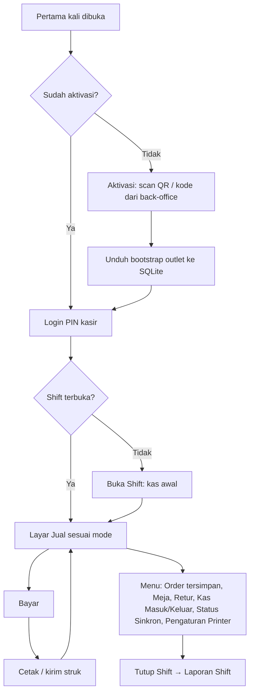

<!-- DIBUAT OTOMATIS dari PRD.md oleh Alat/PecahPrd.py. JANGAN DIEDIT LANGSUNG: ubah PRD.md lalu jalankan ulang skrip. -->

## 17. Arsitektur Klien: Aplikasi POS Flutter & Back-office Web

### 17.1 Pembagian Klien

| Klien | Teknologi | Isi |
|---|---|---|
| **Aplikasi POS {{APP}}** | Flutter | Mode **Kasir** (retail/quick/table/service/wholesale), **Pelayan** (ambil order meja), **KDS**, **Gudang** (GRN, transfer, opname), **Absensi**, **Salesman** (fase 3). Mode ditentukan oleh tipe perangkat & role user. Platform: Android, iOS/iPadOS, Windows. |
| **Aplikasi {{APP}} Owner** | Flutter | Dashboard multi-outlet, laporan ringkas, approval jarak jauh, notifikasi, aksi cepat (§17.3). Platform: Android & iOS. |
| **Back-office Web** | Laravel + Inertia React + TS + Tailwind 4 + TanStack Query | Master data, pembelian, stok, pelanggan, promo, karyawan, keuangan, pajak, laporan, pengaturan, langganan |
| **Web Publik** | React ringan (Inertia/halaman terpisah) | Self-order QR meja, toko online, struk digital, booking |

Satu **design token** (`Spesifikasi/TokenDesain/Token.json`: warna, radius, spacing, tipografi) digenerate menjadi Tailwind `@theme` (web) dan `ThemeExtension` (Flutter), sehingga tampilan brand konsisten.

---

### 17.2 Aplikasi POS Flutter

#### 17.2.1 Arsitektur

**Feature-first + berlapis**: `Tampilan` (widget & controller Riverpod) → `Aplikasi` (use case) → `Domain` (entitas, value object, aturan) → `Data` (DAO Drift, klien API, repositori). Penamaan mengikuti §13.7 (folder & file PascalCase, pengecualian folder wajib Flutter).

```
Aplikasi/Kasir/                     # paket Dart: kasir
├── lib/                            # (wajib Flutter)
│   ├── UtamaDev.dart / UtamaStaging.dart / UtamaProduksi.dart   # flavor (berisi fungsi main())
│   ├── Persiapan.dart              # inisialisasi Sentry, DB, secure storage, DI
│   ├── Aplikasi/
│   │   ├── Rute.dart               # go_router + guard (aktivasi → login PIN → shift)
│   │   ├── Tema/                   # ThemeData + token hasil generate
│   │   └── Bahasa/                 # ARB id/en
│   ├── Inti/
│   │   ├── Uang/                   # Uang, Kuantitas (decimal), FormatRupiah
│   │   ├── Id/                     # ULID, NomorDokumen (per perangkat)
│   │   ├── Hasil/, Galat/, Log/
│   │   └── Platform/               # deteksi platform & kemampuan hardware
│   ├── Data/
│   │   ├── Db/                     # Drift: Tabel/, Dao/, Migrasi/, BasisData.dart
│   │   ├── Api/                    # klien dio, interceptor, DTO (freezed)
│   │   ├── Sinkron/                # Bootstrap, TarikDelta, PengirimOutbox, PenanganKonflik
│   │   └── Repositori/
│   ├── PerangkatKeras/
│   │   ├── Printer/                # PenyusunStruk (ESC/POS), Transport/: Bluetooth/, Usb/, Jaringan/, Vendor/, Sistem/
│   │   ├── Pemindai/               # pendengar HID, pemindai kamera
│   │   ├── LaciKas/
│   │   └── LayarPelanggan/
│   ├── Fitur/
│   │   ├── Aktivasi/  LoginPin/  Shift/  Katalog/  Keranjang/  Pembayaran/
│   │   ├── Pesanan/  Meja/  Kds/  Pelanggan/  Retur/  Kas/
│   │   ├── Gudang/  Absensi/  Persetujuan/  StatusSinkron/  Pengaturan/
│   └── WidgetBersama/              # TeksUang, PapanAngka, PapanPin, PengaturJumlah, ...
├── test/                           # (wajib) unit, widget, golden
├── integration_test/               # (wajib) alur end-to-end di device/emulator
└── pubspec.yaml

Paket/MesinKasir/                   # paket Dart: mesin_kasir (Dart murni, tanpa import Flutter)
├── lib/  KalkulatorKeranjang.dart, KalkulatorPajak.dart, MesinPromo.dart, Pembulatan.dart
└── test/ VektorUji_test.dart       # membaca Spesifikasi/VektorUjiKalkulasi/*.json
```

- `MesinKasir` adalah paket Dart murni. Ia diuji dengan `dart test` di CI tanpa emulator, memakai test vector yang sama dengan Pest (PHP).
- Semua akses database lewat DAO Drift. UI berlangganan **stream query** (misal keranjang, daftar order meja, antrean KDS) sehingga UI otomatis ter-update saat data lokal berubah, termasuk hasil sinkron.

#### 17.2.2 Alur Layar



#### 17.2.3 Layout Adaptif

Layout di bawah adalah isi area kerja **Ruang Kerja Kasir** (§17.2.7): bingkai ruang kerja (bilah atas, rel navigasi, bilah status) selalu ada, dan layar Jual menjadi beranda.

| Lebar layar | Contoh perangkat | Layout |
|---|---|---|
| < 600 dp | HP (pelayan, salesman, kasir mikro) | Satu kolom. Keranjang sebagai bottom sheet. Tombol Bayar menempel di bawah |
| 600–1024 dp | Tablet 8–11", POS Android all-in-one | Dua panel: katalog (kiri) + keranjang (kanan) |
| > 1024 dp | PC Windows, POS all-in-one layar 15" | Dua/tiga panel + **shortcut keyboard** (F1 cari, F2 pelanggan, F8 bayar, F9 uang pas, Esc hapus item) dan dukungan mouse |

```
┌───────────────────────────────────────────────┬──────────────────────────┐
│ [Cari/Scan ______________] [Pelanggan] [≡]    │ Order #K02-0042  Meja 7  │
├───────────────────────────────────────────────┤──────────────────────────│
│ Kategori: [Semua][Kopi][Non-Kopi][Makanan]... │ 2× Es Kopi Susu   36.000 │
│ ┌──────┐┌──────┐┌──────┐┌──────┐              │   · Less sugar           │
│ │ Kopi ││ Latte││ Teh  ││ Roti │  (grid /     │ 1× Croissant      25.000 │
│ │ 18rb ││ 25rb ││ 12rb ││ 25rb │   daftar)    │   Promo Happy Hour -6.000│
│ └──────┘└──────┘└──────┘└──────┘              │──────────────────────────│
│                                               │ Subtotal          55.000 │
│                                               │ Service 5%         2.750 │
│                                               │ PB1 10%            5.775 │
│                                               │ TOTAL             63.525 │
│ ● Online  ⟳ 0 tertunda   Shift: Sari 08:00   │ [Simpan] [Diskon] [BAYAR]│
└───────────────────────────────────────────────┴──────────────────────────┘
```

- Indikator koneksi, jumlah transaksi tertunda, dan status printer **selalu terlihat**.
- Layar bayar: nominal besar, tombol pecahan cepat, pilih metode, split, kembalian besar.
- Target sentuh ≥ 48 dp. Tipografi mengikuti §17.5 (angka tabular untuk uang, font Mono untuk kode). KDS memakai tema terang berkontras tinggi (D-14).
- Mode kiosk: Android *screen pinning*/*lock task* (perangkat terkelola), Windows kiosk/fullscreen, iPad *Guided Access*.

#### 17.2.4 Kinerja

| Metrik | Target (tablet Android kelas bawah, RAM 3 GB) |
|---|---|
| Cold start sampai layar PIN | < 2,5 detik |
| Tambah item ke keranjang | < 50 ms |
| Pencarian produk lokal (10.000 SKU, SQLite FTS5) | < 50 ms |
| Scroll katalog | 60 fps (`ListView.builder`/`GridView.builder`, gambar ter-cache & di-resize) |
| Simpan transaksi + masuk outbox | < 150 ms |
| Ukuran APK (per ABI) | < 35 MB |

- Operasi berat (import bootstrap besar, pembuatan laporan shift) dijalankan di **isolate** terpisah agar UI tidak tersendat.
- Gambar produk diunduh bertahap & di-cache di disk dengan batas ukuran.

#### 17.2.5 Integrasi Hardware (Native)

| Perangkat | Android | iOS / iPadOS | Windows |
|---|---|---|---|
| Printer Bluetooth Classic (SPP, printer 58 mm murah) | ✅ | ❌ (iOS tidak mendukung SPP kecuali printer MFi) | ✅ (via COM port virtual) |
| Printer Bluetooth LE | ✅ | ✅ | ✅ |
| Printer USB | ✅ (USB host) | ❌ | ✅ (driver/spooler RAW) |
| Printer LAN/Wi-Fi (port 9100) | ✅ | ✅ | ✅ |
| Printer bawaan POS all-in-one | ✅ via adaptor vendor (lihat di bawah) | — | ✅ untuk POS all-in-one Windows (driver/COM) |
| Fallback printer sistem (PDF/AirPrint/driver OS) | ✅ (paket `printing`) | ✅ | ✅ |
| Laci kas | Kick via printer (ESC p) atau API vendor | Kick via printer LAN/BLE | Kick via printer |
| Scanner HID (USB/Bluetooth) | ✅ | ✅ | ✅ |
| Scanner bawaan all-in-one | ✅ via adaptor vendor (broadcast/intent atau HID) | — | ✅ (HID) |
| Scanner kamera | ✅ | ✅ | ⚠️ webcam |
| Layar pelanggan | Dual-screen bawaan (presentation display / API vendor) | ⚠️ layar eksternal | Jendela kedua (monitor 2 / VFD via COM) |
| Timbangan | Barcode timbangan (P1). Serial/USB (P3) | Barcode | Barcode, COM port (P3) |
| NFC (kartu member) | ✅ (P3) | ✅ terbatas (P3) | — |

- **Abstraksi `TransportPrinter`** (`BluetoothKlasik`, `Ble`, `Usb`, `Jaringan`, `SdkVendor`, `CetakSistem`) dengan satu `PenyusunStruk` (ESC/POS, lebar 58/80 mm, logo raster, QR struk digital). Tiket dapur dikirim ke printer per *station*.
- Rekomendasi untuk iPad: printer **LAN atau BLE**.
- **Layar pelanggan (v2.01, POS-15; keputusan agen atas mandat D-12):** port `PortLayarPelanggan` di `Paket/AdaptorPerangkat` menerima `IsiLayarPelanggan` berupa teks siap tampil (nama toko, baris item `nama · rincian "2 × Rp…" · nilai setelah diskon baris`, ringkasan diskon pesanan/biaya layanan/pajak eksklusif, label & nilai total, pesan, `DataQr` untuk QRIS dinamis nanti) dengan keadaan `Siaga → Keranjang → Bayar → Selesai`. Adaptor: **Android layar kedua** (`KanalLayarPelanggan.kt`, `Presentation` pada display kategori *presentation*: POS all-in-one dua layar Sunmi T2/D2s, iMin D4, dll. dan monitor HDMI; warna dari token desain dikirim dari Dart, font Atkinson Hyperlegible dari aset aplikasi) dan **layar VFD 2×20** (*pole display*, perintah CD5220 `ESC Q A/B`, ASCII) lewat COM port di Windows. Pengaturan per perangkat di Pengaturan › Layar pelanggan (Tidak dipakai / Layar kedua / HDMI / Layar VFD + COM port) dengan tombol "Tampilkan contoh"; disimpan lokal (`Pengaturan.LayarPelanggan`, tidak ikut data awal). Layar Jual menyiarkan isi hanya bila berubah (setelah frame): item & total mengikuti keranjang, "Silakan lakukan pembayaran" saat panel Bayar terbuka, kembalian + "Terima kasih" setelah bayar, lalu siaga "Selamat datang". Galat layar pelanggan tidak pernah mengganggu transaksi. Mode Pelayan tidak memakai layar pelanggan. **Belum:** jendela kedua di monitor ke-2 Windows, layar eksternal iPad, gambar promo, dan langkah layar kedua di Wizard Uji Perangkat.
- Setiap perangkat menyimpan profil hardware sendiri dan melaporkannya ke server (kolom `Perangkat.ProfilHardware`) untuk dukungan teknis.

#### 17.2.5a Dukungan Semua Perangkat POS All-in-One (Keputusan D-03)

Target: **semua** perangkat POS Android all-in-one yang beredar di Indonesia bisa dipakai, bukan satu merek saja. Karena setiap vendor punya SDK berbeda, dukungan dibangun berlapis di paket `Paket/AdaptorPerangkat`:

```
KemampuanPerangkat (antarmuka)
├── Printer: PortPrinter        (cetak teks/raster/QR, potong kertas, status kertas habis)
├── LaciKas: PortLaci           (buka laci, status laci)
├── LayarPelanggan: PortLayar   (layar kedua: teks/total/QRIS/gambar promo)
├── Pemindai: PortPemindai      (barcode bawaan)
└── Nfc / Timbangan (opsional)

Implementasi (adaptor):
├── AdaptorSunmi        (SDK Sunmi: printer, laci, layar kedua, scanner)
├── AdaptorImin         (SDK iMin)
├── AdaptorPax, AdaptorTelpo, ... (vendor lain, ditambah bertahap)
├── AdaptorPrinterInternalGenerik (banyak perangkat mengekspos printer bawaan sebagai printer
│                                  Bluetooth virtual / port serial / ESC/POS standar)
└── AdaptorAndroidGenerik         (scanner HID + presentation display + printer eksternal)
```

- **Deteksi otomatis:** saat aplikasi pertama dibuka, sistem membaca `Build.MANUFACTURER`/`MODEL` dan memeriksa ketersediaan layanan vendor, lalu memilih adaptor yang cocok. Jika tidak dikenali, dipakai **adaptor generik**, dan pengguna menjalankan **Wizard Uji Perangkat** (tes cetak, potong, laci, layar kedua, scan). Hasil wizard disimpan sebagai profil.
- **Integrasi SDK vendor** dilakukan lewat *platform channel* (Kotlin) di dalam plugin internal. SDK vendor tidak bocor ke kode fitur.
- **Prioritas penambahan adaptor:** P0 = Sunmi, iMin, dan adaptor generik. P1 = vendor lain berdasarkan data pasar & permintaan tenant (telemetri `ProfilHardware` menunjukkan merek yang paling banyak jatuh ke adaptor generik).
- **Hardware Compatibility List (HCL):** daftar publik perangkat & printer dengan status *Tersertifikasi* (diuji di lab), *Kompatibel* (lolos wizard di lapangan), atau *Terbatas*. Diperbarui setiap rilis.
  - **Rincian v1.98 (terisi otomatis dari Wizard Uji Perangkat):** tabel data platform `KompatibilitasPerangkat` (tanpa `IdTenant`) berisi satu baris per model **perangkat** (produsen + model) atau **printer** (sambungan + nama; printer LAN/Wi-Fi dan printer sistem dilewati karena namanya hanya alamat). Disegarkan tiap hari 02.30 WIB (`pengelola:segarkan-kompatibilitas`) dan lewat tombol "Segarkan sekarang" dari `Perangkat.ProfilHardware` perangkat yang belum dicabut, dibaca lintas tenant lewat `KonteksPengelola` (log `tenant.data.akses`). Yang disimpan hanya merek/model, jumlah perangkat & usaha, jumlah uji berhasil/gagal, dan waktu uji terakhir; nama tenant tidak.
  - **Status otomatis:** perangkat lolos bila tidak ada langkah uji yang gagal dan minimal satu berhasil; printer lolos bila cetak berhasil dan potong tidak gagal (laci tidak dinilai, bergantung kabel laci). Belum ada hasil = *Belum diuji*; gagal ≥ berhasil = *Terbatas*; selain itu *Kompatibel*. Model yang tidak lagi dilaporkan angkanya menjadi 0 dan statusnya *Belum diuji*.
  - **Tanda tim** (Platform Pengelola › Kompatibilitas perangkat, lihat `rilis.lihat`, ubah `rilis.kelola`): *Tersertifikasi* (lolos uji lab) atau *Terbatas* (kendala diketahui) dengan catatan wajib yang tampil di publik; mengalahkan status otomatis dan tidak dihapus saat disegarkan. Audit `kompatibilitas.tandai`.
  - **Halaman publik** `/kompatibilitas-perangkat` (tanpa login, `throttle:60,1`): tabel perangkat dan printer (urut Tersertifikasi → Kompatibel → Terbatas), status bertulisan, sambungan printer, catatan tim, dan "dipakai di N usaha"; baris *Belum diuji* tidak ditampilkan.
- **Program mitra hardware:** kerja sama dengan distributor untuk unit uji dan, opsional, bundel perangkat + langganan.
- Perangkat POS all-in-one **berbasis Windows** didukung lewat jalur Windows biasa (driver printer, COM port, monitor kedua/VFD).

#### 17.2.6 Keamanan Aplikasi

- Device token disimpan di **secure storage** (Android Keystore, iOS Keychain, Windows DPAPI).
- Database lokal dienkripsi (**SQLite3 Multiple Ciphers**, kompatibel konsep SQLCipher, lisensi MIT) dengan kunci acak 256 bit di secure storage. Sejak v3.57 **aktif untuk semua perangkat** (lebih ketat dari syarat awal "wajib untuk HP pribadi & paket Bisnis"): satu jalur kode, tanpa sakelar yang bisa lupa dinyalakan. Basis data lama yang polos dienkripsi di tempat saat pertama dibuka; kunci tidak ikut terhapus saat perangkat dicabut karena outbox yang belum terkirim tetap harus terbaca. Aplikasi menolak membuka basis data bila pustaka SQLite yang termuat tidak mendukung enkripsi.
- Hash PIN kasir & supervisor yang tersinkron ke perangkat memakai algoritme lambat (bcrypt/argon2) dan hanya berada di DB terenkripsi. Salah PIN 5 kali mengunci 5 menit.
- Kasir otomatis terkunci (kembali ke layar PIN) setelah tidak aktif N menit.
- Revoke perangkat dari back-office: token ditolak, lalu aplikasi menghapus data lokal **setelah** outbox berhasil terkirim.
- Pinning sertifikat opsional (fase 3). Android: obfuscation (`--obfuscate --split-debug-info`), simbol debug diunggah ke Sentry.

---

#### 17.2.7 Ruang Kerja Kasir (Keputusan D-16)

Aplikasi POS **bukan kumpulan layar**, melainkan **ruang kerja** tempat kasir bekerja 8–12 jam per hari. Targetnya **elegan tetapi tetap mudah**: tenang dilihat berjam-jam, dan kasir baru bisa melayani transaksi pertama tanpa pelatihan panjang.

**Bingkai ruang kerja (selalu ada setelah masuk):**

| Bagian | Isi | Catatan |
|---|---|---|
| **Bilah atas** | **Logo Payoung di tengah**; outlet · perangkat di kiri; nama kasir, jam, tombol **Kunci** di kanan. Latar `BrandGelap`, isi putih (D-29) | Ketuk nama kasir → ganti kasir (PIN) tanpa menutup shift. Di HP (< 600dp) diringkas: ikon merek, kasir & kunci sebagai tombol ikon, tanpa jam |
| **Rel navigasi** (kiri; di HP menjadi bilah bawah) | Jual (beranda) · Order tersimpan · Meja* · Riwayat transaksi · Kas · Pelanggan* · Shift · Pengaturan | Ikon + label, maksimal 8 item, item hanya muncul bila modul/izin aktif (*). Bisa diciutkan menjadi ikon saja. Latar `BrandGelap` sama dengan bilah atas, ikon & label putih, penanda aktif putih 18% (D-29) |
| **Area kerja** | Layar aktif (Jual: katalog + keranjang, §17.2.3) | Tugas rutin (kas masuk/keluar, cari pelanggan, catatan item, diskon) dibuka sebagai **panel samping atau lembar** di atas area kerja, bukan pindah halaman, sehingga keranjang tidak hilang. **Kecuali langkah bayar (D-31):** Bayar, Transaksi selesai, dan Pre-order adalah halaman sendiri yang memakai seluruh area kerja |
| **Bilah status** (bawah) | Koneksi, transaksi tertunda sinkron, printer, shift (jam buka) | Selalu terlihat; ketuk untuk detail (§17.6.6) |

**Prinsip elegan & mudah:**
1. **Tenang untuk mata.** Latar netral `Latar`, panel `Permukaan`, pemisah garis tipis, satu warna brand hanya untuk aksi utama (BAYAR) dan penanda aktif. **Pengecualian D-29:** kulit aplikasi (bilah atas, rel navigasi/bilah bawah, dan panel merek layar masuk) berlatar `BrandGelap`; area kerja, katalog, keranjang, panel, dan dialog tetap netral. Tidak ada animasi berulang, banner berkedip, atau warna jenuh selain status.
2. **Hierarki jelas dalam satu pandangan.** Yang terbesar selalu TOTAL, lalu tombol BAYAR, lalu isi keranjang. Ukuran dari token §17.5 (`Tampilan` untuk TOTAL & kembalian).
3. **Ritme konsisten.** Kisi 8dp, radius 8 panel / 6 kontrol, tinggi baris keranjang tetap, ubin produk seragam dengan **area gambar persegi** di atas (foto nyata atau inisial di atas latar netral bila tanpa foto), jumlah kolom mengikuti lebar area katalog (`UbinProduk.HitungKolom`, v2.67) sehingga grid selalu penuh sampai tepi.
4. **Umpan balik halus tetapi pasti.** Tekan tombol berubah dalam < 100 ms; pindai berhasil/gagal ditandai suara pendek + getar (bisa dimatikan) dan sorot baris keranjang 150 ms; tidak ada toast untuk hal rutin.
5. **Tidak pernah membuat kasir tersesat.** Maksimal dua ketukan dari beranda ke fitur rutin; tombol kembali selalu ke area kerja; tidak ada dialog bertumpuk.

**Kenyamanan kerja berjam-jam:**
- **Kunci cepat & kunci otomatis** saat perangkat diam (bawaan 5 menit, diatur Owner): layar kunci menampilkan nama outlet & jam, buka dengan PIN kasir yang sama atau ganti kasir.
- **Ukuran tampilan per perangkat:** Normal / Besar (skala teks 1,0 / 1,15) dan **posisi keranjang** kiri/kanan (kasir kidal, penempatan layar di meja).
- **Mode layar penuh/kiosk** (§17.2.3) dan layar tetap menyala selama shift terbuka.
- **Input tanpa fokus:** pemindai barcode bekerja di mana pun di layar Jual tanpa perlu mengetuk kolom cari; papan angka besar untuk jumlah & uang; **pintasan keyboard** di desktop (daftar pintasan terlihat lewat `?`).
- **Ingatan kerja:** produk favorit/terlaris outlet di atas katalog, kategori terakhir diingat, keranjang yang belum dibayar selamat bila aplikasi tertutup (tersimpan di SQLite).
- **Tanpa kejutan:** perubahan data dari server (harga, produk) diterapkan di antara transaksi, tidak di tengah keranjang yang sedang dibangun; pesan sistem muncul di bilah status, tidak memotong transaksi.

**Aturan implementasi:**
- Satu widget bingkai `RuangKerja` di `Aplikasi/Kasir/lib/Tampilan/RuangKerja/` membungkus semua layar setelah masuk. Layar fitur hanya mengisi area kerja.
- Komponen visual (ubin produk, baris keranjang, papan angka, panel samping, bilah status) dibuat di `Paket/SistemDesain` agar KDS dan mode Gudang memakai bahasa visual yang sama.
- Setiap layar ruang kerja memiliki test widget di tiga lebar (360, 800, 1280 dp) dan golden test untuk layar Jual & Bayar.
- Layar sebelum ruang kerja terbuka (aktivasi, pilih kasir, buka shift) memakai bingkai bersama `Tampilan/Komponen/BingkaiMasuk` (D-29), bukan `Scaffold` polos per layar.

### 17.3 Aplikasi Mobile Owner (Flutter, Android & iOS) — Keputusan D-04

#### 17.3.1 Tujuan

Owner (dan manajer area/outlet) memantau dan mengendalikan usaha dari HP tanpa membuka laptop: melihat angka hari ini, menerima peringatan, dan menyetujui aksi kasir dari jarak jauh.

#### 17.3.2 Layar Utama

| Tab | Isi |
|---|---|
| **Beranda** | Kartu omzet hari ini (vs kemarin & minggu lalu), laba kotor, transaksi, rata-rata keranjang, grafik per jam, pilih outlet atau "Semua Outlet" |
| **Laporan** | Penjualan per produk/kategori/kasir/channel/metode bayar, laporan shift & selisih kas, L/R sederhana, filter periode cepat. Export dikirim sebagai file/tautan |
| **Persetujuan** | Antrean approval jarak jauh (void, diskon, refund, kas keluar, PO, penyesuaian stok) dengan detail & tombol Setujui/Tolak + alasan. Konfirmasi dengan biometrik |
| **Notifikasi** | Pusat notifikasi (selisih kas, anomali kasir, stok kritis, perangkat offline, piutang jatuh tempo, order online) dengan pengaturan per jenis & per outlet |
| **Lainnya** | Stok & harga (cek, ubah harga, tandai habis), promo (aktif/nonaktif), pengeluaran cepat (foto nota), status perangkat POS, karyawan & absensi, langganan, pengaturan akun |

#### 17.3.3 Arsitektur

```
Aplikasi/Pemilik/                   # paket Dart: pemilik
├── lib/
│   ├── Aplikasi/       # Rute (go_router), tema dari Paket/SistemDesain, Bahasa
│   ├── Fitur/
│   │   ├── Autentikasi/  PilihTenant/  Dasbor/  Laporan/  Persetujuan/
│   │   ├── Notifikasi/  StokCepat/  PromoCepat/  Pengeluaran/
│   │   ├── Perangkat/  Karyawan/  Langganan/  Pengaturan/
│   └── Data/           # Repositori → Paket/KlienApi (/api/pemilik/v1), cache Drift ringan
└── test/ integration_test/
```

- **Online-first dengan cache**: data dashboard & laporan terakhir disimpan di cache lokal sehingga aplikasi terbuka instan dan tetap bisa dibaca saat sinyal lemah (ditandai "terakhir diperbarui"). Aksi (approval, ubah harga) wajib online.
- **Data dashboard** diambil dari tabel ringkasan (`RingkasanPenjualanHarian`, dsb.) + delta hari berjalan agar ringan untuk Hostinger. Refresh: tarik-untuk-refresh, polling 60 detik saat layar aktif, dan push sebagai pemicu.
- **Autentikasi:** login email/WA OTP (+ 2FA bila aktif) → user token Sanctum berumur terbatas + refresh token di secure storage. Aplikasi dikunci dengan PIN/biometrik saat dibuka. Hak akses mengikuti role & outlet yang sama dengan back-office.
- **Push:** token FCM per perangkat user disimpan di tabel `PerangkatPengguna`. Notifikasi approval membawa deep link ke layar persetujuan.
- **Batas cakupan:** pengaturan berat (import, COA, pajak, template sektor, penomoran) tetap di back-office web. Aplikasi menautkan ke halaman web terkait bila perlu.

#### 17.3.4 Endpoint `/api/pemilik/v1` (ringkas)

| Method | Endpoint | Fungsi |
|---|---|---|
| POST | `/masuk`, `/masuk/dua-faktor`, `/keluar` (v2.03; OTP WA & perbarui token menyusul) | Autentikasi |
| GET, POST | `/masuk/google/konfigurasi`, `/masuk/google` (D-57; token ID Google dari `google_sign_in`, menggantikan 2FA) | Autentikasi |
| GET | `/profil` (pengguna + daftar tenant; v2.03), `/outlet` | Profil, pilihan tenant & outlet |
| GET | `/shift?tanggal=&outlet=` (v2.03) | Shift & selisih kas |
| GET | `/dasbor?outlet=&tanggal=` | Kartu KPI + grafik per jam |
| GET | `/laporan/{nama}?saring[...]` | Laporan ringkas |
| GET/POST | `/persetujuan`, `/persetujuan/{id}/setujui`, `/persetujuan/{id}/tolak` | Approval jarak jauh |
| GET/PATCH | `/notifikasi`, `/pengaturan-notifikasi` | Notifikasi |
| GET/PATCH | `/produk/{id}` (harga, 86), `/promo/{id}` (aktif/nonaktif) | Aksi cepat |
| POST | `/pengeluaran` | Pengeluaran + foto nota |
| GET/POST | `/perangkat`, `/perangkat/{id}/cabut` | Status & cabut perangkat POS |
| POST | `/token-notifikasi` | Daftar token FCM |

**Rincian Aplikasi Owner v1 (v2.03, keputusan agen atas mandat D-12):**
- **Token pengguna:** Sanctum belum terpasang, jadi dipakai tabel `TokenAksesPengguna` (IdPengguna, Nama = nama perangkat, Cakupan `pemilik`, HashToken SHA-256 unik, KedaluwarsaPada 30 hari, TerakhirDipakaiPada, DicabutPada) mengikuti pola token perangkat POS; token acak 256-bit hanya ditampilkan sekali. `POST /keluar` mencabut token berjalan; atur ulang kata sandi mencabut semua token pengguna. Token hilang/dicabut/kedaluwarsa → 401 `TokenTidakValid` (aplikasi kembali ke layar masuk). Belum ada refresh token.
- **Masuk:** email + kata sandi (validasi guard web, batas 5/menit per email+IP & 20 per IP → 429 `TerlaluBanyakPercobaan`, email belum terverifikasi 403 `EmailBelumDiverifikasi`, tanpa keanggotaan aktif 403 `TanpaTenantAktif`, salah 422 `KredensialSalah`). Akun ber-2FA → `{PerluDuaFaktor, TokenTantangan}` (hash di cache 5 menit, sekali pakai, hangus setelah 5 salah) lalu `POST /masuk/dua-faktor` dengan TOTP atau kode pemulihan (`KodeSalah`, `TantanganTidakBerlaku`). Audit `pemilik.masuk` / `pemilik.keluar`.
- **Masuk dengan Google (D-57):** `GET /masuk/google/konfigurasi` → `{Aktif, ClientId}` (publik, untuk `serverClientId`); `POST /masuk/google` `{IdToken, NamaPerangkat}` memverifikasi token ke JWKS Google lalu menerbitkan token tanpa tantangan 2FA (`MasukGoogle=true` memenuhi kewajiban 2FA paket). Galat: `401 GoogleTidakSah`, `404 AkunGoogleBelumTerdaftar` (daftar lewat web), `403 WajibGantiKataSandi`, `429 TerlaluBanyakPercobaan` (per IP), `422 ValidasiGagal`.
- **Konteks tenant:** header `X-Tenant: {UuidTenant}` diperiksa tiap permintaan (keanggotaan aktif, akses outlet anggota, 2FA wajib per paket → 403 `DuaFaktorWajib`); asing → 403 `TenantTidakDiizinkan`.
- **Data:** `GET /dasbor` (izin `laporan.penjualan.lihat`): omzet bersih, transaksi, rata-rata, laba kotor (null tanpa `laporan.keuangan.lihat`), omzet kemarin & hari yang sama minggu lalu, per outlet, per jam (zona waktu outlet), 5 produk teratas, **perlu tindakan**: `SelisihKas` (shift ditutup dengan selisih), `PenjualanPerluTinjauan`, dan untuk hari ini `PerangkatTidakAktif` (> 30 menit) & `StokMenipis` (butuh `persediaan.lihat`). `GET /laporan/penjualan?dari&sampai&kelompok=Produk|Kategori|Kasir|Jam|Kanal` (maks. 31 hari, `RentangTerlaluPanjang`), `GET /shift?tanggal` (selisih hanya untuk shift tertutup), `GET /perangkat` (izin `perangkat.lihat`). Semua data dihitung langsung dari dokumen dengan definisi sama dengan dasbor back-office.
- **Aplikasi Owner (Flutter):** masuk (+ kode 2FA), pilih usaha (langsung bila satu), bingkai dengan navigasi bawah **Beranda** (angka omzet besar + perbandingan, lalu perlu tindakan, per outlet, grafik per jam, produk terlaris), **Laporan** (pilih kelompok), **Shift** (selisih berwarna + teks), **Perangkat** (lama tidak tersambung, data belum terkirim, versi); saringan tanggal & outlet; token & tenant aktif di secure storage; keadaan memuat/galat/offline dengan "Coba lagi"; 401 → kembali ke layar masuk.
- **Push & pusat notifikasi (v2.81):** token FCM per pemasangan, deep link approval, lencana belum dibaca, tandai satu/semua dibaca, dan ringkasan terjadwal untuk selisih kas, stok kritis, perangkat offline, serta piutang lewat jatuh tempo. Polling approval 15 detik tetap dipakai sebagai fallback saat FCM terlambat/tidak tersedia.
- **Belum:** OTP WhatsApp, refresh token, kunci PIN/biometrik aplikasi, cache lokal Drift, pengaturan notifikasi per jenis/outlet, aksi cepat, dan cabut perangkat.

#### 17.3.5 Target Kualitas

| Metrik | Target |
|---|---|
| Buka aplikasi sampai dashboard tampil (dari cache) | < 1,5 detik |
| Waktu dari kasir meminta approval sampai notifikasi diterima owner | < 10 detik (bergantung FCM/APNs & cron queue, lihat §14) |
| Crash-free sessions | ≥ 99,5% |

---

### 17.4 Back-office Web

#### 17.4.1 Struktur Folder (di `Aplikasi/Web/`)

```
resources/js/                  # (pengecualian path Laravel/Vite)
├── Aplikasi.tsx               # entry: Inertia bootstrap + QueryClientProvider
├── Halaman/                   # Halaman Inertia back-office (resolver diarahkan ke folder ini)
│   ├── Dasbor/  Katalog/  Persediaan/  Pembelian/  Penjualan/  Perangkat/
│   ├── Pelanggan/  Promo/  Karyawan/  Keuangan/  Laporan/  Pengaturan/
├── Publik/                    # Web publik: PesanSendiri, TokoOnline, StrukDigital, Reservasi
├── Fitur/                     # Hook & komponen per domain (useDaftarProduk, FormProduk, ...)
├── Komponen/Ui/               # shadcn/ui (file hasil CLI: pengecualian)
├── Komponen/                  # TabelData, InputUang, PemilihRentangTanggal, ...
├── TataLetak/                 # TataLetakAplikasi (sidebar), TataLetakAutentikasi, TataLetakPublik
├── Pustaka/                   # KlienApi.ts (fetch + CSRF), KunciKueri.ts, Uang.ts, Format.ts, Izin.ts
├── Tipe/                      # Tipe hasil generate dari PHP (laravel-data) + tipe manual
└── Gaya/Aplikasi.css          # Tailwind 4: @import "tailwindcss"; @theme { ...token... }
```

#### 17.4.2 Pola TanStack Query

```ts
// Pustaka/KunciKueri.ts — pabrik key terpusat
export const KunciKueri = {
  Produk: {
    Daftar: (filter: FilterProduk) => ['Produk', 'Daftar', filter] as const,
    Cari: (kata: string) => ['Produk', 'Cari', kata] as const,
  },
  Perangkat: (idOutlet: string) => ['Perangkat', idOutlet] as const,
  Laporan: (nama: string, filter: FilterLaporan) => ['Laporan', nama, filter] as const,
};

// Fitur/Perangkat/useStatusPerangkat.ts — status perangkat POS (online, outbox tertunda), polling adaptif
export function useStatusPerangkat(idOutlet: string) {
  return useQuery({
    queryKey: KunciKueri.Perangkat(idOutlet),
    queryFn: () => KlienApi.Ambil(`/internal/outlet/${idOutlet}/perangkat`),
    refetchInterval: () => (document.hidden ? 120_000 : 30_000),
  });
}
```

- `staleTime` 30 detik untuk master, 0 untuk data transaksi. `retry` 2 dengan backoff.
- Setelah mutasi Inertia, panggil `queryClient.invalidateQueries` untuk key terkait.

#### 17.4.3 Design System Web

- Token dari `Spesifikasi/TokenDesain` di `@theme` Tailwind 4 (hanya tema terang, D-14), komponen dasar shadcn/ui di `Komponen/Ui/` yang warnanya diturunkan dari token, warna brand per tenant (struk & toko online).
- Komponen wajib: `InputUang`, `TabelData` (lihat di bawah), `PemilihTanggal` & `PemilihTanggalWaktu` (isian `HH/BB/TTTT` yang bisa diketik + kalender; tanpa isian tanggal bawaan peramban), `PemilihRentangTanggal` (preset Hari ini, Kemarin, 7 hari, 30 hari, Bulan ini, Bulan lalu, Tahun ini; kalender dua bulan di desktop, lembar bawah di HP), `PilihanCari` (select ber-cari: daftar terbuka di bawah pemicu tanpa menutupinya, kotak cari, papan ketik ↑/↓/Enter; tanpa select bawaan peramban; setiap dropdown berisi daftar pilihan, termasuk saring tabel & atur kolom, wajib punya kotak cari), `LencanaStatus`, `DialogPersetujuan`, `KeadaanKosong`, `WizardImpor`, `DialogAktivasiPerangkat` (menampilkan QR aktivasi).
- Bahasa Indonesia sederhana, i18n key siap Inggris. Kontras WCAG AA.
- Code splitting per halaman (`import.meta.glob` lazy). Halaman web publik self-order ditargetkan < 150 KB JS gzip.

**`TabelData` (Keputusan D-16).** Semua tabel data di back-office dan Platform Pengelola **wajib** memakai satu komponen `Komponen/TabelData/` yang dibangun di atas **TanStack Table v8** (logika) dan komponen `Table` shadcn/ui (tampilan), dengan data dari **TanStack Query**. Tidak boleh ada `<table>`/`<Table>` yang dirakit sendiri di halaman. Dua pengecualian (§25.2 no. 17): **tabel isian formulir** (setiap baris berisi bidang yang diedit, mis. baris stok awal, bahan resep, pemetaan kolom impor, harga bertingkat) dan **rincian dokumen kecil** (baris jurnal, rincian tagihan, rincian HPP) memakai `Table` shadcn langsung di dalam komponen/form, tetap responsif (gulir horizontal di dalam kartu, tidak pernah gulir halaman). Daftar langkah/checklist ditulis sebagai daftar (`ol`/`ul`), bukan tabel.

| Fitur | Aturan |
|---|---|
| Sumber data | **Mode server** (bawaan, untuk semua daftar yang bisa tumbuh): `useQuery` ke **URL halaman yang sama** dengan header `Accept: application/json` (kunjungan Inertia mendapat halaman + tabel awal sebagai prop; permintaan JSON mendapat `{Data, Meta}`; middleware izin & tenant berlaku sama) dengan `placeholderData: keepPreviousData`; paginasi, urut, dan saring dikerjakan server. **Mode lokal** hanya untuk tabel kecil yang datanya sudah ada di halaman dan dibatasi ≤ 200 baris (baris dokumen, isian form, ringkasan) |
| Kontrak kueri | Parameter URL: `cari`, `urut` (`Kolom` atau `-Kolom`, bisa beberapa dipisah koma), `halaman`, `perHalaman` (25/50/100, maks 100), `saring[Kolom]=nilai`. Respons: `{ Data: [...], Meta: { Halaman, PerHalaman, Total, JumlahHalaman } }`. Server memakai daftar putih kolom urut/saring; kolom tak dikenal diabaikan |
| Keadaan di URL | Pencarian, saring, urut, halaman, dan ukuran halaman tersimpan di URL (bisa dibagikan, tombol Kembali berfungsi). Pencarian di-*debounce* 300 ms |
| Pencarian & saring | Kotak cari global + saring per kolom (pilihan tunggal/banyak dengan jumlah per nilai bila tersedia, rentang tanggal dengan preset, rentang angka). Chip saring aktif + tombol "Hapus semua saring" |
| Urut | Klik kepala kolom (naik → turun → mati); Shift+klik untuk urut bertingkat. Kolom yang bisa diurut ditandai ikon |
| Kolom | Atur kolom tampil/sembunyi dan urutan, disimpan per pengguna per tabel (`localStorage`); kolom pertama (identitas) dan kolom aksi menempel saat digulir horizontal; lebar kolom bisa diubah di desktop |
| Pilih baris & aksi massal | Kotak centang per baris + pilih semua di halaman ini / semua hasil saring; bilah aksi massal muncul dengan jumlah terpilih. Hanya bila flow menyediakan aksi massal |
| Aksi baris | Menu aksi per baris (ikon ⋯) dan klik baris membuka detail bila ada |
| Ekspor | Ekspor CSV/Excel mengikuti saring & urut aktif (dikerjakan server lewat antrean bila > 5.000 baris) bila flow menyediakan ekspor |
| Kinerja | Virtualisasi baris (TanStack Virtual) untuk mode lokal > 100 baris; kepala tabel menempel saat halaman digulir |
| Keadaan | Kerangka baris saat memuat pertama, indikator tipis saat memuat ulang (data lama tetap tampil), kosong (bedakan "belum ada data" dan "tidak ada hasil untuk saring ini"), galat + Coba lagi (§17.6.6) |
| Format | Uang & angka rata kanan `tabular-nums`, kode/nomor dokumen font Mono, tanggal `22/09/2026`, lencana status dengan teks |
| Responsif | Lihat §17.4.4: di layar < 640px baris tampil sebagai daftar bertumpuk |
| Aksesibilitas | Tabel semantik (`th scope`, `aria-sort`), navigasi keyboard, kotak centang berlabel |

#### 17.4.4 Web Responsif (Keputusan D-16)

Semua halaman web (back-office, Platform Pengelola, autentikasi, web publik) **wajib berfungsi dan rapi di semua lebar layar** dari **360px** (HP kecil) sampai **1920px ke atas**, tanpa gulir horizontal halaman.

| Lebar | Perangkat acuan | Aturan |
|---|---|---|
| < 640px | HP | Menu samping menjadi *Sheet*; satu kolom; form satu kolom; dialog menjadi lembar layar penuh dari bawah; tombol aksi utama menempel di bawah; `TabelData` tampil sebagai **daftar bertumpuk** (kolom identitas sebagai judul, 2–3 kolom penting, lencana status, menu aksi), saring dibuka lewat tombol "Saring" (Sheet), aksi massal di bilah bawah |
| 640–1023px | Tablet, laptop kecil | Menu samping bisa diciutkan ke ikon; form dua kolom menjadi satu kolom di bawah 768px; `TabelData` menyembunyikan kolom berprioritas rendah (bisa dimunculkan lewat Atur kolom) dan menggulir horizontal dengan kolom identitas menempel |
| 1024–1535px | Laptop, PC | Tata letak penuh; tabel semua kolom bawaan |
| ≥ 1536px | Monitor lebar | Isi dibatasi lebar baca untuk form & detail (maks ±1280px); tabel boleh memakai lebar penuh |

- Target sentuh ≥ 44px pada perangkat sentuh (`pointer: coarse`) walau dalam mode Ringkas.
- Teks tidak pernah terpotong tanpa cara membaca penuh (tooltip/detail); nama panjang dibungkus atau dipotong dengan elipsis + judul.
- Diuji di tiga lebar acuan **360, 768, 1280px** untuk setiap halaman baru/berubah (tangkapan layar Playwright), selain test komponen Vitest.
- **Kontrol formulir 16px di perangkat sentuh (v2.44).** iOS Safari otomatis memperbesar halaman begitu `<input>`/`<textarea>` dengan `font-size` di bawah 16px mendapat fokus, dan halaman tertinggal ter-zoom. Token teks kita di bawah itu (`--text-isi` 14px, `--text-label` 13px) dan beberapa komponen memasangnya langsung pada input — termasuk kotak cari `cmdk` di setiap dropdown (`text-sm`) dan isian uang (`text-isi`). `Gaya/Aplikasi.css` karena itu memaksa `input`, `textarea`, `select`, dan `[contenteditable]` menjadi 16px di `@media (pointer: coarse)`; di desktop ukuran token tetap. Aturannya sengaja **di luar `@layer`** supaya mengalahkan utilitas Tailwind yang dipasang di komponen. **Dilarang** memakai `maximum-scale=1` atau `user-scalable=no` sebagai jalan pintas: itu mematikan zoom manual (WCAG 1.4.4). Dijaga `Gaya/ZoomInputTes.ts`.

#### 17.4.5 Kotak Tindakan (Keputusan D-23 C, v2.13)

Satu halaman `/kelola/tindakan` (menu "Kotak tindakan" tepat di bawah Beranda) + kartu "Perlu tindakan" di Beranda (5 butir teratas) berisi **semua yang perlu ditindaklanjuti**, urut Penting → Perhatian → Info. Butir dikumpulkan dari **penyedia per domain** (kontrak `PenyediaTindakan`, di-tag di kontainer), sehingga domain tidak saling membaca tabel (aturan #14). Setiap penyedia menyaring butir menurut izin pengguna dan outlet yang boleh diakses.

| Butir | Domain | Tingkat | Selesai bila |
|---|---|---|---|
| Penjualan / retur / isi deposit offline perlu dicek (`PerluTinjauan`) | Penjualan | Penting | Ditandai "sudah dicek" |
| Shift & mutasi kas perlu dicek; shift terbuka > 24 jam | Kasir | Penting/Perhatian | Ditandai / shift ditutup |
| Pemakaian sesi perlu dicek; piutang lewat jatuh tempo; saldo sesi tanpa pelanggan | Pelanggan | Penting/Perhatian | Ditandai / dilunasi |
| Stok kritis (≤ stok minimum) | Laporan (stok) | Perhatian | Stok diisi |
| Faktur pemasok jatuh tempo ≤ 7 hari (lewat = Penting); PO menunggu persetujuan | Pembelian | Penting/Perhatian | Dibayar / disetujui |
| Bulan lalu belum ditutup buku (mulai tanggal 10) | Akuntansi | Perhatian | Periode dikunci |
| Klaim promo pemasok terbuka > 30 hari | Promo | Info | Klaim diterima/dipotong |

- **Tandai sudah dicek**: tabel `TinjauanDokumen` (`IdTenant`, `JenisDokumen`, `UuidDokumen`, `IdPengguna`, `Catatan`, unik per dokumen). Dokumen asli **tidak diubah** (aturan #8; bendera `PerluTinjauan` tetap sebagai jejak), butir hanya menyembunyikan yang sudah punya tinjauan. Idempoten, maks. 200 dokumen per kiriman, diaudit (`tindakan.tinjau`), izin baru `tindakan.tinjau` (Pemilik, Admin, Manajer Outlet, Akuntan). Dokumen tenant lain atau di luar outlet pengguna ditolak.
- Rincian per butir maks. 20 terbaru; sisanya muncul setelah yang tampil ditandai. Pengingat lain tidak bisa ditandai: hilang sendiri saat keadaannya berubah.


#### 17.4.6 Formulir Sederhana (Keputusan D-23 B, v2.14)

Formulir tambah data harian dibuka dalam **mode Sederhana**: hanya isian yang wajib dipahami pemilik usaha kecil, sisanya memakai bawaan yang aman dan ditampilkan sebagai satu kalimat ringkas ("Otomatis: satuan …, pajak …, tampil di kasir, SKU dibuat otomatis"). Tombol "Formulir lengkap" membuka semua isian (tab) tanpa kehilangan isian; pilihan mode diingat per peramban (kenyamanan saja). Mode Ubah selalu lengkap. Galat server pada isian yang hanya ada di formulir lengkap otomatis membuka formulir lengkap.

- **Produk** (tambah): nama, jenis (Barang stok, Menu resep, Jasa, Non-stok; jenis lain di formulir lengkap), harga jual (= harga dasar mulai 1 satuan dasar; perlu izin `produk.harga.ubah`), kategori.
- **Jual sebagai paket sesi** (produk Jasa, fitur `pelanggan.paket-sesi`): jumlah sesi (1–1.000) + masa berlaku hari (opsional). Server membuat produk dan `PaketSesi` (semua layanan Jasa bisa ditukar) dalam **satu transaksi**; kirim ulang dengan `Uuid` produk sama idempoten. Daftar layanan tertentu tetap diatur di menu Paket sesi.
- Formulir lain (pelanggan, pemasok, promo) menyusul dengan pola yang sama bila audit kemudahan menunjukkan isian berlebih.

#### 17.4.7 Mulai Jualan dalam 5 Menit (Keputusan D-23 A, v2.15)

- **Siapkan semuanya otomatis** (langkah Sektor): satu klik menjalankan dalam satu transaksi: terapkan template sektor → konfirmasi pajak outlet dengan usulan yang sama seperti halaman Pajak (dilewati bila PBJT diusulkan tetapi kota outlet belum diisi, atau pajak sudah dikonfirmasi) → tambah semua produk contoh template yang belum ada dengan harga saran, sebatas sisa kuota SKU paket → tandai langkah Produk (bila ada produk) dan Metode pembayaran (Tunai selalu ada) selesai → buka langkah Perangkat. Diulang tidak menggandakan produk. Pesan hasil menyebut yang perlu diperiksa (pajak, kuota).
- **Tempel daftar** (langkah Produk): teks dari Excel/Google Sheets (kolom Tab/`;`/`|`: Nama, Harga, Kategori) atau pesan WhatsApp (harga di akhir baris: `15.000`, `Rp5.000,-`, `12rb`, `2,5k`) diurai di peramban menjadi baris tambah produk cepat (maks. 20 per simpan); baris tanpa nama/harga dan kategori yang belum ada dilaporkan. Harga tidak pernah dihitung dengan float.
- Impor dari foto menu (AI/OCR) menunggu keputusan pemilik produk soal layanan berbayar.

#### 17.4.8 Otomatisasi Terjadwal (Keputusan D-23 D, v2.17)

**Bagian 1 — draf pesanan pembelian otomatis (F-04).**
- Kebutuhan dihitung per (lokasi stok, produk) yang punya stok minimum: kritis bila saldo ≤ minimum. Jumlah dipesan = target − saldo − sisa PO terbuka (Draf, Menunggu persetujuan, Disetujui, Diterima sebagian; dalam satuan dasar), target = stok maksimum bila diisi dan > minimum, selain itu 2 × minimum.
- Pemasok, satuan, dan harga dari pembelian terakhir produk itu (penerimaan barang diposting yang berpemasok, lalu PO yang tidak dibatalkan). Jumlah dibulatkan ke atas ke satuan pembelian itu (pecahan hanya untuk satuan dasar produk yang boleh desimal). Produk tanpa riwayat pembelian atau pemasoknya nonaktif dilaporkan, tidak dibuatkan draf.
- Satu draf per (lokasi, pemasok) lewat Aksi yang sama dengan draf manual (nomor, PPN masukan, audit); kolom `PesananPembelian.DibuatOtomatis` = true, catatan menjelaskan asalnya. Draf **tidak pernah diajukan otomatis**; pemilik memeriksa lalu mengajukan (persetujuan tetap mengikuti batas §19.2).
- Jadwal `pembelian:draf-po-otomatis` pukul 05.30 WIB atas nama Owner tenant, hanya bila pengaturan pembelian "Siapkan draf pesanan pembelian otomatis" aktif (bawaan aktif). Tombol "Siapkan draf dari stok menipis" di daftar pesanan pembelian menjalankannya kapan saja (izin `pembelian.kelola`, dibatasi outlet pelaku). Menjalankan ulang tidak menggandakan karena PO terbuka sudah dihitung.
- Kotak Tindakan: butir "Draf pesanan untuk stok menipis" (Perhatian) selama draf otomatis belum diajukan.

**Bagian 2 — transaksi kas & bank berulang (F-13a).**
- Formulir "Catat transaksi kas & bank" punya pilihan **Ulangi otomatis**: tidak / tiap bulan / tiap minggu. Transaksi pertama dicatat seperti biasa; tabel baru `JadwalKasBank` menyimpan pola (jenis, outlet, akun, jumlah, keterangan, `TanggalAcuan`, `TanggalBerikutnya`, `Aktif`, `JumlahDicatat`, `GalatTerakhir`).
- Bulanan mengikuti tanggal acuan; tanggal 29–31 menjadi hari terakhir bulan pendek lalu kembali ke tanggal acuan. Mingguan tiap 7 hari.
- Jadwal `akuntansi:jalankan-jadwal-kas-bank` pukul 05.45 WIB mencatat setiap jatuh tempo s.d. tanggal bisnis hari ini (tanggal transaksi = tanggal jatuh tempo; tertinggal disusul, maks. 12 per jadwal per putaran) lewat Aksi `SimpanTransaksiKasBank` yang sama (nomor KB, jurnal seimbang, audit, atas nama pembuat jadwal). `TransaksiKasBank.IdJadwalKasBank` unik per tanggal sehingga tidak pernah dobel.
- Ditolak aturan bisnis (periode terkunci, akun nonaktif): jadwal tidak dimajukan, alasan di `GalatTerakhir`, butir Kotak Tindakan "Transaksi rutin gagal dicatat otomatis" (Penting, izin `akuntansi.kelola`).
- Halaman `/kelola/akuntansi/kas-bank/berulang` (TabelData): hentikan / aktifkan lagi (tanggal yang terlewat selama berhenti tidak disusul), ubah jumlah (misal sewa naik); transaksi yang sudah tercatat tetap append-only.

**Bagian 3 — tutup harian otomatis (F-15).**
- Jadwal `kasir:tutup-harian-otomatis` pukul 06.15 WIB memeriksa 14 hari terakhir tiap outlet aktif (sama dengan halaman Tutup harian) dan menutup hari yang **aman**: tanggal bisnis sudah berakhir, belum ditutup, ada minimal satu shift dan semuanya sudah ditutup, serta tanpa peringatan (perangkat belum sinkron sejak hari berakhir, penjualan perlu ditinjau).
- Penutupan lewat Aksi `TutupHarianOutlet` yang sama (ringkasan dihitung ulang & dicuplik, audit) atas nama Owner tenant, dengan `TutupHarian.DitutupOtomatis` = true; daftar tutup harian menampilkan "otomatis" menggantikan nama penutup.
- Hari dengan shift terbuka, peringatan, atau tanpa shift dibiarkan untuk ditutup manual (pengingat shift lupa ditutup & penjualan perlu dicek sudah ada di Kotak Tindakan). Menjalankan ulang tidak menggandakan.
- Tutup bulan / kunci periode **tidak** dijalankan otomatis karena berdampak ke pembukuan dan butuh tinjauan Akuntan; tetap sebagai pengingat (keputusan agen, D-12).

**Bagian 4a — ringkasan pagi Kotak Tindakan lewat email.**
- Jadwal `tindakan:kirim-ringkasan-harian` pukul 07.00 WIB (setelah otomatisasi pagi) mengirim email teks berisi butir **Penting & Perhatian** Kotak Tindakan menurut izin & outlet akses penerima, masing-masing dengan tautan langsung ke halaman penyelesaiannya (domain tenant). Butir Info tidak ikut; tanpa butir = tidak ada email.
- Tabel `LanggananRingkasanTindakan` (`IdTenant`, `IdPengguna`, `Aktif`, `TerakhirDikirim`): Owner tanpa baris dianggap berlangganan, anggota lain memilih sendiri lewat sakelar "Kirim ringkasan ke email saya setiap pagi" di halaman Kotak Tindakan (tercatat audit). Anggota tanpa email (kasir PIN, D-22) tidak bisa berlangganan.
- Paling banyak sekali per tanggal bisnis per penerima; email yang gagal terkirim dicoba lagi pada putaran berikutnya. Email tidak memuat data pribadi pelanggan (hanya judul, jumlah, total).

**Bagian 4b — pengingat piutang ke pelanggan (F-12).**
- Daftar piutang punya aksi baris **Kirim pengingat** (izin `pelanggan.kelola`) dan tombol **Pengingat otomatis** (aktif/mati, 0/1/2/3/5/7/14 hari sebelum jatuh tempo, sekali lagi setelah lewat). Kolom "Pengingat" menampilkan status & kanal pengingat terakhir.
- Kanal dipilih otomatis: WhatsApp bila nomor HP pelanggan sah dan WhatsApp aktif untuk usaha (integrasi P-05 + fitur `integrasi.whatsapp`), selain itu email pelanggan. Tanpa kontak = ditolak (manual) atau dilewati (otomatis). WhatsApp Cloud API memakai templat utilitas `NamaTemplatPengingatPiutang` (4 variabel: toko, nomor nota, sisa, jatuh tempo); tanpa templat dikirim teks.
- Jadwal `pelanggan:kirim-pengingat-piutang` pukul 09.00 WIB (jam wajar untuk pelanggan): piutang terbuka berpelanggan yang jatuh tempo dalam `HariSebelum` hari ke depan diingatkan sekali; yang lewat 1–7 hari diingatkan sekali lagi. Sekali per (piutang, jenis) lewat `PengingatPiutang.KunciOtomatis` unik. Manual paling sering sekali per 12 jam per nota.
- Isi sopan tanpa ancaman ("Abaikan pesan ini bila sudah dibayar"); piutang yang sudah lunas/batal saat akan dikirim → `Dibatalkan`, pelanggan tidak ditagih. Tujuan terenkripsi, tidak ikut payload antrean, log, atau respons. Dasar pemrosesan data pribadi: pelaksanaan perjanjian jual-beli tempo (UU 27/2022 PDP Pasal 20 ayat 2 huruf b), bukan pemasaran, sehingga tidak bergantung pada `SetujuPemasaran`.

#### 17.4.9 Fitur di luar paket: dialog naik paket / add-on (Keputusan D-23, v2.22)

- Menu back-office **tidak disembunyikan per fitur paket** (izin peran tetap menyaring). Sub-menu yang mewakili fitur paket (daftar harga, stasiun dapur/KDS, paket sesi, transfer stok, opname, pesanan pembelian, tier & loyalti, promo & klaim pemasok, deposit, komisi, akuntansi penuh: jurnal, buku besar, neraca saldo, neraca, arus kas, tutup buku, bagan & pemetaan akun) tampil dengan ikon gembok bila fitur itu tidak aktif untuk tenant.
- Klik sub-menu bergembok membuka dialog: "{fitur} belum termasuk paket {paket saat ini}", paket aktif termurah (urutan terendah) yang memuat fitur itu beserta harga bulanan berlaku (paket berharga negosiasi tanpa harga), dan add-on aktif yang membukanya. Pemilik (izin `langganan.kelola`) mendapat tombol **Lihat paket {nama}** (membuka Langganan dengan paket itu terpilih lewat `?paket=KODE`) dan **Minta add-on {nama}**; anggota lain diminta menghubungi Pemilik.
- **Minta add-on** (`POST /kelola/langganan/addon`, izin `langganan.kelola`) membuat tiket dukungan kategori Akun & langganan berisi add-on, harga, dan fitur; tim platform mengaktifkannya (override/add-on) lalu menagih. Sejak v4.60 (D-49) pembelian add-on mandiri tersedia (tagihan prorata, aktif setelah lunas); tiket ini hanya jalur cadangan.
- Data dari props bersama `FiturPaket` (`NamaPaket`, `Terkunci` per kunci fitur) yang dihitung dengan `EvaluatorFitur` (paket, override, add-on, flag) sehingga sama dengan pemeriksaan server.
- Ini lapisan UX. Rute yang sudah menjaga fitur (mode meja, KDS, self-order, WhatsApp, promo) tetap menolak di server; penegakan untuk rute lain menunggu keputusan pemilik produk karena tenant lama mungkin sudah memakai fitur di luar paketnya.

#### 17.4.10 Anggaran & Peta Navigasi (Keputusan D-27, v2.42)

**Masalah yang diperbaiki:** navigasi tumbuh satu flow demi satu flow tanpa ada yang memegang peta keseluruhannya. Menu samping sempat berisi **77 tautan** dengan **18 entri di level utama** dan grup berisi sampai **10 sub-menu**, diurutkan mengikuti modul kode (Produk, Persediaan, Pembelian, Akuntansi) alih-alih pekerjaan pengguna. Sebaliknya ada halaman yang tidak punya entri menu sama sekali (profil usaha). Penjaga yang sudah ada hanya mengawasi piksel — token warna, `TabelData`, keadaan wajib, responsif — dan **tidak satu pun mengawasi struktur**, sehingga setiap penambahan menu selalu lolos semua pengecekan.

**Anggaran navigasi** (dijaga `resources/js/TataLetak/AnggaranNavigasiTes.ts`):

| Aturan | Batas |
|---|---|
| Entri di level utama menu samping | maksimal 12 |
| Sub-menu per grup | maksimal 7 |
| Sub-menu minimum per grup | 2; kurang dari itu jadikan item biasa |
| Satu halaman satu rumah | tautan di menu samping tidak boleh juga ada di Pengaturan |
| Tautan kembar di menu samping | tidak boleh |

**Urutan menu mengikuti frekuensi pakai, bukan urutan modul:** Beranda, Kotak tindakan, Penjualan & kasir, Laporan, Persediaan, Produk, Pembelian, Pelanggan, Karyawan, Akuntansi, lalu **garis pemisah**, Pengaturan, Bantuan.

**Halaman yang diatur sekali lalu jarang disentuh tidak ada di menu samping.** Rumahnya `/kelola/pengaturan` (F-01), daftarnya `resources/js/Pustaka/DaftarPengaturan.ts`: master katalog (Satuan, Pilihan/modifier, Kelompok pajak, Daftar harga, Stasiun dapur), pengaturan modul (kasir, struk, kategori kas, gerbang pembayaran, persediaan, pembelian), penyiapan stok (Stok awal & impornya), Tier & Pengaturan loyalti, Aturan komisi, Bagan & Pemetaan akun, Outlet & gudang, Pengguna & peran, Perangkat kasir, Log audit, Langganan, dan Keamanan akun.

**Pencarian cepat tetap memuat semuanya.** `SusunPencarian` membaca menu samping **dan** daftar Pengaturan, jadi Ctrl+K tetap menemukan halaman yang keluar dari menu samping (dijaga test). Menu **Pengaturan** menyala saat halaman yang rumahnya di sana dibuka, termasuk `/kelola/peran` dan `/kelola/keamanan/pin`, supaya menu samping tetap menunjukkan posisi pengguna.

**Perubahan grup:**
- "Shift & kas" **digabung ke "Penjualan & kasir"**. Setelah pengaturan kasir/struk/kategori kas/gerbang pindah, grup itu hanya menyisakan Shift kasir & Tutup harian — yang menjawab pertanyaan sama dengan daftar penjualan: apa yang terjadi di kasir.
- Laporan keuangan (Laba rugi, Neraca, Arus kas) **pindah dari Akuntansi ke Laporan**, karena pemilik mencarinya sebagai laporan, bukan sebagai pekerjaan pembukuan. **Akuntansi** menyisakan pekerjaan pembukuannya: Jurnal, Kas & bank, Buku besar, Neraca saldo, Tutup buku.
- **Keamanan akun** pindah dari footer menu samping ke **menu akun di kanan atas**, tempat orang mencari pengaturan akunnya; di sana bersama Ganti kata sandi (D-22).

**Jejak halaman, bukan remah roti di kepala.** Remah roti pindah dari bilah atas ke **paling atas isi halaman**, di atas `<h1>`, sebagai `JejakHalaman` (`aria-label="Jejak halaman"`). Isinya induk halaman saja — nama usaha, lalu grup menunya; untuk halaman yang rumahnya di Pengaturan, **tautan Pengaturan** beserta nama grupnya (`/kelola/peran` ikut grup Pengguna & peran). Halaman saat ini tidak diulang karena sudah menjadi `<h1>`. Tanpa ini halaman yang keluar dari menu samping tidak punya satu pun petunjuk letak maupun jalan kembali — justru memperburuk orientasi yang mau diperbaiki. Bilah atas menyisakan tombol menu, pencarian cepat, dan menu akun. Kepala Platform Pengelola tidak berubah (`KepalaTataLetak remah` tetap `true` di sana). **Halaman tidak boleh merender remah roti sendiri (v2.48):** jejak dari tata letak sudah memakai `aria-label="Jejak halaman"`, jadi remah roti kedua menghasilkan dua landmark navigasi bernama sama dan dua jejak bertumpuk. Halaman rincian menyambung jejaknya lewat prop `jejak` pada `TataLetakAplikasi` (misal `[{ label: 'Semua outlet', href: '/kelola/outlet' }]`); penanda dokumen seperti kode outlet atau nomor tiket tetap tampil di halaman sebagai teks, bukan sebagai langkah jejak. Dijaga `JejakHalamanTes`.

**Halaman Pengaturan punya kotak cari (v2.44).** 25 butir di 8 grup terlalu banyak untuk dipindai mata. Pencariannya mencocokkan nama grup, label, **dan keterangan** sekaligus (mengetik "pajak" ikut menemukan butir yang hanya menyebut pajak di keterangannya), tidak membedakan huruf besar/kecil, dan tidak pernah menembus penyaringan izin. Logikanya `SaringPengaturan()` di `Pustaka/DaftarPengaturan.ts` — fungsi murni supaya bisa diuji tanpa merender halaman. Hasil kosong memberi pesan yang bisa ditindaklanjuti (tanpa ilustrasi, karena ini hasil saring, bukan data kosong) dan jumlah hasil dibacakan lewat `aria-live`.

**Alat impor massal ikut di Pengaturan, bukan di menu harian (v2.45).** Impor produk dan Impor stok awal sama-sama tinggal di Pengaturan, karena keduanya dipakai saat menyiapkan atau memperbarui data secara borongan — bukan kerja harian. Sebelumnya Impor stok awal pindah tetapi Impor produk tertinggal di grup Produk, tanpa alasan yang bisa dipertahankan. **Syaratnya:** setiap alat impor wajib tetap punya tombol di halaman subjeknya ("Impor dari Excel" di halaman Produk dan halaman Stok awal), karena di situlah orang mencarinya; tombol itu bagian dari keputusan ini, bukan hiasan, dan dijaga `AnggaranNavigasiTes`.

**Tombol aksi halaman selalu rata kanan (v2.46).** Sebelumnya tiap halaman daftar merakit baris aksinya sendiri: sebagian memakai `justify-between` (tombol di kanan), sebagian hanya `<div>` biasa (tombol di kiri), sehingga posisi tombol "Tambah" berpindah-pindah antar halaman. Sekarang barisnya memakai `Komponen/Kelola/AksiHalaman`: keterangan di kiri, aksi rata kanan lewat `ml-auto` — bukan `justify-between`, supaya tetap kanan walau keterangannya tidak diisi. Sejak v2.47 **tidak ada lagi** tombol utama di bilah alat `TabelData` (`aksiAlat`): 17 halaman yang menitipkannya di sana dipindah ke baris sendiri, karena letaknya sebaris dengan kotak cari & Ekspor membuat tingginya berbeda dari halaman lain dan tombolnya bisa terkubur saat bilah membungkus di HP. Bilah alat kini hanya untuk kontrol yang bekerja pada isi tabel. Semua 37 halaman daftar memakai `AksiHalaman`. **Bukan termasuk** tombol simpan di dalam `<form>` (tetap rata kiri, dan di bawah 640px menempel di bawah, §17.4.4) serta tautan navigasi seperti "Kembali ke …". Dijaga `AksiHalamanTes`: tidak boleh ada tombol Tambah/Buat yang dibungkus `<div>` telanjang di atas tabel.

**Hasil:** 12 entri level utama (dari 18) dan maksimal 7 sub-menu per grup (dari 10), tanpa satu pun halaman dihilangkan.


#### 17.4.11 Primitif & Token yang Dijaga (Keputusan D-28, v2.52)

**Masalah yang diperbaiki:** aturan desain sudah ada di §17.5 & §17.6, tetapi yang menjaganya di CI hanya warna,
kursor, dan ketebalan kepala tabel. Akibatnya tiga hal melenceng tanpa tertangkap siapa pun:

1. **Kelas tipografi yang tidak ada.** `text-judul-kecil` dipakai di 9 heading (Pelanggan › Detail, Saldo sesi ›
   Detail) dan `text-body` di 1 tempat (Pembayaran › Gerbang), padahal `--text-judul-kecil` dan `--text-body`
   tidak pernah ada di `@theme`. Tailwind tidak mengeluh untuk kelas yang tidak dikenal — kelasnya hanya diam-diam
   tidak menghasilkan apa pun, jadi heading itu turun ke ukuran warisan dan berbeda dari panel di halaman lain.
   Keduanya kini memakai token yang memang dipakai 80 heading lain: `text-subjudul font-semibold text-teks-utama`
   (heading bagian) dan `text-isi` (teks isi).
2. **Dua API tombol hidup bersamaan.** `Komponen/Formulir/Tombol` memberi spinner, label "Memproses…",
   `aria-busy`, tinggi `h-8 pointer-coarse:h-11`, dan `text-label font-semibold`; `Button` shadcn mentah tidak
   memberi satu pun dari itu dan memakai `text-sm font-medium`. Tombol Simpan di sebagian dialog karena itu hanya
   redup tanpa tanda proses, dan tingginya beda dengan tombol di halaman sebelahnya. **52 tombol aksi bisnis di 25
   berkas** dipindahkan ke `Tombol`, termasuk `Komponen/Tindakan/DialogKonfirmasi` yang dipakai semua dialog
   konfirmasi (sebelumnya menyalin sendiri `aria-busy` + "Memproses…" tanpa spinner). `Button` mentah **tetap sah**
   untuk yang bukan aksi bisnis: tautan navigasi (`asChild`), pemicu Popover/Sheet, chip saring bilah alat, tombol
   ikon.
3. **Tidak ada pola ruang aman tepi bawah.** Sembilan bilah menempel di `bottom-0` (bilah aksi massal `TabelData`,
   banner persetujuan cookie, bilah simpan editor situs, keranjang self-order, bilah aksi opname/transfer/
   penyesuaian, bilah daftar harga) tanpa satu pun memperhitungkan `env(safe-area-inset-bottom)`. Di iPhone
   berlayar penuh area itu milik indikator home, jadi tombol "Simpan"/"Bayar" tertimpa indikator dan sulit diketuk
   karena sapuan sistem menang.

**Aturannya sekarang:**

- Di luar `Komponen/Ui/` (keluaran CLI shadcn), **setiap kelas `text-*` wajib berasal dari token `@theme`** —
  ukuran (`--text-*`) atau warna (`--color-*`) — kecuali utilitas yang memang bukan keduanya (perataan, `balance`,
  `ellipsis`, dan sejenisnya). Ukuran Tailwind mentah (`text-sm`, `text-xs`) hanya boleh di `Komponen/Ui/`.
- **Tombol aksi bisnis memakai `Tombol`.** Dilarang `<Button type="submit">` mentah di mana pun, dan footer
  `DialogFooter`/`AlertDialogFooter`/`SheetFooter` hanya boleh memuat `Tombol` atau tautan `asChild`.
- **Setiap elemen `fixed`/`sticky` di `bottom-0` memakai kelas `tepi-bawah-aman`**, yang menambahkan
  `env(safe-area-inset-bottom)` pada padding bawah di bawah 640px. Ketiga blade aplikasi memakai
  `viewport-fit=cover`, karena tanpa itu `env()` selalu 0 di iOS. `maximum-scale`/`user-scalable` tetap dilarang
  (WCAG 1.4.4, §17.4.4).

Ketiganya dijaga test: `Gaya/AturanTipografiTes.ts`, `Komponen/Formulir/AturanTombolTes.ts`, `Gaya/TepiAmanTes.ts`.
Aturan lama (`AturanWarnaTes`, kursor, kepala tabel) tetap berlaku.

**Dokumen legal & teks kaya (v2.53).** Tiga hal lagi yang melenceng dari desainnya sendiri:

4. **Isi Markdown dirender sebagai teks mentah.** `DokumenLegal.Isi` memang Markdown (§13.6) dan editornya berlabel
   "Isi dokumen (Markdown)", tetapi halaman publik merender `{Dokumen.Isi}` dengan `whitespace-pre-wrap` — jadi `#`
   dan `-` tampil sebagai tanda baca dan dokumen belasan pasal jadi satu dinding teks. Repo sudah punya kontraknya:
   `Komponen/Situs/TeksKaya`, yang dipakai artikel blog & blok situs. Ia dipakai sekarang untuk halaman legal publik
   **dan** pratinjau di konsol, dan diperluas seperlunya: `# ` → `h2`, `### ` → `h4`, daftar bernomor `1. ` (nomor
   awal dipakai apa adanya supaya pasal yang dikutip sebagian tetap benar). `## ` **tidak diubah** — tetap `h3` —
   supaya artikel blog yang sudah terbit tidak berubah tampilannya. `TeksKaya` tidak merender HTML sama sekali
   (React meng-escape, tautan disaring), jadi isi dari konsol tidak bisa menyuntikkan skrip ke halaman publik.
   Label editornya kini menyebut sintaks yang benar-benar didukung, bukan "Markdown" yang menjanjikan lebih banyak.
5. **Halaman legal keluar dari identitas situs.** Alamatnya di domain pemasaran dan pengunjung sampai ke sini dari
   kaki situs, tetapi halamannya berdiri sendiri tanpa kepala & kaki — tidak ada jalan kembali. Karena ketiga entry
   point punya bundle & root view sendiri (`Aplikasi.tsx`, `Pengelola.tsx`, `Situs.tsx`) dan perantaranya
   membagikan prop yang berbeda, memakai `TataLetakSitus` dari `Halaman/Publik/` akan **mematikan halamannya**:
   `props.Situs` tidak pernah dibagikan `BagikanDataInertia`. Jadi halamannya pindah ke `Halaman/Situs/DokumenLegal`
   dan rutenya pindah ke grup situs (`BagikanDataSitus`, root view `Situs` dengan meta SEO dari server).
6. **`rows` pada `Textarea` tidak berpengaruh.** `Textarea` shadcn memakai `field-sizing-content`, yang membuat
   tinggi kotak mengikuti isinya dan mengabaikan `rows`. `BidangTeksPanjang`, `BidangDaftarTeks`, dan
   `BidangNomorSeri` sudah menambahkan `field-sizing-fixed`, tetapi editor dokumen legal (`rows={20}`) dan Tagihan ›
   Detail (`rows={3}`) memakai `Textarea` mentah tanpa itu — jadi pengelola menyunting dokumen belasan pasal lewat
   kotak setinggi dua baris. Editor legal kini memakai `BidangTeksPanjang` (prop `kode` baru untuk font Mono,
   sejajar `BidangTeks`), dan Tagihan › Detail memakai kelas yang sama.

Tiga penjaga tambahan: `TataLetak/AturanBundelTes.ts` (tata letak cocok dengan folder & bundle halamannya),
`Komponen/Formulir/AturanBidangTes.ts` (`Textarea` ber-`rows` wajib `field-sizing-fixed`), dan kasus baru di
`Komponen/Situs/SitusTes.tsx` untuk judul bertingkat & daftar bernomor.

**Satu permukaan panel (v2.54).** Pola panel bagian halaman ditulis ulang di **tiga tempat** dengan kelas yang
berbeda-beda:

7. `Komponen/Katalog/PanelKatalog` — komponen yang sudah benar, tetapi bernama domain padahal dipakai **40 berkas**
   di luar katalog (Persediaan, Kasir, Produk, Pembelian, …), jadi halaman lain tidak merasa boleh memakainya.
   Dua berkas malah mendefinisikan **fungsi `Panel` lokalnya sendiri** — `Komponen/Laporan/DasborPemilik` dan
   `Halaman/Pengelola/Tenant/Tampil` — struktur sama persis, hanya lupa `rounded-panel` & `shadow-none`. Ditambah
   itu, **45 dari 96 `Card` mentah** memakai bawaan shadcn (`rounded-xl`, `shadow-sm`). Akibatnya halaman yang
   fungsinya serupa punya radius dan elevasi berbeda, dan sebagian tampak dibuat di periode desain yang lain.

**Aturannya sekarang:** `Komponen/Kelola/Panel` adalah satu-satunya panel bagian halaman back-office —
`rounded-panel`, tanpa bayangan, judul `text-subjudul font-semibold` yang sekaligus menjadi nama `region` sehingga
pembaca layar bisa melompat antar bagian (`tingkat="h3"` bila panel berada di bawah judul bagian lain). Tanpa
`judul`, ia hanya permukaan berpadding; `keterangan` & `aksi` **tidak tersedia** di bentuk itu (tipe union
mencegahnya), karena keduanya tinggal di kepala panel dan akan hilang tanpa diketahui. Setiap `Card` yang dipakai
langsung wajib membawa `rounded-panel` **dan** `shadow-none`, dan **dilarang mendefinisikan komponen `Panel`
tandingan** di berkas lain. Dijaga `Komponen/Kelola/PanelTes.tsx`.

Yang **belum** diseragamkan dan disengaja: padding & kerapatan (`p-4` vs `py-6` vs `px-4 py-3`) masih beragam di
`Card` yang dipakai langsung. Menyeragamkannya mengubah tata letak 27 berkas yang tidak bisa diperiksa mata di sesi
ini, jadi yang diseragamkan dulu permukaannya — radius & elevasi, yang justru jadi sebab halaman terasa dari era
berbeda. Padding ikut rapi sendiri saat halamannya pindah ke `Panel`.

**Token ukuran teks yang dibuang `cn` (v2.55).** `cn` memakai tailwind-merge, yang tidak bisa membedakan
`text-<ukuran>` dari `text-<warna>` kecuali diberi tahu — `Komponen/Ui/utils.ts` karena itu mendaftarkan token
tipografi. Tetapi daftarnya hanya memuat skala back-office (`tampilan`, `judul`, `subjudul`, `isi`, `label`,
`keterangan`); **tujuh token skala situs** yang ditambah untuk D-21/D-25 (`sorotan-besar`, `sorotan-besar-hp`,
`sorotan`, `sorotan-hp`, `judul-bagian`, `judul-bagian-hp`, `pengantar`) tidak pernah didaftarkan. Akibatnya
tailwind-merge menganggapnya warna teks dan **membuang ukurannya**:
`cn('text-sorotan-besar-hp text-teks-utama sm:text-sorotan-besar')` keluar tanpa ukuran dasar sama sekali — jadi
judul hero & judul bagian situs pemasaran di **HP** turun ke ukuran warisan, sementara ukuran `sm:` di layar lebar
tetap berlaku. Bug ini lolos uji 1280px dan hanya terlihat di 360px (D-16). Ketujuh token didaftarkan, dan
`Gaya/TokenGabungKelasTes.ts` menurunkan daftarnya langsung dari `Aplikasi.css`, jadi token baru yang lupa
didaftarkan gagal di test.

**Judul halaman & tepi bawah (v2.55).**

8. **`<h1>` ditulis ulang per halaman (UI-14).** Kelima tata letak memakai `text-judul font-bold text-teks-utama`,
   tetapi halaman yang berdiri sendiri menulis kombinasinya sendiri: QR meja & cetak pesanan `font-semibold`,
   reservasi publik lupa `text-teks-utama` sehingga warnanya ikut warisan. Semua judul halaman kini lewat
   `Komponen/Umpan/JudulHalaman` — satu-satunya tempat `<h1>` didefinisikan. Skalanya lewat prop eksplisit
   (`halaman`, `situs`, `ringkas`), **bukan** ditimpa lewat `className`, karena menumpuk dua kelas ukuran membuat
   hasilnya bergantung urutan CSS. Satu pengecualian tercatat: `Komponen/Situs/Bagian/BagianHero` memilih
   `h1`/`h2` menurut posisi bloknya, dan tingkat yang bergantung posisi tidak bisa diungkapkan komponen itu.
9. **Banner cookie menutupi tombol WhatsApp (UI-10).** Banner `fixed bottom-0 z-50` dan tombol WhatsApp melayang
   `fixed bottom-4 z-30` memakai area bawah yang sama, jadi tombolnya tertutup sampai pengunjung memilih.
   Keduanya kini satu tumpukan di tepi bawah, jadi tombolnya naik sendiri saat banner tampil — tanpa menebak
   tinggi banner yang berubah mengikuti panjang teks & lebar layar. Wadahnya `pointer-events-none` supaya jalur
   kosong di sebelah tombol tidak menelan klik ke isi halaman.

10. **Tata letak tenant & konsol beda kemampuan (UI-07, v2.56).** `TataLetakAplikasi` punya `jejak` tanpa `aksi`;
    `TataLetakPengelola` punya `aksi` tanpa `jejak` — asimetris di dua arah, dan D-27 sebelumnya hanya ditegakkan
    di `Halaman/Kelola`. Akibatnya **17 halaman daftar konsol** menaruh tombol utamanya di kepala halaman lewat
    prop `aksi`, sementara back-office tenant sudah memakai baris sendiri di atas tabel; dan jalan kembali di
    konsol ditulis ulang **empat cara berbeda** (`Button asChild variant="link"` dua kali, `<p><Link>`, bahkan
    sebuah tautan "Kembali ke daftar tenant" yang dititipkan ke prop `aksi` — jadi tautan navigasi menempati
    tempat aksi).

    D-27 ditegakkan di konsol, bukan dibalik: ke-17 halaman daftar pindah ke `Komponen/Kelola/AksiHalaman`
    (`Referensi/HariLibur` sekalian melepas baris `justify-between`-nya, penyaring tahun jadi `keterangan`),
    `TataLetakPengelola` mendapat `jejak` yang sama dengan tenant, dan keempat tautan kembali itu jadi jejak.
    Prop `aksi` **disisakan untuk halaman rincian/formulir** (5 halaman: editor legal, artikel, halaman situs,
    pengaturan situs, editor template sektor) — D-27 mengatur halaman daftar, dan menghapus aksi kepala di
    halaman rincian berarti membuat kebijakan baru tanpa diminta. Bahwa halaman rincian **tenant** belum punya
    pilihan itu adalah asimetri yang tersisa, dan itu keputusan pemilik produk, bukan agent.

    `AksiHalamanTes` kini memindai `Halaman/Kelola` **dan** `Halaman/Pengelola`, plus aturan baru: halaman daftar
    konsol tidak boleh menitipkan aksi utama ke prop `aksi` tata letak.

11. **Tombol utama menempel di bawah hanya di sebagian formulir (UI-08, v2.57).** §17.4.4 sudah menyatakan tombol
    utama menempel di bawah pada layar sempit, tetapi polanya dirakit sendiri per halaman dengan **enam kombinasi
    kelas berbeda**: dari 17 formulir satu halaman, hanya **3** yang benar-benar menempel, dan tiga halaman memakai
    `justify-end` walau D-27 menetapkan tombol simpan di dalam `<form>` rata kiri. Jadi tindakan yang sama terasa
    berbeda menurut modul — di Penyesuaian stok "Simpan" selalu terlihat, di Produk (833 baris) pengguna harus
    menggulir sampai habis. Satu halaman bahkan menaruh "Batal" sebelum "Simpan".

    Semua 17 formulir kini memakai `Komponen/Formulir/BilahAksiForm`: menempel di bawah di bawah 640px dengan
    `tepi-bawah-aman`, kembali jadi baris biasa dari 640px, rata kiri, aksi utama dulu. Dijaga
    `Komponen/Formulir/BilahAksiFormTes.tsx` — pembungkus terdekat sebelum `type="submit"` di berkas
    `Form/Buat/Ubah/Formulir` wajib `BilahAksiForm`, bukan `<div>` rakitan sendiri.

12. **Tabel isian/rincian dirakit per modul (UI-13, v2.58).** `TabelData` sudah terstandar, tetapi tabel yang
    memang dikecualikan §17.4.3 (baris berisi bidang yang diedit, rincian dokumen kecil) memakai **11 nilai
    `min-w-[...]` berbeda di 13 berkas** — 420px sampai 880px, dua di antaranya dalam `rem` — jadi tabel dengan
    kolom sejenis punya titik gulir yang berbeda-beda. Lebih penting: container gulir bawaan `Table` shadcn
    **tidak punya `tabIndex`**, sehingga pengguna keyboard tidak bisa menggeser tabel yang lebih lebar dari layar
    (WCAG 2.1.1).

    Ketiga belas tabel kini memakai `Komponen/TabelData/TabelForm` dengan empat preset lebar (`sempit` 480px,
    `sedang` 640px, `lebar` 768px, `dokumen` 896px) — nilainya dibulatkan **ke atas** dari lebar sebelumnya, jadi
    tidak ada tabel yang jadi lebih sempit. Area gulirnya menjadi `region` bernama yang bisa difokus keyboard.
    Container bawaan shadcn dimatikan lewat aturan `.tabel-form` di `Gaya/Aplikasi.css`, **bukan** dengan menyunting
    `Komponen/Ui/table.tsx` — jadi komponennya tetap boleh dipasang ulang lewat CLI. Dijaga
    `Komponen/TabelData/TabelFormTes.tsx`.

**Ilustrasi keadaan kosong (UI-09): butuh aset, bukan kode.** D-18 mewajibkan daftar utama yang belum berisi data
memberi `kosong.ilustrasi`. **19 halaman daftar utama** belum memberikannya, sedangkan `Aset/KeadaanKosong/` hanya
punya sepuluh ilustrasi (Akuntansi, Laporan, Outlet, Pelanggan, Pembelian, Penjualan, Produk, Promo, Shift, Stok).
Hanya satu yang cocok secara domain dan sudah dipasang: daftar akun kas/bank memakai ilustrasi Akuntansi. Delapan
belas sisanya butuh ilustrasi **baru** — pengguna & karyawan, perangkat, satuan, stasiun dapur, log audit, tiket
bantuan, tenant, rilis, halaman & artikel situs, tagihan, template sektor, tim internal, riwayat impor — dan
menggambar ilustrasi merek baru adalah keputusan desain, bukan sesuatu yang layak dikarang agent. Daftar lengkapnya
ada di riwayat versi ini.

### 17.5 Tipografi (Keputusan D-08)

**Font resmi {{APP}}** untuk semua klien (Aplikasi POS, Aplikasi Owner, Back-office, Web Publik, Platform Pengelola):

| Peran | Font | Dipakai untuk |
|---|---|---|
| **Utama** | **Atkinson Hyperlegible Next** | Seluruh teks UI: menu, label, tombol, isi tabel, angka uang (dengan angka tabular) |
| **Mono** | **Atkinson Hyperlegible Mono** | Kode yang harus dibaca persis: SKU, barcode, nomor dokumen (`INV/JKT1/260922/K02-0042`), kode voucher, kode aktivasi perangkat, nomor seri/IMEI, isi struk digital |

**Alasan:** font ini dirancang oleh Braille Institute agar setiap huruf mudah dibedakan (1/l/I, 0/O, 5/S, 8/B). Kasir dan staf gudang membaca layar sekilas di bawah tekanan waktu, sering di tablet murah dan cahaya yang kurang ideal. Salah baca angka atau kode berarti salah transaksi. Font ini juga jarang dipakai template dan tool AI, sehingga tampilan {{APP}} punya identitas sendiri.

Fakta teknis: tersedia gratis di Google Fonts dan situs Braille Institute. Varian Next punya 7 ketebalan (Light s.d. ExtraBold, tegak & miring) plus versi *variable*, mendukung 150+ bahasa, dan menyediakan angka tabular sebagai opsi. Varian Mono juga tersedia dalam versi *variable*.

**Skala tipografi (dua mode kepadatan):**

| Token | Nyaman (Aplikasi POS, KDS, Owner) | Ringkas (Back-office, Pengelola) | Ketebalan | Contoh pemakaian |
|---|---|---|---|---|
| `Tampilan` | 36/44 | 30/38 | 700 | TOTAL di layar bayar, angka omzet di beranda Owner |
| `Judul` | 24/32 | 20/28 | 700 | Judul halaman/layar |
| `Subjudul` | 18/26 | 16/24 | 600 | Judul bagian, nama produk di keranjang |
| `Isi` | 16/24 | 14/20 | 400 | Teks umum, isi tabel |
| `Label` | 14/20 | 13/18 | 600 | Label form, tombol, kepala kolom |
| `Keterangan` | 13/18 | 12/16 | 400 | Info tambahan, waktu, catatan |

Format `ukuran/tinggi baris` dalam px (web) atau logical pixel (Flutter). KDS memakai mode Nyaman dengan pengali 1,25 agar terbaca dari jarak 1–2 meter.

**Aturan pemakaian:**
- Semua angka uang dan jumlah memakai **angka tabular** dan rata kanan di tabel.
- Hierarki dari ukuran dan ketebalan, bukan warna. Maksimal 6 token di atas, tidak membuat ukuran baru di luar token. **Pengecualian D-25:** situs pemasaran `payoung.id` menambah `SorotanBesar` 64/70 dan `SorotanBesarHp` 40/46 khusus judul hero, tidak dipakai klien lain.
- *Sentence case* ("Tambah produk", bukan "Tambah Produk" atau "TAMBAH PRODUK"). Huruf kapital penuh hanya untuk label status pendek bila perlu.
- Tidak memakai letter-spacing negatif pada judul, dan tidak memakai teks bergradien.
- **Anti-referensi** (tidak dipakai di UI {{APP}}): Inter, Geist, Plus Jakarta Sans, DM Sans, Manrope, Outfit, Poppins, Space Grotesk.

**Implementasi:**

| Stack | Cara |
|---|---|
| Web (Back-office, Web Publik, Pengelola) | *Self-host* file WOFF2 variable (subset Latin + Latin Extended) di `resources/`, `@font-face` dengan `font-display: swap`. Token di `@theme`: `--font-sans: "Atkinson Hyperlegible Next", system-ui, sans-serif;` dan `--font-mono: "Atkinson Hyperlegible Mono", ui-monospace, monospace;`. Kelas uang memakai `font-variant-numeric: tabular-nums` |
| Flutter (POS & Owner) | File font variable **di-bundle** di `Paket/SistemDesain/assets/fonts/` dan dideklarasikan di `pubspec.yaml`. **Tidak** memakai paket `google_fonts` (mengunduh saat runtime, tidak cocok untuk offline). `ThemeData` memakai font ini. Widget `TeksUang` dan `TeksKode` menerapkan `FontFeature.tabularFigures()` |
| Struk thermal (ESC/POS) | Tetap memakai font internal printer demi kecepatan cetak. Hanya logo yang dicetak sebagai gambar raster. Struk digital (web) memakai font Mono |
| Lisensi | SIL Open Font License. File lisensi disimpan di repo dan ditampilkan di menu "Lisensi Pihak Ketiga" aplikasi (`LicenseRegistry` di Flutter) |
| Pengujian | Golden test Flutter dan screenshot test web memakai font asli. Kasus uji wajib: "Rp 1.250.000", nama produk panjang, kode `IL1O0-8B5S`, semua ketebalan yang dipakai |

Token font menjadi bagian dari `Spesifikasi/TokenDesain/Token.json` sehingga web dan Flutter selalu sama.

### 17.6 Pedoman UI/UX & Design System (Keputusan D-09)

#### 17.6.1 Prinsip Dasar: Alat Kerja, Bukan Brosur

{{APP}} adalah **alat kerja** yang dipakai berjam-jam setiap hari, sering di bawah tekanan antrean. Desain dinilai dari **kecepatan, ketepatan, dan ketenangan**, bukan dari seberapa "keren" tampilannya di tangkapan layar.

1. **Desain mengikuti flow.** Setiap layar berasal dari langkah flow P-xx/F-xx (§8): tugas apa, seberapa sering, di perangkat apa, dalam tekanan waktu atau tidak.
2. **Isi lebih dulu dari hiasan.** Kalau semua warna dihapus, layar tetap harus bisa dipahami.
3. **Warna berarti sesuatu.** Warna hanya untuk aksi utama dan status. Sisanya netral.
4. **Keadaan sulit adalah keadaan normal.** Offline, antrean sinkron, printer terputus, stok minus, dan menunggu persetujuan didesain sejak awal, bukan ditambal belakangan.
5. **Data nyata, bukan data sempurna.** Nama produk panjang, angka jutaan, ribuan SKU, dan kolom kosong menjadi bahan desain dan pengujian.
6. **Konsisten lintas klien.** Web dan Flutter memakai token yang sama (`Spesifikasi/TokenDesain`), sehingga istilah, warna status, dan pola interaksi sama di semua aplikasi.

#### 17.6.2 Arah per Klien

| Klien | Pertanyaan utama pengguna | Arah desain |
|---|---|---|
| **Aplikasi POS (Kasir)** | "Bisa selesai bayar dalam 20 detik tanpa salah, dan tetap nyaman setelah 10 jam?" | **Ruang Kerja Kasir** (§17.2.7): elegan dan tenang, target sentuh besar, kontras tinggi, TOTAL & tombol BAYAR dominan, dekorasi nol, status koneksi/sinkron/printer selalu terlihat, bisa dipakai penuh dengan keyboard/scanner di desktop |
| **KDS** | "Pesanan mana yang harus dibuat sekarang?" | Tema terang berkontras tinggi (D-14), huruf besar (1,25×), urutan waktu, warna umur tiket (normal → kuning → merah), satu ketukan untuk ubah status |
| **Aplikasi Owner** | "Hari ini untung berapa, ada masalah apa?" | Satu angka besar + perbandingan, lalu daftar hal yang butuh tindakan (persetujuan, selisih kas, stok kritis). Bukan dinding widget |
| **Back-office** | "Bisa cari, bandingkan, dan ubah banyak data dengan cepat?" | Padat data, tabel lebih utama dari kartu, filter di atas, aksi massal, detail di panel/halaman terpisah |
| **Platform Pengelola** | "Tenant mana yang perlu ditangani?" | Seperti back-office, dengan penanda lingkungan (Staging/Produksi) yang mencolok di bagian atas |
| **Web Publik** | "Bisa pesan/bayar tanpa bingung di HP?" | Satu kolom, tombol utama menempel di bawah, harga final jelas sebelum bayar, ringan (< 150 KB JS) |

#### 17.6.3 Warna

**Aturan 90/10:** sekitar 90% permukaan memakai warna netral. Warna brand hanya untuk **aksi utama** (Bayar, Simpan, Setujui) dan **penanda posisi aktif** (menu terpilih, tab aktif). Warna semantik hanya untuk **status**. **Pengecualian D-25:** di situs pemasaran `payoung.id` blok boleh berlatar penuh `BrandGelap`, `TeksUtama`, atau `Aksen`; warna semantik di situs pemasaran pun tetap hanya untuk status.

**Palet merek Payoung (D-61, sumber `Spesifikasi/Merek/`; menggantikan palet indigo/kuning D-15):** **Muted Teal & Apricot**: Utama Slate Teal `#3B5B5D`, Aksen Apricot `#F4A261`, Pendukung Sage `#E8ECE9`, Dasar Cream `#F7F9F6`. Warna merek dipakai utuh di logo (payung) dan ikon aplikasi. Di UI, warna dipetakan ke token berikut; teal tinta `#1F3335` dan teal gelap `#22383A` adalah turunan teal yang dibutuhkan untuk teks dan sidebar. Apricot menjadi token `Aksen` (sejak D-25 untuk kuning; sejak D-61 sebagai warna aksen merek di seluruh aplikasi, tetap **bukan** penanda status).

**Token warna (final, diperbarui D-61):**

| Token | Nilai | Fungsi |
|---|---|---|
| `Latar` | `#F7F9F6` (Dasar Cream) | Latar halaman |
| `Permukaan` | `#FFFFFF` | Panel, tabel, dialog |
| `Garis` | `#E8ECE9` (Pendukung Sage) | Pemisah dekoratif |
| `GarisInput` | `#7A8F90` | Tepi input & kontrol (kontras 3,2:1 terhadap `Latar`, 3,4:1 terhadap `Permukaan`) |
| `TeksUtama` | `#1F3335` (Teal Tinta) | Teks utama (12,5:1) |
| `TeksSekunder` | `#4F6567` | Keterangan, label sekunder (5,9:1 terhadap `Latar`, 6,2:1 terhadap `Permukaan`) |
| `Brand` | `#3B5B5D` (Utama Slate Teal) | Aksi utama, penanda aktif (teks putih 7,4:1) |
| `BrandGelap` | `#22383A` (Slate Teal gelap) | Latar seluruh sidebar Web (menu aktif `Brand`, teks putih) dan header merek; permukaan brand kuat (teks putih 12:1) |
| `Sukses` | `#2E7D32` | Lunas, berhasil, tersinkron |
| `Peringatan` | `#9A5B00` | Menunggu, tertunda, stok menipis |
| `Bahaya` | `#B3261E` | Void, gagal, selisih kas, offline lama |
| `Info` | `#1F5FAD` | Informasi netral, tautan |
| `Aksen` | `#F4A261` (Aksen Apricot) | Aksen merek: bintang logo, cincin tanda muat, sorotan situs pemasaran `payoung.id`, halaman absensi HP, toko online. Bukan penanda status. Wajib berteks `TeksUtama` (6,4:1); teks putih di atasnya hanya 2,1:1 |

Semua pasangan teks di atas `Permukaan`/`Latar` memenuhi **WCAG AA** (≥ 4,5:1, dihitung saat penyusunan). Teks putih di atas `Brand` dan `Bahaya` juga ≥ 4,5:1. Setiap warna semantik punya varian latar lembut (misal `SuksesLatar`) untuk lencana dan baris tabel.

**Aturan warna:**
- **Status tidak pernah hanya warna.** Selalu disertai teks atau ikon ("Lunas", "Tertunda 3"), agar tetap jelas bagi pengguna buta warna dan di layar murah.
- Makna warna **sama di semua klien**: hijau selalu lunas/berhasil, merah selalu void/gagal, dan seterusnya.
- **`Aksen` tidak punya makna status.** Pemakaian utilitas `*-aksen` di antarmuka dibatasi daftar jalur di `tests/Arsitektur/DesainSitusPemasaranTes.php` (situs pemasaran, tanda muat, absensi HP, toko online; D-61). Karena kontrasnya rendah, `Aksen` adalah warna **latar dan grafis**, bukan warna teks: teks di atasnya wajib `TeksUtama` (6,4:1) dan **tidak boleh putih** (2,1:1); sebagai teks, `Aksen` hanya sah di atas `BrandGelap` (5,1:1) dan tidak pernah di atas `Permukaan`/`Latar` (2,1:1).
- Tanpa gradien, efek kaca, atau warna dekoratif, kecuali gradasi merek terbatas `BrandGelap` → `Brand` pada kepala sidebar (D-15).
- **Tanpa mode gelap di semua klien, termasuk KDS** (D-14). KDS memakai tema terang berkontras tinggi dengan huruf besar.
- **Satu sumber warna:** web di `Aplikasi/Web/resources/js/Gaya/Aplikasi.css` (bagian "UBAH WARNA DI SINI"; variabel shadcn/ui hanya merujuk token), Flutter di `Paket/SistemDesain/lib/Token/TokenWarna.dart`. Halaman & komponen hanya memakai token; literal warna di luar dua file itu ditolak test penjaga.
- Warna brand tenant (logo/warna struk & toko online) hanya berlaku di struk dan web publik tenant, **tidak** mengubah warna UI {{APP}}.

#### 17.6.4 Bentuk, Ruang & Kepadatan

| Aspek | Aturan |
|---|---|
| Radius | 6px untuk tombol, input, lencana. 8px untuk panel/dialog. Tidak ada kartu super-bulat |
| Pemisah | Garis 1px (`Garis`). Bayangan hanya untuk elemen melayang (popover, dialog, menu) |
| Spasi | Kelipatan 4 (4, 8, 12, 16, 24, 32) |
| Ikon | Satu set: **Lucide** (web & Flutter), garis 1,5–2px, ukuran 16/20/24. Ikon hanya bila membantu mengenali. Tanpa emoji di UI |
| Ilustrasi | Tidak memakai ilustrasi 3D/blob sebagai gaya UI. Foto produk nyata di katalog. Tampilan kosong: teks + tombol aksi; daftar utama back-office yang belum berisi data memakai **ilustrasi keadaan kosong Payoung** (D-18: datar 2D, palet merek, 160–192 px, dekoratif `alt=""`) lewat `KeadaanKosong`/`TabelData` `kosong.ilustrasi`, satu per halaman. Di tablet/desktop kepala kolom tabel tetap tampil dan keadaan kosong menjadi satu baris selebar tabel tanpa bingkai sendiri. Hasil cari/saring kosong dan tabel di halaman detail tanpa ilustrasi |
| Animasi | Singkat (100–200 ms) dan fungsional (umpan balik tekan, masuk/keluar panel). Hormati pengaturan "kurangi gerakan". **Pengecualian D-25** di situs pemasaran `payoung.id`: animasi masuk saat gulir 200–400 ms (pudar + geser ≤ 16px) dan transisi angka harga. Isi wajib dirender penuh di HTML (animasi hanya lapisan CSS, halaman tetap lengkap tanpa JavaScript), `prefers-reduced-motion: reduce` mematikan seluruhnya, dan dilarang parallax, gerakan berulang tanpa henti, atau elemen yang bergerak saat sedang dibaca |

**Dua mode kepadatan** (terhubung dengan skala tipografi §17.5):

| Mode | Dipakai di | Target sentuh / tinggi baris | Padding kontrol |
|---|---|---|---|
| **Nyaman** | Aplikasi POS, KDS, Aplikasi Owner, Web Publik | Target sentuh ≥ 48dp. Baris daftar 56–64 | 12–16 |
| **Ringkas** | Back-office, Platform Pengelola | Baris tabel 36–40px, kontrol 32–36px | 8–12 |

#### 17.6.5 Pola Layar

**Aplikasi POS:**
- Semua layar setelah masuk berada di dalam bingkai **Ruang Kerja Kasir** (§17.2.7).
- Tata letak dua panel (katalog | keranjang) di tablet/desktop, satu kolom + *bottom sheet* di HP (§17.2.3).
- **Bilah status permanen** di bawah: koneksi, jumlah transaksi tertunda, printer, nama kasir & shift.
- Layar bayar: TOTAL memakai token `Tampilan`, tombol pecahan uang cepat, metode bayar sebagai tombol besar, **kembalian ditampilkan paling besar** setelah bayar tunai.
- Aksi berisiko (void, hapus item terkirim, diskon di atas batas) selalu lewat **dialog PIN supervisor** dengan ringkasan apa yang akan terjadi.
- Tidak ada konfirmasi "Apakah Anda yakin?" untuk aksi rutin. Sediakan **urungkan (undo)** beberapa detik untuk hapus item dari keranjang.

**Back-office & Platform Pengelola:**
- Navigasi samping dikelompokkan mengikuti flow: **Penjualan · Persediaan · Pembelian · Pelanggan & Promo · Karyawan · Keuangan · Laporan · Pengaturan**.
- **Halaman daftar:** judul + tombol aksi utama → `TabelData` (§17.4.3: cari, saring, urut, atur kolom, pilih banyak untuk aksi massal, paginasi server, keadaan di URL). Di HP tampil sebagai daftar bertumpuk (§17.4.4).
- **Halaman detail dokumen:** kepala berisi nomor dokumen (font Mono), lencana status, dan aksi sesuai status (misal PO `Disetujui` → "Terima Barang") → isi → tab riwayat & log audit.
- **Form:** satu kolom untuk form pendek, dua kolom untuk form panjang, dikelompokkan per bagian. Validasi langsung di bawah field. Tombol Simpan tetap terlihat (menempel) di form panjang.
- **Laporan:** filter periode dengan preset (Hari ini, Kemarin, 7 hari, Bulan ini, Bulan lalu) → angka ringkasan (maks 4) → tabel rinci. Grafik hanya bila tren/perbandingan memang penting.

**Aplikasi Owner:**
- Beranda: pilih outlet → **omzet hari ini** (token `Tampilan`) + perbandingan kemarin & minggu lalu → laba kotor & jumlah transaksi → **"Perlu tindakan"** (persetujuan menunggu, selisih kas, stok kritis, perangkat offline) → grafik per jam.
- Persetujuan: kartu per permintaan berisi kasir, outlet, item, nominal, alasan, lalu tombol **Tolak** dan **Setujui** (dengan biometrik).

#### 17.6.6 Keadaan (States) yang Wajib Didesain

Setiap layar/komponen wajib punya desain untuk keadaan berikut sebelum dianggap selesai:

| Keadaan | Contoh |
|---|---|
| Memuat | Kerangka (skeleton) sesuai bentuk isi, bukan pemutar di tengah layar kosong |
| Kosong | "Belum ada produk. **Import dari Excel** atau **Tambah produk**" |
| Galat | Apa yang terjadi + apa yang bisa dilakukan: "Printer dapur tidak tersambung. Cek kabel/Wi-Fi, lalu **Coba lagi**" |
| Offline | Banner tenang (bukan merah menyala) + fitur yang tetap bisa dipakai. Tombol yang butuh online dinonaktifkan dengan penjelasan |
| Tertunda sinkron | Jumlah item tertunda + waktu sinkron terakhir, bisa diketuk untuk detail |
| Butuh persetujuan | Dialog PIN atau status "Menunggu persetujuan Supervisor" |
| Tanpa izin | Menu disembunyikan. Jika dibuka lewat tautan: "Anda tidak punya akses ke halaman ini. Hubungi Owner" |
| Data ekstrem | Nama 60 karakter, angka Rp 1.250.000.000, 2.000 baris, nilai negatif, kolom kosong |

#### 17.6.7 Bahasa & Microcopy

- **Bahasa Indonesia sehari-hari yang sopan dan jelas.** Sapaan "Anda", kalimat aktif, tanpa jargon teknis ("Sinkron gagal" → "Transaksi belum terkirim ke server. Akan dicoba lagi otomatis").
- **Tombol memakai kata kerja spesifik:** "Simpan produk", "Terima barang", "Tutup shift". Hindari "OK", "Submit", "Proses".
- **Konkret dengan angka dan nama:** "Stok Kopi Susu tinggal 3", "3 transaksi belum terkirim".
- **Tanpa emoji, tanpa seru berlebihan, tanpa "Oops!"**.
- **Format Indonesia:** Rupiah `Rp 1.250.000`, tanggal `22 Sep 2026` (tampilan) atau `22/09/2026` (tabel), jam `14.32`, zona waktu outlet (WIB/WITA/WIT) bila relevan.
- **Isian uang juga berformat Rupiah saat diketik (v3.99):** di aplikasi Kasir setiap isian nominal memakai `MasukanUang` / `MasukanUang.pemformat` — awalan `Rp`, titik ribuan otomatis (`1250000` tampil `1.250.000`), Rupiah bulat, rata kanan, angka tabular; nilai dibaca lewat `MasukanUang.AmbilNilai`/`UraiTeks` (bukan `Uang.Dari(teks)` langsung) dan diisi program lewat `MasukanUang.Isi`.
- **Glosarium istilah UI** mengikuti kamus §13.7.1 (misal "Pemasok", bukan campuran "Supplier/Vendor/Pemasok").

#### 17.6.8 Visualisasi Data

- Grafik hanya bila menjawab pertanyaan tren atau perbandingan. Angka tunggal cukup ditampilkan sebagai angka.
- **Bar/kolom** untuk perbandingan, **garis** untuk tren waktu. Hindari donut/pie untuk lebih dari 3 bagian.
- Label langsung pada grafik, tanpa legenda terpisah bila memungkinkan. Sumbu Rupiah diringkas ("1,2 jt").
- Warna grafik memakai palet kategori netral dan terbatas. Warna semantik hanya untuk makna (misal minus = `Bahaya`).
- *Sparkline* di dalam sel tabel untuk tren per produk/outlet.

#### 17.6.9 Aksesibilitas & Perangkat

- Kontras WCAG AA untuk semua teks. Kontrol & tepi input ≥ 3:1.
- Target sentuh ≥ 48dp di klien sentuh. Fokus keyboard terlihat jelas di web & desktop Windows.
- Mendukung pembesaran teks sistem hingga 130% tanpa tata letak rusak (Flutter `textScaler`, web `rem`).
- Diuji di **tablet Android murah (RAM 3 GB), layar 8"**, di bawah cahaya terang, dari jarak lengan. Ini perangkat acuan, bukan MacBook desainer.
- Web diuji di lebar **360, 768, dan 1280px** (§17.4.4); Aplikasi POS di **360, 800, dan 1280dp** (§17.2.7).

#### 17.6.10 Proses Desain

1. **Flow → tugas:** daftar tugas per layar dari flow P-xx/F-xx, lengkap dengan frekuensi, perangkat, dan tekanan waktu.
2. **Wireframe abu-abu** tanpa warna untuk menguji tata letak dan urutan informasi.
3. **Data nyata & keadaan sulit** (§17.6.6) dimasukkan sejak wireframe.
4. **Uji dengan 5 pengguna nyata** per klien (kasir, staf gudang, owner) memakai prototipe sebelum desain visual final.
5. **Visual dari token**, bukan warna/ukuran lepas. Komponen shadcn/ui dan tema Flutter diturunkan dari token, tidak dipakai dengan tampilan bawaannya.
6. **Referensi dari produk kerja nyata**, misalnya Square POS, Toast, Shopify POS, Loyverse (kasir); Linear, Stripe Dashboard, Xero (back-office); majoo & Moka (pembanding lokal). **Bukan** dari galeri inspirasi visual.
7. **Jika memakai AI untuk desain/kode UI**, sertakan batasan: token §17.5–§17.6, tanpa gradien selain pengecualian kepala sidebar merek D-15, tanpa bayangan dekoratif, data Indonesia nyata, dan daftar keadaan wajib.

#### 17.6.11 Checklist Review Desain ("Anti-Slop")

Wajib lolos sebelum layar masuk implementasi:

- [ ] Layar tetap bisa dipahami jika semua warna dihapus
- [ ] Warna hanya muncul untuk aksi utama dan status, status selalu disertai teks/ikon
- [ ] Tidak ada gradien selain kepala sidebar merek `BrandGelap` → `Brand` (D-15), efek kaca, bayangan dekoratif, emoji, atau ilustrasi dekoratif (ilustrasi merek penjelas keadaan kosong diizinkan, D-68)
- [ ] Tidak ada kartu yang lebih jelas bila dijadikan baris tabel
- [ ] Tabel web memakai `TabelData` (TanStack Table + Query) dengan fitur §17.4.3
- [ ] Rapi di lebar 360 / 768 / 1280px tanpa gulir horizontal halaman (web, §17.4.4); layar POS berada di bingkai Ruang Kerja Kasir dan rapi di 360 / 800 / 1280dp (§17.2.7)
- [ ] Font & ukuran hanya dari token §17.5. Angka uang tabular & rata kanan. Kode memakai font Mono
- [ ] Semua keadaan di §17.6.6 sudah didesain
- [ ] Diuji dengan data ekstrem dan di perangkat acuan
- [ ] Microcopy mengikuti §17.6.7 dan kamus istilah
- [ ] Halaman baru punya **satu rumah**: menu samping (kerja harian) atau Pengaturan (sekali atur), tidak keduanya; anggaran navigasi §17.4.10 tetap terpenuhi
- [ ] Setiap elemen dekoratif yang tidak membantu tugas sudah dibuang

#### 17.6.12 Email (Keputusan D-26)

Semua email dikirim **dua bagian**: HTML bermerek untuk klien biasa, dan teks biasa sebagai cadangan (klien yang memblokir HTML, sekaligus penjaga reputasi pengiriman). Keduanya dipasang bersama lewat `SurelDasar::IsiSurel('{Grup}.{Nama}')` sehingga tidak bisa terpisah; templatnya `resources/views/Surel/Html/{Grup}/{Nama}.blade.php` dan `resources/views/Surel/{Grup}/{Nama}.blade.php`.

Tata letak bersama `resources/views/Surel/TataLetak.blade.php`:

- Lebar 600px, dirakit dari tabel `role="presentation"` karena klien email tidak bisa diandalkan untuk flexbox/grid; satu kolom di bawah 600px.
- Kepala berlatar `BrandGelap` dengan wordmark teks, digarisi `Aksen` 4px. Kartu isi `Permukaan` bergaris `Garis`.
- Tombol aksi utama dirakit dari tabel dengan `mso-padding-alt`, karena Outlook mengabaikan padding pada `<a>` sehingga tombol menyusut jadi teks biasa.
- Setiap email bertautan wajib menyertakan **alamat lengkap sebagai teks** di bawah tombol, untuk penerima yang tombolnya tidak bisa diklik.
- Satu baris cuplikan kotak masuk (preheader) tersembunyi, wajib diisi.
- Kaki bersama: nama produk, satu baris penjelas, dan alamat dukungan.

Pengecualian terhadap §17.5 & §17.6 yang berlaku **hanya untuk email**:

| Aturan | Pengecualian | Alasan |
|---|---|---|
| Warna & ukuran hanya dari token | Gaya ditulis *inline* dengan **hex literal** | Klien email tidak mendukung variabel CSS, `color-mix()`, maupun kelas Tailwind. Nilainya wajib sama dengan token `Gaya/Aplikasi.css`, dijaga `tests/Arsitektur/SurelTes.php` |
| Tipografi Atkinson Hyperlegible | Hanya diminta lewat tumpukan fallback | Webfont tidak bisa diandalkan di klien email |
| Ilustrasi & aset merek | **Dilarang `` sama sekali** | Gambar diblokir bawaan di banyak klien, dan struk digital berjanji tanpa piksel pelacak (K3) |
| Tanpa mode gelap (D-14) | Diperkuat meta `color-scheme: light only` | Tanpa itu Gmail & Apple Mail membalik warna sendiri dan kontras rusak |

**Badan teks biasa tidak boleh di-escape HTML.** Di `text/plain`, `{{ $Tautan }}` mengubah `&` menjadi `&amp;`, sehingga `?expires=...&signature=...` terbaca PHP sebagai parameter `amp;signature` dan tautan bertanda tangan ditolak 403 "Invalid signature"; nama usaha pun tampil rusak ("Toko A &amp; B", `'` jadi `&#039;`, `"` jadi `&quot;`, `<` jadi `&lt;`). Karena itu **seluruh** echo di templat teks memakai `{!! !!}`, bukan hanya tautan; badan teks tidak pernah dirender sebagai HTML sehingga ini tidak membuka celah injeksi. Kebalikannya berlaku di badan HTML: `{{ }}` wajib, dan `{!! !!}` hanya sah bila nilainya sudah dilewatkan `e()` (mis. `nl2br(e($Teks))`). Kedua arah dijaga `tests/Arsitektur/SurelTes.php`.

**Nama templat diperiksa, bukan diasumsikan.** Karena nama kedua badan disusun dari satu argumen (`IsiSurel('{Grup}.{Nama}')`), Larastan tidak bisa lagi memeriksanya — tipe `view-string` hanya berlaku untuk nama view yang literal. Pemeriksaan itu dikembalikan di dua tempat: `PastikanTemplatAda()` melempar `InvalidArgumentException` saat mailable dibuat bila salah satu badan tidak ada, dan `tests/Arsitektur/SurelTes.php` memeriksa seluruh nama templat yang dipakai mailable punya pasangan HTML dan teks. Menutup keluhan analisis statis dengan baseline atau `@phpstan-ignore` dilarang (§23.2).

Setiap perubahan templat email diuji dari **hasil render badan email**, bukan dari properti mailable.
