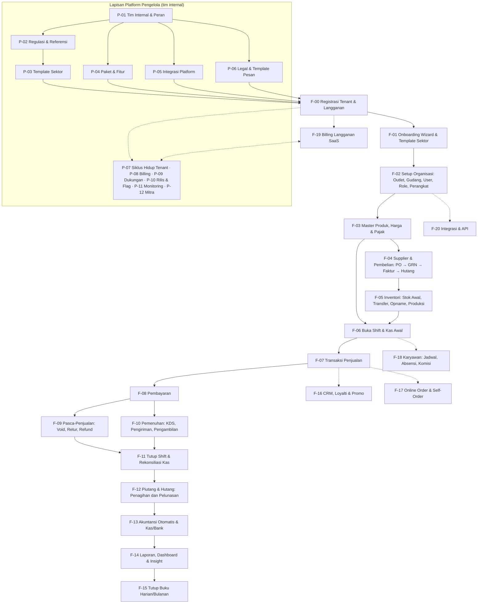
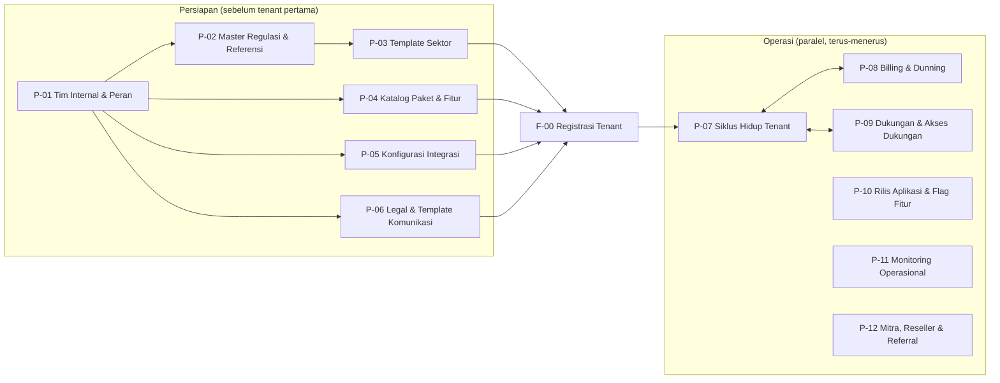
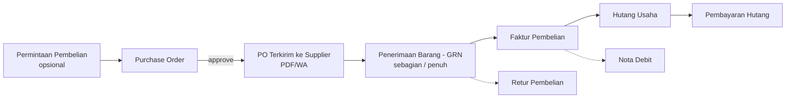
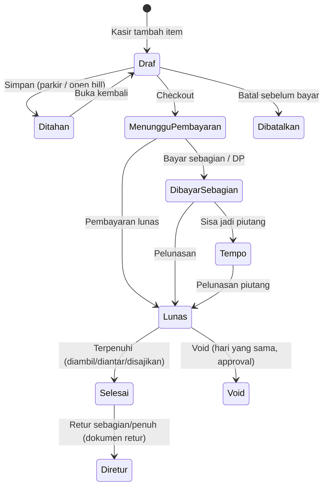
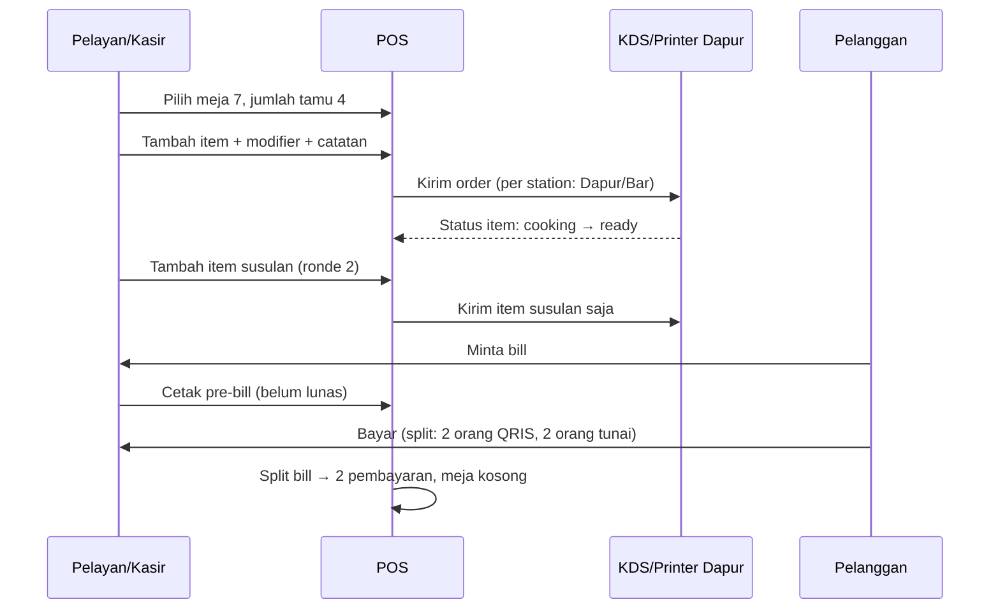
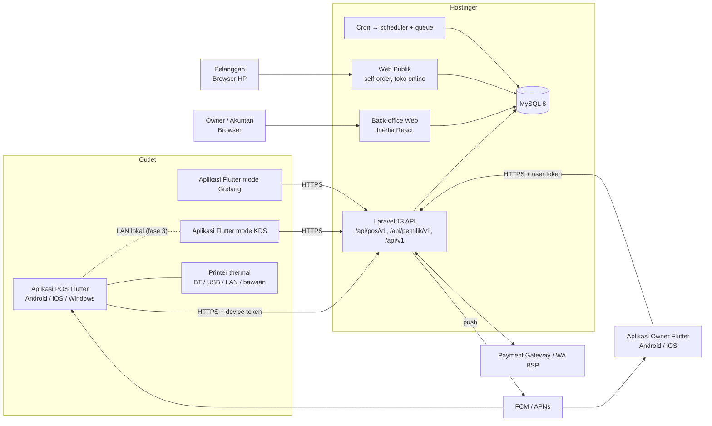
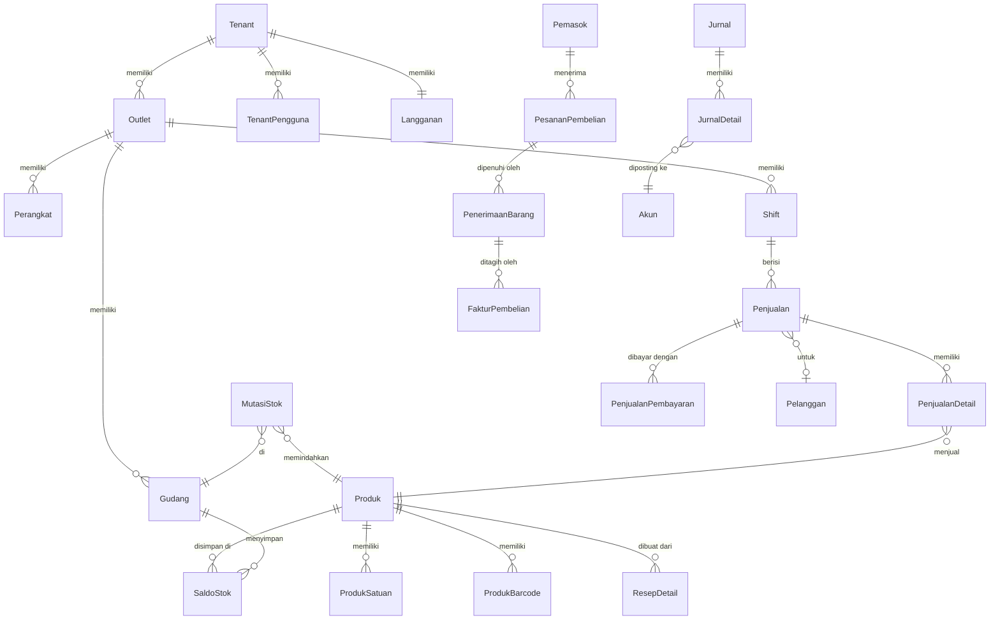
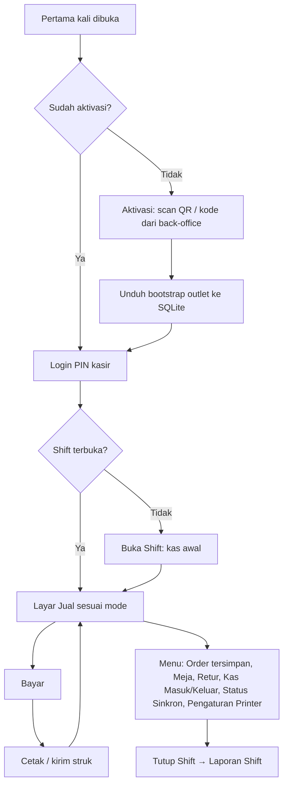
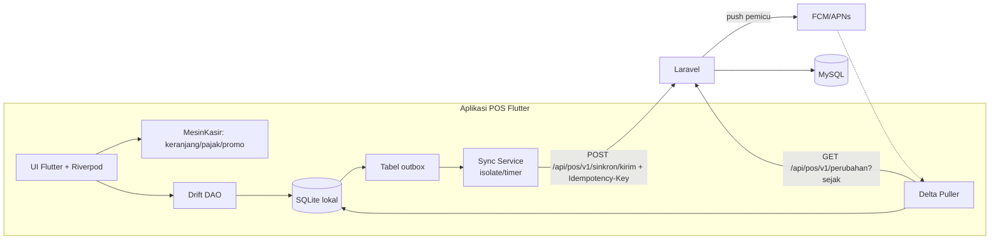
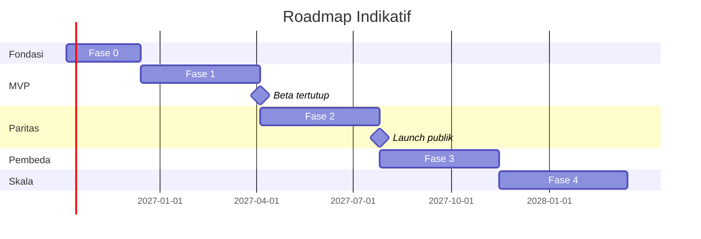

# PRD — POS SaaS Multi-Sektor Indonesia

> **Nama sistem:** **Payoung** (payung; D-61), tagline *"Smart Choice Your Business Partner"* (D-15, diperbarui v1.73; tetap). Placeholder **`{{APP}}`** yang masih tertulis di dokumen ini dibaca sebagai Payoung. Seluruh nama, domain, dan ID aplikasi di dokumen ini, termasuk riwayat versi dan keputusan lama, memakai **Payoung**, `payoung.id`, dan `id.payoung.*` (D-61).
> Aset logo & palet merek di `Spesifikasi/Merek/`. Kandidat nama lama tetap di [Lampiran A](#lampiran-a--kandidat-nama-sistem) sebagai arsip.

| Atribut | Nilai |
|---|---|
| Dokumen | Product Requirements Document (PRD) |
| Versi | 4.75 |
| Tanggal | 6 Oktober 2026 |
| Status | Draf, menunggu review pemilik produk |
| Pemilik produk | Ahmad Affandi |
| Stack Backend & Back-office | Laravel 13 · PHP 8.3 · MySQL 8 · Inertia.js + React + TypeScript · Tailwind CSS 4 · TanStack Query |
| Stack Aplikasi POS | **Flutter** (Dart) untuk **Android, iOS/iPadOS, dan Windows** · Drift (SQLite) untuk offline |
| Stack Aplikasi Owner | **Flutter** (Dart) untuk **Android & iOS** |
| Hosting | Hostinger (Web/Cloud Hosting) untuk backend & web, dengan jalur upgrade ke VPS. Aplikasi POS didistribusikan via Google Play, App Store, dan installer desktop |
| Bahasa produk | Bahasa Indonesia (utama), English (sekunder) |

**Riwayat perubahan**

> **Menambah entri:** sisipkan tepat di atas baris **versi tertinggi** (saat ini blok turun yang mulai di bawah `2.70`),
> dan pakai nomor satu langkah di atas nomor tertinggi di seluruh tabel — bukan nomor tertinggi di bagian tabel yang
> kebetulan sedang dibaca. Tabel ini punya urutan campur karena sejarahnya (1.0–1.71 & 2.29–2.70 naik, 2.95–2.71 &
> 2.28–2.00 turun), jadi "nomor berikutnya" harus dicari dari seluruh berkas. Dua sesi yang menyisipkan di dua tempat
> berbeda pernah membuat 2.80, 2.81, dan 2.86 terpakai dua kali dengan isi berbeda; `Alat/PecahPrd.py --cek` sekarang
> menolak nomor ganda dan rujukan `vX.YY` yang tidak punya entri.

| Versi | Perubahan |
|---|---|
| 1.0 | Draf awal: POS sebagai PWA (React) |
| 1.1 | **Aplikasi POS (kasir, KDS, operasional gudang) dibangun dengan Flutter** untuk iOS, Android, dan Desktop. Back-office tetap web (Laravel + Inertia React). API sinkron POS berbasis token perangkat. Offline memakai SQLite (Drift). Integrasi hardware native. Mode LAN lokal ditambahkan. |
| 1.2 | Keputusan pemilik produk: **platform POS = Android, iOS/iPadOS, Windows** (Linux & macOS tidak ditargetkan). Kanal distribusi desktop **ditentukan setelah sistem stabil**. **Semua perangkat POS Android all-in-one** didukung lewat lapisan adaptor vendor. **Aplikasi Mobile Owner** terpisah (Flutter, Android & iOS). |
| 1.3 | Keputusan D-05: **nama database (tabel, kolom, indeks), folder, file, dan function/method memakai Bahasa Indonesia dengan PascalCase** di semua stack. Konvensi, kamus istilah, pengecualian framework, dan konfigurasi di §13.7. Skema §15, struktur folder, contoh kode, dan nama enum/status diperbarui. |
| 1.4 | Keputusan D-06: **URL/endpoint memakai Bahasa Indonesia** (huruf kecil, kebab-case). Semua rute web, API POS, API Pemilik (`/api/pemilik/v1`), API publik, parameter query, dan scope token diperbarui. |
| 1.5 | Perluasan D-06: nama **event webhook**, **header HTTP kustom**, dan **nama permission** memakai Bahasa Indonesia. Header standar protokol tetap. |
| 1.6 | Keputusan D-07: **Platform Pengelola** (konsol tim internal {{APP}}) dirancang sebagai lapisan pertama sebelum modul tenant: flow P-01 s.d. P-12 (§8 Bagian A), modul PGL (§10.0), arsitektur (§13.8), tabel (§15.3), peran internal (§19.3), dan Fase 0 roadmap direvisi. |
| 1.7 | Keputusan D-08: font resmi **Atkinson Hyperlegible Next** (UI) + **Atkinson Hyperlegible Mono** (kode & nomor dokumen), skala tipografi dua mode kepadatan, aturan pemakaian, dan implementasi web/Flutter (§17.5). |
| 1.8 | Keputusan D-09: **Pedoman UI/UX & Design System** (§17.6): prinsip "alat kerja, bukan brosur", arah per klien, token warna (lolos WCAG AA), bentuk & kepadatan, pola layar, keadaan wajib, microcopy, visualisasi data, aksesibilitas, proses desain, dan checklist review anti-slop. |
| 1.9 | Keputusan D-10: **Tata kelola AI agent** (§23.4): `CLAUDE.md`, `.claude/rules/`, hook, skill `/mulai-flow` & `/cek-dod`, subagent `penjaga-konvensi`, `Alat/CekKonvensi.py`, `Dokumen/` hasil generate, CI kepatuhan, CODEOWNERS, template PR. Pengecualian penamaan untuk file yang namanya diwajibkan alat ditambahkan (§13.7.4). |
| 1.10 | Penyelarasan hasil scaffolding Fase 0: macro `UuidPublik()` (§13.7.4), test Dart berakhiran `_test.dart` (§13.7.4, §17.2.1), ruang kerja pub + melos di `pubspec.yaml` akar (§13.7.4). Lint `constant_identifier_names` dimatikan agar nilai enum PascalCase (§13.7.4). Paket Dart murni diuji dengan `dart test`. Tidak ada perubahan flow. |
| 1.11 | Rincian P-01 hasil perencanaan `/mulai-flow`: BR-P01.1 ditegaskan (tolak menurunkan Super Admin bila aktif ≤ 2), allowlist IP ditunda (§25 no. 13), skema `PenggunaPengelola` (+`DuaFaktorAktifPada`, `KodePemulihan2fa`, `DinonaktifkanPada`) dan tabel baru `UndanganPengelola` (§15.3). |
| 1.12 | Rincian P-02 hasil perencanaan `/mulai-flow`: `PengaliDpp` disimpan sebagai pecahan (`PengaliDppPembilang`/`PengaliDppPenyebut`) agar DPP 11/12 eksak (§12.2), BR-P02.2 ditegaskan (nasional 2 penyetuju, daerah 1, pengaju tidak boleh menyetujui), tabel baru `SatuanStandar` & `PersetujuanDataMaster`, kolom status & dasar hukum pada `TarifPajak`/`HariLibur` (§15.3). Model data referensi berada di `Domain/Referensi` dan `Domain/Pajak` agar bisa dibaca tenant; aksi pengelolaannya di `Domain/Pengelola/Referensi` (§13.2, §13.8). |
| 1.13 | Keputusan tinjauan P-02: data awal tarif dari file data (bukan kode), `BerlakuMulai` tarif tidak boleh di masa lalu saat diajukan/terbit, pembatalan hari libur terbit lewat pengajuan & tinjauan (status `Dibatalkan`), dan four-eyes berlaku untuk semua penyusun draf (BR-P02.2). |
| 1.14 | Rincian P-04 (diputuskan agen atas mandat pemilik produk "tanpa meminta izin terus", disetujui pemilik produk 23/09/2026): harga paket berversi di tabel `HargaPaket` dengan four-eyes (Keuangan mengusulkan, Super Admin menyetujui) dan pilihan grandfathering (BR-P04.1); status paket Draf/Aktif/Diarsipkan; batas `null` = tak terbatas; model katalog di `Domain/Tenant`, aksi kelola di `Domain/Pengelola/Katalog`; data awal katalog dari file data sebagai draf; penegakan batas, `konfigurasi-aplikasi`, downgrade (BR-P04.4), dan pemakaian kupon ditunda ke F-00/F-19/P-08 (BR-P04.5–P04.7). |
| 1.15 | Keputusan D-11 (harga langganan per paket, bukan per outlet; tambahan outlet/perangkat/kuota lewat add-on), batas paket §21 dilengkapi, add-on & kupon tanpa four-eyes, kunci fitur dipertahankan. Pertanyaan terbuka no. 14–17 ditutup. |
| 1.16 | Rincian P-03 (diputuskan agen atas mandat pemilik produk "tanpa meminta izin terus"): model `TemplateSektor`/`TemplateSektorVersi` di `Domain/PanduanAwal` (dibaca F-01), aksi kelola di `Domain/Pengelola/TemplateSektor`; satu draf per template, versi terbit tidak diubah (BR-P03.4); pembagian izin isi bisnis/akun/terbitkan (BR-P03.5); aturan validasi otomatis dirinci (BR-P03.3); nilai mode kasir `Retail`/`Cepat`/`Meja`/`Layanan`/`Grosir` (§5.1); data awal 3 template dari file data sebagai draf; pratinjau sandbox, tawarkan pembaruan, dan pelacakan versi tenant ditunda ke F-01 (BR-P03.6, §25 no. 15). |
| 1.17 | Tindak lanjut tinjauan P-03: nilai enum mode kasir dicantumkan di §5.1, cakupan template sektor ditambahkan ke tabel peran §19.3, peran akun service charge bernama `PendapatanBiayaLayanan` (istilah `BiayaLayanan` Lampiran D), pengaturan pembulatan template memakai bentuk `PembulatanTunai {Kelipatan, Arah}` yang sama dengan test vector, dan aturan validasi BR-P03.3 dilengkapi (tarif nasional harus masih berlaku, urutan pajak, konsistensi service charge masuk DPP). |
| 1.18 | Rincian P-05 Fase 0 (diputuskan agen atas mandat pemilik produk "tanpa meminta izin terus"): integrasi email (SMTP), CAPTCHA (Cloudflare Turnstile), dan penyimpanan objek (S3-compatible, misal Cloudflare R2); kolom `KonfigurasiIntegrasi` dirinci (§15.3); aktivasi wajib tes koneksi berhasil setelah perubahan terakhir (BR-P05.4); rotasi kunci diingatkan lewat banner (BR-P05.5); uji berkala tiap jam lewat scheduler (BR-P05.3); gateway billing, WhatsApp, FCM, Sentry, dan daftar gateway tenant menyusul bersama flow pemakainya. |
| 1.19 | Rincian P-06 Fase 0 (diputuskan agen atas mandat pemilik produk "tanpa meminta izin terus"): dokumen legal berversi Draf → Terbit dengan tanggal berlaku, satu draf per jenis, versi materiil wajib diumumkan ≥ 30 hari (BR-P06.3), status berlaku/terjadwal/digantikan dihitung dari tanggal (BR-P06.4); model di `Domain/Tenant` agar dibaca F-00, aksi kelola di `Domain/Pengelola/Konten`; tabel `PersetujuanDokumenLegal`, pengumuman ke tenant, dan persetujuan ulang saat login dibangun bersama F-00 (BR-P06.5); template komunikasi & help center tetap Fase 1–2 (PGL-07). |
| 1.20 | Rincian F-00 Fase 0 (disetujui pemilik produk: F-00 dikerjakan sebelum P-07; rincian diputuskan agen atas mandat "tanpa meminta izin terus"): data tenant dibuat saat tombol Daftar ditekan dan verifikasi email berjalan setelahnya (BR-00.5), paket trial dari pilihan di halaman harga atau paket bawaan (BR-00.6), CAPTCHA wajib di produksi (BR-00.4), transisi `Langganan.Status` dirinci (BR-00.7); OTP WhatsApp, lupa kata sandi, 2FA tenant, kode mitra (P-12), persetujuan ulang dokumen materiil, dan penegakan batas paket (F-02/F-19) menyusul. |
| 1.21 | Tindak lanjut tinjauan F-00: akhir trial diproses tiap jam (BR-00.7), pengecualian `MilikTenant` untuk tabel data platform dicatat di §13.4, prasyarat email aktif ditegakkan di produksi, utang log audit tenant & pertanyaan enumerasi akun dicatat di §25 (no. 17–18). |
| 1.22 | Penyelesaian Fase 0 oleh tim paralel (diputuskan agen atas mandat pemilik produk "langsung kerjakan semua kekurangannya"): P-07 dasar (BR-P07.4–BR-P07.10: tampilan 360°, perpanjang trial, override berakhir otomatis & terhubung `EvaluatorFitur`, tangguhkan/aktifkan kembali, catatan, penanda, `KonteksPengelola`), P-08 Fase 0 (BR-P08.4–BR-P08.10: tagihan manual ber-PPN dari `TarifPajak`, nomor `INV/tahun/bulan/urut`, bukti transfer, verifikasi Keuangan, kupon, penjadwal tunggakan), P-09 & P-11 dasar (tiket dukungan dengan SLA per paket, detak scheduler, antrean & job gagal, catatan backup, alert), autentikasi tenant (BR-00.8 2FA, BR-00.9 lupa kata sandi, BR-00.10 anti-enumerasi, persetujuan ulang & pengumuman dokumen materiil BR-P06.5), F-02a (peran & izin tenant, outlet/lokasi stok/merek, undangan pengguna, batas outlet & pengguna, `LogAudit` tenant). Transisi `Langganan.Status` diperluas untuk penangguhan manual (P-07) dan tunggakan (P-08). §25 no. 17 & 18 ditutup, no. 14 sebagian. |
| 1.23 | Perbaikan temuan tinjauan integrasi Fase 0 (diputuskan agen atas mandat pemilik produk, menunggu konfirmasi): aktifkan kembali memeriksa tunggakan & masa tenggang (BR-P07.5), penangguhan manual tidak bisa dicabut lewat tagihan/pembayaran (BR-P07.4 × BR-P08.9), `StatusSebelumDitangguhkan` dikosongkan otomatis, penanda Uji/Demo/Internal dikecualikan dari tunggakan, pemakaian di tampilan 360° memakai penghitung batas F-02a (outlet aktif; pengguna aktif + undangan berlaku). |
| 1.24 | Rincian F-02b (diputuskan agen atas mandat pemilik produk, menunggu konfirmasi): perangkat & kode perangkat `{KodeOutlet}-{Jenis}{NN}`, kode aktivasi 8 karakter sekali pakai (HMAC), device token sendiri `{IdTenant}\|{rahasia}` **menggantikan Sanctum** untuk API POS (§13.1/§16.1 disesuaikan), PIN kasir 6 angka dengan penguncian 5× salah/5 menit, `BatasPerangkatPerOutlet` ditegakkan, cabut perangkat (BR-02.3), key JSON `konfigurasi-aplikasi` PascalCase (`VersiTerbaru`, `VersiMinimal`, `TautanUnduh`). `KodeAktivasi` masuk daftar pengecualian `MilikTenant` §13.4. §25 no. 14 bertambah selesai. |
| 1.25 | Tindak lanjut tinjauan integrasi (diputuskan agen atas mandat pemilik produk, menunggu konfirmasi): `/kelola/langganan` memakai izin `langganan.kelola` (khusus Pemilik); izin tenant baru `bantuan.tiket.lihat` & `bantuan.tiket.kelola` (bawaan Pemilik, Admin, Manajer Outlet); 2FA wajib (§20.2, BR-00.8) berlaku untuk peran bawaan Pemilik, Admin, Akuntan di paket ber-`keamanan.2fa-wajib`, dan 2FA milik akun tidak bisa dimatikan selama satu keanggotaan aktif mewajibkannya; tenant `Ditangguhkan` hanya bisa membaca back-office, kecuali langganan/pembayaran, keamanan akun, bantuan, dan persetujuan legal (F-00); banner Tertunggak (dengan batas tenggang) & Ditangguhkan di back-office; `LogAudit` tenant untuk 2FA, atur ulang kata sandi, persetujuan legal, tagihan & bukti transfer (peristiwa tingkat akun dicatat di setiap tenant tempat pengguna aktif). Langkah rilis: jalankan `organisasi:siapkan-peran` agar peran bawaan tenant lama menerima izin baru. |
| 1.26 | **Pemilik produk mendelegasikan semua pertanyaan terbuka agen kepada agen** dengan patokan "terbaik untuk kita dan terbaik untuk tenant" (23/09/2026). Keputusan agen v1.16–v1.25 yang bertanda "menunggu konfirmasi" dianggap **disetujui** lewat delegasi ini. Keputusan baru dicatat di §25.2 dan D-12; Perjanjian Pemrosesan Data kini wajib disetujui saat registrasi (BR-P06.2). |
| 1.27 | D-13 (disetujui pemilik produk): folder `Backend/` dipindah ke `Aplikasi/Web/` karena berisi aplikasi Laravel utuh (API, back-office, web publik, Platform Pengelola), sejajar dengan `Aplikasi/Kasir` & `Aplikasi/Pemilik`. Semua jalur di PRD, `CLAUDE.md`, `.claude/`, `Alat/`, dan CI disesuaikan; penjaga migrasi mengenali jalur lama `Backend/` dan hanya mengizinkan pindah lokasi tanpa perubahan isi. |
| 1.28 | Rincian F-01 (diputuskan agen atas mandat D-12): wizard `PanduanAwal` 6 langkah dengan progres, penerapan template idempoten & aditif ke `Akun`/`PemetaanAkun`/`Kategori`/`Satuan`/`KelompokPajak`/`OutletFitur`, pajak outlet merujuk `JenisPajak` (tarif dicari saat dipakai), `MetodePembayaran`, produk contoh & tambah cepat, izin `panduan-awal.kelola`. Istilah `PiutangSettlement` → `PiutangPencairan` dan `Waste` → `SusutPersediaan` (§11.2, kamus §13.7.1). §25 no. 15 sebagian dan no. 16(a) ditutup. Rincian tabel §15 ditambahkan setelah implementasi digabung. |
| 1.29 | Skema F-01 dicatat di §15 sesuai implementasi (`ProgresPanduanAwal`, kolom baru `Outlet`, `MetodePembayaran`, `Satuan.KodeStandar`, `KelompokPajakDetail.IdJenisPajak`, kunci JSON `Tenant.Pengaturan` & `Outlet.ProfilPajak`); `PemetaanAkun.Kunci` memakai nilai `PeranAkun`; izin `panduan-awal.kelola` di §19.1; batas kewajaran MDR 10% per metode; peran sektor ditunda ke F-10/F-17. Langkah rilis: `organisasi:siapkan-peran` dan `panduan-awal:siapkan-bawaan`. |
| 1.30 | Disetujui pemilik produk: test vector `Spesifikasi/VektorUjiKalkulasi/` tidak lagi file penjaga. Agent boleh **menambah kasus** (wajib lolos di PHP & Dart), tetapi tidak boleh menghapus kasus atau mengubah nilai harapan tanpa alasan bisnis tertulis di PRD (CLAUDE.md #19 tetap berlaku). |
| 1.31 | Rincian F-03 (diputuskan agen atas mandat D-12): skema katalog lengkap di §15 (`ProdukGudang`, `NomorUrutKatalog`, `PenghapusanKatalog`, `ImporProduk`/`ImporProdukBaris`, kolom baru Produk/DaftarHarga/RiwayatHarga/KelompokPajak/Resep/Pilihan), endpoint POS `katalog` & gambar di §16.3, istilah baru di kamus, penegakan izin katalog di §19.1, aturan SKU/barcode otomatis, BatasSku, varian, arsip/hapus, riwayat harga, penentu harga PHP=Dart dengan test vector, rumus susut resep, dan impor/ekspor. Utang F-03 di §25 no. 19. |
| 1.32 | D-14 (keputusan pemilik produk): tanpa mode gelap di semua klien termasuk KDS; kolom "Gelap" dihapus dari token warna §17.6.3; satu sumber warna per platform; seluruh komponen shadcn/ui dipasang dengan warna dari token. |
| 1.33 | Rincian F-05a (diputuskan agen atas mandat D-12): dokumen `StokAwal` & impor stok awal, ledger `MutasiStok` dengan HPP rata-rata bergerak/FIFO, batch & nomor seri, inti jurnal (`PostingJurnal`, `BalikkanJurnal`, kunci periode) yang dibangun lebih awal untuk J-05.1, kolom tambahan §15 (Inventori, Akuntansi, Sistem), izin baru `persediaan.stok-awal.posting` (§19.1), kode galat F-05a, perintah `persediaan:bangun-ulang-saldo`. Utang F-05a di §25 no. 20. |
| 1.34 | Rincian F-06a (diputuskan agen atas mandat D-12): server & back-office shift dan kas. Endpoint `POST /api/pos/v1/sinkron/kirim` (batch outbox, hasil per item Diterima/Duplikat/Ditolak), tabel `Shift`/`MutasiKas` dilengkapi dan tabel baru `KategoriKas` (§15), izin baru `kas.keluar.setujui` (§19.1), pengaturan kasir tenant (batas kas keluar, shift bersama), jurnal kas masuk & setoran (§11.3). Aplikasi kasir Flutter menyusul di F-06b. Utang F-06 di §25 no. 21. |
| 1.35 | Rincian F-06b (diputuskan agen atas mandat D-12): aplikasi kasir Flutter (aktivasi, masuk PIN online/offline, buka shift, kas masuk/keluar/setoran dengan PIN supervisor, status sinkron), PIN offline Argon2id terbungkus kunci perangkat (§25.2 no. 3) dengan vektor uji bersama `Spesifikasi/VektorUjiPin`, `GET /api/pos/v1/data-awal` bagian F-06, kolom `TenantPengguna.VerifierPinOffline` & `Perangkat.KunciPinOffline` (§15). Utang F-06 di §25 no. 21 diperbarui. |
| 1.36 | Keputusan D-15: nama sistem **Payoung** dan identitas merek dari pemilik produk (logo, ikon, palet). Token warna §17.6.3 final: Navy untuk teks, Indigo untuk brand, netral dingin untuk latar & garis. Aset & turunannya (favicon web, ikon Android/iOS/Windows, logo dalam aplikasi) di `Spesifikasi/Merek/`. Nama tampilan aplikasi: **Payoung POS** (Aplikasi POS) dan **Payoung Owner** (Aplikasi Owner). |
| 1.37 | Keputusan D-16 dari pemilik produk: (1) **semua tabel web** memakai komponen `TabelData` berbasis **TanStack Table + TanStack Query** dengan fitur lengkap (§17.4.3); (2) **web responsif penuh** dari 360px sampai layar lebar (§17.4.4); (3) Aplikasi POS dirancang sebagai **Ruang Kerja Kasir** yang elegan dan tetap mudah untuk dipakai berjam-jam (§17.2.7). Tabel §13.5, §17.2.3, §17.6.2, §17.6.5, §17.6.9, §17.6.11, §23.3 disesuaikan. Utang penyesuaian halaman & layar yang sudah ada di §25 no. 22. |
| 1.38 | Pelaksanaan D-16 (keputusan agen, D-12): data `TabelData` mode server dilayani **URL halaman yang sama** dengan `Accept: application/json` (bukan `/internal/*` terpisah); **tabel isian formulir** dan **rincian dokumen kecil** dikecualikan dari `TabelData` (§17.4.3, §25.2 no. 17). Migrasi seluruh daftar web ke `TabelData` selesai (§25 no. 22a). |
| 1.39 | Pemilih tanggal seragam (§17.4.2): `PemilihTanggal`, `PemilihTanggalWaktu`, `PemilihRentangTanggal` menggantikan isian tanggal bawaan peramban di seluruh web; preset rentang ditambah 30 hari terakhir & Tahun ini. |
| 1.40 | Keputusan D-17: agent mengubah file penjaga (PRD, CLAUDE.md, aturan, hook) tanpa meminta izin, dengan batas tidak melemahkan test/lint/CI dan larangan keras tetap berlaku. |
| 1.41 | Pilihan seragam (§17.4.2): `PilihanCari` menggantikan select bawaan peramban; daftar terbuka di bawah pemicu (tidak menutupinya) dan setiap dropdown berisi daftar pilihan wajib punya kotak cari. |
| 1.42 | Rincian F-07a (diputuskan agen atas mandat D-12): aturan pembulatan, alokasi pro-rata, pajak inklusif/eksklusif campuran, dan pembulatan tunai mesin kalkulasi; format test vector diperluas (`Pajak`, `DiskonManual`, `DiskonManualPesanan`, `HargaPilihan`, pembayaran daftar, `Harapan` rinci per baris). |
| 1.43 | Rincian F-07b & F-07c (diputuskan agen atas mandat D-12): item sinkron `Penjualan.Buat`, validasi server (tarif pajak, batas diskon BR-07.3, hitung ulang), stok & jurnal J-07.1/J-07.2 saat Lunas, tabel `PenjualanPajak`, izin `penjualan.diskon.setujui`, pengaturan batas diskon & pembulatan tunai, tambahan `data-awal`, gambar QRIS untuk POS, layar Jual & Bayar di Ruang Kerja Kasir. |
| 1.44 | Keputusan implementasi F-07b/F-07c dicatat: pintasan POS mengikuti §17.2.3 (F1/F8/F9/Esc), persetujuan diskon oleh kasir yang berizin, penanganan produk/pilihan terhapus, nomor & tanggal bisnis, `data-awal` `Outlet.ZonaWaktu/JamTutupBuku`, opsi `abaikanBatasMinus` buku stok; utang F-07 (§25 no. 23). |
| 1.45 | Rincian F-09 fase 1 (void transaksi di shift yang sama, retur dengan refund tunai/transfer manual, daftar void & retur) dan F-11 (tutup shift buta, hitung pecahan, selisih & persetujuan, jurnal selisih, laporan shift X/Z), diputuskan agen atas mandat D-12. Izin baru `shift.selisih.setujui`. |
| 1.46 | Tindak lanjut tinjauan F-07: snapshot pengaturan & pajak dari perangkat dicocokkan dengan pengaturan tenant/outlet (beda → diterima + `PerluTinjauan`), penolakan karena izin/batas yang berubah setelah transaksi offline diganti "terima + tinjau", definisi persen diskon efektif tunggal, tanggal bisnis perangkat memakai zona outlet, nomor urut terakhir per perangkat di `data-awal`. |
| 1.47 | Keputusan implementasi F-09 fase 1 & F-11 dicatat (status `DireturSebagian`, jurnal void, kolom void/retur, kas shift menghitung refund tunai void & retur, idempotensi & kode galat `Shift.Tutup`, kas/penjualan/retur setelah shift ditutup diterima + tinjau). |
| 1.48 | Rincian F-13a (bagan akun, pemetaan akun, transaksi kas/bank back-office: pengeluaran operasional, penerimaan lain, transfer; buku besar, neraca saldo, laba rugi) dan F-14a (dashboard pemilik, laporan penjualan per dimensi, laporan PB1/PBJT & PPN keluaran, nilai persediaan & stok kritis, ringkasan harian lewat antrean), diputuskan agen atas mandat D-12. |
| 1.49 | Implementasi tindak lanjut tinjauan F-07 (server & aplikasi): `JenisPajak.Kategori` (Ppn/Pbjt/Lainnya; semua kode berawalan `Pbjt` → Pbjt), kunci baru `Perangkat.NomorUrutPenjualan`/`NomorUrutRetur`, `TarifPajak[].Kategori`, `KelompokPajak[].Pajak[].Kategori`, `penjualan/cari` baris `BolehDesimal`/`UuidProdukSatuan`; kelipatan pembulatan tunai 1–1.000 juga di pengaturan kasir & template; skema lokal POS v4–v5. |
| 1.50 | Keputusan implementasi F-13a & F-14a dicatat (penanda `Akun.KasBank`, satu sumber aturan tipe akun per peran, pemetaan tingkat tenant hanya untuk pengguna tanpa batas outlet, definisi angka laporan, kolom tambahan `RingkasanPenjualanHarian`, peristiwa penjualan & jadwal bangun ulang); utang F-13a/F-14a (§25 no. 25). |
| 1.51 | Rincian F-04 fase 1 (pemasok, PO + persetujuan, penerimaan barang, faktur & 3-way matching, hutang & pembayaran, retur pembelian, belanja stok) dan F-05b (transfer antar lokasi, stok opname, penyesuaian stok) di back-office, diputuskan agen atas mandat D-12. Izin baru `pembelian.po.setujui`. |
| 1.52 | Keputusan implementasi F-04 fase 1 & F-05b dicatat (selisih harga faktur fase 1 ke `SelisihHpp`, faktur satu pemasok & satu outlet, lokasi "Dalam perjalanan" per outlet asal, aturan opname aktif per lokasi/kategori); utang F-04/F-05b (§25 no. 26). |
| 1.53 | Utang D-16 (c) audit responsif selesai: Playwright 97 URL (74 back-office + 23 Platform Pengelola) × 360/768/1280px; gulir horizontal halaman 142 → 0 (teks panjang di `Pemberitahuan` kini patah baris, tombol navigasi panduan awal membungkus). Penolakan redirect (dokumen berstatus tidak sesuai) dikirim sebagai galat `Umum`, bukan `Kilat` berlabel "Berhasil" (§25 no. 22). |
| 1.54 | Neraca (FIN-07 P1) di back-office F-13: posisi akhir periode vs sehari sebelum periode, laba belum ditutup buku di ekuitas (tahun berjalan & tahun-tahun lalu), tanda seimbang, ekspor CSV, invarian nilai persediaan neraca = Σ nilai stok. Utang §25 no. 25 & 26 diperbarui. |
| 1.55 | Arus kas metode langsung (FIN-07 P1) di back-office F-13; klasifikasi aktivitas dari akun lawan (keputusan agen, D-12). `TabelData`: meta `sembunyiBilaKosong` untuk daftar bertumpuk HP dan tombol Saring di HP hanya tampil bila ada saring/urut. |
| 1.56 | Rincian F-10a: area & meja per outlet, stasiun dapur tingkat tenant + `Kategori.IdStasiunDapur`, gerbang fitur `pos.mode-meja`, stasiun dari template sektor; penyesuaian §15 `StasiunDapur` (tanpa IdOutlet/KonfigurasiPrinter) dan `AreaMeja`/`Meja`. |
| 1.57 | Rincian F-07 mode meja & F-10b fase 1: pesanan terbuka tersinkron (item outbox `PesananTerbuka.*`, tarik delta, kunci bayar online, bayar ganda offline → `PerluTinjauan`), tiket dapur per stasiun & ronde, API KDS. |
| 1.58 | Rincian F-07 mode meja & F-10b fase 1 di aplikasi POS: menu Meja (denah per area, pesanan tanpa meja), mode pesanan di layar Jual (kirim ke dapur per ronde, batal item BR-07.5, bayar menutup pesanan, harga kanal `MakanDiTempat`), tarik snapshot 7 detik dengan ETag, kunci bayar, layar dapur untuk perangkat `Kds`; skema lokal 6. |
| 1.59 | Rincian F-16a (CRM-01 pelanggan): master pelanggan (nomor HP ternormalisasi & unik per tenant), izin `pelanggan.lihat`/`pelanggan.kelola`, back-office daftar & detail riwayat belanja, API POS cari pelanggan, item outbox `Pelanggan.Buat` (offline, alias nomor HP ganda), `Penjualan.Buat` + `UuidPelanggan`, panel pelanggan (F2) di aplikasi kasir; skema lokal 7. |
| 1.60 | Rincian F-16b bagian 1 (CRM-02/03): tier pelanggan (ambang belanja, pengali poin, kode untuk daftar harga, naik/turun otomatis harian + kunci tier), pengaturan loyalti per tenant, buku poin `MutasiPoin` (perolehan di transaksi penjualan, pembalikan void & retur proporsional, kedaluwarsa FIFO, penyesuaian manual), harga tier di aplikasi kasir; skema lokal 8. Keputusan pemilik produk: penukaran poin dicatat sebagai **diskon** (J-16.4, bagian 2). |
| 1.61 | Rincian F-16b bagian 2 (CRM-03 penukaran poin): poin ditukar sebagai **diskon pesanan sebelum pajak** (J-16.4 lewat Diskon Penjualan di J-07.1); mesin kalkulasi PHP & Dart menerima `TukarPoin` (dibatasi sisa subtotal, keluaran `DiskonPoin`) + 3 test vector baru; `Penjualan.Buat` membawa `TukarPoin {Poin, Nilai}`; saldo terkini `GET /api/pos/v1/pelanggan/{uuidPelanggan}/poin` (wajib online, §18.4); pengaturan nilai tukar per poin & minimal tukar; void mengembalikan poin yang ditukar. |
| 1.62 | Rincian F-16c bagian 1 (CRM-05 promo engine): master promo back-office (formulir terstruktur, bukan YAML), mesin promo PHP & Dart murni + 8 test vector bersama `VektorUjiKalkulasi/Promo/` (kondisi barang/kategori/minimal, tier, kanal, outlet, periode/hari/jam; aksi diskon %/nominal barang & pesanan, harga spesial, beli X gratis Y, bundel harga tetap; batas per transaksi, kuota), resolusi konflik `Terbaik`/`PrioritasKetat`, promo di POS (`GET /api/pos/v1/promo`, berlaku offline), `Penjualan.Buat` membawa `Promo` + validasi ulang server (beda = diterima + tinjauan `PromoBerbeda`), `PromoPemakaian` & kuota. Keputusan pemilik produk: dipecah (voucher dll. bagian 2), dua mode resolusi (bawaan Terbaik), beda hasil offline = terima + tinjauan. |
| 1.63 | Rincian F-12 bagian 1 (piutang pelanggan): limit kredit & termin di data pelanggan, metode **Tempo** di POS (hanya bila pelanggan dipilih; metode dibuat sistem saat limit kredit pertama diisi), BR-12.1 dengan PIN penyetuju ber-izin baru `penjualan.tempo.setujui` (cek dari cache perangkat; cache basi = diterima + tinjauan `TempoBermasalah`), piutang per penjualan tempo (jurnal Dr Piutang Usaha), void membatalkan piutang yang belum dibayar, retur memotong piutang lebih dulu, back-office piutang & umur 0–30/31–60/61–90/>90, pelunasan sebagian/banyak piutang sekaligus (Dr Kas/Bank, Cr Piutang Usaha) yang bisa dibatalkan, skema lokal POS v9. Keputusan pemilik produk: F-12 dipecah (DP/uang muka, pengingat WA, giro = bagian 2), PIN penyetuju untuk BR-12.1, void/retur mengurangi piutang. |
| 1.64 | Rincian F-18 bagian 1 (EMP-01/02/03): data karyawan (opsional tertaut akun pengguna, level staf, gaji pokok hanya untuk pengelola), jadwal kerja mingguan per outlet (salin minggu lalu), absensi masuk/keluar dari aplikasi kasir dengan PIN + swafoto kamera depan bila perangkat berkamera (item outbox `Absensi.Masuk`/`Absensi.Keluar`, idempoten, karyawan dibuat otomatis dari absensi), rekap absensi dengan keterlambatan terhadap jadwal, izin `karyawan.lihat`/`karyawan.kelola`, skema lokal POS v10. Keputusan pemilik produk: F-18 dipecah (komisi = bagian 2; target, kasbon, rekap gaji, geofence HP pribadi = bagian 3), swafoto wajib bila kamera ada, karyawan tabel terpisah, komisi tanpa jurnal sampai rekap gaji. |
| 1.65 | Cara kerja agen (D-17): keputusan pemilik produk: di lokal hanya test yang terdampak perubahan yang dijalankan (analisis statis tetap seluruh kode); suite penuh dijalankan CI `CekKepatuhan.yml` di setiap push. Langkah 3 `/cek-dod` diperbarui. |
| 1.68 | Rincian F-12 bagian 2 (SLS-02 pre-order & uang muka): dokumen `PesananPenjualan` (+ Detail, Pembayaran) dibuat kasir offline lewat outbox `PesananPenjualan.Buat` dengan DP (J-07.3, Uang Muka Pelanggan; tanpa stok & pendapatan; ikut kas shift), diambil online lewat Riwayat › Ambil pre-order dan dilunasi dengan metode sistem "Uang muka (DP)" (`Penjualan.Buat` `UuidPesananPenjualan`; pendapatan & stok saat diserahkan; tinjauan `UangMukaBermasalah`), void mengembalikan DP ke pesanan; back-office `/kelola/pre-order` (tandai siap, batal/selesaikan sisa DP: dikembalikan dari kas/bank atau hangus ke Pendapatan Lain); skema lokal kasir 11. Keputusan pemilik produk v1.68: DP pre-order dulu (pengingat WA menunggu integrasi WhatsApp), DP saat batal dipilih (kembali/hangus), pre-order dibuat di POS offline, nama dokumen `PesananPenjualan`. |
| 1.69 | D-15 diperbarui oleh pemilik produk: tagline resmi Payoung menjadi **"Smart Choice Your Business Partner"**. Logo utama, horizontal, monokrom, lembar merek, serta turunan logo Web dan Flutter diselaraskan; ikon aplikasi tanpa tagline tidak berubah. |
| 1.70 | D-15 dilengkapi varian logo putih transparan untuk permukaan gelap: logo horizontal lengkap dan ikon sidebar, masing-masing tersedia sebagai sumber serta turunan Web dan Flutter. Komponen merek menyediakan pemilih varian tanpa mengubah tampilan bawaan. |
| 1.71 | D-15 menambahkan **Indigo Gelap `#1D29B8`** dari gradasi logo P sebagai token `BrandGelap` di Web dan Flutter. Token disiapkan untuk latar sidebar/header merek dengan konten putih (kontras 10,2:1), tanpa langsung mengubah tampilan sidebar saat ini. |
| 2.29 | **F-05e produksi/rakitan** (INV-11, §9.11, J-05.6): dokumen `OrderProduksi` + `OrderProduksiBahan` per lokasi stok (`PR/{LOKASI}/{YYMM}/{SEQ4}`), Draf → Diposting → Dibatalkan; bahan diisi dari resep versi terbaru × jumlah hasil (standar vs aktual, selisih boros/hemat), bahan keluar `ProduksiPakai` HPP berjalan, hasil masuk `ProduksiHasil` bernilai Σ bahan + biaya overhead; jurnal J-05.6 Dr persediaan hasil / Cr persediaan bahan + akun baru **Overhead Produksi Dibebankan** (5-1300, dibuat otomatis untuk tenant lama); pembatalan terposting membalik stok & jurnal selama hasil belum terpakai; back-office Persediaan › Produksi. |
| 2.30 | **F-05f bahan terbuang F&B bagian 1** (INV-10 F&B, J-05.4): catatan `BahanTerbuang` per kejadian (produk/menu, jumlah, alasan Kedaluwarsa/Rusak/SalahBuat/TidakTerjual/Tumpah/Lainnya), menu resep & paket diuraikan ke bahan berstok (resep terbaru), mutasi `Susut` HPP berjalan + jurnal Dr Susut & Barang Rusak / Cr persediaan; dari back-office (stok kurang ditolak) dan outbox kasir `BahanTerbuang.Catat` (offline, idempoten; stok kurang/izin berubah/periode terkunci = tinjauan); izin baru `persediaan.terbuang.catat`; pembatalan membalik stok & jurnal; halaman Persediaan › Bahan terbuang dengan ringkasan food cost (nilai terbuang vs HPP penjualan). Panel catat di aplikasi kasir menyusul (bagian 2). |
| 2.31 | **Perbaikan audit P0** (audit repo 27-09-2026). **F-01 perangkat dicabut + outbox offline** (BR-02.3, §18): perangkat dicabut masih boleh `sinkron/kirim` selama 7 hari (masa pemulihan) untuk item yang dibuat sebelum `DicabutPada` (waktu dari ULID item), jawaban sinkron membawa `PerangkatDicabut`; item boleh membawa `UuidPerangkatAsal` sehingga outbox lama yang dikirim setelah aktivasi ulang dikreditkan ke perangkat pembuatnya; tabel `ItemSinkronPemulihan` + Kotak Tindakan "Data kasir dari perangkat dicabut perlu dicek"; aplikasi kasir (skema lokal 16, kolom `Outbox.UuidPerangkat`) mengosongkan outbox dulu sebelum menghapus token. **F-02 QRIS hasil gerbang tidak pasti** (BR-08.5): status baru `TidakPasti` (koneksi putus/5xx/respons rusak/proses terhenti) menggantikan penghapusan tagihan, `GalatGerbang.tidakPasti`, rekonsiliasi terjadwal tiap 10 menit (`penjualan:rekonsiliasi-qris`, cek status dengan `NomorPesanan` untuk Midtrans/Duitku/DOKU), uang yang masuk setelah status akhir ditandai `PerluTinjauan` + Kotak Tindakan "Uang QRIS masuk tanpa penjualan". Aturan migrasi: nama berkas migrasi baru wajib berurutan setelah migrasi terakhir di repo (tanggal di nama berkas adalah urutan, bukan tanggal kalender). |
| 2.32 | **Perbaikan audit tahap 2** (P1/P2 yang bisa lewat kode): **F-03** tugas antrean impor produk/stok awal & posting stok awal memeriksa ulang langganan, keanggotaan, dan izin pemulai di setiap potongan (`PenjagaOtorisasiTugas`); **F-04** build rilis Android gagal tanpa kunci produksi (`android/key.properties` / `PAYOUNG_KEYSTORE_*`); **F-07** suite konkurensi nyata `tests/Konkurensi` (dua proses PHP, `DatabaseTruncation`) yang menemukan & memperbaiki deadlock buku stok (baca idempotensi `MutasiStok` tanpa kunci celah, `PengunciSaldoStok` mengunci baris yang sudah ada tanpa upsert) dan menambah ulangan deadlock per item di `PemrosesSinkron`; **F-11** Dependabot di `.github` akar (Composer, npm, pub, Actions) + `composer audit`/`npm audit` di CI; **F-12** `Idempotency-Key` ditegakkan di mutasi API POS (`KunciIdempotensi`, putar ulang 24 jam, 409 bila isi berbeda) dan dikirim aplikasi kasir; **F-13** gerbang kompatibilitas rute API POS/Pemilik (`Spesifikasi/KontrakApi/RuteApi.json`); **F-14** header keamanan aplikasi (CSP dasar, HSTS, nosniff, Referrer-Policy, Permissions-Policy, X-Frame-Options); **F-15/F-16** anti-fraud: kas kurang dibebankan ke pembuka shift (shift bersama tidak dibebankan), void cepat hanya selisih 0–10 menit; **F-17** WhatsApp laundry siap paling banyak sekali (klaim `NotifikasiSiapDiprosesPada`); **F-18/F-19** reservasi: kuota per nomor dikunci atomik, masa kunci 30 detik, batas hari ke depan eksklusif; **F-20/F-21** prospek: kuota per nomor atomik, kunci sidik `SITUS_KUNCI_SIDIK` terpisah dari APP_KEY; **F-22** tautan "Pengaturan cookie" untuk menarik persetujuan (cookie analitik dihapus); **F-23** `CekKonvensi` menolak migrasi baru yang bernama sebelum migrasi terakhir di main; **F-24** batas gagal masuk konsol per IP global & per akun; **F-25** job CI `rilis` membuat artefak + SHA-256 per commit `main`; **F-26** daftar utang diberi status. Di luar kode (pemilik): proteksi branch & branch default, mesin DB produksi, backup + uji restore, keystore & ID aplikasi. |
| 2.33 | **F-05f bahan terbuang bagian 2 — panel kasir/dapur** (INV-10 F&B): menu **Stok** di Ruang Kerja Kasir (juga mode Pelayan) untuk staf berizin `persediaan.terbuang.catat`: cari produk/bahan (nama, SKU, barcode; bahan baku ikut walau tidak tampil di layar Jual; jasa, tanpa stok, induk varian, konsinyasi, batch/seri, dan paket sesi tidak ditawarkan), pilih satuan (dikonversi ke satuan dasar; satuan dasar ditawarkan walau tidak punya baris `ProdukSatuan`), jumlah (koma desimal, bulat untuk satuan bulat, maks. 4 desimal), alasan, catatan. Tersimpan offline dalam satu transaksi SQLite (tabel lokal `BahanTerbuangLokal`, skema lokal 17) + outbox `BahanTerbuang.Catat`; daftar "Bahan terbuang hari ini" dengan status kirim berteks (Belum terkirim/Perlu tindakan/Terkirim). Catatan lokal terkirim > 30 hari dibuang. Kontrak server tidak berubah. |
| 2.34 | **POS-25 modul Gudang di aplikasi** (§13.5 "mode Gudang", F-04 langkah 5, F-05b): menu Stok › Gudang di Ruang Kerja Kasir untuk lokasi stok outlet perangkat, online-first dengan draf lokal (tersimpan di perangkat sampai dikirim; kunci `Idempotency-Key` tetap per draf sehingga kirim ulang tidak menggandakan dokumen). API baru `/api/pos/v1/gudang/*`: `GET pesanan-pembelian` + `POST penerimaan` (GRN dari PO Disetujui/Diterima sebagian, baris per `Urutan`, batch+kedaluwarsa & nomor seri), `GET transfer` + `POST transfer/{uuid}/terima` (boleh sebagian), `GET opname` + `POST opname/{uuid}/hitung` (baris lama per `Urutan` atau produk baru hasil pindai; jumlah sistem disembunyikan untuk hitung buta; tinjau & setujui tetap di back-office). Pindai barcode/SKU (pemindai USB/Bluetooth sebagai keyboard, atau ketik) menambah jumlah baris; nomor batch/seri dicocokkan persis. **Keputusan agen (D-12):** GRN dari PO yang sudah disetujui boleh oleh izin `pembelian.kelola` **atau** `persediaan.kelola` (sesuai peran bawaan Staf Gudang "Penerimaan, transfer, opname"; staf gudang hanya mengisi jumlah, harga & pemasok dari PO); transfer & opname `persediaan.kelola`. Dokumen di luar lokasi outlet perangkat = 404; staf & izin diperiksa ulang di server. Pindai kamera (tanpa pemindai) menyusul setelah uji perangkat. |
| 2.35 | **Persetujuan jarak jauh (X4, §19.2, OWN-03)**: di dialog PIN penyetuju kasir (kas keluar, buka laci, diskon, void/retur, void item meja, tempo, selisih tutup shift) ada tombol **Minta persetujuan jarak jauh** bila fitur paket `persetujuan.jarak-jauh` aktif (dibawa data awal `Pengaturan.PersetujuanJarakJauh`). Tabel `PermintaanPersetujuan` (Izin yang dibutuhkan atau khusus pemilik, Judul, Rincian `{Label, Nilai}`, Nilai, berlaku 10 menit; Menunggu → Disetujui/Ditolak/Dibatalkan/Kedaluwarsa, riwayat status & audit). API POS `POST /persetujuan/jarak-jauh` (idempoten per Uuid), `GET /persetujuan/jarak-jauh/{uuid}` (dipantau tiap 3 detik), `POST …/batal`; API Owner `GET /persetujuan`, `POST /persetujuan/{uuid}/setujui`, `POST /persetujuan/{uuid}/tolak {Alasan 5–255}`. Penyetuju wajib anggota outlet dengan izin yang diminta (pemilik selalu boleh), bukan pemohon (four-eyes); keputusan ganda idempoten; lewat waktu = `SudahKedaluwarsa`. Disetujui → penyetuju dipakai sebagai `UuidPenyetuju` dokumen seperti hasil PIN (izinnya diperiksa lagi saat sinkron). Aplikasi Owner: tab **Persetujuan** dengan lencana jumlah menunggu, kartu (judul, nilai, outlet · perangkat · pemohon, rincian, batas waktu), Setujui dengan konfirmasi, Tolak wajib alasan; antrean dicek ulang tiap 15 detik selama aplikasi terbuka. **Menyusul:** push notification (FCM/APNs, butuh akun pemilik) dan konfirmasi biometrik. |
| 2.36 | **Harga per kanal ojol, input manual (X8, SLS-10 tahap awal, BR-08.7)**: `KanalPenjualan` ditambah **GoFood, GrabFood, ShopeeFood** (PHP & Dart, vektor uji `HRG-KANAL-OJOL-001`). Harga per kanal memakai `DaftarHarga.Kanal` yang sudah ada (misal daftar "Harga GoFood" berkanal GoFood). Metode pembayaran jenis **Marketplace** ("Platform ojol / marketplace") kini bisa dibuat di back-office dan dipakai di kasir: wajib satu kanal platform (`MetodePembayaran.Kanal`, migrasi `2026_11_12_000106`), satu metode per kanal, komisi 0–40% (`PersenBiayaPlatformMaksimal`), dana ke Piutang Pencairan (BR-08.3). Kasir: baris **Kanal** di keranjang (hanya bila ada metode platform atau daftar harga berkanal; tidak untuk pesanan meja, pre-order, reservasi, mode Pelayan), ganti kanal menghitung ulang harga semua baris, kanal ikut pesanan tertahan, panel Bayar langsung memilih metode platform kanal itu dan menyembunyikan metode platform lain, referensi = nomor pesanan platform, struk mencetak "Pesanan GoFood #nomor". Server menolak metode platform untuk penjualan kanal lain (`MetodeBayarBedaKanal`). Kasir: skema lokal 18 (`MetodePembayaran.Kanal`). **Menyusul:** rekonsiliasi pencairan platform + beban komisi saat settlement (BR-08.4), integrasi API mitra (order masuk otomatis, sinkron menu). |
| 2.37 | **D-25 desain ulang situs pemasaran `payoung.id`** dengan squareup.com sebagai referensi: token `Aksen` `#FBBF24` (hanya `payoung.id`, bukan status, latar/grafis berteks `TeksUtama`), token judul `SorotanBesar`/`SorotanBesarHp`, animasi masuk saat gulir 200–400 ms yang menghormati `prefers-reduced-motion`, dan pelonggaran aturan 90/10 khusus situs pemasaran (§17.5, §17.6.3, §17.6.4). Blok situs dirombak: kotak ikon `BrandLembut` dibuang, `KepalaBagian` rata kiri sebagai bawaan, tata letak blok keunggulan bervariasi (Grid/Daftar/Sorot), sektor menjadi kartu bergambar, irama latar bagian memakai jeda gelap, dan halaman `/fitur` tidak lagi tiga grid berturut-turut. Blok `Hero` dan `GambarTeks` mendapat bidang `Spesimen` (`Struk`/`Jurnal`) yang dipakai bila `Gambar` kosong. |
| 2.38 | **Aktivasi perangkat**: kode aktivasi di back-office ditampilkan tanpa tanda hubung dan diberi tombol salin; aplikasi kasir mendapat **pemindai QR** (`PemindaiQr` + `PemindaiQrPlatform`, paket `mobile_scanner`) di balik abstraksi perangkat, hanya aktif di Android & iOS karena paket itu tidak mendukung Windows, dengan isian manual tetap sebagai jalur utama. `LayananPerangkat.Aktifkan` kini menormalkan kode (buang spasi & tanda hubung, huruf besar) seperti server, memperbaiki kode berstrip yang sebelumnya ditolak validasi lokal `^[A-Za-z0-9]{6,20}$` sebelum sempat dikirim. Izin `CAMERA` + `uses-feature` kamera tidak wajib di AndroidManifest, keterangan kamera iOS diperluas. |
| 2.39 | **Perbaikan verifikasi email "Invalid signature" (D-20)**: tautan verifikasi email ditandatangani **relatif** (`temporarySignedRoute(..., false)` + `AlamatDomain::BuatUrlAbsolutTenant`) dan rutenya divalidasi `signed:relative`, mengikuti pola yang sudah dipakai tautan pratinjau situs. Tanda tangan absolut ikut menghitung skema & host, sehingga tautan menjadi 403 begitu host penandatangan berbeda dari host yang melayani — misalnya `payoung.id` dialihkan ke `dashboard.payoung.id` oleh `ArahkanDomainAplikasi`, atau skema terbaca `http` di balik proxy hosting yang tidak dipercaya (`trustProxies` belum diatur). Tautan verifikasi yang sudah terlanjur dikirim tetap tidak berlaku; pengguna meminta tautan baru lewat Kirim ulang. |
| 2.40 | **Email Payoung dua bagian (D-26)**: semua email kini dikirim HTML bermerek + teks biasa lewat induk `SurelDasar::IsiSurel()` (`Surel.Html.{Grup}.{Nama}` + `Surel.{Grup}.{Nama}`), dengan tata letak bersama `resources/views/Surel/TataLetak.blade.php` (tabel 600px, kepala `BrandGelap` + garis `Aksen`, tombol bertabel `mso-padding-alt`, alamat lengkap sebagai teks cadangan, cuplikan kotak masuk, kaki bersama) dan komponen `Surel/Komponen/` (Tombol, TautanCadangan, Rincian, Kutipan). Tanpa gambar sama sekali, tanpa mode gelap (`color-scheme: light only`), hex literal yang wajib sama dengan token. **Memperbaiki 403 "Invalid signature" pada verifikasi email**: badan `text/plain` dirender Blade dengan `{{ }}`, yang meng-escape `&` menjadi `&amp;`, sehingga `?expires=...&signature=...` terbaca PHP sebagai parameter `amp;signature` dan `signature` kosong — bukan soal tanda tangan relatif/absolut (D-20) maupun `APP_KEY`. Perbaikannya berlaku untuk **seluruh** echo di 21 templat teks (bukan hanya tautan), karena `'`, `"`, `<`, dan `>` pada nama usaha & isi pesan sama-sama rusak; templat HTML tetap wajib `{{ }}`. Penjaga baru `tests/Arsitektur/SurelTes.php` (dua arah: templat teks tanpa `{{ }}`, templat HTML tanpa `{!! !!}` yang belum lewat `e()`) dan test badan email di `PendaftaranHttpTes` (sebelumnya semua test email hanya memeriksa properti `$surel->tautan`, tidak pernah merender templat). §17.6.12 baru. |
| 2.41 | **Halaman Pengaturan tenant (F-01)**: `/kelola/pengaturan` sebagai indeks semua pengaturan (entri menu samping sendiri, butir di `Pustaka/DaftarPengaturan.ts`, disaring izin & digembok fitur paket seperti menu samping; pengaturan modul tetap di menunya masing-masing). **Profil usaha kini bisa diubah di luar wizard** lewat `/kelola/pengaturan/profil-usaha` (izin `outlet.kelola`) — sebelumnya hanya ada di dalam panduan awal yang tanpa entri menu, jadi setelah panduan selesai praktis tidak bisa ditemukan; formulirnya dipakai bersama lewat `Komponen/Kelola/FormProfilUsaha` dan tetap memanggil Aksi `SimpanProfilUsaha` yang sama. Halaman Keamanan akun mendapat kartu **Kata sandi** yang menautkan `/ganti-kata-sandi` (D-22), yang sebelumnya hanya muncul saat dipaksa sehingga ganti kata sandi sukarela harus lewat "Lupa kata sandi". Penjaga `tests/Fitur/Tenant/PengaturanTes.php` (termasuk: setiap tautan di daftar pengaturan menunjuk rute yang ada). |
| 2.42 | **D-27 anggaran & peta navigasi back-office (§17.4.10)**: menu samping diringkas dari 18 entri level utama & 77 tautan menjadi **12 entri**, maksimal **7 sub-menu per grup**, diurutkan per frekuensi pakai (Beranda, Kotak tindakan, Penjualan & kasir, Laporan, Persediaan, Produk, Pembelian, Pelanggan, Karyawan, Akuntansi | Pengaturan, Bantuan). Halaman "sekali atur" pindah ke `/kelola/pengaturan`: master katalog, pengaturan modul, stok awal & impornya, tier & loyalti, aturan komisi, bagan & pemetaan akun, outlet, pengguna & peran, perangkat, log audit, langganan. "Shift & kas" digabung ke "Penjualan & kasir"; laporan keuangan (Laba rugi, Neraca, Arus kas) pindah ke grup Laporan sehingga Akuntansi menyisakan pekerjaan pembukuan; Keamanan akun pindah ke menu akun kanan atas. `SusunPencarian` kini membaca daftar Pengaturan juga, jadi Ctrl+K tetap menemukan semua halaman, dan menu Pengaturan menyala untuk halaman yang rumahnya di sana. Penjaga baru `AnggaranNavigasiTes` menegakkan anggarannya — sebelum ini tidak ada penjaga yang mengawasi struktur navigasi, hanya piksel. Tidak ada halaman yang dihilangkan. |
| 2.43 | **Jejak halaman (D-27, §17.4.10)**: remah roti pindah dari bilah atas ke paling atas isi halaman sebagai `JejakHalaman`, berisi induk halaman saja (nama usaha, lalu grup menu; untuk halaman yang rumahnya di Pengaturan: tautan **Pengaturan** + nama grupnya, `/kelola/peran` ikut Pengguna & peran). Halaman yang keluar dari menu samping pada 2.42 sebelumnya tidak punya petunjuk letak maupun jalan kembali. Bilah atas menyisakan tombol menu, pencarian cepat, dan menu akun; kepala Platform Pengelola tidak berubah. |
| 2.44 | **Kotak cari di halaman Pengaturan** (`SaringPengaturan()`: cocok dari nama grup, label, & keterangan; tidak menembus izin; keadaan hasil kosong) dan **perbaikan layar ter-zoom di ponsel**: `input`/`textarea`/`select`/`[contenteditable]` dipaksa 16px di `@media (pointer: coarse)` lewat aturan tanpa `@layer` di `Gaya/Aplikasi.css`, karena iOS Safari memperbesar halaman saat input < 16px difokuskan — penyebabnya token `--text-isi` 14px & `--text-label` 13px yang dipakai langsung pada input (kotak cari `cmdk`, isian uang). `maximum-scale`/`user-scalable=no` tetap dilarang (WCAG 1.4.4). Penjaga baru `Gaya/ZoomInputTes.ts`. §17.4.4 & §17.4.10. |
| 2.45 | **Impor produk pindah ke Pengaturan › Katalog & harga (D-27)**, menyamakan perlakuannya dengan Impor stok awal yang sudah pindah di 2.42 — sebelumnya satu impor di Pengaturan dan satu lagi di menu harian. Grup Produk tinggal 3 sub-menu. Syarat barunya dijaga test: setiap alat impor wajib tetap punya tombol "Impor dari Excel" di halaman subjeknya. §17.4.10. |
| 2.46 | **Tombol aksi halaman disamakan rata kanan (D-27)**: komponen baru `Komponen/Kelola/AksiHalaman` (keterangan kiri, aksi `ml-auto`) dipakai 11 halaman daftar yang tombol "Tambah"-nya masih rata kiri karena dibungkus `<div>` biasa — Akuntansi/Akun, Karyawan (daftar & komisi), Kategori kas, Paket sesi, Pelanggan (daftar & tier), Pemasok, Perangkat, Promo (daftar & voucher). Halaman yang memakai `aksiAlat` atau `justify-between` sudah rata kanan dan tidak diubah. Tombol simpan di dalam `<form>` dan tautan "Kembali ke …" sengaja tetap rata kiri. Penjaga `AksiHalamanTes` melarang pembungkus `<div>` telanjang kembali. §17.4.10. |
| 2.47 | **Letak tombol utama disamakan tuntas (D-27)**: 17 halaman yang menitipkan tombol utama di bilah alat `TabelData` (`aksiAlat`) dipindah ke baris sendiri di atas tabel, dan 11 halaman yang masih merakit `justify-between` sendiri dialihkan ke `AksiHalaman`. Semua 37 halaman daftar kini satu mekanisme & satu letak; `aksiAlat` tidak dipakai lagi di halaman mana pun. `AksiHalaman` tidak merender baris bila aksinya `null` (tombol disembunyikan izin). Penjaga `AksiHalamanTes` ditambah dua aturan: tidak ada `aksiAlat` di halaman, dan setiap halaman daftar beraksi utama wajib memakai `AksiHalaman`. §17.4.10. |
| 2.48 | **Perbaikan regresi jejak halaman (D-27)**: tiga halaman masih merender remah rotinya sendiri setelah 2.43 — `Outlet/Detail` bahkan dengan `aria-label` yang sama persis ("Jejak halaman"), sehingga ada dua landmark navigasi bernama sama dan dua jejak bertumpuk; `Pin` memakai "Jalur halaman" dan `Bantuan/Tiket` memakai "Lokasi halaman" (tiga nama untuk hal yang sama). `TataLetakAplikasi` mendapat prop `jejak` untuk menyambung jejak tata letak, ketiga remah roti halaman dihapus, kode outlet & nomor tiket tetap tampil sebagai teks. Penjaga baru `JejakHalamanTes`: tidak boleh ada `<Breadcrumb>` di `Halaman/`. §17.4.10. |
| 2.49 | **CI merah ditutup, dan penyebabnya dari kode sendiri.** Dua kegagalan menumpuk tanpa diperiksa sepanjang v2.40–v2.48. (a) *Larastan*: `SurelDasar::IsiSurel()` menyusun nama view dengan penggabungan string, sedangkan `view()`/`text()` Laravel bertipe `view-string` yang hanya sah untuk nama literal. Nama view sekarang lewat `PastikanTemplatAda()` yang **memeriksa `View::exists()` dan melempar `InvalidArgumentException`** bila templat tidak ada, jadi pemeriksaan yang hilang dari analisis statis dikembalikan sebagai invarian yang benar-benar diperiksa — bukan didiamkan dengan baseline atau `@phpstan-ignore` (§23.2 melarangnya). Penjaga baru di `tests/Arsitektur/SurelTes.php` memeriksa **21 nama templat** yang dipakai seluruh mailable punya pasangan HTML *dan* teks, sehingga salah tulis nama gagal di test, bukan saat email dirender di antrean pelanggan. (b) *Flutter*: `pubspec.lock` akar (pub workspace) tidak memuat `mobile_scanner 7.4.2` yang dipakai `Aplikasi/Kasir` sejak pemindai QR kode aktivasi, sehingga `dart pub get --enforce-lockfile` keluar dengan kode 65 dan **artefak rilis tidak pernah terbentuk**. Butir lock ditambahkan dengan `sha256` yang diverifikasi terhadap arsip pub.dev. Catatan proses: kedua kegagalan ini terjadi karena agent berkali-kali menyatakan "CI akan memverifikasi" tanpa pernah membuka hasil CI-nya; status CI wajib dibaca sebelum menyatakan pekerjaan selesai. |
| 2.50 | **Empat kegagalan CI lanjutan yang sebelumnya tidak terlihat.** Larastan dan lockfile Flutter (v2.49) menggagalkan job-nya di langkah awal, sehingga `dart format`, `flutter analyze`, `flutter test`, dan **seluruh Pest** belum pernah benar-benar dijalankan sepanjang v2.40–v2.49. Setelah dua kegagalan itu ditutup, empat lagi muncul, semuanya dari commit hari ini: (a) `dart format --set-exit-if-changed` menolak `Aplikasi/Pemilik/lib/Tampilan/LayarMasuk.dart` (tombol mata, v2.38) — `Icon(...)` bertrailing comma digabung jadi satu baris oleh formatter gaya tinggi Dart 3.13; (b) `flutter analyze` menemukan `discarded_futures` di `Aplikasi/Kasir/lib/Data/PemindaiQrPlatform.dart` — `MobileScannerController.dispose()` mengembalikan Future sedangkan `State.dispose()` sinkron, kini `unawaited()`; (c) test widget `Aktivasi_test.dart` mencari kode di isian **setelah** aktivasi berhasil, padahal layar aktivasi memang sudah berganti ke layar pilih kasir — asersinya diperbaiki dan ditambah kasus baru "kode hasil pindai yang ditolak tetap terisi" yang menguji niat aslinya; (d) tiga test Pest gagal: `KirimStrukTes` (sejak D-26 `render()` mengembalikan badan HTML, sedangkan asersinya mencari format baris badan teks — kini **kedua** badan diperiksa pada formatnya masing-masing), `PendaftaranHttpTes` (lapisan test Laravel tidak pernah memanggil `forgetGuards()`, jadi guard masih memegang instance Pengguna dari request `/daftar` dan tidak melihat tanda terverifikasi), dan `SegarkanHalamanSitusBawaanTes` (kolom JSON MySQL menormalkan urutan kunci objek — panjang lalu alfabet — sedangkan `toBe` peka urutan, jadi test lolos di SQLite lokal dan gagal di MySQL CI; kedua sisi dinormalkan rekursif, nilai & struktur tetap dibandingkan ketat). Tidak ada test yang dilemahkan atau di-skip: (c) dan (d) menambah cakupan. Catatan proses: suite Flutter penuh (`melos run periksa`, 347 test) kini dijalankan di lingkungan agent, bukan hanya "diverifikasi CI". |
| 2.51 | **Kegagalan CI ketujuh: test tanpa asersi.** Setelah enam perbaikan sebelumnya, Pest melaporkan **0 test gagal** (189.301 asersi) tetapi job tetap merah karena satu test "risky": `KontenSitusBawaanTes > tidak ada dua blok sejenis berurutan dengan bentuk sama` hanya memanggil `expect()` di dalam `if`, dan sejak desain ulang D-25 tidak ada lagi blok sejenis yang berurutan — jadi test itu tidak melakukan asersi apa pun. Pelanggaran sekarang dikumpulkan lalu diasersi sekali (`expect($pelanggar)->toBe([])`, pola yang sudah dipakai penjaga lain), jadi aturannya tetap dijaga tanpa bergantung pada isi data. **Catatan untuk pemilik produk:** job PHP mengeluarkan **2.261 peringatan** `file_get_contents(.env): No such file or directory` (satu per boot aplikasi), yang membuat log CI 41.000 baris dan menyembunyikan test yang gagal di antaranya. Perbaikannya ada di sisi CI (menyiapkan berkas env untuk job test), dan agent dilarang membaca atau menulis `.env`, jadi ini diserahkan ke pemilik produk. |
| 2.52 | **D-28 primitif & token dijaga CI (§17.4.11)**, menutup temuan UI-04, UI-05, UI-12 & UI-15 audit frontend. `text-judul-kecil` (9 heading Pelanggan › Detail & Saldo sesi › Detail) dan `text-body` (Pembayaran › Gerbang) tidak pernah ada di `@theme` — Tailwind tidak mengeluh untuk kelas asing, jadi heading itu diam-diam turun ke ukuran warisan; keduanya kini memakai token yang sama dengan 80 heading lain. **52 tombol aksi bisnis di 25 berkas** pindah dari `Button` shadcn mentah ke `Komponen/Formulir/Tombol` (spinner, "Memproses…", `aria-busy`, `h-8 pointer-coarse:h-11`, `text-label font-semibold`), termasuk `DialogKonfirmasi` yang dipakai semua dialog konfirmasi. Sembilan bilah `fixed`/`sticky bottom-0` mendapat kelas `tepi-bawah-aman` (`env(safe-area-inset-bottom)` di bawah 640px) dan ketiga blade aplikasi memakai `viewport-fit=cover`, sehingga tombol "Simpan"/"Bayar" tidak lagi tertimpa indikator home iPhone. Tiga penjaga baru (`AturanTipografiTes`, `AturanTombolTes`, `TepiAmanTes`), masing-masing dibuktikan menangkap regresinya sebelum dipakai. Suite frontend penuh: 92 berkas, 589 test. |
| 2.53 | **Dokumen legal tampil seperti dokumen (D-28, §17.4.11)**, menutup UI-01, UI-02, UI-03 & UI-11 audit frontend. `DokumenLegal.Isi` memang Markdown (§13.6) tetapi halaman publik merendernya sebagai teks mentah, jadi `#` dan `-` tampil sebagai tanda baca; sekarang memakai `Komponen/Situs/TeksKaya` — kontrak teks-kaya yang sudah dipakai artikel blog, tanpa HTML sama sekali — diperluas dengan `# ` → `h2`, `### ` → `h4`, dan daftar bernomor `1. ` (`## ` tetap `h3` supaya artikel yang sudah terbit tidak berubah). Halaman legal publik pindah ke `Halaman/Situs/DokumenLegal` + grup rute situs, jadi ia berada di dalam shell `payoung.id` (kepala, kaki, jalan kembali) dan root view ber-meta SEO; menaruh `TataLetakSitus` di `Halaman/Publik/` justru akan mematikan halamannya karena bundle `Aplikasi` tidak pernah dibagikan prop `Situs`. `Textarea` shadcn memakai `field-sizing-content` sehingga `rows` tidak berpengaruh: editor legal (`rows={20}`) dan Tagihan › Detail (`rows={3}`) karena itu setinggi dua baris; editor legal kini memakai `BidangTeksPanjang` dengan prop `kode` baru. Tiga penjaga tambahan (`AturanBundelTes`, `AturanBidangTes`, kasus baru `SitusTes`), masing-masing dibuktikan menangkap regresinya. Suite frontend penuh: 94 berkas, 595 test. |
| 2.54 | **Satu permukaan panel (D-28, §17.4.11)**, menutup UI-06 audit frontend. Pola panel ditulis ulang di tiga tempat: `PanelKatalog` (nama domain padahal dipakai 40 berkas di luar katalog) dan **fungsi `Panel` lokal** di `Komponen/Laporan/DasborPemilik` serta `Halaman/Pengelola/Tenant/Tampil` — struktur sama persis, hanya lupa `rounded-panel` & `shadow-none`. Ditambah **45 dari 96 `Card` mentah** yang memakai bawaan shadcn (`rounded-xl`, `shadow-sm`), sehingga halaman berfungsi serupa punya radius & elevasi berbeda. Ketiganya disatukan jadi `Komponen/Kelola/Panel` (judul opsional; tanpa judul hanya permukaan, dan `keterangan`/`aksi` dicegah tipe union supaya tidak hilang tanpa diketahui), dipakai **42 berkas**, dan 45 `Card` mentah diberi permukaan panel. Penjaga baru `Komponen/Kelola/PanelTes.tsx`: setiap `Card` wajib `rounded-panel` + `shadow-none`, dan dilarang ada komponen `Panel` tandingan; keduanya dibuktikan menangkap regresinya. Padding & kerapatan sengaja belum diseragamkan (perlu diperiksa mata di 27 berkas). Suite frontend penuh: 95 berkas, 599 test. |
| 2.55 | **Token ukuran teks yang dibuang `cn`, judul halaman, & tepi bawah situs (D-28, §17.4.11)**, menutup UI-10 & UI-14 audit frontend plus satu bug yang tidak ada di audit. **(a)** `cn` (tailwind-merge) tidak bisa membedakan `text-<ukuran>` dari `text-<warna>` kecuali didaftarkan, dan **tujuh token skala situs** (`sorotan-besar`, `sorotan-besar-hp`, `sorotan`, `sorotan-hp`, `judul-bagian`, `judul-bagian-hp`, `pengantar`) yang ditambah untuk D-21/D-25 tidak pernah didaftarkan — jadi ukuran dasarnya **dibuang** dan judul hero & judul bagian situs pemasaran di HP turun ke ukuran warisan, sementara `sm:` di layar lebar tetap berlaku. Lolos uji 1280px, hanya terlihat di 360px. Ketujuhnya didaftarkan; `Gaya/TokenGabungKelasTes.ts` menurunkan daftarnya dari `Aplikasi.css`. **(b)** Semua `<h1>` lewat `Komponen/Umpan/JudulHalaman` (skala lewat prop `halaman`/`situs`/`ringkas`, bukan timpa `className`); sebelumnya QR meja & cetak pesanan `font-semibold` dan reservasi publik lupa `text-teks-utama`. Pengecualian tercatat: `BagianHero` memilih `h1`/`h2` menurut posisi blok. **(c)** Banner cookie `z-50 bottom-0` menutupi tombol WhatsApp melayang `z-30 bottom-4`; keduanya kini satu tumpukan tepi bawah dengan `pointer-events-none` pada wadahnya. Tiga penjaga baru, masing-masing dibuktikan menangkap regresinya. Suite frontend penuh: 97 berkas, 606 test. |
| 2.56 | **Tata letak tenant & konsol beridentitas sama (D-28, §17.4.11)**, menutup UI-07 audit frontend. `TataLetakAplikasi` punya `jejak` tanpa `aksi`, `TataLetakPengelola` punya `aksi` tanpa `jejak`, dan D-27 sebelumnya hanya ditegakkan di `Halaman/Kelola` — jadi **17 halaman daftar konsol** menaruh tombol utamanya di kepala halaman, dan jalan kembali ditulis ulang **empat cara berbeda**, termasuk satu tautan "Kembali ke daftar tenant" yang dititipkan ke prop `aksi`. D-27 ditegakkan di konsol (bukan dibalik): 17 halaman daftar pindah ke `AksiHalaman`, `TataLetakPengelola` mendapat `jejak`, empat tautan kembali jadi jejak, dan `Referensi/HariLibur` sekalian melepas baris `justify-between`-nya (penyaring tahun jadi `keterangan`). Prop `aksi` disisakan untuk 5 halaman rincian/formulir, karena D-27 mengatur halaman daftar; apakah halaman rincian tenant juga perlu aksi kepala adalah keputusan pemilik produk. `AksiHalamanTes` kini memindai kedua folder, plus aturan baru yang melarang aksi kepala di halaman daftar konsol — dibuktikan menangkap regresinya. Suite frontend penuh: 97 berkas, 607 test. |
| 2.57 | **Bilah aksi formulir menempel di bawah, satu pola (D-28, §17.4.4 & §17.4.11)**, menutup UI-08 audit frontend. Dari **17 formulir satu halaman** hanya 3 yang benar-benar menempel; sisanya memakai enam kombinasi kelas berbeda, tiga di antaranya `justify-end` walau D-27 menetapkan tombol simpan dalam `<form>` rata kiri, dan satu halaman menaruh "Batal" sebelum "Simpan". Di Produk (833 baris) pengguna harus menggulir sampai habis untuk menemukan Simpan, sementara di Penyesuaian stok Simpan selalu terlihat. Semua 17 kini memakai `Komponen/Formulir/BilahAksiForm` (menempel di bawah 640px dengan `tepi-bawah-aman`, baris biasa dari 640px, rata kiri, aksi utama dulu). Dijaga `BilahAksiFormTes` — dibuktikan menangkap regresinya. Suite frontend penuh: 98 berkas, 609 test. |
| 2.58 | **Satu primitif tabel isian/rincian + laporan ilustrasi kosong (D-28, §17.4.3 & §17.4.11)**, menutup UI-13 dan memetakan UI-09. Tabel yang dikecualikan `TabelData` memakai **11 nilai `min-w-[...]` berbeda di 13 berkas** (420px–880px, dua dalam `rem`), dan container gulir bawaan `Table` shadcn tidak punya `tabIndex` — pengguna keyboard tidak bisa menggeser tabel yang lebih lebar dari layar (WCAG 2.1.1). Ketiga belas kini memakai `Komponen/TabelData/TabelForm`: empat preset lebar (`sempit` 480, `sedang` 640, `lebar` 768, `dokumen` 896 — dibulatkan ke atas, jadi tidak ada tabel yang menyempit) dan area gulir berupa `region` bernama yang bisa difokus keyboard; container bawaan dimatikan lewat aturan `.tabel-form` di CSS, bukan dengan menyunting `Komponen/Ui/table.tsx`. **UI-09:** 19 halaman daftar utama belum memberi `kosong.ilustrasi`, sedangkan hanya 10 aset ada; satu yang cocok domain sudah dipasang (akun kas/bank → Akuntansi), 18 sisanya butuh ilustrasi baru (pengguna/karyawan, perangkat, satuan, stasiun dapur, log audit, bantuan, tenant, rilis, halaman & artikel situs, tagihan, template sektor, tim internal, riwayat impor) — itu keputusan desain, dilaporkan bukan dikarang. Suite frontend penuh: 99 berkas, 612 test. |
| 2.59 | **Penjaga D-25 vs registry token `cn`: false positive diperbaiki.** Run CI 308–310 merah karena `Tests\Arsitektur\DesainSitusPemasaranTes` menandai dua berkas memakai `sorotan-besar` di luar situs pemasaran: `Komponen/Ui/utils.ts` dan `Gaya/TokenGabungKelasTes.ts`. Keduanya bukan pemakaian di antarmuka. `utils.ts` adalah **registry tailwind-merge** yang sejak v2.55 wajib memuat seluruh nama token `--text-*` — tanpa terdaftar di situ, tailwind-merge menganggap token itu warna teks dan membuang ukurannya, yang justru bug yang ditutup v2.55; jadi daftar itu bagian dari **definisi** token, sejajar dengan `Gaya/Aplikasi.css` yang sudah ada di daftar izin. `TokenGabungKelasTes.ts` menyebut nama token di dalam penjelasan regresinya. Perbaikannya: `Komponen/Ui/utils.ts` masuk `JalurBolehD25()`, dan berkas penjaga (`*Tes.ts`/`*Tes.tsx`) dikecualikan dari pemindaian karena isinya memang menyebut pola terlarang sebagai bahan uji dan tidak pernah ikut dirender. **Yang dijaga tidak berkurang**: kelonggaran D-25 tetap dilarang di berkas antarmuka mana pun di luar situs pemasaran. Dilaporkan ke pemilik produk sesuai CLAUDE.md (perubahan file penjaga wajib dilaporkan). |
| 2.60 | **Satu ilustrasi keadaan kosong untuk semua daftar (revisi D-18 oleh pemilik produk)**, sekaligus menutup UI-09 audit frontend. Sepuluh aset per subjek (`ProdukKosong.svg`, `PenjualanKosong.svg`, …) dihapus, diganti satu `Aset/KeadaanKosong/Kosong.webp` (1254×1254, 111 KB). Prop `ilustrasi` berubah dari nama subjek menjadi boolean, dan **61 keadaan kosong di 52 berkas** yang sebelumnya polos kini ikut menampilkannya — termasuk 19 daftar utama yang selama ini tidak kebagian karena subjeknya belum punya aset (pengguna, perangkat, satuan, stasiun dapur, log audit, tenant, rilis, halaman & artikel situs, tagihan, template sektor, tim internal, riwayat impor). Pembagiannya tetap: halaman rincian/dokumen (33 keadaan kosong) dan hasil cari/saring yang nihil tidak memakai ilustrasi, karena tabel di sana bagian dari dokumennya dan ilustrasi sebesar itu justru membuat dokumen berisi terlihat kosong. Gambarnya diberi `width`/`height` & `loading="lazy"` supaya tidak menggeser tata letak. Penjaga baru `AturanKeadaanKosongTes`: hanya satu aset boleh ada, setiap daftar utama wajib memakainya, halaman rincian wajib tidak. Suite frontend penuh: 100 berkas, 615 test. |
| 2.61 | **Bingkai Ruang Kerja Kasir & layar masuk memakai warna merek (D-29 dari pemilik produk)**. Bilah atas dan rel navigasi (bilah bawah di HP) berlatar `BrandGelap` dengan isi putih, **logo Payoung persis di tengah bilah atas**, dan ikon status bar dibuat terang sehingga warna merek ikut mengisi area status bar. Di HP (< 600dp) bilah atas diringkas — ikon merek, kasir & kunci sebagai tombol ikon, tanpa jam (jam sistem ada persis di atasnya) — karena tanpa itu logo tidak bisa berada di tengah tanpa memotong nama outlet. Tiga layar sebelum ruang kerja (aktivasi F-02, pilih kasir & buka shift F-06) yang sebelumnya berupa formulir telanjang di atas `Scaffold` polos kini memakai satu bingkai `Tampilan/Komponen/BingkaiMasuk`: panel merek (logo, outlet · perangkat, tiga janji operasional: tetap jalan tanpa internet, data tersimpan di perangkat, terkirim otomatis saat online) di kiri pada layar ≥ 900dp atau sebagai kepala di HP, lalu kartu isian di sebelahnya. Penimpaan `OutlineInputBorder()` di layar aktivasi dihapus supaya radius kontrol mengikuti tema. Golden baru: `RuangKerja1280/360` dan `Aktivasi1280/360`. |
| 2.62 | **Anggaran & peta navigasi Platform Pengelola (D-30)**. D-27 hanya mengikat back-office tenant, jadi konsol tumbuh tanpa pengawas struktur sampai **16 entri datar** berurut nomor flow: `Tenant` — subjek yang paling sering dibuka — justru paling bawah, sedangkan tiga halaman P-10 yang satu subjek (rilis, flag fitur, HCL) tampil sebagai tiga entri terpisah padahal izinnya sama. Sekarang ketiganya menjadi satu entri **Rilis aplikasi** dengan tab halaman `TabRilis`, mengikuti pola yang sudah dipakai Katalog/Referensi/Situs, dan 14 entri sisanya dikelompokkan dalam empat grup berlabel menurut pekerjaan: Pekerjaan harian (Beranda, Tenant, Tagihan, Dukungan, Operasional), Produk & pemasaran (Katalog, Template sektor, Rilis aplikasi, Situs pemasaran), Data platform (Integrasi, Referensi, Legal), Internal (Tim internal, Log audit). Batasnya di §13.8.1 dan dijaga `AnggaranNavigasiPengelolaTes` (maks. 5 grup, 7 entri per grup, minimal 2 per grup, total 16, tab halaman dimiliki tepat satu entri). Tidak ada halaman yang dihapus atau dipindah alamatnya. |
| 2.63 | **Perbaikan bug: perangkat dicabut masih bisa dipakai di aplikasi kasir** (BR-02.3, laporan pemilik produk). Server sudah benar — setiap `/api/pos/v1/*` selain `sinkron/kirim` dijawab 403 `PerangkatDicabut` — tetapi aplikasi hanya menindaklanjutinya di dua tempat: unduh data awal dan sinkron outbox. Dua celahnya: **(a)** masuk kasir memverifikasi PIN secara lokal agar bisa tanpa internet (BR-06.3) dan tidak pernah menyentuh server, jadi perangkat yang sudah dicabut tetap bisa dimasuki sampai aplikasi dibuka ulang; **(b)** pemanggil lain (katalog, promo, data meja, konfigurasi aplikasi, logo struk) sengaja menelan `GalatApi` supaya galat server tidak mengganggu kasir — termasuk 403 `PerangkatDicabut` — sehingga shift yang sedang berjalan bisa lanjut berjualan. Perbaikannya: `KlienPos.saatPerangkatDitolak`, kait tunggal di titik pembuatan galat yang melaporkan setiap penolakan token perangkat (`PerangkatDicabut` 403 / `TokenPerangkatTidakValid` 401) pada permintaan **bertoken**, disambungkan ke sesi kasir sehingga endpoint mana pun mengakhiri sesi lewat jalur pencabutan yang sudah ada (sisa outbox dikirim dulu di masa pemulihan, baru token dihapus). Aktivasi dikecualikan karena tidak memakai token: galatnya milik kode yang diketik, bukan sesi perangkat. Selain itu `Masuk()` menjalankan pemeriksaan latar setelah PIN benar, jadi masuk tetap bisa offline tetapi perangkat dicabut langsung dikembalikan ke layar aktivasi begitu tersambung. Penjaga: `PerangkatDicabut_test` (masuk lalu ditolak; perbarui katalog saat shift berjalan) dan empat test kait di `Paket/KlienApi`. |
| 2.64 | **Masuk kasir diblokir saat online bila perangkat sudah dicabut** (keputusan pemilik produk, lanjutan v2.63). Sebelumnya masuk tetap diizinkan lalu dibatalkan dari latar; sekarang setelah PIN benar aplikasi memeriksa keabsahan perangkat ke server lebih dulu dan **menolak masuk** bila dijawab `PerangkatDicabut`. Endpoint yang dipakai `konfigurasi-aplikasi` karena bertoken, paling murah, dan berada **di luar** `PastikanLanggananPosAktif`, jadi yang diuji keabsahan perangkat, bukan status langganan. Batas tunggunya 6 detik (`LayananPerangkat.batasPeriksaMasuk`): kasir menunggu di depan pelanggan, dan jaringan lambat tidak boleh menahannya lebih lama. **Offline tetap boleh masuk** (BR-06.3) — server tidak terjangkau atau melewati batas waktu diperlakukan sebagai offline, dan pencabutan ketahuan begitu tersambung lewat kait v2.63. Pemeriksaan ini juga berlaku saat membuka layar kunci dan ganti kasir, karena keduanya memakai jalur masuk yang sama. Dijaga tiga test: masuk diblokir (permintaan yang terjadi hanya `konfigurasi-aplikasi`, ruang kerja tidak pernah terbuka), offline tetap masuk, dan pencabutan di tengah shift. |
| 2.65 | **Perangkat dicabut kembali ke layar aktivasi sendiri, tanpa menunggu kasir** (keputusan pemilik produk, lanjutan v2.63/v2.64). Sebelumnya pencabutan hanya ketahuan kalau ada permintaan lain yang kebetulan berjalan: ruang kerja punya pewaktu sinkron 30 detik, tetapi **layar pilih kasir dan layar buka shift tidak punya pewaktu apa pun**, dan saat outbox kosong `KirimTertunda` tidak menyentuh server sama sekali sedangkan pemeriksaan konfigurasi P-10 dibatasi paling sering 15 menit. Sekarang `GerbangKasir` — satu-satunya widget yang selalu terpasang — menjalankan `PengaturSesi.PeriksaPerangkat()` tiap 1 menit di semua tahap sesi setelah aktivasi, dan sekali lagi setiap aplikasi kembali ke depan (`AppLifecycleState.resumed`), karena perangkat kasir sering ditinggal di latar. Sinyal pencabutannya tetap datang dari kait v2.63, jadi pemeriksaan ini tidak menambah jalur penanganan baru; hasilnya hanya dipakai untuk status koneksi. Dijaga dua test tambahan di tahap yang tidak punya pewaktu lain: dicabut saat belum buka shift, dan dicabut saat berdiri di layar pilih kasir. |
| 2.66 | **Bayar & Transaksi selesai menjadi halaman sendiri di aplikasi kasir (D-31, dari pemilik produk)**, menyesuaikan kebiasaan aplikasi kasir yang sudah dipakai pedagang Indonesia: Jual → halaman Bayar → halaman Transaksi selesai. Sebelumnya keduanya panel samping (≥1024dp) atau lembar bawah di atas layar Jual. Aturan §17.2.7 "tugas rutin dibuka sebagai panel/lembar, bukan pindah halaman" **tetap berlaku untuk tugas sambilan** (item, voucher & diskon, pelanggan, pesanan tertahan, laundry) yang keranjangnya memang harus tetap terlihat; pembayaran dikecualikan karena bukan tugas sambilan — begitu Bayar ditekan katalog tidak dibutuhkan lagi dan kasir butuh angka sebesar mungkin. Bingkai Ruang Kerja (bilah atas, rel, bilah status) tetap ada, jadi aturan "semua layar di dalam bingkai" tidak dilanggar. Halamannya berkepala judul + tombol kembali (Esc tetap berfungsi), isinya dibatasi 720dp dan ditengahkan; tanda "Pembayaran berhasil" dibesarkan. Pre-order ikut menjadi halaman karena dicapai dari halaman Bayar. Golden `PanelBayar1280` diganti `HalamanBayar1280` dan ditambah `HalamanSelesai1280`. |
| 2.67 | **Katalog layar Jual jadi papan menu** (bagian 1, disetujui pemilik produk). Ubin produk sebelumnya dibatasi lebar 176dp dan tinggi mati 136dp, jadi di tablet 10" katalog hanya muat **2 kolom** pendek dan layar terasa kosong. Sekarang jumlah kolom ditentukan `UbinProduk.HitungKolom` dari lebar area katalog (2 di bawah 360dp, 3 sampai 560, 4 sampai 768, 5 sampai 1024, lalu 6) dan ubin membagi habis lebarnya, jadi grid penuh sampai tepi. Ubinnya dirombak: **area gambar persegi di atas** (siap diisi foto produk; sementara inisial di atas latar netral), nama dua baris, harga tabular tebal, dan penanda (`Ada pilihan`, `Tidak bisa dijual`) jadi chip **ikon + teks** di atas gambar sehingga tetap terbaca bila warna dihapus (§17.6.11). Keranjang diramping 400→360 (desktop) dan 320→280 (tablet) karena 40dp itu bedanya satu kolom penuh. Hasilnya di tablet 800dp: 2 → 3 kolom. Foto produk sendiri menyusul di bagian 2 — servernya sudah siap (`GET /api/pos/v1/katalog/gambar/{uuid}`, `UrlGambarKecil` di payload, kolomnya sudah ada di katalog lokal), yang belum hanya unduh + cache di perangkat. |
| 2.68 | **Layar ruang kerja selain Jual tidak lagi rata kiri** (laporan pemilik produk: "semua rata kiri, kanan banyak yang kosong"). Penyebabnya satu baris di `IsiAreaKerja`, kerangka yang dipakai Riwayat, Kas, Shift, Stok, Sinkron, dan Pengaturan: `Align(alignment: Alignment.topLeft)` dengan batas lebar 720dp, sehingga di layar 1280dp seluruh isi menumpuk di kiri dan ±350dp menganga di kanan. Sekarang isinya **ditengahkan**, dan `IsiAreaKerja` punya mode `kolomGanda`: layar yang isinya banyak bagian berdiri sendiri membagi bagian itu ke dua kolom berselang-seling (urutan baca tetap kiri-kanan, tinggi kolom tidak jomplang) bila area kerja ≥1024dp, dengan batas lebar 1120dp. Pengaturan memakainya: belasan bagian yang tadinya satu gulungan panjang kini muat dalam satu layar. Penjaga baru `GoldenRuangKerja_test`: golden per layar ruang kerja selain Jual — masalah ini lolos selama ini justru karena semua test yang ada hanya memeriksa teks & perilaku, tidak ada yang melihat tata letaknya. |
| 2.69 | **Push notification bagian 1: jenis integrasi Push (FCM) di P-05** (OWN-03, X18). OWN-03 adalah satu-satunya flow **P0** yang masih kosong, dan itu membuat fitur yang sudah jadi ikut diam: persetujuan jarak jauh (X4/OWN-04) hanya ketahuan bila pemilik kebetulan membuka aplikasi, sedangkan selisih kas, stok kritis, perangkat offline, dan piutang jatuh tempo sudah dihitung tetapi tidak diberitahukan ke siapa pun. P-05 memang sudah menyiapkan tempatnya sejak v1.18 ("FCM menyusul bersama flow pemakainya"), jadi kredensialnya masuk katalog integrasi platform — **bukan `.env`** — dan diisi tim platform lewat konsol. Ditambahkan `JenisIntegrasi::Push`, `PenyediaIntegrasi::Fcm` (satu bidang kredensial: isi berkas akun layanan Firebase), dan `PengujiFcm` yang menukar akun layanan itu menjadi token akses OAuth2 di Google. Penukaran token dipilih sebagai uji koneksi karena membuktikan berkas utuh, kunci cocok dengan `client_email`, dan jam server tidak melenceng — tanpa mengirim notifikasi ke perangkat mana pun, yang saat integrasi diatur belum tentu ada. JWT RS256 dibuat sendiri dengan `openssl_sign` alih-alih menarik SDK Google beserta puluhan dependensinya. Berikutnya: tabel token perangkat + pengirim + pemicu peristiwa (bagian 2), lalu tab Notifikasi di Aplikasi Pemilik (bagian 3). |
| 2.70 | **Billing langganan lewat gerbang bagian 1: jenis integrasi `GerbangBilling` (Midtrans)** (P-08 langkah 3, F-19). P-08 sudah lengkap untuk jalur manual (tenant unggah bukti transfer, Keuangan memverifikasi), dan gateway memang tercatat sebagai "Ditunda". Pemilik produk kini mendaftar Midtrans, jadi tempat kuncinya dibuat lebih dulu: `JenisIntegrasi::GerbangBilling` + `PenyediaIntegrasi::MidtransBilling` (pengaturan Mode & Client key, kredensial Server key). **Sengaja terpisah dari `GerbangPembayaran`** yang sejak D-19 milik tiap tenant untuk QRIS jualannya: yang ini akun Midtrans milik Payoung untuk menagih tenant, jadi konfigurasi platform. `PengujiMidtransBilling` menanyakan status order yang sengaja tidak ada — Midtrans menjawab 401 bila kunci salah dan 404 bila kunci benar tetapi ordernya tak dikenal, sehingga **404 justru bukti kunci diterima** tanpa membuat transaksi palsu yang harus dibatalkan. Salah lingkungan (kunci `SB-Mid-server-` di mode Produksi atau sebaliknya) ditolak sebelum menghubungi Midtrans, karena jawabannya sama-sama 401 dan pesan "kunci ditolak" akan menyesatkan. Berikutnya: buat transaksi Snap dari halaman tagihan tenant + webhook `SHA512(order_id + status_code + gross_amount + ServerKey)` → tagihan `Lunas` lewat aksi yang sama dengan jalur manual, sehingga perpanjangan periode (BR-P08.9) tidak diduplikasi. |
| 3.33 | **BR-17.3 pesanan online masuk ke aplikasi Kasir + ubah status dari kasir** (F-17; diputuskan agen atas mandat D-12, tanpa migrasi). `GET /api/pos/v1/pesanan-online/ringkas?sejak=` (`Menunggu`, `PerluDitagih`, `Baru` sejak tarikan sebelumnya, `WaktuServer`) dipolling Ruang Kerja **tiap 10 detik** bila toko online aktif: pesanan baru diumumkan ("Ada pesanan online baru." + tombol Lihat) dan jumlah yang menunggu/siap ditagih tampil di bilah status. `GET /pesanan-online` kini juga memuat pesanan **MenungguKonfirmasi**; `POST /api/pos/v1/pesanan-online/{uuid}/status` {UuidPengguna, Status, Alasan} memakai aksi yang sama dengan back-office (riwayat, audit, kabar WhatsApp ke pembeli), pelaku anggota outlet ber-izin `toko-online.kelola` **atau** `penjualan.buat` (kasir yang melayani di konter), idempoten menurut status akhir, tolak/batal wajib alasan. Lembar Riwayat › Pesanan toko online: tombol Terima/Tolak (dialog alasan), Mulai proses, Tandai siap, lalu Tagih. **Push FCM ke kasir ditunda**: plugin Firebase belum mendukung Windows dan berisiko memecah build Windows; polling 10 detik memenuhi rentang BR-17.3 (5–10 detik) di semua platform. Kontrak POS hanya bertambah (baseline `RuteApi.json` diperbarui). Test: 3 fitur server, 2 widget kasir. |
| 3.34 | **Koreksi absensi manual oleh pengelola** (F-18 EMP-03; diputuskan agen atas mandat D-12). Migrasi `2026_11_12_000123`: `Absensi.Sumber` (`Pos` bawaan / `Manual`), `DikoreksiOleh` (FK Pengguna), `DikoreksiPada`, `AlasanKoreksi`. Halaman rekap absensi: tombol **Catat absensi terlewat** (karyawan lupa absen; outlet bidang pertama, tanggal, jam masuk, jam keluar opsional, "keluar keesokan harinya" untuk shift malam, alasan wajib ≥ 5 huruf) dan aksi baris **Koreksi jam** (absensi dari kasir maupun manual). Hanya `karyawan.kelola` (`POST /kelola/karyawan/absensi`, `PUT /kelola/karyawan/absensi/{uuid}`); pengguna terbatas outlet hanya outletnya. Jam diketik sebagai jam dinding **zona waktu outlet**; tanggal = tanggal bisnis. Ditolak: jam masuk di masa depan, keluar ≤ masuk atau > 24 jam setelah masuk (`JamKeluarTidakValid`), bertumpuk dengan absensi lain karyawan itu (`AbsensiBertumpuk`, dicek di bawah kunci baris). Nilai lama & baru (masuk, keluar, tanggal bisnis, alasan) ke log audit `absensi.tambah-manual|koreksi`; baris diberi tanda "Dicatat manual"/"Dikoreksi" + alasan di tabel. Swafoto lama tidak dihapus. Test: 3 fitur server, 4 Vitest. |
| 3.35 | **Slip gaji per karyawan** (F-18 bagian 3 EMP-06; diputuskan agen atas mandat D-12, tanpa migrasi). `GET /kelola/karyawan/gaji/{uuid}/slip` (semua karyawan rekap, satu slip per halaman kertas) dan `?karyawan={uuid}` (satu orang), izin `karyawan.kelola` seperti rekap gaji. Isi: nama usaha & NPWP, periode, tanggal bayar, nama & jabatan, pendapatan (gaji pokok, komisi, tambahan; nilai nol disembunyikan), potongan (kasbon, potongan lain), **gaji bersih diterima**, catatan, sisa kasbon saat dicetak, kolom tanda tangan. Rekap draf tetap bisa dicetak sebagai pratinjau dengan tanda "Draf, belum dibayar". Tombol "Cetak semua slip" di rincian rekap dan aksi baris "Cetak slip gaji" (juga setelah dibayar). Cetak/PDF lewat peramban, tanpa PDF server. Belum: kirim slip ke karyawan lewat WhatsApp/email, PPh 21 & BPJS (EMP-07). Test: 2 fitur server, 2 Vitest (+1 disesuaikan: rekap dibayar kini punya aksi cetak slip, tetap tanpa ubah baris). |
| 3.36 | **Impor & ekspor pelanggan** (F-16a CRM-01; diputuskan agen atas mandat D-12, tanpa migrasi). **Impor** `/kelola/pelanggan/impor` (tombol "Impor pelanggan" di daftar): Excel .xlsx atau CSV (≤ 5 MB, ≤ 5.000 baris; pembaca berkas yang sama dengan impor produk: deteksi isi, UTF-16/Windows-1252, pemisah `,` `;` tab), **dua langkah**: *Periksa berkas* tanpa menyimpan apa pun, lalu *Impor N pelanggan baru* dari berkas yang sama. Judul kolom bersinonim (Nama/Nama Pelanggan, NoHp/No HP/HP/Telepon/WhatsApp, Email, TanggalLahir `Y-m-d` atau `d/m/Y`, Alamat, Tag dipisah `;`, Catatan, SetujuPemasaran Ya/Tidak); Nama & NoHp wajib. **Nomor HP kunci**: yang sudah terdaftar dilewati dan **tidak ditimpa**, nomor dobel di berkas = baris pertama; baris bermasalah (nama kosong, HP/email/tanggal lahir tidak valid) dilaporkan per nomor baris (maks. 200) dan baris sah tetap diimpor. Poin, deposit, dan tier **tidak** bisa diimpor (saldo hanya dari peristiwa, aturan #9). Satu audit `pelanggan.impor` berisi jumlah saja. Templat .xlsx `/impor/templat`. **Ekspor** `/kelola/pelanggan/ekspor` (Excel, `?format=csv`) dari bilah alat tabel, mengikuti cari & saringan aktif: Nama, NoHp, Email, TanggalLahir, Alamat, Tag, Catatan, SetujuPemasaran, Tier, Poin, SaldoDeposit, Status, TerdaftarPada (tanpa NPWP/NIK); sel diamankan dari formula injection; hasil ekspor bisa diimpor ulang. Ekspor dicatat `pelanggan.ekspor` (format & saringan, tanpa data). Semuanya izin `pelanggan.kelola` (data pribadi, UU PDP). Test: 3 fitur server, 3 Vitest. |
| 3.37 | **Nota tagihan pelanggan** (F-12; diputuskan agen atas mandat D-12, tanpa migrasi). `GET /kelola/piutang/tagihan/{uuidPelanggan}` (izin `pelanggan.lihat`; pengguna terbatas outlet hanya piutang outletnya): semua piutang **belum lunas** satu pelanggan (penjualan tempo & faktur grosir) per tanggal bisnis hari ini, urut jatuh tempo: nomor, tanggal, jatuh tempo + "Lewat N hari", tagihan, dibayar/retur, sisa; total yang harus dibayar dan peringatan bila ada yang sudah lewat jatuh tempo; kolom tanda tangan. Halaman cetak/PDF lewat peramban (bukan dokumen pajak). Dibuka dari rincian pelanggan ("Cetak nota tagihan") dan aksi baris daftar piutang ("Cetak nota tagihan pelanggan", kini tersedia untuk semua pemegang `pelanggan.lihat`). Hari lewat memakai `DaftarPiutang::HitungHariLewat` (selisih tanggal murni) — test menemukan bahwa selisih berzona waktu memotong satu hari. Test: 2 fitur server, 2 Vitest. |
| 3.38 | **Aset tetap & penyusutan (FIN-10, F-13 fase 3)** (diputuskan agen atas mandat D-12). Migrasi `2026_11_12_000124`: `AsetTetap` (Nomor `AT/…`, Nama, Kelompok, IdOutlet opsional, TanggalPerolehan, HargaPerolehan, NilaiSisa, UmurBulan, AkumulasiAwal, PeriodeMulai, SumberDana `KasBank`/`SaldoAwal`, Status Aktif/Dilepas/Dibatalkan, jurnal perolehan & pelepasan) dan `PenyusutanAset` (unik per aset per bulan). Peran akun baru `AsetTetap` (1-2000), `AkumulasiPenyusutan` (1-2900, **kontra aset**), `BebanPenyusutan` (6-5000): akunnya sudah ada di tiga template sektor, kini dipetakan; tenant lama dipastikan otomatis (`PenyediaAkunPeran` kini memberi saldo normal kebalikan untuk peran kontra). **Kelompok harta** mengikuti pengelompokan fiskal (UU PPh Pasal 11, PMK 72/2023) sebagai masa manfaat bawaan: Kelompok 1 = 4 th, 2 = 8 th, 3 = 16 th, 4 = 20 th, bangunan permanen 20 th, tidak permanen 10 th, tanah tidak disusutkan; masa manfaat bisa diubah per aset (1–600 bulan). **Garis lurus**: (harga − nilai sisa − akumulasi awal) ÷ sisa bulan, dibulatkan ke bawah 2 desimal, bulan terakhir menyerap pembulatan; bulan perolehan ikut disusutkan. **Perolehan**: Dr Aset Tetap / Cr kas-bank; **saldo awal** (harta yang sudah dimiliki): Dr Aset Tetap / Cr Akumulasi Penyusutan (akumulasi awal) / Cr Ekuitas Saldo Awal, penyusutan mulai bulan berjalan untuk sisa masa manfaat. **Penyusutan** Dr Beban Penyusutan / Cr Akumulasi Penyusutan bertanggal akhir bulan: jadwal harian 05.50 WIB `akuntansi:susutkan-aset-tetap` sampai bulan lalu (menyusul bulan tertinggal, idempoten) + tombol "Susutkan sampai bulan ini"; periode terkunci dibukukan di periode terbuka berikutnya (perilaku `PostingJurnal`). **Pelepasan** (jual/hapus): penyusutan disusul sampai bulan pelepasan, lalu Dr kas-bank (nilai jual) + Dr Akumulasi / Cr Aset Tetap; laba ke Pendapatan Lain, rugi ke Beban Penyusutan (memo "Rugi pelepasan"). **Batal** hanya sebelum pernah disusutkan (jurnal perolehan dibalik). Back-office `/kelola/akuntansi/aset-tetap` (menu Akuntansi › Aset tetap; lihat `laporan.keuangan.lihat`, ubah `akuntansi.kelola`): daftar dengan akumulasi & nilai buku, formulir catat dengan perkiraan per bulan, rincian dengan jadwal penyusutan lengkap bertaut jurnal. Audit `aset-tetap.catat|lepas|batal`. Test: 4 unit penghitung, 4 fitur (jurnal seimbang, idempoten, laba/rugi, saldo awal, tanah, izin, isolasi), 4 Vitest; test lama disesuaikan karena tiga peran baru (jumlah peran 35 → 38, opsi jenis sumber jurnal, akun induk uji 1-2000 kini dipetakan). |
| 3.39 | **Rekonsiliasi bank (FIN-09, F-13 fase 3)** (diputuskan agen atas mandat D-12). Migrasi `2026_11_12_000125`: `ImporMutasiBank` & `MutasiBank` (Tanggal, Keterangan, Masuk, Keluar, Saldo, `SidikBaris` unik per akun, Status BelumCocok/Cocok/Diabaikan, `IdJurnalDetail` unik). **Impor** rekening koran CSV/Excel dari internet banking per akun kas/bank (pembaca berkas yang sama dengan impor produk): baris judul dicari di 20 baris awal (nama rekening/periode dilewati), kolom bersinonim Tanggal, Keterangan/Uraian, **Kredit/Masuk = uang masuk**, **Debit/Keluar = uang keluar**, Jumlah bertanda/berakhiran CR-DB, Saldo; nominal format Indonesia & internasional, kurung/minus (`PenguraiMutasiBank`, tanpa float); baris saldo awal/total/catatan kaki dan nominal nol dilewati; unggahan ulang/bertumpuk tidak menggandakan mutasi; maks. 5.000 baris. **Kandidat** = baris jurnal akun yang sama, sisi sesuai (masuk = debit akun bank), nominal sama, ±5 hari, belum dipakai. **Cocokkan otomatis** hanya yang tepat satu kandidat dan kandidatnya tidak diperebutkan (yang ambigu dipilih manual); **cocok manual**, **abaikan** (alasan ≥ 5 huruf), **batalkan keputusan**. Rekonsiliasi tidak menulis jurnal: biaya admin/bunga dicatat lewat Kas & bank lalu dicocokkan. Ringkasan: saldo rekening koran terakhir vs saldo buku per tanggal itu dan selisihnya, jumlah per status, serta daftar "Di buku, belum ada di rekening koran" (setoran/cek dalam perjalanan). Halaman `/kelola/akuntansi/rekonsiliasi/{akun}` dibuka dari Kas & bank (menu Akuntansi sudah 7 butir); lihat `laporan.keuangan.lihat`, ubah `akuntansi.kelola`. Audit `mutasi-bank.impor|cocok|cocok-otomatis|abaikan|batal`. Test: 3 unit pengurai, 2 fitur, 2 Vitest. Ikut diperbaiki: harapan menu Akuntansi di `HalamanKeuanganTes` kini memuat "Aset tetap" (v3.38). |
| 3.40 | **Konsinyasi / barang titipan (F-05i, INV-12, X9)** (diputuskan agen atas mandat D-12). Migrasi `2026_11_12_000126`: `PenitipProduk` (satu produk Konsinyasi satu penitip, ditetapkan titipan masuk pertama), `DokumenKonsinyasi` + `DokumenKonsinyasiDetail` (`KS/{OUTLET}/{YYMM}/{SEQ4}`, Jenis Masuk/Retur), `PembayaranKonsinyasi` (`BK/{YYMM}/{SEQ4}`). **Titipan masuk**: mutasi `KonsinyasiMasuk` dinilai **harga titip** (jadi HPP rata-rata titipan = harga titip), **tanpa jurnal** karena barang titipan bukan aset toko. **Terjual**: produk Konsinyasi kini boleh dijual di POS & aplikasi kasir (dulu ditolak `ProdukTidakBisaDijual`; **perubahan perilaku**, test sinkron penjualan diperbarui) dan `PetaAkunPersediaan` memetakan Konsinyasi → `HutangKonsinyasi`, sehingga jurnal penjualan otomatis menjadi **J-05.7 Dr HPP / Cr Hutang Konsinyasi**; retur penjualan & void membaliknya tanpa kode khusus. **Retur ke penitip**: mutasi `KonsinyasiRetur` dinilai HPP berjalan, ditolak bila melebihi stok lokasi, tanpa jurnal. **Setoran ke penitip**: Dr Hutang Konsinyasi / Cr kas-bank, paling banyak sisa hutang penitip (`MelebihiHutang`, dikunci per penitip); pembatalan = jurnal pembalik. Hutang per penitip = −Σ TotalHpp mutasi non-titipan produk titipannya (kueri publik Persediaan `RingkasanMutasiKonsinyasi`) − Σ setoran diposting. Nilai persediaan laporan stok **tidak** memuat barang titipan; invarian uji `PeriksaAkunPersediaan` mengecualikan produk Konsinyasi dan invarian baru `PeriksaHutangKonsinyasi` (saldo Hutang Konsinyasi = titipan terjual − setoran). Ditolak: produk bukan Konsinyasi, berpelacakan batch/seri, produk milik penitip lain, harga titip kosong (masuk), produk ganda. Halaman `/kelola/pembelian/konsinyasi` (penitip & hutang), `/dokumen` (riwayat titipan), `/buat?jenis=Masuk|Retur`, `/penitip/{uuid}` (per produk per periode: masuk, terjual, diretur, nilai terjual, sisa stok; setoran & pembatalan); dibuka dari Hutang pemasok (menu Pembelian sudah 7 butir); izin `pembelian.kelola`. Audit `konsinyasi.catat`, `konsinyasi.setor`, `konsinyasi.setor.batalkan`. Test: 4 fitur (J-05.7, setoran, retur, void, isolasi, izin), 5 Vitest, 1 widget Dart kasir. |
| 3.41 | **Biaya tambahan pembelian / landed cost pihak ketiga (INV-14, BR-04.2 & BR-04.4)** (diputuskan agen atas mandat D-12). Ongkir dari pemasok yang sama sudah dialokasikan saat GRN; yang ditambah adalah biaya pihak lain yang ditagih **setelah** barang diterima (ekspedisi, bea masuk & pajak impor, asuransi, bongkar muat). Migrasi `2026_11_12_000127`: `BiayaTambahanPembelian` (`BY/{YYMM}/{SEQ4}`, satu GRN, Jenis, DasarAlokasi Nilai/Jumlah, akun kas/bank, penagih opsional, KePersediaan, KeHpp) + `BiayaTambahanPembelianDetail` (per baris GRN). Alokasi ke baris yang masih punya sisa setelah retur (`PengalokasiNilai`, Σ tepat). Per produk, bagian untuk stok yang **masih ada** di lokasi GRN = alokasi × min(saldo, diterima bersih) ÷ diterima bersih → nilai persediaan naik lewat **penilaian ulang** (jenis mutasi baru `RevaluasiKeluar` seluruh saldo pada nilai berjalan lalu `RevaluasiMasuk` pada nilai + biaya; jumlah bersih nol, HPP rata-rata naik); sisanya (barang yang sudah terjual) ke **HPP**; produk ber-batch/seri dan saldo ≤ 0 seluruhnya ke HPP. Jurnal: Dr persediaan (peran per jenis) + Dr HPP, Cr kas/bank. Pembatalan membalik mutasi & jurnal hanya selama stok produk itu belum bergerak lagi (`StokSudahBergerak` → koreksi lewat jurnal umum); GRN tidak bisa dibatalkan selama ada biaya tambahan aktif (`AdaBiayaTambahan`). Halaman `/kelola/pembelian/biaya-tambahan` (daftar, dari tombol di Penerimaan barang), `/buat?penerimaan=` (tombol "Catat biaya tambahan" di rincian GRN), rincian & pembatalan; izin `pembelian.kelola`. Ikut: tautan sumber mutasi Konsinyasi kini ke rincian dokumen titipan (test enum diperbarui), `JenisMutasi` 16 → 18. Audit `biaya-tambahan.posting|batalkan`. Test: 3 fitur, 3 Vitest. |
| 3.42 | **Giro / cek mundur (F-12, fase 3)** (diputuskan agen atas mandat D-12; perlakuan akuntansi lazim di Indonesia: giro mundur dicatat sebagai aset/kewajiban terpisah sampai efektif). Peran akun baru **`GiroDiterima`** (aset, 1-1480 "Giro Mundur Diterima") dan **`HutangGiro`** (kewajiban, 2-1180 "Hutang Giro"): ketiga template sektor ditambah dua akun & pemetaannya (COA 47 → 49, peran 38 → 40), tenant lama dibuatkan otomatis saat pertama dipakai (`PenyediaAkunPeran::Pastikan`). Migrasi `2026_11_12_000128`: `Giro` (Arah Masuk/Keluar, JenisSumber PembayaranPiutang/PembayaranHutang + IdSumber unik, NomorGiro, NamaBank, TanggalTerima, TanggalJatuhTempo, Jumlah, Status Menunggu/Cair/Ditolak, IdAkunCair, TanggalCair, IdJurnalCair, AlasanTolak). **Pelunasan piutang** & **pembayaran hutang** kini punya cara bayar *Tunai/transfer* atau *Giro/cek mundur* (nomor, bank, tanggal efektif ≥ tanggal bayar, ≤ 1 tahun): jurnalnya Dr Giro Mundur Diterima / Cr Piutang Usaha, atau Dr Hutang Usaha / Cr Hutang Giro; piutang/faktur langsung berkurang. **Cair** (paling cepat tanggal efektif, rekening dipilih): Dr bank / Cr Giro Mundur Diterima, atau Dr Hutang Giro / Cr bank (`JenisSumberJurnal::Giro`). **Tolak**: pelunasan/pembayaran asalnya dibatalkan lewat aksi pembatalan domainnya (jurnal dibalik, piutang/hutang terbuka lagi) lalu giro Ditolak. Pembatalan langsung pelunasan/pembayaran bergiro ditolak (`PakaiTolakGiro`, atau `GiroSudahCair` bila sudah cair). Halaman `/kelola/akuntansi/giro` (dibuka dari Kas & bank; ringkasan giro masuk/keluar belum cair, aksi Catat cair & Tolak giro), butir Kotak Tindakan `giro.jatuh-tempo`. Lihat `laporan.keuangan.lihat`, cair/tolak `akuntansi.kelola`. Audit `giro.cair|tolak`. Test: 2 fitur (masuk: validasi, cair, belum jatuh tempo, tolak, isolasi, izin; keluar: invarian hutang), 2 Vitest; harapan jumlah akun/peran template diperbarui. |
| 3.43 | **Insight produk X6 bagian 1** (diputuskan agen atas mandat D-12, tanpa migrasi). Laporan penjualan dapat dua tab baru, dihitung dari baris per produk periode & saringan yang sama (bersih = kotor − diskon − retur, tanpa float, `PenilaiInsightProduk`): **Analisis ABC** (Pareto: produk berpenjualan bersih > 0 diurut menurun; kelas A selama kumulatif sebelum produk itu < 80%, B < 95%, sisanya C; ringkasan jumlah & omzet per kelas + saran tindakan) dan **Menu engineering** (Kasavana & Smith: populer bila porsi qty ≥ 70% × 1/n, margin tinggi bila margin kontribusi per unit (bersih − HPP) ÷ qty ≥ rata-rata tertimbang; kelas Star/Plowhorse/Puzzle/Dog ditampilkan *Bintang / Laris, untung tipis / Untung besar, kurang laku / Kurang laku, untung tipis* beserta saran). Laporan stok dapat tab **Saran restock**: laju pemakaian 28 hari terakhir sampai kemarin dari `MutasiStok` jenis Penjualan, ReturPenjualan, ProduksiPakai, Susut (hanya bila neto keluar) per produk per lokasi stok; rata-rata per hari (4 desimal), perkiraan habis (hari, dibulatkan ke bawah), saran beli = rata-rata × cakupan (7/14/30 hari, bawaan 14) − saldo, dibulatkan ke atas ke satuan bulat bila satuan tidak desimal, minimal 0; produk konsinyasi dikecualikan; urut dari yang paling cepat habis, tiap baris bertaut kartu stok. Ekspor CSV ketiga tab mengikuti saring. Izin tetap: laporan penjualan & `persediaan.lihat`. **Belum**: faktor musiman (Ramadan/Lebaran) & insight mingguan otomatis ke pemilik (draf PO otomatis dari stok minimum sudah ada sejak D-23 D bagian 1). Test: 2 unit penilai, 3 fitur (ABC, menu, restock + cakupan + ekspor), 4 Vitest; prop `Saring.Hari`/`Restock` ditambahkan ke data uji laporan stok lama dan harapan `Saring` di `HalamanLaporanTes` (Pest) kini memuat `Hari` 14 (prop baru, bukan perubahan perilaku lama). |
| 3.44 | **Kampanye pesan bersegmen (CRM-07)** (diputuskan agen atas mandat D-12; mengikuti UU PDP No. 27/2022: pemasaran hanya dengan persetujuan dan bisa ditarik kapan saja). Migrasi `2026_11_12_000129`: `KampanyePesan` (Nama, Kanal Whatsapp/Email, Judul email, Isi ≤ 1.000 huruf dengan `{nama}`/`{toko}`, Segmen JSON, Status Draf → Dijadwalkan → Berjalan → Selesai/Dibatalkan, jadwal, hitungan) dan `PenerimaKampanye` (potret penerima saat mulai, `Tujuan` terenkripsi, unik per kampanye & pelanggan, Status Diantrekan/Terkirim/Gagal/Dilewati). **Penerima** hanya pelanggan Aktif dengan `SetujuPemasaran` = ya, disaring segmen **RFM** (`PenggolongRfm`, tanpa float; recency dari tanggal bisnis terakhir, frequency & monetary 365 hari; urutan: Belum belanja, Lama tidak datang > 180 hari, Berisiko pergi 61–180 hari, Juara ≤ 30 hari & (≥ 6 transaksi atau belanja ≥ persentil 80, minimal 5 pembeli), Setia ≥ 3 transaksi, Baru = satu transaksi seumur hidup, sisanya Potensial), tier, tag (salah satu), dan ulang tahun bulan ini; pelanggan tanpa nomor WhatsApp/email sah dihitung terpisah. Pratinjau jumlah penerima & jumlah per segmen di formulir. **Kirim**: sekarang atau dijadwalkan (≤ 60 hari; perintah `pelanggan:jalankan-kampanye-terjadwal` tiap 5 menit, penerima dipilih saat jadwal tiba), maks. 5.000 penerima, satu kampanye berjalan per usaha; tugas antrean bertahap 25 pesan/menit, **jam tenang** hanya 08.00–20.59 waktu usaha, pelanggan yang berhenti berlangganan sebelum gilirannya dilewati, gagal dicoba sekali lagi. Kanal harus aktif (WhatsApp: integrasi P-05 + fitur `integrasi.whatsapp`; WhatsApp Cloud API resmi wajib templat pemasaran baru **`NamaTemplatPromosi`** di konsol: {{1}} toko, {{2}} nama, {{3}} isi, {{4}} tautan berhenti). Setiap pesan ditutup nama usaha + **tautan berhenti berlangganan** bertanda tangan `/berhenti-langganan/{kode}` (GET hanya konfirmasi supaya pratinjau tautan WhatsApp/email tidak mengubah apa pun, POST mencabut `SetujuPemasaran` dan melewati antrean kampanye; email membawa header `List-Unsubscribe`). Batal: sisa antrean dilewati, yang terkirim tetap. Back-office `/kelola/pelanggan/kampanye` (dibuka dari halaman Pelanggan; daftar, formulir draf, rincian dengan contoh pesan, progres, penerima tanpa nomor/email), izin `pelanggan.kelola`. Audit `kampanye-pesan.simpan|jadwalkan|jalankan|batalkan`, `pelanggan.berhenti-pemasaran` (tanpa data pribadi); log galat tanpa tujuan. `BelanjaPelanggan::AmbilBahanRfm` jadi kueri lintas-domain yang dipakai. Test: 4 unit (RFM, persentil, jam tenang, teks), 3 fitur (pratinjau & kirim email, berhenti berlangganan, jadwal/batal/izin/isolasi), 4 Vitest. |
| 3.45 | **Pengumuman & banner pemeliharaan platform (P-10 PGL-19)** (diputuskan agen atas mandat D-12). Migrasi `2026_11_12_000130`: `PengumumanPlatform` (data platform tanpa tenant: Judul, Isi, Jenis **Info / Yang baru / Pemeliharaan terjadwal / Penting**, Sasaran JSON: kode paket, kode template sektor, platform **Web/Android/Ios/Windows**, rentang versi kasir; Tautan https opsional; masa tampil ≤ 90 hari; jadwal pemeliharaan wajib untuk jenis Pemeliharaan dan masa tampil harus mencakupnya; Status Draf → Terbit → Dicabut). Konsol: tab **Pengumuman** di Rilis aplikasi (`/pengumuman`, lihat `rilis.lihat`, buat/ubah draf/terbitkan/cabut beralasan `rilis.kelola`); yang terbit tidak bisa diubah, hanya dicabut. Audit `pengumuman.simpan|terbit|cabut`. **Pencocokan** (`PengumumanBerlaku`): terbit & dalam masa tampil, sasaran kosong = semua, paket langganan tenant, salah satu sektor outlet (back-office) atau sektor outlet perangkat (kasir), platform, versi hanya dinilai bila diketahui; urut Penting → Pemeliharaan → Yang baru → Info, maks. 5; daftar terbit ditembolok 60 detik dan dilupakan saat terbit/cabut. **Back-office**: prop bersama `PengumumanPlatform` + `BannerPengumuman` di atas isi halaman (jadwal pemeliharaan, tautan Selengkapnya); Penting & Pemeliharaan tidak bisa ditutup, Info & Yang baru bisa (diingat di peramban). **Kasir**: `konfigurasi-aplikasi` menambah `Pengumuman` (aditif, kompatibel mundur), `KonfigurasiAplikasi.pengumuman`, dan satu baris tenang di bawah bilah atas Ruang Kerja (ikon + judul + jadwal, "Lihat" membuka semua, tutup hanya untuk Info/Yang baru). Kueri lintas-domain baru `Organisasi\SektorOutletTenant`. Helper web `UbahWaktuLokalKeIsoUtc`/`UbahIsoKeWaktuLokal` di `Pustaka/Tanggal` (dipakai juga jadwal kampanye CRM-07). **Belum**: pengumuman di Aplikasi Pemilik, pemantauan crash-free per versi, pencatatan rilis otomatis dari CI. Test: 2 fitur (alur draf→terbit→cabut lintas back-office & kasir per sasaran/versi/masa tampil + izin), 1 Dart model, 1 widget kasir, 5 Vitest. |
| 3.46 | **Voucher berkode di checkout toko online (F-17 bagian 3, F-16c)** (diputuskan agen atas mandat D-12). Migrasi `2026_11_12_000131`: `PesananOnline.KodeVoucher` (null = tanpa voucher). Pembeli mengetik kode di checkout; halaman mengirim `KodeVoucher` ke `/{slug}/keranjang/hitung` dan `/{slug}/pesan`, server memeriksa kode (`PesanVoucherPos::Periksa`: kode ada, promo aktif, belum habis/dipakai) lalu memasukkan promo voucher itu ke mesin promo yang sama (`PenghitungTokoOnline` → `KonteksPromo.voucher`), jadi halaman tetap tidak menghitung harga sendiri. Respons hitung menambah `Voucher {Kode, NamaPromo}` (aditif). Kode yang ditolak tampil sebagai galat di bidang voucher dan keranjang dihitung ulang tanpa voucher. **Pemesanan voucher**: saat pesanan dibuat, voucher dipesan atas Uuid pesanan di transaksi yang sama dengan masa pesan 14 hari (`MENIT_PESAN_ONLINE`), sehingga kode sekali pakai tidak bisa dipakai pembeli lain selama pesanan menunggu. Pesanan **Ditolak/Dibatalkan/Kedaluwarsa** melepas voucher-nya. **Kasir**: `pesanan-online` menambah `Voucher {Kode, UuidPromo, NamaPromo, Promo}` (aditif, kompatibel mundur); keranjang memuat voucher tanpa memesan ulang (Uuid penjualan baru), `Penjualan.Buat` membawa `Voucher` + `UuidPesananOnline` dan server **memindahkan** pesanan voucher itu ke penjualan (`PemakaiVoucher::Pakai` dengan `uuidCadangan`); bila penjualan ditagih tanpa kode yang sama, pesanan voucher dilepas. **Keamanan**: kode salah dibatasi 10 kali per 10 menit per IP (`MAKS_GAGAL_VOUCHER`), percobaan sah tidak dihitung. Test: 3 fitur (hitung + pesan + pesan atas pesanan, tolak/batal/kedaluwarsa melepas, penagihan kasir memindahkan pemakaian, batas tebakan), 1 Dart (muat ke keranjang + outbox), 2 Vitest. |
| 3.47 | **Pengumuman platform di Aplikasi Pemilik (P-10 PGL-19 lanjutan)** (diputuskan agen atas mandat D-12, tanpa migrasi). `PlatformPengumuman` menambah nilai **`Pemilik`** ("Aplikasi Pemilik"), jadi konsol bisa menyasar Aplikasi Pemilik saja; sasaran platform kosong tetap berarti semua, termasuk Aplikasi Pemilik. Rute baru `GET /api/pemilik/v1/pengumuman` (`pemilik.pengumuman`, tanpa izin khusus karena setiap pengguna Pemilik perlu tahu jadwal pemeliharaan; dicatat di `Spesifikasi/KontrakApi/RuteApi.json`): pengumuman berlaku untuk paket & sektor tenant aktif dengan aturan pencocokan v3.45; rentang versi tidak dinilai karena versi di sasaran adalah versi aplikasi kasir. **Aplikasi Pemilik**: kartu pengumuman di atas Beranda (label jenis + judul, isi, jadwal pemeliharaan, tautan yang bisa disalin), Info & Yang baru bisa ditutup selama aplikasi berjalan, Penting & Pemeliharaan tidak; tarik untuk menyegarkan memuat ulang pengumuman; server lama tanpa rute ini (404) tidak mengganggu Beranda. Test: 1 fitur (sasaran platform, draf, masa tampil, wajib masuk), test konsol menyesuaikan jumlah opsi platform 4 → 5, 2 widget Pemilik. |
| 3.48 | **Cadangan stok pesanan toko online (F-17 bagian 3)** (diputuskan agen atas mandat D-12; mengoreksi juga klaim lama di F-17 bahwa hitung keranjang sudah memeriksa saldo — pemeriksaan itu baru ada sekarang). Migrasi `2026_11_12_000132`: `ReservasiStok` (IdTenant, JenisSumber `PesananOnline`, UuidSumber, IdProduk, IdGudang, Jumlah satuan dasar, Status **Aktif → Dilepas / Dipakai**, DiselesaikanPada; unik per sumber+produk+lokasi). Layanan publik Persediaan `PencadangStok`: kebutuhan diuraikan seperti penjualan POS (`KomposisiPenjualan`: produk berstok, bahan resep, komponen paket, bahan pilihan) di lokasi stok Toko outlet (`OutletPenjualan::AmbilIdGudangToko`, kueri yang sama dengan penjualan POS); tersedia kanal online = `SaldoStok.JumlahTersedia − Σ cadangan Aktif`; kurang hanya ditolak bila produk tidak boleh minus (BR-05.2, `PemeriksaStokMinus`), galat `StokTidakCukup` menyebut **nama produk yang dipesan** (bukan bahan). `keranjang/hitung` memeriksa tanpa kunci; checkout mencadangkan di transaksi yang sama dengan pesanan di bawah kunci `SaldoStok` (urut IdProduk, `PengunciSaldoStok`), idempoten per pesanan, gagal = checkout gagal utuh. Pesanan **Ditolak/Dibatalkan/Kedaluwarsa** melepas cadangan; penagihan kasir (`Penjualan.Buat` + `UuidPesananOnline`) menutupnya sebagai **Dipakai** karena stoknya kini berkurang lewat `MutasiStok` penjualan. Cadangan **bukan ledger stok**: `SaldoStok`/`MutasiStok` tidak disentuh (aturan emas #9), `SaldoStok.JumlahDipesan` tetap 0, dan penjualan kasir offline tidak dihalangi cadangan. Self-order meja tidak mencadangkan (langsung disajikan). Test: 3 fitur (cadang/sisa/hitung/idempoten/ditolak/kedaluwarsa, ditagih kasir → Dipakai & saldo berkurang, toko boleh minus). |
| 3.49 | **Portal kurir & bukti foto (F-10 pengiriman bagian 2)** (diputuskan agen atas mandat D-12; data pelanggan diperlakukan sesuai UU PDP No. 27/2022: hanya untuk keperluan pengantaran dan seminimal mungkin). Migrasi `2026_11_12_000133`: `Kurir.TokenPortal` (terenkripsi, supaya staf bisa menyalin ulang), `Kurir.HashTokenPortal` (SHA-256, unik, untuk mencari kurir), `Kurir.TokenPortalDibuatPada`. **Back-office** `/kelola/pengiriman` (izin `pengiriman.kelola`): per kurir aktif tombol Buat tautan portal / Salin / Buat tautan baru / Cabut (`AturTautanPortalKurir`, token acak 40 karakter, tautan lama langsung mati, kurir diarsipkan ditolak, audit `kurir.portal.buat|cabut` tanpa token), dan tautan **Lihat foto bukti** di pengiriman (`GET /kelola/pengiriman/{uuid}/bukti`, dibatasi outlet akses). **Portal kurir** `/{slugTenant}/kurir/{token}` tanpa akun (halaman HP `Publik/PortalKurir`): hanya pengiriman yang `IdKurir`-nya kurir itu (Dikemas/Dikirim, plus yang selesai 24 jam terakhir **tanpa** nomor HP, alamat, dan catatan); aksi **Berangkat antar** (Dikemas → Dikirim), **Sudah diterima** (nama penerima wajib + foto opsional ≤ 8 MB JPEG/PNG/WebP), **Gagal dikirim** (alasan 5–255 karakter) lewat `UbahStatusPengirimanPesanan` yang sama dengan back-office (aturan Diterima tetap: pesanan Siap dan sudah ditagih lunas). Pelaku kurir tercatat `DiubahOleh` null + nama kurir di alasan riwayat status. **Foto bukti** (`PenyimpanBuktiPengiriman`): didekode lalu disimpan ulang sebagai JPEG ≤ 1600 px sehingga EXIF/lokasi GPS rumah pelanggan terbuang, disk privat `config('pemenuhan.DiskBukti')`, nama acak per tenant, dihapus bila status gagal disimpan. Tautan tak dikenal/dicabut/kurir diarsipkan = 404; aksi pada pengiriman kurir lain ditolak. Throttle 60/30 per menit. Test: 2 fitur (alur berangkat→ditolak belum lunas→diterima dengan foto 1600 px, kurir lain, data kontak setelah selesai, bukti di back-office; buat ulang/cabut/arsip/gagal), 3 Vitest. **Belum**: lokasi langsung kurir, optimasi rute, label/resi ekspedisi, agregator ongkir. |
| 3.55 | **K-5 barcode timbangan** (§9.3, POS-16 P1). Pengaturan tenant `Tenant.Pengaturan.BarcodeTimbangan {Aktif, Awalan[], Nilai: Berat/Harga}` di halaman Pengaturan kasir (bagian sendiri, izin `outlet.kelola`, audit `kasir.barcode-timbangan.ubah`), awalan hanya **21–29** karena awalan 20 dipakai barcode internal produk (F-03); data awal (aditif) `Pengaturan.BarcodeTimbangan`. Format EAN-13 `AA PPPPP NNNNN C`: produk dicari dari **7 digit pertama** (barcode produk di katalog diisi 7 digit, misal `2712345`), nilai 5 digit = berat gram (01250 = 1,250 kg) atau harga Rupiah; digit cek EAN-13 wajib benar, nilai 0 ditolak. Kasir (`PenguraiBarcodeTimbangan`, pemindai & kolom cari): mode berat → jumlah = berat kg; mode harga → jumlah = harga label ÷ harga satuan kanal/tier, 3 desimal setengah menjauhi nol (`Kuantitas.DariPembagian`, tanpa double); satuan wajib boleh desimal; produk tidak terdaftar/harga belum diatur → pesan jelas. Barcode biasa tetap dicari apa adanya lebih dulu. Test: 1 Pest (bawaan, validasi awalan, data awal, audit, izin), Vitest panel, unit pengurai + `Kuantitas.DariPembagian`, 2 widget kasir (label berat & harga). |
| 3.56 | **K-6 pemicu sinkron** (§18.3 butir 6). Selain pewaktu 30 detik di Ruang Kerja, outbox kini dikirim: (1) di pemeriksaan berkala 1 menit `GerbangKasir` saat perangkat berada di layar pilih kasir atau layar buka shift (pewaktu Ruang Kerja tidak berjalan di sana); (2) saat aplikasi kembali ke depan (`AppLifecycleState.resumed`); (3) saat koneksi pulih (`StatusKoneksi` Offline → Online). Butir (2) dan (3) memakai `PengaturSesi.SinkronkanSegera()`: item tertunda yang sedang menunggu jadwal coba ulang (jeda eksponensial sampai 5 menit) disegerakan dulu, jadi transaksi offline tidak menunggu jeda begitu jaringan kembali. Item Perlu Tindakan tidak ikut disegerakan. Pengaman sinkron ganda tetap di `LayananSinkron`. Test: 3 widget (`PemicuSinkron_test`), gagal tanpa perubahan. |
| 3.57 | **K-7 basis data lokal kasir terenkripsi** (§17.2.6). Pustaka native `sqlite3` diganti **SQLite3 Multiple Ciphers** lewat `hooks.user_defines.sqlite3.source: sqlite3mc` di pubspec akar (MIT, tanpa OpenSSL, prebuilt Android/iOS/Windows/Linux). `EnkripsiBasisData`: kunci 32 byte `Random.secure` di secure storage (`PenyimpanRahasia.kunciBasisData`), `PRAGMA key` di setup koneksi + baca skema agar kunci salah gagal saat dibuka; berkas lama yang masih polos (header `SQLite format 3`) dienkripsi di tempat dengan `PRAGMA rekey` sebelum dibuka, tanpa memindahkan baris (outbox utuh). `PastikanPustakaEnkripsi` menolak membuka basis data bila `PRAGMA cipher` tidak dijawab (pustaka tanpa enkripsi akan diam-diam mengabaikan kunci). `HapusSemua` (perangkat dicabut) tidak lagi menghapus kunci basis data, karena outbox yang belum terkirim dipertahankan sampai aktivasi ulang (audit P0 F-01). Keputusan: enkripsi aktif untuk **semua** perangkat, bukan hanya HP pribadi & paket Bisnis (lebih ketat dari teks lama; dicatat di §17.2.6 & `KeputusanMenunggu.md` K27 untuk diketahui pemilik produk). Test: 4 unit (pustaka mendukung enkripsi, berkas baru tidak polos & kunci salah ditolak, berkas polos lama terenkripsi dengan outbox utuh, kunci bertahan saat dicabut); tanpa `sqlite3mc` test gagal. |
| 3.58 | **K-8 mode kasir template sektor sampai ke kasir** (§5.1). Data awal (aditif) `Outlet.ModeKasir` (daftar enum `ModeKasir` dari `pos.retail.Konfigurasi`, nilai tak dikenal dibuang) & `Outlet.ModeKasirBawaan` (`ModeKasirDefault` bila termasuk daftar, selain itu mode pertama; `FiturOutlet::AmbilModeKasirPos`). Kasir: (1) **beranda ruang kerja** = denah Meja bila mode bawaan `Meja` dan mode meja aktif (restoran layan meja), selain itu layar Jual; beranda yang terbaca belakangan tidak memindahkan kasir yang sudah berpindah sendiri; (2) **tampilan katalog** `Otomatis`/`Ubin`/`Daftar` di Pengaturan perangkat (`TampilanKatalog`): otomatis = **daftar ringkas** (komponen bersama `BarisProduk`: nama, SKU mono, harga tabular, penanda berikon) untuk Retail & Grosir, ubin bergambar untuk mode lain; (3) **pengali jumlah** (`PengaliJumlah`, semua mode, inti mode Grosir "SKU × jumlah"): `12*kode`/`12x nama` di kolom cari menambah 12 unit, `12*` lalu pindai barcode = 12 unit hasil pindaian; jumlah desimal maks. 3 angka, nol ditolak; harga bertingkat (minimum jumlah) ikut berlaku. Mode Layanan tetap beranda Jual (reservasi ada di Riwayat). Perbaikan ikutan: harapan `DataAwalTes` kini mencantumkan `Pengaturan.BarcodeTimbangan` (aditif v3.55 yang terlewat di test). Test: Pest data awal mode kasir (bawaan, fallback, nilai asing), unit `PengaliJumlah` & `TampilanKatalog`, widget Retail daftar di 360/800/1280, pengali `12*RTG-01` (12 × harga grosir 11.000), `3*` + pindai, beranda Meja vs Jual. |
| 3.59 | **K-9 pemilih varian di kasir** (§9.4). Skema lokal kasir **23**: `Produk.AtributVarian` (JSON apa adanya dari katalog POS; migrasi menambah kolom & menghapus `KursorKatalog` agar katalog dimuat ulang, outbox utuh). `ProdukJual.UraiAtributVarian` mengikuti bentuk server `PenyusunAnakVarian`: induk = daftar `{Nama, Nilai: [..]}` (definisi), anak = daftar `{Nama, Nilai}` (kombinasi; peta juga diterima). `KatalogLokal.AmbilVarian(uuidInduk)`; tanpa kata cari grid hanya menampilkan induk (penanda "Pilih varian", tidak lagi "Tidak bisa dijual"), anak tetap bisa dicari nama/SKU/barcode-nya. Mengetuk induk membuka panel **Pilih varian** (`PanelVarian`): chip per atribut menurut urutan definisi, nilai yang tidak punya varian aktif untuk pilihan atribut lain dinonaktifkan, pilihan yang jadi buntu dilepas otomatis; kombinasi lengkap menampilkan nama + harga varian (kanal & tier berlaku) dan tombol tambah; varian tanpa atribut (data lama) tampil sebagai daftar. Induk tanpa varian aktif tetap ditolak dengan pesan lama. Outbox membawa produk anak. Test: unit pengurai & katalog, widget 360/800/1280 (L / Putih nonaktif, L / Hitam Rp 99.000 masuk outbox), migrasi 22 → 23. |
| 3.60 | **K-10 cek harga di kasir** (§9.3). Tombol label harga di bilah atas layar Jual + pintasan **F4** membuka panel **Cek harga** (`PanelCekHarga`): pindai/ketik barcode, SKU, atau nama; rincian menampilkan harga per satuan (kanal & tier pelanggan keranjang saat ini), harga bertingkat "Mulai N satuan" dari baris harga berjumlah minimum, dan alasan bila produk tidak bisa dijual/ditandai habis. Pindaian selama panel terbuka diarahkan ke panel, **tidak** menambah keranjang; keranjang hanya berubah lewat tombol "Tambah ke keranjang". Golden layar Jual & bingkai ruang kerja diperbarui (ikon baru di bilah atas). Test: widget 360/800/1280 (RTG-01: Rp 12.000/Pcs, mulai 10 Pcs Rp 11.000, Rp 130.000/Lusin, keranjang tetap kosong), F4 + barcode, induk varian tanpa varian menampilkan alasan tanpa tombol tambah. |
| 3.61 | **K-11 bagian 1: tukar barang di server** (F-09 "Tukar barang: retur + penjualan baru dalam satu layar, selisih dibayar/dikembalikan"). Jenis metode baru `Tukar` ("Tukar barang", dibuat sistem idempoten per tenant oleh `SiapkanMetodeTukar` setiap `GET data-awal`, ikut daftar `MetodePembayaran` kasir) dan peran akun baru **`KliringTukarBarang`** (kewajiban, kode bawaan **2-1800 Kliring Tukar Barang**, ditambahkan ke template COA bawaan; tenant lama dipastikan lewat `PenyediaAkunPeran`). Retur boleh me-refund lewat `Tukar` (`MetodeRefund::Tukar`; jurnal J-09.2 sisi refund **Cr Kliring Tukar Barang**, bukan kas — laci shift tidak berubah). Penjualan pengganti membayar dengan `Tukar` + `UuidReturTukar` (opsional di `Penjualan.Buat`, aditif) → **Dr Kliring Tukar Barang**; kolom baru `Penjualan.IdReturTukar` (migrasi 000137). Aturan: maks. satu baris `Tukar` per penjualan; `Tukar` tanpa `UuidReturTukar` **ditolak** (`TukarTanpaRetur`); retur belum diterima server, retur outlet lain, atau Σ nilai tukar penjualan pengganti (yang tidak di-void) melebihi refund `Tukar` retur = **diterima + tinjauan `TukarBermasalah`** (barang sudah diserahkan, §18.3); saldo kliring yang tidak nol tampil di neraca. Selisih harga: barang pengganti lebih mahal → sisa dibayar metode biasa; lebih murah → retur memecah refund `Tukar` (senilai barang pengganti) + `Tunai` (sisanya). Retur **tanpa struk** tidak dibuat (di luar PRD, berisiko fraud) → `KeputusanMenunggu.md` K28. Perbaikan ikutan: harapan data awal di `SinkronPenjualanTes` (BarcodeTimbangan v3.55, JenisPesanan v3.51, ModeKasir v3.58) dan jumlah akun template (49 → 50). Test: Pest data awal memuat metode Tukar, retur Tukar → penjualan pengganti lebih mahal (kliring nol, retur tertaut, invarian), Tukar tanpa retur ditolak, melebihi/retur belum ada = tinjauan. Bagian 2 (layar tukar barang di kasir) menyusul. |
| 4.65 | **Aksi massal gelombang 2 (D-53).** Kelima daftar berikutnya dari usulan D-52, semuanya lewat Aksi satuan. **Promo & voucher (F-16c, izin `pelanggan.kelola`):** `UbahPromoMassal` (`POST /kelola/promo/massal`, arsipkan/aktifkan) dan `UbahVoucherMassal` (`POST /kelola/promo/{promo}/voucher/massal`, nonaktifkan/aktifkan, maksimal 1.000; voucher harus milik promo yang dibuka) plus tombol "Nonaktifkan yang kedaluwarsa" (`POST …/voucher/nonaktifkan-kedaluwarsa`: semua voucher aktif promo itu yang tanggal kedaluwarsanya sendiri sudah lewat). Voucher tidak pernah dihapus: riwayat pemakaian utuh, kode nonaktif tidak bisa dipesan kasir. **Pengguna (F-02):** `UbahAnggotaMassal` (`POST /kelola/pengguna/massal`: nonaktifkan, aktifkan, ganti peran; izin `pengguna.nonaktifkan` untuk status, `pengguna.ubah` untuk peran). Semua penjaga satuan tetap berlaku (tidak bisa mengubah diri sendiri, Pemilik hanya oleh Pemilik, Pemilik terakhir, batas kursi paket, anti-eskalasi peran); satu penolakan membatalkan seluruhnya; ganti peran mempertahankan akses outlet masing-masing; UI mengunci pilihan yang memuat akun yang tidak boleh disentuh. **Meja (F-10a):** `SimpanMejaMassal` (`POST /kelola/outlet/{outlet}/meja/massal`) membuat "Meja 1" sampai "Meja N" (awalan opsional dipisah satu spasi, maksimal 100, nomor 0–9999, urutan tampil mengikuti nomor, area/kapasitas/bentuk sama); satu nama bentrok menggagalkan seluruhnya. **Penjualan (F-07b):** `GET /kelola/penjualan/ekspor` (Excel/CSV/cetak, sesuai saringan, maksimal 5.000 baris) dan `uuid=a,b,c` untuk "Ekspor N terpilih" (komponen bersama `AksiMassalEkspor`, maksimal 200); void/retur massal sengaja tidak ada. **Konsol (P-09, P-08):** `UbahStatusTiketDukunganMassal` (`PUT /dukungan/tiket/status-massal`: Selesai atau Ditutup dengan satu alasan wajib) dan `TerimaPembayaranLanggananMassal` (`POST /tagihan/pembayaran/terima-massal`, maksimal 50, jumlah diterima = jumlah yang dilaporkan, wajib centang "sudah dicocokkan dengan mutasi rekening"); karena saling lepas, yang tidak bisa diproses dilewati dan alasannya dirangkum. **Sengaja tidak dibuat:** tangguhkan tenant massal (tiap penangguhan butuh kategori + catatan sendiri, 2FA baru, dan email ke Owner; risikonya melebihi manfaatnya) dan pengumuman ke banyak tenant (sudah ada: Pengumuman platform bersegmen paket/sektor/platform/versi, v3.45). Komponen bersama baru `AksiMassalSederhana` (`{Aksi, Uuid[]}`). Test: Pest `VoucherTes`, `AnggotaTes`, `MejaTes`, `HalamanPenjualanTes`, `TiketDukunganPengelolaTes`, `VerifikasiPembayaranTes` (masing-masing bagian massal); Vitest untuk semua komponen baru. |
| 4.66 | **Halaman absensi HP modern (F-18 bagian 4, D-54).** `/{slug}/absen/{token}` didesain ulang tanpa mengubah kontrak server: kepala merek `BrandGelap` dengan salam menurut jam WIB (pagi/siang/sore/malam), nama karyawan, jam hidup berdetak per detik, tanggal panjang, dan indikator Tersambung/Luring; kartu aksi menumpuk di bawah kepala dengan status "Belum absen masuk" atau "Sedang bekerja" + lama bekerja berjalan + jam masuk di outlet, tombol absen bulat besar (masuk = brand, keluar = brand gelap) dengan tiga syarat absen (internet, radius outlet, wajah dicek); sukses tampil sebagai pita hijau animasi; riwayat jadi garis waktu kartu (tanggal, jam masuk–keluar, outlet, durasi, Selesai/Belum absen keluar); daftar wajah punya langkah 1-2, tips pencahayaan, dan ringkasan privasi; pemindai wajah punya bingkai bercincin, petunjuk berlatar lembut, dan penanda kemajuan per foto. Logika GPS, kedip, kode QR, dan idempotensi tidak berubah. Test: `HalamanAbsensiTes` (tiga kasus baru). |
| 4.67 | **Toko online modern (F-17, D-55).** Presentasi saja; kontrak server, harga dihitung server, voucher, akun pembeli, dan cadangan stok tidak berubah. **Halaman toko `/{slug}`:** kepala merek `BrandGelap` dengan nama toko, alamat, status "Terima pesanan"/"Sedang tutup", chip cara menerima (ambil sendiri, dikirim), QRIS, dan minimal belanja; tombol keranjang bulat berlencana jumlah; bilah cari + chip kategori menempel di atas (saring di peramban); kartu produk 4:3 dengan penanda "N di keranjang", pilihan varian/tambahan sebagai chip; keranjang bertahap (cara menerima sebagai kartu pilihan, data penerima, pembayaran + voucher, ringkasan); di HP muncul bilah "Lihat keranjang | N item" di tepi bawah (`tepi-bawah-aman`). **Status pesanan:** kepala merek dan pelacak lima langkah (Dipesan, Dikonfirmasi, Diproses, Siap, Selesai); ditolak/dibatalkan/kedaluwarsa tampil sebagai pita gagal. **Akun pembeli:** kepala merek seragam. Test: `TampilanTokoTes` (enam kasus) di samping `VoucherCheckoutTes` dan `AkunPembeliTes` yang tetap hijau. |
| 4.68 | **Aplikasi Owner modern (OWN-02, D-56).** Presentasi saja; API dan data tidak berubah. **Beranda:** kartu omzet besar berlatar merek gelap dengan dua chip perbandingan (kemarin, minggu lalu; teks persen + nilai tetap lengkap), deret `KartuAngka` (Transaksi, Rata-rata, Laba kotor) memakai komponen bersama `DeretKartuAngka`, baris tautan Insight dan Karyawan dengan ikon berlingkaran, lalu bagian berpanel (`KotakPanel`): **Perlu tindakan** (lencana jumlah; kosong memakai `KeadaanKosong` yang menjelaskan apa yang akan muncul), **Per outlet** dan **Produk terlaris** berbatang proporsi (produk berperingkat 1..n), **Per jam** memakai `GrafikBatang`. **Bingkai:** bilah atas berlatar merek gelap. Test: `Beranda_test` (dua kasus) di samping `AlurPemilik`, `Karyawan`, `Insight` yang tetap hijau; `flutter analyze` bersih. |
| 4.69 | **Aplikasi Owner modern, bagian 2 (D-56).** Layar Laporan, Persetujuan, Shift, dan Perangkat disamakan dengan Beranda: daftar dalam `KotakPanel` berpemisah, keadaan kosong memakai `KeadaanKosong` (menjelaskan apa yang akan muncul), Total laporan sebagai bilah merek gelap, shift berikon buka/tutup dengan `LencanaTeks` status, perangkat berikon (peringatan bila lama tidak tersambung), kartu persetujuan berikon dengan rincian di kotak tersendiri. Teks dan perilaku tidak berubah; `Persetujuan_test` kini menggulir tombol Setujui ke layar sebelum mengetuk (kartu lebih tinggi), tanpa melemahkan assertion. |
| 4.70 | **Daftar & masuk dengan Google menggantikan 2FA (D-57; F-00 BR-00.11, OWN-01, P-05 jenis `LoginSosial`).** **Server:** jenis integrasi baru `LoginSosial` dengan penyedia `Google` di katalog P-05 (Client ID web + Client ID tambahan opsional, Client Secret terenkripsi, uji koneksi `PengujiGoogle`; edisi Lisensi: `lisensi:atur-integrasi LoginSosial`). Alur redirect OAuth (`/masuk/google` → `/masuk/google/panggilan-balik`, `state` + `nonce` di sesi, kedaluwarsa 10 menit), kode ditukar di server, token ID diverifikasi RS256 lewat JWKS Google (cache 1 jam; klaim `iss`, `aud`, `exp`, `nonce`, `email_verified`). Tiga tujuan: **masuk**, **daftar** (`/daftar/google` melengkapi nama usaha, sektor, dan persetujuan S&K; email langsung terverifikasi) dan **tautkan** dari Keamanan akun. Tautan akun lewat `Pengguna.GoogleSub`, lalu email terverifikasi; migrasi 000167 (`Pengguna.GoogleSub` unik, `GoogleDitautkanPada`, `KataSandiOtomatis`; `TokenAksesPengguna.MasukGoogle`). **Pengganti 2FA:** sesi web yang masuk lewat Google ditandai `MASUK_GOOGLE` dan token API yang dibuat lewat Google ditandai `MasukGoogle`, sehingga kewajiban 2FA paket Bisnis (`WajibDuaFaktorTenant`, `IdentifikasiTenantPemilik`) terpenuhi tanpa kode TOTP; banner pengingat 2FA tidak tampil untuk akun Google. **Keamanan:** email Google belum terverifikasi ditolak; menautkan ke akun yang kata sandinya masih kata sandi awal buatan admin mengganti kata sandi itu dengan acak (`KataSandiOtomatis=true`) dan mencabut token Owner supaya pihak yang memegang kata sandi awal tidak ikut masuk; akun Google bisa dilepas hanya bila pengguna punya kata sandi sendiri (`KataSandiOtomatis=false`); ganti kata sandi pada akun otomatis tidak meminta kata sandi lama; batas percobaan per IP; audit `Metode`. **API Owner:** `GET /api/pemilik/v1/masuk/google/konfigurasi`, `POST /api/pemilik/v1/masuk/google` (`401 GoogleTidakSah`, `404 AkunGoogleBelumTerdaftar`, `403 WajibGantiKataSandi`, `429`); pendaftaran lewat Google hanya di web. **Web:** tombol "Masuk/Daftar dengan Google" di `/masuk` dan `/daftar` (hanya bila integrasi aktif), halaman `LengkapiGoogle`, panel Google di Keamanan akun. **Aplikasi Owner:** paket `google_sign_in` 7.x, abstraksi `PenyediaMasukGoogle` (tiruan di test), tombol "Masuk dengan Google" di layar masuk bila server mengaktifkannya (`penyediaClientIdGoogle`; tidak diambil bila alamat server belum diatur), dialog dibatalkan tidak menampilkan galat. Panduan penyiapan: `Panduan/LoginGoogle.md`. Test: `PemverifikasiTokenGoogleTes`, `MasukGoogleTes`, `MasukGooglePemilikTes`, `PengujiGoogleTes`, `PenerapKonfigurasiIntegrasiTes`, Vitest `MasukGoogleTes`, Flutter `MasukGoogle_test`; kontrak rute API diperbarui. Belum diuji dengan Google sungguhan (butuh Client ID) dan konfigurasi native Android (SHA-1) / iOS (URL scheme) dilakukan saat rilis. |
| 4.71 | **Bahasa gerak "memuat" Payoung (D-58).** Menggantikan progress bawaan Inertia/Laravel dan indikator Material. **Tanda muat:** logo P (aset `IkonMerek`) di lingkaran putih penuh, dikelilingi cincin warna token (`brand`, `info`, `sukses`, `aksen`, `brand-gelap`) yang menempel tanpa jarak, cincin berputar 2,4 dtk dan logo "bernapas" skala 1,05; ukuran lewat `--u`/`ukuran`. Web: `Komponen/Umpan/TandaMuat` + `Gaya/Muat.css`; Flutter: `TandaMuat` di `Paket/SistemDesain`. **Layar muat awal:** markup statis di `Aplikasi.blade.php` dan `Pengelola.blade.php` (`#layar-muat`, kalimat "Menyiapkan kasir Anda" lalu "Mengambil data terbaru…" setelah 3,2 dtk), dicabut `Pustaka/LayarMuat` saat React terpasang (memudar 300 ms), dengan jaring pengaman CSS 15 dtk bila skrip gagal. **Bilah navigasi:** `Pustaka/BilahNavigasi` (3 px, indigo merek, merayap sampai 92% lalu penuh dan memudar) menggantikan `progress` Inertia (`progress: false`); muncul setelah 150 ms, tampil minimal 400 ms, kunjungan prefetch diabaikan, kunjungan bersamaan dihitung. **Kerangka:** `Skeleton` shadcn memakai kilau pelan (`[data-slot=skeleton]` di luar `@layer`) alih-alih denyut. **Aksesibilitas:** `prefers-reduced-motion` dan `disableAnimations` Flutter membuat cincin diam; `role=status`/label "Memuat". Aplikasi: tanda muat menggantikan `CircularProgressIndicator` di gerbang sesi Kasir dan Owner serta `KeadaanData` Owner (indikator kecil di tombol, dialog QRIS, dan baris tetap). Situs pemasaran belum dipasang. Test: Vitest `BilahNavigasiTes` (5), `TandaMuatTes` (4), Flutter `TandaMuat_test` (2); penjaga warna/tipografi/tombol/tepi-aman tetap hijau. |
| 4.72 | **Layar masuk kasir modern + Buka shift sebagai modal di halaman penjualan (D-59, F-06 langkah 1 & 2).** Alur tidak berubah (pilih nama → PIN 6 angka, verifikasi lokal/offline, lalu Buka shift); tampilan dirombak. **Bingkai masuk** (`BingkaiMasuk`, juga aktivasi): panel merek kini memuat sapaan menurut jam (pagi/siang/sore/malam), jam besar, tanggal Indonesia, lencana outlet | kode perangkat, dan tiga janji berikon dalam kotak; kartu isian tetap. **Pilih kasir:** kartu per kasir berinisial (`AvatarKasir`) dengan label Pemilik/Kasir dalam dua kolom sama lebar (satu kolom < 420 dp); langkah PIN menampilkan avatar besar. **Papan PIN:** tombol bulat-persegi `latar` berbingkai halus, titik PIN beranimasi, tombol hapus berikon. **Buka shift:** bukan lagi halaman formulir; setelah PIN benar kasir langsung melihat latar halaman penjualan (`LatarRuangKerja`: bilah atas, rel navigasi, katalog dan keranjang kosong, murni hiasan) tertutup scrim dengan **modal Buka shift** (avatar, modal awal, pilihan cepat Rp 100.000/200.000/300.000/500.000, hitung per pecahan opsional, tombol Buka shift, Ganti kasir, buka ulang shift K-18 bila ada). Begitu shift tersimpan gerbang menggantikannya dengan Ruang Kerja sungguhan. PIN tetap per kasir (tanpa PIN-saja) karena PIN tidak dijamin unik antar kasir dan penguncian 5 kali salah dihitung per kasir. Test: `GoldenMasuk_test` (6 golden: pilih, PIN, modal di 1280 dan 390 dp), `AlurKasir`, `TutupShift`, `PerangkatDicabut`, dan seluruh `test/Tampilan` tetap hijau. |
| 4.73 | **Halaman login kasir dua kolom (D-60, F-06 langkah 1).** Layar pilih kasir kini seperti halaman login pada umumnya: **kolom kiri** panel merek bergaya iklan (judul "Jualan lancar, laporan rapi.", tiga keunggulan: tetap jalan tanpa internet, QRIS dan semua cara bayar, stok dan laporan otomatis; sapaan, tanggal, jam, outlet | kode perangkat) dan **kolom kanan** formulir dalam satu layar: dropdown **Nama kasir** (`DropdownButtonFormField`, kunci `PilihKasir`, avatar inisial per kasir; hint "Siapa yang bertugas?"), indikator **PIN** 6 titik, lalu **keypad** (`PapanPin`) yang terkunci dengan petunjuk "Pilih nama dulu" sampai nama dipilih; di bawahnya "Perbarui data kasir" dan "Absen masuk/keluar". PIN lengkap 6 angka langsung diperiksa seperti sebelumnya (verifikasi lokal/offline, kunci 5 kali salah per kasir). Di layar < 900 dp kolom kiri menjadi kepala ringkas. Komponen baru `BingkaiLogin` menggantikan `BingkaiMasuk` (dihapus) dan dipakai juga oleh layar **Aktivasi perangkat**, yang kini sama dua kolomnya; `PapanPin` mendapat `aktif` dan `petunjuk`. Alur setelah PIN tidak berubah (modal Buka shift di atas halaman penjualan, D-59). Test: 61 titik ketuk nama di test widget memakai pembantu `PilihKasir` (buka dropdown lalu ketuk nama), golden `GoldenMasuk` diperbarui. |
| 4.75 | **Penanda navigasi menggantikan bilah garis (D-62).** Garis tipis di tepi atas saat pindah halaman (`bilah-navigasi`, D-58) dihapus karena tampak seperti progress bawaan yang macet; gantinya tanda muat logo payung bercincin (`TandaMuat` 44 px) melayang di tengah atas dengan jeda muncul 150 ms dan tampil minimal 400 ms. `Pustaka/BilahNavigasi` berganti nama `Pustaka/PenandaNavigasi` (`PasangPenandaNavigasi`), kelas `.penanda-navigasi`; jaring pengaman memaksa penanda selesai setelah 20 detik bila sinyal selesai Inertia tidak datang. |
| 4.76 | **Penyunting visual halaman situs (D-63, bagian 1).** Konsol Situs pemasaran › Halaman dibuat seperti penyunting WordPress: daftar blok bisa diseret (dnd-kit; mouse, sentuh, papan ketik), galeri "Tambah blok" berkelompok dengan penjelasan, pratinjau langsung di sisi kanan (iframe tautan bertanda tangan `situs.pratinjau`, lebar Komputer/Tablet/HP, klik blok di pratinjau membuka isiannya), urungkan/ulangi (Ctrl+Z / Ctrl+Y), simpan otomatis draf 2,5 dtk (`PUT draf-otomatis`, aturan sama dengan simpan manual, publik tidak berubah), pengaturan halaman & SEO dalam lembar samping. Server: `POST pratinjau-langsung` memvalidasi tiap blok sendiri-sendiri (blok belum lengkap tampil sebagai penanda `BelumLengkap`, galat per bidang dikembalikan); rute pratinjau memakai `frame-ancestors` terbatas ke asal konsol + `no-store`, komunikasi iframe lewat `postMessage` yang memeriksa asal & sumber. Bagian 2 (riwayat revisi, jadwal terbit, duplikat, templat halaman) dan bagian 3 (menu seret-lepas, teks kaya, penyesuai tampilan) menyusul. |
| 4.77 | **Penyunting situs bagian 2 (D-63).** Riwayat versi: tabel `RevisiHalamanSitus` (migrasi 000168) menyimpan salinan draf tiap kali halaman diterbitkan atau sebelum revisi lain dipulihkan (maks. 30 per halaman); "Pulihkan" menaruh isinya di DRAF saja (publik tidak berubah) dan draf yang tertimpa tersimpan dulu sehingga pemulihan bisa dibatalkan. Jadwal terbit: `HalamanSitus.JadwalTerbitPada` + `situs:terbitkan-terjadwal` tiap menit (penerbit = pengelola yang menjadwalkan; draf saat jadwal tiba yang terbit). Gandakan halaman (draf baru, slug `…-salinan`). Templat halaman saat membuat halaman (Kosong, Solusi, Harga, Kontak, Teks; teks contoh tanpa angka/testimoni karangan, dijaga test lolos validator). Semua aksi tercatat di audit (`situs.halaman.pulihkan/jadwalkan/batal-jadwal/gandakan`), izin `situs.kelola`. |
| 4.78 | **Penyunting situs bagian 3 (D-63).** Bilah alat teks kaya pada isian teks panjang blok Teks bebas (`BidangTeksKaya`: tebal, subjudul, daftar butir/bernomor, tautan) yang hanya menyisipkan sintaks subset `TeksKaya` (bukan HTML, `Pustaka/FormatTeksKaya`). Menu atas & tautan kaki situs diurutkan dengan diseret (pegangan, sentuh, papan ketik); kolom kaki digeser naik/turun. Penyesuai warna/font tampilan situs sengaja TIDAK dibuat: palet & tipografi adalah token merek tetap (D-61, §17.5), sehingga halaman tidak bisa dibuat tidak terbaca atau keluar dari merek; perubahan tampilan lewat blok & variasi bawaan (Latar, TataLetak). |
| 4.79 | **Penanda navigasi di tengah layar (D-64).** Tanda muat logo payung bercincin saat pindah halaman kini melayang di tengah layar (bukan di tengah atas), selaras dengan layar muat awal; mekanisme jeda & jaring pengaman D-62 tidak berubah. |
| 4.80 | **Perbaikan aplikasi kasir tertutup saat cetak uji printer Bluetooth.** Penyebab: di Android 12+ `BluetoothAdapter.isDiscovering`/`cancelDiscovery()` butuh izin `BLUETOOTH_SCAN` yang tidak diminta saat berjalan, sehingga melempar `SecurityException` di utas pekerja yang tidak ditangkap (hanya `IOException` yang ditangkap) dan proses aplikasi mati. `KanalBluetoothKlasik` kini: tidak membatalkan pemindaian tanpa izinnya (printer sudah di-pair, tidak perlu), menangkap semua `Throwable` di utas pekerja dan di `onMethodCall` lalu menjawabnya sebagai galat berkode (`IzinDitolak`, `GagalMengirim`, `GalatTakTerduga`) yang tampil sebagai pesan di layar, menjamin jawaban dikirim sekali lewat utas utama, dan menangani `InterruptedException`. Pola yang sama dipasang di `KanalUsbPrinter`. |
| 4.81 | **Kertas kosong di ujung struk dipendekkan.** Perintah potong dulu selalu mendorong 4 baris kosong (`ESC d 4`) sebelum `GS V 66 0`, padahal `GS V 66` sendiri sudah mendorong kertas ke pisau, jadi struk keluar dengan ekor kosong yang panjang. Bawaan kini 2 baris dan bisa diatur per printer (`ProfilPrinter.umpanAkhir`, 0–8, penggeser "Kertas kosong di ujung struk" di Pengaturan › Printer; profil lama otomatis memakai bawaan baru). Berlaku untuk semua dokumen yang dicetak lewat profil itu (struk, bukti, laporan, tiket dapur); printer sistem tidak terpengaruh. |
| 4.82 | **QR struk digital tercetak sebagai kode QR, bukan tautan.** Printer thermal murah tidak mengenal perintah QR bawaan `GS ( k` dan mencetak isinya sebagai teks, jadi tautan struk digital keluar sebagai tulisan. `PengodeEscPos` kini mencetak QR sebagai gambar raster `GS v 0` selebar kertas (QR di tengah, zona tenang 2 modul, koreksi galat M, ukuran modul mengecil otomatis bila tidak muat), yang jalan di semua printer ESC/POS pencetak gambar; `Paket/AdaptorPerangkat` memakai paket `qr` (Dart murni). Perintah QR bawaan tetap tersedia sebagai `KodekanQr` tetapi tidak dipakai. |
| 4.83 | **Penanda navigasi dengan tirai layar penuh (D-65).** Saat pindah halaman, seluruh layar tertutup tirai gelap tipis (token `--color-tirai`, sama dengan tirai dialog) dengan tanda muat logo bercincin (56 px) di tengahnya; tirai menahan klik supaya tombol tidak terketuk dua kali selama halaman berganti. Jeda muncul 150 ms, tampil minimal 400 ms, dan jaring pengaman 20 detik dari D-62 tidak berubah. |
| 4.84 | **Tutup paksa shift dari back-office (F-11).** Shift yang tidak pernah ditutup kasir (lupa, perangkat rusak/hilang) kini bisa ditutup supervisor dari detail shift (`POST /kelola/kasir/shift/{uuid}/tutup-paksa`, izin `shift.selisih.setujui`, tombol "Tutup paksa shift" di banner shift terbuka). Alasan wajib (min. 5 karakter); uang di laci opsional — kosong = kas aktual sama dengan kas seharusnya hitungan server (tanpa jurnal selisih), terisi = selisih diposting J-11.1/J-11.2 seperti tutup biasa (periode terkunci ditolak). Shift ditandai `PerluTinjauan` (`DitutupPaksa: …`), tercatat di riwayat status & audit (`shift.tutup-paksa`) dan webhook `shift.ditutup`. Penjualan/kas dari perangkat yang tiba terlambat tetap diterima dengan tinjauan `ShiftSudahDitutup`; `Shift.Tutup` perangkat itu dengan data berbeda ditolak `ShiftSudahDitutup`. Hanya shift `Terbuka`/`DibukaUlang` yang bisa ditutup paksa. |
| 4.85 | **Ruang Kerja kasir dibuat lebih modern (D-66).** Menu samping (rel) mulai tertutup (ikon saja, nama menu lewat tooltip; tombol menu melebarkan/menciutkan) lewat `penyediaRelAwalDiciutkan`; item aktif berupa pil apricot (token `aksen`) berikon merek gelap di atas rel `brandGelap`. Bilah atas (60 dp): ubin ikon toko di sebelah nama outlet | perangkat, logo tetap di tengah, kasir sebagai pil tonal berinisial apricot, jam, dan tombol Kunci berbentuk pil. Layar "Pembayaran berhasil" berlatar warna primer merek (`brand`): tanda centang putih berhalo, nomor dalam pil, kembalian besar, rincian bayar, kartu putih untuk aksi struk/kirim/dapur, dan tombol "Transaksi baru" putih berbentuk pil. Golden bingkai ruang kerja berubah dan perlu dibuat ulang (`flutter test --update-goldens`). |
| 4.86 | **Tanda muat navigasi diperbesar & dirapikan.** Kotak putih berpadding di sekeliling cincin dibuang: bidang putih hanya ada di dalam cincin (tidak melebihi cincin), bayangan menempel pada cincin, dan ukuran tanda muat naik dari 56 ke 80 px. |
| 4.87 | **Pengaturan printer satu halaman (D-67, gaya Majoo).** Bagian "Printer struk" dan "Printer dapur" di Pengaturan kasir digabung menjadi satu bagian "Printer": satu daftar semua printer perangkat, tiap printer berupa kartu (sambungan + lencana kegunaan) dengan Cetak uji / Ubah / Hapus, dan "Atur printer"/"Tambah printer". Kegunaan dicentang per printer: "Cetak struk kasir" (satu printer per perangkat) dan/atau tiket pesanan untuk stasiun dapur/bar tertentu (satu printer per stasiun; memilih stasiun yang sudah dipakai printer lain memindahkannya). Penyimpanan tidak berubah (`ProfilPrinter` + `PrinterDapur` per stasiun); `DaftarPrinter` menyatukan dan menyusun kembali keduanya, jadi data perangkat lama tetap terbaca tanpa migrasi. Printer tanpa kegunaan tidak bisa disimpan. Printer pertama yang ditambahkan langsung berkegunaan lengkap (struk + semua stasiun dapur/bar) sehingga toko berprinter tunggal tidak perlu mengatur apa pun; satu printer boleh melayani struk, dapur, dan bar sekaligus. |
| 4.88 | **Ilustrasi di aplikasi Kasir & Pemilik (D-68).** `KeadaanKosong` mendapat opsi `ilustrasi` (`IlustrasiKosong`, 7 gambar merek 480 px terdaftar di aset `sistem_desain`); dipakai di Riwayat kasir serta Beranda, Laporan, Shift, Persetujuan, Perangkat Aplikasi Pemilik. Checklist §17.6.11 disesuaikan. Test widget `KeadaanKosong_test`. |
| 4.89 | **Nama merek di struk (D-69).** `Struk.NamaUsaha` di `data-awal` dan struk digital memakai nama merek outlet perangkat (`DataOutletPenjualan.namaMerek`) menggantikan nama akun; teks bantuan "Nama di struk" menjelaskan. Test `DataAwalTes`. |
| 4.90 | **Pengaturan struk per merek (D-70).** `PengaturanStrukTenant.Ambil(idTenant, idMerek)` menimpa saklar tampil dengan timpaan merek; `AmbilPathLogo(idTenant, idMerek)` memakai logo struk merek, selain itu logo usaha. `UbahPengaturanStruk.Jalankan(data, idMerek, logo, hapusLogo)`; `DaftarMerekTenant`; `DataOutletPenjualan.idMerek`. Rute `GET /kelola/kasir/struk/logo?Merek=` untuk pratinjau. Halaman Struk: pilihan merek + unggah logo merek. Test `DataAwalTes`. |
| 4.74 | **Ganti merek menjadi Payoung + palet Muted Teal & Apricot (D-61).** Nama sistem **Payoung** (payung) di seluruh kode dan dokumen tanpa sisa nama lama, tagline tetap; domain `payoung.id` sudah dibeli dan dipakai untuk hosting baru. **Logo:** tanda payung (kubah bergerigi empat, rusuk, gagang melengkung, kilau bintang Apricot) menggantikan huruf P; sumber dibuat deterministik oleh `Spesifikasi/Merek/BuatSumberLogo.py` (Chromium + font Atkinson), turunan (favicon, ikon PWA, ikon Android/iOS/Windows, logo dalam aplikasi web & Flutter, tanda muat) oleh `BuatTurunanAset.py` yang kini memakai sumber putih tersendiri (rusuk dilubangi, kilau tetap Apricot). **Warna:** token `Aplikasi.css` & `TokenWarna.dart` berganti ke Slate Teal `#3B5B5D` (Brand), teal gelap `#22383A` (BrandGelap), Teal Tinta `#1F3335` (TeksUtama), `#4F6567` (TeksSekunder), Cream `#F7F9F6` (Latar), Sage `#E8ECE9` (Garis), `#7A8F90` (GarisInput), Apricot `#F4A261` (Aksen); status (Sukses/Peringatan/Bahaya/Info) tidak berubah. Hex lepas ikut berganti (email, XLSX, manifest PWA, SVG hasil aksi, video promosi); ikon navigasi web dan ilustrasi keadaan kosong diwarnai ulang lewat `WarnaiUlangRaster.py` (pemetaan terang-gelap ke tangga teal, kuning → Apricot). **Nama:** seluruh kode, teks UI, dokumen, ID aplikasi (`id.payoung.kasir`/`id.payoung.pemilik`, paket Kotlin, kanal platform), nama paket Dart `payoung_ruang_kerja`, domain bawaan `payoung.id`, kunci localStorage/cookie, awalan token API `payoung_`, cookie `payoung_mitra`, variabel lingkungan `PAYOUNG_*`, nomor lisensi `PAYOUNG-L-*`, dan nama artefak CI. Tanpa lapisan kompatibilitas nama lama karena hosting baru dimulai bersih. **Dijaga:** `DesainSitusPemasaranTes` (daftar jalur pemakai `Aksen` ditambah tanda muat, absensi HP, toko online yang sudah memakainya sejak D-54/D-55/D-58 tetapi membuat penjaga ini merah). Nilai enum `Navy` pada blok situs tetap sebagai identifier data (tampil sebagai Teal Tinta). **Di luar kode (dikerjakan pemilik produk):** ganti nama repositori GitHub menjadi `Payoung` (tautan klon di README sudah memakai nama itu), isi `.env` produksi (`APP_NAME`, domain `payoung.id`), buat rahasia CI `PAYOUNG_KEY*`. |
| 4.64 | **Aksi massal di daftar (D-52, audit kemudahan pakai).** Lima daftar mendapat aksi untuk baris terpilih lewat `TabelData.aksiMassal`, semuanya memanggil Aksi satuan sehingga validasi dan audit per baris sama persis dengan aksi satu per satu. **Produk (F-03, izin `produk.harga.ubah`):** `UbahHargaProdukMassal` (`POST /kelola/produk/harga-massal`) naik/turun harga dasar dan bertingkat dengan persen atau nominal + pembulatan ke Rp 100/500/1.000, lewat `SimpanHargaProduk` (riwayat harga BR-03.3 + audit `produk.harga.ubah`); harga di daftar harga khusus tidak disentuh; hasil negatif menolak semuanya; maksimal 200 produk. **Piutang (F-12/D-23 D, izin `pelanggan.kelola`):** `AntrekanPengingatPiutangMassal` (`POST /kelola/piutang/pengingat-massal`) kirim pengingat WhatsApp untuk piutang terpilih; berbeda dari aksi lain, kegagalan satu piutang (tanpa nomor sah, baru diingatkan <12 jam, sudah lunas) dilewati dan alasannya dirangkum, bukan membatalkan yang lain (pengingat saling lepas); maksimal 100. **Hutang (F-04):** tombol "Bayar N faktur terpilih" membuka formulir pembayaran dengan semua faktur terisi sisa penuh (`pembayaran/buat?pemasok=&faktur=a,b,c`); hanya satu pemasok per pembayaran; query `faktur` memuat banyak Uuid dipisah koma, selain Uuid sah dibuang. **Pelanggan (F-16a/b, izin `pelanggan.kelola`):** `UbahPelangganMassal` (`POST /kelola/pelanggan/massal`) arsipkan, pulihkan (yang sudah berstatus itu dilewati dan dihitung), atau atur/lepas tier (tidak dikunci); maksimal 200. **Rekap gaji (F-18):** rekap sudah dibayar sekaligus untuk semua karyawan, jadi aksi massalnya `KelolaRekapGaji::TambahanMassal` (`POST /kelola/karyawan/gaji/{rekap}/tambahan-massal`) menambah THR/bonus yang sama ke karyawan terpilih di draf rekap (akumulatif, lewat `UbahBaris`, gaji bersih tidak boleh minus, semua-atau-tidak, ditolak setelah dibayar). Test: Pest `HargaMassalTes` (3), `PengingatPiutangTes` (massal), `HttpPembelianTes` (faktur awal), `PelangganMassalTes` (2), `RekapGajiTes` (tambahan massal); Vitest untuk kelima komponen. |
| 4.63 | **Hasil aksi sebagai dialog bergambar (D-51, §17.6).** Permintaan pemilik produk: pesan berhasil/gagal tidak lagi banner di atas halaman (ikut tergulir, sering terlewat di HP) melainkan dialog di tengah layar dengan ilustrasi. `Komponen/Umpan/DialogHasil` (pada `AlertDialog`) dipasang sekali di `TataLetakAplikasi` dan `TataLetakPengelola`: flash `Kilat` → dialog **Berhasil** (ilustrasi `Aset/HasilAksi/Berhasil.svg`, tombol "Oke", menutup sendiri setelah 5 detik); `errors.Umum` → dialog **Belum berhasil** (ilustrasi `Gagal.svg`, tombol "Tutup", tidak pernah menutup sendiri, menang atas pesan berhasil). Dialog terbuka tiap respons baru (penanda = objek `props` Inertia), sehingga pesan yang sama dua kali berturut-turut tetap muncul; galat yang tiba saat dialog lain terbuka (konfirmasi batal/void) tidak dilapis dialog kedua. Server: `Kilat` dibungkus `Inertia::always` di kedua `BagikanDataInertia*` supaya muat ulang sebagian/polling tidak menghidupkan lagi pesan lama. **Tetap banner (`Pemberitahuan`):** status permanen (langganan, verifikasi email, 2FA, dokumen legal, integrasi, operasional) dan halaman publik/portal. Ilustrasi hasil aksi adalah pengecualian terbatas atas "satu ilustrasi" D-18 (itu khusus keadaan kosong daftar). Toast sonner tetap hanya untuk umpan ringan (salin ID). Aplikasi Kasir (Flutter) belum. Test: Vitest `DialogHasilTes` (4); `HalamanStokAwalTes` menyesuaikan karena galat umum kini membuka dialog hasil. |
| 4.62 | **Kisi tidak lagi melebarkan halaman di HP (D-16, §17.4.4).** Keluhan: form Stok awal di HP 360px melebar melewati layar (kartu terpotong di kiri, bidang keluar dari kartu), banyak juga di konsol. Akar: `grid` tanpa `grid-cols-*` berkolom tunggal `auto`, dan kolom `auto` melebar sebesar min-content anak terpanjang (pilihan lokasi stok berteks panjang), sehingga seluruh kisi dan halaman melewati lebar layar. Perbaikan sistemik satu tempat: aturan dasar `.grid { grid-template-columns: minmax(0, 1fr) }` di `@layer base` `Gaya/Aplikasi.css` (dipakai bundle tenant dan konsol); `grid-cols-*` berawalan apa pun tetap menang. Dijaga `Gaya/KisiTanpaLuapanTes`. Sekaligus: tes tipografi `Laporan/Cetak.tsx` memakai token `text-keterangan` (bukan `text-[0.75rem]`). Bukan kisi (baris `flex` tanpa `min-w-0`) belum diaudit di browser nyata. |
| 4.61 | **Perintah `katalog:lengkapi-fitur` (D-50).** Keluhan: tombol "Minta persetujuan jarak jauh" tidak muncul di dialog PIN kasir (diskon, void/refund) pada paket Bisnis. Penyebabnya data, bukan kode: seeder katalog bersifat create-only, sehingga fitur `persetujuan.jarak-jauh` yang ditambahkan ke `KatalogPaket.json` belakangan tidak pernah masuk ke paket Bisnis/Enterprise di server yang sudah terpasang, lalu `data-awal.Pengaturan.PersetujuanJarakJauh` bernilai mati. `LengkapiFiturPaketBawaan` + `php artisan katalog:lengkapi-fitur [--kering]` menambah fitur katalog yang belum ada dan menautkannya ke paket yang sudah ada sesuai katalog; aditif, idempoten, tidak pernah mencabut fitur kustom. Setelah dijalankan, kasir perlu sinkron/masuk ulang agar setelan lokal berubah. Langkah dicatat di `Panduan/PasangDiHosting.md`. Test: Pest `LengkapiFiturPaketTes`. |
| 4.60 | **Pembelian add-on mandiri (D-49, F-19).** Menutup ujung alur "Minta add-on" yang dulu hanya membuat tiket. **Skema (migrasi 000166):** `LanggananAddon` (tenant, add-on, `Jumlah`, `MulaiPada`/`SelesaiPada`, `PerpanjangOtomatis`, `BerhentiPada`; unik per tenant per add-on) dan `TagihanLanggananAddon` (rincian add-on per tagihan: snapshot nama & harga, prorata `HariDitagih`/`HariPeriode`, tidak berubah/terhapus). Jenis tagihan baru `Addon` di `TagihanLangganan` memakai jalur bayar yang sama (Midtrans/webhook, transfer, verifikasi) tanpa kolom baru. **Beli:** `BeliAddonLangganan` (izin `langganan.kelola`) menerbitkan tagihan Addon **prorata** = harga bulanan × bulan periode × jumlah × hari tersisa ÷ hari periode (dibulatkan ke atas per hari, minimal 1 hari, rupiah HalfUp; `PenghitungProrataAddon`), PPN dari kalkulator yang sama; syarat (`KelayakanBeliAddon`): langganan berbayar `Aktif` yang periodenya belum berakhir, bukan ditangguhkan manual, paket bukan Gratis/harga negosiasi, gerbang pembayaran aktif; add-on penambah batas (outlet/perangkat tambahan) boleh dibeli berjumlah (maks 50), lainnya 1; klik ganda mengembalikan tagihan yang sama. **Aktif:** `PelunasTagihanLangganan` (kedua jalur bayar) mengaktifkan add-on sampai akhir periode langganan tanpa mengubah paket/siklus/periode (audit mencatat langganan tidak berubah); `SumberFiturTenant` memasok add-on aktif ke `EvaluatorFitur` (fitur terbuka + batas efektif naik). **Perpanjangan:** tagihan Perpanjangan (Owner maupun otomatis H-7) menambah baris tiap add-on yang belum berhenti dengan harga add-on berlaku saat itu (kupon hanya memotong harga paket; `KalkulatorTagihanLangganan` menerima `tambahan`), dan pelunasannya memperpanjang `SelesaiPada` add-on ke akhir periode baru. **Berhenti/lanjut:** `UbahPerpanjanganAddonLangganan` — berhenti = aktif sampai akhir periode, tidak ditagih lagi, tanpa refund; lanjut selama masih aktif; add-on yang sudah habis dibeli ulang; ditolak bila add-on sudah tercantum di tagihan terbuka. **Kebersihan tagihan:** tagihan Addon belum dibayar tidak menghalangi tagihan paket (dibatalkan otomatis saat tagihan paket dibuat/terbit), dibatalkan penjadwal bila lewat jatuh tempo (`tagihan.addon-kedaluwarsa`), tidak ikut pengingat, tidak dihitung jangkar grandfathering paket maupun MRR (pendapatannya masuk grup "Add-on" di laporan langganan; MRR belum menghitung add-on). Komisi mitra dihitung dari tagihan Addon seperti tagihan lain. **UI:** halaman Langganan bagian "Add-on" (dimiliki, berhenti/lanjutkan, beli dengan perkiraan prorata); dialog fitur terkunci menjadi "Beli add-on" bila memenuhi syarat, selain itu menampilkan alasannya dengan "Minta lewat tim kami" (tiket) sebagai jalur cadangan; rincian tagihan memuat baris add-on; tampilan tenant di konsol memuat add-on. Add-on katalog bawaan dimuat `Diarsipkan` — Keuangan mengaktifkannya di konsol (Katalog › Add-on) setelah harga ditetapkan. Test: Pest `AddonMandiriTes` (9), suite tagihan/perpanjangan/tunggakan/gerbang/verifikasi/laporan langganan tetap lolos; Vitest `AddonLanggananTes` (4). |
| 4.59 | **Fitur khusus sektor tidak bocor ke sektor lain (D-48, audit kemudahan pakai #33, tanpa migrasi).** Temuan pemilik produk: tombol Bengkel tampil di toko kelontong; audit menyeluruh menemukan pola yang sama di tempat lain dan semuanya disaring dengan satu mekanisme: `CekSesuaiSektor`/`PakaiSektor` (`Pustaka/Sektor.ts`) terhadap prop `SektorOutlet`. **Sumber sektor diperluas:** `SektorOutletTenant` kini memuat sektor tiap outlet **dan jenis usaha tambahan** (usaha campuran, `Tenant.Pengaturan.Sektor`), jadi tenant kelontong yang menambah Bengkel tetap melihat fitur bengkel; `data-awal` kasir mendapat `KodeSektor` (aditif; template outlet perangkat + usaha tambahan, kosong = semua fitur tampil). **Disaring sektor (web):** Perintah kerja bengkel & Kendaraan (tombol Daftar penjualan, Ctrl+K) = `SVC-WRK`; Pengaturan › Stasiun dapur = `FNB`; Menu › Produksi = `FNB`/`RTL-BLD`/`WHS`; Grosir juga untuk `RTL-BLD`; Paket sesi & Saldo paket sesi = `SVC`; Riwayat nomor seri/IMEI (Ctrl+K) = `RTL-ELC`/`SVC-WRK`/`WHS`; tab Menu engineering = `FNB`; pengaturan Kanvas outlet = `WHS`/`RTL-BLD` (atau outlet yang sudah kanvas); formulir produk: golongan obat = `RTL-PHR` (atau produk yang sudah bergolongan), durasi layanan & jual sebagai paket sesi = `SVC`, jenis Resep di mode Sederhana = `FNB`. **Aplikasi Kasir:** Riwayat › "Reservasi hari ini" = `SVC`, "Servis siap tagih" = `SVC-WRK` (`KonteksPenjualan.CekSesuaiSektor`, setelan lokal `KodeSektor`). Bagian yang sengaja tetap umum karena fungsinya lintas sektor: deposit, pre-order, toko online, nomor seri/batch sebagai opsi pelacakan stok, kedaluwarsa. Test: Pest `SektorOutletTes` (2), `DataAwalTes`; Vitest `PencarianCepatTes` (+1); Dart `KatalogDanDataAwal_test` (+1, belum dijalankan di lingkungan ini karena toolchain Flutter tidak terpasang; dijalankan CI). |
| 4.58 | **Tombol Bengkel hanya untuk usaha bengkel (audit kemudahan pakai #33, tanpa migrasi).** Tombol "Perintah kerja bengkel" di Daftar penjualan, serta halaman "Perintah kerja bengkel" dan "Kendaraan pelanggan" di Ctrl+K, kini disaring sektor outlet (`SVC-WRK`) selain izin `bengkel.kelola`, sama seperti menu bersektor lain (`CekSesuaiSektor`): toko kelontong, kafe, dll. tidak lagi melihatnya walau Pemilik punya izinnya. Tenant tanpa data sektor tetap melihat semua (perilaku lama). Test: Vitest `PencarianCepatTes` (+1), 63 lulus, tsc, ESLint bersih. |
| 4.57 | **Nonaktifkan sektor / template (D-47, P-03).** Migrasi 000165 menambah `TemplateSektor.DinonaktifkanPada` (null = aktif). Aksi `UbahKeaktifanTemplate` + rute `POST /template-sektor/{templateSektor}/nonaktifkan` dan `/aktifkan` (izin `template.terbitkan`, audit `template.nonaktifkan`/`template.aktifkan`, idempoten). Template nonaktif **tidak ditawarkan ke tenant baru** (`TemplateTerbit::AmbilSemua`/`AmbilKode`/`Cari`), tetapi versi yang sudah diterapkan ke outlet tetap terbaca (`CariVersi`, BR-P03.1) dan tidak ada data yang dihapus; template yang belum pernah terbit tidak bisa dinonaktifkan (cukup hapus drafnya). BR-P03.4 diperjelas: versi terbit/usang tetap tidak diubah atau dihapus, penarikan dari peredaran dilakukan di tingkat template. Konsol: kolom "Di pilihan tenant", aksi baris "Nonaktifkan sektor" (dialog konfirmasi) dan "Aktifkan kembali". Test Pest `TemplateSektorTes` 26 (3 baru), arsitektur 24, panduan awal, tsc, ESLint, Pint, Larastan bersih. |
| 4.56 | **Data karyawan & pengguna saling terhubung (D-46, F-18).** (1) "Tambah staf" (`/kelola/pengguna/buat`) bawaannya sekaligus mencatat karyawan; kotak centang dibalik menjadi "Bukan karyawan (hanya akun akses, misal akuntan luar)". (2) Daftar Pengguna menampilkan kolom Karyawan (tautan ke daftar karyawan atau "Bukan karyawan") dan aksi "Catat sebagai karyawan" (`POST /kelola/pengguna/{pengguna}/karyawan`, izin `karyawan.kelola`); daftar Karyawan menampilkan "Belum punya akun (absen lewat HP)" dan aksi "Buatkan akun" yang membuka Tambah staf dengan `?karyawan=` sehingga akun baru **menaut** ke karyawan yang ada (`TambahStaf` dengan `UuidKaryawan`, tanpa karyawan kedua; ditolak `KaryawanTidakBisaDitautkan` bila sudah punya akun). Pemetaan lintas domain lewat Kueri `PetaKaryawanPengguna` (aturan #14). (3) Satu sumber nama: karyawan yang tertaut akun memakai nama akun (`SimpanKaryawan`; kolom Nama di formulir terkunci dengan keterangan). Menu/halaman gabungan "Tim" sengaja tidak dikerjakan. Keterbatasan: nama karyawan tersimpan sebagai salinan saat dibuat. Test: Pest `TambahPenggunaTes` 10, Vitest Tindakan 23 & Karyawan 29, tsc, ESLint, Pint, Larastan bersih. |
| 4.55 | **Wajah karyawan langsung aktif (D-45).** Wajah yang didaftarkan karyawan dari tautan absennya kini langsung `Disetujui`, tanpa menunggu persetujuan pengelola (`DaftarkanWajahKaryawan`); karyawan bisa absen seketika. Pengelola tetap melihat foto di panel Absen dari HP dan boleh **menolak** (`Disetujui → Ditolak`, alasan wajib, sidik & foto dihapus, karyawan boleh daftar ulang) atau mengatur ulang; `Menunggu` hanya tersisa untuk data lama, dan migrasi 000164 menyetujui semua pendaftaran yang masih Menunggu. Persetujuan pemrosesan data wajah oleh karyawan (UU PDP) tetap wajib. Test: Pest `AbsensiWebTes` 19, Vitest Karyawan 29, tsc, Pint bersih. |
| 4.54 | **Jadwal kerja terintegrasi penuh dengan absensi (F-18 bagian 5, D-44).** (1) **Aturan kehadiran** per tenant (`AturanKehadiran`, migrasi 000163; halaman Pengaturan › Karyawan › Aturan kehadiran `/kelola/karyawan/aturan-kehadiran`, `karyawan.lihat`/`karyawan.kelola`, audit `aturan-kehadiran.simpan`): wajib berjadwal, absen masuk dibuka N menit sebelum shift, toleransi terlambat & pulang cepat, ambang lembur, pengingat shift, peringatan ke pengelola; bawaan longgar sehingga tenant lama tidak berubah. (2) **Penegakan jadwal** (`PenegakJadwalAbsen`): bila `WajibJadwal`, absen **HP pribadi** ditolak (`TidakAdaJadwal`, `TerlaluAwal`, `ShiftSudahBerakhir`, `JadwalDiOutletLain`; shift malam kemarin ikut dihitung; audit `absensi.web.ditolak-jadwal`); absen **kasir** (bisa offline) tetap diterima tetapi ditandai `Absensi.DiluarJadwal`, tampil di rekap (saring "Di luar jadwal") dan Kotak Tindakan `karyawan.absen-diluar-jadwal`. (3) **Penilaian** (`PenilaiKehadiran`, fungsi murni): terlambat, pulang cepat, dan lembur (selisih penuh setelah melewati toleransi/ambang), status baru `PulangCepat` & `Lembur` di rekap absensi. (4) **Notifikasi WhatsApp** (`karyawan:kirim-notifikasi-kehadiran` tiap 5 menit, `KirimNotifikasiKehadiran`): pengingat shift ke karyawan (nomor HP akun tertaut) dan peringatan terlambat/belum masuk ke anggota ber-`karyawan.lihat` di outlet jadwal; tiap jadwal ditandai sekali kirim (`PengingatShiftPada`, `PeringatanKehadiranPada`). (5) **Rekap gaji**: `Karyawan.TarifLemburPerJam`/`PotonganTerlambatPerMenit`/`PotonganTidakMasukPerHari` (hanya `karyawan.kelola`, tidak masuk log audit) × hasil `RekapKehadiranPeriode` (menit lembur, menit terlambat, hari berjadwal tanpa absensi sebelum hari ini) menjadi `RekapGajiBaris.Lembur`/`PotonganTerlambat`/`PotonganTidakMasuk`; lembur menambah gaji kotor, potongan dibatasi sampai gaji kotor, bisa disesuaikan selama draf; J-18.2 mengkredit potongan kehadiran ke Pendapatan Lain; slip & CSV/Excel ikut. Komisi tidak dipengaruhi (tetap dari penjualan). Test: Pest `KehadiranTerjadwalTes` 11, `PenilaiKehadiranTes` 6, `AbsensiWebTes` 19, `KaryawanTes` 8, RekapGaji/SlipGaji/KotakTindakan/Pengaturan/Arsitektur; Vitest Karyawan 29 (+ `AturanKehadiranTes`); tsc, ESLint, Pint, Larastan bersih. |
| 4.53 | **Templat ekspor laporan seragam (D-43).** Semua laporan back-office memakai satu mesin ekspor `Domain/Bersama/Laporan` (`DefinisiLaporan`, `PenulisXlsxLaporan`, `PenulisCsvDefinisi`, `PenyajiLaporan`) dengan kop ala laporan Majoo: judul laporan, nama usaha, cakupan outlet, logo usaha, blok saringan (periode dst.), blok ringkasan (jumlah kolom bertanda + jumlah baris), jejak waktu ("Dibuat" dan "Data terakhir diperbarui" dalam zona waktu tenant), tabel berheader beku + filter otomatis + baris Jumlah, dan kaki "Dibuat dengan Payoung | payoung.id" (semua edisi). Format dipilih lewat `?format=xlsx\|csv\|cetak` (tanpa format = CSV, kompatibel lama); Excel ditulis sendiri (ZipArchive + XMLWriter, angka sebagai sel numerik dari teks desimal tanpa float, teks `inlineStr` aman dari injeksi rumus, tanggal serial Excel, landscape fit-to-width, judul cetak berulang); CSV = data mentah berheader (BOM UTF-8, anti-injeksi rumus); Cetak = halaman `Kelola/Laporan/Cetak` (maks 3.000 baris). Tombol `TombolEkspor` (Excel/CSV/Cetak) di semua tabel laporan (`ekspor.laporan`). Dimigrasi: Laporan Penjualan (semua tab, **tab baru Detail penjualan per item**), Pajak (PPN/PBJT), Stok (restock, kritis, kedaluwarsa, nilai), Keuangan (buku besar, neraca saldo, laba rugi, neraca, arus kas), Apotek (resep, SIPNAP), rekap potongan pencairan, rekap gaji, kunjungan salesman, riwayat nomor seri; **ekspor baru**: umur piutang, umur hutang, laporan komisi (`AmbilSemuaBarisTabel`: angka ekspor = angka layar, maks 5.000 baris). Sengaja tetap format tetap/data mentah: XML Faktur Pajak Coretax, CSV nota retur pajak, ekspor master (produk, pelanggan, voucher). Ditunda: Pusat Unduhan (ekspor > 5.000 baris lewat antrean), ekspor Efektivitas Promo. Test: Pest `PenulisXlsxLaporanTes` 7, `EksporLaporanTes` 7, Penjualan/Pajak/Stok/Keuangan/Apotek/Pencairan/Gaji/Serial lulus; Vitest laporan & TabelData 259; tsc, ESLint, Pint, Larastan bersih. |
| 4.52 | **Perangkat tepercaya konsol (D-42, BR-P01.2).** Login konsol tidak lagi meminta kode 2FA setiap kali: centang "Percayai perangkat ini 90 hari" saat memasukkan kode → cookie berisi token acak (hanya hash di `PerangkatTepercayaPengelola`, migrasi 000162, maks 10 per akun), login berikutnya di browser itu cukup kata sandi (`PenjagaPerangkatTepercaya`, audit `sesi.masuk-perangkat-tepercaya`). Dicabut otomatis saat ganti kata sandi & nonaktif; halaman baru Keamanan akun konsol `/keamanan` (daftar perangkat, "Perangkat ini", cabut satu/semua) dan aksi "Cabut perangkat tepercaya" di Tim internal (Super Admin). Aksi berbahaya (anggota tim, integrasi, tangguhkan/aktifkan tenant) meminta konfirmasi kode bila kode terakhir > 15 menit (`WajibDuaFaktorBaru`, `/dua-faktor/konfirmasi`, kembali ke halaman asal hanya di host konsol). Menu akun konsol "Keamanan akun" kini menuju `/keamanan` (sebelumnya `/kelola/keamanan` yang tidak ada di konsol). Test: Pest TimInternal 75 (baru `PerangkatTepercayaTes` 19), Integrasi, Tenant, Arsitektur; Vitest 62; tsc, ESLint, Pint, Larastan bersih. |
| 4.51 | **Bahan rilis Google Play.** Bahan rilis Google Play Payoung POS & Payoung Owner: `Panduan/RilisPlayStore.md` (teks listing, keamanan data, rating konten, akses peninjau, tanda tangan & urutan rilis) dan `Spesifikasi/Merek/PlayStore/` (ikon 512, grafis fitur 1024×500, screenshot berjudul ponsel/tablet 7"/10" dari widget asli lewat `AlatSitus/FotoPlayStore_test.dart` + `BuatAsetPlayStore.py`). Bilah navigasi bawah Kasir di HP memakai label ringkas "Atur" untuk Pengaturan (`ItemNavigasi.labelRingkas`; sebelumnya terpotong dua baris di 360–400dp, tooltip tetap "Pengaturan"). |
| 4.50 | **Pemisah keterangan "·" diganti garis tegak " \| " di seluruh sistem (D-41).** Pemilik produk menilai titik tengah yang tersebar di web, aplikasi Kasir, dan Aplikasi Pemilik "aneh banget"; dipilih garis tegak tipis (dari koma / garis tegak / tanda hubung). 794 pemakaian di 330 berkas diganti (teks tampilan, judul tab & SEO situs "Produk \| Payoung", label server seperti "Honda Vario 125 \| 2021", ringkasan perangkat & kondisi daftar harga, keranjang "Keranjang \| 3 item"). Pemakaian `·` di dalam regex test di-escape (`\|`) supaya tidak berubah jadi alternasi. Yang sengaja tidak diubah: peta karakter printer thermal & layar VFD (`·` tetap dikonversi ke `-`, `\|` sudah ASCII dan tercetak apa adanya) beserta test-nya, `•` penyamar rahasia (`••••7788`) dan butir daftar pesan WhatsApp, serta `·` sebagai tanda perkalian di dua komentar rumus (HPP rata-rata, jarak). Aturan `.claude/rules/DesainUi.md` ditambah butir pemisah. Tanpa perubahan skema/kontrak API. Test: Vitest 810 (2 yang sempat timeout karena beban mesin lolos saat diulang) & tsc bersih; Pest 121 test terdampak; Flutter Kasir 586 (golden Jual, ruang kerja, Riwayat, Kas, Shift, Sinkron, Pengaturan diperbarui; struk racikan kini "10 kemasan \| 3 x 1 …"), Pemilik & paket bersama lolos. |
| 4.49 | **Aplikasi Kasir: halaman selain Jual jadi "dua kolom kerja" (D-40, D-16, §17.2.7).** Pemilik produk menilai Shift, Kas, Riwayat, dan Sinkron "kosong banget, hampa": isinya hanya sederet kartu kecil lalu ±70% layar abu-abu. Kini memakai pola layar Jual: isi utama di kiri dan panel konteks putih setinggi area kerja di kanan (`IsiAreaKerja.panelSamping`, 380dp, tampil berdampingan bila area kerja ≥ 960dp; di bawahnya panel turun ke bawah isi dalam bingkai). **Shift:** angka utama "Penjualan shift ini" (+ jumlah transaksi & rata-rata), kartu penjualan bersih/diskon/void/retur, rincian per metode bayar & 5 produk terlaris (batang perbandingan), grafik penjualan per jam (min. 8 batang); panel: data shift (lama berjalan) & daftar periksa sebelum tutup shift (pesanan tertahan, data belum terkirim, hitung laci). Data dari laporan shift lokal (`LaporanShift.terlaris`, `perJam`, `rataRataTransaksi`; berlaku offline, void tidak dihitung). **Kas:** angka utama perkiraan kas di laci + "Asal uang di laci" (kas awal, penjualan tunai bersih, kas masuk/keluar, setoran, uang kembali); panel: linimasa kas masuk/keluar/setoran berjam. **Riwayat:** master-detail di layar lebar (baris dipilih → panel rincian: nomor, waktu, petugas, status dokumen & kirim, isi, total, pembayaran, tombol cetak ulang/kirim/retur/batal bertumpuk); layar sempit tetap dibuka di tempat. **Sinkron:** angka utama data belum terkirim + koneksi, kartu sinkron terakhir/menunggu sejak/perlu tindakan, antrean kirim per jenis (`PantauRingkasanTertunda`), perlu tindakan; panel: diperiksa back-office & cara kerja sinkron. Semua bagian kosong memakai `KeadaanKosong` (ikon + kalimat apa yang akan muncul) alih-alih satu baris teks abu-abu. Komponen baru di `Paket/SistemDesain`: `SorotanAngka`, `KeadaanKosong`, `BatangProporsi`, `GrafikBatang`; di aplikasi: `BagianKerja`, `JudulPanelSamping`, `BarisInfo`, `ButirPeriksa`. Aturan `.claude/rules/Flutter.md` ditambah butir dua kolom kerja. Tanpa perubahan skema lokal/server/kontrak. Test: `HalamanDuaKolom_test` (1280 & 360dp), `LayananTutupShift_test` (terlaris, per jam, rata-rata), `KomponenHalamanKerja_test`, golden Riwayat/Kas/Shift/Sinkron diperbarui; suite Kasir penuh & SistemDesain lolos. |
| 4.48 | **CI `main` hijau lagi + daftar Pengaturan per edisi (D-35).** Dua test merah di `main` sejak v4.43: (1) `PengaturanTes` penjaga tautan daftar Pengaturan gagal karena butir "Email & WhatsApp server" (`edisi: 'Lisensi'`) rutenya memang hanya ada di edisi Lisensi; penjaga dipecah per edisi lewat `Tests\Pendukung\Tenant\BantuanDaftarPengaturan` (butir tanpa tanda + bertanda `Saas` diperiksa di `PengaturanTes`, butir tanpa tanda + bertanda `Lisensi` diperiksa di `EdisiLisensiTes` dengan rute edisi Lisensi). Penjaga baru itu langsung menemukan galat nyata: butir "Langganan & tagihan" tampil di daftar Pengaturan edisi Lisensi padahal rutenya tidak ada — kini bertanda `edisi: 'Saas'`. (2) `HalamanPelangganTes` memilih kotak centang tanpa nama, padahal tata letak kini punya sakelar "Mode sederhana" (v4.43); pemilihnya dipersempit ke nama kotak centang loyalti. Test: Pest `PengaturanTes`, `EdisiLisensiTes`, `EdisiSaasTes` 33 lolos; Vitest Pengaturan/TataLetak/Pelanggan/Pustaka 143 lolos; PHPStan, tsc, ESLint, Prettier bersih. |
| 4.47 | **Situs pemasaran `payoung.id` didesain ulang "bersih & meyakinkan" (D-39, D-21, D-25).** Hero bawaan berlatar terang dengan visual produk asli: tangkapan layar Jual aplikasi Kasir (1280×800) dan Beranda Aplikasi Pemilik (390×844) dirender dari widget Flutter sungguhan berdata demo (`Aplikasi/Kasir/AlatSitus/FotoSitus_test.dart`, `Aplikasi/Pemilik/AlatSitus/FotoSitus_test.dart`, di luar `test/` sehingga tidak ikut CI) lalu disimpan WebP di `public/situs/produk/`. Pilihan `Spesimen` hero & GambarTeks kini `Kasir`/`Pemilik`/`Struk`/`Jurnal` (`SpesimenSitus`: bingkai tablet + HP bertumpuk). Hero mendapat daftar `Poin` (maks. 4 baris centang alasan percaya) di skema `SkemaBagianSitus`; label hero di latar terang `BrandLembut`/`Brand`. Ikon situs memakai lucide (menggantikan ikon raster yang tertukar, mis. "tanpa internet" tampil ikon retur). Tata letak `Sorot` blok Keunggulan menjadi grid 3×3 dengan kartu pertama besar; harga paket menampilkan 8 fitur pertama + "Lihat N fitur lainnya"; FAQ selalu terang; kaki situs terang. Galat yang diperbaiki: spesimen hero/GambarTeks tidak pernah tampil di produksi karena server tidak mengirim `Gambar` (cek `=== null` → `!Gambar`), dan animasi `muncul-saat-gulir` tidak lagi memudarkan isi (hanya geser 12px) sehingga konten tidak kosong sebelum digulir. Konten bawaan Beranda, Fitur, Kafe-resto, Toko-retail, Jasa diperbarui (`KontenSitusBawaan`); server perlu `php artisan situs:segarkan-bawaan` untuk menerapkannya (menimpa suntingan konsol halaman bawaan). Tanpa perubahan skema DB/API. Test: Vitest Situs/Gaya/TataLetak 108 lolos, Pest Situs 22 lolos, PHPStan & Pint domain Situs; dicek Playwright 390/768/1280px tanpa gulir horizontal. |
| 4.46 | **Pemilih jam `PemilihJam` untuk semua isian jam back-office (§17.6, D-16, D-38).** Komponen baru `Komponen/Tanggal/PemilihJam`: isian `JJ:MM` 24 jam yang bisa diketik tanpa titik dua (`8` → 08:00, `830` → 08:30, `1730`/`17.30`/`17,30` → 17:30; `RapikanTeksJam` di `Pustaka/Tanggal`), plus panel yang terbuka saat isian diklik (atau tombol jam / Alt+↓) berisi kolom Jam 00–23 & Menit per `langkahMenit` yang langsung bergulir ke jam terpilih, pilihan cepat opsional, tombol "Sekarang" opsional, dan "Selesai"; mode `ringkas` untuk sel sempit (tanpa tombol, galat hanya untuk pembaca layar, bingkai merah tetap). Tidak memakai `<input type="time">` karena tampil AM/PM di sebagian peramban. Dipasang di: Jadwal kerja (per 15 menit; pilihan cepat = jam yang paling sering dipakai di jadwal yang tampil + jam umum, `SusunPilihanJam`), Koreksi/catat absensi (tombol Sekarang), Promo jam mulai/selesai (06/11/14/17/20 dan 10/14/17/20/22, per 15 menit), Jam tutup buku outlet (per 30 menit), dan bagian jam `PemilihTanggalWaktu`. Nilai ke server tetap `JJ:MM`; tanpa perubahan server/kontrak. Aturan `.claude/rules/FrontendWeb.md` ditambah butir **Jam**. Test: Vitest `PemilihJamTes` (perapian ketikan, panel jam/menit, pilihan cepat, Sekarang, kosongkan), `PemilihTanggalTes`, `HalamanKaryawanTes`, `KoreksiAbsensiTes` (pemilih isian dipersempit ke textbox karena tombol "Pilih Jam masuk" kini ikut cocok), `HalamanPromoTes`, aturan formulir/gaya/tata letak — 172 lolos; dicek di Playwright 360px sentuh & 1280px. |
| 4.45 | **Tombol cari di kepala back-office seukuran logo usaha di HP (§17.6, D-16).** Di layar sentuh sempit tombol Pencarian cepat sebelumnya 44px tinggi (`pointer-coarse:h-11` bawaan `Button`) sehingga tampak jauh lebih besar dari kotak logo (32px) dan avatar akun. Kini di bawah `sm` tombol hanya ikon `size-8` bersudut `rounded-lg` berbingkai `garis` seperti kotak logo; area sentuh tetap 44px lewat lapisan tak terlihat `after:-inset-1.5`. Mulai `sm` tetap kotak pencarian lebar dengan teks & Ctrl K. Diperiksa di Playwright 390px sentuh (32×32) dan 1280px (288×32); Vitest `PencarianCepatTes`, `TataLetakAplikasiTes` lolos; `public/build` dibangun ulang. |
| 4.44 | **Perbaikan produksi: dashboard tidak terbuka setelah `php artisan optimize` (D-20, D-21).** Rute ter-cache dicocokkan matcher Symfony yang hanya memeriksa pola, sehingga `ValidatorHalamanSitus` (v3.17) terlewati: rute `/{slugHalaman}` yang terdaftar lebih dulu menangkap `/masuk`, `/daftar`, dan slug toko online, lalu `ArahkanDomainAplikasi` mengalihkan `dashboard.payoung.id/masuk` ke `payoung.id/masuk` (404). Kini rute ter-cache dipindah ke koleksi rute biasa yang menjalankan semua validator (`PenyediaAplikasi::PakaiKoleksiRuteBiasa` lewat `RouteServiceProvider::loadCachedRoutesUsing`; berkas cache tetap dipakai). Test: Pest `RuteTerCacheTes` (memperlihatkan koleksi ter-cache bawaan salah menangkap `/masuk`; setelah diperbaiki `/masuk`, `/daftar`, back-office, halaman situs, dan toko online cocok ke rutenya, `/masuk` dashboard 200), test arsitektur — lolos. |
| 4.43 | **Audit kemudahan pakai gelombang 2 butir 23, 24 & 33 (F-01, F-08, D-27, D-38).** (1) **Pajak tidak ditanya ulang bila tidak perlu** (#23): "Terapkan template sektor" di panduan awal langsung mengonfirmasi pajak untuk toko non-PKP yang usulan templatenya tanpa PBJT dan tanpa biaya layanan (tidak memungut pajak, harga sudah termasuk pajak), lalu melompat ke langkah Produk; toko PKP, F&B ber-PBJT, atau berbiaya layanan tetap diarahkan ke langkah Pajak. (2) **Hubungkan QRIS sekali jalan** (#24): halaman Gerbang pembayaran dibuka dengan 4 langkah tanpa istilah teknis yang ditandai selesai menurut status gerbang; saat gerbang diaktifkan, pilihan bayar "QRIS" (jenis QRIS dinamis, biaya 0 dan bisa diubah di Metode pembayaran) dibuat otomatis bila belum ada (`Penjualan\Aksi\SiapkanMetodeQrisDinamis`, idempoten di bawah kunci tenant, metode yang sudah ada termasuk yang dinonaktifkan tidak diubah, tercatat di audit). (3) **Menu per sektor + Mode sederhana** (#33): menu modul khusus sektor (Grosir, Reservasi, Laundry, Laporan apotek, Bahan terbuang) hanya tampil bila tenant punya outlet bersektor itu (prop bersama `SektorOutlet`; kosong = semua tampil), dan sakelar "Mode sederhana" di menu samping menyembunyikan menu lanjutan (akuntansi, transfer, opname, produksi, PO, faktur & retur pembelian, salesman, kanvas, kasbon, target, tutup harian) per peramban; Ctrl+K tetap mencari semua menu. Hanya UX: izin server tidak berubah. Test: Pest `TerapkanTemplateTes` (konfirmasi pajak otomatis), `GerbangPembayaranTenantTes` (metode QRIS sekali, tidak kembar, isolasi tenant), Vitest `GerbangPembayaranTes`, `TataLetakAplikasiTes` — lolos. |
| 4.42 | **Audit kemudahan pakai gelombang 2 butir 18 & 34 (F-03, F-02, F-18).** (1) **Tabel varian bisa diedit** (#18): di halaman produk induk, harga jual dan barcode semua varian diubah di satu tabel + "Isi sama untuk semua" (`PUT /kelola/produk/{uuid}/varian`, `SimpanVarianMassal`): harga hanya mengganti baris harga dasar jumlah minimum 1 pada satuan jual bawaan (harga bertingkat dipertahankan) lewat `SimpanHargaProduk` (riwayat & audit sama, butuh `produk.harga.ubah`); barcode ditambahkan lewat `TambahBarcodeProduk` (barcode milik produk lain ditolak BR-03.1); semua-atau-tidak; varian produk lain ditolak. Detail produk mengirim `Varian[].Barcode`. (2) **Satu "Tambah staf"** (#34): daftar pengguna hanya punya satu tombol utama; halaman tambah staf memuat pilihan cepat peran (Kasir, Supervisor, Manajer Outlet, Admin) dengan penjelasan, peran lain lewat dropdown, tautan ke Peran & izin untuk izin rinci, tautan undangan email, dan **"Catat juga sebagai karyawan"** (bawaan aktif bagi pemegang `karyawan.kelola`; `TambahStaf` membuat akun + karyawan tertaut dalam satu transaksi, outlet karyawan = outlet pertama yang ditugaskan). Test: `VarianProdukTes` (tabel varian), `TambahPenggunaTes` (juga karyawan), test arsitektur, Vitest `TabelUbahVarianTes`, `HalamanProdukTes`, `HalamanTindakanTes` — lolos. |
| 4.41 | **Audit kemudahan pakai gelombang 2 butir 19, 29, 30, 31 (F-03, F-07 mode meja, F-11, F-18).** (1) **Aksi massal produk** (#19): centang beberapa produk di daftar produk lalu **pindah kategori, tampilkan/sembunyikan di kasir, arsipkan, atau pulihkan** (`POST /kelola/produk/massal`, `UbahProdukMassal` maksimal 200 produk, semua-atau-tidak, lewat Aksi satuan sehingga aturan & audit per produk tetap sama; izin `produk.kelola`). Ubah harga massal (%) belum dikerjakan karena menyentuh daftar harga berversi; pelunasan piutang & pembayaran hutang sudah mendukung banyak faktur sekaligus. (2) **Item meja tersimpan** (#29): "+" pada item yang sudah dipesan menambah **baris baru yang sama** (pilihan, catatan, harga ikut) sebagai item baru; "−" menjelaskan cara membatalkan; ketuk item membuka **rincian** (jumlah, harga, status, catatan) dengan "Pesan 1 lagi" atau "Batalkan item" (batal tetap alasan + PIN bila sudah di dapur). (3) **Istilah sehari-hari** (#30): "Void transaksi" → "Batalkan transaksi" (pembatalan tetap tercatat sebagai void), "Laporan X/Z" → "Laporan sementara (X)" / "Laporan tutup shift (Z)", "Antrean kirim" → "Belum terkirim ke server", "Nomor approval (di struk EDC)", "Refund tunai" → "Uang kembali ke pelanggan"; layar Sinkron memberi label bahasa sehari-hari untuk **semua** jenis kiriman (jenis baru tampil "Data lain", bukan kode teknis). (4) **Absen** (#31): toko yang memakai data karyawan ditawari **absen masuk** sekali per hari tepat setelah PIN kasir benar (tanpa PIN kedua; "Nanti" langsung bekerja) dan **"Absen pulang sekarang"** di laporan tutup shift bila kasir masih tercatat masuk. Test: `ProdukMassalTes`, Vitest `AksiMassalProdukTes`, Flutter `Meja_test` (+ pada item terkirim, rincian), `LabelOutbox_test`, `Absensi_test` (tawaran absen ya/nanti), `Komisi_test`, `VoidRetur_test`, `TutupShift_test`, golden Shift & Sinkron diperbarui, seluruh suite Kasir — lolos. |
| 4.40 | **Audit kemudahan pakai gelombang 2 butir 20, 21, 22, 25, 27 (F-04, F-05b, F-07, F-09, F-11, D-38).** (1) **Belanja stok "Bayar nanti (tempo)"** (#20): pilihan Pembayaran di Belanja stok; bayar nanti = penerimaan barang tanpa PO + faktur pembelian **belum dibayar** dalam satu simpan (`SimpanBelanjaStokTempo` memakai `TerimaBarang` + `SimpanFakturPembelian`, jurnal J-04.1/J-04.2 biasa), pemasok wajib, nomor nota opsional (kosong = nomor penerimaan), tempo 0–365 hari (bawaan termin pemasok), hutang muncul di halaman Hutang dan dilunasi lewat pembayaran hutang biasa. Bayar sekarang tetap seperti sebelumnya. (2) **Harga beli terakhir** (#21): pencarian produk pembelian (`/kelola/pembelian/produk/cari?pemasok=`) membawa `HargaBeliTerakhir` dari penerimaan Diposting terakhir (utamakan pemasok dokumen, cadangan pemasok mana pun); PO, penerimaan tanpa PO, dan belanja stok mengisi harga & satuannya otomatis (tidak diisi bila satuan lamanya sudah tidak ada). (3) **Penyesuaian stok masuk** (#22): harga modal terisi dari HPP rata-rata lokasi saat arah "Tambah stok", dengan keterangan dan tetap bisa diubah. (4) **PIN supervisor** (#25, D-38): bila hanya satu staf yang berhak, papan PIN-nya langsung tampil (persetujuan jarak jauh X4 tetap tersedia; "Pilih penyetuju lain" bila lebih dari satu); persetujuan **diskon & tempo** berlaku **5 menit** untuk kasir yang sama (`PersetujuanSementara`, hanya di memori, hanya lewat PIN). **Void, retur, retur tanpa struk, kas keluar, buka laci, shift, dan obat keras tetap PIN setiap kali.** (5) **Chip alasan** (#27): alasan siap pakai di void, retur, retur tanpa struk, selisih tutup shift, buka laci, batal item/pesanan meja, dan tolak pesanan self-order (`PilihanAlasan`, setiap alasan memenuhi panjang minimal server); isian bebas tetap ada. Batal beberapa item meja dengan satu PIN belum dikerjakan (masuk butir #29). Test: `BelanjaStokTempoTes`, `HargaBeliTerakhirTes`, Vitest `AturanPembelianTes`, belanja tempo di `HalamanPembelianTes`, HPP rata-rata di `HalamanDokumenPersediaanTes`, Flutter `LayarJual_test` (penyetuju tunggal & persetujuan sementara), `TutupShift_test` (chip alasan), seluruh suite Kasir — lolos. |
| 4.39 | **Audit kemudahan pakai gelombang 2 butir 26, 28, 32 (aplikasi Kasir, tanpa server; F-06, F-11, D-16, K-23).** (1) **Kunci otomatis** bawaan menjadi **15 menit** (nilai yang pernah disimpan perangkat tetap dipakai) dan **tidak mengunci selama keranjang berisi** — termasuk saat menunggu QRIS — hitungan diulang dan kunci baru jatuh setelah keranjang selesai/dikosongkan lalu diam lagi (`RuangKerja._MulaiHitungDiam`). Kunci cepat manual tetap tersedia. (2) **Hitung pecahan** (buka & tutup shift, `SistemDesain.HitungPecahan`): jumlah lembar per nominal bisa **diketik langsung** dan ada tombol **"+10"**; dua ketukan beruntun tetap terhitung dua. (3) **Mode latihan** butuh **PIN supervisor** (izin `shift.selisih.setujui`; kasir yang sudah ber-izin atau Pemilik tidak ditanya lagi; persetujuan jarak jauh X4 tersedia) dan layar **Bayar** menampilkan peringatan "pembayaran ini tidak disimpan" tepat di atas tombol bayar. Mematikan tetap bebas. Test: `RuangKerja_test` (bawaan 15 menit, tidak mengunci saat keranjang berisi), `HitungPecahan_test` (ketik & +10), `ModeLatihan_test` (PIN supervisor, batal tetap mati, peringatan Bayar), golden Pengaturan diperbarui — lolos. |
| 4.38 | **Audit kemudahan pakai gelombang 1 butir 15: kategori & transaksi kas tanpa jargon akun** (tanpa server; F-06, F-13a). Pilihan akun di **Kategori kas** dan **Catat transaksi kas & bank** menampilkan nama akun saja ("Beban Sewa, Listrik, Air, Internet"); kode akun hanya tampil bila pengguna menyalakan **"Tampilkan kode akun (untuk akuntan)"** (diingat per peramban, `Pustaka/SaranAkun.useTampilKodeAkun`). Akun kategori kas **dipilih otomatis dari nama kategori** (`SaranAkun`: gaji/upah → Beban Gaji, listrik/air/sewa/internet → Beban Sewa…, promosi/brosur → Beban Promosi, lainnya → akun "Lain-lain") sampai pengguna memilih sendiri; label isian menjadi "Dicatat sebagai biaya". Di transaksi kas & bank, akun kas/bank (atau lawan) yang hanya satu langsung terisi. Server & pemetaan akun tidak berubah (akun tetap wajib dan divalidasi server). Test: `SaranAkunTes`, Vitest kategori kas (akun terisi otomatis tanpa kode) & kas-bank (nama tanpa kode, kas tunggal terisi, mode akuntan) — lolos. |
| 4.37 | **Audit kemudahan pakai butir 14 bagian 1: Belanja stok jadi entri menu pertama Pembelian** (tanpa server; F-04, D-27). Grup menu Pembelian kini dibuka dengan **"Belanja stok"** (`/kelola/pembelian/belanja-stok`, beli tunai sekali simpan) yang sebelumnya hanya bisa dicapai dari halaman Penerimaan. Supaya grup tetap ≤ 7 sub-menu (anggaran navigasi §17.4.10), entri "Pembayaran hutang" dipindah menjadi tombol **"Riwayat pembayaran"** di halaman Hutang pemasok dan halaman pembayaran mendapat jejak kembali ke Hutang pemasok (`HalamanDaftarPembelian` prop `jejak`). **Retur belanja stok** sengaja belum dikerjakan: butuh pola jurnal pengembalian uang dari pemasok untuk faktur yang sudah lunas (bagian 2). Vitest tata letak (anggaran navigasi) & pembelian — lolos. |
| 4.36 | **D-38 butir 17: 2FA wajib paket Bisnis ditunda selama trial** (tanpa skema; §20.2, BR-00.8). `PenentuWajibDuaFaktor::CekDitunda` = status langganan tenant `Trial`; selama itu `WajibDuaFaktorTenant` tidak mengalihkan ke Keamanan akun dan API Aplikasi Pemilik tidak menolak `DuaFaktorWajib`. Pemegang peran wajib (Pemilik, Admin, Akuntan) tanpa 2FA melihat banner **"Aktifkan verifikasi dua langkah"** di back-office (prop bersama `PengingatDuaFaktor`). Begitu trial berakhir (berbayar/Gratis), kewajiban berlaku lagi seperti semula; aturan "2FA tidak bisa dimatikan selama paket mewajibkan" tidak berubah. Test: tenggang trial + banner + kewajiban kembali setelah trial (`AutentikasiDuaFaktorTes`); test kewajiban lama kini memakai tenant yang trial-nya sudah berakhir — lolos bersama `BatasPaketTes`, Vitest tata letak, & arsitektur. |
| 4.35 | **D-38 butir 16: four-eyes adaptif untuk penyesuaian stok & pesanan pembelian** (tanpa skema baru; F-04 §19.2, F-05b). Saat diajukan di atas batas persetujuan, dokumen **langsung diposting/disetujui** bila pengajunya **Pemilik**, atau bila **tidak ada penyetuju lain** (anggota aktif ber-izin `persediaan.penyesuaian.setujui` / `pembelian.po.setujui`, atau Pemilik, yang menjangkau outlet dokumen — kueri baru `Organisasi\Kueri\PenyetujuLain`, aturan izin & outlet sama dengan `AksesPengguna`). Pengaju tercatat sebagai penyetuju (`DisetujuiOleh/Pada`) dan alasan masuk audit (`DisetujuiLangsung` = `Pemilik`/`PenyetujuTunggal`); begitu ada penyetuju kedua, persetujuan orang lain (bukan pembuat/pengaju) berlaku lagi. **Open API** `POST /api/v1/stok/penyesuaian` tetap four-eyes (`bolehLangsung: false`) demi kontrak v3.95. Pesan pengajuan PO kini netral ("disetujui. Barang bisa diterima."). Test: dua test baru D-38 di `PenyesuaianStokTes` (Pemilik langsung + audit; Pemilik nonaktif → PenyetujuTunggal); test four-eyes lama memakai pengaju bukan-Pemilik (`PenyesuaianStokTes`, `AlurPembelianTes`, `SimpanLanjutkanTes`); `ApiPublikTes` tetap MenungguPersetujuan — lolos bersama test dokumen persediaan, pembelian, & arsitektur. |
| 4.34 | **Audit kemudahan pakai gelombang 1 butir 13: "Simpan & posting" jadi tombol utama** (tanpa skema/kontrak API; F-04, F-05a, F-05b). Formulir penyesuaian stok (**Simpan & ajukan**), transfer stok (**Simpan & kirim**), stok awal (**Simpan & posting**), dan pesanan pembelian (**Simpan & ajukan**) kini menjadikan langkah lanjut sebagai tombol utama dan "Simpan draf" sebagai tombol kedua. Formulir mengirim `Lanjutkan`; kontroler menyimpan draf lalu memanggil aksi kontroler yang sama dengan tombol di halaman detail (`AjukanPenyesuaianStok`, `KirimTransferStok`, `AjukanPostingStokAwal`, `AjukanPesananPembelian`) lewat helper `DasarKelolaKontroler::LanjutkanSetelahSimpan`, jadi semua aturan tetap berlaku: penyesuaian/PO di atas batas tetap menunggu persetujuan, posting stok awal hanya bagi pemegang `persediaan.stok-awal.posting`. Galat bisnis langkah lanjut **tidak membatalkan draf**: detail draf dibuka dengan pesan di `Umum`. Test baru `SimpanLanjutkanTes` (transfer Dikirim, penyesuaian kecil Diposting/besar menunggu/tanpa Lanjutkan Draf + invarian, stok awal Diposting/ganda tetap Draf + galat/StafGudang tetap Draf, PO Disetujui otomatis); Vitest penyesuaian & PO memeriksa `Lanjutkan` — lolos bersama test HTTP dokumen, pembelian, stok awal, & arsitektur. |
| 4.33 | **Audit kemudahan pakai gelombang 1 butir 12: "Perbaiki otomatis" pemetaan akun** (tanpa skema baru; F-13a, BR-01.2, BR-P03.3). Aksi baru `PanduanAwal\Aksi\LengkapiAkunDariTemplate` melengkapi bagan akun & pemetaan peran akun **tingkat tenant** yang belum ada dari template sektor (versi yang diterapkan ke outlet utama; bila belum ada `RTL-GEN`, lalu template terbit pertama) lewat `TambahkanAkunTemplate` yang aditif: akun berkode sama dan pemetaan yang sudah diatur (termasuk pilihan Akuntan) tidak ditimpa; audit `akun.pemetaan.lengkapi-otomatis` hanya bila ada perubahan. Rute `POST /kelola/akuntansi/pemetaan/perbaiki-otomatis` (izin `akuntansi.kelola`, pelaku tanpa batas outlet, throttle 10/menit). Tombol **"Perbaiki otomatis"** di panel peringatan akun halaman Stok awal (`PanelKesiapanAkun`, menggantikan rujukan "minta Akuntan") dan di halaman Pemetaan akun bila ada peran tenant `BelumDipetakan`; pesan `PemetaanAkunBelumAda` kini menunjuk tombol itu. Test baru `PerbaikiPemetaanOtomatisTes` (lengkap, pilihan lama tetap, kiriman ulang tanpa perubahan, 403 tanpa izin), Vitest panel; `PostingJurnalTes` menyesuaikan teks pesan — lolos bersama test pemetaan, stok awal, & arsitektur. |
| 4.32 | **Audit kemudahan pakai gelombang 1 butir 11: stok sekarang di formulir produk baru** (tanpa skema baru; F-03 + F-05a J-05.1). Formulir tambah produk (Sederhana & Lengkap) punya bagian **"Stok sekarang (opsional)"**: jumlah (satuan dasar), harga beli per satuan (kosong = Rp 0), dan lokasi stok (disembunyikan & terisi otomatis bila hanya satu, aturan v3.25). Bila diisi, server membuat produk lalu memanggil Aksi baru `Persediaan\Aksi\CatatStokAwalProdukBaru` (dokumen stok awal satu baris lewat `SimpanStokAwal` + `PostingStokAwal`, tanggal bisnis outlet hari ini) **dalam satu transaksi**: gagal posting (misal pemetaan akun belum siap) = produk juga tidak tersimpan dan pesannya tampil di isian stok. Hanya untuk pelaku ber-izin `persediaan.kelola` + `persediaan.stok-awal.posting` (prop `StokAwal` null bila tidak), jenis berstok bukan Konsinyasi, tanpa batch/seri. Test baru `ProdukStokAwalFormTes` (Diposting, saldo 24, invarian stok & jurnal seimbang, harga beli kosong = 0, tolak batch/format ribuan/lokasi tak dikenal/tanpa izin tanpa menyimpan produk) & Vitest form produk. Perbaikan test basi dari v4.27: `PanduanWajibTes` kini mengharapkan siapkan-otomatis langsung menuntaskan panduan (butir 4); seluruh test PanduanAwal (91) & test arsitektur — lolos. |
| 4.31 | **Audit kemudahan pakai gelombang 1 butir 10: retur dari Riwayat & cetak ulang terakhir (aplikasi Kasir)** (tanpa perubahan server/skema; retur tetap wajib PIN `penjualan.retur` setiap kali, D-38). Baris Riwayat yang belum void/diretur penuh punya tombol **"Retur / tukar"** yang membuka lembar retur dengan nomor struk terisi dan langsung dicari (`LembarRetur.nomorAwal`); Riwayat punya kotak **cari sebagian nomor struk atau nominal** ("16500"/"16.500"; ringkasan jumlah & total tetap seluruh hari); layar Jual (lebar ≥ tablet) punya ikon **"Cetak ulang struk terakhir"** (`RepositoriPenjualan.AmbilPenjualanTerakhir`, bertanda CETAK ULANG; di HP tetap dari baris Riwayat). Test baru `ReturDariRiwayat_test` (cari nomor/nominal, Retur / tukar langsung mencari, cetak ulang terakhir); `VoidRetur_test` 360 dp menggulir ke baris dulu karena kotak cari menggeser daftar; golden `LayarJual1280` & `RuangKerja1280` diperbarui (ikon baru); seluruh suite Kasir (576) & `flutter analyze` — lolos. |
| 4.30 | **Audit kemudahan pakai gelombang 1 butir 8 & 9: aplikasi Kasir** (tanpa perubahan server/skema). (8) **Kas masuk/keluar**: kategori kini dipilih lewat chip (bukan dropdown), satu-satunya kategori jenis itu terpilih otomatis, dan jumlah serta kategori diperiksa **sebelum** dialog PIN supervisor dibuka (BR-06.4 tetap); sebelumnya supervisor memasukkan PIN dulu lalu formulir ditolak "Pilih kategori kas". (9) **Papan PIN menerima keyboard fisik**: angka baris atas & numpad mengisi, Backspace menghapus satu angka, di semua papan PIN (masuk kasir, kunci layar, absensi, PIN supervisor). Test baru `KasKategori_test` (dua kategori: galat tanpa dialog PIN, pilih chip lalu PIN) & `PapanPinKeyboard_test` (baris atas & numpad); tiga test kas disesuaikan (kategori tunggal terpilih otomatis); seluruh suite Kasir (573) & `flutter analyze` — lolos. |
| 4.29 | **Audit kemudahan pakai gelombang 1 butir 2: PIN kasir di langkah Perangkat panduan awal** (tanpa skema/kontrak baru). Langkah Perangkat kasir (F-01 langkah 6) kini menampilkan panel "Atur PIN kasir Anda" (PIN 6 angka + ulangi, lewat aksi F-02 `AturPinSendiri` yang sudah ada di `PUT /kelola/keamanan/pin`) selama PIN pengguna yang sedang masuk belum diatur; setelah tersimpan panel berganti menjadi tautan ke Keamanan akun › PIN kasir. Prop baru `PinSayaDiatur` di halaman langkah. Sebelumnya pemilik baru tahu PIN belum ada saat masuk pertama di aplikasi kasir gagal dengan `PinBelumDiatur`. Formulir PIN dipindah ke komponen bersama `Komponen/Kelola/FormPin` (halaman PIN kasir memakainya juga). Test: `PerangkatPanduanTes` (PIN ditanyakan & tersimpan tanpa keluar dari panduan wajib), Vitest `HalamanPerangkatPanduanTes` — lolos. |
| 4.28 | **Audit kemudahan pakai gelombang 1 bagian 2: aplikasi Kasir** (tanpa perubahan server/skema). (6) **Bayar tunai 2 ketukan**: halaman Bayar langsung memilih Tunai bila masih ada yang harus dibayar (pesanan platform tetap memilih metode platformnya; tukar barang/uang muka yang sudah melunasi tidak memilih apa pun), tombol **"Uang pas"** menjadi tombol utama yang mengisi tagihan dibulatkan ke rupiah utuh lalu langsung menyelesaikan (saat membagi rata, porsi tamu selain yang terakhir tetap hanya mengisi), dan memindai atau mengetuk produk saat layar "Pembayaran berhasil" tampil langsung memulai transaksi baru (kecuali selesai menagih pesanan meja). Bayar → Uang pas = 2 ketukan (sebelumnya 5). (7) **Bug kursus menempel**: pilihan kursus (Pembuka/Utama/Penutup) kembali ke "tanpa kursus" setelah item disimpan/ditahan atau dikirim dan saat pesanan meja berganti, sehingga pesanan meja berikutnya tidak ikut tertahan dan tetap sampai ke dapur. Test kasir: test baru "bayar tunai 2 ketukan + pindaian memulai transaksi baru", K-13 kursus diperluas; 26 test bayar disesuaikan (ketukan "Selesaikan pembayaran" sesudah Uang pas tidak lagi diperlukan), golden `HalamanBayar1280` diperbarui karena tombol Uang pas kini tombol utama; seluruh suite Kasir (570) & `flutter analyze` — lolos. |
| 4.27 | **Audit kemudahan pakai gelombang 1 bagian 1 + keputusan D-38** (tanpa migrasi). `Panduan/AuditKemudahanPakai.md` memuat ±60 temuan berprioritas (back-office, kasir, alur awal). Pemilik produk menyetujui D-38 (four-eyes menyesuaikan jumlah penyetuju, 2FA Bisnis ditunda selama trial, PIN void & retur tetap tiap kali + persetujuan jarak jauh tetap, menu disaring per sektor; tautan unduh aplikasi ditunda). Dikerjakan: (1) **panduan tidak macet tanpa template sektor terbit**: langkah Sektor boleh ditandai selesai langsung (`POST …/langkah/sektor/selesai`) hanya bila belum ada template terbit, teks halaman menjelaskannya; (4) **"Siapkan semuanya otomatis" langsung menyelesaikan panduan** bila semua langkah wajib beres (`SelesaikanPanduanAwal`), atau mengarahkan ke satu-satunya langkah yang kurang ("Tinggal satu hal: …"); (5) **Metode pembayaran punya rumah tetap** di Pengaturan › Kasir & struk; halaman yang sama tampil di tata letak back-office biasa setelah panduan selesai. Test `PanduanWajibTes` (+ tanpa template), `KeamananPanduanAwalTes` (template terbit), `SiapkanOtomatisPanduanTes` (+ tenant wajib: diarahkan ke Pajak lalu selesai), suite PanduanAwal (90), `HalamanMetodePembayaranTes`, Vitest panduan/pengaturan/tata letak — lolos. |
| 4.26 | **OWN-11 insight mingguan di Aplikasi Pemilik** (Fase 4, tanpa migrasi). Server: `GET /api/pemilik/v1/insight` (izin `laporan.penjualan.lihat`, batas outlet akses) memakai kueri X6 yang sama dengan pesan WhatsApp Senin (`InsightMingguan::Susun`, v3.79): minggu lalu Senin–Minggu tanggal bisnis tenant vs minggu sebelumnya (bersih, persen, transaksi, rata-rata, hari teramai, terlaris, naik & turun, pengingat Lebaran); saran restock dikosongkan bila pengguna tanpa `persediaan.lihat`; belum ada penjualan dua minggu = `Insight: null`; rute tercatat di kontrak API. Aplikasi Pemilik: kartu **Insight minggu lalu** di Beranda (omzet + persen + transaksi; tersembunyi bila kosong/ditolak) membuka layar **Insight** (`LayarInsight`), `FormatTampilan.Jumlah` untuk kuantitas. Test `KaryawanPemilikTes` (+ insight null lalu terisi), `Insight_test.dart` (format persen, kartu & layar, kosong), suite Aplikasi Pemilik (21), `flutter analyze` — lolos. |
| 4.25 | **OWN-10 pantau karyawan di Aplikasi Pemilik** (Fase 4, tanpa migrasi). Server: `GET /api/pemilik/v1/karyawan` (izin `karyawan.lihat`, dibatasi outlet akses) lewat kueri `PantauKaryawan` — tanggal bisnis hari ini (zona tenant): ringkasan hadir / sedang bekerja / terlambat / belum masuk, daftar kehadiran (memakai pemetaan rekap absensi `DaftarAbsensi`: jam masuk/keluar, jadwal, menit terlambat, sumber `Pos`/`Web`/`Manual`), karyawan aktif yang dijadwalkan hari ini tetapi belum absen masuk, komisi bersih per karyawan bulan berjalan (terbesar dulu), dan progres target penjualan bulan berjalan (`ProgresTargetPenjualan`); rute tercatat di `Spesifikasi/KontrakApi/RuteApi.json`. Aplikasi Pemilik: kartu **Karyawan hari ini** di Beranda (ringkasan "n hadir · n terlambat · n belum masuk", tersembunyi bila tanpa izin/403) yang membuka layar **Karyawan** (belum absen masuk, kehadiran dengan sumber absen "di kasir/dari HP/dicatat pengelola", target dengan bilah progres & proyeksi, komisi); navigasi bawah tetap 5 tujuan. Test `KaryawanPemilikTes` (ringkasan, terlambat, belum masuk tanpa karyawan nonaktif, target, tenant lain 403), `Karyawan_test.dart` (kartu & layar, 403), suite Aplikasi Pemilik (18), test arsitektur & kontrak API, `flutter analyze` — lolos. |
| 4.24 | **F-18 bagian 4 absensi web: bahan kalibrasi ambang wajah** (D-37, K37; tanpa migrasi). Panel **Kalibrasi pencocokan wajah** di Karyawan › Absensi (hanya `karyawan.kelola`): sebaran kemiripan absen dari HP yang diterima (`Absensi.KemiripanWajahMasuk/Keluar`) dan percobaan yang ditolak karena wajah tidak cocok (log audit `absensi.web.wajah-tidak-cocok`) 30 hari terakhir per kelompok 0,05 (di bawah 0,30 digabung), plus ambang berlaku, jumlah diterima/ditolak & persen ditolak, kemiripan terendah & median diterima, tertinggi ditolak, dan saran (data < 50 percobaan = belum layak dinilai; ditolak > 15% = periksa pendaftaran wajah atau turunkan ambang lewat `AMBANG_KEMIRIPAN_WAJAH`). Kueri `KalibrasiWajah` (basis poin, tanpa float; absen diterima mengikuti batas outlet pengguna), `GET /kelola/karyawan/absensi/kalibrasi-wajah`, `KunciKueri.Karyawan.KalibrasiWajah`. Keputusan ambang tetap K37 (menunggu pemilik produk). Test `AbsensiWebTes` (+ sebaran & izin), `KalibrasiWajahTes` — lolos. |
| 4.23 | **F-18 bagian 4 absensi web: QR berganti di layar outlet** (D-37, yang dulu tertulis "menyusul"; migrasi 000161 `TambahQrAbsensiOutlet`). Bukti hadir kedua selain GPS & wajah: `Outlet.TokenLayarAbsen` (terenkripsi) + `HashTokenLayarAbsen` (unik) menjadi rahasia layar; `KodeLayarAbsensi` menghitung kode 6 digit gaya TOTP (HMAC-SHA256 rahasia × nomor jendela 30 detik), kode jendela sebelumnya masih diterima (jeda pindai → kirim), lebih tua ditolak. **Layar outlet** `GET /{slug}/layar-absen/{token}` (tanpa akun, untuk tablet/monitor; `Cache-Control: no-store`, `throttle:30,1`) menampilkan QR (SVG server, `bacon-qr-code`) + 6 angka + hitung mundur dan mengambil kode baru lewat `GET …/kode` (TanStack Query, `KunciKueri.Karyawan.KodeLayar`); `layar-absen` dicadangkan di `AturanSlugSitus`. **Detail outlet › Lokasi absensi › Layar QR absensi** (izin `outlet.kelola`): buat tautan layar, salin, buka, buat ulang & cabut lewat konfirmasi (`AturLayarAbsensiOutlet`, audit `outlet.layar-absensi.buat/cabut`; cabut juga mematikan kewajiban), sakelar **Wajibkan pindai QR** (`Outlet.WajibQrAbsensi`, `AturWajibQrAbsensi`, hanya bila layar ada, audit `outlet.wajib-qr-absensi.ubah`); rute `POST|DELETE /kelola/outlet/{outlet}/layar-absensi`, `POST /kelola/outlet/{outlet}/wajib-qr-absensi`. **Absen**: `CatatAbsensiWeb` memeriksa kode untuk outlet terpilih yang mewajibkan QR (`KodeQrWajib` / `KodeQrSalah` + audit `absensi.web.qr-salah`), `Absensi.QrMasukTerverifikasi`/`QrKeluarTerverifikasi` (null = tidak diminta); kiriman memakai `KodeQr` (6 digit). Halaman absen menampilkan isian "Kode QR outlet" bila outlet utama mewajibkan (`WajibQr` dari `StatusAbsensiWeb`) atau setelah server meminta, tombol "Pindai QR outlet" memakai `BarcodeDetector` kamera belakang bila browser mendukung (Safari iOS: ketik angka). `KirimJson` melempar `GalatPermintaan` (status + `Galat.Kode`) untuk percabangan halaman. Test `AbsensiWebTes` (+ layar & kode publik, wajib butuh layar, cabut, tanpa/salah/kedaluwarsa/jendela sebelumnya, outlet tanpa kewajiban), `LayarAbsensiTes`, `HalamanAbsensiTes`, `PermintaanJsonTes`, suite Outlet & isolasi tenant, test arsitektur, PHPStan — lolos. |
| 4.22 | **F-18 bagian 4 absensi web: perbaikan tinjauan** (D-37; tanpa migrasi). Batas percobaan `POST …/absen/{token}/wajah|masuk|keluar` jadi limiter bernama `absensi-web`: 10/menit per tautan (hash token) + 120/menit per IP, supaya karyawan satu wifi tidak saling menghabiskan jatah. Isi kiriman divalidasi **setelah** tautan terbukti sah (tautan palsu = 404, bukan 422), sidik wajah dibatasi 1.024 bilangan bulat dan jumlah sidik/foto pendaftaran ≤ `JumlahFotoDaftarWajah`; log audit percobaan (di luar radius, wajah tidak cocok) kini ber-IP & agen pengguna. `CatatAbsensiWeb`: masuk mengunci baris karyawan di transaksi lalu memeriksa ulang "belum masuk" (dua kiriman bersamaan tidak membuat dua absensi terbuka); outlet yang dipilih = outlet **terdekat yang radiusnya memuat posisi** (bukan sekadar terdekat); outlet jadwal dinilai per **tanggal bisnis** outlet utama hari ini & kemarin (shift malam), bukan rentang UTC ±1 hari; keluar setelah titik lokasi outlet dihapus ditolak dengan arahan koreksi absensi oleh pengelola. Halaman absen memakai satu Uuid per absen masuk (dipakai ulang saat mencoba lagi), pesan galat 419/429/422/5xx berbahasa Indonesia (`PesanStatusHttp` di `PermintaanJson`), latar video dari token permukaan. Panel Absen dari HP: buat ulang tautan, cabut tautan, dan atur ulang wajah lewat dialog konfirmasi; tombol WhatsApp memakai `Button asChild`; skeleton saat memuat; alasan tolak maks 200 karakter. "Hapus titik lokasi" bervarian bahaya. Kolom daftar karyawan "Siap" hanya bila tautan masih ada. Nonaktifkan karyawan dalam satu transaksi; berkas foto wajah dihapus setelah commit. Keputusan baru menunggu pemilik produk: K36 (kepercayaan sidik wajah dari peramban), K37 (kalibrasi ambang 0,60), K38 (siapa melihat jarak & kemiripan); K8 dihapus karena sudah dijawab D-37. Test `AbsensiWebTes` (+ batas per tautan, outlet memuat posisi & jadwal tanggal bisnis, keluar tanpa lokasi), `AbsenHpTes`, `PermintaanJsonTes`, suite Karyawan, PHPStan — lolos. |
| 4.21 | **F-18 bagian 4 absensi web: back-office** (D-37; tanpa migrasi). **Detail outlet › Lokasi absensi dari HP** (`LokasiAbsensiOutlet`, izin `outlet.kelola`): lintang & bujur (keduanya atau kosong, dinormalkan 7 desimal), radius 20–1.000 m, "Pakai lokasi saya sekarang" (GPS perangkat pengelola), "Lihat di peta", hapus titik; Aksi `AturLokasiAbsensiOutlet` + audit `outlet.lokasi-absensi.ubah`, rute `POST /kelola/outlet/{outlet}/lokasi-absensi`. **Karyawan › Absen dari HP** (aksi baris + kolom status "Siap / Wajah menunggu persetujuan / Wajah ditolak / Belum daftar wajah / Belum ada tautan"; panel `PanelAbsenHp`, izin `karyawan.kelola`): tautan pribadi (salin, kirim lewat WhatsApp `wa.me` tanpa nomor, buat ulang = tautan lama mati, cabut), 3 foto pendaftaran wajah (rute berizin, tanpa sidik wajah), setujui / tolak beralasan / atur ulang wajah; kueri `AbsenHpKaryawan`, kontroler `AbsenHpKaryawanKontroler` (`GET …/absen-hp`, `POST|DELETE …/tautan-absen`, `POST …/wajah/tinjau`, `DELETE …/wajah`, `GET …/wajah/foto/{indeks}`). **Rekap absensi**: sumber `Web` menampilkan jarak masuk/keluar & kemiripan wajah (tanpa koordinat). Teks daftar karyawan: karyawan tanpa akun bisa absen lewat HP. Test `AbsensiWebTes` (+ panel & foto hanya `karyawan.kelola`, Supervisor 403, tenant lain 404, lokasi outlet & validasi, rekap memuat jarak), `AbsenHpTes` (Vitest), suite Karyawan & outlet, test arsitektur, Vitest penuh (776), PHPStan penuh — lolos. |
| 4.20 | **F-18 bagian 4 absensi web: halaman PWA mobile-first** (D-37; tanpa migrasi). Halaman `Publik/Absensi` di `/{slugToko}/absen/{token}`: satu tugas per layar (≤ 448 px), status hari ini & 5 absen terakhir, banner tanpa koneksi. **Daftar wajah**: persetujuan pemrosesan data wajah (UU PDP) wajib dicentang, kamera depan merekam 3 foto (kedip tiap foto, jeda antar-foto); ditolak → alasan pengelola tampil & daftar ulang; menunggu → tanpa tombol absen. **Absen**: satu tombol besar Absen masuk/keluar; lokasi GPS dicari bersamaan dengan pindai wajah (akurasi terbaik ≤ 15 detik, selesai cepat bila ≤ 25 m); wajah wajib satu orang, skor wajah asli & hidup ≥ 0,5 di HP, dan berkedip; sidik wajah dikirim sebagai bilangan bulat; keputusan radius & kecocokan tetap di server. Model wajah **Human 3.3.6 (MIT)** dimuat dinamis hanya di halaman ini dari `public/model-wajah` milik server (blazeface, facemesh, faceres, antispoof, liveness ±11 MB, dijaga `ModelWajahTes` identik dengan paket), tanpa layanan pihak ketiga. **PWA**: manifest per tautan (`…/manifest`, cakupan & start_url = tautan karyawan, ikon `public/ikon-pwa-192/512.png` dari `BuatTurunanAset.py`) dan service worker `…/pekerja-layanan` (header `Service-Worker-Allowed`, cache model wajah, halaman offline; kiriman absen tidak pernah disimpan/diulang). `Tombol` mendapat ukuran `besar` (selebar layar, 56 px). Sekalian Prettier `TataLetakAplikasi.tsx` (sisa v4.16) dirapikan. Test `SidikWajahTes`, `ModelWajahTes`, `HalamanAbsensiTes` (360 px: daftar wajah & persetujuan, ditolak, menunggu, masuk/keluar, offline), `AbsensiWebTes` (+ manifest & service worker), Vitest penuh (772) — lolos. |
| 4.19 | **F-18 bagian 4 absensi web: server geofence & wajah** (D-37 keputusan pemilik produk 03/10/2026; migrasi 000160). `Outlet.Lintang/Bujur/RadiusAbsensiMeter`, `Karyawan.TokenAbsen/HashTokenAbsen/TokenAbsenDibuatPada`, tabel `WajahKaryawan`, kolom lokasi/akurasi/jarak/kemiripan masuk & keluar di `Absensi`, sumber `Web`. Aksi `AturTautanAbsen`, `DaftarkanWajahKaryawan`, `TinjauWajahKaryawan`, `HapusWajahKaryawan` (juga otomatis saat karyawan dinonaktifkan, bersama pencabutan tautan), `CatatAbsensiWeb` (masuk/keluar, tolak di luar radius/akurasi buruk/wajah tidak cocok/belum disetujui/outlet tanpa lokasi). Layanan `PengukurJarak` (equirectangular, desimal) & `PencocokWajah` (kosinus bilangan bulat). Kueri `Organisasi\Kueri\LokasiAbsensiOutlet`, `Karyawan\Kueri\StatusAbsensiWeb`. Rute publik `/{slugToko}/absen/{token}` (+ `/wajah`, `/masuk`, `/keluar`, throttle), slug situs bagian kedua `absen` dicadangkan. Halaman `Publik/Absensi` baru kerangka (PWA menyusul). Test `GeofenceWajahTes` (unit), `AbsensiWebTes` (6 skenario), suite Karyawan & situs, test arsitektur — lolos. |
| 4.18 | **D-36 masa pembaruan di berkas lisensi** (§13.10; tanpa migrasi). Berkas lisensi **format 2** menambah `PembaruanSampai` (ikut ditandatangani; format 1 lama tetap sah tanpa batas pembaruan, turun format atau mengubah tanggal menggagalkan tanda tangan). `lisensi:terbitkan --pembaruan-sampai` (bawaan 1 tahun sejak terbit dikurangi sehari); perpanjangan = terbitkan ulang nomor sama lalu `lisensi:pasang`. Penegakan: `ImporDataMasterLisensi` menolak berkas tarif & hari libur yang `DibuatPada`-nya (WIB) lewat masa pembaruan; paket Payoung Mandiri membawa `bootstrap/TanggalRilis.php` (tanggal commit WIB, ditulis CI, diverifikasi sebelum dikemas) dan `lisensi:info`/`lisensi:siapkan-data` memperingatkan bila rilis terbit setelah masa pembaruan. Rilis sengaja **tidak diblokir**: setelah `migrate` rilis baru berjalan, toko tidak bisa kembali ke rilis lama, jadi blokir akan mematikan toko (D-36: tanpa pemeliharaan toko tetap berjalan). Test `PenandaLisensiTes` (+ format 2, tanggal diubah, turun format, campuran format, peringatan rilis; uji format asing kini memakai format 3 karena format 2 sah), `EdisiLisensiTes` (+ impor di batas 23.59.59 WIB diterima, sesudahnya ditolak; `lisensi:terbitkan` bawaan 1 tahun) — lolos. |
| 4.17 | **D-36 Payoung Mandiri: edisi terkunci saat build** (keputusan pemilik produk 03/10/2026; §13.10; tanpa migrasi). `config/lisensi.php` membaca `bootstrap/EdisiTerkunci.php` (`return 'Lisensi';`) bila ada dan mengabaikan `.env` `EDISI`; `EdisiAplikasi::CekTerkunci()`, `lisensi:info` menulis "(terkunci saat rilis)"; penanda di `.gitignore`. Job CI `rilis` membuat artefak kedua `payoung-mandiri-{sha}.tar.gz` (+ SHA-256, simpan 90 hari) dari artefak web yang sama: penanda ditulis, `routes/Pengelola.php` dibuang (edisi SaaS tidak bisa boot dari paket ini), `.env.example` tanpa `EDISI`, konfigurasi diverifikasi sebelum dikemas. Nama jual Payoung Cloud / Payoung Mandiri dan masa pembaruan & dukungan 1 tahun dicatat sebagai D-36. Test `EdisiSaasTes` (+ penanda menang atas `EDISI=Saas`, repo tidak membawa penanda), `EdisiLisensiTes` — lolos; paket disimulasikan lokal (`EDISI=Saas` + penanda → edisi Lisensi, rute konsol & daftar tidak ada, rute integrasi server ada). |
| 4.16 | **D-35 Edisi Lisensi: halaman Email & WhatsApp server untuk Owner** (§13.10; tanpa migrasi). Pengaturan › **Email & WhatsApp server** (`/kelola/pengaturan/integrasi-server`, izin `integrasi.api.kelola` khusus Owner, rute hanya didaftarkan di edisi Lisensi, butir Pengaturan & Ctrl+K hanya tampil di edisi Lisensi lewat `ButirPengaturan.edisi`): satu panel per jenis (Email, WhatsApp, Penyimpanan berkas) untuk lingkungan server ini, pilih penyedia + pengaturan + kredensial (kosong = pertahankan), **Uji & aktifkan**, Nonaktifkan; kredensial tidak pernah dikirim balik, hanya petunjuknya. Kode tenant tidak boleh memakai domain Pengelola (test arsitektur `PengelolaTes`), jadi back-office memakai kontrak `Lisensi\Kontrak\PengaturIntegrasiServer` yang dilaksanakan `Pengelola\Integrasi\Layanan\PengaturIntegrasiServerLisensi` (Aksi P-05 yang sama, pelaku `null` hanya di edisi Lisensi) dan diikat di penyedia layanan; Aksi `Lisensi\Aksi\SimpanIntegrasiServer`/`UjiIntegrasiServer`/`NonaktifkanIntegrasiServer` mencatat log audit tenant `integrasi.server.*` tanpa nilai kredensial (BR-P05.6). Sekalian pelanggaran arsitektur sejak v4.13 diperbaiki: `PasangLisensi` memanggil `SiapkanDataBawaanLisensi` lewat kontrak `Lisensi\Kontrak\PenyiapDataBawaan`, bukan domain Pengelola langsung. Test `EdisiLisensiTes` (+ Owner simpan → uji & aktif → nonaktifkan, kredensial tidak di halaman, log audit; Admin 403, jenis platform & penyedia jenis lain ditolak), `EdisiSaasTes` (rute tidak ada, kontrak menolak), test arsitektur, suite integrasi P-05, Vitest navigasi — lolos. |
| 4.15 | **D-35 Edisi Lisensi: pembaruan tarif pajak & hari libur tanpa konsol** (§13.10; tanpa migrasi). `Pengelola\DataBawaan\Aksi\EksporDataMasterLisensi` (edisi SaaS, perintah `lisensi:ekspor-data-master {keluaran}`) menulis berkas JSON berformat 1 berisi tarif pajak **Terbit** (kode jenis, tarif, pengali DPP, wilayah, tanggal berlaku, dasar hukum) dan hari libur Terbit/Dibatalkan, yaitu data yang sudah lolos four-eyes di konsol. `ImporDataMasterLisensi` (hanya edisi Lisensi, perintah `lisensi:impor-data-master {berkas}`) menerapkannya: tarif yang sama dengan tarif terbit terakhir atau bertanggal lebih awal dilewati; tarif baru terbit dan tarif sebelumnya mendapat `BerlakuSampai` (BR-P02.1, tarif terbit tidak diubah) serta peristiwa `TarifPajakTerbit`; hari libur baru ditambah, yang dibatalkan di Payoung ikut dibatalkan. Agent tidak mengarang tanggal hari libur di kode: datanya ikut dari konsol Payoung. Test `EdisiSaasTes` (isi ekspor, impor ditolak di SaaS), `EdisiLisensiTes` (impor idempoten, `BerlakuSampai`, pembatalan hari libur, format salah) — lolos. |
| 4.14 | **D-35 Edisi Lisensi bagian 3: aplikasi Kasir & Pemilik ke server pembeli + panduan instalasi** (§13.10; tanpa migrasi, kontrak API tidak berubah). Server: `PembuatQrKodeAktivasi::AmbilIsi` — QR aktivasi edisi Lisensi berisi `{APP_URL}/aktivasi-perangkat?kode=…` (SaaS tetap kode saja). `Paket/KlienApi`: `NormalkanAlamatServer`/`CekSkemaWeb`. Kasir: `IsiAktivasi.Uraikan` (alamat dasar + kode dari QR, termasuk subfolder & port), `penyediaAlamatServer` (Notifier, secure storage `AlamatServer`, dibaca `Persiapan`), `Lingkungan.AmbilAlamatServer(tersimpan:)`, `Sesi.Aktifkan(kode, alamatServer:)`, layar aktivasi dengan "Toko memakai server sendiri?" + isian alamat tervalidasi; `AlamatServer` ikut `PenyimpanRahasia.kunciBertahan` (tidak terhapus saat perangkat dicabut). Pemilik: alamat server di layar masuk, `Sesi.Masuk(…, alamatServer:)`, tetap tersimpan saat keluar. `.env.example` mendapat `EDISI`. `Panduan/InstalasiLisensi.md` (syarat server, `.env`, pasang lisensi, integrasi, cron, aplikasi, pembaruan, ganti lisensi, keamanan, penerbitan lisensi oleh Payoung). Test `IsiAktivasi_test`, `AlamatServer_test` (KlienApi), `Aktivasi_test` (+ QR server sendiri, ketik manual & validasi; golden aktivasi diperbarui), `AlurPemilik_test` (+ masuk ke server sendiri), `EdisiLisensiTes`/`EdisiSaasTes` (isi QR) — lolos. |
| 4.13 | **D-35 Edisi Lisensi bagian 2: data master & integrasi tanpa konsol** (§13.10; tanpa migrasi). `Pengelola\DataBawaan\Aksi\SiapkanDataBawaanLisensi` memuat data bawaan rilis (satuan, wilayah, jenis & tarif pajak, katalog fitur, template sektor) lalu langsung menerbitkan tarif pajak Draf (bila jenisnya belum punya tarif terbit) dan template sektor Draf yang lolos validasi BR-P03.3; dipanggil `PasangLisensi` sebelum usaha dibuat (panduan awal wajib langsung punya template) dan lewat `lisensi:siapkan-data` setelah pembaruan; ditolak di edisi SaaS. Perintah `lisensi:atur-integrasi` mengatur email/WhatsApp/penyimpanan dengan Aksi P-05 yang sama (kredensial tersembunyi & terenkripsi, uji koneksi lalu aktif); `SimpanKonfigurasiIntegrasi` & `UbahStatusIntegrasi` menerima pelaku `null` hanya di edisi Lisensi (log audit pengelola dilewati). Test `EdisiLisensiTes` (+ data master terbit & idempoten, WhatsApp Fonnte aktif dengan kredensial terenkripsi), `EdisiSaasTes` baru (jalan pintas ditolak di SaaS), suite integrasi P-05 — lolos. |
| 4.12 | **D-35 Edisi Lisensi bagian 1: dashboard dijual sekali beli & dipasang di server pembeli** (keputusan pemilik produk 03/10/2026; §13.10; migrasi 000159 `LisensiTerpasang`). Satu kode dua edisi lewat `EDISI` (`config/lisensi.php`). Domain baru `App\Domain\Lisensi`: `DataLisensi` (Nomor, pemegang, domain, batas outlet/perangkat per outlet/pengguna, tanggal terbit; bentuk kanonik untuk ditandatangani), `PenandaLisensi` (Ed25519 libsodium: buat kunci, tanda tangani, baca & verifikasi offline), `LisensiBerlaku` (baris terbaru yang masih sah, diingat per proses), Aksi `PasangLisensi` (pemasangan pertama membuat usaha lewat `Tenant\Aksi\SiapkanTenantLisensi`: Owner terverifikasi, outlet & gudang, Tunai, panduan awal wajib, langganan paket internal `LISENSI` Aktif tanpa akhir; pemasangan berikutnya hanya mengganti lisensi; satu lisensi satu usaha). Perintah `lisensi:buat-kunci`, `lisensi:terbitkan`, `lisensi:pasang`, `lisensi:info`. `SumberFiturTenant` di edisi Lisensi: semua fitur katalog + batas dari lisensi. Perantara global `WajibLisensiSah`: 503 tanpa lisensi sah atau di domain lain (`/sehat` lolos). Edisi Lisensi tidak mendaftarkan rute Platform Pengelola, situs pemasaran/blog/pengembang, `/daftar`, langganan, dan tiket bantuan (`/` → `/masuk`); jadwal trial, tagihan, dan Platform Pengelola tidak berjalan. Antarmuka: prop bersama `Edisi`, `Akses.IzinNonaktif` mematikan menu Langganan & Bantuan juga untuk Pemilik (`PunyaIzinTenant`), tautan Daftar di halaman masuk disembunyikan, pemberitahuan batas outlet menyebut penjual lisensi (`PemberitahuanBatasOutlet`). `TestCase::$edisiUji` membuat aplikasi test berkas tertentu dalam edisi Lisensi. Kunci publik penerbit belum diisi (pemilik produk menjalankan `lisensi:buat-kunci` di mesinnya sendiri). Perbaikan tinjauan konvensi: Owner diverifikasi lewat `BuatPemilikTenant(emailTerverifikasi)` (bukan menulis model Organisasi dari domain Tenant); override pengelola diabaikan di edisi Lisensi; persetujuan & pengumuman dokumen legal platform dilewati; webhook billing platform tidak didaftarkan; semua tautan Langganan/Bantuan/dokumentasi API di back-office (produk, impor, pengguna, perangkat, kanvas, panduan awal, token API, webhook) lewat `AjakanTambahBatas` sehingga edisi Lisensi menyebut penjual lisensi, bukan halaman 404; kunci privat dibuat atomik di bawah umask 0077, keluaran lisensi tidak menimpa berkas, `*.kunci`/`*.lisensi` di `.gitignore`; peringatan bila katalog fitur kosong. Sekalian dua penjaga frontend yang merah sejak v4.09 (kartu & keadaan kosong `Pengelola/Tagihan/Laporan`, tautan laporan di kepala `Pengelola/Tagihan/Daftar`) diperbaiki. Test `PenandaLisensiTes` (unit), `EdisiLisensiTes` (11 skenario: 503 tanpa lisensi, pasang & ganti, fitur & batas, berkas palsu, ubah DB, domain, rute hilang, izin nonaktif, jadwal, perintah), Vitest `OrganisasiTes`, suite Tenant/Web/Arsitektur — lolos. |
| 4.11 | **Aplikasi Kasir: halaman selain Jual dibuat padat** (permintaan pemilik produk 03/10/2026; §17.2.7, D-16; tanpa migrasi, tanpa perubahan kontrak). Layar Jual & Bayar **tidak diubah**. `IsiAreaKerja` memakai lebar area kerja sampai 1200dp (bukan kolom sempit ±720dp di tengah), tepi 16dp (12dp di HP), judul `titleLarge`, dan tombol aksi layar sebaris di kanan judul (turun ke baris berikutnya bila tidak muat, tanpa meluap). Komponen baru `KartuAngka`/`DeretKartuAngka` di `Paket/SistemDesain`: angka penting tampil sebagai deret kartu ringkas (2 kolom di HP, 4–6 di layar lebar) menggantikan baris label…nilai yang memanjang. Kas: kas awal, kas masuk, kas keluar & setoran, penjualan tunai bersih, refund tunai, perkiraan kas di laci (ditegaskan); daftar mutasi dalam panel rapat. Shift: info shift sebagai kartu, Laporan X & Tutup shift di kepala. Sinkron: antrean, koneksi, sinkron terakhir, perlu tindakan, diperiksa back-office sebagai kartu; Kirim sekarang di kepala. Riwayat: tombol Retur/Pre-order/Pesanan online/Reservasi/Servis/Cucian di kepala, navigasi tanggal & ringkasan sebaris, baris lebih rapat. Pengaturan: bagian berupa panel bergaris dengan jarak 8dp. Stok: lebar penuh. `KotakPanel` mendapat opsi `rapat` dan memakai `Material` (riak ketukan ListTile tetap terlihat). Golden Kas/Shift/Sinkron/Pengaturan/Riwayat diperbarui; test widget 360/800/1280dp lolos (`StatusSinkron_test` menggulir ke kepala untuk tombol kirim). |
| 4.10 | **D-34: Super Admin tidak terikat tinjau-meninjau (four-eyes) di konsol** (keputusan pemilik produk 03/10/2026; BR-P02.2, BR-P04.5; tanpa migrasi). Berlaku untuk tarif pajak, hari libur (terbit & pembatalan), dan harga paket — semua yang memakai `TinjauanDataMaster`. Super Admin boleh meninjau data yang ia susun/ajukan sendiri, satu persetujuannya langsung mencukupi (juga tarif nasional yang biasanya butuh dua penyetuju), dan **ajuan Super Admin langsung terbit** (aksi Ajukan memanggil Tinjau dengan catatan "Diterbitkan langsung oleh Super Admin (D-34)"); persetujuannya tetap tercatat di `PersetujuanDataMaster` dan log audit. Peran lain (Keuangan, Konten & Legal, peran khusus) tetap four-eyes. Konsol: tombol berubah menjadi "Terbitkan harga"/"Terbitkan tarif"/"Terbitkan semua draf" untuk Super Admin, dan tombol Tinjau tampil walau Super Admin ikut menyusun. Seeder demo disesuaikan. Catatan produksi: hosting memakai MySQL (A2 selesai), CAPTCHA memakai Cloudflare Turnstile (A6 sebagian). Test `TarifPajakTes`, `HariLiburTes`, `HargaPaketTes` (test lama yang mengunci "Super Admin pun tidak boleh" diganti sesuai D-34; four-eyes peran lain tetap diuji), `DataDemoLokalTes`, Vitest halaman konsol — lolos. |
| 4.09 | **P-08 langkah 7: laporan langganan di konsol** (`/laporan-langganan`, izin `tagihan.lihat`, tautan dari halaman Tagihan; tanpa migrasi). `LaporanLanggananPlatform` membaca tagihan langganan lintas tenant lewat `DaftarTagihanPlatform::KueriTagihan` (tenant berpenanda Uji/Demo/Internal dikecualikan): **MRR** = Σ (Subtotal − Diskon) ÷ JumlahBulan tagihan `Lunas` yang periodenya menutup waktu laporan (termasuk masa tenggang, sama dengan akses tenant), **ARR** = MRR × 12, jumlah pelanggan berbayar & rata-rata per pelanggan; **churn periode** = pelanggan berbayar di awal periode yang tidak lagi berbayar di akhir periode (persen pelanggan & persen MRR, plus pelanggan/MRR baru); **pendapatan** per paket dan per sektor utama tenant (`Pengaturan.Sektor[0]`) dari tagihan yang dibayar dalam periode (basis kas, tanpa PPN); **piutang langganan** per hari ini dikelompokkan umur (belum jatuh tempo, 1–30, 31–60, 61–90, > 90 hari). Angka dari tagihan, bukan harga katalog, sehingga kupon, harga negosiasi, dan grandfathering ikut tercermin. Test `LaporanLanggananTes` (MRR/ARR/pendapatan/piutang, penanda dikecualikan, churn & masa tenggang, HTTP & izin), `VerifikasiPembayaranTes`, arsitektur, Vitest `HalamanLaporanLanggananTes` & navigasi konsol — lolos. |
| 4.08 | **Rekap nota retur pajak dari retur grosir** (F-12 §9.7, BR-12.7; UU PPN Pasal 5A, PMK 81/2024; tanpa migrasi). Panel "Nota retur pajak (Coretax)" di `/kelola/laporan/pajak` (izin laporan keuangan) lewat `GET /kelola/laporan/pajak/nota-retur` (JSON) dan unduhan CSV per barang `GET /kelola/laporan/pajak/nota-retur/ekspor` (422 bila tak ada yang siap). `PenyusunNotaReturPajak` memeriksa `ReturGrosir` terposting ber-PPN pada periode & outlet saringan: retur atas faktur yang sudah punya nomor Faktur Pajak (NSFP) direkap dengan nomor faktur & NSFP asal, identitas pembeli (NPWP/NIK), dan per baris harga, jumlah, diskon, DPP, DPP nilai lain 11/12, PPN; yang belum bisa dijelaskan (surat jalan belum difakturkan, NSFP belum diisi, pengali DPP selain 11/12, pembeli tanpa NPWP/NIK). Perhitungan baris diekstrak dari ekspor Faktur Pajak ke `PenghitungBarisFakturPajak` sehingga baris faktur & baris retur dihitung dengan cara yang sama (snapshot harga & tarif dokumen, mesin kalkulasi yang sama); selisih pembulatan terhadap dokumen retur dilaporkan. **Sengaja CSV, bukan berkas impor:** format impor retur Coretax belum dipastikan dan Payoung tidak tahu status PKP pembeli (PKP → pembeli yang membuat retur di Coretax, bukan PKP → toko mencatat Retur Pajak Keluaran); dicatat sebagai K35. Test `FakturPajakCoretaxTes` (+3, ekspor faktur lama tetap lolos), `AngkaCoretaxTes`, Vitest `PanelNotaReturPajakTes` & `PanelFakturPajakCoretaxTes` — lolos. |
| 4.07 | **X7 webhook `pembayaran.diterima` & `stok.menipis`** (§16.4; tanpa migrasi). Dengan ini semua sebelas peristiwa §16.4 tersedia. `pembayaran.diterima`: uang pelanggan di luar penjualan kasir — pelunasan piutang diposting (`SimpanPembayaranPiutang`, `Sumber` = `PelunasanPiutang`, berisi `Alokasi` per nomor piutang dan tanda `Giro`) dan uang muka pesanan toko online lewat QRIS web (`PenerapPembayaranPesananOnline`, `Sumber` = `PesananOnline`, sekali per pesanan karena dijaga `DibayarPada`); pembayaran di kasir tetap lewat `penjualan.selesai`. `stok.menipis`: buku stok (`CatatMutasiStok` → `PemberitahuStokMenipis`) mengirim peristiwa ketika saldo satu produk di satu lokasi turun **melewati** `ProdukGudang.StokMinimum` (sebelum > minimum, sesudah ≤ minimum) — sekali per penurunan, tidak berulang selama masih di bawah minimum, dan dikirim lagi setelah stok diisi di atas minimum; produk tanpa batas minimum diabaikan. Batas minimum dibaca lewat kueri Katalog `InfoProdukStok::AmbilStokMinimum` hanya bila ada saldo yang turun. Keduanya lewat `PeristiwaIntegrasi` (setelah commit) dan terdokumentasi di `public/pengembang/openapi-v1.json` (skema `Pembayaran`, `StokMenipis`). Test `WebhookKeluarTes` (+2), `PembayaranPesananOnlineTes` (+1), `SpesifikasiApiPublikTes`, `ApiPublikTes`, `PelunasanPiutangTes`, buku stok & invarian persediaan, arsitektur — lolos. |
| 4.06 | **P-08 rekonsiliasi berkala pembayaran gerbang billing** (BR-P08.11, menutup celah "Diketahui belum ditutup"). Perintah `tagihan:rekonsiliasi-gerbang` tiap 15 menit (`RekonsiliasiPembayaranGerbangLangganan`) menanyakan status pembayaran `Gateway` yang masih `Menunggu` lebih dari 15 menit (webhook diberi kesempatan lebih dulu) dan tidak lebih tua dari 7 hari, paling banyak 100 per putaran, ke API status Midtrans (`GerbangBillingPlatform::CekStatus`, `GET /v2/{order_id}/status`). Hasilnya dibentuk sebagai `NotifikasiBilling` dan diproses **jalur yang sama dengan webhook** (`TerimaNotifikasiBillingLangganan`): lunas memperpanjang langganan, gagal/kedaluwarsa menolak pembayaran sehingga tagihan bisa dibayar ulang atau dibatalkan, pending dibiarkan. Transaksi yang tidak dikenal Midtrans (popup Snap ditutup sebelum memilih cara bayar) dianggap kedaluwarsa setelah masa Snap 60 menit + 15 menit. Gerbang tidak terjangkau, jawaban untuk nomor pesanan lain, atau jumlah berbeda tidak mengubah apa pun. Tanpa migrasi. Test `RekonsiliasiGerbangTes` (7), `PembayaranGerbangTes`, arsitektur — lolos. |
| 4.05 | **D-33 notifikasi tenant hanya lewat WhatsApp** (keputusan pemilik produk 03/10/2026; F-07 struk digital, D-23 D pengingat piutang & ringkasan pagi, CRM-07 kampanye, X6 insight mingguan). Email dipertahankan untuk komunikasi Payoung ke pemilik toko (tagihan, pembayaran, penangguhan, dokumen legal, tiket dukungan) dan email akun wajib (verifikasi, atur ulang/ubah kata sandi, undangan, pendaftaran ganda). Struk digital: kanal `Email` di `POST /api/pos/v1/penjualan/{uuid}/kirim-struk` dijawab 409 `EmailBelumAktif` (kontrak tetap, aplikasi kasir lama mendapat pesan jelas); aplikasi Kasir tidak lagi menampilkan pilihan Email (`LayananKirimStruk` hanya nomor WhatsApp). Pengingat piutang: hanya WhatsApp, pesan galat dan teks layar diperbarui. Kampanye: `KanalKampanye::CekTersedia()` — opsi kanal hanya WhatsApp, kanal Email ditolak `KanalTidakTersedia` saat simpan/jalankan, kampanye email terjadwal lama dibatalkan penjadwal. Ringkasan pagi & insight mingguan dikirim teks WhatsApp ke nomor HP akun (`KontakAnggotaTenant::AmbilWhatsapp`, `PesanWhatsapp::AmbilNomorSah`); sakelar berganti nama `RingkasanWhatsapp`/`InsightWhatsapp` dan rute `/kelola/tindakan/ringkasan-whatsapp`, `/kelola/laporan/penjualan/insight-whatsapp`; mailable `RingkasanTindakanHarian` & `InsightMingguan` beserta templatnya dihapus; dua templat WhatsApp resmi opsional baru di katalog P-05. Kiriman email lama yang sudah antre tetap diproses. Test: `KirimStrukTes`, `PengingatPiutangTes`, `KampanyePesanTes` (+ kampanye email lama dibatalkan), `RingkasanTindakanWhatsappTes` (pengganti `RingkasanTindakanEmailTes`), `InsightMingguanTes`, Vitest Kampanye/Kotak Tindakan/Laporan, Flutter `KirimStruk_test`, arsitektur — lolos. |
| 4.04 | **P-08 tagihan perpanjangan otomatis H-7 & pengingat H-7/H-3/H0/H+3** (P-08 langkah 1, 2, 4; F-19 dunning; BR-P08.12 baru). Perintah harian `tagihan:terbitkan-perpanjangan` (08.20 WIB) menerbitkan tagihan `Perpanjangan` untuk langganan berbayar Aktif/Tertunggak yang periodenya berakhir dalam 7 hari kalender WIB — paket & siklus berjalan, kupon berdurasi dilanjutkan, jatuh tempo = akhir periode — lalu mengirim pengingat ke Owner lewat email (`PengingatTagihanLangganan`, teks + HTML) dan WhatsApp platform (bila aktif & Owner punya nomor; templat opsional `NamaTemplatPengingatTagihan` di katalog P-05). Inti penerbitan dipindah ke layanan bersama `PenerbitTagihanLangganan` sehingga tagihan Owner dan tagihan otomatis tidak bisa berbeda angka/nomor/jatuh tempo. Dilewati: tenant Uji/Demo/Internal, ditangguhkan manual, paket harga negosiasi, tagihan terbuka, atau tagihan yang sudah ada sejak jendela H-7 (pembatalan Owner dihormati, nomor tidak terbuang). Pengingat sekali per tahap per tagihan lewat klaim atomik `TagihanLangganan.PengingatTerakhir` (migrasi 000158), tahap terlewat tidak dikirim beruntun, tagihan buatan Owner tidak memicu email "tagihan terbit". Test `TagihanPerpanjanganOtomatisTes` (7 kasus: H-7 tepat & idempoten, pembatalan dihormati, pengecualian, kupon lanjutan, urutan tahap + WhatsApp + tanggal penangguhan, tagihan buatan Owner, tanggal kalender WIB); test tagihan, gerbang, tunggakan, verifikasi, dan arsitektur yang ada tetap lolos. |
| 4.03 | **Pemindaian backend: inkonsistensi yang diperbaiki** (F-06, F-07, F-09, F-12 grosir, F-17, F-18, X6, X7, Salesman, F-05f). (1) **Void penjualan pengganti tukar barang**: `TerimaVoidPenjualanPos` tidak lagi mengembalikan metode bukan-uang (`Tempo`, `Deposit`, `UangMuka`, `Tukar`, `Poin`, `Voucher`) sebagai `RefundNonTunai` — dulu void penjualan yang dibayar dengan kliring tukar barang mencatat refund transfer palsu; bagian itu sudah dibalik oleh pencatatnya masing-masing. (2) **`POST /api/pos/v1/pesanan-online/{uuid}/tautkan`** kini hanya memastikan tautan yang sudah dibuat sinkron `Penjualan.Buat.UuidPesananOnline` (sama = 200 idempoten, penjualan lain = 409 `SudahDitautkan`, belum tertaut = 409 `TautkanLewatSinkron`); dulu penjualan sembarang (mis. Rp 5.000) bisa menutup pesanan Rp 500.000 dan satu penjualan menutup banyak pesanan. Rute dipertahankan untuk kompatibilitas mundur (aplikasi Kasir tidak memakainya). (3) **Idempotensi outbox**: `PesananGrosir.Buat` & `Kunjungan.Catat` (salesman) serta `BahanTerbuang.Catat` membandingkan isi kiriman ulang — Uuid sama dengan isi berbeda = `UuidSudahDipakai`, bukan `Duplikat` diam-diam; kiriman ganda bersamaan (galat unik 1062) membaca ulang pemenangnya. `Shift.Buka`, `Shift.Tutup`, `Absensi.Masuk`, `Absensi.Keluar` memeriksa kiriman ulang **sebelum** akses kasir, sehingga outbox tidak macet `KasirTidakDitemukan`/`TanpaIzin` bila akses pengguna dicabut setelah data diterima (Id pengguna lama dicari lewat `AnggotaOutlet::CariDiTenant`; data baru dari pengguna tercabut tetap ditolak). `ReturPenjualan.TanpaStruk` & `Penjualan.Void` yang kalah balapan (1062 atau menunggu kunci baris) menjawab `Duplikat` bila pemenangnya Uuid yang sama. (4) **Open API `POST /api/v1/stok/penyesuaian`**: Uuid sama dengan isi berbeda (lokasi/baris) = **409 `UuidSudahDipakai`** (dulu 200 dengan dokumen lama), balapan 1062 tidak lagi 500; respons 409 ditambahkan ke `openapi-v1.json`. (5) **Ongkir pada retur**: retur penjualan berongkir kini mengembalikan porsi ongkir (`ReturPenjualanDetail.BiayaKirim`, `ReturPenjualan.TotalBiayaKirim`, migrasi 000157) dan J-09.2 men-debit **Pendapatan Pengiriman** untuk porsi itu (bukan Retur Penjualan); agregat laporan mengurangkan ongkir retur dari pendapatan barang. (6) **Insight mingguan X6**: penerima tanpa `persediaan.lihat` tidak lagi menerima bagian Saran restock. (7) **Nomor Faktur Pajak grosir**: diubah lewat Aksi `UbahNomorFakturPajak` (kunci baris, hanya faktur Diposting) dan dicatat `LogAudit` `grosir.faktur-nomor-pajak` nilai lama/baru. (8) Kecil: `Baris.*.Jumlah` pesanan meja menolak nol berformat apa pun (`not_regex`), Uuid di dalam `Shift.Buka/Tutup`, `MutasiKas.Catat`, `Laci.Buka` dinormalkan huruf besar, 13 kode tinjauan baru diberi label manusiawi (`TukarBermasalah`, `SerialBermasalah`, `BatchTidakCukup`, `BatasReturTanpaStruk`, `HppTidakDiketahui`, dll.). **Belum dikerjakan (dicatat):** ±20 Aksi/Layanan masih mengimpor Model domain lain (aturan emas #14, butuh refactor bertahap + aturan arsitektur), dokumen tanpa `RiwayatStatusDokumen` (aset tetap, pemakaian sesi, bahan terbuang — sudah ber-`LogAudit`), dan kebijakan `Shift.Buka`/`MutasiKas` dari kasir yang izinnya berubah saat offline (ditolak, tidak dijadikan tinjauan) → `Panduan/KeputusanMenunggu.md`. Test: `TukarBarangTes`, `OngkirKasirTes`, `InsightMingguanTes`, `HttpGrosirTes`, `SalesmanTes`, `BahanTerbuangTes`, `ApiPublikTes`, `TutupShiftTes`, `KaryawanTes`, `PesananOnlinePosTes` (kasus baru), seluruh test Kasir, Laporan, arsitektur, dan `KodeAlasanTinjauanTes` lolos; PHPStan 0 galat. |
| 4.02 | **K28 retur tanpa struk bagian 2: aplikasi Kasir** (F-09, lanjutan v4.01). Di lembar **Retur dari struk** ada tombol **"Pembeli tidak membawa struk"** → formulir `LembarReturTanpaStruk` di dalam panel yang sama (Ruang Kerja, tanpa pindah halaman): cari/pindai barang dari katalog lokal (produk ber-batch/bernomor seri, resep, paket, jasa tampil "Hanya bisa diretur dengan struk" dan tidak bisa dipilih), jumlah per satuan jual bawaan + kondisi Layak jual/Rusak, alasan, lalu **Tukar barang** atau **Deposit pelanggan** (cari pelanggan online, offline dari cache) — tidak ada pilihan tunai/transfer. Nilai dihitung `LayananPenjualan.Hitung(polos: true)` (harga berlaku kanal Bawa pulang tanpa tier & promo, pajak tarif berlaku, tanpa biaya layanan & pembulatan) = rumus server `TerimaReturTanpaStrukPos`, yang kini juga memakai kanal **Bawa pulang** agar harga berkanal sama persis. Simpan selalu meminta **PIN** lewat `DialogPinSupervisor` ber-izin baru `IzinKasir.penjualanReturTanpaStruk` (boleh persetujuan jarak jauh X4); bila tidak ada staf berizin di perangkat, dialog menjelaskan cara mengaturnya. Deposit: retur + baris + refund + outbox **`ReturPenjualan.TanpaStruk`** satu transaksi SQLite (offline), layar sukses "Masuk deposit …" + cetak nota retur ("Asal: tanpa struk"). Tukar barang: memakai alur K-11 (`TukarKeranjang.tanpaStruk`), retur disimpan bersama penjualan pengganti; barang pengganti **minimal senilai retur** (lebih murah ditolak `TukarKurang` karena tidak boleh ada uang tunai keluar), selisih lebih mahal dibayar pelanggan. Peringatan bila Σ retur tanpa struk perangkat hari ini + retur ini melewati `BatasReturTanpaStrukHarian` (dari `data-awal`, kunci aditif; retur tetap tersimpan, server menjadikannya tinjauan). Retur lokal tanpa struk disimpan dengan penjualan asal kosong (tanpa perubahan skema lokal); Riwayat menampilkan "tanpa struk". Test: widget `ReturTanpaStruk_test` (deposit 1280 & 360 dp + isi outbox, tanpa penyetuju berizin & produk batch, tukar barang lebih murah ditolak lalu ditambah → retur Tukar 27.500 + penjualan pengganti), Pest `ReturTanpaStrukTes` tetap lolos; seluruh test Kasir (563) & KlienApi lolos. |
| 4.01 | **K28 retur tanpa struk bagian 1: server & back-office** (F-09; keputusan pemilik produk 3 Okt 2026: "K28 Return pake PIN owner dan yang berhak" = pilihan (b); K6 "Manual dulu" = refund QRIS/VA di sisi gerbang tetap manual + dicatat, perilaku yang sudah ada sejak F-09/BR-09.2, tanpa perubahan kode). Rincian yang diputuskan agent (D-17): (1) izin baru **`penjualan.retur.tanpa-struk`** ("Menyetujui retur tanpa struk"), bawaan **Pemilik & Admin** saja (diselaraskan `organisasi:siapkan-peran`; pemilik bisa memberikannya ke peran lain); setiap retur tanpa struk **wajib PIN** penyetuju ber-izin itu, kasir pembuatnya ber-izin `penjualan.retur`; boleh diminta lewat persetujuan jarak jauh X4 ke Aplikasi Pemilik; (2) **nilai** = harga jual berlaku saat retur dari price engine (tanpa tier, kanal, promo — pembelinya tidak diketahui) × jumlah, pajak dihitung ulang dengan tarif `TarifPajak` berlaku pada tanggal bisnis lewat mesin kalkulasi yang sama dengan kasir (`PenghitungGrosir::HitungRinci`, tanpa biaya layanan & pembulatan); hitungan perangkat ≠ server = `HitunganTidakCocok`; (3) **refund hanya tukar barang (`Tukar`) atau deposit pelanggan terdaftar** — tunai/transfer/QRIS ditolak `MetodeBayarBelumDidukung` (uang tunai tanpa bukti beli = celah kecurangan paling umum); (4) hanya **produk berstok biasa**: produk ber-batch/bernomor seri ditolak `ReturTanpaStrukButuhStruk` (harus kembali ke batch/unit asalnya), resep/paket/jasa ditolak; (5) stok kembali lewat `MutasiStok` `ReturPenjualan` bernilai **HPP rata-rata lokasi Toko saat ini** (belum ada = 0 + tinjauan `HppTidakDiketahui`), Rusak → lokasi Rusak; jurnal **J-09.2** seperti retur biasa (Dr Retur Penjualan & pajak keluaran, Cr Kliring Tukar Barang / Saldo Deposit Pelanggan; Dr Persediaan / Cr HPP); (6) **batas harian** baru di Pengaturan kasir `BatasReturTanpaStrukHarian` (bawaan **Rp 1.000.000** per outlet per hari bisnis, ikut `data-awal.Pengaturan` aditif): Σ di atasnya **tetap diterima** (barang sudah diterima offline, §18.3) tetapi menjadi tinjauan `BatasReturTanpaStruk` di Kotak Tindakan. Server: item outbox baru **`ReturPenjualan.TanpaStruk`** (aditif; `{UuidShift, UuidPengguna, UuidPenyetuju, UuidPelanggan?, Nomor RJ/…, Alasan, DibuatPada, Baris[{Uuid, UuidProduk, UuidProdukSatuan?, Jumlah, Kondisi}], Refund[], Ringkasan.TotalRefund}`, idempoten per Uuid, nomor seri RJ yang sama), aksi `TerimaReturTanpaStrukPos`; migrasi **000156**: `ReturPenjualan.IdPenjualanAsal` & `ReturPenjualanDetail.IdPenjualanDetail` menjadi nullable (expand), kolom `ReturPenjualan.TanpaStruk`, `IdPelanggan`, `RincianPajak` (pajak per kode untuk laporan pajak bulanan, karena tidak ada snapshot penjualan asal), `ReturPenjualanDetail.IdProdukSatuan`. Laporan penjualan & daftar void-retur memakai left join (kanal retur tanpa struk = Bawa pulang), detail retur menampilkan "Tanpa struk (disetujui dengan PIN)", laporan pajak bulanan mengurangi PPN/PB1 retur tanpa struk dari `RincianPajak`. Test: Pest `ReturTanpaStrukTes` (PIN Pemilik + tukar barang → stok, HPP, jurnal, kliring nol setelah penjualan pengganti, idempoten, invarian, daftar & detail back-office; penolakan penyetuju tanpa izin/tunai/transfer/deposit tanpa pelanggan/total beda/produk batch; deposit + PPN 12% DPP 11/12 → saldo deposit & laporan pajak; batas harian → tinjauan; izin bawaan Pemilik & Admin). Harapan `data-awal` di `DataAwalTes` & `SinkronPenjualanTes` ditambah kunci aditif `BatasReturTanpaStrukHarian`. Bagian 2 (layar retur tanpa struk di aplikasi Kasir) menyusul. |
| 4.00 | **Halaman Bayar kasir tanpa gulir aneh** (D-31 disempurnakan, §17.2.7; laporan pemilik produk "page pembayaran ada scroll aneh"). Sebelumnya isi halaman Bayar ditengahkan vertikal di dalam satu gulir dan dibatasi 720dp: begitu metode dipilih atau kembalian muncul, seluruh isi melompat (subtotal pindah ±200dp ke atas), dan tombol **Selesaikan pembayaran** serta **Bagi tagihan** terdorong ke bawah lipatan sehingga harus digulir di 1280×800. Kini: (1) isi rata atas, tidak lagi ditengahkan vertikal (berlaku juga untuk halaman Transaksi selesai & Pre-order); (2) **bilah aksi menempel di bawah** dengan tombol utama selalu terlihat; (3) area kerja ≥ 960dp memakai **dua kolom** (kiri: ringkasan total, pembayaran tercatat, syarat apotek, metode; kanan: rincian metode terpilih — tagihan, tombol uang cepat, isian, papan angka, kembalian / QR / referensi), lebar maks. 1120dp, sehingga alur tunai muat tanpa digulir; (4) layar sempit tetap satu kolom yang digulir, hanya tombol utama yang menempel, aksi sekunder (bagi tagihan, pre-order) di akhir isi. Golden `HalamanBayar1280` & `HalamanSelesai1280` diperbarui. |
| 3.99 | **Isian uang berformat Rupiah di aplikasi Kasir** (§17.6.7, permintaan pemilik produk; tanpa migrasi & tanpa perubahan kontrak API). Sebelumnya isian nominal kasir hanya menerima angka polos (`1250000`), sulit dibaca untuk nominal jutaan. Kini semua isian uang memakai `MasukanUang` / `MasukanUang.pemformat` (`TextInputFormatter.withFunction`): awalan `Rp`, titik ribuan saat diketik, Rupiah bulat maks. 13 digit, kursor tetap di digit yang sama saat menyisip/menghapus di tengah, backspace di titik ribuan menghapus digit di kirinya. Cakupan: modal awal (buka shift, termasuk hasil hitung pecahan), kas aktual & setoran non-tunai per metode (tutup shift), kas masuk/keluar, refund tunai retur, harga terbuka, uang diterima & jumlah per metode di layar Bayar (termasuk papan angka, tombol uang pas/pecahan, bagi tagihan per nominal, deposit), ongkir, isi deposit, uang muka pre-order, diskon nominal (mode persen tetap berkoma desimal; teks dikonversi saat berganti mode), dan harga racikan. Nilai dibaca lewat `MasukanUang.AmbilNilai`/`UraiTeks` dan diisi program lewat `MasukanUang.Isi`/`FormatTeks`. Isian jumlah barang, poin, port printer tidak berubah. Test: unit pemformat (ribuan, nol di depan, batas 13 digit, kursor sisip/hapus, backspace di titik), widget isian; harapan teks isian di test alur buka/tutup shift, harga terbuka, racikan, kunci cepat diperbarui ke format bertitik; golden `HalamanBayar1280` diperbarui (isian `Rp 100.000`). |
| 3.98 | **Webhook integrasi hanya diantrekan bila ada pelanggannya** (X7 §16.4; tanpa migrasi). Sejak v3.96 `produk.diubah` ditandai dari event model, sehingga setiap pembuatan/perubahan produk (termasuk impor besar & panduan awal) mengantrekan satu tugas `AntrekanWebhookIntegrasi` walau tenant tidak memakai webhook (terungkap di CI: `AntreanPostingStokAwalTes` mendapati tugas tak terduga). Penangan `AntrekanWebhookIntegrasi` kini sinkron setelah commit dan hanya memeriksa langganan; tugas antrean baru `AntrekanWebhookIntegrasiTugas` (menyusun data & mencatat kiriman, idempoten per kunci) hanya dikirim bila tenant punya webhook **aktif** yang melanggan peristiwa itu; peristiwa yang bukan peristiwa webhook tidak pernah diantrekan. Test: webhook (tanpa webhook / webhook peristiwa lain → 0 tugas, webhook `produk.diubah` → 1 tugas). |
| 3.97 | **SKU tidak berganti diam-diam saat produk diubah** (BR-03.1; tanpa migrasi). Sebelumnya menyimpan form ubah produk dengan bidang SKU kosong membuat SKU otomatis **baru** (misal PRD-000001 → PRD-000004), memutus label barcode, impor, dan integrasi yang memakai SKU. Kini SKU kosong saat mengubah = SKU lama dipertahankan; SKU otomatis hanya untuk produk baru (atau produk lama yang belum ber-SKU). Keterangan bidang SKU di form ubah menyesuaikan ("Kosongkan untuk tetap memakai SKU yang sekarang"). Test: fitur produk (ubah dengan SKU kosong → SKU tetap, tidak ada nomor terpakai). |
| 3.96 | **Perbaikan hasil tinjauan bug & inkonsistensi (v3.91–v3.95)** (tanpa migrasi). (1) **Webhook `produk.diubah`**: sebelumnya dikirim dari `SimpanProduk` setiap kali dipanggil, termasuk kirim ulang idempoten tanpa perubahan, dan **tidak** dikirim saat harga dasar diubah dari halaman harga, saat produk diarsipkan/dipulihkan, atau saat impor memperbarui sebagian kolom, padahal spesifikasi menyebut "termasuk harga & status". Sekarang ditandai dari event model `Produk`, `ProdukSatuan`, `ProdukBarcode`, dan `ProdukHarga` dasar (hanya bila ada perubahan nyata) plus pembaruan massal anak varian (arsip/pulihkan/terusan induk), lewat layanan scoped `PemberitahuProdukDiubah`: **satu kiriman per produk per transaksi**, dikirim setelah commit terluar, batal bila rollback. (2) **Retur obat racikan di kasir**: `GET /api/pos/v1/penjualan/cari` kini mengirim `Racikan` (aditif) dan sisa retur 0 untuk baris racikan (aplikasi lama pun tidak membuat retur yang pasti ditolak); aplikasi Kasir menyembunyikan baris racikan dari lembar retur dengan keterangan dan `ValidasiPilihan` menolak `ReturRacikanTidakDidukung` sebelum outbox. (3) **Perintah kerja bengkel**: nomor seri yang sama di dua baris sparepart kini ditolak saat disimpan (`NomorSeriGanda` di baris kedua), bukan baru gagal seluruh tagihan di kasir. (4) **`POST /api/v1/stok/penyesuaian`**: simpan draf + ajukan kini satu transaksi (gagal = tidak ada dokumen tersisa; menggantikan perilaku v3.95 "draf yang gagal diajukan dicoba lagi", yang mengajukan isi lama dan mengabaikan isi kiriman ulang); Uuid yang sudah dipakai draf back-office ditolak `UuidSudahDipakai` alih-alih mengajukan draf orang lain. OpenAPI diperbarui. Test: webhook (sekali per perubahan; harga, arsip, pulihkan; simpan ulang tanpa perubahan tidak mengirim), apotek (cari struk untuk retur), retur kasir (racikan disaring & ditolak, server lama), perintah kerja (seri ganda antar-baris), API publik (Uuid draf back-office). |
| 3.95 | **X7 Open API bagian 4 — endpoint tulis `stok:tulis`** (§16.1; tanpa migrasi). `POST /api/v1/stok/penyesuaian` (cakupan baru `stok:tulis`, dipilih Owner saat membuat token) membuat penyesuaian stok dari sistem lain (WMS, marketplace, ERP) lewat aksi yang sama dengan back-office (`SimpanPenyesuaianStok` + `AjukanPenyesuaianStok`): validasi baris domain (satuan, desimal, HPP wajib untuk masuk, alasan masuk hanya Lainnya + keterangan, periode/tanggal), batch masuk `NomorBatch` + `TanggalKedaluwarsa`, batch keluar dicari dari `NomorBatch` di lokasi itu (`BatchTidakDikenal`), produk bernomor seri ditolak `PelacakanBelumDidukung` (unit dipilih di back-office); di bawah `BatasPersetujuanPenyesuaian` langsung **Diposting** (mutasi & jurnal satu transaksi), di atasnya **MenungguPersetujuan** sampai disetujui orang lain di back-office. **Idempoten per `Uuid`** buatan pemanggil (kirim ulang = dokumen yang sama, 200; baru = 201; draf yang gagal diajukan dicoba lagi). Pelaku = Owner pembuat token, `LogAudit.AgenPengguna` mencatat "Token API {prefiks} ({nama})". Respons `Data` = skema `HasilPenyesuaianStok` (Uuid, Nomor, Status, UuidGudang, TanggalBisnis, Alasan, Keterangan, Baris tanpa HPP/nilai; kueri `PenyesuaianStokUntukApiPublik`). Spesifikasi OpenAPI: path & skema baru, tag "Tulis", deskripsi info; baseline kontrak rute API diperbarui. Peristiwa webhook `stok.disesuaikan` ikut terkirim saat diposting (v3.91). Test: fitur (cakupan, posting & idempotensi, persetujuan di atas batas, masuk butuh HPP, audit, kunci respons = skema; gudang tenant lain, produk tak dikenal, seri, batch keluar tak dikenal, validasi badan tanpa dokumen). |
| 3.94 | **Apotek bagian 4 — racikan di aplikasi Kasir** (skema lokal kasir **28**: `PenjualanDetail.Racikan` JSON, migrasi aditif berpengaman `pragma_table_info`, outbox utuh). Di keranjang muncul **"Buat racikan obat"** bila katalog perangkat punya obat bergolongan & produk jasa (bukan pesanan meja, pre-order, perintah kerja, atau mode pelayan); panel **Racikan obat**: pilih jasa racik, nama racikan, jumlah kemasan (1–999), aturan pakai, cari & tambah obat/bahan berstok tanpa nomor seri (nama/SKU, golongan berteks), jumlah per satu racikan dalam satuan bawaan (aturan desimal satuan diikuti), keterangan golongan racikan ("wajib resep dokter & diserahkan apoteker"), **harga saran** = harga jasa racik + Σ harga jual obat × jumlah (harga daftar & tier pelanggan; bisa diketik ulang). Racikan masuk keranjang sebagai satu baris jasa racik bertanda "Racikan {nama} · N kemasan · aturan pakai", tidak digabung dengan baris lain, ikut keranjang tersimpan K-4; `AturanApotek` memakai golongan terkuat komponen (tidak pernah OWA) sehingga racikan obat keras menahan Bayar sampai resep & PIN apoteker; `Penjualan.Buat` mengirim `Baris[].Racikan` persis kontrak v3.93. Struk mencetak "Racikan: {nama}" + kemasan & aturan pakai (komposisi tidak dicetak; ada di rincian back-office). Test: domain (validasi, golongan & OWA, harga saran, muatan outbox, keranjang tersimpan, struk), widget 360/800/1280 dp, migrasi 27→28 (asersi versi migrasi lain 27 → 28); suite Kasir penuh 554 lolos. |
| 3.93 | **Apotek bagian 3 — racikan (server & back-office)** (§9.5 "racikan: resep racik sebagai produk `recipe` sementara"; migrasi `2026_11_12_000155_TambahRacikanPenjualanDetail`: `PenjualanDetail.Racikan` JSON). Kontrak `Penjualan.Buat` aditif `Baris[].Racikan {Nama, JumlahKemasan 1–999, AturanPakai?, Komponen[1–20]{UuidProduk, UuidProdukSatuan?, Jumlah}}`: racikan = **resep sementara milik satu baris**; baris pembawanya produk **Jasa** racik (harga = harga racikan yang disepakati kasir, termasuk tuslah/embalase), komponennya obat/bahan berstok (Stok, Produksi, Bahan baku) untuk **satu racikan** dikali jumlah baris. Stok komponen berkurang di transaksi penjualan yang sama lewat jalur bahan resep yang sudah ada (`PenyusunRacikanPenjualan` → kebutuhan stok; obat ber-batch FEFO, HPP baris = Σ HPP komponen rata-rata bergerak, jurnal persediaan per peran). **Golongan racikan** = golongan terkuat komponennya dan racikan tidak pernah dianggap OWA (racikan berasal dari resep dokter), sehingga racikan berisi obat keras wajib resep & apoteker; pemeriksaan `PencatatResepPenjualan` dan snapshot `PenjualanDetail.GolonganObat` memakai golongan itu (racikan ikut laporan obat wajib resep; komponen psikotropika/narkotika ikut data SIPNAP dari buku stok). Ditolak (bukan tinjauan, karena komposisi ditentukan apoteker di depan pasien): bukan produk Jasa (`RacikanBukanJasa`), komponen tidak berstok (`KomponenRacikanTidakValid`), bernomor seri (`PelacakanBelumDidukung`), ganda (`KomponenRacikanGanda`), tidak dikenal, satuan tidak dikenal, kemasan/komponen kosong (`DataTidakValid`); jumlah komponen mengikuti aturan desimal satuan dasar produk. **Retur** baris racikan ditolak `ReturRacikanTidakDidukung` (obat yang sudah diracik tidak kembali ke stok); **void** mengembalikan semua komponen ke batch asal. Rincian penjualan back-office menampilkan "Racikan {nama} · N kemasan · aturan pakai: komponen jumlah". Test: fitur (FEFO dua batch, HPP, golongan & DenganResep, apoteker, Duplikat, retur ditolak, void, invarian; kasir tanpa resep → tinjauan atas nama racikan, komponen OWA tetap wajib resep; tujuh kasus ditolak), Vitest rincian. **Menyusul:** bagian 4 aplikasi Kasir (susun racikan di keranjang, struk & etiket). |
| 3.92 | **Bengkel bagian 3 — sparepart ber-batch & bernomor seri di perintah kerja** (§9.10, F-05g/F-05h; migrasi `2026_11_12_000154_TambahNomorSeriPerintahKerjaDetail`: `PerintahKerjaDetail.NomorSeri` JSON nullable). Sparepart berpelacakan tidak lagi ditolak `PelacakanBelumDidukung` (**perubahan perilaku**; tes lama diperbarui). **Batch**: tidak dipilih di WO — server mengalokasikannya FEFO saat penjualan tagihan diterima, seperti penjualan kasir biasa; formulir menampilkan keterangan "Batch dipilih otomatis (kedaluwarsa terdekat) saat ditagih". **Nomor seri**: jumlah satuan dasar harus bulat (`JumlahSeriHarusBulat`); nomor boleh dicatat per unit di formulir (satu per baris/koma) atau dikosongkan untuk diisi kasir; bila diisi harus tepat sebanyak unit (`JumlahNomorSeriTidakCocok`), tidak ganda tanpa membedakan huruf besar/kecil (`NomorSeriGanda`), dan `Tersedia` di gudang toko outlet saat disimpan (`NomorSeriTidakTersedia`, kueri publik `InfoNomorSeri`); produk tanpa seri yang membawa nomor ditolak (`NomorSeriBukanUntukProduk`). Nomor **tidak dipesan** (WO tetap tidak menggerakkan stok): penjualan tagihan memvalidasinya lagi dan nomor yang keburu terjual menjadi tinjauan `SerialBermasalah`. Pencarian sparepart memuat produk berpelacakan + `Pelacakan`; isian ubah, detail ("No. seri …"), dan API POS `perintah-kerja` membawa `NomorSeri` (aditif). Aplikasi Kasir: `BarisPerintahKerjaPos.nomorSeri` (aman untuk server lama), **Tagih ke keranjang** mengisi nomor seri baris dari WO; WO tanpa nomor → kasir mengisi di panel item (Bayar tetap menolak baris seri yang belum lengkap). Tanpa perubahan skema lokal kasir. Test: fitur (validasi seri, pencarian, isian, API POS, tagih → seri Terjual & batch FEFO, invarian), Vitest formulir, Dart domain (nomor seri ke keranjang & outbox, WO tanpa nomor). |
| 3.91 | **X7 webhook keluar — enam peristiwa §16.4 lagi** (migrasi `2026_11_12_000153_TambahKunciPeristiwaKirimanWebhook`): `produk.diubah` (setiap simpan produk di back-office; `Data` disusun ulang setelah commit berbentuk `GET /api/v1/produk/{uuid}`), `pelanggan.dibuat` (dari semua jalur — back-office, kasir, impor, toko online — lewat hook `created` model; `Data` = bentuk `GET /api/v1/pelanggan`), `shift.ditutup` (angka kas: awal, seharusnya, aktual, selisih; tutup ulang setelah buka ulang supervisor = peristiwa baru), `stok.disesuaikan` (jumlah bertanda per produk & batch, tanpa HPP/nilai), `pesanan-pembelian.disetujui` (persetujuan four-eyes **dan** PO di bawah batas yang langsung disetujui saat diajukan; harga beli ikut), `penerimaan-barang.diposting` (GRN, jumlah per baris & batch). Domain pemilik dokumen memancarkan peristiwa umum `Bersama\Peristiwa\PeristiwaIntegrasi` (setelah commit) dengan data yang sudah disusun; domain Integrasi menerimanya lewat penangan antrean `AntrekanWebhookIntegrasi` dan `PengantreWebhook` (dipakai juga oleh peristiwa penjualan) — tidak ada query lintas domain (aturan #14). `KirimanWebhook.KunciPeristiwa` baru: kiriman unik per webhook + peristiwa + dokumen + kunci kejadian, sehingga peristiwa yang berulang untuk dokumen yang sama (produk diubah dua kali, shift ditutup ulang) menjadi kiriman terpisah sementara penangan yang diulang tetap tidak menggandakan. Spesifikasi OpenAPI `webhooks` + skema `Shift`, `PenyesuaianStok`, `PesananPembelian`, `PenerimaanBarang` ditambahkan (penjaga `SpesifikasiApiPublikTes`: peristiwa = enum). Test: fitur (enam peristiwa, kunci `Data` = skema spesifikasi termasuk baris, dua perubahan produk = dua kiriman berbeda `IdPeristiwa`, idempotensi & kunci kejadian, jenis tak dikenal diabaikan). **Menyusul:** `pembayaran.diterima`, `stok.menipis`, endpoint tulis. |
| 3.90 | **Bengkel & Apotek bagian 2 — aplikasi Kasir** (skema lokal kasir **27**: `Produk.GolonganObat/ObatWajibApotek/Prekursor/WajibResep`, `Penjualan.PerintahKerja` & `Penjualan.Resep` JSON; migrasi aditif berpengaman `pragma_table_info`, kursor katalog direset agar golongan termuat; outbox utuh). **Bengkel:** Riwayat › **Servis siap tagih** (online; tab Siap tagih / Semua yang berjalan; detail plat, nomor WO, status, baris jasa + "Mekanik", sparepart, keluhan & QC, total disetujui). **Tagih ke keranjang** memuat ulang WO, menolak bila keranjang tidak kosong, lalu mengisi keranjang: harga baris = `HargaSatuan` WO (seperti pre-order; server menerima harga perangkat untuk `UuidPerintahKerja`), diskon baris → diskon manual, mekanik jasa → staf baris (komisi), pelanggan WO terpasang, jasa harga terbuka ditagih dengan harga WO; `Keranjang.perintahKerja` ikut keranjang tersimpan K-4; judul keranjang "Servis {plat}", Bayar menyebut WO; pre-order/kanal/jenis pesanan/antrean/mode latihan disembunyikan; `Penjualan.Buat.UuidPerintahKerja`; struk mencetak "Perintah kerja WO/…" & "Kendaraan {plat}". **Apotek:** `AturanApotek` (cermin server: resep untuk Keras non-OWA/psikotropika/narkotika; apoteker untuk Keras termasuk OWA/psikotropika/narkotika; alamat pasien untuk psikotropika/narkotika); **lencana golongan** berteks di ubin, baris produk & keranjang (K, K · OWA, P, N, Bebas, B. terbatas; komponen `LencanaTeks` di SistemDesain); di Bayar panel **Penyerahan obat** menahan metode & tombol bayar sampai **Isi resep dokter** (validasi panjang sesuai server, tanggal resep ≤ tanggal kalender outlet, alamat wajib bila psikotropika/narkotika) dan **PIN apoteker** (dialog PIN penyetuju, hanya staf tersimpan ber-izin `apotek.obat-keras.jual`, tanpa persetujuan jarak jauh; tanpa apoteker = pesan jelas & tetap terblokir; kasir ber-izin lolos sendiri); `Bayar()` memeriksa ulang di lapisan domain; kirim `Resep` (bidang opsional kosong dihilangkan), `Baris[].DenganResep` untuk baris wajib resep, `UuidApoteker` bila apoteker bukan kasir. Data pasien hanya di state Bayar & muatan outbox — tidak di draf keranjang, log, atau struk (struk: "Resep: no. …, dr. …"; penjualan lokal menyimpan nomor, tanggal & dokter saja). KlienApi `ModelBengkel` + `AmbilPerintahKerja/AmbilSatuPerintahKerja`, `ProdukPos` golongan (opsional, aman untuk server lama). Keputusan rincian dicatat **K32**. Test: domain (pembangun muatan, aturan, validasi formulir, struk, blokir), widget Servis & Resep di 360/800/1280, migrasi 26→27, KlienApi & lencana SistemDesain; golden Riwayat 1280 diperbarui karena tombol baru; suite Kasir 544 lolos sebelum golden diperbarui. **Menyusul:** racikan apotek, sparepart ber-batch/seri di WO, penanda sektor di data-awal untuk menyembunyikan tombol Servis. |
| 3.89 | **Keputusan K25 — sektor Bengkel & Apotek bagian 1 (server & back-office)**. Pemilik produk: "Apotek dan Bengkel, ingat bengkel jual sparepart dan jual jasa juga". **Bengkel** (§9.10, SLS-08, K-27; migrasi `000149_BuatTabelKendaraan`, `000150_BuatTabelPerintahKerja`; domain `Bengkel`): `Kendaraan` per pelanggan (plat dinormalisasi `NomorPolisi`, unik di antara yang aktif, merek/tipe/tahun/km), `PerintahKerja` + `PerintahKerjaDetail` berbaris **Jasa** (dengan mekanik = Karyawan → staf baris penjualan → komisi F-18b) dan **Sparepart** (produk Stok; batch/seri ditolak di bagian 1), harga snapshot dari price engine server dengan tier pelanggan (harga klien diabaikan), total & pajak lewat kalkulator yang sama dengan kasir, nomor `WO/{OUTLET}/{YYMM}/{SEQ4}`; status Diterima → Diagnosis → MenungguPersetujuan → Disetujui/Ditolak → Dikerjakan → Qc → Selesai → Ditagih (+ Dibatalkan), riwayat status & audit. **Persetujuan pelanggan** lewat tautan rahasia `/{slug}/servis/{token}` (hash sha256, 7 hari, satu keputusan; setujui sebagian/semua baris atau tolak; IP disimpan sebagai HMAC; kirim WA lewat antrean atau salin tautan; persetujuan langsung dicatat staf; revisi estimasi membatalkan persetujuan lama). **Tagih di kasir:** `Penjualan.Buat` + `UuidPerintahKerja` opsional → WO jadi Ditagih & tertaut dalam transaksi yang sama; stok sparepart & jurnal bergerak lewat penjualan biasa (WO tidak pernah menyentuh stok); WO tak dikenal/belum disetujui/sudah ditagih = diterima + tinjauan `PerintahKerja`; void mengembalikan WO ke Selesai. API POS baca `GET perintah-kerja?status=siap-tagih|aktif`, `GET perintah-kerja/{uuid}` (baris yang disetujui). Riwayat servis per kendaraan, **pengingat servis berkala** (tanggal/km berikutnya) lewat WA H-3 (`bengkel:kirim-pengingat-servis` 09.10 WIB, diklaim atomik), Kotak Tindakan `PenyediaTindakanBengkel` (servis jatuh tempo, persetujuan menunggu > 24 jam). Izin `bengkel.kelola` (Supervisor & manajer). Halaman `/kelola/bengkel/perintah-kerja` (daftar TabelData, formulir tanpa bidang harga, detail, cetak A4), `/kelola/bengkel/kendaraan` + panel kendaraan di detail pelanggan; dibuka dari tombol di daftar penjualan & Ctrl+K (grup Penjualan sudah 7). Template `SVC-WRK` Bengkel. **Apotek** (§9.5, K-26; migrasi `000151_TambahKolomObatApotek`, `000152_BuatTabelResepPenjualan`): `Produk.GolonganObat` (Bebas/BebasTerbatas/Keras/Psikotropika/Narkotika), `ObatWajibApotek` (OWA, hanya Keras), `Prekursor`; produk bergolongan wajib pelacakan **batch** & jenis Stok (PRD "batch & expired wajib"); snapshot golongan per `PenjualanDetail`, `Penjualan.IdApoteker`. `Penjualan.Buat` + blok `Resep {NomorResep, TanggalResep, NamaDokter, NoSipDokter?, NamaPasien, UmurPasien?, AlamatPasien?, UuidApoteker?}`, `Baris[].DenganResep?`, `UuidApoteker?`; aturan (PMK 73/2016; UU 35/2009 & PMK 3/2015): Keras non-OWA, psikotropika, narkotika wajib resep; Keras (termasuk OWA)/psikotropika/narkotika hanya oleh pengguna ber-izin `apotek.obat-keras.jual`; pelanggaran dari offline **diterima + tinjauan** `ResepTidakLengkap`/`ApotekerTidakBerwenang` (kasir bagian 2 akan mencegah di depan). `ResepPenjualan` (nama & alamat pasien terenkripsi, tidak pernah dicatat log, tidak dapat diubah). Izin `apotek.obat-keras.jual`, `apotek.resep.lihat`; peran bawaan **Apoteker**; Kasir = asisten apoteker. Katalog POS menambah `GolonganObat`, `ObatWajibApotek`, `Prekursor`, `WajibResep` (aditif). Formulir produk: bagian golongan obat + bantu **HJA = HNA × (1 + margin)** dibulatkan Rp100. **Laporan › Laporan apotek** `/kelola/laporan/apotek`: obat wajib resep (pasien tersamar tanpa `apotek.resep.lihat`) & **data pendukung SIPNAP** per bulan per produk psikotropika/narkotika dari buku stok (awal, masuk pemasok, masuk lain, keluar jual, keluar lain, akhir), ekspor CSV — bukan laporan resmi. Template `RTL-PHR` Apotek / Toko Obat (embalase & tuslah sebagai produk Jasa; satuan STRIP & TUBE). Tes jumlah template sektor 12 → 14. Test: Bengkel 5 skenario fitur (alur penuh stok/komisi/idempotensi/invarian/void, kasus tak tertagih, harga tier, kedaluwarsa tautan + isolasi + izin, pengingat & Kotak Tindakan) + unit; Apotek 14 fitur (validasi produk, katalog, peran, resep terenkripsi, tanpa resep, non-apoteker, OWA, psikotropika tanpa alamat, idempotensi, laporan & masking & CSV, isolasi, SIPNAP); Vitest halaman. **Menyusul:** bagian 2 aplikasi kasir (muat WO ke keranjang; dialog resep & blokir obat keras untuk non-apoteker), racikan, sparepart ber-batch/seri di WO. |
| 3.88 | **Modul Salesman bagian 3 — Kanvas** (§9.7; migrasi `2026_11_12_000148_TambahKolomKanvasKeOutlet`) + keputusan **K31** (satu aplikasi; izin lokasi saat dipakai untuk mencatat kunjungan; semua pengguna di perangkat Salesman masuk ruang kerja Salesman). **Model:** kendaraan kanvas = **outlet bertanda `Kanvas`** (+ `NomorKendaraan` plat, dinormalisasi huruf besar) yang lokasi stok Toko-nya adalah kendaraan; semua alur yang sudah ada langsung berlaku tanpa mengubah mesin penjualan/stok: jual di perangkat **Kasir** outlet kanvas (tunai/tempo/struk Bluetooth), shift kas = setoran, transfer stok F-05b gudang → kendaraan = **muat**, kendaraan → gudang = **bongkar**, jurnal & laporan per outlet. Sakelar "Outlet kanvas (kendaraan salesman)" di formulir outlet (`Kanvas` tidak dikirim = tidak berubah; dimatikan = plat dikosongkan; diaudit). Pintasan **"Tambah kendaraan kanvas"** (`BuatOutletKanvas` → `SimpanOutlet`, jadi batas outlet paket, kode unik, lokasi Toko & audit sama dengan outlet biasa): nama "Kanvas {plat}", kode KNV1–KNV99, merek/kota/zona/jam tutup buku/PKP-PBJT disalin dari outlet utama. Halaman **Grosir › Kanvas** `/kelola/grosir/kanvas` (izin `grosir.kelola`; membuat kendaraan butuh `outlet.kelola`): daftar kendaraan + **rekap harian** per produk dari buku stok lokasi kendaraan — Stok awal, Muat (`TransferMasuk`), Terjual (net void), Retur, Bongkar (`TransferKeluar`), Lain, Sisa, dengan Stok awal + Muat − Terjual + Retur − Bongkar + Lain = Sisa (tanggal lampau tetap benar) — serta uang dari `AgregatPenjualan` (tunai bersih kembalian, tempo/piutang baru, metode lain, refund tunai, retur, bersih) dan **setoran** dari shift Tertutup (kas awal, kas seharusnya, kas dihitung, selisih; shift belum ditutup ditandai); tanggal bawaan = tanggal bisnis kendaraan; tautan Muat/Bongkar ke formulir transfer stok. Kueri publik baru: `DaftarOutletKanvas`, `RekapMutasiHarianGudang` (Persediaan), `SetoranShiftHarian` (Kasir), `RekapKanvasHarian` (Laporan, gabungan kueri publik). Catatan: void di hari lain mengembalikan stok pada tanggal void (buku stok), sedangkan uangnya hilang dari tanggal jual (aturan laporan penjualan). Test: 6 fitur (pintasan & kode, batas paket GRATIS, sakelar formulir, skenario sehari muat 100/jual 30 tunai + 20 tempo/void 5/retur 2/bongkar 40 → sisa 12 = Σ mutasi = SaldoStok + invarian, isolasi tenant, izin), Vitest halaman; tes organisasi yang ada diperbarui untuk bidang baru tanpa menghapus asersi. |
| 3.87 | **Modul Salesman bagian 2 — ruang kerja Salesman di aplikasi Kasir** (SLS-11, §9.7, §17.2.7; skema lokal kasir **26**: tabel `PelangganSalesmanLokal`, `KunjunganSalesLokal`, `PesananGrosirLokal`, tanpa menghapus apa pun; migrasi 25→26 diuji mempertahankan outbox). Siapa: semua pengguna di perangkat berjenis `Salesman`, dan di perangkat kasir pengguna yang izin POS-nya hanya `salesman.kunjungan` (tanpa `penjualan.buat`/`pesanan.meja.catat`, bukan Owner) — tanpa shift kas, seperti mode Pelayan (rel: Salesman, Stok bila berizin, Sinkron, Pengaturan; bilah status "Mode salesman"); kasir biasa ber-izin melihat entri **Salesman** di rel (dibuang lebih dulu bila rel melewati 8 entri). **Pelanggan**: cache offline semua halaman `salesman/pelanggan` (otomatis bila kosong/> 30 menit + tombol Perbarui, "terakhir diperbarui"), cari lokal nama/nomor (`08…`/`628…`/`+62…`), baris tier/sisa piutang/peringatan jatuh tempo berikon & berteks/kunjungan terakhir; detail (berdampingan ≥ 880dp) nomor & alamat dapat dipilih, limit/sisa limit/termin, piutang terbuka diambil online dengan keadaan offline + coba lagi. **Kunjungan**: "Mulai kunjungan" menulis `MasukPada` ke Drift dulu lalu mencoba lokasi sekali (paket baru `geolocator`, izin saat dipakai, gagal/ditolak/Windows = "Lokasi tidak tersedia" dan tidak menghalangi; koordinat jadi string 7 desimal di satu tempat `LokasiPerangkat.DariPlatform`), satu kunjungan berjalan per pengguna bertahan saat aplikasi ditutup, "Selesai kunjungan" memilih hasil (bawaan Pesanan dibuat bila ada pesanan) + catatan → kunjungan + outbox `Kunjungan.Catat` satu transaksi. **Ambil pesanan** (panel tugas): cari nama/SKU + pindai barcode (satuan barcode), jumlah desimal, pilih satuan, petunjuk "Stok kantor ± N" dari `salesman/stok` (tidak pernah menghalangi), total **"Perkiraan; harga final dari kantor"** dari mesin harga kasir dengan tier pelanggan (produk tanpa harga lokal tetap bisa dipesan, dikecualikan dari perkiraan), hanya produk Stok tanpa batch/seri/paket sesi, "Kirim pesanan" → catatan lokal + outbox `PesananGrosir.Buat` satu transaksi, tertaut dua arah ke kunjungan berjalan, sinkron segera; pesanan selalu masuk outbox sebelum kunjungannya (FIFO) sehingga server menautkannya. **Riwayat**: pesanan & kunjungan lokal 7 hari dengan status Terkirim/Belum terkirim/Perlu tindakan + alasan tolak server, dan kunjungan hari ini dari server. Privasi: tanpa log data pelanggan/PIN/koordinat; perangkat dicabut menghapus cache pelanggan (berisi nomor penuh), kunjungan/pesanan/outbox tetap. KlienApi: `ModelSalesman` + `AmbilPelangganSalesman/AmbilPiutangSalesman/AmbilStokSalesman/AmbilKunjunganSalesman` (header `X-Id-Kasir`). Platform: Android `ACCESS_COARSE_LOCATION` + `ACCESS_FINE_LOCATION` tanpa batas versi (sebelumnya ≤ Android 11 untuk Bluetooth lama), `android.hardware.location.gps` tidak wajib; iOS `NSLocationWhenInUseUsageDescription` berbahasa Indonesia — deklarasi Play Store dicatat **K31**. Test: 20 unit domain (perkiraan Decimal, format koordinat, muatan outbox persis bentuk server, urutan pesanan sebelum kunjungan), 7 widget alur penuh di 360/800/1280dp, migrasi 25→26, 6 parsing KlienApi; suite Kasir penuh 528 lolos. **Menyusul:** bagian 3 kanvas (jual langsung dari stok kendaraan). |
| 3.86 | **Keputusan K30 (Modul Salesman)** — pemilik produk: "berikan yang terbaik". Diterapkan: (a) `GET /api/pos/v1/salesman/pelanggan` kini mengirim **nomor HP penuh dan `Alamat`** (sebelumnya nomor tersamar), karena salesman perlu menghubungi & mendatangi toko pelanggan — tujuan pemrosesan yang sah (UU PDP), hanya untuk pengguna ber-izin `salesman.kunjungan`, basis data lokal aplikasi terenkripsi (K-7); pencarian pelanggan di kasir tetap tersamar. (b) Salesman melihat semua pelanggan aktif (penugasan pelanggan → salesman menyusul bila diminta). (c) Izin salesman yang berubah setelah offline cukup dicatat di log audit karena draf pesanan tetap dikonfirmasi di back-office. Ekspektasi `SalesmanTes` (nomor penuh + alamat) diperbarui sesuai keputusan ini. K30 dipindah ke "Sudah diputuskan" di `Panduan/KeputusanMenunggu.md`. |
| 3.85 | **Modul Salesman bagian 1 — server & back-office** (§9.7, SLS-11; migrasi `2026_11_12_000146_TambahKolomSalesmanKePesananGrosir`, `2026_11_12_000147_BuatTabelKunjunganSales`). Jenis perangkat `Salesman` (huruf `S`), izin baru `salesman.kunjungan` (Owner & Admin otomatis), peran bawaan **Salesman** (`produk.lihat`, `pelanggan.lihat`, `salesman.kunjungan`; tenant lama lewat `organisasi:siapkan-peran`). **Outbox** (bisa offline, idempoten per Uuid): `PesananGrosir.Buat` `{UuidPelanggan, UuidPengguna, DibuatPada, Catatan?, UuidKunjungan?, Baris[{UuidProduk, UuidSatuan?, Jumlah}]}` (maks. 200 baris) → **Draf** `PesananGrosir` dengan `Sumber=Salesman`, `IdSalesman`, `IdPerangkat`; harga tetap dari price engine server lewat `SimpanPesananGrosir` (harga dari klien diabaikan), tanggal = tanggal bisnis outlet saat `DibuatPada`, nomor `PG/...` diberi server saat diterima (draf belum bernomor di perangkat), konfirmasi + limit kredit BR-12.6 tetap di back-office; salesman yang kehilangan izin/outlet setelah offline tetap diterima dengan catatan `Tinjauan` di log audit `grosir.pesanan-salesman`. `Kunjungan.Catat` `{UuidPelanggan, UuidPengguna, MasukPada, KeluarPada?, Latitude?, Longitude?, AkurasiMeter?, Hasil (PesananDibuat/TidakPesan/TokoTutup/Lainnya), Catatan?, UuidPesananGrosir?}` → `KunjunganSales` (koordinat DECIMAL(10,7) disimpan dari string, divalidasi rentang; pesanan & kunjungan saling tertaut dalam satu batch maupun belakangan; kunjungan tidak bisa diubah/dihapus). Jenis perangkat tidak dibatasi — yang menentukan izin pengguna ber-PIN (toko kecil bisa memakai HP kasir). **API POS** (`X-Id-Kasir` ber-izin `salesman.kunjungan`, selain itu 403 `TanpaIzin`): `GET salesman/pelanggan?kata=&halaman=` (50/halaman: tier, limit kredit, termin, sisa piutang, jatuh tempo, terakhir dikunjungi; nomor HP tersamar), `GET salesman/pelanggan/{uuidPelanggan}/piutang`, `GET salesman/stok` (stok tersedia lokasi Toko, tanpa nilai/HPP), `GET salesman/kunjungan?tanggal=`; baseline kontrak API ditambah 4 rute. **Back-office**: Grosir › **Kunjungan salesman** `/kelola/grosir/kunjungan` (TabelData server: waktu, salesman, pelanggan, hasil berteks, durasi, nomor pesanan, tautan "Buka peta"; saring salesman/hasil/tanggal; ekspor CSV ≤ 5.000 baris), detail pesanan grosir menampilkan "Dari salesman {nama}". Kueri publik baru per domain pemilik: `PelangganSalesman`, `StokTersediaGudang`, `KunjunganSalesPos`, `DaftarKunjunganSales`. Keputusan terbuka dicatat **K30** (`Panduan/KeputusanMenunggu.md`): nomor HP tersamar vs penuh, semua pelanggan vs penugasan, butir Kotak Tindakan untuk izin berubah. Test: 12 fitur (harga server, idempotensi, kode tolak, koordinat desimal, tautan kunjungan–pesanan, isolasi tenant, 403 tanpa izin, nilai piutang & stok, saringan & CSV & penolakan back-office), Vitest halaman. **Menyusul:** bagian 2 ruang kerja Salesman di aplikasi Flutter (daftar pelanggan & piutang offline, check-in lokasi, ambil pesanan, riwayat); kanvas (jual dari stok kendaraan) bagian 3. |
| 3.84 | **X7 Open API bagian 3 — portal dokumentasi pengembang** (§16.1, §16.4). Spesifikasi **OpenAPI 3.1** API publik + webhook di `Aplikasi/Web/public/pengembang/openapi-v1.json` (ikut artefak rilis, bisa diunduh langsung): enam endpoint `/api/v1` beserta cakupan, parameter (`per`, `kursor`, `dari`/`sampai`, `gudang`), skema `Produk`, `Stok`, `Penjualan`, `ReturPenjualan`, `Pelanggan`, `Kursor`, `Galat`, respons 401/403/404/422/429, dan bagian `webhooks` untuk tiga peristiwa. Portal publik **`/pengembang`** (domain pemasaran, bundle situs; slug `pengembang` dicadangkan di situs & toko online): mulai (token → header Bearer → kursor), aturan data (PascalCase, uang string desimal, Uuid, minimisasi data UU PDP, batas 120/menit, bentuk galat), daftar endpoint & webhook yang **disusun server dari berkas spesifikasi** (`PengembangKontroler`), contoh verifikasi tanda tangan PHP (`hash_equals`) & Node.js (`timingSafeEqual`) dengan toleransi waktu 5 menit, kebijakan versi (abaikan field tak dikenal; perubahan tak kompatibel = versi baru, lama didukung ≥ 6 bulan). Halaman Token API & Webhook di back-office menautkan ke portal. **Penjaga** `SpesifikasiApiPublikTes`: setiap rute `/api/v1` terdokumentasi dan sebaliknya, cakupan = `CakupanApi`, peristiwa webhook = `PeristiwaWebhook`, dan kunci respons nyata (produk, stok, penjualan beserta baris & pembayaran, pelanggan, retur) sama persis dengan properti skema — field baru wajib didokumentasikan dulu. Test: fitur (3), Vitest portal. Dengan ini X7 bagian 1–3 selesai; peristiwa webhook §16.4 lainnya & endpoint tulis (`stok:tulis`) menyusul. |
| 3.83 | **X7 Open API bagian 2 — webhook keluar** (migrasi `2026_11_12_000145_BuatTabelWebhookTenant`; PRD §16.4). Owner mendaftarkan webhook di **Pengaturan › Webhook** (`/kelola/pengaturan/webhook`, izin `integrasi.api.kelola`, fitur `api.publik`): nama, alamat HTTPS, peristiwa; paling banyak 5 webhook; aktif/nonaktif, hapus (soft delete); audit `integrasi.webhook.buat/ubah-status/hapus`. Rahasia penandatangan 48 karakter dibuat server, disimpan terenkripsi (`WebhookTenant.Rahasia`, APP_KEY), dan hanya ditampilkan sekali. Peristiwa tahap ini: `penjualan.selesai`, `penjualan.divoid`, `penjualan.diretur` (penangan antrean `AntrekanWebhookPenjualan` setelah commit, aturan #10); muatan `{IdPeristiwa, Peristiwa, TerjadiPada, Data}` dibekukan saat terjadi (`KirimanWebhook`, unik per webhook+peristiwa+dokumen sehingga penangan yang diulang tidak menggandakan) dengan bentuk `Data` sama dengan `GET /api/v1/penjualan` (`PenyusunDataPenjualanApi`; retur: Uuid, nomor, penjualan asal, total, refund; tanpa HPP & Id internal). Pengiriman: POST JSON dengan header `X-Id-Peristiwa`, `X-Peristiwa`, `X-Waktu-Kirim` (detik Unix), `X-Tanda-Tangan: sha256=<HMAC-SHA256 atas "{X-Waktu-Kirim}.{badan}">` (waktu ikut ditandatangani agar penerima bisa menolak kiriman lama/replay), batas waktu 10 detik, tanpa ikut redirect. **Penjaga SSRF** `PenjagaAlamatWebhook`: wajib `https://`, tanpa kredensial di URL, setiap IP hasil DNS harus publik (loopback, privat, link-local/metadata awan 169.254.169.254, CGNAT, IPv6 lokal ditolak), diperiksa saat dibuat dan lagi tepat sebelum tiap kiriman, IP yang lolos dipin ke cURL (`CURLOPT_RESOLVE`) melawan DNS rebinding. 2xx = Terkirim; selain itu coba ulang 1m, 5m, 30m, 2j, 12j (`BerikutnyaPada`) lalu Gagal; perintah `integrasi:kirim-webhook` tiap menit mengantrekan yang jatuh tempo (klaim lewat sewa 5 menit agar tidak terkirim ganda) dan menghapus log selesai > 30 hari. Log 100 kiriman terakhir (status, kode respons, cuplikan ≤ 500 karakter, jadwal coba lagi) dengan **Kirim ulang** (muatan & `IdPeristiwa` sama, percobaan mulai dari nol). Peristiwa §16.4 lain (`pembayaran.diterima`, `stok.*`, `produk.diubah`, `pelanggan.dibuat`, pembelian, `shift.ditutup`) menyusul. Ikut diperbaiki: tombol "Buat token" di halaman Token API kini memakai `AksiHalaman` (D-27; tertangkap `AksiHalamanTes`). Test: fitur (tanda tangan diverifikasi ulang, tiga peristiwa, rahasia sekali tampil, jadwal coba ulang lengkap sampai Gagal, kirim ulang, retensi 30 hari, SSRF termasuk DNS rebinding, IP publik/privat, langganan per peristiwa, nonaktif, fitur habis, isolasi tenant, Admin ditolak, idempotensi penangan), Vitest halaman. **Menyusul:** portal dokumentasi pengembang (bagian 3). |
| 3.82 | **X7 Open API v1 bagian 1 — token API & endpoint baca** (migrasi `2026_11_12_000144_BuatTabelTokenApiTenant`; PRD §16.1 lapisan Publik). Owner membuat token di **Pengaturan › Token API** (`/kelola/pengaturan/api`, izin baru `integrasi.api.kelola` **khusus Owner**, hanya bila paket ber-fitur `api.publik` — Bisnis/Enterprise atau override): nama, cakupan (`produk:baca`, `stok:baca`, `penjualan:baca`, `pelanggan:baca`), kedaluwarsa opsional; paling banyak 10 token aktif. Token `payoung_{IdTenant}_{40 karakter}` hanya ditampilkan sekali; yang disimpan SHA-256 rahasianya + prefiks (`TokenApiTenant`); cabut berlaku seketika; audit `integrasi.token-api.buat/cabut`. Endpoint `GET /api/v1/produk`, `/produk/{uuid}`, `/stok?gudang=`, `/penjualan?dari=&sampai=` (≤ 92 hari), `/penjualan/{uuid}`, `/pelanggan` dengan header `Authorization: Bearer`, halaman berbasis kursor (`per` 1–200, `Kursor.Berikutnya` buram), JSON PascalCase, uang/jumlah string desimal, hanya Uuid (Id internal tidak keluar); HPP, nilai persediaan, NPWP/NIK, alamat, catatan internal, dan limit kredit pelanggan tidak dikirim (minimisasi data UU PDP). Perantara `AutentikasiTokenApi` (tenant dari token seperti device token; token tenant lain/dicabut/kedaluwarsa = 401 `TokenApiTidakValid`, tanpa fitur = 403 `FiturTidakTersedia`, tanpa cakupan = 403 `CakupanTidakCukup`), batas 120 permintaan/menit per token dan 600/menit per IP (`api-publik`). Gerbang kontrak API (`KontrakApiTes`) kini juga mencakup `/api/v1/*` (baseline `Spesifikasi/KontrakApi/RuteApi.json` diperbarui). Test: fitur (paket tanpa fitur, token sekali tampil, Admin ditolak, kursor, cakupan, tenant lain, rentang tanggal, cabut, kedaluwarsa), Vitest halaman; tes peran bawaan diperbarui karena izin khusus Owner kini dua. **Menyusul:** webhook keluar §16.4 (bagian 2) dan portal dokumentasi pengembang (bagian 3). |
| 3.81 | **K-2 lanjutan: layar panggil antrian** (§9.2 QSR; tanpa migrasi, tanpa kontrak API baru). Perangkat berjenis `Kds` punya tombol **Layar antrian** di bilah atas yang mengganti tampilan tiket dapur menjadi layar panggil antrian (bisa dipasang di TV/tablet menghadap pelanggan; pilihan diingat per perangkat lewat pengaturan lokal `TampilanKds`). Data dari `GET /api/pos/v1/dapur/tiket` yang sudah ada untuk **semua stasiun** (`PenyusunLayarAntrian`): tiket penjualan bayar-dulu dikelompokkan per dokumen; label `#042 Budi` diurai menjadi nomor besar + nama; pesanan masuk kolom **Silakan diambil** bila semua tiket stasiunnya Siap (atau sebagian sudah Disajikan) dan **Sedang disiapkan** bila masih ada yang Antre/Dimasak; hilang setelah semua Disajikan; pesanan meja & tiket tanpa label tidak tampil (diantar ke meja). Nomor yang baru siap berbunyi (suara sistem) dan bertanda "Baru". Maksimal 12 nomor per kolom; 360 dp ditumpuk (kolom siap di atas). Test: unit penyusun (kelompok, siap/disiapkan, hilang, meja), widget 360/1280 dp. Format nomor antrian multi-kasir tetap menunggu keputusan K26. |
| 3.80 | **Template sektor lengkap (Fase 3 §22, P-03)** — tanpa migrasi; data `database/Data/TemplateSektorAwal.json` bertambah 9 template di samping RTL-GEN, FNB-CAF, FNB-QSR: **FNB-RST** Restoran (Meja + Cepat, dapur & bar, service charge 5% masuk DPP PBJT), **FNB-BAK** Bakery & kue (Retail + Cepat, PBJT makan & minum, produk kue ulang tahun + jasa hiasan), **RTL-FSH** Fashion (loyalti, transfer stok), **RTL-ELC** Elektronik (ponsel, laptop, jasa servis), **RTL-BLD** Bahan bangunan (Retail + Grosir, satuan meter/kg/lembar, piutang grosir, daftar harga), **WHS-DST** Grosir & distributor (Grosir default, multi-gudang, harga belum termasuk PPN), **SVC-SLN** Salon/barbershop/spa (Layanan, paket sesi, komisi), **SVC-LDR** Laundry (Layanan, deposit), **SVC-GEN** Jasa umum (fotokopi, jilid, rental komputer). COA & pemetaan akun disalin dari template dasar sejenis (F&B dari FNB-CAF dengan ekstensi 4-1010/4-1020, lainnya dari RTL-GEN), 10 produk contoh realistis per template, kategori, satuan standar, alasan void/penyesuaian, laporan unggulan. Semuanya dimuat seeder sebagai **DRAF versi 1** (idempoten; ikut termuat bila seeder dijalankan ulang di lingkungan yang sudah berjalan) dan tetap wajib ditinjau Konten & Legal serta Keuangan lalu diterbitkan lewat konsol (BR-P03.3, BR-P03.5). **RTL-PHR Apotek & SVC-WRK Bengkel sengaja tidak dibuat** (menunggu keputusan K25). Test: 12 template lolos validasi otomatis setelah PPN terbit, 8–12 produk contoh tiap template, penerapan tiap template baru ke tenant (mode kasir bawaan, kategori, satuan, semua peran akun terpetakan); tes lama yang membuat template berkode FNB-RST/SVC-LDR di konsol diganti kode FNB-KTR/SVC-RNT karena kode itu kini sudah ada, dan jumlah template di daftar konsol/seeder demo menjadi 12. |
| 3.79 | **X6 insight mingguan otomatis ke pemilik** (migrasi `2026_11_12_000143_BuatTabelLanggananInsightMingguan`; diputuskan agen atas mandat D-12). Tiap **Senin 07.15 WIB** perintah `laporan:kirim-insight-mingguan` mengirim email ringkasan **minggu lalu (Senin–Minggu tanggal bisnis)** dibanding minggu sebelumnya (`Laporan\Kueri\InsightMingguan`, dari kueri publik `AgregatPenjualan` + saran restock `LaporanStok` dengan faktor musim): penjualan bersih & persen naik/turun, jumlah transaksi & rata-rata, hari teramai, 5 produk terlaris, 3 produk naik & 3 turun terbesar (selisih bersih), produk yang habis ≤ 7 hari beserta saran beli, dan pengingat Idul Fitri bila periode restock sudah masuk musim Lebaran. Penerima: anggota aktif yang berlangganan **dan** boleh melihat laporan penjualan (`laporan.penjualan.lihat`; Owner bawaan berlangganan), angka mengikuti outlet aksesnya; tanpa penjualan di dua minggu itu tidak dikirim; paling banyak sekali per minggu (`LanggananInsightMingguan.TerakhirDikirim` = Senin minggu laporan); transport gagal dicoba lagi pada putaran berikutnya. Sakelar "Kirim insight mingguan ke email saya" di halaman Laporan penjualan (`PUT /kelola/laporan/penjualan/insight-email`, audit `laporan.insight-mingguan.ubah`). Email HTML + teks (D-26) dengan tautan ke laporan penjualan periode itu & tab Saran restock. Test: fitur (isi email, sekali per minggu, Kasir tanpa izin ditolak, berhenti berlangganan, tanpa penjualan tidak dikirim, hitung persen & naik/turun tanpa float), Vitest sakelar. Push ke Aplikasi Pemilik belum (email dulu). |
| 3.78 | **X6 forecast musiman di saran restock** (tanpa migrasi; diputuskan agen atas mandat D-12). Laju pemakaian 28 hari kini dikali **faktor musim** per produk × lokasi stok (`Laporan\Layanan\PenilaiMusimRestock`): faktor = (pemakaian periode cakupan tahun lalu ÷ hari cakupan) ÷ (pemakaian 28 hari sebelumnya tahun lalu ÷ 28), dua desimal, dibatasi ×0,50–×3,00, tanpa data tahun lalu = ×1,00. Periode tahun lalu digeser **selaras Lebaran** bila titik tengah periode cakupan jatuh di [Idul Fitri − 45 hari, Idul Fitri + 14 hari] (selisih Idul Fitri tahun ini & tahun lalu, karena kalender Hijriah maju ±11 hari), selain itu 364 hari (52 minggu, hari pekan sama). Tanggal Idul Fitri diambil dari master hari libur nasional terbit P-02 (`HariLiburTerbit`; cuti bersama tidak dihitung). Perkiraan habis & saran beli memakai laju perkiraan (rata × faktor). Tab Saran restock menampilkan kolom Faktor musim dan keterangan musim; ekspor CSV menambah kolom Faktor musim & Perkiraan per hari. Test: 3 unit penilai, 1 fitur (Ramadan 2026 → 2027, geser 355 hari, faktor ×2), Vitest. Insight mingguan otomatis ke pemilik menyusul. |
| 3.77 | **K-25 item harga terbuka / item kustom** (migrasi `2026_11_12_000142_TambahHargaTerbukaProduk`: `Produk.HargaTerbuka` boolean default false; skema lokal kasir **25**). Form produk back-office (tab Pajak & tampilan) punya sakelar "Harga diketik kasir saat menjual" untuk jenis Stok, NonStok, Jasa, dan Resep (`JenisProduk::CekBolehHargaTerbuka`; jenis lain selalu false; impor & panduan awal tidak mengubahnya; form tanpa bidang = tidak diubah). Item kustom = produk harga terbuka yang dibuat pemilik, misal "Barang lain-lain" (NonStok) atau jasa servis, sehingga stok, pajak, dan laporan tetap berproduk. Katalog POS membawa `HargaTerbuka`; aplikasi kasir membuka dialog harga saat produk itu ditambahkan (harga daftar bila ada jadi isian awal, keterangan opsional jadi catatan baris di struk). Harga ketikan harus > Rp0 dan rupiah bulat, hanya untuk produk harga terbuka (`HargaBukanTerbuka`/`HargaTidakValid`), tidak ditentukan ulang saat jumlah/pelanggan/kanal berubah, tidak bisa ganti satuan, dan baris harga terbuka tidak digabung; tanpa ketikan (panel pilihan/nomor seri) harga daftar dipakai, tanpa harga daftar ditolak `HargaTerbukaWajib`. Server menerima `HargaSatuan` dari perangkat seperti biasa (offline-first, snapshot harga BR-07.2), jadi tidak ada kontrak API baru. Migrasi lokal 24 → 25 hanya menambah kolom dan mereset kursor katalog; outbox utuh. Test Pest (form, jenis yang tidak boleh, katalog POS), Vitest form, KlienApi, domain & widget kasir. |
| 3.76 | **K-24 riwayat lebih dari hari ini & ringkasan akhir hari outlet di perangkat**. Aplikasi kasir: layar Riwayat punya navigasi tanggal (‹ tanggal ›, sampai 31 hari ke belakang, tidak ke masa depan; `penyediaTanggalRiwayat`) — transaksi & retur perangkat ini dibaca dari basis data lokal sehingga tetap jalan offline — dan tombol **Ringkasan outlet** yang membuka ringkasan akhir hari semua perangkat outlet dari server (transaksi, void, retur, kotor, diskon, pajak, bersih, uang per metode bayar, per kasir; HPP/laba tidak dikirim ke kasir). API baru `GET /api/pos/v1/ringkasan-harian?tanggal=` (`pos.ringkasan-harian`, `Penjualan\Kueri\RingkasanAkhirHariPos` dihitung langsung dari dokumen lewat `AgregatPenjualan`, bukan tabel turunan antrean; tanggal masa depan atau > 31 hari = 422). Kontrak API dicatat di `Spesifikasi/KontrakApi/RuteApi.json`. Test Pest (void/retur/per metode/per kasir, tanpa HPP, validasi tanggal, isolasi tenant), KlienApi, widget kasir 360/1280 dp; golden LayarRiwayat diperbarui (baris navigasi tanggal). |
| 3.75 | **K-23 mode latihan (POS-18)** di aplikasi kasir, tanpa perubahan server/skema. Pengaturan › **Mode latihan** (sakelar Hidup/Mati, berlaku per sesi aplikasi dan selalu mati lagi saat aplikasi dibuka ulang agar transaksi nyata tidak hilang karena lupa) memunculkan banner "MODE LATIHAN · transaksi tidak disimpan & tidak dicetak" dengan tombol Matikan di Ruang Kerja. Bayar di mode latihan menjalankan perhitungan & semua validasi seperti biasa (izin, pembayaran kurang, diskon, nomor seri, dll.) lalu berhenti sebelum menyimpan: tidak ada penjualan lokal, outbox, kas shift, stok, piutang, poin, pemakaian promo, atau sinkron; nomor `LATIHAN-…`; layar selesai berjudul "Latihan selesai" tanpa cetak struk, kirim struk, atau tiket dapur. Agar latihan tidak menyentuh data nyata, voucher, pesanan meja, reservasi, pre-order, laundry, tukar barang, serta metode tempo/deposit/QRIS dinamis/marketplace ditolak (`TidakUntukLatihan`); metode latihan: tunai, QRIS statis, EDC, transfer, e-wallet. Test unit & widget 360/1280 dp. |
| 3.74 | **K-22 izin retur terpisah dari void** (F-09, §19.1). Izin baru `penjualan.retur` ("Menerima & menyetujui retur penjualan, termasuk tukar barang", kelompok Penjualan, bawaan Manajer Outlet & Supervisor; Pemilik/Admin otomatis). Retur (`ReturPenjualan.Buat`, termasuk tukar barang K-11) kini mensyaratkan pelaku ber-izin `penjualan.buat` atau `penjualan.retur` dan penyetuju ber-izin `penjualan.retur` (`PemeriksaPelakuPascaPenjualan` menerima izin operasi); void tetap `penjualan.void`. Migrasi `000141_TambahIzinPenjualanRetur` memberi `penjualan.retur` kepada setiap peran (bawaan & kustom) yang punya `penjualan.void` agar tidak ada yang kehilangan hak; pemilik bisa memisahkannya di halaman peran. Persetujuan jarak jauh (X4) menerima izin retur. Aplikasi kasir: `IzinKasir.penjualanRetur`, PIN penyetuju retur memakai izin ini, judul persetujuan jarak jauh "Retur penjualan" terpisah dari "Void penjualan". Test Pest (supervisor tanpa izin retur ditolak menyetujui retur tetapi tetap bisa void, kasir ber-izin retur menyetujui retur sendiri tetapi tidak void, migrasi idempoten) dan unit kasir. |
| 3.73 | **K-21 log lokal & pelaporan galat aplikasi kasir** (§17.2.6, §20 error tracking dengan `IdTenant`/`IdPerangkat` tanpa PII berlebih). Aplikasi kasir: `Domain/Diagnostik/LogLokal` menulis log JSON per baris di folder data aplikasi (`log/kasir.log`, diputar di 512 KB dengan satu cadangan); pesan & jejak disaring dulu (email, token bearer, deret ≥ 8 angka seperti HP/NIK/kartu → `[disamarkan]`, dipotong 500/4.000 huruf). Galat framework Flutter & galat async tak tertangkap dicatat otomatis (`PasangPencatatGalat` di `Persiapan.dart`). Galat & peringatan yang belum terkirim dikirim setelah outbox kosong saat sinkron (tidak ditunggu, tidak menahan transaksi) dan dari Pengaturan › **Log & laporan galat** (jumlah belum terkirim, lihat 50 entri terakhir, "Kirim laporan sekarang"). Server: `POST /api/pos/v1/perangkat/galat` (`pos.perangkat.galat`, maks. 50 entri `{Waktu, Tingkat Galat/Peringatan, Sumber, Pesan, Jejak?}`) → `Organisasi\Aksi\CatatLaporanGalatPerangkat` menyaring ulang lalu menulis ke kanal log harian baru `galat-perangkat` (30 hari) dengan konteks IdTenant, IdPerangkat, versi aplikasi. Sentry SaaS belum dipasang: transfer data lintas negara menunggu keputusan pemilik (K29 di `Panduan/KeputusanMenunggu.md`). Test Pest (konteks, penyaringan, validasi, 401), KlienApi, unit (penyaring, rotasi, kirim sekali/offline) & widget kasir 360/1280 dp. |
| 3.72 | **K-20 booking salon dari kasir + kalender slot per staf** (§9.8, F-07 mode service). API POS baru (online, aditif): `GET /api/pos/v1/reservasi/kalender?tanggal=` (`Pemenuhan\Kueri\KalenderReservasiPos`: layanan Jasa ber-durasi + harga, staf berjadwal `JadwalKerja` beserta jam kerjanya, dan reservasi tanggal itu berbentuk `ReservasiPos`), `GET /api/pos/v1/reservasi/slot?UuidLayanan=&Tanggal=&UuidStaf=` (jam mulai kosong dari `SlotReservasi::Hitung`, sama dengan back-office), dan `POST /api/pos/v1/reservasi` `{UuidPengguna, UuidLayanan, Tanggal, Jam, UuidStaf?, NamaPelanggan, NoHp, Catatan?}` → `BuatReservasi` sumber `Pos` (kunci per staf + slot dihitung ulang; bentrok = 409 `SlotTidakTersedia`; staf kosong = siapa saja yang kosong). Pelaku wajib anggota outlet ber-izin `penjualan.buat` atau `reservasi.kelola` (403 `TanpaIzin`). Aplikasi kasir: Riwayat › Reservasi kini bertab **Antrian hari ini / Kalender & booking**; kalender per tanggal (mulai hari ini, geser hari) menampilkan tiap staf "Nama · jam kerja", reservasinya, dan ringkasan "Kosong: …" (`LayananReservasi.HitungKosong`, reservasi Batal/Tidak datang diabaikan); "Buat booking" memilih layanan, staf atau siapa saja, jam kosong dari server, nama (terisi dari pelanggan keranjang) & HP untuk pengingat WhatsApp H-1. Kontrak API dicatat di `Spesifikasi/KontrakApi/RuteApi.json`. Test Pest (kalender, slot, booking mengisi slot, 409 bentrok, staf siapa saja, 403 tanpa izin, isolasi tenant), KlienApi, unit & widget kasir 360/800/1280 dp. |
| 3.71 | **K-19 info batch & kedaluwarsa saat jual** (§9.5, F-05g di POS). Endpoint baru `GET /api/pos/v1/produk/{uuid}/batch` (`pos.produk.batch`, hanya baca): batch bersisa produk di lokasi stok Toko outlet perangkat urut FEFO (urutan yang sama dengan alokasi server), maksimal 20 baris + `JumlahBatch`, `SisaHari` dari tanggal bisnis outlet (negatif = lewat, null = tanpa kedaluwarsa), `HariSegera` 30 (sama dengan laporan stok & Kotak Tindakan); produk tanpa batch = daftar kosong, tenant lain = 404 (`Persediaan\Kueri\BatchProdukPos`). Server tetap satu-satunya yang memilih batch saat sinkron. Aplikasi kasir (`LayananInfoBatch`, simpanan 5 menit): panel **Cek harga** menampilkan bagian "Batch & kedaluwarsa di toko" (nomor, sisa, "dijual lebih dulu" untuk batch terdepan, lewat/hari ini/N hari lagi; offline = "Info batch butuh internet" + Coba lagi), dan menambah produk ber-batch ke keranjang memunculkan peringatan bila batch terdepan sudah lewat kedaluwarsa (merah, "Tarik dari rak sebelum dijual") atau kedaluwarsa ≤ 7 hari lagi; tidak memblokir penjualan dan diam saat offline. Kontrak API dicatat di `Spesifikasi/KontrakApi/RuteApi.json`. Test Pest (FEFO, sisa hari, batch habis hilang setelah dijual, produk tanpa batch, isolasi tenant, tanpa token 401), KlienApi, unit & widget kasir 360/800/1280 dp. |
| 3.70 | **K-18 bagian 2 foto bukti kas masuk/keluar** (F-06 langkah 4, §19.1). Item outbox `MutasiKas.Catat` menerima (aditif) `Bukti`: JPEG base64 opsional (bukan untuk setoran, `BuktiTidakValid`), ≤ `config('kasir.UkuranMaksimalBuktiKasKb')` = 400 KB (`BuktiTerlaluBesar`). Server (`Kasir\Layanan\PenyimpanBuktiKas`) memeriksa tanda tangan JPEG, menyimpan di disk privat `kasir/bukti-kas/{IdTenant}/{ulid}.jpg` (kolom `MutasiKas.PathLampiran` yang sudah ada, disembunyikan dari JSON), menghapusnya lagi bila item ditolak atau Duplikat; tidak pernah ditulis ke log. Back-office detail shift: tautan "Lihat foto bukti" ke `GET /kelola/kasir/mutasi-kas/{uuid}/bukti` (izin `laporan.penjualan.lihat`, outlet di luar akses/tenant lain = 404), tabel **Buka ulang shift** (alasan, peminta, penyetuju, kas aktual & selisih tutup yang dibatalkan), dan jurnal selisih di kartu tutup kini jurnal yang masih berlaku (`JurnalSumberAktif::AmbilRingkas`), bukan jurnal lama yang sudah dibalik. Aplikasi kasir: tombol "Foto bukti / nota (opsional)" di lembar kas masuk/keluar memakai kamera belakang (`KameraBukti`, sisi ≤ 1280 px, JPEG 55; tidak tampil di perangkat tanpa kamera), pratinjau + Hapus, foto ikut outbox (tanpa perubahan skema lokal). Test Pest (simpan privat, Duplikat tanpa berkas yatim, izin/isolasi unduh, JPEG tidak valid/terlalu besar/setoran), Vitest detail shift, unit & widget kasir 360/800/1280 dp. |
| 3.69 | **K-18 bagian 1 buka ulang shift** (F-06 state machine `Tertutup → DibukaUlang`, §19.1). Outbox baru `Shift.BukaUlang` {UuidShift, UuidPengguna, UuidPenyetuju, Alasan ≥ 5 huruf, DibukaUlangPada}; `Uuid` item = kunci idempotensi (kiriman ulang Duplikat). Server (`Kasir\Aksi\BukaUlangShift`) menolak bila shift tidak tertutup (409), tutup harian tanggal shift sudah dibuat (`HariSudahDitutup`), peminta tanpa `penjualan.buat`, atau penyetuju tanpa izin `shift.selisih.setujui` (izin yang sama dengan persetujuan selisih, label diperluas "& buka ulang shift"; tanpa izin baru agar peran lama tidak perlu dimigrasi). Saat dibuka ulang: jurnal selisih kas tutup sebelumnya dibalik (`BalikkanJurnal`, kunci `BukaUlang-{n}`; `Akuntansi\Kueri\JurnalSumberAktif`), salinan data tutup disimpan di tabel append-only baru `BukaUlangShift` (urutan per shift, alasan, peminta, penyetuju, `SnapshotTutup` JSON, `IdJurnalPembalik`), kolom tutup `Shift` dikosongkan dan status `DibukaUlang`, riwayat status + `LogAudit` `shift.buka-ulang`. Tutup ulang memakai `Shift.Tutup` baru (Uuid baru) dengan kunci jurnal `Tutup-{n+1}`; `Shift.Tutup` lama yang terkirim ulang dikenali dari snapshot dan dijawab Duplikat. Aplikasi kasir: layar Buka shift menampilkan "Buka ulang shift {kasir} (ditutup HH:MM)" untuk shift terakhir yang ditutup **hari ini** di perangkat itu (bila tidak ada shift terbuka) → dialog alasan → PIN supervisor (dilewati bila kasir sendiri berizin) → shift lokal kembali `Terbuka`, kolom tutup dikosongkan, penanda laporan Z dibersihkan, outbox dalam satu transaksi SQLite. Tanpa perubahan skema lokal. Foto bukti kas masuk/keluar menyusul (K-18 bagian 2). Test Pest (izin, alasan, idempotensi, jurnal dibalik & tutup ulang, invarian), unit & widget kasir 360/800/1280 dp. |
| 3.68 | **K-17 layar Status sinkron lengkap** (§18.3 butir 7 & 10). Jawaban `POST /api/pos/v1/sinkron/kirim` menambah (aditif) `PerluTinjauan`: Uuid `Penjualan.Buat` di batch itu yang diterima dengan tanda tinjauan back-office (`Penjualan\Kueri\PenjualanPerluTinjauan`; kiriman ulang Duplikat tetap melaporkannya); `WaktuServer` sudah ada. Aplikasi kasir mencatat tiap putaran yang dijawab server (`RepositoriKasir.CatatSinkron`: waktu sinkron terakhir, selisih jam perangkat − server, 50 Uuid penjualan ditinjau terbaru di tabel `Pengaturan`, tanpa perubahan skema). Layar Status sinkron menampilkan: **sinkron terakhir** (atau "belum pernah"), peringatan **data tertunda > 2 jam** (umur item outbox tertua), peringatan **jam perangkat** bila selisih > 10 menit (lebih cepat/lambat N menit), dan bagian **Diperiksa back-office** (nomor penjualan, Uuid bila sudah tidak ada di perangkat) beserta penjelasan bahwa transaksi tidak perlu diulang. "Kirim sekarang" kini juga mengirim item yang sedang menunggu jadwal coba ulang (`SinkronkanSegera`). Test Pest, KlienApi, widget 360/1280 dp; golden LayarSinkron diperbarui. |
| 3.67 | **K-16 katalog cepat di layar Jual** (§17.2.7). (1) Kategori **Terlaris** (ikon tren) muncul di bar kategori setelah perangkat punya penjualan: produk yang paling sering ada di penjualan perangkat ini dalam 30 hari tanggal bisnis terakhir (dihitung dari jumlah transaksi, bukan kuantitas, supaya tidak menjumlah desimal di SQLite; penjualan void dilewati; maks. 12; ikut berubah saat penjualan baru tersimpan, `RepositoriPenjualan.PantauProdukTerlaris`). Produk yang sudah tidak tampil di katalog tidak ikut. "Favorit" yang diatur pemilik belum ada (butuh data master; tercatat di daftar kekurangan). (2) **Kategori terakhir diingat** per perangkat (kunci `KategoriTerakhirJual`); kategori yang sudah dihapus kembali ke Semua. (3) Tombol **`?`** di luar kolom isian membuka **daftar pintasan keyboard** (F1, F2, F4, F8, F9, Esc, `12*`, `?`); di kolom cari `?` tetap menjadi teks. Test widget 360/1280 dp. |
| 3.66 | **K-15 umpan balik pindai** (§17.2.7 prinsip 4). Pindaian di layar Jual (pemindai tanpa fokus di desktop maupun pemindai yang mengetik ke kolom cari di HP/tablet, termasuk barcode timbangan) memberi umpan balik: **berhasil** (baris keranjang bertambah atau panel varian/pilihan terbuka) = bunyi klik + getar ringan, dan baris keranjang yang bertambah **disorot** (transisi 150 ms, tampil ±0,9 detik, `BarisKeranjang.disorot` di `Paket/SistemDesain`); **gagal** (kode tidak dikenal, produk tidak bisa dijual, barcode timbangan tak terdaftar) = bunyi peringatan + getar kuat. Pengaturan perangkat baru **"Bunyi & getar saat memindai"** (bawaan hidup, kunci `UmpanBalikPindai`, sakelar berteks Hidup/Mati); sorot tetap tampil walau bunyi dimatikan. Bunyi & getar memakai `SystemSound`/`HapticFeedback` Flutter (platform tanpa getar mengabaikannya). Pindaian di panel Cek harga tidak berbunyi. Test widget 360/800/1280 dp; golden LayarPengaturan diperbarui. |
| 3.65 | **K-14 bagi tagihan rata per orang / per nominal** (BR-08.2; sebelumnya hanya pisah per item untuk pesanan meja). Tombol **Bagi tagihan** di layar Bayar (sebelum ada pembayaran, bukan tukar barang/pre-order): **Rata per orang** (2–20 orang; porsi = total ÷ orang dibulatkan ke bawah ke rupiah bulat, tamu terakhir membayar sisanya termasuk selisih pembulatan; pratinjau "2 × Rp 14.666 + tamu terakhir Rp 14.668") atau **Per nominal** (tiap tamu membayar jumlah yang diketik sampai lunas). Tiap tamu memilih metodenya sendiri; tunai boleh lebih dari porsi (kembalian tamu itu ditampilkan, yang dicatat sebesar porsinya), non-tunai harus tepat porsinya. Semua bagian tetap **satu penjualan** dengan beberapa pembayaran; bagian tunai digabung menjadi satu baris tunai karena server hanya menerima satu pembayaran tunai per penjualan, sehingga kontrak `Penjualan.Buat` tidak berubah. Struk per tamu belum dibuat (struk memuat semua pembayaran). Test widget 360/800/1280 dp + per nominal; golden HalamanBayar1280 diperbarui karena tombol baru. |
| 3.64 | **K-13 kursus & "tahan & kirim" (hold & fire)** (§9.1). `PesananTerbukaDetail.Kursus` (`Pembuka`/`Utama`/`Penutup`, null = tanpa kursus; enum `KursusPesanan`, migrasi `2026_11_12_000139`). `PesananTerbuka.Tambah` menerima `Baris[].Kursus` opsional (nilai lain ditolak `DataTidakValid`; perangkat lama tanpa kursus tetap diterima); snapshot `pesanan-terbuka` menambah `Baris[].Kursus` (aditif). Mengirim kursus yang ditahan memakai `PesananTerbuka.KirimDapur` yang sudah ada (hanya Uuid baris kursus itu, ronde baru). Aplikasi kasir: tombol segmen **Kursus** di keranjang pesanan meja; Pembuka/tanpa kursus → "Kirim ke dapur" (baris tertahan berkursus lain tidak ikut terkirim); Utama/Penutup → tombol menjadi "Tahan Utama" (disimpan tanpa dikirim, status baris "Ditahan · Utama"); tombol "Kirim Utama · n item" per kursus tertahan mengirim ke dapur sebagai ronde baru dan mencetak tiketnya. Test Pest, unit layanan, widget 800/1280 dp. |
| 3.63 | **K-12 status meja "minta bill" & "perlu dibersihkan"** (§9.1). `PesananTerbuka.Ubah` menerima `MintaBill` (boolean, opsional): true mengisi `PesananTerbuka.MintaBillPada` (waktu pertama dipertahankan), false menghapusnya; tetap *last-writer-wins*. Pembayaran pesanan meja (`Penjualan.Buat` + `UuidPesananTerbuka`) menandai `Meja.PerluDibersihkanSejak` = waktu bayar perangkat (Aksi publik `Organisasi\AturKebersihanMeja`). Item outbox baru `Meja.Bersih {UuidMeja, UuidPengguna, DibersihkanPada}`: pelaku anggota outlet ber-izin catat pesanan; tanda bersih yang lebih tua dari pembayaran terakhir, atau meja tak dikenal/outlet lain, diterima tanpa efek. Snapshot `GET /api/pos/v1/pesanan-terbuka` menambah (aditif) `Pesanan[].MintaBillPada` dan `MejaPerluDibersihkan [{UuidMeja, Sejak}]` (ikut ETag). Migrasi `2026_11_12_000138`. Aplikasi kasir (skema lokal 24: `PesananTerbuka.MintaBillPada`, tabel `MejaPerluDibersihkan` terpisah karena daftar meja diganti utuh): ubin meja berstatus ikon + teks ("Minta bill", "Perlu dibersihkan") dengan garis `peringatan`, ringkasan "· N minta bill · N perlu dibersihkan", menu pesanan "Tandai minta bill/Hapus tanda", cetak tagihan sementara otomatis menandai minta bill, meja kotor diketuk → "Tandai sudah bersih" atau tetap "Buka pesanan". Bayar lokal langsung menandai meja kotor; snapshot tidak menghapusnya selama penjualannya tertunda, dan `Meja.Bersih` tertunda tidak dikembalikan snapshot (ETag tidak disimpan). Test Pest (minta bill, kotor/bersih berurutan waktu, isolasi), unit & widget 360/800/1280 dp, migrasi 23→24. |
| 3.62 | **K-11 bagian 2: tukar barang di kasir** (F-09 "retur + penjualan baru dalam satu layar"). Lembar **Retur dari struk** punya cara refund **Tukar barang** (bila data awal memuat metode `Tukar`): setelah PIN penyetuju, retur **belum** disimpan — keranjang kosong diisi `TukarKeranjang` (Uuid retur dibuat di perangkat, nilai retur setelah potong piutang) dan Ruang Kerja pindah ke layar Jual (judul keranjang "Tukar barang · Rp …"; keranjang harus kosong lebih dulu). Di Bayar, nilai tukar otomatis menjadi pembayaran pertama yang terkunci = min(nilai retur, total). Saat pembayaran selesai, **retur dan penjualan pengganti disimpan dalam satu transaksi lokal** (Drift bersarang), retur lebih dulu di outbox: refund retur `Tukar` sebesar yang dipakai + `Tunai` dari laci untuk selisih bila barang pengganti lebih murah; `Penjualan.Buat` membawa `UuidReturTukar`. Layar selesai menampilkan "Kembalikan selisih tukar" dan nomor retur. "Batalkan transaksi" membatalkan tukar tanpa menyimpan apa pun; keranjang tukar tidak ikut draf tersimpan (K-4). Test widget: pengganti lebih mahal (Tukar 33.333,33 + tunai uang pas, retur sebelum penjualan di outbox) di 1280/360 dp, pengganti lebih murah (Tukar 16.500 + refund tunai 16.833,33), batal tanpa dokumen. |
| 3.54 | **K-4 keranjang selamat bila aplikasi tertutup** (§17.2.7 "ingatan kerja"). `PengaturKeranjang` menyimpan keranjang penjualan langsung yang belum dibayar ke SQLite (pengaturan lokal `DrafKeranjang`, JSON yang sama dengan pesanan tertahan) 300 ms setelah berubah dan memulihkannya saat aplikasi dibuka lagi (bila kasir belum mulai mengisi); keranjang kosong/selesai dibayar/pesanan meja = draf dihapus; draf yang tidak terbaca dibuang tanpa menggagalkan layar Jual. Harga tidak dihitung ulang saat pulih (sama seperti pesanan tertahan). Test: widget buka-tutup aplikasi + draf terhapus setelah bayar. |
| 3.53 | **K-3 tagihan sementara (pre-bill)** pesanan meja (§9.1). Menu pesanan di layar Meja: **Cetak tagihan sementara** (kasir & pelayan) — item aktif pesanan, pilihan, diskon baris, subtotal, diskon, biaya layanan, pajak per jenis, dan TOTAL dihitung mesin kalkulasi yang sama dengan layar Bayar (`LayananPesananMeja.SusunKeranjangEfektif` + `LayananPenjualan.Hitung`), judul meja besar, jumlah tamu, ditandai **TAGIHAN SEMENTARA · BELUM LUNAS** dan "Bukan bukti pembayaran" + catatan bahwa total bisa berubah karena promo metode bayar/pembulatan tunai. Tidak menulis outbox/dokumen apa pun dan tidak membuka laci (`PenyusunDokumenKasir.SusunTagihanSementara`, `LayananStruk.CetakTagihanSementara`). Status meja "minta bill" tetap K-12. Test: unit cetak (isi + tanpa outbox). |
| 3.52 | **K-2 nomor antrian & nama pemesan** (§9.2 QSR, bayar dulu). Migrasi `2026_11_12_000136` `Penjualan.NomorAntrian` (maks. 10) & `Penjualan.NamaPemesan` (maks. 60); `Penjualan.Buat` (aditif, opsional) menerima `NomorAntrian` & `NamaPemesan`, perangkat lama tetap diterima. **Nomor antrian = urut harian perangkat** dari nomor BR-07.1 (`…/POS-001-0042` → `042`), jadi unik per perangkat per hari secara offline tanpa sekuens baru; hanya untuk penjualan langsung di outlet yang menawarkan jenis pesanan (v3.51), bukan pesanan meja/pengambilan pre-order/reservasi. Outlet dengan lebih dari satu perangkat kasir bisa mendapat nomor yang sama di hari yang sama → keputusan format K26. Kasir: baris **Nama pemesan** di keranjang (dialog, maks. 60, tidak terbawa ke transaksi berikutnya), halaman Pembayaran berhasil menampilkan **Nomor antrian** besar + nama, struk mencetak `ANTRIAN 042` besar di tengah + nama, tiket dapur (cetak & KDS server) berlabel `#042 Budi` (tanpa antrian: nama pelanggan/catatan/jenis pesanan seperti sebelumnya). Skema lokal kasir **22** (kolom `Penjualan.NomorAntrian`, `NamaPemesan`; outbox tertunda utuh). Back-office detail penjualan menampilkan nomor antrian & nama pemesan. **Belum**: layar panggil antrian (TV) — menyusul. Test: 2 Pest (simpan + label tiket + detail; perangkat lama + validasi), migrasi 21→22, 2 widget kasir (360/1280) + retail tanpa antrian. |
| 3.51 | **Audit aplikasi kasir + jenis pesanan FnB (K-1)**. Pemilik produk menilai kasir "tertinggal" (contoh: FnB tidak bisa memilih jenis order); hasil pemindaian kasir terhadap §8 F-07, §9, §17.2, §18, §19 dicatat sebagai 28 butir di `Panduan/DaftarKekurangan.md` bagian K (urutan pengerjaan), keputusan sektor Apotek & Bengkel → K25. **K-1 jenis pesanan** (§9.1–§9.2): migrasi `2026_11_12_000135` `Outlet.PengaturanKasir` JSON `{JenisPesanan: [MakanDiTempat/BawaPulang/Antar], JenisPesananBawaan}`; null = **otomatis**: outlet FnB (mode kasir template `Cepat`/`Meja`, atau tenant punya stasiun dapur aktif) menawarkan Makan di tempat & Bawa pulang dengan bawaan Makan di tempat, outlet lain tanpa pilihan (Bawa pulang seperti sebelumnya). Detail outlet back-office: panel **Jenis pesanan di kasir** (otomatis / pilih jenis + bawaan; urutan disimpan menurut enum; bawaan wajib dari daftar; izin `outlet.kelola`; audit `outlet.jenis-pesanan.ubah`). Data awal (aditif): `Outlet.JenisPesanan`, `Outlet.JenisPesananBawaan`. Kasir: tombol segmen jenis pesanan di keranjang (tidak untuk pesanan meja, pengambilan pre-order, reservasi, mode Pelayan), transaksi baru memakai bawaan outlet, ganti jenis = harga ulang menurut daftar harga kanal (X8); baris "Kanal" (dialog) hanya tampil bila ada pilihan di luar tombol (Antar karena gratis ongkir/harga berkanal, ojol). Struk mencetak "Makan di tempat"/"Antar" tebal; tiket dapur memakai label kanal. Test: 3 Pest (otomatis/retail/stasiun dapur, atur manual + validasi + audit, izin & isolasi), Vitest panel, 4 widget kasir (360/800/1280 + retail). Perbaikan desain kasir ditunda atas permintaan pemilik produk (fokus fitur dulu). |
| 3.50 | **P-12 Mitra, reseller & referral bagian 1** (diputuskan agen atas mandat D-12; besaran komisi, pajak komisi, dan bentuk imbalan referral menunggu pemilik → K24). Migrasi `2026_11_12_000134`: `Mitra` (Kode unik 3–20 untuk tautan, Nama, Jenis Reseller/Referral/Hardware/Implementasi, Status Aktif/Ditangguhkan, Email, NoHp & Npwp & NomorRekening **terenkripsi**, NamaBank, NamaPemilikRekening, PersenKomisi 0–100, **KomisiBerulang**, Catatan), `AtribusiMitra` (IdMitra, IdTenant **unik** — BR-P12.2, Sumber, DiklikPada, MulaiPada, BerakhirPada), `KomisiMitra` (IdTagihanLangganan **unik**, NomorTagihan, DasarKomisi, PersenKomisi, Jumlah, Status **Tertunda → Dibayar/Dibatalkan**, IdPencairanKomisi, AlasanBatal), `PencairanKomisi` (IdMitra+Periode unik, Total, PotonganPajak, JumlahBersih, DibayarPada, Catatan). Status `Disetujui` dari §15 digabung ke pencairan (persetujuan Keuangan = mencatat pencairan). Model di `Domain/Tenant` sebagai data platform tanpa `MilikTenant` (seperti `OverrideTenant`), aksi konsol di `Domain/Pengelola/Mitra`. **Atribusi** (langkah 3): `/daftar?mitra={Kode}` menyimpan cookie `payoung_mitra` (kode + waktu klik **pertama**, HttpOnly, 90 hari; tautan mitra lain sesudahnya tidak menimpa); pendaftaran membaca cookie → `CatatAtribusiMitra` (mitra aktif, klik ≤ 90 hari, tenant belum teratribusi; gagal tidak menggagalkan pendaftaran), cookie dihapus. **Komisi** (BR-P12.1): `PelunasTagihanLangganan` (jalur transfer manual & gerbang billing) memanggil `PencatatKomisiMitra` di transaksi pelunasan yang sama; dasar = Subtotal − Diskon (tanpa PPN), jumlah = dasar × persen dibulatkan ke sen, referral (non-berulang) hanya tagihan lunas pertama tenant, tidak berkomisi bila mitra ditangguhkan/persen 0/atribusi berakhir, idempoten per tagihan. **Clawback**: komisi Tertunda bisa dibatalkan dengan alasan (`mitra.kelola`); yang sudah Dibayar tidak (dipotong manual di pencairan berikutnya) — alur refund tagihan langganan sendiri belum ada. **Pencairan** (langkah 5, `mitra.pencairan`): semua komisi Tertunda sampai akhir periode TTTT-BB (WIB) dicairkan sekaligus, potongan pajak diisi sesuai bukti potong (0 ≤ potongan ≤ total), satu per mitra per periode, periode yang belum dimulai ditolak. **Konsol**: menu **Mitra** (grup Produk & pemasaran) `/mitra` (TabelData: komisi, tenant rujukan, komisi tertunda), `/mitra/{uuid}` (profil + tautan pendaftaran yang bisa disalin, rekening/HP/NPWP **tersamar 4 digit**, tenant rujukan dengan status langganan saja — BR-P12.3 —, komisi + batalkan, pencairan + catat). Izin baru `mitra.lihat`, `mitra.kelola`, `mitra.pencairan`: Mitra & Penjualan lihat+kelola, Keuangan lihat+pencairan, Super Admin semua. Audit `mitra.buat|ubah` (nilai rahasia tidak dicatat, hanya nama kolom yang berubah), `mitra.pencairan`, `mitra.komisi.batal`. Tampilan 360° tenant menampilkan **Mitra perujuk** (menggantikan placeholder). **Belum**: portal mitra `/mitra` untuk mitra eksternal (fase 3), verifikasi KYC & kontrak mitra P-06, imbalan berupa kredit langganan, refund tagihan langganan otomatis + clawback komisi yang sudah dibayar, atribusi manual dari konsol. Test: 3 fitur (konsol & izin & enkripsi/tersamar & audit; tautan/cookie/pendaftaran HTTP/90 hari/BR-P12.2; komisi tanpa PPN, referral sekali vs reseller berulang, clawback, pencairan & penolakan), 2 Vitest. |
| 3.32 | **Notifikasi WhatsApp status pesanan toko online ke pembeli** (F-17 bagian 3; menutup butir "Belum" v3.31). Pembeli (tamu maupun yang masuk) dikabari lewat WhatsApp platform saat pembayaran QRIS diterima, pesanan dikonfirmasi, **siap diambil** (hanya ambil sendiri), kurir berangkat (`PengirimanPesanan` → Dikirim), ditolak, dibatalkan, atau kedaluwarsa — beserta tautan halaman status. Perpindahan internal (Diproses, Dikemas, Siap untuk pesanan kirim) tidak dikirim. Migrasi `2026_11_12_000122`: tabel `NotifikasiPesananOnline` (satu baris per pesanan per peristiwa, kunci unik → tidak pernah ganda; nomor tidak disalin) dan `PengaturanTokoOnline.NotifikasiWhatsappAktif` (bawaan hidup, sakelar di `/kelola/toko-online`). Diantrekan di transaksi yang mengubah status, dikirim tugas antrean setelah commit (`KirimNotifikasiPesananOnlineTugas`, payload tanpa nomor, 3 percobaan 1/5 menit, galat tercatat). Pesan transaksional (bukan promosi) sehingga tidak bergantung `SetujuPemasaran`. WhatsApp Cloud API: templat utilitas `NamaTemplatStatusPesanan` ({{1}} toko, {{2}} nomor, {{3}} status, {{4}} tautan). Test: 4 fitur server. |
| 3.31 | **Akun pembeli toko online opsional dengan kode WhatsApp, terintegrasi data Pelanggan** (F-17 bagian 3, F-16a/b/c; diminta pemilik produk: "data pelanggan harus terintegrasi"). Pembeli **boleh** masuk dengan nomor WhatsApp + kode 6 digit (tanpa kata sandi); **tanpa masuk tetap bisa memesan** seperti sebelumnya. Identitasnya `Pelanggan` toko yang sama dengan pelanggan kasir — tidak ada tabel akun terpisah. Migrasi `2026_11_12_000121`: tabel `KodeMasukPelanggan` (nomor, kode, token daftar, IP hanya HMAC; berlaku 5 menit, maks. 5 percobaan), `SesiPelangganOnline` (token cookie 30 hari, yang disimpan hash-nya), kolom `Pelanggan.NoHpTerverifikasiPada` dan `PengaturanTokoOnline.AkunPelangganAktif` (bawaan hidup). Pesanan pembeli yang masuk tertaut (`PesananOnline.IdPelanggan`), nomornya diambil dari pelanggan, dan **harga tier + promo bersyarat pelanggan** dihitung di keranjang/checkout dengan data yang sama dengan pemeriksaan penjualan POS; aplikasi Kasir memasang pelanggan itu saat menagih pesanan (poin & riwayat tercatat), tanpa menghitung ulang harga. Halaman **Akun saya** `/{slug}/akun`: profil, tier, poin, riwayat pesanan online **dan** belanja di kasir. Back-office: sakelar akun pembeli, tautan pelanggan di pesanan, tanda "WA terverifikasi" dan tabel pesanan online di detail pelanggan. WhatsApp Cloud API: templat autentikasi `NamaTemplatKodeMasuk` dengan tombol salin kode. Rincian di F-17. Test: 14 fitur server, Vitest dialog & halaman akun, Dart kasir & KlienApi. |
| 3.30 | **Ukuran tampilan web lebih kecil (butir T1 `Panduan/DaftarKekurangan.md`; tanpa migrasi dan tanpa perubahan API)**. (1) CSS situs pemasaran dipisah dari back-office: `Gaya/Aplikasi.css` tetap satu-satunya sumber token & aturan dasar, tetapi `@import 'tailwindcss'` dan `@source` pindah ke dua entri baru — `Gaya/Dasbor.css` (back-office & konsol, memindai seluruh kode) dan `Gaya/Situs.css` (`source(none)`, hanya berkas yang dipakai situs). CSS situs turun 29 → 10 KB gzip. Daftar `@source` situs dijaga `Gaya/SumberCssSitusTes.ts`: test menelusuri seluruh impor dari `Situs.tsx` dan gagal bila ada berkas yang tidak tercakup, supaya kelas yang hilang tidak diam-diam merusak situs. (2) Grafik Beranda (recharts) dimuat belakangan lewat `React.lazy` dengan skeleton. (3) Logo merek PNG → WebP lossless (60 → 39 KB; turunan dari `Spesifikasi/Merek/`, aset sumber tidak berubah). (4) `public/.htaccess`: kompresi `mod_deflate` untuk teks dan `Cache-Control: immutable` setahun khusus `/build/assets/` (nama berkas ber-hash). Ukuran muat pertama (gzip): situs ±115 KB (sebelumnya ±134 KB, target dokumen ±80–100 KB — sisanya React + Inertia yang dibutuhkan semua entri), back-office kerangka ±151 KB, Beranda ±237 KB tanpa recharts. |
| 3.29 | **Ongkir & gratis ongkir di penjualan kasir bukan pesanan online** (F-17 bagian 3, F-16c, X8; tanpa migrasi server, tanpa perubahan kontrak — `Penjualan.Buat` sudah menerima `BiayaKirim`/`DiskonKirim` sejak v2.98). Menutup butir "Belum" v3.01: kasir belum punya tempat mengisi ongkir di luar pesanan online. Penjualan kanal **Antar** (diantar toko sendiri) kini punya baris **Ongkir** di keranjang; kasir mengisi ongkir **kotor** (rupiah bulat, 0–Rp 5.000.000), sedangkan potongannya (`DiskonKirim`) **hanya** dari promo gratis ongkir yang dihitung mesin promo — bukan isian manual — supaya biaya promo tercatat (`PromoPemakaian`) dan diperiksa ulang server. Pindah dari kanal Antar menghapus ongkir yang diisi. Kanal Antar ikut ditawarkan bila ada promo gratis ongkir aktif, selain aturan v2.36 (metode platform atau daftar harga berkanal). Pesanan online tetap membawa ongkirnya sendiri dan baris kanal/ongkir tidak tampil untuknya. Keputusan v3.01 (promo gratis ongkir untuk pesanan **online** dihitung di checkout, bukan di kasir) tidak berubah: yang ditambah adalah penjualan langsung di kasir. Struk digital & cetak sudah menampilkan Ongkir/Diskon ongkir sejak v3.07. Test: domain & layar kasir (360/1280 dp), test server penerimaan + pemakaian promo. |
| 3.28 | **Tampilan Integrasi konsol (butir T2 `Panduan/DaftarKekurangan.md`; tanpa migrasi dan tanpa perubahan API)**: nilai pilihan pengaturan di ringkasan kartu memakai label yang sama dengan formulir (enkripsi tersimpan `Ssl`/`Tls` tampil **SSL**/**TLS**); petunjuk kredensial `KataSandi` (kata sandi SMTP & rahasia penyedia email) **disembunyikan penuh** (`••••`, tanpa 4 karakter terakhir) baik saat disimpan maupun saat menampilkan petunjuk lama yang sudah tersimpan; kunci API gerbang pembayaran tenant tetap boleh menampilkan 4 karakter terakhir (BR-P05.1, BR-P05.6). |
| 3.27 | **Akar deadlock insert `Penjualan` ditutup (sebagian), tanpa migrasi dan tanpa perubahan API/kontrak**: pemeriksaan idempotensi per `Uuid` di `TerimaPenjualanPos`, `TerimaIsiDepositPos`, `TerimaPesananPenjualanPos`, `TerimaReturPenjualanPos`, dan `TerimaVoidPenjualanPos` tidak lagi memakai `lockForUpdate()` (pada `Uuid` yang belum ada kunci itu menjadi gap lock di indeks unik, sehingga dua transaksi baru yang bersamaan sama-sama memegangnya lalu saling menunggu saat INSERT = deadlock 1213). Pengaman kiriman ganda tetap indeks unik: tabrakan INSERT (1062) sudah diubah menjadi `Duplikat` oleh penangan yang sama (dirancang untuk "dua kiriman bersamaan lolos pemeriksaan idempotensi"); baris yang sudah ada (void/retur mengunci penjualan asal) tetap dikunci. **Terukur** di Uji Beban (2 tenant, 25 penjualan/detik, 90 detik): deadlock InnoDB 220 → 42 (branch uji) dan 75 (run di `main` sesudah merge), jadi rentang nyata ±40–75 (variasi antar-run besar: tiga run varian-lain 42/75/97 hampir tak terbedakan dari derau), p95 checkout 5,5 → 4,1–5,1 d, 0 HTTP 500 dan 0 penjualan ditolak di semua run, invarian stok & jurnal utuh; suite `tests/Konkurensi` (dua proses, item yang sama) lulus di `main`. **Dicoba dan ditolak:** ganti upsert `SaldoStok` jadi `UPDATE` per baris untuk dokumen kecil (`CatatMutasiStok::SimpanSaldo`): deadlock 97 (dalam rentang derau 42–97, tidak terbukti membaik) sehingga tidak dibawa; ±40–75 deadlock sisa berasal dari upsert `SaldoStok` (indeks `IdMutasiStokTerakhir`) dan tetap diserap percobaan ulang `PemrosesSinkron` (5 kali). CI: Uji Beban mencetak jumlah `lock_deadlocks`/`lock_timeouts` InnoDB dan menjalankan `tests/Konkurensi/KonkurensiTes.php` di akhir (suite ini tidak ada di `phpunit.xml`, jadi tidak ikut CI biasa; harus dipanggil per berkas dan dijalankan terakhir karena menyisakan data uji). |
| 3.26 | **Daftar habis lebih segar di aplikasi Kasir + p99 uji beban** (tanpa migrasi, tanpa perubahan API): layar Jual menyegarkan daftar produk habis tiap 20 detik saat aktif dan online (`LayarJual.selangProdukHabis`), selain saat dibuka dan bersama pembaruan katalog 60 detik; ringkasan k6 mencetak `p(99)`. **Ditunda, butuh keputusan pemilik produk:** tombol tandai habis di layar dapur (KDS). `POST /api/pos/v1/produk/{uuid}/habis` mewajibkan `UuidPengguna` staf ber-izin, sedangkan perangkat KDS tidak punya staf yang masuk (layar KDS tanpa PIN), jadi KDS belum punya identitas untuk izin itu. Pilihan: (a) perangkat berjenis `Kds` boleh menandai habis tanpa staf (izin di tingkat perangkat, dicatat di audit atas nama perangkat), atau (b) KDS meminta PIN staf sekali per penandaan. Setelah diputuskan, pekerjaannya juga butuh kolom `UuidProduk` di `TiketDapurDetail` (migrasi expand) dan `Baris[].UuidProduk` di `GET /api/pos/v1/dapur/tiket` (`DataBarisKirimDapur` sudah membawa `idProduk`). Dorongan instan ke perangkat (tanpa polling) menunggu infrastruktur push perangkat kasir. |
| 3.25 | **Aturan form input outlet diperluas ke lokasi stok (UI; tanpa migrasi dan tanpa perubahan API)**: pilihan **lokasi stok** (gudang) di form penyesuaian stok, stok awal, order produksi, pesanan pembelian, penerimaan barang (tanpa PO), transfer stok (dari & ke), catat bahan terbuang, dan mulai opname memakai `BidangOutlet`: bidang pertama form dan terisi otomatis bila hanya ada satu lokasi aktif yang bisa dipilih (Pesanan pembelian & Penerimaan: lokasi dipindah di atas pemasok). Tidak diubah: impor stok awal (lokasi bawaan boleh kosong), filter, dan pemilih yang boleh kosong. Fixture tes persediaan diberi `GudangKedua` supaya skenario "belum memilih lokasi" tetap teruji, ditambah tes isi-otomatis pada stok awal. |
| 3.24 | **F-17 BR-17.2 tandai habis di aplikasi Kasir** (bagian 3 langkah 2; tanpa migrasi dan tanpa perubahan kontrak API): `KlienPos.AmbilProdukHabis` & `UbahKetersediaanProduk` memakai endpoint v3.21, `LayananKetersediaan` (wajib online, izin `penjualan.buat`/`pesanan.meja.catat`/`produk.kelola`), `penyediaProdukHabis` (dimuat saat layar Jual dibuka dan bersama pembaruan katalog 60 detik; offline memakai keadaan terakhir). Di layar Jual ubin produk habis bertanda "Habis" dan **tidak bisa ditambahkan ke keranjang** (diketuk = pesan penjelasan) sampai ditandai tersedia lagi lewat **tahan ubin** → dialog konfirmasi; keputusan agen atas mandat D-12: kasir yang masih punya barang menandainya tersedia sendiri, dan penjualan yang sudah masuk outbox tidak ditolak server (BR-17.2 hanya menolak keranjang menu online/self-order). `UbinProduk` mendapat `saatDitahan`. Tes: `KlienPos_test` (jalan lokal), `LayarJual_test`, `KomponenJual_test`. Tombol di layar KDS dan dorongan instan ke perangkat (tanpa menunggu 60 detik) menyusul. |
| 3.23 | **Aturan form input outlet (UI, D-16; tanpa migrasi dan tanpa perubahan API)**: bidang outlet pada form input adalah **bidang pertama**, dan bila hanya ada satu outlet yang boleh dipilih nilainya **diisi otomatis dan dikunci** (bidang disembunyikan di form reservasi yang memang tidak perlu menampilkannya). Komponen bersama `Komponen/Formulir/BidangOutlet` (`required` bawaan true; outlet yang boleh kosong seperti "tingkat usaha" tidak pernah diisi otomatis). Diterapkan di: catat transaksi kas & bank, catat pencairan dana, pemetaan akun per outlet, draf pesanan grosir, tambah perangkat, pengaturan toko online & tambah zona ongkir, catat reservasi (kelola & publik), jadwal kerja. Perilaku lama "pilih outlet pertama bila banyak" (tambah perangkat, zona ongkir, reservasi, pesanan grosir) dihapus: dengan banyak outlet pengguna wajib memilih. Tidak diubah: filter & laporan ("Semua outlet"), pilihan outlet bersifat cakupan opsional (outlet utama karyawan, outlet promo, daftar harga, akses pengguna), pemilih toko online publik, dan form yang memilih **lokasi stok** (gudang) bukan outlet. Tes: `BidangOutletTes` dan `HalamanKeuanganTes`. |
| 3.22 | **F-17 BR-17.2 tombol "Tandai habis" per outlet di detail produk back-office** (bagian 3 langkah 1b; tanpa migrasi, tanpa perubahan kontrak API): kueri `KetersediaanProdukPerOutlet` (outlet aktif yang boleh diakses pelaku; induk varian = tanpa panel), prop `Ketersediaan` di halaman `Kelola/Produk/Detail`, komponen `PanelKetersediaan` (daftar outlet + label Habis/Tersedia + tombol, memakai `POST /kelola/produk/{produk}/habis` dari v3.21; tanpa izin `produk.kelola` hanya baca). Tes: Pest `KetersediaanProdukTes` (prop detail) dan vitest `HalamanProdukTes`. Tombol di aplikasi Kasir/KDS menyusul. Juga (CI, bukan perilaku produk): `PemrosesSinkron::PERCOBAAN_KONKURENSI` 3 → 5 setelah uji beban menemukan deadlock insert `Penjualan` (indeks unik `Uuid`, kunci celah) yang kadang lolos sebagai HTTP 500; workflow Uji Beban mencetak dump deadlock InnoDB dan hanya galat `production.*`; ambang p95 webhook uji beban 500 → 1000 ms (angka awal tebakan; terukur 477 ms). |
| 3.21 | **F-17 BR-17.2 tandai habis ("86") per outlet, sisi server & API** (bagian 3 langkah 1): tabel `ProdukHabis` (migrasi `2026_11_12_000120`), model `ProdukHabis`, aksi `UbahKetersediaanProduk`, filter di `MenuPesanSendiri` (menu self-order & toko online) + penolakan keranjang `ProdukTidakTersedia`, endpoint back-office `POST /kelola/produk/{produk}/habis` dan POS `POST /api/pos/v1/produk/{uuid}/habis` + `GET /api/pos/v1/produk-habis` (baseline `RuteApi.json` bertambah dua rute). Rincian di flow F-17. Tes `tests/Fitur/Katalog/KetersediaanProdukTes.php` (idempoten, audit, toko online, self-order, isolasi tenant, izin, 404). UI tombol di aplikasi Kasir/KDS dan daftar produk menyusul. |
| 3.20 | **Uji beban API POS** (audit PAY-P1-09; hanya alat uji & CI, tanpa perubahan perilaku aplikasi, tanpa migrasi): `Aplikasi/Web/tests/Beban/SiapkanDataBebanTes.php` menyiapkan N tenant sungguhan (perangkat aktif, shift terbuka, produk berstok besar) yang di-commit ke basis data uji dan menulis berkas data; `Spesifikasi/UjiBeban/Beban.k6.js` (k6) menjalankan skenario `checkout` (penjualan tunai per detik lewat `/api/pos/v1/sinkron/kirim` dengan `Idempotency-Key`), `outbox` (20 penjualan offline per permintaan), `polling` (konfigurasi, katalog delta, data awal), dan `webhook` (notifikasi billing bertanda tangan palsu = 401); `PeriksaInvarianBebanTes.php` memeriksa invarian stok & jurnal per tenant sesudah beban; workflow `UjiBeban.yml` (hanya `workflow_dispatch`, MySQL 8, server PHP 4 pekerja, cache & antrean database, worker antrean) melaporkan p95/p99, galat, sisa antrean, dan jumlah penjualan. Hasil runner adalah pembanding antar versi, bukan kapasitas hosting bersama; cara mengukur staging ada di `Panduan/UjiBeban.md`. Ambang awal (p95 checkout 1,5 dtk dst.) adalah tebakan yang diganti dengan angka terukur setelah run pertama. |
| 3.19 | **Artefak rilis berdaftar putih & pemeriksa build ter-commit** (audit PAY-P2-04, PAY-P2-10; ditambah dua galat produk dari sisa Pest: (1) **checkout toko online tidak menerima `MetodePembayaran: QrisOnline`** — validasi `TokoOnlinePermintaan` hanya `BayarSaatAmbil,Cod` sehingga bayar di muka QRIS (v2.87) selalu 422; kini ikut diterima dan penolakan pengaturan mati tetap `MetodePembayaranTidakAktif`; (2) **`SisaHari` tab Kedaluwarsa selisih satu hari** karena tanggal kedaluwarsa dibaca di zona waktu bawaan sedangkan "hari ini" di zona outlet — kini keduanya satu zona; tes ikut diperbarui: kuota pesanan aktif 10 bukan 5, `value('Status')` mengembalikan enum, CSV memberi tanda kutip pada nama berspasi, rekening uji kembali dibuat di `BantuanTagihan::UnggahBuktiLangsung`): job `rilis` kini menyusun direktori staging dari daftar putih (`app`, `bootstrap`, `config`, `database`, `lang`, `public`, `routes`, `vendor`, `resources/views`, `resources/data`, `artisan`, `composer.json/lock`, `.env.example`, kerangka `storage`) lalu mengarsipkannya, dan **gagal** bila `tests`, `.github`, `node_modules`, `resources/js`, atau `.env` ikut terbawa atau bila `vendor/autoload.php` / `public/build/manifest.json` tidak ada; sebelumnya seluruh folder diarsipkan dengan daftar kecuali yang memuat `.github` bersarang, README, dan sumber JS. Job `web` menambah langkah **informasi** (`continue-on-error`) yang membandingkan `public/build` ter-commit dengan hasil build dari source di runner; tidak memblokir karena byte-identik antar mesin belum terbukti (bila merah: `npm run build` lalu commit ulang). Pemegang hak cipta `LICENSE`: Ahmad Affandi Sikumbang. |
| 3.18 | **Lisensi proprietary** (audit PAY-P3-04; tanpa migrasi, tanpa perubahan perilaku): repository akan dijadikan private oleh pemilik produk, jadi lisensinya **proprietary / seluruh hak dilindungi** — berkas `LICENSE` di akar dibuat dan `Aplikasi/Web/composer.json` diubah dari `MIT` menjadi `proprietary` (sebelumnya menyebut MIT tanpa berkas lisensi). Pemegang hak cipta: Ahmad Affandi Sikumbang; ganti ke badan hukum bila Payoung dinaungi PT. Teks bukan nasihat hukum; tinjau oleh penasihat hukum sebelum penjualan atau pendanaan. |
| 3.17 | **CI hijau: perbaikan galat yang terungkap setelah CI dibaca sungguhan** (tanpa migrasi). **Galat produk:** (1) **halaman situs pemasaran satu segmen (`/fitur`, `/harga`, …) tertutup rute toko online `/{slugTenant}`** (terdaftar lebih dulu, pola regex sama) sehingga 404 di domain pemasaran dan dialihkan ke domain tenant; `situs.halaman` kini didaftarkan sebelum rute slug tenant dan hanya cocok bila slug-nya halaman situs terbit (`App\Http\Rute\ValidatorHalamanSitus` + `CekHalamanSitusTerbit`, bundel bawaan atau baris terbit & aktif), jadi slug tenant tetap ke toko online dan jalur sistem tidak tertutup; `laporan-csp` ditambahkan ke `AturanSlugSitus::TERLARANG`; (2) **penjualan produk batch/seri dari POS selalu ditolak `PelacakanBelumDidukung`** oleh sisa penjaga lama di `TerimaPenjualanPos::AmbilProduk` (F-05g/F-05h sudah mendukungnya; penjaga dibuang, validasi seri tetap di `PastikanBahanBisaDikurangi` dan pemeriksa nomor seri); (3) **halaman publik (struk digital `/s/…`, lacak laundry, QR meja, reservasi online, 404) memberi 500 `TenantBelumDitetapkan` bagi pengguna yang sedang masuk**: banner langganan membaca `TagihanLangganan` (scope `MilikTenant`) tanpa konteks tenant — `RingkasanLanggananTenant` kini memasang konteks sementara; (4) model `PencairanDetail` & `PengaturanTokoOnline` tidak punya kolom `Uuid` tetapi memakai bawaan `ModelDasar` (insert gagal 500) — `pakaiUuid = false`; (5) `StokUntukLaporan::AmbilBatchMendekatiKedaluwarsa` mengembalikan tanggal null (satu galat PHPStan terakhir). **Tes diperbarui karena ekspektasinya basi (bukan dilemahkan):** jumlah peran akun 35 & akun template 47 (peran `PendapatanPengiriman`, v2.97), daftar jenis sumber jurnal (ReturGrosir, Pencairan, PesananOnline), `KenaBiayaKirim` di audit kelompok pajak, rute `batas-hari-menunggu` di daftar izin panduan awal, `Ditolak` (bukan `Gagal`) untuk `DataTidakValid`, `PelanggaranAturanBisnis` (bukan interface `Throwable`, yang dibaca Pest sebagai pesan) di `PencairanTes`, `SiapkanTokoOnline($this)` (bukan `test()` yang mengembalikan proksi), sesi dibersihkan sebelum berganti pengguna, tes bergantung tanggal berjalan (`KatalogPosIntiTes`) membekukan jam sebelum membuat tenant, fixture batch tanpa kedaluwarsa menonaktifkan `WajibKedaluwarsaBatch`, tes unggah bukti transfer memakai `BantuanTagihan::UnggahBuktiLangsung` (rute unggah tenant sudah dicabut pemilik produk; aksi & verifikasi platform atas bukti yang sudah masuk tetap diuji), dan dua tes yang gagal hanya di MariaDB (nama constraint CHECK otomatis `json_valid`, urutan kunci JSON) dibuat tidak bergantung pada mesin. **Penjaga:** `matches` ditambahkan ke `MetodeFrameworkPhp` di `Alat/KonvensiPengecualian.json` (nama metode kontrak `Illuminate\Routing\Matching\ValidatorInterface`, sejenis `apply`/`handle`; D-17, dilaporkan ke pemilik produk). |
| 3.16 | **Penutupan temuan audit 1 Oktober 2026, tahap 2** (tanpa migrasi). **Keamanan:** (1) **proksi tepercaya** `config/trustedproxy.php` (env `PROKSI_TEPERCAYA`: kosong = tanpa proksi, `*`, atau daftar CIDR; hanya header `X-Forwarded-For/Host/Port/Proto` dipercaya) dan Panduan Pasang §7a, dengan tes HSTS/`isSecure()` untuk tiga keadaan; (2) **CSP ketat `Content-Security-Policy-Report-Only`** (`PasangHeaderKeamanan::CSP_KETAT`: `default-src 'self'`, sumber skrip GA4/Meta/Turnstile/Midtrans, tanpa `unsafe-inline` untuk skrip, `form-action 'self'`) + penerima `POST /laporan-csp` (`LaporanCspKontroler`, batas 8 KB, hanya kunci dikenal & dipotong, throttle 30/menit per IP, dicatat warning); CSP penegak lama tidak berubah sampai laporan bersih; (3) **webhook billing**: tanda tangan diperiksa **sebelum** balasan uji coba (`order_id` kosong/`test*`/`sample*` tanpa tanda tangan sah kini 401); (4) **guard `IdTenant`** di `MilikTenant`: `IdTenant` manual yang berbeda dari konteks aktif dicatat `critical`, dan ditolak (`PenulisanLintasTenant`) bila `tenant.TolakIdTenantBerbeda` (env `TENANT_TOLAK_ID_BERBEDA`) menyala — bawaan mati karena banyak fixture test lintas tenant dan belum ada data log produksi, nyalakan bertahap; (5) **detektor rujukan lintas tenant** `PemeriksaRelasiSilangTenant` + `tenant:periksa-silang` (mingguan Senin 03.15 WIB, kode keluar 1 & log kritis bila ada): menghitung baris anak yang `IdTenant`-nya berbeda dari induknya untuk setiap foreign key antar tabel ber-`IdTenant`; foreign key gabungan `(IdTenant, Id)` di semua tabel sengaja ditunda (migrasi besar, tidak bisa diuji tanpa MySQL penuh); (6) **strict mode produksi**: lazy loading & atribut yang dibuang diam-diam kini dicatat (warning) di produksi tanpa menjatuhkan permintaan; (7) **peringatan konfigurasi produksi** (kritis, sekali sehari lewat cache) bila `APP_DEBUG=true`, `MAIL_MAILER=log`, atau cookie sesi tidak aman; nilai produksi yang benar di Panduan Pasang §7b (berkas contoh `.env` produksi tidak dibuat karena penjaga repository memblokir berkas bernama `.env*`). **CI:** `concurrency` + penjaga SHA (v3.15) dilengkapi: Pest berjalan walau analisis statis gagal, Flutter dipecah menjadi empat langkah, job informasi `backend-mariadb` (MariaDB 11.8, `continue-on-error`) menjawab temuan MariaDB-vs-MySQL, workflow Laravel bawaan yang mati di `Aplikasi/Web/.github` dihapus, dan `Alat/PecahPrd.py --cek` menggagalkan CI bila versi PRD di `Panduan/DaftarKekurangan.md` tertinggal lebih dari 8 versi (audit PAY-P1-08). **Identitas:** ID aplikasi mobile `id.possaas.*` → `id.payoung.kasir` & `id.payoung.pemilik` (Android namespace/applicationId/paket Kotlin, iOS bundle id, metadata Windows) dan nama workspace Dart `payoung_ruang_kerja`, **sebelum rilis pertama** (setelah terbit, mengganti ID = aplikasi berbeda). **Tidak dikerjakan dan alasannya:** berkas LICENSE (jenis lisensi produk komersial adalah keputusan pemilik produk; `composer.json` masih menyebut MIT), deskripsi repository GitHub (di luar kode), pin SHA action (SHA tidak bisa diperoleh dari sini; Dependabot memantau tag), gate coverage & uji beban (butuh pengukuran nyata). |
| 3.15 | **Perbaikan dari audit mendalam 1 Oktober 2026** (commit `be3ad096`; tanpa migrasi). Dari 35 temuan audit, yang **terbukti benar dan langsung diperbaiki**: (a) **PAY-P0-02** ekspor Faktur Pajak Coretax memanggil `BigDecimal::stripTrailingZeros()`/`hasNonZeroFractionalPart()` yang tidak ada di brick/math 1.0.0 terkunci, sehingga ringkasan & unduhan XML melempar Error (HTTP 500): diganti `strippedOfTrailingZeros()`/`getFractionalPart()->isZero()` lewat helper `RingkasAngka`, diuji tanpa basis data (`AngkaCoretaxTes`) dan dicek dengan menghasilkan XML sungguhan; (b) **PAY-P0-03** Prettier `Laporan/Stok.tsx`; (c) **PAY-P3-07** nullsafe berlebih di `RiwayatNomorSeri`; (d) **PAY-P1-01** workflow `Cek Kepatuhan` diberi `concurrency` (run lama dibatalkan) dan penerbitan `aset-terbaru` hanya bila commit masih ujung `main`; (e) **PAY-P2-03** basis data SQLite uji `Aplikasi/Web/PosSaasTesE` dicabut dari Git + `.gitignore`; (f) URL clone README, README `AdaptorPerangkat`, dan `Panduan/DaftarKekurangan.md` (butir A17 sudah selesai, catatan audit). **Terverifikasi benar tetapi belum dikerjakan** (butuh keputusan atau uji yang tidak bisa dijalankan tanpa MySQL): trusted proxy, CSP berbasis nonce, `IdTenant` ditimpa dari konteks + guard mass assignment, foreign key gabungan tenant, strict mode produksi, jalur uji webhook billing, MariaDB vs MySQL, backup, uji beban, ID aplikasi `id.possaas.*`, LICENSE. **Tidak terverifikasi di sini:** status CI Flutter dan PHP (tidak ada Flutter/PHPStan/MySQL di lingkungan ini) dan klaim bundle/coverage. |
| 3.14 | **Pemilih pelanggan pesanan grosir jadi dropdown & label outlet diperbaiki** (F-12, §17.6; tanpa migrasi; dari temuan pemilik produk di layar HP). (1) Kolom "Cari pelanggan" + tombol **Cari** diganti **dropdown "Pelanggan"** dengan kotak cari di dalamnya (kerangka `KerangkaPemilihProduk` yang sama dengan pemilih produk dan `PilihanCari`): membuka tanpa mengetik langsung menampilkan 20 pelanggan aktif pertama urut nama, mengetik menyaring nama atau nomor HP (jeda 300 ms, tanpa minimal huruf), pilihan aktif tampil di tombol, label ditandai wajib. Tiap pilihan menampilkan nomor HP tersamar, **limit kredit & piutang berjalan** (bahan BR-12.6) sehingga operator tahu sebelum menyusun baris. Server: kueri publik baru `Pelanggan\Kueri\DaftarPilihanPelanggan` (pelanggan `Aktif` saja, tanpa tier/poin/promo yang hanya dipakai kasir) melayani `GET /kelola/grosir/pelanggan/cari?kata=`, menggantikan `CariPelangganPos` (minimal 3 huruf, khusus POS) di rute ini. (2) **Bug label "Outlet Utama (undefined)"** di dropdown Outlet penjual: `OpsiOutlet` tidak membawa `Kode` sehingga label `Nama (Kode)` jadi `(undefined)`; kini `Kode` ikut. Aturan: dropdown berisi daftar pilihan (pelanggan, produk, outlet) dipakai untuk memilih entitas di formulir, bukan kotak teks + tombol Cari (§17.6). |
| 3.13 | **Halaman riwayat nomor seri/IMEI disempurnakan & diberi rumah menu** (F-05h, D-27; tanpa migrasi). (1) **Rumah:** pindah ke `/kelola/persediaan/kartu-stok/nomor-seri` sebagai **tab "Per nomor seri / IMEI" di samping "Per produk"** pada entri menu Kartu stok (`TabKartuStok`), karena grup Persediaan sudah di batas tujuh sub-menu dan keduanya memang dua cara menelusuri riwayat barang; entri menu tetap menyala (awalan alamat), jejak & judul halaman "Kartu stok". Alamat lama `/kelola/persediaan/nomor-seri` dialihkan 301 dengan query utuh. Ctrl+K menemukannya lewat halaman turunan ("Riwayat nomor seri / IMEI", hanya bila Kartu stok terlihat) dan sumber data **Nomor seri / IMEI** (`?cari=` berbalas JSON `{Data}`, hanya mencocokkan nomor; hasil langsung membuka unitnya). (2) **Pencarian:** potongan nomor **atau** nama/SKU/barcode produk, saring status (`?status=`) dan satu produk (`?produk={uuid}`, penanda produk + tautan melepasnya; tab membawa produk), total hasil ditampilkan jujur terhadap batas 50 baris, dan **Ekspor CSV** sesuai saring (`…/ekspor`, sampai 5.000 baris, izin sama). **Satu hasil, atau satu nomor yang persis sama (abaikan huruf besar/kecil), langsung dibuka** (alur pindai IMEI lalu Enter); pandangan dibawa ke riwayat di layar sempit. (3) **Rincian unit:** unit terjual menampilkan penjualan (tanggal & nomor, tautan ke detail), **pembeli**, dan **garansi sampai** beserta penanda Masih berlaku/Sudah berakhir (tanggal bisnis hari ini terhadap tanggal garansi, rumus sama dengan struk v3.06/v3.08), lewat kueri publik baru `Penjualan\Kueri\InfoPenjualanNomorSeri` (kunci `NomorSeri.IdPenjualanDetail`; aturan #14) dengan cadangan dari buku stok untuk data lama; label status berwarna (Tersedia, Dalam perjalanan), tautan ke produk dan ke kartu stok produk (+ lokasi). **Privasi:** halaman ini untuk petugas gudang, jadi nama & tautan pembeli hanya bagi yang berizin `pelanggan.lihat`, tautan penjualan hanya bagi `laporan.penjualan.lihat`, tautan produk bagi `produk.lihat` (nomor penjualan tetap terlihat karena sudah ada di buku stok). Unit yang dikembalikan lewat void/retur kembali `Tersedia` tanpa data penjualan. Belum: klaim/servis garansi (§9.10), cetak kartu garansi. |
| 3.12 | **Ekspor Faktur Pajak Keluaran Coretax dari faktur grosir** (F-12, §9.7, UU PPN Pasal 13; tanpa migrasi). Di halaman `/kelola/laporan/pajak` (izin laporan keuangan) panel "Faktur Pajak Keluaran (Coretax)" memeriksa `FakturPenjualan` terposting pada periode & outlet saringan lewat `GET /kelola/laporan/pajak/faktur-keluaran` (JSON) dan menyediakan unduhan XML impor massal `GET /kelola/laporan/pajak/faktur-keluaran/ekspor` (422 bila tak ada yang siap). `PenyusunFakturPajakCoretax` memakai **mesin kalkulasi yang sama dengan dokumen** dengan snapshot tarif & pengali DPP surat jalan, lalu per baris: `TaxBase` = DPP (harga inklusif dikonversi ke tanpa PPN), `OtherTaxBase` = DPP × 11/12, `VAT` = `OtherTaxBase` × tarif, `Price` dibulatkan ke atas ke sen dengan sisa ke `TotalDiscount` agar `TaxBase = Price × Qty − TotalDiscount`; kode transaksi 04. Pembulatan per baris Coretax bisa berbeda beberapa sen dari PPN faktur internal: **selisih dilaporkan di panel, pembukuan tidak diubah**. Dilewati dengan alasan tertulis (bukan menggagalkan seluruh berkas): faktur tanpa PPN, pengali DPP selain 11/12, baris yang bukan objek PPN, pembeli tanpa NPWP/NIK sah. Menahan seluruh ekspor: usaha belum PKP atau NPWP usaha bukan 15/16 digit. Peringatan: produk tanpa Kode Barang/Jasa (dipakai `000000`) atau Kode Satuan (dipakai `UM.0021`). NPWP 15 digit diberi awalan `0` menjadi 16 digit; pembeli ber-NIK memakai `National ID` dan TIN `0000000000000000`. Nomor Faktur Pajak tetap diisi Coretax dan dicatat manual di faktur (v2.91). **Keterbatasan yang harus diketahui:** DJP tidak menerbitkan XSD; nama elemen mengikuti contoh berkas impor DJP (v1.4) dan **belum dicocokkan dengan validasi resmi Coretax** (pengali 11/12 pada pembeli ber-NIK, awalan `0` NPWP 15 digit, kode `000000`/`UM.0021` adalah asumsi), jadi pengguna diminta mengimpor satu faktur dulu. Nama elemen berbahasa Inggris adalah kontrak format pihak ketiga (§13.7.4). Belum: DPP tanpa nilai lain (1/1, barang mewah), baris non-PPN campuran, faktur pengganti/retur (nota retur Coretax), penjualan kasir ritel. |
| 3.11 | **Identitas pajak pelanggan & kode Coretax produk** (F-16a, F-03; migrasi `2026_11_12_000119_TambahIdentitasPajakCoretax`). `Pelanggan` + `Npwp` & `Nik` (terenkripsi saat disimpan, hanya digit; NPWP 15/16 digit, NIK 16 digit), `NamaNpwp`, `AlamatNpwp` (nama/alamat sesuai DJP; kosong = nama/alamat biasa). Formulir pelanggan punya bagian "Identitas pajak (Faktur Pajak)"; rincian pelanggan menampilkan NPWP/NIK utuh hanya bagi yang berizin kelola, selainnya disamarkan (empat digit terakhir); audit selalu menyamarkan. `Produk` + `KodeBarangJasaCoretax` (6 digit) & `KodeUnitCoretax` (`UM.00xx`), diatur di tab Pajak formulir produk dan tidak ditimpa impor/sinkron (hanya sumber Manual yang menulis). Dasar untuk ekspor Faktur Pajak v3.12. |
| 3.10 | **F-08 kedaluwarsa tagihan terjadwal & batas hari menunggu per metode** (migrasi `2026_11_12_000118_TambahBatasHariMenungguMetodePembayaran`: `MetodePembayaran.BatasHariMenunggu`, nullable). (1) Rekonsiliasi terjadwal QRIS (`RekonsiliasiTagihanQris`) juga mengedaluwarsakan tagihan `Menunggu` yang tidak pernah dibaca lagi (sebelumnya hanya `TidakPasti` atau saat dibaca), dengan tenggang 2 menit dan tanpa mengubah aturan "uang nyata menang". (2) Tenant mengatur batas hari wajar menunggu pencairan per metode berpencairan (QRIS, EDC, e-wallet, transfer, platform ojol): dialog "Atur" di halaman Metode pembayaran, 1–60 hari, kosong = bawaan jenis (QRIS/e-wallet/transfer 3, EDC 5, platform 10); hanya memengaruhi butir pengingat Kotak Tindakan, bukan jurnal. `DaftarMetodePembayaran` membawa `BatasHariMenunggu` (berlaku) dan `BatasHariKustom`. Sisa F-08 yang sengaja belum: refund/batal di sisi gerbang (API refund tiap penyedia + keputusan siapa menanggung biaya refund). |
| 3.09 | **Ekspor CSV rekap potongan pencairan** (F-08, BR-08.4; tanpa migrasi). Rekap "Potongan platform pada saringan ini" di `/kelola/akuntansi/pencairan` punya tombol **Ekspor CSV** ke `GET /kelola/akuntansi/pencairan/rekap-potongan/ekspor` yang memakai query saringan halaman yang sama (tanggal, metode, status), sehingga angka yang dibawa ke platform persis angka di layar. Kolom: Metode, Jumlah pencairan, Diserahkan, Dipotong, Perkiraan potongan, Selisih, Persen efektif (uang sebagai desimal titik, UTF-8 BOM, anti formula injection seperti ekspor laporan keuangan). Pencairan yang dibatalkan tidak ikut. Sisa F-08 yang belum: refund di sisi gerbang, jadwal kedaluwarsa tagihan, batas hari menunggu yang bisa diatur tenant. |
| 3.08 | **Garansi di struk cetak kasir** (skema lokal kasir **21**). Katalog POS (`ProdukUntukPos`) membawa `MasaGaransiBulan` per produk; aplikasi kasir menyimpannya di `Produk.MasaGaransiBulan` dan men-snapshot ke `PenjualanDetail.MasaGaransiBulan` saat menjual produk bernomor seri. Struk cetak (termasuk cetak ulang) mencetak "No. seri: …" lalu "Garansi sampai {tanggal}" = tanggal bisnis + masa garansi dalam bulan kalender (hari dipangkas ke akhir bulan, sama dengan struk digital v3.06). Migrasi 20 → 21 hanya menambah kolom dan mereset kursor katalog supaya garansi yang sudah diatur ikut terunduh; penjualan lama tanpa garansi. Server lama tanpa `MasaGaransiBulan` = tanpa garansi. Belum: klaim/servis garansi (§9.10). |
| 3.07 | **Ongkir & nomor seri di struk** (skema lokal kasir **20**). Struk digital `/s/{kodeStruk}` dan struk cetak kasir kini memuat baris **Ongkir** dan **Diskon ongkir** (sebelumnya penjualan berongkir tampil dengan total yang tidak cocok dengan rinciannya). Untuk itu penjualan lokal kasir menyimpan `Penjualan.BiayaKirim`/`DiskonKirim` (default `0.00`) dan `PenjualanDetail.NomorSeri` (JSON, nullable); struk cetak mencetak "No. seri: …" di bawah baris produk bernomor seri. Migrasi 19 → 20 hanya menambah kolom; penjualan lama berongkir nol dan tanpa nomor seri, outbox tertunda utuh. Garansi di struk cetak kasir tetap menunggu `MasaGaransiBulan` di katalog kasir. |
| 3.06 | **F-05h garansi produk bernomor seri** (migrasi `2026_11_12_000117_TambahGaransiNomorSeri`: `Produk.MasaGaransiBulan`, `PenjualanDetail.NomorSeri`, `PenjualanDetail.MasaGaransiBulan`, semua nullable). Form produk (Pelacakan = Seri) punya "Masa garansi (bulan, opsional)" 1–240; produk non-seri menyimpan null, dan impor/panduan awal tidak menimpa garansi yang sudah diatur. Saat penjualan diterima, baris produk bernomor seri menyimpan **snapshot** nomor seri yang dicatat kasir (apa pun hasil validasi stoknya, jadi unit `SerialBermasalah` tetap tercantum) dan masa garansi produk saat itu, sehingga mengubah garansi produk tidak mengubah penjualan lama. Struk digital `/s/{kodeStruk}` menampilkan "No. seri: …" dan "Garansi sampai {tanggal bisnis + masa garansi}" (bulan kalender, akhir bulan dipangkas bila perlu) per baris. Belum: garansi di struk cetak aplikasi kasir (butuh `MasaGaransiBulan` di katalog kasir & skema lokal), klaim/servis garansi (§9.10), halaman riwayat nomor seri menampilkan garansi. Catatan navigasi: halaman riwayat nomor seri (v3.05) belum punya rumah di menu/Pengaturan karena anggaran D-27 (7 sub-menu Persediaan sudah penuh); saat ini hanya ditautkan dari Kartu stok. |
| 3.05 | **F-05h halaman riwayat nomor seri** (tanpa migrasi). `GET /kelola/persediaan/nomor-seri` (sejak v3.13 di `/kelola/persediaan/kartu-stok/nomor-seri`; izin `persediaan.lihat`; tanpa entri menu baru karena anggaran navigasi D-27 membatasi tujuh sub-menu per grup, ditautkan dari Kartu stok): cari potongan nomor seri/IMEI (maks. 50 hasil) dengan status, lokasi stok, dan nomor penjualan bila terjual; memilih satu unit (`?unit={uuid}`) menampilkan riwayatnya dari buku stok (`MutasiStok` yang menyebut nomor itu: peristiwa, arah, nomor dokumen, lokasi, berurutan). Dibatasi lokasi stok di outlet yang boleh diakses (nomor yang tidak pernah bergerak di sana tidak terlihat); tenant lain tidak dikenal. Kartu garansi dan `Produk.MasaGaransiBulan` tetap belum ada. |
| 3.04 | **F-05g/F-05h di aplikasi kasir — jual produk ber-batch dan input nomor seri** (tanpa migrasi, skema lokal tetap 19). Aplikasi kasir tidak lagi menolak produk berpelacakan: **produk ber-batch** dijual seperti produk biasa (kasir tidak memilih batch, server memilih FEFO, v3.02), **produk bernomor seri** membuka panel item berisi bidang **Nomor seri / IMEI** (ketik lalu Enter, atau pindai dengan pemindai keyboard), tiap nomor satu unit, jumlah baris = banyaknya nomor (tidak ada bidang jumlah; langkah +/- di keranjang ditolak dengan petunjuk mengetuk item), nomor dalam satu keranjang unik tanpa membedakan huruf, baris bernomor seri tidak digabung dengan baris lain. Nomor tampil di rincian baris keranjang ("No. seri: …") dan dikirim di `Penjualan.Buat` `Baris[].NomorSeri`; keranjang tertahan menyimpannya. `ValidasiNomorSeri` memeriksa jumlah nomor = jumlah unit & tidak ganda sebelum tersimpan (kode `NomorSeriTidakSesuai`/`NomorSeriGanda`, sama dengan server). Golden layar Jual diperbarui karena ubin produk ber-batch tidak lagi tampil nonaktif. **Belum**: memilih nomor seri yang diretur di aplikasi kasir (server mengembalikan unit yang belum diretur berurutan bila `ReturPenjualan.Buat` tidak menyebut nomor), nomor seri di struk & kartu garansi, `Produk.MasaGaransiBulan`, halaman riwayat nomor seri di back-office. |
| 3.03 | **F-05h nomor seri/IMEI bagian 1 — penjualan, void, dan retur bernomor seri (server)** (diputuskan pemilik produk: kasir mengetik/memindai, server memvalidasi; tanpa migrasi). Kontrak `Penjualan.Buat` mendapat `Baris[].NomorSeri` (list teks ≤ 100 karakter, opsional, tidak ganda; aplikasi lama yang tidak mengirimnya tetap valid untuk produk tanpa seri). Produk `Pelacakan=Seri` yang dijual **langsung** wajib membawa tepat satu nomor per unit (`NomorSeriTidakSesuai` bila jumlahnya beda atau jumlah unit pecahan; `NomorSeriGanda` bila nomor yang sama dipakai dua baris); sebagai bahan resep, komponen paket, atau bahan pilihan tetap ditolak `PelacakanBelumDidukung`. Server mencari nomor `Tersedia` di lokasi stok Toko outlet (tanpa membedakan huruf besar/kecil) dan mencatat satu mutasi `Penjualan` per unit (`{kunci}#{n}`, status `Terjual`, `NomorSeri.IdPenjualanDetail` ditautkan ke baris). Nomor yang tidak tersedia (belum pernah diterima, sudah terjual, di lokasi lain) **tidak menolak** penjualan (barangnya sudah di tangan pembeli, §18.3): unit itu tidak mengurangi stok dan penjualan ditandai `PerluTinjauan` `SerialBermasalah`; bila nomor keburu diambil penjualan lain saat penguncian, pilihan dibuat ulang dari data terkini (savepoint, ≤ 3 percobaan). **Void** mengembalikan semua nomor seri penjualan ke `Tersedia` di lokasi asal. **Retur** (`ReturPenjualan.Buat`, `Baris[].NomorSeri` opsional) mengembalikan nomor yang disebut kasir (harus unit baris itu yang belum diretur dan jumlahnya = jumlah retur, selain itu `NomorSeriTidakSesuai`); tanpa nomor, unit yang belum diretur diambil berurutan (kompatibel dengan aplikasi lama); nilai HPP unit = HPP saat dijual. Belum: input nomor seri di aplikasi kasir, garansi (masa garansi produk & kartu di struk), halaman riwayat nomor seri, pesanan grosir bernomor seri. |
| 3.02 | **F-05g batch & kedaluwarsa bagian 1 — penjualan FEFO, void/retur ke batch asal, pengingat kedaluwarsa** (diputuskan pemilik produk: batch dulu, nomor seri menyusul; tanpa migrasi). Penjualan POS yang mengurangi **produk ber-batch** (langsung, bahan resep/paket, bahan pilihan) kini diterima; **server memilih batch saat sinkron** secara FEFO (`AlokatorBatchFefo`: kedaluwarsa terdekat dulu, tanpa kedaluwarsa terakhir, lalu nomor batch & Id), satu baris penjualan dipecah ke beberapa batch (`KunciBaris` `{kunci}#{n}`), kasir tidak memilih batch dan kontrak API/aplikasi tidak berubah. Dua panggilan buku stok per penjualan (produk biasa dengan `abaikanBatasMinus`, produk ber-batch tanpa) dengan `KunciBaris` terpisah, hasilnya digabung untuk HPP baris & jurnal. Batch **tidak pernah minus**: bagian yang tidak tertutup batch mana pun tidak mengurangi stok dan penjualan ditandai `PerluTinjauan` `BatchTidakCukup` (transaksi offline tidak ditolak, pemilik mengoreksi lewat penyesuaian/opname); batch yang sudah lewat tanggal pada tanggal bisnis tetap diambil lebih dulu tetapi ditandai `BatchKedaluwarsa`. Rencana dibuat dari bacaan tanpa kunci; bila penjualan lain mengambil batch yang sama lebih dulu, mesin buku stok menolak (`StokBatchTidakCukup`) dalam savepoint dan rencana dibuat ulang dari data terkini (≤ 3 percobaan). **Void** mengembalikan tiap pecahan ke batch asalnya (nomor & kedaluwarsa sama, tidak membuat batch baru); **retur** mengembalikan unit ke batch tempat unit itu diambil, berurutan menurut urutan mutasi (bilangan bulat, bukan pecahan sebanding; retur terakhir menutup sisa; nilai HPP sebanding per batch, Σ = asal). **Nomor seri tetap ditolak** `PelacakanBelumDidukung` (menyusul bersama garansi). Pengingat: laporan stok tab **Kedaluwarsa** (`/kelola/laporan/stok?tab=kedaluwarsa`, ekspor CSV) memuat batch bersisa yang sudah lewat atau jatuh dalam 30 hari (`Lewat`/`Segera` ≤ 7 hari/`Mendekati`), dan butir **Kotak Tindakan `stok.kedaluwarsa`** (`Penting` bila ada yang lewat, selain itu `Perhatian`, selesai sendiri saat batch habis). Pesanan grosir dan order produksi tetap menolak produk ber-batch (di luar cakupan bagian ini). |
| 3.01 | **Promo gratis ongkir** (F-16c, F-17 bagian 3; migrasi `PesananOnline.DiskonOngkir`). Sisa F-16c yang tertahan sejak v1.88 karena penjualan belum punya ongkir; setelah v2.97–3.00 akhirnya bisa dikerjakan. **Keputusan yang mengubah cakupan (dipilih pemilik produk): promo berlaku di checkout toko online, bukan di kasir.** Pesanan berbayar QRIS sudah membayar ongkirnya di muka, jadi potongan yang baru muncul di kasir membuat penjualan lebih kecil daripada uang muka dan selisihnya jadi kewajiban manual. Karena itu `PesananOnline` kini menyimpan **pasangan** `Ongkir` (kotor, tarif zona) + `DiskonOngkir` — persis `Penjualan.BiayaKirim`/`DiskonKirim` — dan kasir menagih dengan angka yang sama, tanpa terjemahan. **Checkout dua tahap** (`PenghitungTokoOnline`): tahap 1 barang tanpa ongkir (zona & ambang `GratisMulai` ditentukan dari subtotal barang), tahap 2 menghitung ulang **dengan** ongkir kotor di dalam mesin kalkulasi. Ini sekaligus menutup celah yang sudah ada sejak v3.00 tetapi belum terlihat: total checkout sebelumnya = barang + ongkir **di luar mesin**, sehingga untuk tenant ber-`KenaBiayaKirim` penjualan kasir (yang memajaki ongkir) lebih besar daripada uang muka yang dibayar pembeli. `OngkirBerbeda` (v2.99) kini membandingkan **dua pasang** (`BiayaKirim`↔`Ongkir`, `DiskonKirim`↔`DiskonOngkir`), bukan netto: ongkir Rp 15.000 digratiskan dan ongkir Rp 0 netonya sama tetapi yang pertama membawa biaya promo yang harus terbaca di laporan. Mesin promo PHP & Dart, vektor, verifikasi server, dan pemakaian promo: lihat Rincian F-16c bagian 4a. Halaman checkout publik menampilkan baris **Ongkir** dan **Gratis ongkir/Diskon ongkir** terpisah; formulir promo punya jenis "Gratis ongkir" dengan batas potongan opsional. **Belum:** gratis ongkir di kasir untuk penjualan bukan-pesanan-online (kasir belum punya tempat mengisi ongkir di luar pesanan online), dan tampilan diskon ongkir di struk digital & halaman status pesanan pembeli. **Belum terverifikasi di sini:** test Pest (empat baru: dua di `TokoOnlinePublikTes`, dua di `PembayaranPesananOnlineTes`) hanya bisa dijalankan CI; yang dijalankan sendiri: 20 vektor promo PHP (harness mandiri), 196 test MesinKasir dan test Kasir yang tersentuh (`LayananPesananOnline`, layar `PesananOnline`), vitest promo, tsc, ESLint, Pint, `flutter analyze`. |
| 3.00 | **Ongkir terbuka di aplikasi kasir; gembok pesanan kirim dicabut** (F-17 bagian 3, skema lokal kasir **19**). Menutup rangkaian v2.97–v2.99: `Keranjang.biayaKirim`/`diskonKirim` (bawaan nol, ikut draf tersimpan; keranjang tertahan dari versi lama dibaca tanpa ongkir), `DataKalkulasi` & `DataPajakKalkulasi.kenaBiayaKirim` di perhitungan keranjang, `Penjualan.Buat` membawa `BiayaKirim`/`DiskonKirim` **hanya bila tidak nol** (muatan penjualan biasa tidak berubah sama sekali) dan `Pajak[].KenaBiayaKirim`, baris **Ongkir** dan **Gratis ongkir/Diskon ongkir** di ringkasan keranjang (dua baris terpisah supaya gratis ongkir terbaca sebagai potongan). `KelompokPajakDetail.KenaBiayaKirim` masuk katalog lokal lewat migrasi 18 → 19, yang **menghapus kursor katalog** agar sinkron berikutnya memuat ulang kelompok pajak beserta bendera barunya; tanpa itu seluruh kelompok yang sudah ada tetap `false` sampai kelompoknya kebetulan diubah di back-office dan ongkir tidak pernah ikut DPP PPN di perangkat lama. Outbox & penjualan lokal tidak disentuh (§18.3 no. 9). **`LayananPesananOnline.AlasanBelumBisaDitagih` tidak lagi menolak pesanan berongkir**; ongkir pesanan dimuat ke keranjang sehingga `TotalAkhir` sama dengan total yang dilihat pembeli, dan server tetap membandingkannya dengan `PesananOnline.Ongkir` (v2.99, `OngkirBerbeda`). Yang berubah bentuk: `Keranjang` tidak lagi `const` karena `Uang.Nol()` bukan ekspresi konstan. **Verifikasi:** untuk pertama kali di sesi ini toolchain Dart 3.13.5 + Flutter 3.47.5 terpasang, jadi yang sebelumnya hanya bisa diserahkan ke CI kini dijalankan sendiri: `flutter analyze` bersih, `dart format` 328 berkas nol perubahan, 192 test `MesinKasir` (termasuk lima vektor ongkir), 46 test `KlienApi`, dan 371 test aplikasi Kasir hijau, termasuk migrasi 18 → 19 dan dua test baru penagihan pesanan berongkir (unit & layar). Dua kesalahan sendiri yang tertangkap berkat itu: format manual `MesinKalkulasi.dart` yang akan membuat `dart format --set-exit-if-changed` di CI gagal, dan test kontrak outbox yang belum mengenal kunci `KenaBiayaKirim`. **Belum:** gratis ongkir F-16c (`DiskonKirim` dari promo) baru bisa dikirim perangkat bila ada yang mengisinya; promonya sendiri menunggu flow pesan-antar. |
| 2.99 | **Ongkir pesanan online yang tidak ditagih kasir menjadi tinjauan `OngkirBerbeda`** (F-17 bagian 3, §17 toko online). Lubang yang terbuka begitu `Penjualan.BiayaKirim` ada (v2.97): `PesananOnline.Ongkir` sudah dihitung dari `ZonaPengiriman` sejak F-17 bagian 1, tetapi penjualan yang menagihnya tidak punya tempat untuk ongkir itu, sehingga setiap pesanan **kirim** yang ditutup di kasir memungut kurang persis sebesar ongkirnya dan pendapatan pengirimannya tidak pernah masuk buku. `PenutupUangMukaPesananOnline::PeriksaOngkir()` membandingkan `Penjualan.BiayaKirim` dengan `PesananOnline.Ongkir`; beda = **diterima + tinjauan `OngkirBerbeda`**, mengikuti §18.3 seperti `UangMukaBermasalah`: uangnya sudah diterima, jadi yang salah ditandai supaya orang memeriksanya, bukan penjualan yang ditolak. Ikut menangkap pesanan **ambil sendiri** yang justru tidak boleh berongkir. Servernya sengaja **tidak** mengisi `BiayaKirim` sendiri dari `PesananOnline.Ongkir`: yang menentukan uang di laci adalah yang benar-benar ditagih perangkat, dan mengarang ongkir di server akan membuat `TotalAkhir` tidak lagi sama dengan yang dibayar pelanggan — selisih yang muncul justru itulah yang perlu dilihat orang. Karena perangkat versi lama belum mengirim `BiayaKirim`, pesanan kirim berongkir yang ditagih aplikasi lama sekarang **selalu** tertandai, bukan lewat begitu saja; itu memang keadaan yang benar sampai layar kasirnya menyusul. `PesananOnlineOutlet` sudah mengirim `Ongkir` ke aplikasi sejak F-17 bagian 2, jadi tidak ada perubahan kontrak. |
| 2.98 | **Ongkir tersambung ke jurnal, kontrak POS, dan formulir kelompok pajak** (F-17 bagian 3, **J-07.1**). **J-07.1** kini Cr `PendapatanPengiriman` sebesar `BiayaKirim` **kotor** dan Dr `DiskonPenjualan` sebesar `DiskonKirim`, bukan hanya selisihnya: gratis ongkir adalah biaya promo yang harus terbaca di laporan sebagai potongan, bukan pendapatan yang tidak pernah dicatat, dan itu satu-satunya cara laporan bisa menjawab "berapa yang kami bayar untuk gratis ongkir?". Jurnalnya tetap seimbang karena `TotalAkhir + TotalDiskon + DiskonKirim = Σ Bruto + BiayaLayanan + BiayaKirim + pajak eksklusif + Pembulatan`. Akun `4-3100 Pendapatan Pengiriman` dipastikan ada lewat `PenyediaAkunPeran` (pola v2.62 `PiutangKlaimPemasok`) **hanya bila ongkirnya bukan nol**, supaya penjualan biasa tidak menyentuh tabel akun sama sekali dan tenant lama yang menerapkan template sebelum peran ini ada tidak terhalang `PemetaanAkunBelumAda`. **Kontrak `Penjualan.Buat`** menerima `BiayaKirim?`/`DiskonKirim?` dan `Pajak[].KenaBiayaKirim?`, semuanya `sometimes` dengan bawaan nol/false, jadi perangkat versi lama tetap diterima (CLAUDE.md #16); katalog POS `data-awal` mengirim `KenaBiayaKirim` per detail kelompok pajak. `KenaBiayaKirim` **tidak** diverifikasi ulang terhadap `KelompokPajakDetail` saat penerimaan, sama seperti `DasarPengenaan` yang juga snapshot perangkat — `PeriksaTarifPajak` hanya menjaga tarif & pengali DPP, dan memperluasnya adalah pekerjaan tersendiri. Formulir kelompok pajak di back-office mendapat satu kotak centang per jenis pajak. Yang ikut ketemu & diperbaiki: `MesinPromo::SusunData` (PHP **dan** Dart) menyusun ulang `DataKalkulasi` bidang demi bidang, sehingga ongkir akan **hilang** pada setiap penjualan berpromo — kelas penyusun-ulang seperti ini selalu perlu dibaca ulang saat masukan mesin bertambah. **Belum:** kasir belum punya bidang ongkir di keranjang (layar & skema lokal Drift menyusul bersama F-17 bagian 3), jadi jalur ini baru bisa dipakai lewat sinkron. |
| 2.97 | **Prasyarat ongkir: kolom, akun, mesin kalkulasi PHP & Dart, lima vektor bersama** (F-17 bagian 3, F-07a). Ongkir yang ditagih ke pembeli sebelumnya tidak ada tempatnya di mana pun — F-17 bagian 1 menyimpan `PesananOnline.Ongkir` tetapi penjualan yang menagihkannya tidak, sehingga pesanan berbiaya kirim tidak bisa ditutup di kasir. `Penjualan.BiayaKirim`/`DiskonKirim`, `PenjualanDetail.BiayaKirim`, `KelompokPajakDetail.KenaBiayaKirim`, `PenjualanPajak.KenaBiayaKirim`, peran akun `PendapatanPengiriman` + akun `4-3100` di tiga template sektor awal. Tiga keputusan yang perlu dicatat. (1) **`DiskonKirim` kolom sendiri**, bukan ongkir yang langsung ditulis lebih kecil: ongkir nol tidak bisa dibedakan dari "tidak ada ongkir", dan struk gratis ongkir harus bisa menulis ongkir Rp 25.000 beserta potongannya. (2) **`KenaBiayaKirim` bendera tersendiri**, bukan case baru `DasarPengenaanPajak`: dengan/tanpa layanan × dengan/tanpa kirim akan menjadi empat case pada enum yang nilainya tersimpan di DB dan dibaca Dart, FE, serta template sektor; dua pertanyaan yang berdiri sendiri lebih baik diwakili dua bendera. Jawabannya per jenis pajak karena memang begitu kepatuhannya: PPN atas jasa pengiriman yang ditagihkan penjual terutang, sedangkan PB1/PBJT adalah pajak atas jasa penyajian makanan sehingga ongkir tidak masuk DPP-nya. (3) **Ongkir dialokasikan ke baris**, bukan disimpan hanya di tingkat dokumen: pajak dihitung per baris dan kode pajak boleh berbeda antar baris, jadi tanpa bagian per baris DPP-nya salah. Bila seluruh Netto akhir nol (pesanan habis didiskon) ongkirnya dibagi **rata**, sebab alokasi sebanding bobot nol mengembalikan nol semua sehingga Σ baris tidak lagi sama dengan dokumennya. Pajak ongkir **selalu bagian eksklusif**, juga saat harga barang inklusif, karena ongkir tidak pernah termasuk harga barang. Lima vektor bersama baru (`RTL-ONGKIR-PPN-001`, `RTL-ONGKIR-GRATIS-001`, `FNB-ONGKIR-PB1-001`, `RTL-ONGKIR-INKL-001`, `RTL-ONGKIR-ALOKASI-SEN-001`) dengan nilai harapan dihitung tangan lebih dulu, mesinnya lalu menyetujuinya; 11 vektor lama tidak berubah satu sen pun. Bagian ongkir per baris sengaja **tidak** masuk rincian `Baris` test vector: pemeriksanya membandingkan `Harapan.Baris` persis (beda dengan tingkat dokumen yang hanya memeriksa kunci yang ada), jadi menambah kunci di sana akan mengubah nilai harapan 11 vektor lama — dilarang `.claude/rules/Pengujian.md`; alokasinya tetap teruji lintas bahasa lewat `TotalBaris`. `kenaBiayaKirim` ditaruh sebagai parameter **terakhir** `DataPajakKalkulasi` dengan sengaja: empat pemanggil mengirim pengali DPP secara posisional, jadi menyisipkannya di tengah akan membuat `int` masuk ke `bool`. |
| 2.96 | **Nomor versi PRD bertabrakan, dan penjaga yang menutupnya.** Tiga nomor terpakai **dua kali dengan isi berbeda** (2.80, 2.81, 2.86), karena tabel ini punya dua titik sisip: satu sesi menyisipkan blok turun di pucuk tabel, sesi lain di blok turun yang sudah ada di bawah `2.70`. Masing-masing mengira nomor berikutnya adalah nomor yang sama, dan tidak ada penjaga yang melihatnya — `PecahPrd.py --cek` hanya memastikan `Dokumen/` sinkron. Akibatnya setiap rujukan `vX.YY` bisa menunjuk dua entri berbeda, di dokumen yang CLAUDE.md sebut satu-satunya sumber kebenaran. **Yang dinomori ulang adalah entri grosir/pencairan (2.80–2.86 → 2.89–2.95)**, bukan entri toko online/FCM, karena arahnya ditentukan rujukan silang: entri toko online/FCM dirujuk 15 kali di badan PRD, entri grosir/pencairan hanya 2 kali. Nomor 2.82–2.85 dibiarkan kosong; celah nomor sudah ada sebelumnya (1.66, 1.67) dan tabel ini tidak pernah diiterasi. Kelima baris di pucuk dipindahkan ke blok bawah sehingga **titik sisipnya tinggal satu**, dan aturannya ditulis tepat di atas tabel. `PecahPrd.py --cek` kini menolak (1) nomor versi ganda dan (2) rujukan `vX.YY` yang tidak punya entri — pemeriksaan kedua itu langsung menemukan tiga rujukan menggantung yang luput dari penomoran ulang manual. **Bukan** pemeriksaan urutan naik/turun: strukturnya campur sejak lama dan itu bukan bagian yang rusak. Paragraf status CLAUDE.md ikut diperbarui; ia masih berhenti di grosir bagian 2 dan mencantumkan push notification sebagai *berikutnya* padahal sudah selesai. |
| 2.95 | **Penjaga skala tipografi menutup lubang nilai sembarang** (§17.5, D-28). `AturanTipografiTes` mencocokkan nama token (`\btext-([a-z0-9-]+)`), yang **tidak pernah cocok** dengan nilai sembarang `text-[11px]` — setelah `text-` yang datang `[`, bukan huruf. Akibatnya empat ukuran di luar skala (`text-[11px]` & `text-[10px]` di `TataLetak/BagianTataLetak`) lolos penjaga sampai dibaca dengan mata. Keempatnya kini `text-keterangan` (12px, token terkecil), dan penjaga menolak `text-[...]` secara terpisah. **Tidak ditambah token 11px/10px**, karena §17.5 menutupnya: "maksimal 6 token di atas, tidak membuat ukuran baru di luar token", dan satu-satunya pengecualian (judul hero situs pemasaran, D-25) pun tokennya tetap dideklarasikan di `@theme`. Penjaga yang diperketat ini diuji balik dengan menyuntik `text-[9px]` dan memastikan test gagal, supaya tidak lolos kosong. `Komponen/Ui` (keluaran CLI shadcn) & berkas `*Tes.*` tetap dikecualikan seperti sebelumnya. |
| 2.94 | **Satu rumah untuk dokumen langsung-posting** (aturan #8; murni penyatuan, tanpa perubahan perilaku). Janji yang tertulis di `JagaDokumenPembelian` & `JagaDokumenGrosir` — "bila domain ketiga membutuhkannya, keduanya disatukan" — ditunaikan, karena pencairan (v2.92) adalah domain ketiga itu. Dua hal disatukan: **enum status** `StatusDokumenPembelian` + `StatusDokumenGrosir` → `Bersama\Dokumen\Enum\StatusDokumenTerposting`, dan **trait penjaga** `JagaDokumenPembelian` + `JagaDokumenGrosir` + penjaga sebaris di `Pencairan` → `Bersama\Dokumen\Model\JagaDokumenTerposting`. Nilai tersimpannya sama persis (`'Diposting'`/`'Dibatalkan'`), jadi **tanpa migrasi**; 52 berkas tersentuh, seluruhnya ganti nama. Satu-satunya beda perilaku yang harus diputuskan adalah pesan galatnya, yang tadinya "sudah dikonfirmasi" di sisi jual dan "sudah diposting" di sisi beli: kini "sudah dikonfirmasi/diposting", karena pemakainya memang dua macam — dokumen bertahap draf (pesanan pembelian & pesanan grosir, yang mengunci kolomnya setelah dikonfirmasi) dan dokumen yang langsung diposting saat disimpan. Alasan penyatuannya bukan kerapian: tiga salinan dari aturan #8 berarti tiga tempat yang bisa menyimpang sendiri, dan yang menyimpang di sini berarti dokumen keuangan yang sudah diposting bisa diubah di satu modul tetapi tidak di modul lain. Tipe front-end `StatusDokumenGrosir`/`StatusPencairan` **tidak** disatukan: keduanya alias tampilan per modul tanpa perilaku, dan menyentuhnya hanya akan mengaburkan diff ini. |
| 2.93 | **Pencairan bagian 2: pengingat & rekap potongan** (F-08, BR-08.4). Dua hal yang v2.92 tunda. (1) **Butir Kotak Tindakan "Uang belum cair dari platform"** di `PenyediaTindakanAkuntansi`: batas wajar menunggu **per jenis metode** (QRIS/e-wallet/transfer 3 hari, EDC 5, ojol/marketplace 10), karena satu angka untuk semua akan salah dua kali — QRIS cair H+1 sehingga tiga hari sudah pantas ditanyakan, sedangkan ojol menyetor mingguan sehingga tiga hari cuma menghasilkan peringatan palsu setiap hari. Butir pengingat tanpa `jenisDokumen` (selesai sendiri saat dicairkan, tidak perlu ditandai "sudah dicek"), rinciannya per metode dengan umur pembayaran tertua dan tautan langsung ke formulirnya. Angka batas itu bawaan yang masuk akal, bukan kesepakatan dengan platform; kalau tenant perlu mengaturnya sendiri per metode, itu kolom baru di `MetodePembayaran` dan pekerjaan tersendiri. (2) **Rekap potongan per metode** untuk saringan yang aktif: Σ nilai transaksi, Σ potongan aktual, Σ perkiraan, selisih, dan **persen efektif**. Ditaruh di `Ringkasan` **muatan tabel**, bukan sebagai prop halaman, karena prop halaman hanya dihitung saat kunjungan Inertia sehingga rekapnya akan basi begitu operator mengganti rentang tanggal lewat `TabelData`; pencairan yang dibatalkan tidak ikut karena jurnalnya sudah dibalik. Ikut diperbaiki dua hal dari v2.92: `BuatPencairan` kini menolak **tanggal di masa depan** (`TanggalMasaDepan` lewat `PemeriksaLokasiDokumen`, seperti dokumen grosir) — setoran yang belum terjadi tidak boleh membuat saldo bank di buku mendahului rekeningnya; dan urutan rekap membandingkan uang sebagai `Uang`, bukan sebagai teks (sebagai teks `"9000.00"` dianggap lebih besar daripada `"150000.00"`). Formulir pencairan juga memilih outlet sendiri bila pelaku cuma punya satu, supaya tautan dari Kotak Tindakan tidak menabrak jalan buntu. |
| 2.92 | **Pencairan dana non-tunai** (F-08, **BR-08.4**, **J-08.1**, `/kelola/akuntansi/pencairan`). Menutup lubang akuntansi yang sudah lama terbuka: setiap pembayaran QRIS/kartu/gerbang/ojol mendebet akun kliring metodenya atau `PiutangPencairan` (BR-08.3), dan **tidak ada apa pun yang pernah mengkreditnya** — saldonya tumbuh selamanya, sedangkan MDR & komisi ojol tidak pernah masuk laba-rugi sehingga laba terlihat lebih besar daripada kenyataan. Tabel `Pencairan`/`PencairanDetail` (`PC/{YYYY}/{MM}/{SEQ4}`), aksi `BuatPencairan` & `BatalkanPencairan`, kueri `PembayaranBelumDicairkan`, dan tiga halaman Inertia. **Satu pencairan = satu setoran, satu metode, satu outlet**, karena akun kliringnya milik metode dan setorannya datang dari satu platform. **`JumlahBersih` dimasukkan operator dari mutasi rekening**, bukan dihitung dari persen biaya metode: persen itu ekspektasi, yang menentukan buku adalah uang yang benar-benar masuk; `Biaya` = `JumlahKotor − JumlahBersih`, dan `BiayaDiharapkan` dari pengaturan metode hanya pembanding (tidak pernah masuk jurnal) yang dipakai halaman untuk menyorot potongan yang menyimpang — itulah yang perlu ditanyakan ke platform. **Kelebihan setor masuk `PendapatanLain`, bukan beban bernilai negatif**, supaya laba-rugi tidak terbaca seolah biaya pembayaran sedang turun. Ditolak: metode yang tidak memakai akun kliring, pembayaran beda metode/outlet, pembayaran dari penjualan yang **di-void** (J-07.1-nya sudah dibalik, tidak ada sisa untuk dilunasi) — penjualan yang **diretur** tetap boleh karena platform tetap menyetor brutonya. Satu pembayaran hanya bisa dicairkan sekali, dijaga **indeks unik** `PencairanDetail.IdPembayaranAktif`: penandanya tidak bisa ditaruh di `PenjualanPembayaran` yang menolak `updating` tanpa syarat, jadi barisnya membawa salinan Uuid pembayaran yang dikosongkan saat pencairannya dibatalkan (cermin `SuratJalan.IdFakturPenjualan`). Halaman daftar juga menampilkan **ringkasan yang belum dicairkan** per metode — satu-satunya tempat di produk ini yang bisa menjawab "uang mana yang belum sampai?". Ikut dibuat `Bersama\Dokumen\Enum\StatusDokumenTerposting` sebagai rumah bersama pola `Diposting → Dibatalkan`; `StatusDokumenPembelian` & `StatusDokumenGrosir` dipindahkan ke sana di commit tersendiri (v2.94), supaya diff penyatuannya tidak bercampur logika uang. |
| 2.91 | **Grosir bagian 3: cetak dokumen** (§9.7, `/kelola/grosir/*/cetak`): empat halaman cetak A4 — **surat jalan**, **faktur penjualan**, **nota kredit retur**, dan **daftar ambil barang** (*picking list*) — lewat `DokumenCetakGrosir` + bingkai bersama `BingkaiCetakGrosir`, mengikuti pola `Kelola/Pembelian/Pesanan/Cetak` (tanpa kerangka aplikasi, `window.print()`, pengecualian `TabelData` §25.2 no. 17). Keputusan yang perlu dicatat: **surat jalan & daftar ambil barang sengaja tanpa harga**, dan bukan sekadar tidak ditampilkan — servernya memang tidak mengirim harga di muatan kedua dokumen itu. Keduanya dipegang sopir dan petugas gudang, dan surat jalan ikut dibaca petugas gudang pembeli; harga jual grosir di tangan mereka adalah kebocoran margin, bukan kelengkapan, sedangkan uangnya sudah ada di faktur yang dikirim ke bagian pembelian pembeli. **Judul cetakan retur ikut keadaannya**: `MengurangiPiutang` → "Nota Kredit", belum difakturkan → "Tanda Terima Retur", karena menyebut nota kredit untuk retur yang belum menagih apa pun membuat pembeli mengira punya potongan yang bisa dipakai. **Daftar ambil barang mencetak sisa yang belum dikirim**, bukan jumlah pesanan, supaya pesanan bertahap tidak membuat petugas mengambil ulang barang yang sudah keluar; kolom "Diambil" dikosongkan untuk diisi tangan, dan halamannya menyebut sendiri bahwa daftar itu belum memotong stok. Dokumen yang **dibatalkan tetap bisa dicetak** tetapi bertanda DIBATALKAN besar: cetakan ulang yang tampak sah adalah cara termudah barang keluar dua kali atas satu dokumen. Identitas pembeli & alamat outlet penjual diambil lewat kueri publik domain lain (`IdentitasPelanggan::AmbilUntukCetak`, `PetaUuidOutlet::AmbilIdentitas`, aturan #14); nomor HP pembeli **tidak** disamarkan di sini, berbeda dengan muatan POS, karena dokumennya dicetak untuk pembeli itu sendiri. `HttpGrosirTes` membuktikan ketiadaan harga itu dengan `missing('Baris.0.Harga')`, bukan hanya memeriksa halamannya ada. **Belum:** NPWP pembeli (kolomnya belum ada di `Pelanggan`) sehingga cetakan faktur adalah tagihan komersial, bukan Faktur Pajak — dokumen pajaknya tetap terbit dari e-Faktur/Coretax yang masih di daftar Menyusul. |
| 2.90 | **Back-office retur grosir** (§9.7, BR-12.7, `/kelola/grosir/retur`): kontroler `ReturGrosirKontroler`, `BuatReturGrosirPermintaan`, lima rute, dan tiga halaman Inertia (daftar, formulir, detail) + entri menu samping **Retur grosir** (grup Grosir 3 → 4 sub-entri, batas 7 tetap terpenuhi). Keputusannya: **formulir retur dibuka dari surat jalannya**, bukan dari daftar retur, karena barang yang kembali selalu milik satu penyerahan tertentu — dokumen itulah yang punya harga, HPP, dan tarif pajak untuk dibalik. Karena itu barisnya tetap (baris surat jalan, tidak bisa ditambah) dan yang diisi operator hanya **jumlah & kondisi**; harga tidak ada di formulir, sama alasannya dengan formulir SO di v2.77. Sisa yang masih bisa diretur per baris datang dari server (`SuratJalanDetail.JumlahDiretur`), ditampilkan di halaman surat jalan maupun formulirnya, dan halaman surat jalan kini juga mendaftar retur atas dirinya. `HttpGrosirTes` diperluas: retur lewat rute mengurangi sisa `Piutang` fakturnya (3.000.000 → 2.850.000), menaikkan `JumlahDiretur`, lalu pembatalannya memulihkan keduanya. |
| 2.89 | **Grosir bagian 2: retur & nota kredit** (§9.7, **BR-12.7**, J-12.4). Tabel `ReturGrosir`/`ReturGrosirDetail` (`RG/{OUTLET}/{YYMM}/{SEQ4}`) + kolom `SuratJalanDetail.JumlahDiretur` (expand), aksi `BuatReturGrosir` & `BatalkanReturGrosir`. Yang menentukan desainnya: retur mengacu ke **surat jalan**, dan nilainya diambil dari snapshot penyerahan — termasuk **tarif pajak pada tanggal penyerahan**, konsekuensi langsung keputusan v2.75. Pendapatan yang dibalik masuk akun kontra `ReturPenjualan` alih-alih mengurangi `Penjualan`, supaya retur terlihat di laporan dan bukan menghilang dari omzet. Lawan kreditnya dua jalur: sudah difakturkan → `PiutangUsaha` + sisa baris `Piutang` dikurangi (nota kredit); belum → `PiutangBelumDifakturkan`; pilihannya di-snapshot di `MengurangiPiutang` supaya pembatalannya membalik ke akun yang sama. Retur yang melebihi sisa tagihan **ditolak** (`SisaPiutangTidakCukup`) karena itu kasus refund uang. Barang rusak masuk lokasi stok `Rusak`; outlet tanpa lokasi itu tetap diposting ke lokasi asal + `PerluTinjauan`. Sekalian: `StatusSuratJalan` & `StatusFakturPenjualan` yang isinya identik disatukan menjadi **`StatusDokumenGrosir`** (cermin `StatusDokumenPembelian`) sebelum retur menjadi salinan ketiga — nilai tersimpannya sama, jadi tanpa migrasi. Test: dua jalur kredit, jalur PKP, alokasi diskon bertahap (Σ retur = diskon surat jalan), lokasi Rusak ada/tidak ada, lima penolakan, pembatalan idempoten yang memulihkan tagihan & `JumlahDiretur`, dan `PemeriksaInvarian::PeriksaSemua()` di setiap skenario. |
| 2.88 | **Layar Pesanan toko online di aplikasi Kasir (F-17).** Prasyarat rilis yang dicatat di v2.87 ditutup: Riwayat › **Pesanan toko online** menampilkan pesanan aktif outlet perangkat, memuat snapshotnya ke keranjang kanal `Online` dengan harga saat dipesan, dan menagihnya lewat alur Bayar biasa. Pesanan yang sudah dibayar di muka membawa uang mukanya, sehingga panel Bayar mengisi sendiri baris **Uang muka** dan `Penjualan.Buat` merujuk `UuidPesananOnline`; pesanan bayar saat ambil/COD ditagih penuh lewat jalur yang sama tanpa baris DP. `PraPesananKeranjang` kini membawa `SumberUangMuka` (`praPesan`/`pesananOnline`) — satu sumber uang muka per penjualan, sesuai penolakan server `UangMukaDuaSumber` — dan draf keranjang lama tanpa kunci itu tetap terbaca sebagai pre-order. Endpoint `GET /api/pos/v1/pesanan-online` ikut mengirim `MetodeUangMuka` seperti pre-order, dan metode sistem "Uang muka (DP)" kini dibuat saat pembayaran online pertama masuk, bukan menunggu pre-order pertama tenant. Data awal POS membawa `TokoOnline.Aktif` (pengaturan tenant **dan** sakelar outlet), jadi menu itu tidak muncul di outlet yang tidak melayani toko online — bukan sekadar kerapian: di 360dp satu tombol tambahan menggeser daftar retur keluar dari jendela build `ListView`. **Batas yang ditemukan saat membangunnya dan sengaja tidak disembunyikan:** `Penjualan` tidak punya baris biaya kirim dan bagan akun belum punya peran pendapatan pengiriman, jadi pesanan **kirim yang berongkir belum bisa ditagih** — kalau dipaksa, uang muka pelanggan akan lebih besar daripada penjualannya dan menyisakan kewajiban yang harus diurus manual di setiap pesanan. Kasir menolaknya dengan alasan yang bisa dibaca; pesanan kirim bergratis ongkir tetap bisa ditagih. Ini lubang bagian 1, bukan bagian 2: pesanan kirim berongkir memang belum pernah punya jalan menjadi `Penjualan`. Ikut diperbaiki: baseline `Spesifikasi/KontrakApi/RuteApi.json` yang belum memuat dua rute POS pesanan online dari v2.86, sehingga `KontrakApiTes` merah sejak bagian 1. |
| 2.87 | **F-17 toko online bagian 2: bayar di muka lewat QRIS web (J-17.1, J-17.2).** Pelanggan bisa membayar pesanannya sendiri dari halaman status, lewat gerbang pembayaran milik toko (D-19). `TagihanQris` kini bisa tanpa perangkat (`Sumber` `Pos`/`TokoOnline`, `IdPerangkat` nullable, `IdPesananOnline`), dan tagihannya **idempoten per pesanan** — bukan per Uuid peramban — sehingga satu pesanan tidak pernah bisa dibayar dua kali dari dua tab. Uang yang masuk **bukan pendapatan**: `PenerapPembayaranPesananOnline` membukukan J-17.1 (Dr akun kliring metode, Cr Uang Muka Pelanggan) di transaksi DB yang sama dengan pelunasan tagihannya, dengan bentuk yang sama seperti DP pre-order J-07.3. Kasir menagihnya seperti pre-order: baris bayar **Uang muka** dengan `UuidPesananOnline`, dijaga `PenutupUangMukaPesananOnline`, dan void penjualan memulihkan uang mukanya. Pesanan berbayar yang ditolak/dibatalkan/hangus muncul di Kotak Tindakan sebagai **uang pelanggan yang belum dikembalikan**, lalu dibukukan lewat J-17.2 (izin `akuntansi.kelola`, sekali per pesanan). Refund **dicatat, bukan dijalankan**: API refund per penyedia belum ada, dan mengaku sudah mengembalikan uang yang belum berpindah rekening lebih berbahaya daripada satu langkah manual. Tiga keputusan yang perlu dibaca berpasangan dengan kodenya: jumlah QRIS **dibulatkan ke bawah** ke rupiah penuh supaya toko tidak menahan uang yang tidak ditagihkan (sisa < Rp 1 ditagih kasir), periode terkunci **tidak menolak** uang masuk tetapi **menolak** pengembalian (yang satu sudah terjadi, yang lain dipilih operator), dan sakelar QRIS **ditolak** bila gerbang toko belum aktif. Shift virtual BR-17.1 beserta penjualan yang dibuat server sendiri ditunda ke bagian 3 — `Penjualan.IdShift` tidak boleh null, sehingga jalur itu menyentuh `TutupShift`, `TutupHarianOtomatis`, `ShiftBelumDitutup`, dan laporan X/Z, dan tidak dikerjakan tanpa test yang bisa dijalankan. Ikut diperbaiki bug frontend bagian 1: tombol arsip kurir tersalin ke kartu pesanan (`Cannot find name 'k'`), yang berarti `npx tsc` belum pernah hijau di pekerjaan v2.86. Yang **belum** ada dan menahan rilisnya saat itu: layar pesanan online di aplikasi Kasir, yang ternyata juga belum pernah dibuat di bagian 1 (dibangun v2.88). |
| 2.86 | **Rekonsiliasi dokumentasi dan implementasi F-17/F-10 toko online + kurir bagian 1.** Kepala PRD yang tertinggal di v2.81 disamakan dengan riwayat implementasi yang sudah mencapai v2.94; `Panduan/DaftarKekurangan.md` dibersihkan dari butir grosir, harga kanal ojol, dan billing gateway yang sudah selesai. Fase pertama toko online dibangun sebagai katalog publik `/{slugTenant}`, keranjang yang selalu dihitung server, checkout ambil sendiri/kirim, ongkir zona kode pos, gratis ongkir bertingkat, pesanan masuk ke back-office/POS, serta fulfillment kurir dan status publik. Pembayaran fase pertama adalah **bayar saat ambil/COD**; pesanan belum menyentuh stok, kas, pajak terutang, pendapatan, maupun jurnal sampai ditagih sebagai `Penjualan` di POS. QRIS/gateway langsung dari web, shift virtual, reservasi stok, kurir aplikasi, agregator ongkir, dan jurnal uang muka online dipisahkan ke bagian 2 supaya uang pelanggan tidak diterima sebelum jalur refund dan rekonsiliasinya lengkap. Ikut ditutup dua janji dokumen yang belum ada kodenya: **kedaluwarsa otomatis** pesanan yang tak pernah dijawab (jadwal `pesanan-online:kedaluwarsa` memakai `PengaturanTokoOnline.MenitKedaluwarsa`, status `Kedaluwarsa` yang melepas jatah pesanan aktif pelanggan dan tidak bisa dipasang staf) dan **butir Kotak Tindakan** untuk pesanan yang masih menunggu konfirmasi. Rincian ada di F-17/F-10 dan tabel §15. Ikut diperbaiki lima galat analisis statis yang sudah ada di `main` sejak Pencairan v2.92/v2.93 dan retur grosir: `PenjualanPembayaran::AmbilJumlah()` dipanggil tiga tempat tetapi tidak pernah dibuat (membuat pencairan akan `BadMethodCallException`), `Uang::KeDesimal()` tidak ada sehingga rekap persen efektif ikut gagal, baris surat jalan yang hilang ditangani `LogicException` alih-alih akses properti pada null, dan `?->` di kiri `??` dirapikan. |
| 2.81 | **Push notification Aplikasi Owner selesai (OWN-03).** Token FCM per pemasangan didaftarkan dan dinonaktifkan saat keluar; token disimpan terenkripsi dan dikirim lewat FCM HTTP v1 melalui queue. Permintaan approval memberi push langsung dengan deep link, sedangkan selisih kas, stok kritis, perangkat offline, dan piutang lewat jatuh tempo diringkas idempoten oleh scheduler. Pusat notifikasi persisten menampilkan lencana belum dibaca serta aksi tandai satu/semua dibaca; kegagalan FCM tidak menghilangkan isi pusat notifikasi. Ditambah test pengiriman/token FCM, kontrak API, analyzer Flutter, dan test widget pusat notifikasi/persetujuan. |
| 2.80 | **F-05b pemindai kamera modul Gudang selesai.** Tombol kamera pada penerimaan PO, transfer masuk, dan hitung opname membaca barcode produk, nomor batch, atau nomor seri melalui adaptor pemindai yang sama dengan aktivasi perangkat. Android/iOS menampilkan tombol saat kamera tersedia; Windows dan perangkat tanpa kamera tetap memakai pemindai USB/Bluetooth sebagai keyboard atau isian manual. Hasil kamera masuk ke jalur pencocokan yang sama, sehingga aturan jumlah, batch/seri, draf lokal, idempotensi, stok, dan jurnal tidak berubah. Dijaga test widget 360dp. Catatan utang §25 no. 26 tentang pindai kamera ditutup oleh versi ini. |
| 2.79 | **Perbaikan grosir dari CI run 343 & 344 — satu bug nyata, akarnya satu salah baca.** `MesinKalkulasi::subtotal` ternyata **sudah bersih dari diskon baris** (`Σ netto`, bukan `Σ bruto`), sedangkan saya memperlakukannya sebagai kotor sejak v2.74. Akibatnya diskon dikurangi **dua kali**: dokumen menampilkan Subtotal yang sudah bersih *lalu* Diskon sebagai baris tersendiri, dan jurnal J-12.1 surat jalan berdiskon **tidak seimbang** sebesar diskonnya (`PostingJurnal` menolaknya — penjaga jurnal seimbang bekerja tepat seperti seharusnya). Dokumen grosir kini menyimpan **Subtotal kotor** (Σ bruto baris) dengan Diskon sebagai baris tersendiri, bentuk faktur Indonesia, sehingga Subtotal − Diskon + Pajak = Total dan Σ baris = Subtotal dokumen. Baris dokumen ikut kotor supaya Σ-nya cocok. Empat perbaikan lain: `FakturPenjualan` belum mengizinkan `IdJurnal` berubah padahal nomor jurnalnya baru ada setelah diposting (`JagaDokumenGrosir` menolaknya); `assert()` dilarang test arsitektur, diganti `?? throw`; urutan argumen `BatalkanPesananGrosir::Jalankan` diselaraskan menjadi `(uuid, alasan, idPengguna)` seperti **seluruh** aksi pembatalan lain di repo (Larastan menangkap pemanggilan yang tertukar — dan pola itu memang jebakan yang saya buat sendiri di v2.74); tiga halaman detail grosir memakai `JudulHalaman` alih-alih `<h1>` sendiri (penjaga D-28). Dua assertion daftar diperbarui karena daftarnya memang bertambah, bukan dilemahkan: jenis sumber jurnal di halaman jurnal (+2 sumber grosir) dan `SuratJalanGrosirTes` yang tadinya memalsukan `IdFakturPenjualan = 12345` kini menerbitkan faktur sungguhan (FK-nya baru ada sejak v2.76). |
| 2.78 | **Grosir masuk menu samping, dan D-27 disesuaikan** (§9.7, §17.4). Grup level satu baru **"Grosir"** (Pesanan grosir, Surat jalan, Faktur penjualan) bersebelahan dengan "Pembelian", karena bentuk dokumennya memang cermin: PO→GRN→faktur di sisi beli, SO→surat jalan→faktur di sisi jual. Konsekuensinya **`BATAS_LEVEL_SATU` di `AnggaranNavigasiTes` naik 12 → 13**, atas mandat pemilik produk ("berikan yang terbaik") dan dicatat di penjaga itu sendiri beserta alasannya. Dua alternatif diperiksa lebih dulu dan ditolak: (a) menyelipkan grosir sebagai satu entri bertab di grup lain mengharuskan salah satu halaman yang sudah ada kehilangan rumah menunya **sekaligus entri Ctrl+K-nya** — itu regresi, karena §17.4 menjanjikan semua halaman tetap bisa dicari; (b) memindahkan "Tutup harian" ke grup Akuntansi untuk memberi ruang ternyata membuat pengguna berizin `laporan.penjualan.lihat` saja ikut melihat grup **Akuntansi**, kebocoran izin yang ditangkap `TataLetakAplikasiTes` saat percobaan itu dijalankan. Angka 13 tetap penjaga: menaikkannya lagi butuh alasan setingkat ini, bukan sekadar ada flow baru. Ikut ditambahkan: `GrosirKelola` & `GrosirSetujuiKredit` di cermin izin front-end (`Tipe/Organisasi.ts`), yang sebelumnya hanya ada di enum PHP. |
| 2.77 | **Back-office grosir** (§9.7, `/kelola/grosir`): `routes/Grosir.php`, empat kontroler, kueri daftar/detail/isian form, enam formulir permintaan, dan **delapan** halaman Inertia (daftar + detail untuk pesanan, surat jalan, faktur; form draf SO; halaman pilih surat jalan untuk faktur). Keputusan yang perlu dicatat: **formulir SO sengaja tanpa bidang harga** — harga milik price engine di server dan diperiksa operator di halaman draf, karena bidang harga di formulir akan menjadi angka kedua yang bisa berbeda dari yang tersimpan dan tercetak di tagihan. Sisa tagihan di daftar faktur dibaca dari `Piutang` lewat layanan publik domain Pelanggan (BR-12.5), bukan disalin ke faktur. Test HTTP `HttpGrosirTes` menjalankan alur penuh lewat rute (draf → konfirmasi → kirim → faktur → nomor Faktur Pajak), memeriksa setiap halaman Inertia ada di disk, TabelData JSON, pencarian produk & pelanggan, penolakan tanpa izin `grosir.kelola`, dan dokumen tak dikenal = 404; termasuk bukti bahwa **harga tersimpan = harga katalog walau permintaannya tidak menyebut harga sama sekali**. Entri menu samping menyusul di v2.78. |
| 2.76 | **Grosir faktur penjualan: penagihan tanpa pendapatan baru** (§9.7, BR-12.4 & BR-12.5, J-12.2). Tabel `FakturPenjualan` (`FJ/{OUTLET}/{YYMM}/{SEQ4}`), aksi `BuatFakturPenjualan` & `BatalkanFakturPenjualan`. Jurnalnya hanya Dr Piutang Usaha / Cr Piutang Belum Difakturkan, dan testnya memeriksa **baris Penjualan, PPN Keluaran, dan HPP tetap nol di jurnal faktur** — itulah bukti bahwa menagih tidak bisa menggandakan pendapatan yang sudah diakui di penyerahan. Faktur **tanpa tabel baris**: barisnya adalah surat jalan yang ditautkan, jadi tidak ada dua versi angka yang sama. Batas satu faktur ditegakkan eksplisit per sebab: satu pelanggan, satu outlet, satu bulan kalender (UU PPN Pasal 13 ayat 2a), tarif PPN seragam, dan tanggal faktur tidak sebelum penyerahan terakhir. **`Piutang` di-expand** (aturan #15): `IdPenjualan` menjadi boleh kosong + `IdFakturPenjualan`, dengan penjaga "tepat satu sumber" di lapisan **model** (bukan hanya Aksi) karena piutang tanpa sumber tidak bisa ditagih dan piutang dua sumber dihitung dua kali di aging maupun paparan kredit. Aging, pengingat, dan pelunasan F-12 bagian 1 dipakai ulang tanpa perubahan — `DaftarPiutang` memang tidak pernah menggabung tabel `Penjualan`, sebab nomor dokumennya sudah di-snapshot di `Piutang.Nomor`. Pembatalan faktur melepas surat jalannya untuk difakturkan ulang, dan ditolak bila piutangnya sudah dibayar walau sebagian. Butir Kotak Tindakan **"Surat jalan grosir belum difakturkan"** (izin `grosir.kelola`): butir pengingat yang selesai sendiri saat fakturnya dibuat, bukan butir "sudah dicek", dan tidak memblokir tutup bulan. `FakturPenjualan.Status` disederhanakan menjadi `Diposting → Dibatalkan` dengan status pembayaran tetap milik `Piutang`. |
| 2.75 | **Grosir surat jalan: titik pengakuan terpasang** (§9.7, BR-12.2, J-12.1 & J-12.3). Tabel `SuratJalan`/`SuratJalanDetail` (`SJ/{OUTLET}/{YYMM}/{SEQ4}`), aksi `KirimPesananGrosir` & `BatalkanSuratJalan`. Satu transaksi DB (aturan #10): stok keluar `JenisMutasi::Penjualan` pada HPP berjalan (stok kurang ditolak BR-05.2), lalu jurnal J-12.1 Dr HPP + Dr Piutang Belum Difakturkan (+ Dr Diskon Penjualan) / Cr Persediaan + Cr Penjualan + Cr PPN Keluaran, lalu `JumlahTerkirim` & status SO. Jenis mutasi baru **tidak** dibuat: efek stoknya memang penjualan, yang membedakan dokumennya `JenisReferensiMutasi::SuratJalan`. Tiga ketentuan pelaksanaan baru di BR-12.2: **tarif tanggal penyerahan** (bukan tanggal SO), **alokasi diskon baris** sebanding jumlah kirim dengan pengiriman penutup menerima sisanya, dan **snapshot `HargaTermasukPajak` per baris**. Yang terakhir sekaligus menutup beda hitung v2.74 yang saya buat sendiri: draf memakai bendera pajak produk sedangkan konfirmasi memakai pengaturan outlet, sehingga totalnya bisa berbeda untuk produk yang menimpa pengaturan itu. **BR-12.6 dilengkapi**: paparan limit kredit sekarang memuat nilai surat jalan yang sudah diserahkan tetapi belum difakturkan — celah yang dicatat di v2.74 dan ditutup di sini, dengan test yang membuktikan SO kedua Rp 3.000.000 ditolak karena SO pertama sudah keluar gudang (limit Rp 5.000.000) walau fakturnya belum ada. `SuratJalan.Status` disederhanakan menjadi `Diposting → Dibatalkan` (tanpa Draf), cermin `PenerimaanBarang`: dokumen ini mewakili barang yang sudah keluar gudang. Test invarian lewat `PemeriksaInvarian::PeriksaSemua()` (Σ debit = Σ kredit, `SaldoStok` = Σ `MutasiStok`, saldo akun persediaan = Σ nilai stok), termasuk jalur PKP ujung ke ujung: 200 × Rp 15.000 dengan PPN 12% pengali DPP 11/12 = Rp 330.000. Juga perbaikan test v2.74: `PesananGrosirTes` lupa memanggil `BantuanPendaftaran::SiapkanPrasyarat()` sehingga 15 test gagal di CI run 341 dengan BR-P06.2 "pendaftaran belum dibuka". Menyusul: faktur penjualan (J-12.2), halaman back-office, daftar ambil barang. |
| 2.74 | **Grosir: keputusan istilah, akuntansi & pajak** (§9.7, F-12, menutup §25 no. 27; pemilik produk memberi mandat "kerjakan, berikan yang terbaik dan sesuai peraturan di Indonesia"). Tiga dokumen `PesananGrosir` → `SuratJalan` → `FakturPenjualan` (D-32: `PesananPenjualan` tidak dipakai ulang, membalik catatan v1.68 dengan persetujuan pemilik produk). **BR-12.2:** HPP, pendapatan, **dan PPN** diakui saat **penyerahan barang** (surat jalan), bukan saat faktur — UU PPN Pasal 11 ayat (1) & PP 44/2022 (PPN terutang saat penyerahan BKP) dan PSAK 72 (pendapatan saat kendali berpindah). **Kedua usulan v2.26 ditolak:** yang memisahkan HPP ke surat jalan dan pendapatan ke faktur melanggar penandingan biaya-pendapatan, dan yang menunda keduanya ke faktur membuat PPN bulan penyerahan dilaporkan kurang. Yang dipakai adalah cermin sisi pembelian yang sudah ada (J-04.1/J-04.2 lewat *Hutang Belum Difakturkan*): peran akun baru **`PiutangBelumDifakturkan`** (ditambahkan ke ketiga template sektor bawaan; tenant lama mendapat akunnya otomatis lewat `PenyediaAkunPeran::Pastikan()` — tidak ada mekanisme peran "opsional", lihat §9.7). **BR-12.4** faktur gabungan beberapa surat jalan dalam satu bulan kalender sesuai UU PPN Pasal 13 ayat (2)/(2a), dengan Kotak Tindakan "surat jalan belum difakturkan" sebagai peringatan kepatuhan (bukan syarat pembukuan, jadi tutup bulan tidak diblokir). **BR-12.5** `Piutang.IdPenjualan` boleh kosong + `IdFakturPenjualan` (expand) sehingga aging, pengingat, dan pelunasan F-12 dipakai ulang. **BR-12.6** limit kredit BR-12.1 dipakai ulang dengan izin `grosir.setujui-kredit`. Jurnal J-12.1 s.d. J-12.3. Kodenya menyusul bertahap. |
| 2.73 | **Perbaikan v2.72: aksi webhook billing salah domain.** Test arsitektur `PengelolaTes` melarang kode di luar Platform Pengelola memakai `App\Domain\Pengelola`, dan saya menaruh aksi notifikasi gerbang di `Domain\Pengelola\Tagihan\Aksi` lalu memanggilnya dari kontroler webhook **publik** — batas yang justru menjaga agar endpoint tanpa login tidak bisa menjangkau domain admin platform. Aksinya dipindah ke `Domain\Tenant\Aksi`; ini membuat desain nomor pesanan ber-`IdTenant` terpakai sebagaimana mestinya, karena tenant ditetapkan lebih dulu lalu semua kueri lewat scope `MilikTenant` (isolasi jadi struktural, bukan hasil perbandingan). Audit pindah ke `LogAudit` tenant tanpa pengguna, dan email ke Owner lewat peristiwa `TagihanLanggananDilunasiGerbang` + penangan di domain Pengelola (pola yang sama dengan `TiketDukunganDibuat`), berjalan di antrean setelah commit. Berkas penjaga tidak disentuh. |
| 2.72 | **Billing langganan lewat gerbang bagian 2: bayar online dari halaman tagihan + webhook** (P-08 langkah 3, BR-P08.11). Tenant menekan "Bayar online", transaksi Snap dibuat di akun Midtrans platform, dan tagihan menjadi `Lunas` **hanya** dari notifikasi webhook `SHA512(order_id + status_code + gross_amount + ServerKey)` — hasil popup Snap yang dilaporkan peramban tidak dipercaya. Inti pelunasan diekstrak jadi **layanan bersama** `PelunasTagihanLangganan` yang dipakai kedua jalur (transfer manual & gerbang), sehingga perpanjangan periode, jangkar grandfathering, dan transisi status tidak bisa menyimpang antar jalur; pemuatan & kunci tetap milik pemanggil karena jalur pengelola membaca lintas tenant sedangkan jalur tenant lewat scope. Notifikasi idempoten (ulangan untuk pembayaran non-`Menunggu` dijawab 200 tanpa efek), `capture` hanya lunas bila `fraud_status` = `accept`, jumlah yang tidak sama dengan total tidak dilunasi otomatis. Percobaan bayar online yang ditinggalkan sengaja **tidak** memblokir unggah bukti transfer (tenant tidak bisa menutup transaksi gerbangnya sendiri), tetapi pembayaran `Menunggu` apa pun tetap memblokir pembatalan tagihan. Rekonsiliasi berkala status gerbang belum dibuat dan dicatat sebagai celah di BR-P08.11. **Dua perbaikan test di luar cakupan, ditemukan saat CI dijalankan:** (1) `BantuanPendaftaran::SiapkanPrasyarat` memberi dokumen legal `BerlakuMulai = now()->subDay()` yang dihitung dari jam dinding sungguhan, padahal pembantu ini jalan sebelum test membekukan waktunya — begitu tanggal nyata melewati tanggal skenario, 7 test `KatalogPosTes` mulai merah sendiri tanpa perubahan kode; sekarang tanggalnya tetap (01/01/2025). (2) `IntegrasiTes` mengunci jumlah slot integrasi platform 8 (4 jenis × 2 lingkungan); v2.69/v2.70 menambah `Push` & `GerbangBilling` sehingga menjadi 12. |
| 2.71 | **Perbaikan bug yang dibuat v2.69: jenis integrasi baru tidak diterbitkan ke runtime.** `PenerapKonfigurasiIntegrasi::Terapkan()` memakai `match` atas `JenisIntegrasi` **tanpa `default`** — disengaja, supaya jenis baru gagal keras alih-alih diam-diam tidak aktif. v2.69 menambah `Push` tanpa arm di sana, jadi begitu integrasi Push diaktifkan di konsol, `UnhandledMatchError` akan dilempar di **setiap request** (penerap berjalan saat boot). Belum sempat terjadi karena konfigurasinya belum pernah dibuat. `Push` dan `GerbangBilling` kini diterbitkan dengan bentuk yang sama seperti WhatsApp (penyedia, pengaturan, kredensial) sehingga layanan pemakainya membacanya lewat `config('integrasi.Push')` / `config('integrasi.GerbangBilling')`. Penjaga baru `PenerapKonfigurasiIntegrasiTes` memeriksa setiap case enum punya arm — kelas bug ini tidak bisa terulang. |
| 2.28 | **Situs pemasaran bagian B** (§13.9): **blog** `/blog` & `/blog/{slug}` (tabel `ArtikelSitus`, konsol *Situs → Artikel*: tulis draf, terbitkan, tarik, hapus; kategori, penulis, sampul, SEO per artikel; `og:type article` + JSON-LD `BlogPosting`; artikel terbit masuk peta situs; 12 artikel per halaman, saring kategori, artikel terkait). Blok baru **Formulir kontak / minta demo** (`FormulirProspek`) → `POST /prospek` (persetujuan data wajib, perangkap bot, `throttle:5,1`, maks. 3 per nomor per 24 jam); tabel `ProspekSitus` (nomor & email terenkripsi, sidik HMAC nomor & IP, retensi: Spam 30 hari, lainnya 24 bulan lewat `situs:bersihkan-prospek` 03.30 WIB); email ke tim (`Prospek.EmailNotifikasi` atau email kontak) tanpa data kontak pengunjung; konsol *Situs → Prospek* (TabelData, cari nama/usaha/kota/nomor, saring status & jenis, ubah status + catatan tercatat audit; kontak utuh hanya `situs.kelola`); pengaturan **Google Analytics 4 & Meta Pixel** yang dimuat hanya setelah pengunjung menekan *Terima* di bilah persetujuan cookie (UU 27/2022 PDP). Jalur `prospek` & `blog` dicadangkan dari slug halaman. |
| 2.27 | **Laporan anti-fraud** (F-14, OWN-09, BR-09.3): tab "Anti-fraud" di laporan penjualan per kasir: transaksi, void (nilai & void tunai ≤ 10 menit setelah bayar), retur, diskon, buka laci tanpa transaksi, kas kurang saat tutup shift, dan **skor risiko 0–100** yang bisa dijelaskan (alasan berteks, pembanding rata-rata kasir lain); ekspor CSV. Usulan grosir dicatat sebagai pertanyaan terbuka §25 no. 27 (menunggu keputusan pemilik). |
| 2.26 | **Laundry bagian 2** (aplikasi kasir): baris "Tiket laundry" di keranjang (bila laundry aktif) membuka isian layanan reguler/express (perkiraan selesai otomatis), berat kg dan/atau item, parfum, catatan, nama & WhatsApp pemilik (tanpa pelanggan); blok `Laundry` ikut `Penjualan.Buat` dan tersimpan lokal (skema Drift 15, kolom `Penjualan.Laundry`) sehingga struk & cetak ulang memuat rincian cucian + QR lacak; Riwayat › Cucian (online): siap diambil/cari, maju status, tandai diambil, cetak nota ber-QR. |
| 2.25 | **Laundry bagian 1** (SLS-09, §9.9, F-10): tabel `TiketLaundry` (satu per penjualan, Uuid & nomor = penjualan) & `PengaturanLaundry`; blok `Laundry` di `Penjualan.Buat` (offline-first, estimasi dari perangkat atau durasi reguler/express); status proses Diterima → Dicuci → Dikeringkan → Disetrika → Siap → Diambil (maju boleh melompat, void = Dibatalkan); WhatsApp "siap diambil" dengan tautan lacak; lacak publik lewat `/s/{kode}` (walau struk digital mati); API POS `GET /laundry`, `POST /laundry/{uuid}/status`; back-office `/kelola/laundry` (saring terlambat = laporan cucian belum diambil > N hari); Kotak Tindakan; izin baru `laundry.kelola`. |
| 2.24 | **F-07 mode service bagian 2** (POS-04, SLS-07): reservasi di aplikasi kasir. `GET /api/pos/v1/reservasi?tanggal=` (antrian outlet perangkat), `POST /api/pos/v1/reservasi/{uuid}/hadir` (check-in, idempoten); Riwayat › "Reservasi hari ini" → "Layani" memuat layanan + staf pelaksana + pelanggan ke keranjang; `Penjualan.Buat` membawa `UuidReservasi` sehingga reservasi menjadi Selesai dan tertaut ke penjualan di transaksi yang sama (reservasi tak dikenal/selesai = diterima + tinjauan `Reservasi`). |
| 2.23 | **F-07 mode service bagian 1** (POS-04, SLS-07, §9.8): reservasi layanan per staf. `Produk.DurasiMenit` untuk jasa, tabel `Reservasi` (`RS/YYYY/MM/NNNN`, status Menunggu/Dikonfirmasi/Hadir/Selesai/Batal/TidakDatang) & `PengaturanReservasi`; slot dari jadwal kerja staf, anti-bentrok per staf; back-office `/kelola/reservasi` (catat, konfirmasi, datang, selesai, tidak datang, batal beralasan, pindah jadwal, pengaturan); reservasi online publik `/{slug}/reservasi` (persetujuan data, maks 3 aktif per nomor, lihat/batal lewat kode akses); pengingat WhatsApp H-1; butir Kotak Tindakan; izin baru `reservasi.kelola`. |
| 2.22 | **D-23 dialog naik paket / add-on**: menu tidak disembunyikan per fitur; sub-menu fitur di luar paket tampil dengan gembok dan membuka dialog (paket termurah yang memuat fitur + harga, add-on aktif bila ada). "Lihat paket" membuka Langganan dengan paket terpilih; "Minta add-on" membuat tiket dukungan (pembelian add-on mandiri F-19 belum ada; sejak v4.60/D-49 dialog menawarkan "Beli add-on" dan tiket menjadi jalur cadangan). Props bersama `FiturPaket`. Penegakan fitur paket di server untuk rute yang belum dijaga menunggu keputusan pemilik produk (tenant lama yang sudah memakai fitur di luar paket). |
| 2.21 | **D-23 D bagian 4b** pengingat piutang ke pelanggan lewat WhatsApp/email: kirim manual dari daftar piutang (jeda 12 jam per nota) dan otomatis tiap pagi 09.00 WIB bila diaktifkan (sekali H-n "akan jatuh tempo", sekali setelah lewat); tabel `PengaturanPengingatPiutang` & `PengingatPiutang` (tujuan terenkripsi); templat WhatsApp resmi `NamaTemplatPengingatPiutang` di konsol integrasi. |
| 2.20 | **D-23 D bagian 4a** ringkasan pagi Kotak Tindakan lewat email (07.00 WIB): butir Penting & Perhatian sesuai izin penerima (hutang/piutang jatuh tempo, shift lupa ditutup, dokumen perlu dicek, tutup buku); Owner bawaan berlangganan, anggota lain memilih sendiri di halaman Kotak Tindakan; tabel `LanggananRingkasanTindakan` (sekali per tanggal bisnis). |
| 2.19 | **D-23 D bagian 3** tutup harian otomatis: tiap pagi (06.15 WIB) hari yang aman ditutup (sudah berakhir, ada shift & semuanya ditutup, tanpa peringatan perangkat/tinjauan) ditutup atas nama Owner lewat Aksi tutup harian yang sama; kolom `TutupHarian.DitutupOtomatis`, label "otomatis" di daftar tutup harian. Kunci bulan **tidak** otomatis (tetap pengingat; keputusan agen D-12). |
| 2.18 | **D-23 D bagian 2** transaksi kas & bank berulang: pilihan "Ulangi otomatis" (tiap bulan/tiap minggu) di formulir kas & bank; tiap pagi (05.45 WIB) jatuh tempo dicatat sebagai transaksi kas & bank biasa (nomor, jurnal, audit), tertinggal disusul, idempoten per (jadwal, tanggal); ditolak (periode terkunci, akun nonaktif) = alasan di Kotak Tindakan; halaman `/kelola/akuntansi/kas-bank/berulang` (hentikan/aktifkan lagi, ubah jumlah). |
| 2.17 | **D-23 D bagian 1** draf PO otomatis: tiap pagi (05.30 WIB) dan lewat tombol "Siapkan draf dari stok menipis", barang dengan saldo ≤ stok minimum dibuatkan draf PO per (lokasi, pemasok) ke pemasok/satuan/harga pembelian terakhir, jumlah sampai stok maksimum (kosong = 2 × minimum) dikurangi PO terbuka; tidak pernah diajukan otomatis; pengaturan pembelian `DrafPoOtomatis` (bawaan aktif); butir Kotak Tindakan. §17.4.8. |
| 2.16 | **D-24** (dari pemilik produk): panduan awal menjadi **halaman sendiri** (layar penuh tanpa sidebar) dan **wajib** bagi tenant yang mendaftar sesudah keputusan ini: Pemilik/Admin dialihkan ke panduan sampai profil usaha, jenis usaha, pajak, produk (min. 1), dan metode bayar selesai; perangkat kasir boleh "Nanti saja". Anggota lain melihat "Toko sedang disiapkan". Tenant lama dibebaskan (`ProgresPanduanAwal.Wajib`). Checklist "Langkah berikutnya" pindah dari Beranda ke Kotak Tindakan (butir "Persiapan toko"). |
| 2.15 | **D-23 A** mulai jualan dalam 5 menit: tombol **"Siapkan semuanya otomatis"** di langkah Sektor panduan awal (template + pajak sesuai usulan kota + semua produk contoh dengan harga saran sebatas kuota + Tunai siap; langsung ke langkah Perangkat) dan **tempel daftar produk** dari Excel/WhatsApp di langkah Produk (`Kopi Susu 15.000`, `Es Teh 5rb`, kolom Tab). §17.4.7. |
| 2.14 | **D-23 B** formulir produk mode **Sederhana** (bawaan saat tambah produk): nama, jenis (Barang stok/Menu resep/Jasa/Non-stok), harga jual, kategori di satu layar; satuan, pajak, SKU, tampil di kasir memakai bawaan; formulir lengkap satu klik (pilihan diingat per peramban). Produk Jasa bisa langsung **"Jual sebagai paket sesi"** (jumlah sesi + masa berlaku) → produk + `PaketSesi` satu transaksi. §17.4.6. |
| 2.13 | **D-23** (dari pemilik produk): penyederhanaan & otomatisasi didahulukan (Kotak Tindakan, formulir sederhana, mulai 5 menit, otomatisasi terjadwal, dialog ajakan upgrade/add-on untuk fitur di luar paket); mode jasa, laundry, grosir menyusul. |
| 2.12 | Rincian **F-16d bagian 2** (CRM-04 paket sesi, J-16.2/J-16.3): master `PaketSesi` (produk Jasa dijual sebagai N sesi, masa berlaku opsional, layanan yang boleh ditukar), penjualan paket membuat `SaldoSesi` dan mengkredit Pendapatan Diterima Dimuka sebesar nilai bersih baris, pemakaian dari kasir lewat outbox `Sesi.Pakai` (offline setelah saldo dibaca online) mengakui Pendapatan Jasa per sesi, void membatalkan sisa & membalik pengakuan, baris paket tidak bisa diretur, kembalikan/hanguskan sisa & batalkan pemakaian di back-office (izin `pelanggan.sesi.kelola`), hangus otomatis tiap malam, fitur paket `pelanggan.paket-sesi`; skema lokal kasir 14. Perbaikan ubin produk kasir: harga satu baris (mengecil) di ubin sempit. |
| 2.11 | **D-22** (dari pemilik produk): pengguna bisa **ditambah langsung** tanpa undangan email, di konsol (P-01) dan tenant (F-02). Kata sandi awal diketik admin dan **wajib diganti saat pertama masuk** (`WajibGantiKataSandi`, sebelum 2FA/back-office; aplikasi Pemilik menolak masuk sampai diganti). Karyawan tenant **tanpa email** cukup nama + PIN (hanya aplikasi kasir; `Pengguna.Email` nullable). Undangan email tetap sebagai pilihan kedua. |
| 2.10 | **D-21** (dari pemilik produk): situs pemasaran `payoung.id` dibangun dengan **React** (Inertia, bundle terpisah `Situs.tsx`, meta SEO dirender server) dan **sebagian besar isinya diatur dari konsol**: pengaturan situs (identitas, logo, SEO, kontak & WhatsApp, pengumuman, menu atas, kolom kaki, media sosial, tautan unduh), halaman berblok 14 jenis blok (draf → pratinjau bertanda tangan → terbit, sembunyikan, hapus), pustaka gambar, harga otomatis dari katalog P-04, peta situs `/peta-situs`, `X-Robots-Tag: noindex` di domain tenant; izin `situs.lihat`/`situs.kelola`; §13.9 baru. |
| 2.09 | **D-20** (keputusan pemilik produk): pembagian domain `payoung.id` (pemasaran), `dashboard.payoung.id` (tenant), `consol.payoung.id` (pengelola) lewat `.env` (`DOMAIN_PEMASARAN`, `DOMAIN_TENANT`, `PENGELOLA_DOMAIN`, `APP_URL`); perantara `ArahkanDomainAplikasi` mengalihkan rute non-pemasaran ke domain tenant; §13.6, §13.8 diperbarui. |
| 2.08 | Rincian **F-16d bagian 1** (CRM-04 deposit pelanggan): isi deposit di kasir lewat outbox `Deposit.Isi` (offline, nomor `DEP/…`, J-16.1, ikut kas shift, bukti isi), buku `MutasiDeposit` + cache `Pelanggan.SaldoDeposit`, bayar dengan metode Deposit (saldo online, void mengembalikan, retur boleh ke deposit), tarik/sesuaikan/batal isi di back-office (izin `pelanggan.deposit.kelola`), fitur paket `pelanggan.deposit`. |
| 2.07 | Rincian **F-17 self-order bagian 2** (keputusan pemilik produk v2.06): halaman tamu menampilkan **perkiraan total** (subtotal, diskon promo otomatis, biaya layanan, pajak per jenis dari `TarifPajak` bertanggal, total) yang dihitung server dengan mesin kalkulasi F-07a, disalin ke `PesananSendiri.Perkiraan`; **produk bervarian** bisa dipesan (pemilih varian wajib, baris menyimpan anak varian). |
| 2.06 | **D-19** (keputusan pemilik produk): gerbang pembayaran QRIS dinamis memakai **akun merchant milik tiap toko** (dana langsung ke rekening toko; Payoung tidak menampung dana, menghindari kegiatan jasa pembayaran berizin BI). Tabel `GerbangPembayaranTenant` & `KatalogGerbangPembayaran`, halaman back-office `/kelola/pembayaran/gerbang` (izin `pembayaran.gerbang.atur`), katalog penyedia di konsol platform (izinkan/larang beralasan, pemakaian & kesehatan webhook tanpa kredensial), webhook per toko `/webhook/{penyedia}/{tokenWebhook}`. Sub-merchant (xenPlatform/Midtrans) dicatat sebagai tahap berikutnya. |
| 2.05 | Rincian **QRIS dinamis (F-08, BR-08.5)** dan **struk digital lewat WhatsApp/email**: tabel `TagihanQris` & `PesanKeluar`, API POS `/api/pos/v1/qris` (buat, status, batal) dan `/api/pos/v1/penjualan/{uuidPenjualan}/kirim-struk` + `/pesan-keluar/{uuid}`, webhook `/webhook/{penyedia}` untuk 6 gerbang, penautan tagihan ke penjualan (alasan tinjauan `QrisDinamis*`), metode QRIS dinamis di Panduan Awal; kasir: dialog QR (juga di layar pelanggan), status dipantau server, tombol Kirim struk. Path API di §16 disesuaikan. |
| 2.04 | Rincian **katalog penyedia integrasi P-05** (permintaan pemilik produk: semua penyedia disediakan, tinggal pilih di konsol platform): setiap jenis integrasi memilih satu penyedia per lingkungan. **Email** 15 penyedia lewat SMTP (SMTP umum, Amazon SES, Mailgun, SendGrid, Brevo, Postmark, Resend, Mailjet, Mailtrap, ZeptoMail, Elastic Email, Gmail/Google Workspace, Microsoft 365, Zoho Mail, Hostinger) dengan nilai bawaan terisi otomatis; jenis baru **Gerbang pembayaran (QRIS dinamis)**: Midtrans, Xendit, Tripay, Duitku, iPaymu, DOKU; jenis baru **WhatsApp**: WhatsApp Cloud API resmi (Meta) dan tidak resmi (Fonnte, Wablas, StarSender, Watzap, dengan peringatan risiko blokir). Adaptor runtime di `App\Domain\Integrasi`, uji koneksi tanpa transaksi, ganti penyedia = kredensial diisi ulang & uji ulang. |
| 2.03 | Rincian **Aplikasi Owner v1** (OWN-01/02/05/08): API `/api/pemilik/v1` dengan user token berhash (`TokenAksesPengguna`, 30 hari, dicabut saat keluar & atur ulang kata sandi) karena Sanctum belum terpasang; masuk email + kata sandi + 2FA (tantangan sekali pakai 5 menit), header `X-Tenant`; dasbor (omzet + perbandingan kemarin/minggu lalu, laba kotor ber-izin, per outlet, per jam, produk teratas, perlu tindakan), laporan ringkas per produk/kategori/kasir/jam/kanal (maks. 31 hari), shift & selisih kas, status perangkat; Aplikasi Owner Flutter (masuk, pilih usaha, Beranda/Laporan/Shift/Perangkat). Path autentikasi §17.3.4 disederhanakan menjadi `/masuk`, `/masuk/dua-faktor`, `/keluar`, `/profil`. |
| 2.02 | Rincian **F-17 self-order QR meja (X12, SLS-04) bagian 1**: token QR per meja (`Meja.TokenPesanSendiri`, buat ulang teraudit), sakelar outlet `Outlet.PesanSendiriAktif` (fitur `kanal.self-order`), halaman publik `/{slugTenant}/meja/{tokenMeja}` (menu harga kanal `MakanDiTempat`, keranjang, subtotal dari server), tabel `PesananSendiri` (nomor `QR/{OUTLET}/{YYMMDD}-{SEQ4}`, status MenungguKonfirmasi → Diterima/Ditolak/Kedaluwarsa 30 menit), API POS daftar/terima/tolak, konfirmasi di layar Meja aplikasi POS; pembayaran di kasir. |
| 2.01 | Rincian **layar pelanggan** (POS-15, §17.2.5a `PortLayar`): `Paket/AdaptorPerangkat` `IsiLayarPelanggan` (Siaga/Keranjang/Bayar/Selesai, teks siap tampil) + `PortLayarPelanggan`; Android layar kedua (*presentation display*: POS dua layar Sunmi/iMin & monitor HDMI) lewat kanal `id.payoung.kasir/layar-pelanggan`; Windows layar VFD 2×20 (perintah CD5220) lewat COM port; pengaturan per perangkat + "Tampilkan contoh"; layar Jual menyiarkan item & total, "Silakan lakukan pembayaran", kembalian + terima kasih, lalu siaga. |
| 2.00 | Rincian **mode Pelayan** (§17.2 mode aplikasi POS, F-07 mode meja): peran bawaan baru `Pelayan` dengan izin baru `pesanan.meja.catat` (mencatat pesanan meja & kirim ke dapur tanpa berjualan; server menerima `PesananTerbuka.*` dari pelaku ber-izin `penjualan.buat` **atau** `pesanan.meja.catat`); perangkat berjenis `Pelayan` masuk dengan PIN lalu langsung ke Ruang Kerja mode Pelayan tanpa shift & kas (rel: Meja sebagai beranda, Pesanan, Sinkron, Pengaturan), layar Pesanan tanpa Diskon/Tahan/Bayar/pelanggan, "Kirim ke dapur" kembali ke denah meja. |
| 1.99 | Rincian **pisah tagihan & gabung meja** (F-07 mode meja, fase 2 lanjutan meja): item outbox `PesananTerbuka.PindahBaris {UuidPesanan, UuidTujuan, UuidBaris [..], TutupAsal, UuidPengguna, DipindahPada}` memindahkan baris aktif antar-pesanan terbuka di outlet yang sama (idempoten, audit `pesanan-terbuka.pindah-item`); pisah = buka pesanan baru lalu pindah item terpilih, gabung = pindah semua item + tutup asal berstatus baru `Digabung`; menu "Pisah tagihan" & "Gabung ke pesanan lain" di layar Meja POS. |
| 1.98 | Rincian **Hardware Compatibility List (HCL) otomatis** (keputusan pemilik produk: kerjakan HCL yang terisi dari Wizard Uji Perangkat): tabel data platform `KompatibilitasPerangkat` disegarkan harian (`pengelola:segarkan-kompatibilitas`) dan manual dari `Perangkat.ProfilHardware` lintas tenant lewat `KonteksPengelola` (diaudit), status otomatis Kompatibel/Terbatas/Belum diuji, tanda tim Tersertifikasi/Terbatas + catatan (audit `kompatibilitas.tandai`, izin `rilis.kelola`), halaman pengelola `/kompatibilitas-perangkat` dan halaman publik `/kompatibilitas-perangkat` tanpa nama tenant. |
| 1.97 | Rincian **cetak struk bagian 6: printer sistem** (keputusan pemilik produk: kerjakan cadangan printer sistem): jenis sambungan "Printer sistem" di semua platform (dialog cetak OS: Android Print, AirPrint iOS/iPadOS, driver Windows, atau simpan PDF) memakai paket `printing`/`pdf`; struk dirender ke PDF gulungan 58/80 mm dari tata letak yang sama dengan printer thermal. Tombol cadangan "Cetak lewat printer sistem / PDF" muncul di layar selesai bayar saat printer thermal gagal (bilah status printer thermal tidak berubah). Printer sistem tidak bisa membuka laci kas. Antarmuka baru `TransportDokumen` di `Paket/AdaptorPerangkat`. |
| 1.96 | Rincian **cetak struk bagian 5** (keputusan pemilik produk: "kerjakan semua, sesuai kebijakan & praktik umum di Indonesia"): **printer USB** (Android USB host/OTG lewat kanal Kotlin `id.payoung.kasir/usb-printer`; Windows lewat printer terpasang + spooler RAW), **printer bawaan POS all-in-one** (deteksi otomatis `Build.MANUFACTURER`: Sunmi → printer Bluetooth virtual InnerPrinter `00:11:22:33:44:55`; iMin & merek lain → printer USB internal), **Wizard Uji Perangkat** (cetak, potong, laci, pemindai) dan laporan `Perangkat.ProfilHardware` lewat `POST /api/pos/v1/perangkat/profil-hardware` (tampil ringkas di daftar perangkat back-office). Uji laci tidak membuka laci dari wizard (buka laci manual tetap lewat layar Kas yang tercatat, §19.2). Printer thermal: "·" dicetak "-". Fallback printer sistem (PDF/AirPrint) belum. |
| 1.95 | **Poin di struk** (keputusan pemilik produk: "kerjakan semua"): struk cetak setelah bayar mencetak "Poin 2× · nama promo" + "Poin masuk setelah transaksi tersinkron" bila promo poin berlipat berlaku (tidak pada void; cetak ulang dari riwayat tidak memuatnya, sama seperti nama pelanggan); struk digital `/s/{kodeStruk}` menampilkan **Poin diperoleh** yang pasti dari server. Printer thermal: "·" dicetak "-". **Gratis ongkir** belum dikerjakan karena penjualan belum punya ongkos kirim (menunggu flow pesan-antar/toko online). |
| 1.94 | Rincian **F-16c bagian 4e potong klaim promo dari hutang pemasok** (keputusan pemilik produk: "sesuai kebijakan di Indonesia"; praktik umum distributor: klaim promo dikompensasikan dengan tagihan/nota debit): penyelesaian klaim punya cara `KasBank` atau `PotongHutang`; potong hutang membuat `PembayaranHutang` bertanda `Kompensasi` yang dialokasikan ke faktur terbuka paling lama, jurnal **J-16.7** Dr Hutang Usaha, Cr Piutang Klaim Promosi Pemasok; ditolak bila sisa hutang kurang; pembayaran kompensasi tidak bisa dibatalkan. Kolom `PembayaranHutang.Kompensasi`, `PenerimaanKlaimPemasok.Cara`, `IdPembayaranHutang` (`IdAkunKasBank` boleh kosong). |
| 1.93 | Rincian **F-16c bagian 4d klaim promo pemasok berbasis akrual** (keputusan pemilik produk: "kerjakan semua, yang penting sesuai dengan kebijakan yang ada di Indonesia"; perlakuan dipilih agen: SAK EMKM/PSAK 72 basis akrual): klaim diakui saat penjualan **J-16.6** Dr Piutang Klaim Promosi Pemasok (akun baru 1-1460, peran `PiutangKlaimPemasok`), Cr HPP; void membalik; **J-16.5** penerimaan kini Cr Piutang Klaim Promosi Pemasok (klaim lama tanpa jurnal akrual tetap Cr HPP). Akun & pemetaan disediakan otomatis untuk tenant lama. Kolom `KlaimPromoPemasok.IdOutlet`, `IdJurnal`, `IdJurnalBatal`. Menggantikan "klaim diakui saat pemasok membayar" di bagian 4b. |
| 1.92 | Rincian **F-16c bagian 4c laporan efektivitas promo** (keputusan pemilik produk v1.89: praktik umum; metode dipilih agen): jumlah pakai, total & rata-rata potongan, bagian pemasok, penjualan barang promo selama promo vs periode yang sama panjang tepat sebelumnya, dan uplift %. |
| 1.91 | Rincian **F-16c bagian 4b pendanaan promo** (keputusan pemilik produk v1.89: ikuti kebijakan di Indonesia & praktik umum; perlakuan dipilih agen: PSAK 72/SAK EMKM): potongan ke pelanggan tetap **Diskon Penjualan**; promo bisa ditanggung pemasok (`Promo.IdPemasok`, `PersenDanaPemasok`) → `KlaimPromoPemasok` per transaksi (void membatalkan); penerimaan pembayaran klaim `PenerimaanKlaimPemasok` dijurnal **J-16.5** Dr kas/bank, Cr HPP; halaman Klaim promo pemasok. |
| 1.90 | Void penjualan **mengembalikan jatah promo** (keputusan pemilik produk v1.89: ikuti praktik umum; transaksi yang dibatalkan dianggap tidak terjadi): `PromoPemakaian.DibatalkanPada`, `KuotaTerpakai` dikurangi, batas per pelanggan & ringkasan pemakaian tidak menghitungnya. Retur tidak mengembalikan jatah. Mengubah rincian F-16c bagian 3 ("penjualan yang di-void tetap terhitung"). |
| 1.89 | **Keputusan pemilik produk v1.89**: semua printer (struk & dapur) mendukung Bluetooth; hal lain mengikuti kebijakan di Indonesia dan praktik umum usaha. Rincian **cetak struk bagian 4d**: printer dapur per stasiun memakai isian printer yang sama dengan printer struk (LAN/Wi-Fi, Bluetooth, Bluetooth LE, COM); penjualan langsung di outlet berstasiun dapur dikirim ke dapur (`KirimDapur`) dan tiketnya dicetak setelah bayar; cetak ulang tiket dari layar selesai bayar dan menu pesanan meja. |
| 1.88 | Rincian **F-16c bagian 4a** (CRM-05 poin berlipat; rincian diputuskan agen atas mandat D-12, dicatat untuk ditinjau pemilik produk): aksi promo `PoinBerlipat` {Pengali > 1 s.d. 10, satu desimal} di mesin promo PHP & Dart + test vector `PRM-POIN-BERLIPAT-001`; tidak bersaing dengan promo potongan, pengali terbesar yang berlaku dipakai (tidak bertumpuk), dikalikan dengan pengali tier saat perolehan poin di server. |
| 1.87 | Rincian **cetak struk bagian 4** (POS-11, POS-17, §17.2.5, §19.2; rincian diputuskan agen atas mandat D-12): bukti uang muka pre-order tercetak (otomatis sekali + cetak ulang, laci untuk DP tunai); buka laci manual tanpa transaksi selalu dicatat (tabel `BukaLaci`, outbox `Laci.Buka`, pengaturan `BukaLaciPerluPin` bawaan mati, log di detail shift); tiket dapur per stasiun tercetak di aplikasi kasir saat pesanan meja dikirim ke dapur (printer per stasiun di perangkat: printer struk atau printer LAN/Wi-Fi sendiri; `GET /api/pos/v1/meja` menambah `KategoriStasiun` secara aditif). |
| 1.86 | Rincian **F-16c bagian 3** (CRM-05 promo bersyarat; keputusan pemilik produk v1.86: promo metode bayar hanya bila semua pembayaran memakai metode itu, jendela ulang tahun bisa diatur per promo, syarat berbasis riwayat pelanggan diterapkan perangkat dari data terakhir yang diketahui lalu dinilai ulang server = diterima + tinjauan; rincian lain diputuskan agen atas mandat D-12): syarat `MetodeBayar`, `UlangTahun`, `TransaksiPertama`, `BatasPerPelanggan` di mesin promo PHP & Dart + 6 test vector baru, API POS & aplikasi kasir. |
| 1.85 | Rincian **F-18 bagian 3** (EMP-05 target penjualan, EMP-06 rekap gaji & kasbon; rincian diputuskan agen atas mandat D-12): kasbon karyawan dengan jurnal J-18.1 (catat, pelunasan ke kas/bank, batal = jurnal pembalik), rekap gaji bulanan (gaji pokok + komisi bersih + tambahan − potongan kasbon − potongan lain; bayar = jurnal J-18.2, potongan kasbon melunasi kasbon terlama dulu; append-only setelah dibayar), target penjualan bulanan per outlet/karyawan dengan progres & proyeksi. Tabel rencana `Penggajian`/`PenggajianDetail` diganti `RekapGaji`/`RekapGajiBaris`; `Komisi` mendapat `DasarDibatalkan`. Perbaikan penjaga (D-17): nama job di `.github/workflows/CekKepatuhan.yml` diberi tanda kutip karena titik dua membuat YAML tidak valid sehingga CI tidak pernah menjalankan job sejak D-13; isi pengecekan tidak berubah. Setelah CI berjalan lagi: test PHP memanggil `withoutVite()` (job PHP tidak mem-build aset), Vitest tidak memuat plugin Laravel (plugin menolak berjalan saat `CI=true`), dan helper tanggal test memakai tanggal bisnis (WIB − jam tutup buku 04:00) alih-alih tanggal kalender WIB; tidak ada assertion yang diubah. |
| 1.84 | Rincian **cetak struk bagian 3b** (POS-11; rincian diputuskan agen atas mandat D-12): aplikasi kasir mencetak bukti void, nota retur, laporan X (manual) dan laporan Z (otomatis bila cetak otomatis aktif); laci dibuka pada cetak otomatis pertama bukti void/nota retur bila ada refund tunai dari laci. |
| 1.83 | Rincian **cetak struk bagian 3a: struk digital** (POS-11; rincian diputuskan agen atas mandat D-12): halaman publik `/s/{kodeStruk}` dengan kode `{IdTenant basis-36}.{Uuid penjualan}` yang bisa disusun kasir saat offline, QR + tautan di struk cetak, saklar "QR struk digital" di pengaturan struk. |
| 1.82 | Rincian **P-10 rilis aplikasi & flag fitur** (PGL-18; rincian diputuskan agen atas mandat D-12): `RilisAplikasi` (Draf/Aktif/Dihentikan, kanal Beta untuk tenant Uji/Internal, rollout bertahap per ember perangkat), versi minimum dengan pengumuman ≥ 7 hari (BR-P10.1) dan dampak perangkat lama + outbox (BR-P10.2, header baru `X-Outbox-Tertunda`), `FlagFitur` Global/Paket/Tenant/Persentase dengan kill switch dan audit beralasan (BR-P10.3), aplikasi kasir membaca `konfigurasi-aplikasi` dan mengunci layar jual saat wajib perbarui. Pengumuman & banner pemeliharaan (PGL-19) tetap Fase 2. |
| 1.81 | Rincian **F-15 tutup buku** (FIN-08; rincian diputuskan agen atas mandat D-12): tutup bulan (kunci & buka kunci periode dengan alasan + audit, syarat bulan lewat & semua shift ditutup); transaksi POS di periode terkunci kini **diterima** dengan `TanggalBisnis` asli, ditandai `PerluTinjauan`, jurnal & mutasi stok dibukukan di hari pertama periode terbuka berikutnya (§18.3, sebelumnya ditolak); tutup harian per outlet (tabel baru `TutupHarian`); tutup tahun J-15.1 ke Laba Ditahan per outlet. |
| 1.80 | Rincian **cetak struk bagian 2: printer Bluetooth** (keputusan pemilik produk v1.80: cetak Bluetooth **wajib**). Android: Bluetooth Classic SPP ke printer yang sudah di-pair (kanal Kotlin sendiri, RFCOMM UUID SPP, izin "Perangkat di sekitar") dan Bluetooth LE; iOS/iPadOS: Bluetooth LE; Windows: Bluetooth Classic lewat COM port virtual + Bluetooth LE. Pengaturan kasir memilih jenis sambungan lalu **Cari printer**. |
| 1.79 | Rincian **cetak struk** (POS-11, POS-17, PLT-06; §22 Fase 1 no. 13 bagian 1): pengaturan struk satu untuk semua outlet di back-office `/kelola/kasir/struk` dengan pratinjau 58/80 mm (keputusan pemilik produk v1.79), paket `Paket/AdaptorPerangkat` (pengode ESC/POS internal + printer LAN/Wi-Fi port 9100), cetak otomatis setelah bayar + buka laci untuk tunai, cetak ulang bertanda, dan logo raster. Bluetooth, USB, printer bawaan Sunmi/iMin, printer sistem, wizard uji perangkat, struk digital, dan struk retur/void/tutup shift menyusul. |
| 1.78 | UI Web: **teks kepala tabel tebal** (`font-bold`) diatur dari komponen `TableHead` (`Komponen/Ui/table.tsx`), berlaku untuk `TabelData` dan tabel isian; halaman tidak menimpa ketebalan kepala tabel. Dijaga `Gaya/AturanKepalaTabelTes.ts`. |
| 1.77 | UI Web: **tanda wajib otomatis** — label bidang yang kontrolnya wajib (`required`, `aria-required`, atau `data-wajib` pada `PilihanCari`/`GrupCentang`) otomatis diberi `*` berwarna `Bahaya` lewat CSS `:has()` di `Gaya/Aplikasi.css`; halaman cukup memberi prop `required` sesuai validasi server, tanpa menulis `*` manual. `*` disembunyikan dari pembaca layar (status wajib diumumkan atribut kontrol). Label "(opsional)" tetap dipakai. Form berisi bidang `required` memakai `noValidate` agar pesan galat Indonesia dari server yang tampil. Dijaga `Komponen/Formulir/TandaWajibTes.tsx`. Bidang bertanda `*` tidak boleh diisi diam-diam oleh halaman: Pengaturan kasir (batas kas keluar, diskon, toleransi selisih, batas hari) dan minimal belanja tier dikirim apa adanya sehingga kosong ditolak server dengan pesan yang menjelaskan arti 0 (0 = pengaturan paling ketat); tier baru menampilkan isian awal 0 yang terlihat. |
| 1.76 | UI Web: **semua elemen yang bisa diklik memakai kursor tangan** (`cursor: pointer`) — tombol, tautan, ringkasan, select, label berpasangan, checkbox/radio/unggah, serta peran ARIA yang bisa diklik (menu item, opsi, tab, switch). Aturan dasar di `Gaya/Aplikasi.css` (layer base, jadi utilitas kursor lain tetap menang; kontrol nonaktif dikecualikan), dan item menu/opsi shadcn tidak lagi memaksa `cursor-default`. Dijaga `Gaya/AturanKursorTes.ts`. |
| 1.75 | Keputusan D-18: **ilustrasi keadaan kosong** Payoung (10 subjek, datar 2D berpalet merek) dipakai di daftar utama back-office yang belum berisi data (160–192 px); tombol tambah tidak diulang di keadaan kosong karena sudah ada di bilah alat; hasil cari/saring kosong tetap tanpa ilustrasi. Baris "Ilustrasi" §17.6 diperbarui. Aset SVG di `Aplikasi/Web/resources/js/Aset/KeadaanKosong/`, sumber PNG di `Spesifikasi/Merek/KeadaanKosong/`. |
| 1.74 | P-02: **wilayah menjadi data awal wajib** — 38 provinsi + 514 kabupaten/kota sesuai Kepmendagri No. 300.2.2-2138 Tahun 2025 beserta zona waktu per provinsi, dimuat seeder dari `database/Data/WilayahAwal.json` (idempoten, kode yang sudah ada tidak diubah). Tanpa data ini pendaftaran F-00 tidak bisa memilih kota. Kecamatan/desa tetap tidak dipakai. |
| 1.73 | D-15 memperluas tampilan merek ke **seluruh sidebar Web** (tenant & Platform Pengelola): latar solid `BrandGelap`, teks menu putih redup (±6,7:1), hover sorotan `BrandGelap` terang, menu aktif berlatar `Brand` dengan teks putih tebal, sub-menu aktif disorot dengan teks putih, cincin fokus putih, dan garis pemisah turunan `BrandGelap`. Nada turunan (`BrandGelapTeks`, `BrandGelapSorot`, `BrandGelapGaris`) diturunkan dengan color-mix di token Web; gradasi tetap hanya di kepala sidebar. Grup menu tenant adalah tombol Collapsible: klik label membuka/menutup sub-menu dengan animasi tinggi 200 ms tanpa pindah halaman dan chevron `›` memutar 90°; saat sidebar diciutkan menjadi ikon, klik grup langsung menuju sub-menu pertama yang boleh; bilah gulir sidebar tipis dengan ibu jari `BrandGelapGulir`. |
| 1.72 | D-15 menerapkan kepala sidebar Web modern dengan gradasi terbatas **`BrandGelap` → `Brand`**: logo Payoung putih lengkap saat sidebar terbuka dan ikon P putih saat diciutkan. Nama tenant/platform tidak lagi tampil di kepala sidebar, tetapi tetap tampil pada remah roti agar konteks kerja tidak hilang. Ini adalah satu-satunya pengecualian aturan tanpa gradien pada UI. |
| 1.67 | Rincian F-16c bagian 2 (CRM-06 voucher & kode promo): syarat promo `WajibVoucher` di mesin promo PHP & Dart (+ test vector `PRM-VOUCHER-001`), tabel `Voucher` & `VoucherPemakaian`, kode tunggal/massal berawalan + ekspor CSV di back-office, voucher wajib online di POS (`POST /api/pos/v1/voucher/pesan|lepas`, dipesan 60 menit untuk Uuid penjualan), `Penjualan.Buat` `Voucher` (voucher bermasalah = diterima + tinjauan `VoucherTidakBerlaku`), void melepas voucher; `GET /promo?voucher=1` untuk aplikasi yang mengenal voucher (kompatibel mundur). Keputusan pemilik produk v1.67: voucher & kode promo dulu, wajib online, generate + ekspor CSV. |
| 1.66 | Rincian F-18 bagian 2 (EMP-04 komisi): aturan komisi (semua produk/kategori/produk, persen atau nominal per jumlah, opsional per level staf; paling spesifik menang), kasir memilih staf pelayan per baris di panel item (`Penjualan.Buat` `Baris.*.Staf`, maks. 5, dibagi rata), komisi dicatat server di transaksi penjualan (staf tidak dikenal = tinjauan `StafTidakDikenal`), void membatalkan penuh, retur memotong proporsional kumulatif, laporan komisi per karyawan; data awal POS `Karyawan`. Tanpa jurnal sampai rekap gaji (keputusan pemilik produk v1.64). |

---

## Daftar Isi

1. [Ringkasan Eksekutif](#1-ringkasan-eksekutif)
2. [Latar Belakang, Masalah & Peluang](#2-latar-belakang-masalah--peluang)
3. [Analisis Kompetitor & Strategi "Lebih dari Majoo"](#3-analisis-kompetitor--strategi-lebih-dari-majoo)
4. [Tujuan, Non-Tujuan & Metrik Keberhasilan](#4-tujuan-non-tujuan--metrik-keberhasilan)
5. [Sektor Usaha & Persona](#5-sektor-usaha--persona)
6. [Prinsip Pengembangan: Flow-First](#6-prinsip-pengembangan-flow-first)
7. [Peta Flow Bisnis Induk (Master Business Flow)](#7-peta-flow-bisnis-induk-master-business-flow)
8. [Spesifikasi Flow Bisnis Detail (Platform Pengelola P-01 s.d. P-12, Tenant F-00 s.d. F-20)](#8-spesifikasi-flow-bisnis-detail)
9. [Flow Khusus per Sektor](#9-flow-khusus-per-sektor)
10. [Katalog Modul & Fitur (dengan Prioritas)](#10-katalog-modul--fitur)
11. [Akuntansi Otomatis & Pemetaan Jurnal](#11-akuntansi-otomatis--pemetaan-jurnal)
12. [Perpajakan & Regulasi Indonesia](#12-perpajakan--regulasi-indonesia)
13. [Arsitektur Teknis](#13-arsitektur-teknis)
14. [Strategi Hosting di Hostinger](#14-strategi-hosting-di-hostinger)
15. [Model Data (Skema Database)](#15-model-data-skema-database)
16. [Desain API & Integrasi](#16-desain-api--integrasi)
17. [Arsitektur Klien: Aplikasi POS Flutter & Back-office Web](#17-arsitektur-klien-aplikasi-pos-flutter--back-office-web)
18. [Offline-First POS & Sinkronisasi](#18-offline-first-pos--sinkronisasi)
19. [Hak Akses (RBAC) & Approval](#19-hak-akses-rbac--approval)
20. [Kebutuhan Non-Fungsional](#20-kebutuhan-non-fungsional)
21. [Paket Langganan & Monetisasi](#21-paket-langganan--monetisasi)
22. [Roadmap & Fase Pengembangan](#22-roadmap--fase-pengembangan)
23. [Strategi Pengujian & Quality Gate](#23-strategi-pengujian--quality-gate)
24. [Risiko & Mitigasi](#24-risiko--mitigasi)
25. [Pertanyaan Terbuka](#25-pertanyaan-terbuka)
26. [Glosarium](#26-glosarium)
27. [Lampiran](#27-lampiran)

---

## 1. Ringkasan Eksekutif

**{{APP}}** adalah platform Point of Sale (POS) dan manajemen usaha berbasis SaaS untuk UMKM hingga usaha menengah multi-outlet di Indonesia. Satu platform melayani banyak sektor (F&B, retail, jasa, grosir, apotek, laundry, bengkel, dan lainnya) melalui **Template Sektor**: saat tenant mendaftar dan memilih jenis usaha, sistem menyalakan modul, alur kasir, bagan akun (COA), satuan, pajak, dan laporan yang sesuai. Tenant tidak perlu mengatur semuanya dari nol.

Pengembangan dimulai dari **flow bisnis**, bukan dari layar atau tabel. Setiap fitur harus bisa ditelusuri ke satu langkah dalam alur bisnis induk:

```
Daftar → Setup Usaha → Master Data → Pembelian & Stok Masuk → Buka Shift
      → Penjualan → Pembayaran → Pasca-Penjualan → Tutup Shift
      → Akuntansi Otomatis → Laporan & Insight → Tutup Buku
```

Setiap transaksi operasional (jual, beli, mutasi stok, kas) **otomatis menghasilkan jurnal akuntansi**. Dengan begitu laporan keuangan (Laba Rugi, Neraca, Arus Kas) selalu siap tanpa input ganda.

**Empat komponen produk:**

| Komponen | Teknologi | Pengguna | Platform |
|---|---|---|---|
| **Aplikasi POS {{APP}}** (kasir, KDS, operasional gudang, absensi) | **Flutter** | Kasir, pelayan, dapur, gudang, supervisor | Android (tablet, HP, semua perangkat POS all-in-one), iOS/iPadOS, Windows |
| **Aplikasi {{APP}} Owner** (dashboard, laporan, approval, notifikasi, kontrol outlet) | **Flutter** | Owner, manajer area, manajer outlet | Android & iOS (HP) |
| **Back-office Web** (produk, stok, pembelian, laporan, akuntansi, pengaturan) | Laravel 13 + Inertia React + TypeScript + Tailwind 4 + TanStack Query | Owner, manajer, akuntan, admin | Browser desktop & mobile |
| **Web Publik** (self-order QR meja, toko online, struk digital, booking) | Laravel + React (ringan) | Pelanggan akhir | Browser HP |

Keempatnya memakai satu backend Laravel dan satu database MySQL di Hostinger.

**Pembeda utama dibanding majoo dan pemain lain** (rinci di §3):

1. **Offline-first sungguhan.** Aplikasi POS Flutter native dengan database SQLite lokal. Kasir tetap bisa berjualan penuh saat internet mati, lalu sinkron otomatis tanpa transaksi ganda.
2. **Template Sektor + Feature Toggle.** Satu produk bisa disetel untuk 12+ jenis usaha, dan satu tenant boleh punya beberapa sektor sekaligus (misalnya kafe + retail merchandise).
3. **Promo Engine berbasis aturan.** Buy X Get Y, bundling, happy hour, tier member, voucher, dan stacking rules bisa dikonfigurasi tanpa kode.
4. **Akuntansi dan pajak Indonesia bawaan**, siap untuk PPN (termasuk DPP nilai lain), PB1/PBJT, e-Faktur/Coretax export, dan SAK EMKM/SAK EP.
5. **Audit trail dan approval berlapis.** Void, diskon manual, refund, dan penyesuaian stok wajib beralasan, bisa perlu PIN supervisor, dan tercatat permanen.
6. **Open API dan webhook** untuk integrasi ERP, marketplace, dan akuntansi pihak ketiga.
7. **Insight cerdas**: saran restock berbasis prediksi, deteksi anomali kasir, menu engineering (F&B), dan analisis ABC (retail).
8. **Satu aplikasi POS untuk semua perangkat.** Satu basis kode Flutter berjalan di Android, iPad/iPhone, dan Windows, termasuk **semua perangkat POS Android all-in-one** (printer & layar pelanggan bawaan) dan printer LAN dapur tanpa aplikasi tambahan.
9. **Aplikasi Mobile Owner.** Owner memantau omzet, laba, stok, dan kasir semua outlet dari HP, menyetujui void/diskon dari jarak jauh, dan menerima notifikasi anomali secara real-time.
10. **Biaya infrastruktur rendah.** Arsitektur dirancang agar bisa berjalan di shared/cloud hosting Hostinger, sehingga harga langganan bisa lebih kompetitif.

---

## 2. Latar Belakang, Masalah & Peluang

### 2.1 Konteks Pasar

- Indonesia punya lebih dari 60 juta pelaku UMKM. Sebagian besar masih mencatat transaksi secara manual atau semi-manual (buku, Excel, WhatsApp).
- Adopsi QRIS meningkat pesat, sehingga pembayaran non-tunai sudah menjadi standar, bukan fitur tambahan.
- Pemilik usaha multi-outlet butuh kontrol stok dan kas jarak jauh karena kebocoran (fraud kasir, stok hilang) adalah masalah utama.
- Regulasi pajak terus berubah (PPN 12% dengan DPP nilai lain, Coretax DJP, PBJT daerah). Sistem wajib bisa dikonfigurasi, bukan hard-coded.

### 2.2 Masalah Pengguna

| # | Masalah | Dampak | Siapa yang merasakan |
|---|---|---|---|
| P1 | Internet tidak stabil (terutama di luar kota besar) sehingga POS cloud macet | Antrian, transaksi hilang, pelanggan kabur | Kasir, Owner |
| P2 | Stok tidak akurat antara sistem dan fisik | Stockout / overstock, uang tertahan | Owner, Gudang |
| P3 | Kebocoran kas dan fraud kasir (void fiktif, diskon liar) | Kerugian langsung | Owner |
| P4 | Laporan keuangan harus direkap manual | Tidak tahu untung sebenarnya, sulit ajukan kredit | Owner, Akuntan |
| P5 | Satu aplikasi tidak cocok untuk usaha campuran (resto + toko) | Pakai 2–3 aplikasi, data terpisah | Owner |
| P6 | Promo rumit tidak bisa diatur | Kehilangan peluang penjualan | Marketing, Owner |
| P7 | Hitung HPP/resep F&B manual | Harga jual salah, margin tipis | Owner F&B |
| P8 | Pajak (PPN/PB1) salah hitung | Risiko sanksi | Owner, Akuntan |
| P9 | Biaya langganan dan hardware mahal | UMKM mikro enggan beralih | UMKM mikro |

### 2.3 Peluang

Belum ada pemain yang menggabungkan **(a)** offline-first yang andal, **(b)** multi-sektor dalam satu tenant, **(c)** akuntansi dan pajak Indonesia yang benar secara otomatis, dan **(d)** harga terjangkau untuk UMKM mikro. {{APP}} mengisi celah tersebut.

---

## 3. Analisis Kompetitor & Strategi "Lebih dari Majoo"

### 3.1 Lanskap

| Pemain | Kekuatan umum | Celah yang bisa dimanfaatkan |
|---|---|---|
| **majoo** | Ekosistem lengkap (POS, inventori, akuntansi, CRM, karyawan, toko online), banyak sektor, brand kuat | Mode offline terbatas, paket fitur lengkap relatif mahal untuk mikro, kustomisasi promo & approval terbatas, integrasi API terbuka terbatas |
| Moka (GoTo) | Kuat di F&B/retail, ekosistem GoBiz | Akuntansi dasar, fokus ekosistem sendiri |
| Pawoon | Mudah dipakai, F&B | Fitur back-office lebih ringan |
| Qasir | Gratis/murah untuk mikro | Fitur multi-outlet & akuntansi terbatas |
| iSeller / Olsera | Omnichannel retail | Kurang di F&B dan jasa |
| ESB | F&B enterprise, kuat di resto chain | Mahal, kompleks untuk UMKM |

> Catatan: Tabel adalah gambaran umum posisi pasar untuk arah produk, bukan klaim fitur spesifik. Tim wajib melakukan uji langsung (trial akun) setiap kompetitor sebelum finalisasi fitur di tiap fase.

### 3.2 Paritas Wajib (Table Stakes, setara majoo)

Fitur berikut **harus ada** agar {{APP}} layak dibandingkan:

- POS kasir (retail & F&B), multi-pembayaran, QRIS, struk cetak/digital
- Manajemen produk: varian, modifier/add-on, bundling, resep/bahan baku
- Inventori multi-outlet & multi-gudang, transfer stok, stock opname, PO & penerimaan
- Manajemen meja, split bill, kitchen printer/KDS (F&B)
- CRM pelanggan, poin/loyalti, voucher, promo
- Karyawan: shift, absensi, komisi, hak akses
- Akuntansi: jurnal otomatis, Laba Rugi, Neraca, Arus Kas
- Laporan penjualan, stok, kas, per outlet/karyawan/produk
- Toko online / pesan online, integrasi ojol (fase lanjut)
- Aplikasi owner (dashboard mobile) — di {{APP}} dibuat sebagai aplikasi Flutter tersendiri (§17.3)

### 3.3 Pembeda (Beyond Majoo)

| Kode | Pembeda | Deskripsi | Fase |
|---|---|---|---|
| X1 | **Offline-first POS** | Seluruh alur kasir (jual, bayar tunai/EDC manual, cetak struk, buka/tutup shift) berjalan tanpa internet di aplikasi Flutter (SQLite lokal). Sinkron idempoten via outbox. | 1 |
| X2 | **Multi-sektor per tenant** | Satu tenant bisa memakai beberapa template sektor per outlet (outlet A kafe, outlet B toko retail). Satu pelanggan dan satu laporan konsolidasi. | 1 |
| X3 | **Promo Engine (rule-based)** | Kondisi (produk, kategori, waktu, member tier, channel, min. belanja) × aksi (diskon %, nominal, gratis item, harga spesial) dengan prioritas & stacking. | 2 |
| X4 | **Approval Workflow & Anti-Fraud** | PIN/OTP supervisor untuk void, refund, diskon di atas batas, buka laci kas manual. Skor risiko kasir & notifikasi anomali ke owner. | 1–2 |
| X5 | **Akuntansi & Pajak Indonesia native** | COA per sektor, jurnal otomatis dari setiap event, PPN DPP nilai lain, PB1/PBJT, export e-Faktur/Coretax, SAK EMKM. | 1–3 |
| X6 | **Smart Restock & Forecast** | Prediksi kebutuhan stok (moving average + musiman, termasuk Ramadan/Lebaran), draft PO otomatis ke supplier. | 3 |
| X7 | **Open API + Webhook** | REST API v1 bertoken, webhook event (order.paid, stock.low, dll.), dokumentasi publik. | 3 |
| X8 | **Harga multi-level & per channel** | Harga berbeda per outlet, per channel (dine-in, takeaway, GoFood, GrabFood, Shopee), per tier pelanggan (grosir/reseller), per jumlah (tiered pricing). | 2 |
| X9 | **Konsinyasi & titip jual** | Barang titipan supplier: stok tidak masuk aset, hutang timbul hanya saat terjual, laporan settlement ke penitip. | 3 |
| X10 | **Franchise/Kemitraan** | Royalti otomatis per outlet mitra, master menu terpusat, harga terkunci, laporan royalti. | 4 |
| X11 | **Struk & notifikasi WhatsApp** | Kirim struk, invoice, pengingat piutang, dan notifikasi booking via WhatsApp (gateway pihak ketiga). | 2 |
| X12 | **Self-order QR Meja** | Pelanggan scan QR di meja, pesan dan bayar (QRIS) sendiri, order masuk ke KDS. | 2 |
| X13 | **Booking & Antrian (Jasa)** | Booking online salon/barbershop/bengkel, antrian digital, pemilihan staf, reminder otomatis. | 2 |
| X14 | **Audit Trail Permanen** | Setiap perubahan data penting tercatat (siapa, kapan, nilai lama/baru, perangkat, IP). Tidak bisa dihapus tenant. | 1 |
| X15 | **Multi-platform & hardware-agnostic** | Satu aplikasi Flutter untuk Android (tablet murah, HP, **semua perangkat POS all-in-one**: Sunmi, iMin, PAX, Telpo, dan merek lain), iPad/iPhone, dan Windows (PC bekas). Printer thermal via Bluetooth, USB, LAN, atau printer bawaan. Tidak mewajibkan beli hardware tertentu. | 1 |
| X16 | **Import massal & migrasi dari kompetitor** | Template Excel + importer yang memetakan export dari aplikasi lain agar pindah platform mudah. | 1 |
| X17 | **Mode LAN Lokal (Outlet Hub)** | Saat internet mati, perangkat dalam satu outlet (kasir, tablet pelayan, KDS) tetap saling bertukar order lewat Wi-Fi lokal. Satu perangkat bertindak sebagai hub, lalu hub menyinkronkan ke cloud saat online. | 3 |
| X18 | **Push notification native** | Approval jarak jauh, stok kritis, dan order online masuk dikirim sebagai push (FCM/APNs) ke aplikasi, tanpa bergantung pada WebSocket server. | 2 |
| X19 | **Aplikasi Mobile Owner** | Aplikasi Flutter khusus owner (Android & iOS): dashboard real-time multi-outlet, laporan ringkas, approval jarak jauh satu ketukan, notifikasi anomali kasir/stok/selisih kas, cek stok & harga, kelola promo cepat. | 2 |

---

## 4. Tujuan, Non-Tujuan & Metrik Keberhasilan

### 4.1 Tujuan Produk

| ID | Tujuan |
|---|---|
| G1 | Tenant baru bisa melakukan transaksi pertama dalam **≤ 15 menit** setelah daftar (onboarding wizard + template sektor). |
| G2 | Kasir bisa menyelesaikan transaksi retail 5 item dalam **≤ 20 detik** di aplikasi POS (Android, iOS, Windows), dan tetap bisa beroperasi offline. |
| G3 | Laporan keuangan (L/R, Neraca) tersedia **real-time** tanpa input akuntansi manual. |
| G4 | Selisih stok sistem vs fisik turun (target tenant aktif: selisih opname < 2% nilai persediaan). |
| G5 | Biaya infra per tenant cukup rendah untuk paket mikro ≤ Rp 99.000/bulan. |

### 4.2 Non-Tujuan (di luar lingkup v1)

- ERP manufaktur penuh (MRP, routing, work center). Hanya produksi sederhana/rakitan (BOM 1 level + multi-level terbatas).
- Payroll lengkap dengan PPh 21 dan BPJS otomatis. v1 hanya rekap gaji, komisi, dan absensi; payroll penuh di fase 4.
- Back-office lengkap sebagai aplikasi native. Pengaturan & master data lengkap tetap di **web responsif**. Aplikasi Flutter dibagi dua: **Aplikasi POS** (operasional outlet) dan **Aplikasi Owner** (pemantauan, approval, aksi cepat). Aplikasi Owner tidak menggantikan back-office untuk pekerjaan berat seperti import, akuntansi, dan pengaturan pajak.
- POS berbasis browser (PWA). Kasir hanya lewat aplikasi Flutter. Web hanya untuk back-office dan halaman publik pelanggan.
- Aplikasi POS untuk **Linux dan macOS**. Tidak ditargetkan. Pengguna Mac dapat memakai iPad atau back-office web. Karena Flutter mendukung keduanya, platform ini bisa ditambahkan kelak jika ada permintaan pasar.
- Rumah sakit/klinik dengan rekam medis (butuh regulasi SATUSEHAT). Hanya apotek/toko obat ringan.
- Hotel dengan channel manager OTA.

### 4.3 KPI / Metrik

| Kategori | Metrik | Target 12 bulan setelah launch |
|---|---|---|
| Akuisisi | Tenant terdaftar | 3.000 |
| Aktivasi | % tenant yang transaksi pertama ≤ 24 jam | ≥ 60% |
| Retensi | Retensi tenant berbayar bulan ke-3 | ≥ 75% |
| Monetisasi | Konversi trial → berbayar | ≥ 20% |
| Keandalan | Uptime aplikasi (di luar mode offline) | ≥ 99,5% |
| Keandalan | Transaksi offline gagal sinkron | < 0,01% |
| Kinerja | p95 respons API kasir | < 400 ms |
| Kualitas aplikasi | Crash-free sessions aplikasi POS (semua platform) | ≥ 99,5% |
| Kualitas aplikasi | Rating Google Play / App Store | ≥ 4,5 |
| Kualitas | Bug kritikal di produksi per bulan | < 2 |
| Kepuasan | NPS tenant | ≥ 40 |

---

## 5. Sektor Usaha & Persona

### 5.1 Template Sektor

Template Sektor adalah paket konfigurasi yang diterapkan saat onboarding (dan bisa ditambah kemudian per outlet). Isinya: modul aktif, mode layar kasir, COA default, satuan default, pajak default, contoh kategori, dan laporan unggulan.

| Kode | Sektor | Contoh usaha | Mode kasir | Modul khas yang aktif |
|---|---|---|---|---|
| FNB-RST | F&B Restoran | Rumah makan, resto keluarga | `table` | Meja & denah, KDS/printer dapur, split/merge bill, service charge, PB1, resep & HPP |
| FNB-CAF | F&B Kafe/Kedai Kopi | Coffee shop, kedai | `quick` + `table` | Modifier (gula, es, size), antrian nomor order, self-order QR |
| FNB-QSR | F&B Cepat Saji/Kaki Lima | Ayam geprek, bakso, angkringan | `quick` | Nomor antrian, paket combo, layar besar tombol |
| FNB-BAK | Bakery & Kue | Toko roti, katering kue | `retail` + pre-order | Produksi harian, pre-order + DP, expired harian |
| RTL-GEN | Retail Umum/Kelontong | Toko kelontong, minimarket | `retail` | Barcode, harga bertingkat, multi-satuan (pcs/pak/dus), expired |
| RTL-FSH | Fashion & Aksesoris | Butik, distro | `retail` | Varian (ukuran × warna) matrix, musim/koleksi, retur tukar |
| RTL-ELC | Elektronik & Gadget | Toko HP, komputer | `retail` | Serial number/IMEI, garansi, servis |
| RTL-PHR | Apotek/Toko Obat | Apotek, toko obat berizin | `retail` | Batch & expired (FEFO), golongan obat, resep dokter, harga HNA/HJA |
| RTL-BLD | Bahan Bangunan | Toko besi, material | `retail` + `wholesale` | Multi-satuan dengan desimal (m, kg, batang), pengiriman, tempo |
| WHS-DST | Grosir & Distributor | Grosir sembako, distributor | `wholesale` | Sales order, harga per level pelanggan, piutang & tempo, salesman, kanvas |
| SVC-SLN | Salon/Barbershop/Spa | Salon, barbershop, spa | `service` | Booking, staf & komisi, paket membership/sesi |
| SVC-LDR | Laundry | Laundry kiloan/satuan | `service` + tracking | Tiket laundry, status proses, estimasi selesai, notifikasi ambil |
| SVC-WRK | Bengkel | Bengkel motor/mobil | `service` + part | Work order, jasa + sparepart, mekanik, riwayat kendaraan |
| SVC-GEN | Jasa Umum | Fotokopi, percetakan, rental | `service` | Order kustom, DP, status pengerjaan |

Mode kasir menentukan layout layar POS (§17.4). Di kode dan data, nilainya memakai enum `ModeKasir` (D-05) yang tertulis dalam kurung:

- `retail` (`Retail`): fokus scan barcode, daftar keranjang panjang.
- `quick` (`Cepat`): grid tombol produk besar, satu ketukan per item.
- `table` (`Meja`): denah meja, order terbuka per meja.
- `service` (`Layanan`): pilih layanan + staf + jadwal.
- `wholesale` (`Grosir`): input cepat SKU × qty, harga per level, tempo.

### 5.2 Persona

| Persona | Deskripsi | Kebutuhan utama | Perangkat |
|---|---|---|---|
| **Owner (Bu Rina)** | Pemilik 3 outlet kafe + 1 toko merchandise | Dashboard real-time, laporan laba, kontrol kebocoran, notifikasi | HP Android, laptop |
| **Manajer Outlet (Dimas)** | Mengelola 1 outlet, 8 staf | Jadwal shift, stok, approval void/diskon, opname | Tablet, PC |
| **Kasir (Sari)** | Lulusan SMA, 2 minggu training | Layar sederhana, cepat, tidak takut salah | Tablet Android 10" |
| **Staf Dapur/Barista** | Menyiapkan pesanan | KDS jelas, urutan order, tanda selesai | Tablet/monitor dapur |
| **Staf Gudang (Anto)** | Terima barang, transfer, opname | Scan barcode, form cepat, jelas selisih | HP Android |
| **Akuntan/Konsultan Pajak** | Eksternal, akses baca | Jurnal, buku besar, export e-Faktur, tutup buku | Laptop |
| **Pelanggan Akhir** | Pembeli | Struk digital, poin, self-order, booking | HP |
| **Tim Pengelola {{APP}}** (Super Admin, Keuangan, Dukungan, Teknis, Konten & Legal, Mitra & Penjualan, Analis) | Tim internal pengelola SaaS | Menyiapkan paket, template sektor & regulasi; mengelola tenant, tagihan, dukungan, rilis aplikasi, mitra (§8 Bagian A) | Laptop |
| **Mitra/Reseller** | Agen daerah & perujuk | Mendaftarkan dan mendampingi tenant, memantau komisi | HP, laptop |

---

## 6. Prinsip Pengembangan: Flow-First

### 6.1 Definisi

**Flow-First Development** berarti setiap unit pekerjaan dimulai dari **flow bisnis** yang terdefinisi (aktor, pemicu, langkah, aturan, hasil, dan dampak akuntansi/stok), baru kemudian diturunkan menjadi:

```
Flow Bisnis (F-xx)
   └─ State Machine dokumen (Draf → Diposting → ...)
        └─ Domain Events (SaleCompleted, GoodsReceived, ...)
             └─ Efek samping: Stok (ledger) + Jurnal (akuntansi) + Notifikasi
                  └─ Skema DB + Action class + Test
                       └─ UI (Inertia page + komponen)
```

### 6.2 Aturan Tim

1. **Tidak ada fitur tanpa ID Flow.** Setiap issue/PR mencantumkan `P-xx.langkah` (Platform Pengelola) atau `F-xx.langkah` (Tenant).
2. **Urutan implementasi mengikuti urutan flow induk** (§7). Sebuah flow hanya boleh dikerjakan setelah flow prasyaratnya berstatus *Done*. Contoh: Penjualan (F-07) butuh Master Produk (F-03) dan Shift (F-06). **Flow tenant F-00 baru boleh dikerjakan setelah flow persiapan Platform Pengelola P-01 s.d. P-06 selesai.**
3. **Setiap flow wajib memiliki**: diagram alur, state machine dokumen, daftar aturan bisnis (BR-xx), dampak stok, dampak jurnal, hak akses, acceptance criteria (Gherkin), dan test otomatis.
4. **Dokumen transaksi bersifat immutable setelah *posted*.** Koreksi dilakukan dengan dokumen pembalik (void/retur/adjustment), bukan edit/hapus.
5. **Stok dan akuntansi adalah turunan (derived) dari event.** Tidak ada input manual ke tabel saldo stok atau saldo akun.
6. **Definition of Done per flow**: happy path + edge case lulus test, jurnal seimbang (debit = kredit), ledger stok konsisten, audit log tercatat, UI bisa dipakai di tablet 10".

### 6.3 Template Spesifikasi Flow

Setiap flow di §8 memakai struktur berikut:

- **Tujuan**, **Aktor**, **Pemicu**, **Prasyarat**
- **Langkah** (bernomor)
- **Aturan Bisnis** (BR)
- **State Machine**
- **Dampak Stok** / **Dampak Jurnal**
- **Acceptance Criteria**

---

## 7. Peta Flow Bisnis Induk (Master Business Flow)

### 7.1 Diagram Induk

Sistem punya **dua lapisan flow**: lapisan **Platform Pengelola** (dijalankan tim internal {{APP}}) yang menyiapkan dan mengoperasikan platform, lalu lapisan **Tenant** (dijalankan pemilik usaha) yang memakai platform tersebut.



### 7.2 Urutan Implementasi (Dependency Order)

| Urutan | Flow | Bergantung pada | Fase |
|---|---|---|---|
| P1 | P-01 Tim Internal & Peran | — | 0 |
| P2 | P-02 Master Regulasi & Referensi (wilayah, PPN, PBJT, hari libur) | P-01 | 0 |
| P3 | P-04 Katalog Paket & Fitur | P-01 | 0 |
| P4 | P-03 Template Sektor (3 template MVP) | P-02, P-04 | 0 |
| P5 | P-05 Integrasi Platform (email, CAPTCHA, storage) | P-01 | 0 |
| P6 | P-06 Dokumen Legal | P-01 | 0 |
| P7 | P-07 Siklus Hidup Tenant (dasar) + P-08 Tagihan manual + P-09 Tiket dasar + P-11 Monitoring dasar | P-04 | 0 |
| 1 | F-00 Registrasi & Tenant | P-02 s.d. P-06 | 0 |
| 2 | F-02 Organisasi (outlet, user, role) | F-00 | 0 |
| 3 | F-01 Onboarding & Template Sektor | F-00, F-02 | 1 |
| 4 | F-03 Master Produk, Harga, Pajak | F-02 | 1 |
| 5 | F-05a Stok Awal & Ledger Stok | F-03 | 1 |
| 6 | F-06 Shift & Kas | F-02 | 1 |
| 7 | F-07 Penjualan (retail/quick) | F-03, F-05a, F-06 | 1 |
| 8 | F-08 Pembayaran (tunai, QRIS statis, EDC manual) | F-07 | 1 |
| 9 | F-09 Void/Retur | F-07, F-08 | 1 |
| 10 | F-11 Tutup Shift | F-06, F-08 | 1 |
| 11 | F-13a Jurnal Otomatis (penjualan, kas) | F-07–F-11 | 1 |
| 12 | F-14a Laporan inti | F-07–F-13a | 1 |
| 13 | F-04 Pembelian & Hutang | F-03, F-05a | 1 |
| 14 | F-05b Transfer, Opname, Penyesuaian | F-05a | 1 |
| 15 | F-07 Mode `table` + F-10 KDS | F-07 | 2 |
| 16 | F-16 CRM, Loyalti, Promo Engine | F-07 | 2 |
| 17 | F-12 Piutang/Tempo & Wholesale | F-07, F-08 | 2 |
| 18 | F-18 Karyawan & Komisi | F-02, F-07 | 2 |
| 19 | F-07 Mode `service` (booking) | F-07, F-18 | 2 |
| 20 | F-17 Self-order & Online Order | F-07, F-08, F-10 | 2 |
| 21 | F-13b Akuntansi penuh + F-15 Tutup Buku | F-13a | 3 |
| 22 | F-05c Produksi/Resep lanjutan, Konsinyasi | F-05 | 3 |
| 23 | F-20 Open API & Webhook | semua | 3 |
| 24 | F-19 Billing SaaS otomatis | F-00, P-08 | 1 (manual) → 3 (otomatis) |
| — | P-09 Akses Dukungan & P-10 Rilis Aplikasi | P-07 | 1 (sebelum beta tertutup) |
| — | P-08 Billing otomatis, skor kesehatan, analitik platform, insiden | P-07, P-08 | 2 |
| — | P-12 Mitra, portal mitra, faktur pajak langganan | P-08 | 3 |

---

## 8. Spesifikasi Flow Bisnis Detail

> Konvensi: **BR** = Business Rule, **AC** = Acceptance Criteria, **Dr/Cr** = Debit/Kredit.
> Semua nominal dalam Rupiah (IDR). Semua waktu disimpan dalam UTC dan ditampilkan sesuai zona waktu outlet (WIB/WITA/WIT).

### Bagian A — Flow Platform Pengelola (P-01 s.d. P-12)

> **Platform Pengelola** adalah lapisan yang dipakai **tim internal {{APP}}** (bukan tenant) untuk mengoperasikan bisnis SaaS: menyiapkan data master, paket, template, regulasi, mengelola tenant, tagihan, dukungan, rilis aplikasi, dan mitra. Flow P-01 s.d. P-06 **wajib selesai sebelum** flow tenant F-00 bisa berjalan. Flow P-07 s.d. P-12 berjalan paralel selama platform beroperasi.
>
> Diakses melalui `https://consol.{{app}}.id` (D-20, dari `PENGELOLA_DOMAIN`), dengan akun, autentikasi, dan layout terpisah dari back-office tenant (§13.8).



---

### P-01 · Setup Tim Internal & Peran

**Tujuan:** Hanya orang yang berwenang yang bisa mengakses Platform Pengelola, dengan hak sesuai tugasnya.
**Aktor:** Pemilik platform, Super Admin.
**Pemicu:** Instalasi pertama sistem, atau penambahan anggota tim.

**Langkah:**
1. Super Admin pertama dibuat lewat perintah server `php artisan pengelola:buat-super-admin` (tidak ada halaman daftar publik untuk pengelola).
2. Sistem membuat peran internal default (§19.3): Super Admin, Keuangan, Dukungan, Teknis, Konten & Legal, Mitra & Penjualan, Analis.
3. Super Admin **menambah anggota langsung** (nama, email, kata sandi awal, peran; D-22) atau mengundang lewat email (berlaku 48 jam). Anggota yang ditambah langsung wajib mengganti kata sandi awal saat pertama masuk, sebelum aktivasi 2FA.
4. Anggota tim membuat kata sandi dan **wajib mengaktifkan 2FA** sebelum bisa membuka menu apa pun.
5. Super Admin menetapkan peran. Satu orang boleh punya lebih dari satu peran.
6. Anggota yang keluar dinonaktifkan (tidak dihapus): sesi langsung diputus, token dicabut, riwayat audit tetap ada.

**Aturan Bisnis:**
- BR-P01.1 Minimal **2 Super Admin aktif** setiap saat: sistem menolak menonaktifkan atau mencabut peran Super Admin bila jumlah Super Admin aktif ≤ 2. Selama Super Admin aktif < 2 (misal setelah instalasi pertama), Platform Pengelola menampilkan peringatan untuk segera mengundang Super Admin kedua.
- BR-P01.2 2FA wajib untuk semua akun pengelola. Sesi berakhir setelah 30 menit tidak aktif. **Perangkat tepercaya (D-42):** saat memasukkan kode 2FA, anggota boleh mencentang "Percayai perangkat ini"; login berikutnya dari browser itu cukup kata sandi selama 90 hari (`PerangkatTepercayaPengelola`, hanya hash token disimpan, maksimal 10 perangkat aktif per akun). Perangkat tepercaya dicabut otomatis saat kata sandi diganti atau akun dinonaktifkan, dan bisa dicabut manual oleh pemiliknya (Keamanan akun) atau Super Admin (Tim internal). Aksi berbahaya (tambah/undang/ubah peran/nonaktifkan anggota, cabut perangkat anggota, ubah integrasi, tangguhkan/aktifkan tenant) **tetap meminta kode 2FA** bila kode terakhir di sesi itu dimasukkan lebih dari 15 menit lalu; login lewat perangkat tepercaya tidak dihitung sebagai memasukkan kode. Pembatasan IP (allowlist) opsional **ditunda** sampai cakupannya diputuskan (§25 no. 13).
- BR-P01.3 Tidak ada akun bersama. Setiap aksi pengelola tercatat di `LogAuditPengelola` (siapa, apa, kapan, tenant terdampak, nilai lama/baru, alasan, IP).
- BR-P01.4 Akun pengelola **terpisah** dari akun tenant (tabel `PenggunaPengelola`, guard `pengelola`). Email yang sama boleh dipakai di keduanya, tetapi sesinya tidak pernah tercampur.

**AC:**
```gherkin
Given anggota tim baru menerima undangan dan membuat kata sandi
When ia mencoba membuka menu Manajemen Tenant sebelum mengaktifkan 2FA
Then ia diarahkan ke halaman aktivasi 2FA dan akses menu ditolak
```

---

### P-02 · Master Regulasi & Referensi

**Tujuan:** Data acuan nasional (wilayah, pajak, hari libur, bank) dikelola terpusat, bertanggal berlaku, dan otomatis dipakai semua tenant.
**Aktor:** Konten & Legal, Keuangan (peninjau), Super Admin.
**Pemicu:** Persiapan awal, perubahan regulasi (PMK, Perda PBJT), pergantian tahun (hari libur).

**Data yang dikelola:**

| Data | Isi | Dipakai oleh |
|---|---|---|
| Wilayah | Provinsi & kabupaten/kota (kode wilayah resmi, tanpa kecamatan/desa), zona waktu (WIB/WITA/WIT). Data awal wajib dari seeder (Kepmendagri 2025, v1.74) | Profil outlet, pendaftaran F-00, tarif PBJT, zona waktu laporan |
| Tarif pajak nasional | PPN (tarif + `PengaliDpp`), jenis pajak lain | Kalkulasi penjualan & pembelian (§12) |
| Tarif pajak daerah | PBJT makanan & minuman per kabupaten/kota, aturan service charge masuk DPP | Outlet F&B sesuai kota |
| Hari libur | Libur nasional & cuti bersama per tahun | Forecast restock, jadwal kerja, laporan |
| Referensi pembayaran | Bank, e-wallet, jaringan EDC, penerbit QRIS | Pilihan metode pembayaran tenant |
| Satuan standar | pcs, kg, liter, meter, dus, dll. | Template sektor & import produk |

**Langkah (perubahan tarif pajak):**
1. Konten & Legal membuat **draf tarif baru** dengan `BerlakuMulai` (tarif lama tidak diedit, hanya diberi `BerlakuSampai`).
2. Melampirkan dasar hukum (nomor PMK/Perda, tautan dokumen).
3. **Peninjau kedua** (Keuangan/Super Admin) menyetujui (*four-eyes principle*).
4. Tarif terbit. Sistem menghitung tenant/outlet terdampak dan mengirim pemberitahuan ("Tarif PBJT Kota X berubah menjadi 10% mulai 1 Januari 2027").
5. Aplikasi POS menerima tarif baru lewat delta sinkron sebelum tanggal berlaku, sehingga perpindahan tarif tetap benar walaupun perangkat offline pada hari H.

**State Machine data master bertanggal:** `Draf → MenungguTinjauan → Terbit → (Berakhir saat BerlakuSampai lewat)`. `Ditolak` kembali ke `Draf`. Khusus hari libur: `Terbit → Dibatalkan` lewat pengajuan pembatalan yang disetujui (BR-P02.6).

**Aturan Bisnis:**
- BR-P02.1 Tarif yang sudah terbit tidak pernah diedit atau dihapus. Koreksi = tarif baru.
- BR-P02.2 Perubahan tarif nasional butuh **2 penyetuju berbeda**. Perubahan tarif daerah dan hari libur butuh **1 penyetuju**. Siapa pun yang pernah membuat, mengubah, atau mengajukan draf (penyusun) tidak boleh menyetujuinya. Satu penolakan mengembalikan data ke `Draf`. **Kecuali Super Admin (D-34, v4.10):** ajuannya langsung terbit dan ia boleh meninjau draf yang ia susun; satu persetujuannya mencukupi.
- BR-P02.5 `BerlakuMulai` tarif tidak boleh di masa lalu saat diajukan maupun saat terbit (tarif harus sempat terkirim ke POS sebelum berlaku). Nilai awal tarif (misal PPN) dimuat dari file data sebagai draf, tidak pernah ditulis di kode.
- BR-P02.6 Hari libur terbit tidak diubah. Pembatalan (misal cuti bersama dibatalkan pemerintah) diajukan dengan alasan dan ditinjau 1 penyetuju selain pengaju; bila disetujui statusnya `Dibatalkan` dan baris tetap tersimpan. Penggeseran = pembatalan + hari libur baru.
- BR-P02.3 Tenant boleh **override** tarif daerah untuk outletnya (misal Perda baru belum masuk ke master) dengan konfirmasi dan catatan. Override terlihat di Platform Pengelola sebagai sinyal untuk memperbarui master.
- BR-P02.4 Hari libur tahun berikutnya wajib terbit paling lambat 1 Desember (pengingat otomatis ke Konten & Legal).

---

### P-03 · Template Sektor

**Tujuan:** Setiap sektor usaha (§5.1) punya paket konfigurasi siap pakai yang dipelihara terpusat dan berversi.
**Aktor:** Konten & Legal (isi bisnis), Keuangan (COA & pemetaan akun), Teknis (validasi).
**Pemicu:** Persiapan awal (3 template MVP: RTL-GEN, FNB-CAF, FNB-QSR), penambahan sektor baru, perbaikan template.

**Isi satu template:**
- Modul/fitur aktif (kunci fitur) dan **mode kasir** default
- **COA** (inti + ekstensi sektor) dan **pemetaan akun** untuk semua jenis peristiwa (§11.3)
- Kategori contoh, produk contoh (opsional), satuan, kelompok pajak default
- Pengaturan default: pembulatan, service charge, stok boleh minus, metode HPP
- Stasiun dapur default (F&B), alasan void/penyesuaian default, laporan unggulan di dasbor

**Langkah:**
1. Buat template baru atau **duplikasi** versi terbit untuk membuat versi baru (status `Draf`).
2. Ubah isi melalui editor terstruktur (bukan JSON mentah).
3. **Validasi otomatis:** COA seimbang & tanpa kode ganda, setiap kunci `PemetaanAkun` terisi, kelompok pajak merujuk tarif yang ada di P-02, fitur yang diaktifkan ada di katalog P-04.
4. **Pratinjau sandbox:** sistem membuat tenant uji sementara, menjalankan onboarding F-01 dengan template ini, dan membuat beberapa transaksi contoh untuk memeriksa jurnal & laporan.
5. Terbitkan. Versi sebelumnya menjadi `Usang` untuk tenant baru.
6. (Opsional) **Tawarkan pembaruan** ke tenant yang memakai versi lama. Tenant memilih "Terapkan", dan penerapannya bersifat aditif (BR-01.1).

**State Machine `TemplateSektorVersi.Status`:** `Draf → Terbit → Usang`.

**Aturan Bisnis:**
- BR-P03.1 Tenant menyimpan versi template yang diterapkan. Versi baru **tidak pernah** mengubah data tenant tanpa persetujuan tenant.
- BR-P03.2 Versi yang sedang dipakai tenant tidak bisa dihapus.
- BR-P03.3 Template tidak bisa terbit jika validasi otomatis gagal. Validasi dijalankan ulang saat terbit (data P-02/P-04 bisa berubah sejak draf divalidasi). Aturannya:
  - **COA:** minimal satu akun, kode unik berformat `d-dddd`, digit pertama sesuai tipe (1 Aset, 2 Kewajiban, 3 Ekuitas, 4 Pendapatan, 5 HPP, 6 Beban), dan saldo normal konsisten dengan tipe (Aset/HPP/Beban = Debit, lainnya = Kredit; akun kontra kebalikannya). Inilah arti "COA seimbang" untuk template; keseimbangan Σ debit = Σ kredit diuji pada jurnal (F-13).
  - **Pemetaan akun:** setiap peran akun §11.3 (`PeranAkun`) terisi, merujuk akun yang ada di COA template, dengan tipe yang sesuai perannya.
  - **Kelompok pajak:** merujuk `JenisPajak` P-02 yang ada. Jenis pajak nasional wajib punya minimal satu tarif terbit yang masih berlaku; jenis pajak daerah cukup ada, karena tarifnya dipilih per kota outlet saat F-02. Urutan pajak 1–9 tidak ganda. Dasar pengenaan `SubtotalPlusLayanan` hanya boleh bila pengaturan `BiayaLayananMasukDpp` aktif.
  - **Fitur & satuan:** kunci fitur ada di katalog P-04, kode satuan ada dan aktif di `SatuanStandar`.
  - **Mode kasir & pengaturan:** minimal satu mode kasir dan mode default termasuk di dalamnya; `PembulatanTunai.Kelipatan` bilangan bulat > 0; persen service charge 0–10; daftar berisi teks saja; nama kategori, stasiun dapur, dan alasan tidak ganda.
- BR-P03.4 Satu template hanya punya **satu draf** pada satu waktu. Versi `Terbit` dan `Usang` tidak diubah (koreksi = duplikasi menjadi draf versi baru). Hanya draf yang boleh dihapus; versi terbit/usang tidak pernah dihapus (memenuhi BR-P03.2 tanpa perlu menghitung pemakaian tenant).
- BR-P03.5 Pembagian tugas (§19.3): Konten & Legal mengubah isi bisnis (fitur, mode kasir, kategori, satuan, pengaturan, stasiun dapur, alasan, laporan unggulan); Keuangan mengubah COA, pemetaan akun, dan kelompok pajak; Teknis/Super Admin menerbitkan. Semua peran bisa melihat. Setiap perubahan dicatat di log audit.
- BR-P03.6 Pratinjau sandbox (langkah 4), tawarkan pembaruan ke tenant (langkah 6), pencatatan versi yang diterapkan tenant (BR-P03.1), dan produk contoh dibangun bersama F-01 karena membutuhkan data tenant.

---

### P-04 · Katalog Paket & Fitur

**Tujuan:** Paket langganan, batas pemakaian, dan fitur ditentukan lewat data, bukan hard-code, sehingga harga dan isi paket bisa diubah tanpa rilis kode.
**Aktor:** Super Admin, Keuangan.

**Komponen:**
- **Katalog fitur**: setiap fitur punya kunci unik (misal `pos.mode-meja`, `promo.mesin`, `api.publik`, `persetujuan.jarak-jauh`), nama, modul, keterangan.
- **Paket**: kode, nama, harga bulanan & tahunan, masa trial, fitur yang termasuk, dan **batas**: jumlah outlet, perangkat per outlet, pengguna, SKU, kuota pesan WA, penyimpanan file.
- **Add-on**: fitur atau batas tambahan yang bisa dibeli terpisah (outlet tambahan, self-order QR, WA, insight).
- **Kupon langganan**: kode, diskon (% atau nominal), durasi (bulan), kuota, paket yang berlaku, masa berlaku.

**Evaluasi fitur untuk tenant:**
```
FiturAktif(tenant, kunci) =
    (fitur ada di paket tenant  ATAU  add-on aktif  ATAU  override pengelola aktif)
    DAN flag fitur global mengizinkan (P-10)
    DAN template/outlet mengaktifkan modul tersebut
```

**Aturan Bisnis:**
- BR-P04.1 Perubahan harga paket hanya berlaku untuk **tagihan berikutnya**. Tenant lama dapat dikunci pada harga lama (*grandfathering*) sesuai pilihan saat perubahan.
- BR-P04.2 Paket yang diarsipkan tidak bisa dipilih tenant baru, tetapi tenant yang sudah memakainya tidak terdampak.
- BR-P04.3 Batas ditegakkan di backend (perantara `PastikanBatasPaket`) dan dikirim ke aplikasi lewat `konfigurasi-aplikasi`. Penegakan di aplikasi hanya untuk UX, server tetap penentu.
- BR-P04.4 Saat downgrade melebihi batas (misal 5 outlet ke paket 1 outlet), **data tidak dihapus**. Tenant diminta memilih outlet/perangkat yang tetap aktif, sisanya menjadi hanya-baca.
- BR-P04.5 Harga paket berversi (`HargaPaket`): Keuangan/Super Admin menyusun & mengajukan, **1 penyetuju Super Admin** yang bukan penyusun (four-eyes §19.3); sejak D-34 (v4.10) ajuan Super Admin langsung terbit dan Super Admin boleh menyetujui draf yang ia susun. `BerlakuMulai` tidak boleh di masa lalu. Harga terbit tidak diubah; harga baru mengakhiri harga lama sehari sebelumnya. `TerapkanKePelangganLama = false` berarti langganan yang sudah berjalan tetap memakai harga lama (grandfathering).
- BR-P04.6 Paket hanya bisa **diaktifkan** bila punya harga terbit atau ditandai `HargaNegosiasi` (Enterprise). Mengubah fitur/batas paket **Aktif** hanya oleh Super Admin dengan alasan wajib dan tercatat di audit, karena langsung berdampak ke tenant.
- BR-P04.7 Penegakan batas (`PastikanBatasPaket`), `konfigurasi-aplikasi`, downgrade (BR-P04.4), dan pemakaian kupon dibangun bersama `Langganan` (F-00/F-19/P-08). P-04 menyediakan data katalog dan `EvaluatorFitur` murni (fitur aktif & batas efektif = paket + add-on + override).

---

### P-05 · Konfigurasi Integrasi Platform

**Tujuan:** Semua layanan pihak ketiga milik platform terhubung, aman, dan terpantau.
**Aktor:** Teknis, Super Admin.

| Integrasi | Milik | Keterangan |
|---|---|---|
| Payment gateway untuk **tagihan langganan** | Platform | Akun merchant {{APP}} sendiri (P-08) |
| Payment gateway untuk **transaksi tenant** | Tenant | Kredensial per tenant, diisi tenant di back-office. Pengelola hanya mengatur daftar gateway yang didukung |
| Email transaksional (SMTP/layanan email) | Platform | Verifikasi, tagihan, notifikasi |
| WhatsApp BSP | Platform | Nomor pengirim, **status persetujuan template pesan** dari Meta |
| FCM (push Android & iOS) | Platform | Service account, sertifikat APNs |
| Penyimpanan objek | Platform | File installer, lampiran besar, backup |
| CAPTCHA, Sentry, uptime monitor | Platform | Anti-spam, error tracking, pemantauan |

**Langkah:** input kredensial (langsung terenkripsi) → **tes koneksi** → aktifkan per lingkungan (staging/produksi) → pemantauan berkala (P-11) → **rotasi kunci** terjadwal.

**Aturan Bisnis:**
- BR-P05.1 Kredensial tidak pernah ditampilkan ulang secara utuh (hanya 4 karakter terakhir).
- BR-P05.2 Perubahan kredensial produksi hanya oleh Super Admin/Teknis, wajib alasan, tercatat di audit.
- BR-P05.3 Kegagalan tes koneksi berkala memicu alert ke Teknis dan banner status di Platform Pengelola. Uji berkala berjalan tiap jam untuk integrasi aktif di lingkungan server itu; alert email dikirim sekali saat status berubah dari berhasil menjadi gagal (bukan tiap jam), ke anggota Teknis aktif (bila tidak ada, ke Super Admin).
- BR-P05.4 Konfigurasi baru atau yang kredensial/pengaturannya berubah berstatus `BelumDiuji` dan tidak bisa diaktifkan sebelum tes koneksi berhasil. Konfigurasi aktif yang diubah langsung nonaktif sampai diuji ulang, sehingga sistem tidak pernah memakai kredensial yang belum terbukti. Perubahan apa pun pada lingkungan Produksi (simpan, aktifkan, nonaktifkan) wajib alasan.
- BR-P05.5 Setiap konfigurasi punya masa rotasi (default 90 hari sejak kredensial terakhir diganti). Lewat masa itu, banner Platform Pengelola mengingatkan Teknis untuk mengganti kunci.
- BR-P05.6 Kredensial hanya didekripsi di server saat dipakai atau diuji; halaman, log audit, dan respons tidak pernah memuatnya. Log audit mencatat nama kolom kredensial yang berubah, bukan nilainya. Mengosongkan kolom kredensial saat menyunting berarti nilai lama dipertahankan.

**Rincian katalog penyedia P-05 (v2.04, atas permintaan pemilik produk):**
- **Pilih penyedia:** setiap jenis integrasi punya satu konfigurasi per lingkungan (Staging/Produksi) dengan satu penyedia terpilih dari katalog `PenyediaIntegrasi`. Formulir konsol menampilkan daftar penyedia, bidang pengaturan & kredensial milik penyedia itu (bidang opsional ditandai), nilai bawaan yang terisi otomatis, dan keterangan penyedia. **Ganti penyedia** membuang kredensial lama (wajib diisi ulang), mengembalikan status ke Belum diuji dan menonaktifkan konfigurasi sampai lolos uji (BR-P05.4); audit mencatat penyedia. Konfigurasi lama (sebelum v2.04) memakai penyedia bawaan jenisnya.
- **Email transaksional (15 penyedia, semua lewat relay SMTP resmi penyedia):** SMTP umum/hosting, Amazon SES (region Jakarta bawaan), Mailgun, Twilio SendGrid, Brevo, Postmark, Resend, Mailjet, Mailtrap Email Sending, Zoho ZeptoMail, Elastic Email, Gmail/Google Workspace (sandi aplikasi), Microsoft 365, Zoho Mail, Hostinger. Satu jalur kirim (mailer SMTP Laravel) dan satu penguji (login SMTP tanpa mengirim).
- **Gerbang pembayaran (QRIS dinamis) — jenis baru:** Midtrans (Core API QRIS, notifikasi SHA512), Xendit (QR Codes API DYNAMIC, token callback), Tripay (closed payment QRIS, HMAC-SHA256), Duitku (API v2, kanal QRIS SP/NQ/GQ/SQ, tanda tangan MD5 sesuai protokol Duitku), iPaymu (direct payment QRIS, HMAC; notifikasi tanpa tanda tangan selalu dikonfirmasi ulang ke iPaymu), DOKU (Checkout — halaman bayar QRIS, tanda tangan HMACSHA256). Mode Sandbox/Produksi per konfigurasi. Uji koneksi memanggil endpoint yang aman (saldo, daftar kanal, atau status pesanan fiktif) tanpa membuat transaksi. Adaptor runtime `App\Domain\Integrasi\GerbangPembayaran` (port `GerbangPembayaran`: `BuatQris`, `CekStatus`, `UraiWebhook`) dibaca dari `config('integrasi.GerbangPembayaran')`.
- **WhatsApp — jenis baru:** **resmi** WhatsApp Cloud API (Meta Graph `/{phone-number-id}/messages`; di luar jendela 24 jam wajib templat yang disetujui Meta, nama templat struk diisi di konsol) dan **tidak resmi** berbasis WhatsApp Web: Fonnte, Wablas (domain server + secret key opsional), StarSender, Watzap. Penyedia tidak resmi ditandai peringatan: murah dan mudah, tetapi nomor bisa diblokir WhatsApp bila mengirim massal; pakai nomor khusus. Adaptor runtime `App\Domain\Integrasi\Whatsapp` (port `PengirimWhatsapp`), nomor Indonesia dirapikan ke format 62.
- **Kerahasiaan:** pesan hasil uji & galat adaptor disaring dari kredensial (BR-P05.6).
- **Catatan regulasi:** diputuskan di **D-19** (v2.06): gerbang pembayaran tidak lagi satu akun platform, melainkan akun merchant milik tiap toko. Lihat rincian v2.06 di bawah.

**Rincian gerbang pembayaran milik toko (v2.06, D-19):**
- **Konsol platform** tidak lagi menyimpan kredensial gerbang pembayaran (menyimpan jenis `GerbangPembayaran` ditolak `GerbangPerTenant`; slot lama diabaikan). Halaman integrasi menampilkan **katalog penyedia untuk toko** (`KatalogGerbangPembayaran`, tanpa baris = diizinkan): per penyedia status Bisa dipilih/Dilarang, jumlah toko terhubung/aktif/uji gagal, dan notifikasi webhook sah/ditolak 24 jam terakhir (dibaca lewat `KonteksPengelola::JalankanLintasTenant`, hanya kolom status). **Melarang** penyedia wajib alasan (`LogAuditPengelola` `integrasi.gerbang.larang`/`izinkan`); toko yang memakainya tidak bisa membuat tagihan QRIS baru (409 `GerbangBelumAktif`), tagihan lama tetap bisa dicek/dilunasi.
- **Back-office toko** `/kelola/pembayaran/gerbang` (menu Kasir › Gerbang pembayaran; izin baru `pembayaran.gerbang.atur`, bawaan Pemilik & Admin): pilih penyedia yang diizinkan, lingkungan Sandbox/Produksi, bidang pengaturan & kredensial penyedia. Tabel `GerbangPembayaranTenant` (satu per toko): Penyedia, Lingkungan, Pengaturan, **Kredensial terenkripsi** (hanya 4 karakter terakhir tampil, BR-P05.1; kosong saat menyunting = dipertahankan; ganti penyedia = wajib diisi ulang), StatusUji (`BelumDiuji/Berhasil/Gagal`), PesanUji (disaring dari kredensial), Aktif, TokenWebhook (`{IdTenant basis-36}-{acak 40}`), WebhookDiterimaPada/WebhookDitolakPada. Pola BR-P05.4: perubahan isian = Belum diuji & nonaktif; **Aktifkan** hanya setelah **Uji koneksi** berhasil (tanpa transaksi). Log audit toko `gerbang-pembayaran.*` hanya memuat nama bidang kredensial yang diganti. Halaman menampilkan URL webhook untuk disalin ke dasbor penyedia dan catatan bahwa dana langsung ke rekening toko & MDR QRIS mengikuti ketentuan BI.
- **Runtime:** tagihan QRIS memakai gerbang aktif toko (penyedia masih diizinkan); cek status memakai konfigurasi toko selama penyedianya sama dengan penyedia tagihan. **Webhook** `POST /webhook/{penyedia}/{tokenWebhook}`: token menetapkan toko (tanpa query lintas tenant), penyedia harus sama & aktif (404), tanda tangan diverifikasi dengan kredensial toko (401), dan nomor pesanan harus milik toko pemilik webhook (notifikasi sah dari toko lain = `Diterima: false`). Rute lama `/webhook/{penyedia}` selalu 404 `PenyediaTidakAktif`.
- Panduan Awal metode pembayaran menautkan ke halaman gerbang bila belum aktif. Kontrak API POS `/api/pos/v1/qris*` tidak berubah.
- **Tahap berikutnya (belum):** opsi sub-merchant (xenPlatform/Midtrans) untuk toko yang belum punya akun merchant.


**Lingkup Fase 0 (PGL-05):** Email (SMTP), CAPTCHA (Cloudflare Turnstile, BR-00.4), penyimpanan objek (S3-compatible). Konfigurasi dengan lingkungan yang sama dengan server (Staging untuk server non-produksi) diterapkan ke aplikasi saat berjalan. WhatsApp BSP, Sentry/uptime, dan daftar gateway tenant ditambahkan bersama flow pemakainya; **FCM sudah masuk sejak v2.69** (jenis `Push`, penyedia `Fcm`) bersama OWN-03, dan **gateway billing sejak v2.70** (jenis `GerbangBilling`, penyedia `MidtransBilling`) bersama P-08.

**Masuk dengan Google (D-57, v4.70):** jenis integrasi `LoginSosial` dengan penyedia `Google` (Client ID web, Client ID tambahan untuk aplikasi Android/iOS, Client Secret terenkripsi; uji koneksi menukar kode palsu dan menganggap `invalid_grant` sebagai kredensial sah). Tidak ada penyedia cadangan; bila nonaktif, tombol Google tidak tampil di web dan Aplikasi Owner. Panduan: `Panduan/LoginGoogle.md`.

---

### P-06 · Legal & Template Komunikasi

**Tujuan:** Dokumen hukum dan semua pesan ke tenant/pelanggan dikelola terpusat, berversi, dan tercatat persetujuannya.
**Aktor:** Konten & Legal.

**Dokumen legal:** Syarat & Ketentuan, Kebijakan Privasi, **Perjanjian Pemrosesan Data** (UU PDP: {{APP}} bertindak sebagai *pemroses* data pelanggan milik tenant, tenant sebagai *pengendali*), SLA per paket.
- Setiap dokumen punya versi dan tanggal berlaku.
- Saat registrasi (F-00), calon tenant menyetujui versi yang berlaku. Versi baru yang **materiil** diumumkan minimal 30 hari sebelum berlaku, lalu Owner diminta menyetujui saat login berikutnya.
- Persetujuan disimpan: tenant, pengguna, versi, waktu, IP.

**Template komunikasi:** email, WhatsApp, push, dan notifikasi in-app per peristiwa (verifikasi, OTP, tagihan, dunning, struk digital, pengingat piutang, booking, approval), dalam Bahasa Indonesia & Inggris, dengan variabel (`{NamaUsaha}`, `{TotalTagihan}`, dll.) dan pratinjau. Template WA menampilkan status persetujuan dari BSP (`MenungguPersetujuan`, `Disetujui`, `Ditolak`).

**Help center:** artikel bantuan, video, dan tautan kontekstual dari halaman aplikasi.

**Aturan Bisnis:**
- BR-P06.1 Versi dokumen legal yang sudah terbit tidak bisa diubah.
- BR-P06.2 Registrasi tenant ditolak jika belum ada S&K, Kebijakan Privasi, dan Perjanjian Pemrosesan Data (sejak v1.26) berstatus terbit (prasyarat F-00). "Terbit" berarti ada versi terbit yang tanggal berlakunya sudah tiba.
- BR-P06.3 Versi baru hanya bisa terbit dengan `BerlakuMulai` hari ini atau nanti (WIB) dan lebih lambat dari versi terbit sebelumnya. Versi **materiil** yang menggantikan versi sebelumnya wajib `BerlakuMulai` ≥ tanggal terbit + 30 hari. Versi pertama suatu jenis boleh berlaku hari itu juga.
- BR-P06.4 Satu jenis dokumen hanya punya satu draf pada satu waktu, dan draf hanya terlihat oleh penyusun (Konten & Legal, Super Admin). Status tampilan dihitung dari tanggal: *Terjadwal* (terbit, belum berlaku), *Berlaku* (versi terbit terakhir yang tanggalnya sudah tiba), *Digantikan*. Hanya draf yang boleh dihapus.
- BR-P06.5 Pencatatan `PersetujuanDokumenLegal` (tenant, pengguna, versi, waktu, IP), pengumuman versi materiil ke Owner, dan permintaan persetujuan ulang saat login dibangun bersama F-00, karena membutuhkan tabel tenant. P-06 menyediakan kueri versi yang berlaku dan pemeriksaan prasyarat registrasi.
  - Rincian (dibangun bersama F-00): jenis yang disetujui ulang adalah S&K, Kebijakan Privasi, dan Perjanjian Pemrosesan Data. Owner (per tenant) wajib menyetujui versi yang berlaku bila ada versi **materiil** jenis itu yang lebih baru dari versi terakhir yang ia setujui untuk tenant tersebut **dan** mulai berlaku setelah persetujuan pertamanya di tenant itu (registrasi). Sampai disetujui, setiap akses `/kelola` diarahkan ke halaman persetujuan; persetujuan mencatat versi yang berlaku (menutup versi materiil yang terlewat). Anggota non-Owner tidak diminta.
  - Pengumuman: perintah terjadwal harian (09.00 WIB) mengirim email ke semua Owner untuk setiap versi materiil yang sudah terbit tetapi belum berlaku, sekali per versi per pengguna (penanda `PengumumanDokumenLegal`); Owner yang bergabung di masa pengumuman menerima pada putaran berikutnya. Selama masa itu back-office menampilkan banner ke Owner dengan tautan versi terjadwal (`/legal/{jenis}?versi=N`).

---

### P-07 · Siklus Hidup Tenant

**Tujuan:** Tim melihat kondisi setiap tenant secara utuh dan mengambil tindakan yang tepat dan terkendali.
**Aktor:** Dukungan, Mitra & Penjualan, Keuangan, Super Admin.

**Tampilan 360° tenant:** profil usaha, sektor & versi template, paket & add-on, pemakaian vs batas, outlet & perangkat (platform, versi aplikasi, outbox tertunda), riwayat tagihan & pembayaran, tiket dukungan, riwayat akses dukungan, mitra perujuk, catatan internal, dan **skor kesehatan**.

**State Machine `Langganan.Status`** (sama dengan F-00): `Trial → Aktif → Tertunggak → Ditangguhkan → Berhenti`, cabang `Gratis`. Tenant juga bisa diberi penanda `Uji`, `Demo`, atau `Internal` (dikecualikan dari metrik bisnis & tagihan).

**Tindakan pengelola:**

| Tindakan | Peran | Syarat |
|---|---|---|
| Perpanjang trial | Dukungan, Penjualan | Maks 2 kali, alasan wajib |
| Override batas/fitur sementara | Dukungan, Super Admin | Wajib tanggal berakhir & alasan. Berakhir otomatis |
| Ganti paket manual | Keuangan | Proration otomatis |
| Tangguhkan manual | Super Admin | Alasan wajib (penipuan, penyalahgunaan, permintaan hukum). Owner diberi notifikasi |
| Aktifkan kembali | Keuangan, Super Admin | Tagihan lunas atau keputusan tertulis |
| Catatan internal | Semua peran | Tidak terlihat tenant |
| Permintaan penghapusan data (UU PDP) | Super Admin | Lihat langkah di bawah |

**Skor kesehatan** (dihitung harian): hari aktif 14 hari terakhir, tren transaksi, jumlah fitur utama yang dipakai, perangkat yang lama offline, tiket terbuka, tagihan telat. Hasil: **Sehat / Perlu Perhatian / Berisiko**. Skor memicu tugas otomatis, misalnya tenant baru yang belum bertransaksi 48 jam setelah daftar masuk daftar "hubungi untuk bantuan onboarding".

**Langkah permintaan penghapusan data:** verifikasi identitas Owner → tenant mengunduh export lengkap → masa tunggu 14 hari (bisa dibatalkan) → penghapusan data pribadi & anonimisasi (data transaksi dipertahankan sesuai kewajiban retensi pajak dengan identitas dianonimkan) → bukti penghapusan dikirim ke Owner.

**Aturan Bisnis:**
- BR-P07.1 Pengelola tidak pernah menghapus dokumen transaksi tenant.
- BR-P07.2 Transaksi offline yang dibuat sebelum penangguhan tetap diterima saat sinkron.
- BR-P07.3 Semua tindakan pada tabel di atas tercatat di `LogAuditPengelola` dan terlihat di riwayat tenant.

**Rincian Fase 0 (P-07 dasar; diputuskan agen atas mandat pemilik produk, menunggu konfirmasi):**
- BR-P07.4 **Tangguhkan manual** hanya Super Admin, dari status `Trial`, `Aktif`, `Tertunggak`, atau `Gratis` (melengkapi BR-00.7: transisi Trial/Aktif/Gratis → Ditangguhkan). Wajib kategori (`Penipuan`, `Penyalahgunaan`, `PermintaanHukum`, `Lainnya`) dan catatan. Status sebelum penangguhan disimpan di `Langganan.StatusSebelumDitangguhkan`. Owner menerima email berisi kategori saja, catatan tetap internal; kegagalan kirim email tidak membatalkan penangguhan.
- BR-P07.5 **Aktifkan kembali** oleh Keuangan atau Super Admin dengan keputusan tertulis (alasan wajib). Status yang dipulihkan = status sebelum penangguhan (transisi Ditangguhkan → Trial/Tertunggak ditambahkan); trial yang habis selama ditangguhkan turun ke paket Gratis (BR-00.3); penangguhan tanpa status asal (dari penagihan P-08) dipulihkan ke `Aktif`. Syarat "tagihan lunas" diperiksa otomatis (v1.23): untuk status berbayar, periode masih berjalan → `Aktif`; periode habis tetapi masih dalam masa tenggang → `Tertunggak`; lewat masa tenggang → penangguhan karena tunggakan **tidak bisa** diaktifkan lewat tombol (jalannya pembayaran diterima, BR-P08.9), sedangkan penangguhan manual dicabut menjadi penangguhan karena tunggakan (tetap `Ditangguhkan`, tanpa email "aktif kembali"). `StatusSebelumDitangguhkan` hanya terisi selama penangguhan manual dan dikosongkan otomatis begitu langganan keluar dari `Ditangguhkan`.
- BR-P07.6 **Perpanjang trial** oleh Dukungan, Mitra & Penjualan, atau Super Admin: hanya saat status `Trial`, 1–14 hari per perpanjangan, maksimal 2 kali per tenant. Akhir trial baru dihitung dari akhir trial saat ini (atau dari sekarang bila sudah lewat tetapi belum diproses perintah akhir trial). Setiap perpanjangan dicatat sebagai `OverrideTenant` jenis `Trial`. Tenant yang sudah turun ke Gratis tidak bisa dikembalikan ke Trial.
- BR-P07.7 **Override sementara** oleh Dukungan atau Super Admin: jenis `Batas` (kolom batas paket, angka ≥ 0) atau `Fitur` (kunci fitur katalog), berlaku sampai akhir tanggal pilihan (WIB), paling lama 90 hari. Satu kunci hanya satu override aktif; override bisa dicabut lebih awal dengan alasan. Override yang lewat diabaikan otomatis oleh evaluator fitur (P-04).
- BR-P07.8 **Penanda** `Uji`/`Demo`/`Internal` hanya diubah Super Admin dengan alasan, disimpan di `Tenant.Penanda`.
- BR-P07.9 **Catatan internal** append-only, ditulis semua peran yang boleh melihat tenant (Super Admin, Keuangan, Dukungan, Teknis, Mitra & Penjualan). Konten & Legal dan Analis tidak membuka menu tenant (§19.3).
- BR-P07.10 Data usaha tenant (outlet, gudang, merek) di tampilan 360° dibaca lewat `KonteksPengelola::JalankanLintasTenant`, yang mencatat setiap pembukaan (`tenant.data.akses`) di `LogAuditPengelola`. Log akses baca tidak ditampilkan di riwayat tindakan tenant.
- Tampilan 360° Fase 0: profil, paket & status langganan, pemakaian vs batas (outlet, pengguna), outlet & gudang, anggota, persetujuan legal, override, catatan, dan riwayat tindakan. Tagihan (P-08), tiket & akses dukungan (P-09), perangkat, mitra (P-12), skor kesehatan, ganti paket manual (butuh proration P-08), dan penghapusan data UU PDP menyusul.

---

### P-08 · Billing & Dunning Platform

**Tujuan:** Tagihan langganan terbit tepat waktu, pembayaran tercatat benar, dan tunggakan ditangani konsisten. Ini sisi pengelola dari F-19.
**Aktor:** Keuangan, Sistem (cron).

**Langkah:**
1. Cron harian membuat tagihan untuk langganan yang periodenya akan berakhir (H-7), termasuk add-on, kupon, proration, dan **PPN** atas jasa langganan (sesuai status PKP {{APP}}).
2. Tagihan dikirim via email & WA dan tampil di back-office tenant.
3. Pembayaran:
   - **Gateway** (VA/QRIS/e-wallet/kartu, sejak v2.72): Snap Midtrans dari halaman tagihan → webhook bertanda tangan → verifikasi → `Lunas` → periode diperpanjang otomatis (BR-P08.11).
   - **Transfer manual** (Fase 0–1): tenant mengunggah bukti → Keuangan memverifikasi di antrean "Menunggu Verifikasi" → `Lunas`.
4. **Dunning:** pengingat H-7, H-3, H0, H+3. Setelah jatuh tempo status langganan `Tertunggak` (masa tenggang 7 hari), lalu `Ditangguhkan`.
5. **Refund/kredit:** nota kredit untuk tagihan berikutnya, atau refund ke rekening.
6. **Faktur pajak** untuk tenant PKP yang meminta (export format Coretax, fase 3).
7. **Laporan platform:** MRR, ARR, churn (logo & pendapatan), ARPA, piutang langganan & umurnya, pendapatan per paket, per sektor, dan per mitra.

**State Machine `TagihanLangganan.Status`:** `Draf → Terbit → Lunas`. `Terbit → JatuhTempo → Dihapuskan`. `Terbit → Dibatalkan`. `Lunas → Dikembalikan` (refund).

**Aturan Bisnis:**
- BR-P08.1 Nomor tagihan platform berurutan tanpa celah per tahun (kebutuhan pajak).
- BR-P08.2 Refund di atas Rp 1.000.000 butuh persetujuan kedua (Super Admin).
- BR-P08.3 Pembukuan pendapatan platform dapat dilakukan dengan menjadikan {{APP}} sendiri sebagai **tenant internal** (*dogfooding*), atau diexport ke software akuntansi.

**Rincian Fase 0 — tagihan manual & verifikasi bukti transfer** (keputusan agen atas mandat pemilik produk, 24/09/2026; menunggu konfirmasi):
- BR-P08.4 Owner membuat tagihan sendiri di back-office (`/kelola/langganan`): paket Aktif selain Gratis dan harga negosiasi, siklus Bulanan/Tahunan. Hanya **satu tagihan terbuka** (Terbit/JatuhTempo) per tenant. Saat langganan `Aktif` hanya perpanjangan paket berjalan (termasuk paket yang sudah diarsipkan, BR-P04.2); ganti paket saat Aktif menunggu proration F-19. Tagihan terbuka tanpa bukti yang sedang diverifikasi boleh dibatalkan Owner (nomor tetap terpakai).
- BR-P08.5 Nomor tagihan `INV/{Tahun}/{Bulan}/{Urut 6 digit}` (awalan konfigurasi); urut berjalan per tahun tanpa celah, penghitung dikunci di transaksi yang sama sehingga percobaan gagal tidak memakan nomor.
- BR-P08.6 Kalkulasi: Subtotal = harga siklus dari `HargaPaket` berlaku (grandfathering memakai tanggal mulai berlangganan paket yang sama dari tagihan lunas terakhir). Diskon kupon: Persen = Subtotal × Nilai% × BulanDiskon ÷ JumlahBulan; Nominal = Nilai per bulan × BulanDiskon; dibulatkan ke rupiah terdekat, maksimal Subtotal. DPP = ⌊(Subtotal − Diskon) × PengaliDpp⌋, PPN = ⌊DPP × Tarif⌋ (rupiah penuh, dibulatkan ke bawah), Total = Subtotal − Diskon + PPN. Tarif dari `TarifPajak` Ppn terbit; bila belum terbit tagihan tidak bisa dibuat. Status PKP {{APP}} dan rekening tujuan dari konfigurasi (`config/tagihan.php`), bukan kode.
- BR-P08.7 Kupon: `Kuota` = jumlah tenant berbeda yang boleh memakai; `DurasiBulan` = total bulan berdiskon per tenant (tagihan tahunan memakai sebagian bulannya). Pemakaian dicatat saat tagihan terbit dan dilepas saat tagihan dibatalkan.
- BR-P08.8 Jatuh tempo: aktivasi = terbit + 7 hari (konfigurasi); perpanjangan = akhir periode berjalan. Bukti transfer JPG/PNG/WEBP/PDF maks 5 MB (jenis diperiksa dari isi berkas), disimpan privat dan hanya disajikan ke Owner tenant itu serta Keuangan/Super Admin (setiap pembukaan oleh pengelola diaudit). Jumlah transfer harus sama dengan total (pembayaran sebagian belum didukung); satu bukti `Menunggu` per tagihan, bukti ditolak boleh diganti.
- BR-P08.9 Verifikasi oleh Keuangan/Super Admin tanpa persetujuan kedua (four-eyes P-08 hanya untuk refund, BR-P08.2); jumlah yang masuk di mutasi rekening wajib diisi dan harus sama dengan total. Diterima → tagihan `Lunas` → `Langganan` `Aktif` dengan paket & siklus tagihan; periode perpanjangan menyambung dari akhir periode berjalan (Aktif/Tertunggak), selain itu mulai saat diterima. Ditolak wajib beralasan. Owner diberi email untuk keduanya; semua tercatat di `LogAuditPengelola` dengan IdTenant. Penangguhan manual Super Admin (BR-P07.4: penipuan, permintaan hukum) tidak bisa dicabut lewat tagihan: selama itu Owner tidak bisa membuat tagihan dan Keuangan tidak bisa menerima pembayaran (v1.23). Tenant berpenanda `Uji`/`Demo`/`Internal` dikecualikan dari penjadwal tunggakan. Urutan kunci Langganan → Tagihan → Pembayaran berlaku untuk unggah bukti, verifikasi, dan penjadwal.
- BR-P08.10 Tagihan `JatuhTempo` tetap bisa dilunasi atau dibatalkan (`JatuhTempo → Lunas/Dibatalkan`). Penjadwal tiap jam: tagihan Terbit lewat jatuh tempo → `JatuhTempo`; langganan Aktif lewat `PeriodeSelesai` → `Tertunggak`; Tertunggak lewat masa tenggang 7 hari → `Ditangguhkan`, kecuali ada bukti transfer yang sedang diverifikasi.
- BR-P08.11 **Pembayaran lewat gerbang billing platform** (akun Midtrans milik {{APP}}, integrasi P-05 `GerbangBilling`, Snap). Owner menekan "Bayar online" di halaman tagihan; transaksi Snap dibuat dengan nomor pesanan `{IdTenant basis-36}-{Uuid pembayaran}` yang disimpan di `PembayaranLangganan.RefGateway` (`Metode` = `Gateway`). Bagian `IdTenant` ada karena notifikasi webhook datang tanpa sesi: tenant ditetapkan sebelum ada query, sehingga pencarian tetap lewat scope `MilikTenant` dan bukan query lintas tenant; penanda itu **bukan** bukti kepemilikan (keaslian dari tanda tangan, dan penanda wajib sama dengan `IdTenant` baris pembayarannya). Baris pembayaran di-commit lebih dulu, panggilan HTTP ke Midtrans di luar transaksi: kalau HTTP ikut di dalamnya, transaksi bisa dibatalkan setelah Midtrans menerimanya sehingga uang tenant masuk tanpa pasangan baris pembayaran.
  - **Tagihan `Lunas` hanya dari notifikasi webhook** `POST /webhook/billing/midtrans` dengan `signature_key = SHA512(order_id + status_code + gross_amount + ServerKey)`. Hasil popup Snap yang dilaporkan peramban tidak pernah dipakai melunasi (bisa dipalsukan); halaman hanya dimuat ulang untuk menampilkan keadaan menurut server.
  - Pelunasannya memakai **layanan bersama** `PelunasTagihanLangganan`, yang sama dengan verifikasi transfer manual (BR-P08.9), sehingga periode, jangkar grandfathering (BR-P04.1), dan transisi status yang dihasilkan kedua jalur tidak bisa berbeda.
  - Aksinya berada di **domain Tenant**, bukan Pengelola: endpoint webhook publik tanpa login, dan test arsitektur `PengelolaTes` melarang kode di luar Platform Pengelola memakai domain Pengelola. Karena tenant sudah ditetapkan dari nomor pesanan, seluruh kueri lewat scope `MilikTenant` seperti biasa. Pelakunya sistem, bukan orang, jadi audit ditulis ke **`LogAudit` tenant** tanpa pengguna (`langganan.pembayaran-gerbang-lunas` / `-gagal`) — berbeda dari jalur manual yang memakai `LogAuditPengelola` karena di sana ada verifikator yang bertanggung jawab. Email ke Owner dikirim lewat peristiwa `TagihanLanggananDilunasiGerbang` dengan penangan di domain Pengelola (templat sama dengan jalur manual), berjalan di antrean setelah commit supaya SMTP yang lambat tidak membuat gerbang mengulang notifikasi yang sudah dibukukan.
  - **Idempoten:** Midtrans mengulang notifikasi sampai dijawab 200, jadi notifikasi untuk pembayaran yang statusnya bukan lagi `Menunggu` dijawab 200 tanpa menyentuh apa pun — periode tidak pernah diperpanjang dua kali untuk satu pembayaran.
  - Pemetaan status: `settlement` = lunas; `capture` lunas **hanya** bila `fraud_status` = `accept` (kartu bisa berhenti di `challenge` dan uangnya belum tentu masuk); `deny`/`cancel`/`failure`/`expire` → pembayaran `Ditolak` beralasan dan tagihan tetap terbuka agar bisa dibayar ulang; sisanya `Menunggu`. Batas bayar satu transaksi Snap 60 menit.
  - Jumlah yang dibayar berbeda dari total tagihan **tidak** dilunasi otomatis: dicatat sebagai galat dan pembayaran dibiarkan `Menunggu` supaya masuk antrean verifikasi manual.
  - Tanda tangan tidak sah atau gerbang belum dikonfigurasi = 401 (Midtrans mengulang, yang memang diinginkan bila penyebabnya kredensial belum terpasang); nomor pesanan sah tetapi tidak dikenal = 200 `{Diterima: false}` supaya gerbang berhenti mengulang.
  - Saling-blokir: bukti transfer yang sedang diverifikasi **memblokir** bayar online (risiko bayar dua kali), tetapi percobaan bayar online yang ditinggalkan **tidak** memblokir unggah bukti — BR-P08.8 hanya melarang bukti `Menunggu` kedua, dan tenant tidak punya cara menutup transaksi gerbangnya sendiri. Pembatalan tagihan tetap diblokir pembayaran `Menunggu` apa pun, termasuk percobaan bayar online, agar tagihan tidak dibatalkan tepat saat uangnya masuk.
  - Rekonsiliasi berkala (v4.06): bila notifikasi webhook tidak pernah tiba (misal URL webhook salah), `tagihan:rekonsiliasi-gerbang` tiap 15 menit menanyakan status pembayaran `Menunggu` berumur 15 menit s.d. 7 hari ke API status gerbang dan memprosesnya lewat jalur webhook yang sama; transaksi yang tidak dikenal gerbang setelah masa Snap habis (+15 menit) ditolak sebagai kedaluwarsa sehingga tagihan bisa dibayar ulang atau dibatalkan.
- BR-P08.12 **Tagihan perpanjangan otomatis H-7 & pengingat** (v4.04, perintah harian `tagihan:terbitkan-perpanjangan` 08.20 WIB). (a) Langganan berbayar `Aktif`/`Tertunggak` yang `PeriodeSelesai`-nya jatuh dalam 7 hari kalender WIB mendapat tagihan `Perpanjangan` paket & siklus berjalan, diterbitkan sistem (`IdPenggunaPembuat` kosong, audit `langganan.tagihan-otomatis`) lewat layanan yang sama dengan tagihan buatan Owner (`PenerbitTagihanLangganan`: harga, PPN, nomor BR-P08.5, jatuh tempo = akhir periode). Dilewati: tenant berpenanda Uji/Demo/Internal, ditangguhkan manual, paket harga negosiasi (ditagih Keuangan), sudah ada tagihan terbuka, atau sudah ada tagihan apa pun sejak awal jendela H-7 periode itu — tagihan otomatis yang dibatalkan Owner tidak diterbitkan ulang tiap hari (nomor tidak terbuang). Kupon berdurasi dari tagihan terakhir dilanjutkan bila masih aktif, berlaku untuk paketnya, dan bulan diskonnya belum habis. Galat per tenant (gerbang belum aktif, harga/tarif belum terbit) dicatat di log dan dicoba lagi besok. (b) Pengingat ke Owner lewat email dan WhatsApp platform (bila penyedia aktif dan Owner punya nomor HP; templat resmi `NamaTemplatPengingatTagihan`) pada H-7 (tagihan terbit), H-3, H0, H+3 terhadap tanggal jatuh tempo WIB; H+3 menyebut tanggal penangguhan bila langganan sudah `Tertunggak`. Satu tahap paling banyak sekali per tagihan: `TagihanLangganan.PengingatTerakhir` diklaim atomik (hanya naik) sebelum dikirim; tahap yang terlewat tidak dikirim berurutan (hanya tahap terbaru); tagihan buatan Owner ditandai tahap yang sedang berjalan saat terbit sehingga Owner tidak menerima email "tagihan terbit" atas tagihannya sendiri. Kegagalan kirim tidak diulang.
- Laporan langganan (v4.09, langkah 7): MRR, ARR, churn periode, pendapatan per paket & sektor, piutang langganan & umur di `/laporan-langganan`.
- Ditunda: add-on, proration, nota kredit & refund, faktur pajak, tagihan Rp 0 (kupon 100%), pembayaran sebagian.

---

### P-09 · Dukungan & Akses Dukungan

**Tujuan:** Masalah tenant cepat selesai, tanpa mengorbankan privasi dan keamanan data tenant.
**Aktor:** Dukungan (L1/L2), Teknis, Super Admin, Owner tenant.

**Tiket dukungan:**
- Kanal: in-app (tombol Bantuan di back-office & aplikasi), email, WhatsApp. Tiket dari aplikasi otomatis melampirkan konteks: tenant, outlet, perangkat, versi aplikasi, jumlah outbox tertunda, log singkat.
- Prioritas & **SLA per paket** (misal respons pertama: Gratis 2 hari kerja, Starter 1 hari, Pro 8 jam, Bisnis 4 jam).
- Eskalasi L1 → L2 → Teknis.
- **State Machine `TiketDukungan.Status`:** `Baru → Ditangani → MenungguPelanggan → Selesai → Ditutup`. `Selesai` bisa dibuka lagi dalam 7 hari.

**Akses dukungan ("Masuk sebagai tenant"):**
1. Owner memberi izin dari back-office: *"Izinkan tim dukungan mengakses akun saya"* dengan pilihan durasi (1/24/72 jam) dan cakupan (**Baca saja** atau **Baca & Ubah**). Izin juga bisa diberikan melalui tiket.
2. Petugas dukungan membuka sesi akses. Layar menampilkan **banner merah** "Anda mengakses akun {NamaUsaha} sebagai Dukungan".
3. Setiap aksi dalam sesi tercatat di `LogAudit` tenant dengan penanda pelaku pengelola, dan di `LogAuditPengelola`.
4. Owner dapat melihat riwayat akses dan mencabut izin kapan saja.
5. **Akses darurat tanpa izin** hanya untuk Super Admin, dengan alasan insiden keamanan atau permintaan hukum. Owner diberi notifikasi setelahnya.

**Alat bantu dukungan:** cabut/reset perangkat, minta perangkat mengunggah log sinkron, lihat status outbox per perangkat, **bangun ulang `SaldoStok` dari `MutasiStok`**, jalankan ulang ringkasan harian, kirim ulang email/WA, bantu import data.

**Aturan Bisnis:**
- BR-P09.1 Pengelola tidak pernah bisa melihat kata sandi, PIN, atau kredensial integrasi tenant. Data pribadi pelanggan tenant ditampilkan tersamar (masked) secara default.
- BR-P09.2 Aksi ubah dalam sesi dukungan hanya jika cakupan izin "Baca & Ubah".
- BR-P09.3 Alat bantu yang mengubah data (bangun ulang saldo, ringkasan) mencatat hasil sebelum/sesudah.

**AC:**
```gherkin
Given Owner tenant memberi izin akses dukungan "Baca saja" selama 24 jam
When petugas dukungan mencoba mengubah harga produk dalam sesi akses
Then aksi ditolak dengan pesan "Izin akses hanya baca"
And percobaan tersebut tercatat di log audit tenant dan log audit pengelola
```

**Lingkup Fase 0 (PGL-15 dasar):** tiket dari tombol Bantuan back-office (`/kelola/bantuan`): semua anggota aktif tenant boleh membuat, melihat, membalas, dan menandai selesai tiket tenantnya (izin per peran tenant menyusul F-02). Nomor unik platform `TKT-{Tahun WIB}-{6 digit}` berurut per tahun. Prioritas dipilih pelapor (Mendesak/Tinggi/Normal/Rendah) dan bisa diubah tim saat triase. Batas SLA respons pertama = jam kalender dari `config('dukungan.SlaResponsPertamaJam')` per kode paket lalu per prioritas: kolom Normal = janji paket (Gratis 48, Starter 24, Pro 8, Bisnis 4 jam), Mendesak/Tinggi hanya mempercepat paket berbayar, Rendah tidak memperlambat; dihitung ulang saat prioritas diubah selama belum ada respons pertama. Respons pertama = balasan tim pertama yang terlihat tenant. Balasan tim ke tenant: `Baru` → `Ditangani` (atau status pilihan Ditangani/MenungguPelanggan/Selesai), penanggung jawab = pembalas bila belum ada; balasan pelapor saat `MenungguPelanggan` → `Ditangani`; balasan pelapor pada tiket `Selesai` ≤ 7 hari membuka lagi tiket (`Ditangani`), > 7 hari ditolak; tiket `Selesai` > 7 hari ditutup otomatis (harian). Tiket terbuka boleh langsung `Ditutup` oleh tim dengan alasan (duplikat/spam). Catatan internal tim tidak pernah terlihat tenant dan tidak mengubah status/SLA. Lampiran ≤ 3 berkas per pesan, masing-masing ≤ 5 MB (jpg, jpeg, png, webp, pdf, txt, csv), disimpan di disk privat dengan nama acak dan hanya diunduh lewat tiketnya. Email (lewat antrean, setelah commit): tiket baru ke semua anggota Dukungan aktif (bila kosong, Super Admin), balasan tim ke pelapor, balasan/buka ulang pelapor ke penanggung jawab. Tim internal (Dukungan & Super Admin: `dukungan.tiket.lihat`, `dukungan.tiket.tangani`) membaca tiket lintas tenant hanya lewat `KonteksPengelola::JalankanLintasTenant` (tercatat `LogAuditPengelola`); setiap aksi (ambil/tugaskan, balas, catatan internal, ubah status, ubah prioritas, tutup otomatis) tercatat di log audit. Ditunda: tiket via email masuk & WhatsApp, konteks otomatis dari aplikasi kasir, SLA jam kerja & hari libur, eskalasi L1 → L2 → Teknis, akses dukungan berizin (`AksesDukungan`), dan alat bantu dukungan (PGL-16, Fase 1).

---

### P-10 · Rilis Aplikasi & Flag Fitur

**Tujuan:** Versi baru Aplikasi POS dan Aplikasi Owner sampai ke pengguna dengan aman, bertahap, dan bisa dihentikan bila bermasalah.
**Aktor:** Teknis, Super Admin.

**Langkah rilis:**
1. CI mengunggah build dan membuat catatan `RilisAplikasi` (status `Draf`).
2. Uji internal di kanal `Beta` (perangkat lab & tenant uji).
3. **Rollout bertahap** 10% → 50% → 100% (Play Store staged rollout. Windows lewat `RilisAplikasi.PersenRollout`).
4. Pantau crash-free sessions, galat sinkron, dan tiket terkait versi.
5. Bila bermasalah: **hentikan rollout** dan matikan fitur bermasalah lewat flag (*kill switch*) tanpa menunggu review store.
6. Naikkan `VersiMinimum` bila diperlukan (§14.6).

**Flag fitur:** cakupan global, per paket, per tenant, atau persentase tenant. Dipakai untuk peluncuran bertahap fitur baru dan kill switch.

**Pengumuman & pemeliharaan:** banner in-app per segmen (paket, sektor, platform, versi), jadwal pemeliharaan, catatan rilis ("Yang baru").

**Aturan Bisnis:**
- BR-P10.1 Menaikkan `VersiMinimum` wajib diumumkan ≥ 7 hari sebelumnya, kecuali perbaikan keamanan.
- BR-P10.2 Sebelum menaikkan `VersiMinimum`, sistem menampilkan jumlah perangkat di versi lama yang masih punya outbox tertunda. Perangkat tersebut tetap diizinkan mengirim outbox (§14.6).
- BR-P10.3 Setiap perubahan flag produksi tercatat di audit, dengan alasan.

**Rincian P-10 (v1.82; rincian diputuskan agen atas mandat D-12):**
- **Rilis aplikasi** `/rilis` di Platform Pengelola (lihat `rilis.lihat`, ubah `rilis.kelola`; peran Teknis & Super Admin). Model platform `RilisAplikasi` (tanpa `MilikTenant`, di `Domain/Tenant`, aksi di `Domain/Pengelola/Rilis`). Langkah: catat draf (versi `MAJOR.MINOR.PATCH`, unik per aplikasi/platform/kanal; draf bisa diubah, rilis terbit tidak) → terbitkan: kanal **Beta** langsung ke semua perangkat tenant berpenanda Uji/Internal, kanal **Stabil** ke perangkat yang embernya (`crc32(Perangkat.Uuid) mod 100`) di bawah `PersenRollout` → ubah persen bertahap → **hentikan** (alasan wajib; perangkat yang belum memasang tidak ditawari lagi). Pencatatan otomatis dari CI belum ada; draf dicatat manual di halaman ini. Audit `rilis.draf.simpan`, `rilis.terbit`, `rilis.rollout.ubah`, `rilis.hentikan`.
- **Versi minimum:** diambil dari rilis Stabil yang aktif (menu "Jadikan versi minimum"), berlaku mulai tanggal yang dipilih. BR-P10.1: paling cepat 7 hari dari hari ini (WIB), kecuali ditandai perbaikan keamanan (boleh hari ini, berlaku segera). BR-P10.2: dialog menampilkan jumlah perangkat aktif di platform itu yang masih di bawah versi tersebut dan berapa yang masih punya outbox tertunda; angka yang sama dicatat di audit `rilis.versi-minimum.atur`. Versi minimum yang belum berlaku bisa dibatalkan (`rilis.versi-minimum.batal`). Versi minimal efektif = `VersiMinimum` tertinggi yang sudah berlaku; rilis yang kemudian dihentikan tetap mempertahankan versi minimum yang sudah berlaku.
- **`konfigurasi-aplikasi`** kini menghitung `VersiTerbaru`/`VersiMinimal`/`TautanUnduh` per perangkat dari `RilisAplikasi` (cadangan `config/aplikasi.php` bila belum ada rilis), menambah `Aplikasi.CatatanRilis`, dan mengisi `FlagFitur` (kunci → hidup/mati) untuk tenant perangkat. Perubahan aditif, kompatibel mundur.
- **Header `X-Outbox-Tertunda`** (baru, opsional): aplikasi POS mengirim jumlah outbox tertunda di setiap permintaan ber-token; server menyimpannya di `Perangkat.JumlahOutboxTertunda` (header absen = nilai lama dipertahankan). Perangkat di bawah versi minimal tetap dilayani API dan boleh mengirim outbox.
- **Flag fitur** `/flag-fitur` (lihat `rilis.lihat`, ubah `flag-fitur.kelola`): aturan per (kunci, cakupan, objek). Kunci berformat D-06, boleh kunci katalog fitur maupun flag aplikasi. Evaluasi per tenant: **Global mati = kill switch** (mengalahkan semua aturan) → aturan Tenant → aturan Paket (paket langganan) → Persentase (hidup bila `crc32(kunci|IdTenant) mod 100` < Persen, selain itu mati) → Global hidup; kunci tanpa aturan tidak dikirim dan dianggap hidup. `EvaluatorFitur` memakai hasil ini (fitur paket yang flag-nya mati = tidak aktif). Setiap simpan/hapus wajib alasan 10–500 karakter dan diaudit (`flag-fitur.simpan`, `flag-fitur.hapus`, BR-P10.3).
- **Aplikasi kasir:** membaca `konfigurasi-aplikasi` saat data disegarkan dan setelah putaran sinkron yang tersambung (paling sering tiap 15 menit). Versi baru → bilah status "Versi X tersedia". Di bawah versi minimal → bilah status "Wajib perbarui aplikasi" dan layar Jual & Meja diganti panel "Perbarui aplikasi" (versi tujuan, tautan unduh yang bisa disalin, catatan "Yang baru", jumlah transaksi belum terkirim dengan anjuran menunggu sampai terkirim sebelum memperbarui); sinkron outbox tetap berjalan. Flag fitur tersedia di aplikasi (`KonfigurasiAplikasi.CekFlag`) untuk fitur berikutnya.
- **v3.45:** pengumuman & banner pemeliharaan per segmen (PGL-19) di back-office & kasir, dikelola di tab Pengumuman konsol.
- **v3.47:** pengumuman yang sama tampil di Beranda Aplikasi Pemilik (`GET /api/pemilik/v1/pengumuman`, platform sasaran `Pemilik`).
- **Belum:** pemantauan crash-free sessions per versi (langkah 4), pencatatan rilis otomatis dari CI, pembaruan dalam aplikasi (Play in-app update) dan pemasangan installer Windows.

---

### P-11 · Monitoring Operasional

**Tujuan:** Tim Teknis tahu lebih dulu sebelum tenant mengeluh.
**Aktor:** Teknis.

**Dasbor operasional:**
- Detak scheduler (cron terakhir berjalan), umur job antrean tertua, job gagal (lihat detail, coba ulang, buang)
- Error rate & p95 API (POS, Owner, internal), endpoint terlambat
- Perangkat dengan outbox macet > 2 jam (semua tenant), galat sinkron terbanyak
- Webhook keluar gagal, status integrasi (P-05)
- Backup terakhir yang berhasil & hasil uji restore terakhir
- Ukuran database per tenant, tenant dengan beban tertinggi, pemakaian disk/inode hosting
- Crash-free sessions per platform & versi aplikasi

**Alert:** ambang batas per metrik → email/WA/Telegram ke Teknis yang bertugas, dengan tautan ke *runbook*.

**Manajemen insiden:** catat insiden (tingkat, dampak, kronologi), perbarui **halaman status publik** (`status.{{app}}.id`, di-hosting terpisah dari Hostinger agar tetap hidup saat server bermasalah), post-mortem setelah selesai.

**Aturan Bisnis:**
- BR-P11.1 Umur job tertua > 5 menit atau scheduler tidak berdetak > 3 menit = alert kritis (§20.3).
- BR-P11.2 Insiden yang berdampak ke > 10% tenant aktif wajib diumumkan di halaman status dalam 15 menit.

**Lingkup Fase 0 (PGL-20 dasar):** dasbor `/operasional` untuk Teknis & Super Admin (`operasional.lihat`; `operasional.kelola` untuk coba ulang/buang job gagal dan isian backup manual). **Detak scheduler:** perintah `pengelola:detak` tiap menit menyimpan `DetakPenjadwal` lalu memeriksa alert. **Antrean** (tabel `jobs` Laravel): jumlah menunggu/diproses per antrean dan umur job tertua yang sudah waktunya diproses (job tertunda tidak dihitung); worker `queue:work --stop-when-empty` dijalankan scheduler tiap menit (§14.4). **Job gagal** (`failed_jobs`): daftar & detail tanpa isi job terserialisasi (hanya metadata) dan pesan galat yang disaring dari pola rahasia; coba ulang (`queue:retry`) dan buang (wajib alasan) tercatat di log audit. **Backup:** `pengelola:catat-backup` dipanggil skrip backup server (§14.5), ditambah isian manual Teknis (misal hasil uji restore bulanan); lokasi tidak boleh memuat kredensial; catatan append-only. **Alert** (tabel `AlertOperasional`, satu baris per insiden): scheduler tidak berdetak > 3 menit atau belum pernah berdetak (Kritis), job tertua > 5 menit (Kritis), backup berhasil terakhir > 26 jam atau belum ada (Peringatan). Email ke Teknis aktif (bila kosong, Super Admin) dikirim **sekali per insiden**, langsung (bukan lewat antrean), dan dicoba lagi pada pemeriksaan berikutnya bila gagal terkirim; insiden tertutup saat kondisi pulih. Pemeriksaan berjalan dari detak scheduler dan dari `/sehat` (dipanggil uptime monitor eksternal §20.3, paling sering sekali per 30 detik, tidak pernah menggagalkan `/sehat`), sehingga scheduler yang mati tetap terdeteksi. Banner "Masalah operasional" di Platform Pengelola dihitung langsung dari kondisi terkini untuk semua anggota yang masuk. **Kesehatan:** ringkasan status integrasi P-05 (tautan ke halaman integrasi), ukuran database, dan ruang disk storage bila fungsi PHP-nya tersedia di hosting. Ditunda: error rate & p95 API, outbox perangkat macet, webhook keluar gagal, ukuran database per tenant, crash-free sessions, alert WA/Telegram & tautan runbook, manajemen insiden, dan halaman status publik (PGL-21).

---

### P-12 · Mitra, Reseller & Referral

**Tujuan:** Mempercepat akuisisi tenant lewat mitra daerah dan rujukan, dengan komisi yang transparan.
**Aktor:** Mitra & Penjualan, Keuangan, Mitra (eksternal).

**Jenis mitra:**

| Jenis | Peran | Imbalan |
|---|---|---|
| Reseller/Agen daerah | Menjual, onboarding, dukungan tingkat pertama | Komisi berulang (% dari tagihan lunas) |
| Referral | Tenant atau individu yang merekomendasikan | Kredit langganan / komisi sekali |
| Mitra hardware | Distributor perangkat POS & printer | Bundel, masuk daftar perangkat kompatibel (HCL) |
| Mitra implementasi | Migrasi data & pelatihan berbayar | Tarif jasa |

**Langkah:**
1. Pendaftaran mitra → verifikasi identitas (KTP/NPWP, rekening) → persetujuan kontrak (P-06).
2. Mitra mendapat **kode mitra** dan tautan pendaftaran.
3. **Atribusi:** tenant yang mendaftar dengan kode/tautan mitra tercatat di `AtribusiMitra` (berlaku 90 hari sejak klik pertama).
4. Komisi dihitung otomatis dari **tagihan langganan yang lunas** (P-08).
5. Pencairan bulanan oleh Keuangan, dengan pemotongan pajak sesuai ketentuan (dikonsultasikan dengan konsultan pajak).
6. **Portal mitra** (`/mitra`, fase 3): daftar tenant rujukan, status, komisi, materi pemasaran.

**Aturan Bisnis:**
- BR-P12.1 Komisi hanya dari tagihan lunas. Jika tagihan di-refund, komisi terkait dibatalkan (*clawback*).
- BR-P12.2 Satu tenant hanya diatribusikan ke satu mitra.
- BR-P12.3 Mitra tidak otomatis punya akses ke data tenant. Akses mengikuti mekanisme izin P-09.

---

### Bagian B — Flow Tenant (F-00 s.d. F-20)

> Flow berikut dijalankan oleh tenant (pemilik usaha dan stafnya), di atas data master yang disiapkan Platform Pengelola.

### F-00 · Registrasi Tenant & Langganan

**Tujuan:** Calon pelanggan membuat akun usaha (tenant) dan memulai masa trial.
**Aktor:** Calon Owner, Sistem.
**Pemicu:** Klik "Daftar Gratis" di landing page (atau tautan mitra/referral, P-12).
**Prasyarat:** P-02 s.d. P-06 selesai: paket & batas tersedia (P-04), template sektor terbit (P-03), tarif pajak & wilayah (P-02), email & CAPTCHA aktif (P-05), S&K, Kebijakan Privasi, dan Perjanjian Pemrosesan Data terbit (P-06).

**Langkah:**
1. Isi nama, email, no. WhatsApp, password, nama usaha, (opsional) kode mitra/referral, lalu **centang persetujuan S&K, Kebijakan Privasi, dan Perjanjian Pemrosesan Data** versi yang berlaku (tercatat di `PersetujuanDokumenLegal`).
2. Verifikasi email (link) **atau** OTP WhatsApp.
3. Sistem membuat baris di tabel `Tenant`, `Pengguna` (peran Owner), `Langganan` (status `Trial`, durasi & paket sesuai konfigurasi P-04), `AtribusiMitra` bila ada kode mitra, outlet default "Outlet Utama", gudang default.
4. Redirect ke Onboarding Wizard (F-01).

**Aturan Bisnis:**
- BR-00.1 Email dan nomor WA unik per user. Satu user **boleh** menjadi anggota beberapa tenant (konsultan/akuntan), dengan pemilih tenant setelah login.
- BR-00.2 Slug tenant unik, dibuat otomatis dari nama usaha. Dipakai untuk URL toko online `/{slugTenant}`.
- BR-00.3 Trial tidak butuh kartu kredit. Di akhir trial, tenant turun ke paket Gratis (fitur terbatas), bukan dihapus.
- BR-00.4 Rate-limit registrasi per IP (anti-spam) + CAPTCHA (Cloudflare Turnstile). Default 5 percobaan per jam per IP. Di Produksi, registrasi ditutup bila CAPTCHA belum aktif (P-05); lingkungan non-produksi boleh tanpa CAPTCHA.
- BR-00.5 Tombol Daftar langsung membentuk tenant (AC di bawah) dan masuk sebagai Owner; email verifikasi (tautan bertanda tangan, berlaku 24 jam) dikirim bersamaan dan banner pengingat tampil sampai terverifikasi. OTP WhatsApp menyusul bersama integrasi WhatsApp BSP. Email yang sudah terdaftar tidak bisa dipakai mendaftar lagi; menambah usaha kedua untuk pengguna yang sama dibangun bersama F-02 (undangan & pemilih tenant).
- BR-00.6 Paket trial: paket yang dipilih di halaman harga (`?paket=KODE`) bila aktif dan bukan harga negosiasi, selain itu paket bawaan registrasi (konfigurasi, default `PRO`). Durasi trial = `Paket.MasaTrialHari`; paket tanpa masa trial (misal `GRATIS`) langsung berstatus `Gratis`. Registrasi ditolak bila S&K dan Kebijakan Privasi belum berlaku (BR-P06.2) atau paket tidak aktif.
- BR-00.7 Transisi `Langganan.Status` yang sah: Trial → Aktif/Gratis; Aktif → Tertunggak/Berhenti; Tertunggak → Aktif/Ditangguhkan; Ditangguhkan → Aktif/Gratis/Berhenti; Gratis → Aktif. Akhir trial diproses perintah terjadwal tiap jam (agar tenant tidak menikmati trial hingga sehari lebih lama): langganan pindah ke paket Gratis (konfigurasi, default `GRATIS`).
- BR-00.8 2FA TOTP akun tenant (§20.2): diaktifkan dari back-office (`/kelola/keamanan`) dengan memindai QR lalu memasukkan kode pertama; 8 kode pemulihan sekali pakai disimpan terenkripsi dan ditampilkan sekali. Akun ber-2FA masuk dua langkah: kata sandi benar belum membuat sesi masuk, hanya "masuk tertunda" 10 menit sampai kode TOTP atau kode pemulihan terverifikasi (maks. 5 percobaan per 5 menit; kode TOTP yang sudah dipakai ditolak). Menonaktifkan 2FA wajib konfirmasi kata sandi. Owner tenant yang paketnya memuat fitur `keamanan.2fa-wajib` (Bisnis ke atas) tidak bisa membuka menu `/kelola` lain sebelum 2FA aktif dan tidak bisa menonaktifkannya; kewajiban untuk Admin/Akuntan menyusul bersama peran tenant (F-02). Masuk dengan Google menggantikan TOTP untuk akun yang memakainya (BR-00.11, D-57).
- BR-00.9 Lupa kata sandi: `/lupa-kata-sandi` mengirim tautan atur ulang (token sekali pakai, berlaku 60 menit) dengan jawaban yang sama untuk email terdaftar maupun tidak; permintaan dibatasi 10 per jam per IP dan 3 email per jam per alamat. Setelah kata sandi diganti, token "ingat saya" diganti, sesi lain berakhir, email dianggap terverifikasi (tautan membuktikan kepemilikan email), dan pemilik akun menerima email pemberitahuan.
- BR-00.10 Registrasi dengan email atau nomor WhatsApp yang sudah dipakai ditolak dengan satu pesan umum untuk keduanya ("Email atau nomor WhatsApp tidak dapat dipakai. Jika ini milik Anda, masuk atau atur ulang kata sandi."), tanpa data yang tercipta, dan pemilik akun yang cocok menerima email pemberitahuan upaya pendaftaran (paling banyak satu per jam per akun). Pesan masuk dan lupa kata sandi juga tidak membedakan akun terdaftar atau tidak (UU PDP, §25 no. 18).
- BR-00.11 **Masuk dengan Google (D-57)** menggantikan 2FA: pemilik toko dapat mendaftar, masuk, dan menautkan akun Google dari web (`/masuk`, `/daftar`, Keamanan akun) maupun masuk dari Aplikasi Owner. Hanya email Google terverifikasi yang diterima; akun dicocokkan lewat `GoogleSub`, lalu email. Sesi/token hasil Google memenuhi kewajiban 2FA (BR-00.8) tanpa kode TOTP. Menautkan ke akun yang masih memakai kata sandi awal buatan admin menggantikan kata sandi itu dengan acak (`KataSandiOtomatis`) dan mencabut token Owner lama; pengguna bisa memasang kata sandi sendiri dari Keamanan akun tanpa kata sandi lama, dan hanya setelah itu boleh melepas Google. Aplikasi Owner tidak membuat akun baru lewat Google (butuh data usaha dan persetujuan S&K). Kredensial diatur di P-05 jenis `LoginSosial` (konsol, atau `lisensi:atur-integrasi LoginSosial` di edisi Lisensi); tanpa integrasi aktif tombol Google tidak tampil.

**State Machine `Langganan.Status`:**
```
Trial → Aktif → Tertunggak → Ditangguhkan → Berhenti
    ↘ Gratis (jika trial habis tanpa bayar)
```
- `Tertunggak`: grace period 7 hari. Semua fitur jalan, tampil banner.
- `Ditangguhkan`: hanya bisa login, melihat laporan, export data, dan membayar tagihan. POS terkunci, kecuali tenant memilih turun ke paket Gratis (maks 1 outlet, 1 perangkat). Data tenant **tidak pernah dihapus** selama 12 bulan setelah `Berhenti`, dan tenant selalu bisa export datanya.
- Transaksi offline yang dibuat sebelum status berubah tetap diterima saat sinkron.

**AC:**
```gherkin
Given calon pengguna mengisi form registrasi dengan data valid
When ia menekan "Daftar"
Then tenant, user owner, outlet "Outlet Utama", gudang default, dan langganan berstatus Trial 14 hari terbentuk
And ia diarahkan ke Onboarding Wizard
```

---

### F-01 · Onboarding Wizard & Template Sektor

**Tujuan:** Tenant siap transaksi dalam ≤ 15 menit.
**Aktor:** Owner.

**Langkah (Wizard 6 langkah; D-24: tenant baru wajib menyelesaikan langkah 1–5 di halaman panduan sendiri, perangkat kasir boleh dilewati; tenant lama bisa melewati & melanjutkan):**
1. **Profil usaha**: nama, alamat, provinsi/kota (untuk zona waktu & tarif PBJT), logo, NPWP (opsional), status PKP (ya/tidak).
2. **Pilih sektor** (bisa lebih dari satu), lalu pilih template untuk **Outlet Utama**. Yang ditampilkan hanya template berstatus `Terbit` versi terbaru dari P-03.
3. **Pajak**: sistem mengusulkan default sesuai sektor, status PKP, dan tarif kota outlet dari master P-02 (F&B: PB1/PBJT 10% + service charge opsional; Retail PKP: PPN). Owner mengonfirmasi atau mengubah.
4. **Produk awal** (pilih salah satu): (a) contoh produk dari template, (b) import Excel/CSV, (c) import dari export aplikasi lain (majoo/Moka/Pawoon/dll. via mapper kolom), (d) tambah manual cepat (nama + harga).
5. **Metode pembayaran**: tunai (default), QRIS (statis upload gambar dulu, dinamis via payment gateway nanti), EDC bank, transfer.
6. **Perangkat & printer**: daftarkan perangkat ini sebagai kasir, tes cetak struk.
7. Selesai. Tampil checklist "Langkah Berikutnya" (undang staf, stok awal, dll.) di dashboard.

**Aturan Bisnis:**
- BR-01.1 Menerapkan template bersifat **idempoten dan aditif**: menambah modul/COA/kategori yang belum ada, tidak menghapus data yang sudah ada.
- BR-01.2 COA dibuat dari gabungan COA inti + ekstensi sektor (§11.2).
- BR-01.3 Feature flag per outlet disimpan di tabel `OutletFitur` sehingga layar POS & menu menyesuaikan.

**Rincian F-01 (v1.28, diputuskan agen atas mandat pemilik produk D-12):**
- Wizard di `/kelola/panduan-awal`, izin tenant baru `panduan-awal.kelola` (bawaan Pemilik & Admin). Progres per tenant di `ProgresPanduanAwal`; setiap langkah bisa dilewati dan dilanjutkan, beranda menampilkan checklist "Langkah Berikutnya". **D-24:** panduan tampil sebagai halaman layar penuh; tenant baru (`ProgresPanduanAwal.Wajib`) dialihkan ke sini sampai langkah wajib selesai (perantara `WajibPanduanAwal`), checklist pindah ke Kotak Tindakan.
- Langkah 2 menerapkan template `Terbit` versi terbaru secara **idempoten & aditif** (BR-01.1): COA inti + ekstensi sektor ke `Akun` & `PemetaanAkun` (BR-01.2), `Kategori`, `Satuan` dari `SatuanStandar`, `KelompokPajak`, `OutletFitur`, dan pengaturan tenant yang belum ada. Data yang sudah ada (termasuk akun yang diganti nama tenant) tidak ditimpa atau dihapus. Mengganti template menambah, bukan membersihkan, dan UI memberi peringatan. Versi template yang diterapkan dicatat di `Outlet.IdTemplateSektorVersi` & `Outlet.TemplateSektorDiterapkanPada` (BR-P03.1). Penerapan mengunci baris tenant (urutan kunci Tenant → Langganan → Outlet → baris data) sehingga klik ganda aman.
- `OutletFitur` menyimpan **pilihan template**; fitur efektif = fitur paket ∩ `OutletFitur`, dihitung saat dibaca (`EvaluatorFitur`). Mode kasir disimpan di konfigurasi fitur `pos.retail`.
- Langkah 3 (pajak): usulan dari sektor, `Tenant.Pkp`, dan tarif PBJT kota outlet. `KelompokPajakDetail` merujuk `IdJenisPajak` (tarif efektif dicari `TarifPajakBerlaku` per kota & tanggal, tidak pernah dibekukan, CLAUDE.md #12); flag outlet di `Outlet.ProfilPajak`. Kota tanpa tarif PBJT di master boleh disimpan dengan peringatan; F-07 memperlakukannya sebagai "PBJT tidak dihitung + peringatan ke Owner", bukan galat penjualan.
- Langkah 4 (produk awal): (a) produk contoh dari kunci template `ProdukContoh` dan (d) tambah manual cepat (nama + harga + kategori opsional), dibatasi `BatasSku`. Impor Excel/CSV dan dari aplikasi lain dikerjakan di F-03 dan tidak ditampilkan di wizard. Produk cepat bertipe Stok untuk Retail/Grosir dan NonStok untuk F&B sampai ada resep; SKU boleh kosong.
- Langkah 5 (metode pembayaran): `MetodePembayaran` per tenant: Tunai (selalu ada, tidak bisa dinonaktifkan), QRIS statis (gambar di disk privat), EDC per bank (`ReferensiBank`), Transfer. `IdAkun` kosong = diturunkan dari `PemetaanAkun` sesuai jenis (Tunai → Kas Outlet, QRIS/EDC → Piutang Pencairan, Transfer → Bank). QRIS dinamis & pembacaan isi QR (NMID) menyusul F-08.
- Nama metode pembayaran unik per tenant (tanpa membedakan huruf besar/kecil) sehingga kirim ganda tidak membuat metode kembar. Langkah Profil usaha, Sektor, dan Pajak hanya berstatus Selesai lewat aksinya sendiri; tandai Selesai langsung hanya untuk Produk, Metode pembayaran, dan Perangkat. Sektor tenant (`Pengaturan.Sektor`) adalah gabungan semua template & sektor tambahan yang pernah dipilih.
- Keterbatasan diketahui: kategori/akun template yang diganti nama tenant akan ditambahkan lagi dengan nama asli bila template diterapkan ulang (aditif, bukan menimpa). Pencegahannya butuh kolom kunci asal template, dikerjakan bersama tawarkan pembaruan template (BR-P03.6).
- Langkah 6 (perangkat): memakai aktivasi F-02b; tes cetak dilakukan di Aplikasi Kasir.
- Logo usaha & gambar QRIS disimpan di disk privat dan diunduh aplikasi lewat API (F-06/F-07), tidak bergantung `storage:link`.
- Kas Outlet memakai satu akun `1-1100` dengan dimensi `JurnalDetail.IdOutlet` (BR-02.4); akun kas terpisah per outlet tetap bisa dibuat di F-13.
- **Halaman Pengaturan (v2.41):** `/kelola/pengaturan` adalah indeks semua pengaturan tenant, dengan entri menu samping sendiri. Halaman ini **tidak memindahkan** pengaturan modul (Pengaturan kasir tetap di menu Shift & kas, Pengaturan persediaan di menu Persediaan, dan seterusnya) karena di situlah konteksnya; halaman ini hanya mengumpulkan tautannya supaya bisa ditemukan tanpa hafal letak menunya. Daftar butirnya di `resources/js/Pustaka/DaftarPengaturan.ts`, disaring per izin pengguna dan digembok per fitur paket memakai props bersama yang sama dengan menu samping (D-23), jadi tidak ada butir yang tampil di satu tempat tetapi hilang di tempat lain. Indeksnya sendiri tanpa izin khusus. Penjaga `tests/Fitur/Tenant/PengaturanTes.php` memastikan setiap tautan menunjuk rute yang benar-benar ada.
- **Profil usaha di luar wizard (v2.41):** langkah 1 juga tersedia sebagai `/kelola/pengaturan/profil-usaha` (izin `outlet.kelola`, menulis nama/NPWP/PKP/logo tenant dan alamat/kota outlet). Sebelumnya profil usaha hanya bisa diubah dari dalam wizard, yang tidak punya entri menu — setelah panduan awal selesai satu-satunya jalan adalah tautan di halaman Pengaturan struk atau mengetik URL-nya. Formulirnya dipakai bersama lewat `Komponen/Kelola/FormProfilUsaha`, dan keduanya memanggil Aksi `SimpanProfilUsaha` yang sama, sehingga bidang, validasi, dan efeknya (zona waktu mengikuti kota) tidak bisa bercabang. Outlet yang diubah sama dengan outlet wizard (outlet progres panduan, kalau tidak ada Outlet Utama).
- **Ganti kata sandi sendiri (v2.41):** halaman Keamanan akun mendapat kartu Kata sandi yang menautkan `/ganti-kata-sandi` (D-22). Rutenya sudah ada tetapi sebelumnya hanya muncul saat dipaksa (kata sandi awal dibuat admin), sehingga pengguna yang ingin mengganti kata sandi harus keluar dulu lalu memakai "Lupa kata sandi".
- Ditunda (utang tercatat): peran sektor (Pelayan, Dapur/Barista, Apoteker, Salesman) ke F-10/F-17; jam buka outlet ke halaman outlet (F-02); materialisasi StasiunDapur, AlasanVoid, AlasanPenyesuaian, LaporanUnggulan dibaca dari versi template terapan sampai flow masing-masing; "Stok awal" di checklist setelah F-05; pratinjau sandbox & tawarkan pembaruan template (BR-P03.6).

---

### F-02 · Setup Organisasi

**Tujuan:** Struktur usaha tergambar di sistem: Tenant → Brand (opsional) → Outlet → Gudang/Lokasi → Perangkat → User.

**Entitas & hubungan:**
```
Tenant 1─* Brand 1─* Outlet 1─* Warehouse(Location)
                         1─* Device (kasir/KDS/self-order kiosk)
                         1─* Table Area 1─* Table   (F&B)
Tenant 1─* User *─* Outlet (penugasan) + Role per outlet
```

**Langkah:**
1. Tambah outlet (nama, kode 3–5 huruf untuk penomoran dokumen, alamat, zona waktu, template sektor, jam operasional).
2. Tambah gudang/lokasi stok per outlet (default: 1 lokasi "Toko"). Bisa tambah "Gudang Belakang", "Dapur", "Bar".
3. **Tambah pengguna langsung** dengan peran & outlet yang ditugaskan (D-22): karyawan kasir cukup nama + PIN tanpa email (hanya masuk aplikasi kasir); pengguna dengan email diberi kata sandi awal yang wajib diganti saat pertama masuk. Email yang sudah punya akun Payoung tetap lewat undangan email (persetujuan pemilik akun). Undangan via email tetap tersedia sebagai pilihan.
4. Kasir mendapat **PIN 6 digit** untuk login cepat di perangkat kasir bersama.
5. **Aktivasi perangkat**: di back-office, admin membuat perangkat (tipe: Kasir / KDS / Gudang / Pelayan) dan mendapat **kode aktivasi 8 karakter + QR** (berlaku 15 menit). Di aplikasi Flutter, pengguna memindai QR atau mengetik kode. Server mengembalikan **device token** (disimpan di secure storage) dan kode perangkat `Perangkat.Kode` (misal `JKT1-K02`) untuk penomoran offline. Satu instalasi aplikasi = satu perangkat terdaftar.

**Aturan Bisnis:**
- BR-02.1 Jumlah outlet, perangkat, dan user dibatasi paket langganan.
- BR-02.2 Kode outlet unik per tenant dan **tidak bisa diubah** setelah ada transaksi.
- BR-02.3 Perangkat yang dicabut (revoke) langsung ditolak saat sinkron, tetapi transaksi offline yang sudah dibuat sebelum revoke **tetap diterima** (dengan flag review).
- BR-02.4 Setiap outlet wajib punya minimal 1 lokasi stok dan 1 akun kas (Kas Outlet).

**Rincian F-02a (organisasi, pengguna & peran, tanpa perangkat/PIN; diputuskan agen atas mandat pemilik produk):**
- Outlet: kode 3–5 karakter diawali huruf (huruf/angka, disimpan huruf besar, misal `UTAMA`, `JKT1`), unik per tenant termasuk outlet arsip. Kota dari data `Wilayah` P-02; zona waktu (WIB/WITA/WIT) mengikuti kota, dipilih manual bila kota kosong. Jam tutup buku `JJ:MM` (bawaan 04:00). Profil pajak dasar disimpan untuk F-03: PKP, NITKU outlet (22 angka, opsional), memungut PBJT makanan & minuman. Jam operasional & template sektor per outlet diisi F-01.
- BR-02.2 ditegakkan lewat `Outlet.KodeDikunciPada`: diisi oleh flow yang pertama kali membuat transaksi/perangkat outlet (F-02b/F-06/F-07); setelah terisi kode tidak bisa diubah.
- BR-02.4 (bagian lokasi stok): outlet baru otomatis mendapat lokasi stok jenis Toko; lokasi stok jual terakhir (bukan Rusak/Dalam perjalanan) di outlet aktif tidak bisa diarsipkan atau diubah jenisnya. Akun Kas Outlet dibangun bersama COA tenant (F-01/F-13).
- Outlet & lokasi stok tidak pernah dihapus, hanya **diarsipkan** (status Aktif/Diarsipkan) dan bisa dipulihkan; minimal satu outlet aktif. Merek hanya bisa dihapus bila belum pernah dipakai outlet; minimal satu merek.
- BR-02.1 / BR-P04.3: layanan `PastikanBatasPaket` (batas efektif `EvaluatorFitur`, baris `Langganan` dikunci agar penambahan bersamaan tidak lolos) dipanggil saat menambah/memulihkan outlet (`BatasOutlet`, outlet arsip tidak dihitung) dan saat mengundang, menerima undangan, atau mengaktifkan kembali pengguna (`BatasPengguna` = anggota aktif + undangan yang masih berlaku). Pesan penolakan menyebut batas paket dan mengarahkan ke menu Langganan. `BatasPerangkatPerOutlet` di F-02b.
- Undangan pengguna lewat email: berlaku 72 jam, sekali pakai, token hanya disimpan sebagai hash; undangan baru untuk email yang sama membatalkan yang lama. Penerima tanpa akun membuat akun (email dianggap terverifikasi); email yang sudah punya akun (termasuk anggota tenant lain) wajib masuk dulu lalu akunnya ditautkan (BR-00.1). Email anggota aktif/nonaktif tenant yang sama ditolak (nonaktif → aktifkan kembali).
- Peran & izin tenant: peran bawaan §19.1 dibuat untuk setiap tenant saat pendaftaran dan diselaraskan perintah `organisasi:siapkan-peran` (idempoten, juga untuk tenant lama). Peran bawaan tidak bisa diubah; peran kustom dibuat dari izin granular. Pemilik selalu memegang semua izin & semua outlet. Anti-eskalasi: pelaku bukan Pemilik hanya bisa memberi izin/peran yang izinnya ia miliki dan outlet yang ia akses; hanya Pemilik yang menunjuk/mengubah Pemilik; izin `langganan.kelola` khusus Pemilik. Akses outlet: semua outlet atau daftar outlet (`OutletPengguna`).
- Anggota dinonaktifkan, tidak dihapus: sesinya langsung terputus, undangan yang ia kirim dibatalkan. Tidak bisa mengubah akses/status akun sendiri; Pemilik aktif terakhir tidak bisa diturunkan atau dinonaktifkan.
- Semua aksi F-02 serta pendaftaran, masuk, pilih tenant, keluar, dan akhir trial dicatat di `LogAudit` (append-only); halaman log audit untuk pemegang izin `audit.lihat`.
- Ditunda ke F-02b: perangkat, kode aktivasi, PIN kasir, BR-02.3, `BatasPerangkatPerOutlet`.

**Rincian F-02b (perangkat, kode aktivasi, PIN kasir; diputuskan agen atas mandat pemilik produk):**
- Perangkat dikelola di `/kelola/perangkat` (izin `perangkat.lihat` / `perangkat.kelola`; peran bawaan Pemilik, Admin, Manajer Outlet; Manajer hanya outlet yang ditugaskan). Jenis: Kasir, Kds, Gudang, Pelayan (Salesman menyusul). Perangkat tidak pernah dihapus: status Belum diaktifkan → Aktif → Dicabut (final).
- Kode perangkat `{KodeOutlet}-{Huruf}{NN}` (K = Kasir, D = KDS, G = Gudang, P = Pelayan; misal `JKT1-K02`), nomor urut per outlet & jenis, unik per tenant dan **tidak pernah dipakai ulang**, juga setelah dicabut. Perangkat pertama di outlet mengisi `Outlet.KodeDikunciPada` (BR-02.2).
- BR-02.1: `BatasPerangkatPerOutlet` ditegakkan `PastikanBatasPaket` saat menambah perangkat; yang dihitung perangkat yang belum dicabut (termasuk yang belum diaktifkan). Perangkat hanya bisa ditambahkan di outlet aktif.
- Kode aktivasi: 8 karakter dari 32 karakter tanpa 0/O/1/I, berlaku 15 menit, sekali pakai, disimpan sebagai HMAC-SHA256 (kunci aplikasi); ditampilkan sekali bersama QR (isi QR = kode). **Ditampilkan tanpa tanda hubung** (v2.38) supaya persis sama dengan isi QR dan dengan yang diketik, dengan tombol salin di back-office. Pemindaian QR di aplikasi kasir memakai `mobile_scanner` di balik abstraksi `PemindaiQr` (Android & iOS; **tidak mendukung Windows**), jadi tombol Pindai hanya muncul bila `CekTersedia()` true dan **isian manual tetap jalur utama di semua platform**. Aplikasi kasir menormalkan kode yang diketik (buang spasi & tanda hubung, huruf besar) sama seperti `KodeAktivasi::Normalkan()` di server, sehingga kode yang disalin dengan pemisah tidak ditolak di perangkat. Membuat kode baru membatalkan kode lama perangkat itu; mencabut perangkat membatalkan kode yang belum dipakai. Kode untuk perangkat yang sudah aktif = pindah/instal ulang: aktivasi berikutnya mengganti token sehingga instalasi lama keluar. Penukaran dibatasi 10 kali/menit per IP; kode salah, kedaluwarsa, dipakai, atau dibatalkan dijawab galat yang sama (`KodeAktivasiTidakBerlaku`). `KodeAktivasi` adalah data platform tanpa `MilikTenant` (seperti `UndanganPengguna`) karena tenant belum diketahui saat kode ditukar.
- Device token: `{IdTenant}|{rahasia}` dengan rahasia 64 byte acak; server hanya menyimpan SHA-256 rahasia di `Perangkat.HashToken`. Bagian `IdTenant` hanya menetapkan scope pencarian (token tenant A dengan IdTenant diganti tidak cocok di tenant lain). Dipilih alih-alih Sanctum karena pencarian tokenable Sanctum memuat `Perangkat` (MilikTenant) sebelum tenant diketahui dan akan memerlukan melewati scope tenant di luar `Domain/Pengelola`. Perantara `AutentikasiPerangkat` menetapkan tenant & perangkat, memperbarui `TerakhirAktifPada` (maks. sekali per menit) dan `VersiAplikasi` dari header `X-Versi-Aplikasi`.
- BR-02.3: token perangkat yang dicabut langsung ditolak (`PerangkatDicabut`, 403). Penerimaan batch offline yang dibuat sebelum pencabutan dibangun bersama sinkron (F-07).
- **Sisi aplikasi kasir (v2.63):** penolakan token perangkat ditangani di satu kait `KlienPos.saatPerangkatDitolak`, bukan per pemanggil. Setiap permintaan **bertoken** yang dijawab `PerangkatDicabut` (403) atau `TokenPerangkatTidakValid` (401) mengakhiri sesi lewat jalur pencabutan (kirim sisa outbox dulu, baru hapus token), termasuk dari katalog, promo, data meja, konfigurasi aplikasi, dan logo struk yang sengaja menelan galat server agar kasir tidak terganggu. Aktivasi dikecualikan karena permintaannya tidak memakai token. **Masuk kasir diblokir saat online (v2.64, keputusan pemilik produk):** sesudah PIN benar (diverifikasi lokal, BR-06.3) aplikasi memanggil `konfigurasi-aplikasi` — bertoken, murah, dan di luar `PastikanLanggananPosAktif` — dengan batas tunggu 6 detik. Dijawab `PerangkatDicabut` = masuk ditolak dan papan PIN menyebut alasannya. Server tidak terjangkau atau melewati batas waktu diperlakukan sebagai offline: masuk tetap diizinkan, dan pencabutan ketahuan begitu tersambung. Berlaku juga untuk layar kunci dan ganti kasir karena memakai jalur masuk yang sama. **Pemeriksaan berkala (v2.65):** `GerbangKasir` memanggil `PeriksaPerangkat()` tiap 1 menit di semua tahap sesi setelah aktivasi dan setiap aplikasi kembali ke depan, sehingga pencabutan mengembalikan aplikasi ke layar aktivasi tanpa menunggu kasir melakukan apa pun — termasuk saat berdiri di layar pilih kasir atau buka shift, yang tidak punya pewaktu lain.
- **Masa pemulihan (v2.31, audit P0 F-01):** token perangkat yang dicabut masih diterima **hanya** di `POST /api/pos/v1/sinkron/kirim` selama 7 hari setelah `DicabutPada` (endpoint lain tetap 403 `PerangkatDicabut`); jawaban sinkron membawa `PerangkatDicabut: true`. Per item, waktu pembuatan diambil dari ULID item: dibuat setelah `DicabutPada` = `Ditolak` `DibuatSetelahDicabut`. Item boleh membawa `UuidPerangkatAsal` (perangkat pembuat): perangkat asal harus pernah aktif di tenant yang sama (bila tidak: `PerangkatAsalTidakDikenal`) dan item dikreditkan ke perangkat asal (konteks perangkat & outlet asal, log audit perangkat asal), sehingga perangkat yang diaktifkan ulang tidak mengklaim outbox lama. Setiap item jalur pemulihan yang diterima dicatat di `ItemSinkronPemulihan` (Uuid item, perangkat asal & pengirim, outlet, jenis, alasan `PerangkatDicabut`/`PerangkatAsalBerbeda`, waktu dibuat di perangkat) dan muncul di Kotak Tindakan (izin `perangkat.kelola`) untuk ditandai sudah dicek. Aplikasi kasir: tiap baris outbox menyimpan `UuidPerangkat` pembuatnya (skema lokal 16; baris lama ditandai perangkat aktif saat migrasi); saat server menyatakan perangkat dicabut, sisa outbox (termasuk yang menunggu jadwal ulang) dikirim dulu, baru token & data sensitif dihapus; offline = token dipertahankan sampai sempat mengirim; outbox tidak pernah dihapus. Waktu ULID berasal dari jam perangkat, karena itu semua item jalur pemulihan wajib ditinjau.
- Langganan `Ditangguhkan`/`Berhenti`: aktivasi perangkat dan endpoint berjualan (mulai `kasir/masuk-pin`) ditolak `LanggananTidakAktif` (403); `konfigurasi-aplikasi` tetap terbuka dengan `Langganan.BolehBertransaksi = false`. Tenant yang turun ke paket Gratis boleh berjualan lagi.
- PIN kasir: 6 angka per keanggotaan tenant (`TenantPengguna.HashPin`, `Hash::make`), ditolak bila angka sama semua atau deret naik/turun (misal 123456, 654321). Setiap anggota mengatur PIN sendiri di `/kelola/keamanan/pin`; pemegang izin `pengguna.pin.atur` (Pemilik, Admin, Manajer Outlet) mengatur ulang PIN anggota lain tanpa bisa melihatnya (bukan PIN Pemilik bila pelaku bukan Pemilik; pelaku berakses outlet terbatas hanya untuk anggota yang semua outletnya ada di outletnya). Verifikasi online `POST /api/pos/v1/kasir/masuk-pin`: hanya anggota aktif dengan akses ke outlet perangkat; 5 kali salah per perangkat + pengguna → terkunci 5 menit (`PinTerkunci`, 429). Distribusi hash PIN ke perangkat untuk verifikasi offline menyusul F-06.
- Log audit: `perangkat.buat`, `perangkat.ubah`, `perangkat.kode-aktivasi.buat`, `perangkat.aktivasi`, `perangkat.cabut`, `outlet.kunci-kode`, `pengguna.pin.atur`, `pengguna.pin.atur-ulang`, `kasir.masuk-pin`, `kasir.pin.terkunci` (tanpa kode, token, atau PIN).
- Versi aplikasi POS per platform (`VersiTerbaru`, `VersiMinimal`, `TautanUnduh`) dari `RilisAplikasi` per perangkat sejak P-10 (v1.82); `config/aplikasi.php` tetap menjadi cadangan selama belum ada rilis.

---

### F-03 · Master Produk, Harga & Pajak

**Tujuan:** Katalog lengkap yang mendukung semua sektor.

**Jenis produk (`Produk.Jenis`, enum):**

| Tipe | Keterangan | Punya stok? | Contoh |
|---|---|---|---|
| `Stok` | Barang dagang biasa | Ya | Sabun, kaos |
| `IndukVarian` | Induk varian (tidak dijual langsung) | Tidak (anak yang punya stok) | Kaos → S/M/L × Merah/Biru |
| `Resep` | Produk jadi dari resep; stok bahan berkurang saat terjual | Tidak (bahan yang berkurang) | Es kopi susu |
| `Produksi` | Diproduksi dulu (batch), lalu punya stok | Ya | Roti, kue |
| `Paket` | Paket beberapa produk; stok komponen berkurang | Tidak | Paket hemat |
| `Jasa` | Jasa | Tidak | Potong rambut, cuci motor |
| `NonStok` | Tanpa stok | Tidak | Biaya kirim, kantong plastik gratis |
| `BahanBaku` | Bahan baku (tidak tampil di POS) | Ya | Susu, gula, biji kopi |
| `Konsinyasi` | Titipan | Ya (bukan aset) | Kue titipan |

**Atribut penting produk:**
- SKU (unik per tenant), barcode (bisa banyak per produk/satuan), nama, nama struk (pendek), kategori (bertingkat), brand, gambar.
- **Satuan & konversi:** satuan dasar (pcs) + satuan alternatif (pak = 10 pcs, dus = 12 pak). Harga & barcode boleh berbeda per satuan. Qty desimal diizinkan per produk (kg, meter).
- **Modifier group:** misal "Level Gula" (wajib, pilih 1), "Topping" (opsional, maks 3, masing-masing berharga & opsional mengurangi stok bahan).
- **Resep/BOM:** daftar bahan × qty × satuan, termasuk *yield* & *waste %*. Contoh: 1 cup Es Kopi Susu = 18 g kopi + 150 ml susu + 20 ml gula aren + 1 cup + 1 sedotan.
- **Pelacakan (`Produk.Pelacakan`):** `Tidak` | `Batch` (dengan tanggal kedaluwarsa) | `Seri`.
- **Pajak:** kategori pajak produk (Kena PPN, Bebas PPN, Kena PB1, Non-pajak) dan flag harga *termasuk pajak* / *belum termasuk pajak*.
- **HPP:** metode per tenant: **Moving Average (default)** atau **FIFO**.
- Min/Max stok per lokasi (untuk restock), flag "tampil di POS", "tampil di toko online", "boleh jual saat stok kosong".

**Harga (Price Engine):**

Harga final ditentukan berlapis (prioritas tinggi ke rendah):
1. Harga manual kasir (butuh izin `pos.harga.timpa`)
2. Promo aktif (Promo Engine, F-16)
3. **Price List** yang cocok (kombinasi outlet × channel × tier pelanggan × rentang waktu)
4. Harga bertingkat qty (tiered): 1–11 = Rp 5.000, 12+ = Rp 4.500
5. Harga dasar produk per satuan

**Aturan Bisnis:**
- BR-03.1 SKU unik per tenant. Barcode unik per tenant (boleh sama lintas tenant).
- BR-03.2 Produk yang sudah punya transaksi tidak bisa dihapus, hanya diarsipkan.
- BR-03.3 Perubahan harga dicatat di tabel `RiwayatHarga` (kapan, siapa, lama/baru).
- BR-03.4 Perubahan resep **tidak** mengubah transaksi lampau (resep di-snapshot saat penjualan untuk kalkulasi HPP).
- BR-03.5 HPP produk resep = Σ (qty bahan × HPP bahan saat itu) / yield.
- BR-03.6 Import massal memakai validasi baris per baris dengan laporan error yang bisa diunduh. Import besar diproses di antrian (queue).

**Rincian F-03 (v1.31, diputuskan agen atas mandat D-12):**
- SKU otomatis `PRD-000001` bila kosong dan barcode internal EAN-13 berawalan `20` (dapat dikonfigurasi; parsing barcode timbangan 2x memakai awalan lain per tenant di F-07), keduanya dari `NomorUrutKatalog` di bawah kunci tenant sehingga kirim ganda tidak menggandakan. SKU/barcode dibandingkan tanpa beda huruf besar/kecil.
- `BatasSku` menghitung produk aktif saja: produk diarsipkan, induk varian, dan produk terhapus tidak dihitung. Ditegakkan saat buat, pulihkan, generasi varian, dan impor (berhenti rapi di batas; bisa dilanjutkan setelah kuota bertambah).
- Varian: maks. 3 atribut × 20 nilai, maks. 100 kombinasi per generasi; atribut baru tidak bisa ditambahkan ke induk yang sudah punya anak. Kategori maks. 3 tingkat.
- Hapus (BR-03.2): hanya bila tidak dipakai (bahan resep versi terbaru, bahan pilihan, komponen paket, anak varian terpakai; F-05/F-07 menambah pemeriksa lewat kontrak `PemeriksaPemakaianProduk`); soft delete dengan SKU & kunci varian dikosongkan. Selain itu hanya diarsipkan. Setiap penghapusan meninggalkan jejak `PenghapusanKatalog` untuk POS.
- Harga (BR-03.3): semua perubahan harga dasar, bertingkat, daftar harga, tambah cepat F-01, impor, varian, dan satuan yang dibuang tercatat di `RiwayatHarga` dengan `Sumber`. Harga pilihan (modifier) dicatat di `LogAudit` (lama/baru), bukan `RiwayatHarga`.
- Penentu harga lapis 3–5 (daftar harga → harga bertingkat → harga dasar per satuan) identik di server (`PenentuHarga`) dan `MesinKasir` Dart, diuji test vector `Spesifikasi/VektorUjiKalkulasi/Harga/` (11 berkas, 49 kasus). Pemilihan daftar harga: prioritas, lalu kespesifikan, lalu Uuid terkecil; batas waktu `MulaiPada` inklusif, `SelesaiPada` eksklusif.
- `HargaTermasukPajak` per produk bersifat override (null = ikut outlet); F-07 wajib mendukung baris inklusif & eksklusif campuran dalam satu dokumen dan menambah vektor untuknya.
- Kategori pajak produk: KenaPpn, BebasPpn, KenaPbjt, NonPajak, Lainnya (pajak lain/daerah), diturunkan dari jenis pajak kelompok (tidak ada angka tarif di kode).
- Resep: rumus susut `JumlahKotor = JumlahBersih ÷ (1 − Susut/100)`, susut 0 ≤ s < 100; JumlahKotor skala 4 (sama dengan jumlah yang dipotong dari stok), subtotal & HPP satuan skala 6. HPP resep = Σ(JumlahKotor × HPP bahan) ÷ JumlahHasil (BR-03.5); tampil "HPP belum tersedia" sampai HPP bahan ada (F-05a). Resep melingkar ditolak.
- Impor: xlsx/csv (jenis diperiksa dari isi), maks. 10 MB & 20.000 baris, di atas 300 baris lewat antrean per potongan 50 dan bisa dilanjutkan; mengulang berkas yang sama tidak menggandakan. Preset majoo/Moka/Pawoon bertanda asumsi ("Periksa pemetaan kolom sebelum mengimpor") sampai dicocokkan dengan berkas ekspor asli. Angka Indonesia: koma = desimal; titik = ribuan (berkelompok 3) kecuali satu titik diikuti tepat 2 angka pada uang; tanpa float. Kolom harga tanpa izin `produk.harga.ubah` diabaikan dengan peringatan; Harga Modal & Stok diabaikan (masuk F-05a). Berkas disimpan privat 30 hari. Ekspor memakai kolom templat impor (round trip) dan menetralkan sel berawalan `= + - @`.
- Gambar produk di disk privat, diubah ukuran (besar 800 px, kecil 256 px), nama berversi; URL publik menyusul F-17.

---

### F-04 · Supplier & Pembelian

**Tujuan:** Barang masuk tercatat benar, HPP akurat, hutang terkendali.
**Aktor:** Staf Gudang/Purchasing, Manajer, Owner (approval).

**Alur:**


**Langkah:**
1. (Opsional) Outlet membuat **Permintaan Pembelian** atau sistem membuat draft dari *Smart Restock* (stok < min).
2. **PO**: pilih supplier, lokasi tujuan, item × qty × satuan × harga, diskon, PPN masukan, ongkir, termin (tunai/tempo N hari).
3. **Approval PO** jika total > batas yang dikonfigurasi (misal > Rp 5 juta butuh Owner).
4. Kirim PO ke supplier (PDF, WA link, email).
5. **GRN**: gudang menerima barang, input qty diterima per item (boleh parsial), batch & expired, foto surat jalan. **Stok bertambah saat GRN diposting.**
6. **Faktur Pembelian**: dicocokkan dengan PO & GRN (*3-way matching*). Selisih harga memicu penyesuaian HPP.
7. **Hutang** tercatat sesuai termin. Muncul di daftar "Jatuh Tempo".
8. **Pembayaran Hutang**: dari akun kas/bank, bisa sebagian, bisa banyak faktur sekaligus.
9. **Retur Pembelian**: barang rusak/salah dikembalikan, stok berkurang, hutang berkurang (atau nota debit/refund).

**Pembelian langsung (UMKM mikro):** mode sederhana "Belanja Stok". Satu form berisi supplier (opsional), item, total, dan bayar tunai. Sistem otomatis membuat GRN + faktur + pembayaran dalam satu langkah.

**State Machine `PesananPembelian.Status`:** `Draf → MenungguPersetujuan → Disetujui → DiterimaSebagian → Diterima → Ditutup` (+ `Dibatalkan` hanya bila belum ada penerimaan barang).

**Aturan Bisnis:**
- BR-04.1 GRN tidak boleh melebihi qty PO kecuali toleransi (%) yang disetel.
- BR-04.2 HPP Moving Average dihitung ulang saat GRN diposting: `HPP_baru = (stok_lama × HPP_lama + qty_masuk × harga_masuk) / (stok_lama + qty_masuk)`. Harga masuk sudah termasuk alokasi ongkir/diskon (landed cost), tidak termasuk PPN masukan yang dapat dikreditkan.
- BR-04.3 Jika stok lama negatif (jual saat kosong), HPP baru = harga masuk, dan selisih HPP dibukukan ke akun "Selisih HPP".
- BR-04.4 Faktur dengan harga berbeda dari GRN: jika stok masih ada → revaluasi persediaan; jika sudah terjual → selisih ke HPP.

**Dampak Jurnal:** lihat §11.3 (J-04.x).

**Rincian F-04 fase 1 (v1.51, back-office; diputuskan agen atas mandat D-12):**
- **Pemasok** (`/kelola/pembelian/pemasok`): kode, nama, kontak, alamat, NPWP, termin bawaan (tunai / tempo N hari), rekening; nonaktifkan bukan hapus bila sudah dipakai. Izin `pembelian.kelola`.
- **Pesanan pembelian (PO)** `PO/{OUTLET}/{YYMM}/{SEQ4}`: pemasok, lokasi stok tujuan, baris produk × jumlah × satuan pembelian (konversi ke satuan dasar) × harga, diskon baris, PPN masukan (bila pemasok PKP, tarif dari `TarifPajak`, CLAUDE.md #12), ongkir, termin. Status `Draf → MenungguPersetujuan → Disetujui → DiterimaSebagian → Diterima → Ditutup` (+ `Dibatalkan` bila belum ada penerimaan). Total di atas `BatasPersetujuanPo` (pengaturan pembelian, bawaan Rp 5.000.000, §19.2) butuh persetujuan pemegang izin baru `pembelian.po.setujui` (bawaan Pemilik & Admin) yang bukan pembuatnya; di bawah batas langsung `Disetujui`. Tampilan cetak PO (HTML siap cetak/PDF peramban); kirim WA/email menyusul.
- **Penerimaan barang (GRN)** `GR/{OUTLET}/{YYMM}/{SEQ4}`: dari PO (sisa per baris) atau tanpa PO; jumlah diterima per baris (parsial), batch & kedaluwarsa untuk produk batch, nomor seri untuk produk seri; BR-04.1 toleransi `ToleransiPenerimaanPersen` (bawaan 0). Posting = mutasi `PenerimaanPembelian` bernilai harga landed (harga − diskon + alokasi ongkir sebanding nilai, tanpa PPN masukan yang dapat dikreditkan) → HPP BR-04.2/04.3 oleh buku stok; jurnal J-04.1 (Dr persediaan, Cr `HutangBelumDifakturkan`). Dokumen terposting tidak diubah; pembatalan = pembalik bila stok belum terpakai.
- **Faktur pembelian** `FB/{YYMM}/{SEQ4}` (nomor faktur pemasok disimpan terpisah, unik per pemasok): memilih GRN yang belum difakturkan (3-way matching PO–GRN–faktur, tampilkan selisih jumlah & harga), PPN masukan, jatuh tempo dari termin. Jurnal J-04.2: Dr `HutangBelumDifakturkan` (nilai GRN) + Dr `PpnMasukan` + selisih harga (BR-04.4: bagian yang stoknya masih ada → persediaan, bagian yang sudah terjual → `Hpp`; fase 1 boleh seluruh selisih ke `SelisihHpp` dengan catatan bila pemisahan belum tersedia), Cr `HutangUsaha`.
- **Pembayaran hutang** `BH/{YYMM}/{SEQ4}`: dari akun kas/bank (`Akun.KasBank`), satu atau banyak faktur satu pemasok, boleh sebagian; J-04.4. Daftar hutang & jatuh tempo (umur 0–30/31–60/61–90/>90 hari).
- **Retur pembelian** `RB/{OUTLET}/{YYMM}/{SEQ4}`: dari GRN (jumlah ≤ diterima − sudah diretur), stok keluar `ReturPembelian` bernilai HPP penerimaan, mengurangi hutang faktur (atau hutang belum difakturkan bila belum difakturkan); J-04.5.
- **Belanja stok** (mode UMKM): satu form pemasok opsional, lokasi, baris, total, akun kas/bank pembayar → membuat GRN + faktur + pembayaran lunas sekaligus dalam satu transaksi; J-04.3.
- Semua dokumen di satu transaksi DB bersama stok & jurnal (aturan #9–#10), periode terkunci ditolak, daftar memakai `TabelData`, lampiran (surat jalan/faktur) privat opsional.
- **Keputusan implementasi F-04 (v1.52):** faktur mencakup penerimaan satu pemasok & satu outlet yang belum difakturkan; jumlah baris faktur tidak bisa diubah (jumlah diterima dikurangi retur), hanya harga & diskon; selisih harga BR-04.4 fase 1 seluruhnya ke `SelisihHpp` (pemisahan stok tersisa/terjual menyusul). Nomor faktur pemasok unik per pemasok. Retur pembelian dibuat dari halaman detail penerimaan. Pengaturan pembelian (`BatasPersetujuanPo`, `ToleransiPenerimaanPersen`) berizin `pembelian.po.setujui`. Peran bawaan `StafPembelian` punya `pembelian.kelola`. Cetak PO = halaman HTML siap cetak/PDF peramban.

---

### F-05 · Inventori

**Sumber kebenaran:** tabel `MutasiStok` (ledger append-only). Saldo di tabel `SaldoStok` adalah cache yang bisa dibangun ulang dari ledger.

**Sub-flow:**

| Kode | Sub-flow | Keterangan |
|---|---|---|
| F-05a | **Stok Awal** | Input/import saldo awal per lokasi + HPP awal. Jurnal: Dr Persediaan, Cr Ekuitas Saldo Awal. |
| F-05b | **Transfer Antar Lokasi/Outlet** | `Draf → Dikirim (DalamPerjalanan) → Diterima` (parsial boleh). Selisih kirim vs terima → penyesuaian dengan alasan. |
| F-05c | **Stock Opname** | Snapshot stok sistem saat mulai; hitung fisik (scan/input, bisa beberapa orang, per rak/kategori); review selisih; approve → penyesuaian otomatis. Opsi *blind count* (penghitung tidak melihat qty sistem). |
| F-05d | **Penyesuaian Stok** | Rusak, hilang, kadaluarsa, sampel, konsumsi internal. Wajib alasan + approval di atas nilai tertentu. |
| F-05e | **Produksi / Rakitan** | Order produksi: konsumsi bahan (resep) → hasil produk jadi. HPP produk jadi = total HPP bahan + biaya overhead opsional. |
| F-05f | **Bahan Terbuang F&B** | Pencatatan bahan terbuang harian (untuk kontrol food cost). |
| F-05g | **Batch & Expired** | Penjualan mengambil batch otomatis dengan FEFO (First Expired First Out). Notifikasi H-30/H-7 sebelum kadaluarsa. |
| F-05h | **Serial/IMEI** | Setiap unit punya serial. Penjualan wajib pilih serial. Riwayat serial dari masuk hingga garansi. |
| F-05i | **Konsinyasi** | Stok titipan tidak menambah aset. Saat terjual → hutang konsinyasi ke penitip. Settlement periodik. **Selesai v3.40**: titipan masuk/retur, J-05.7 dari jurnal penjualan, setoran per penitip. |

**Jenis mutasi stok (`MutasiStok.JenisMutasi`, enum):**
`StokAwal`, `PenerimaanPembelian`, `ReturPembelian`, `Penjualan`, `ReturPenjualan`, `TransferKeluar`, `TransferMasuk`, `PenyesuaianMasuk`, `PenyesuaianKeluar`, `OpnameLebih`, `OpnameKurang`, `ProduksiPakai`, `ProduksiHasil`, `Susut`, `KonsinyasiMasuk`, `KonsinyasiRetur`.

**Aturan Bisnis:**
- BR-05.1 Setiap movement menyimpan: produk, lokasi, qty (±, dalam satuan dasar), HPP per unit saat itu, nilai, referensi dokumen (polymorphic), batch/serial, user, waktu.
- BR-05.2 Stok negatif **diizinkan per konfigurasi** (default: diizinkan untuk F&B resep, dilarang untuk apotek/serial).
- BR-05.3 Selama opname berlangsung untuk sebuah lokasi, transaksi tetap berjalan. Qty penyesuaian = fisik − (snapshot + movement selama opname).
- BR-05.4 Penjualan produk resep mengurangi bahan pada **lokasi produksi** yang ditentukan (misal "Dapur"/"Bar"), bukan lokasi toko.

**Rincian F-05b (v1.51, back-office; diputuskan agen atas mandat D-12):**
- **Transfer stok** `TF/{ASAL}-{TUJUAN}/{YYMM}/{SEQ4}` antar lokasi stok (antar outlet atau dalam outlet): `Draf → Dikirim → DiterimaSebagian → Diterima` (+ `Dibatalkan` sebelum dikirim). Kirim = mutasi `TransferKeluar` dari asal ke lokasi `DalamPerjalanan` (dinilai HPP asal; J-05.2 Dr `PersediaanDalamPerjalanan`, Cr persediaan); terima (boleh parsial) = `TransferMasuk` ke tujuan bernilai HPP kirim (J-05.3). Selisih kirim vs terima wajib alasan dan menjadi penyesuaian keluar (`Susut`, J-05.4) saat transfer ditutup. Izin `persediaan.kelola`; penerima dibatasi outlet aksesnya.
- **Stok opname** `SO/{LOKASI}/{YYMM}/{SEQ3}` per lokasi stok (seluruh produk atau per kategori): mulai = snapshot saldo sistem; lembar hitung (ketik/pindai, beberapa kali simpan), opsi hitung buta (jumlah sistem disembunyikan); tinjau selisih; setujui (izin `persediaan.penyesuaian.setujui`) → mutasi `OpnameLebih`/`OpnameKurang` dengan jumlah = fisik − (snapshot + mutasi sejak snapshot) (BR-05.3), dinilai HPP berjalan; J-05.4/J-05.5 ke `SelisihHpp`/`SusutPersediaan`. Transaksi tetap berjalan selama opname; satu opname aktif per lokasi (dan per kategori bila parsial).
- **Penyesuaian stok** `PS/{LOKASI}/{YYMM}/{SEQ4}`: alasan wajib (Rusak, Hilang, Kedaluwarsa, Sampel, KonsumsiInternal, Lainnya + keterangan); keluar = `PenyesuaianKeluar`/`Susut` dinilai HPP berjalan (J-05.4 ke akun sesuai alasan: `SusutPersediaan` atau beban lain yang dipetakan), masuk = `PenyesuaianMasuk` dengan nilai per satuan wajib (J-05.5). Nilai di atas `BatasPersetujuanPenyesuaian` (bawaan Rp 500.000, §19.2) butuh persetujuan `persediaan.penyesuaian.setujui` oleh orang lain sebelum diposting.
- Produk batch/seri: transfer, opname, dan penyesuaian menyebut batch/nomor seri per baris. Semua dokumen append-only (koreksi dengan dokumen baru), stok & jurnal di transaksi yang sama, daftar & detail di back-office dengan `TabelData`; aplikasi gudang (`/api/pos/v1/gudang/*`, v2.34) untuk terima transfer masuk dan hitung opname dari perangkat.
- **Keputusan implementasi F-05b (v1.52):** lokasi "Dalam perjalanan" dibuat otomatis satu per outlet asal (kode `TRANSIT[-n]`), bukan lokasi jual. Opname seluruh produk tidak boleh berbarengan dengan opname lain di lokasi itu; opname kategori tidak boleh berbarengan dengan opname seluruh produk atau kategori yang sama (`OpnameAktifSudahAda`); snapshot per produk bersaldo ≠ 0, per batch bersisa, per nomor seri tersedia; idempoten per Uuid klien. Jumlah minus ditampilkan dengan tanda "−".

**Rincian F-05e produksi/rakitan (v2.29, INV-11 & §9.11; diputuskan agen atas mandat D-12):**
- **Order produksi** `PR/{LOKASI}/{YYMM}/{SEQ4}` per lokasi stok (misal Dapur): produk hasil wajib jenis **Produksi** (bukan bernomor seri), jumlah hasil > 0 (bulat bila satuan tidak desimal), biaya overhead opsional ≥ 0, catatan. Status `Draf → Diposting → Dibatalkan` dan `Draf → Dibatalkan`; tidak pernah dihapus; isi hanya berubah selama draf (versi optimistis); idempoten per Uuid klien. Izin `persediaan.kelola` (lihat: `persediaan.lihat`); lokasi di luar outlet pelaku = 404.
- **Bahan**: tombol *Isi bahan dari resep* mengambil resep versi terbaru × jumlah hasil (bahan Resep/Paket diuraikan sampai produk berstok, susut ikut dihitung, sama dengan `HppResep`), dibulatkan 4 desimal. Jumlah aktual boleh diubah dan bahan di luar resep boleh ditambah; `JumlahStandar` disimpan untuk laporan selisih (boros/hemat). Bahan harus produk berstok tanpa pelacakan batch/seri dan bukan konsinyasi (pemilihan batch bahan menunggu FEFO F-05g), tidak sama dengan hasil, tidak ganda, ≤ 100 baris. Produk hasil ber-batch wajib nomor batch (dan kedaluwarsa bila `WajibKedaluwarsaBatch`).
- **Posting** (satu transaksi, aturan #10): bahan keluar `ProduksiPakai` dinilai HPP berjalan (stok kurang ditolak `StokTidakCukup` sesuai BR-05.2), hasil masuk `ProduksiHasil` mode Ditentukan bernilai **Σ nilai bahan + overhead**, HPP hasil = nilai ÷ jumlah (skala 6). **J-05.6**: Dr persediaan hasil (peran per jenis produk `PetaAkunPersediaan`; produk Produksi tetap memakai *Persediaan Barang Dagang* agar penjualan, transfer, dan opname memakai akun yang sama), Cr persediaan bahan per peran, Cr **Overhead Produksi Dibebankan** (peran akun baru `OverheadProduksiDibebankan`, tipe HPP, kode bawaan 5-1300; tenant lama dibuatkan otomatis saat overhead pertama lewat `PenyediaAkunPeran`), selisih HPP mutasi hasil (hasil sebelumnya minus) ke Selisih HPP. Baris jurnal per peran digabung (debit & kredit peran yang sama dinetto).
- **Pembatalan**: draf dibatalkan tanpa efek stok. Order terposting dibatalkan dengan alasan 5–255 karakter di tanggal bisnis hari ini: mutasi pembalik (hasil keluar, bahan masuk kembali pada nilai asal) + jurnal pembalik (`KunciSumber` Pembatalan); ditolak `StokSudahTerpakai` bila hasil sudah terjual/berpindah (saldo, batch, atau lapisan FIFO tidak utuh).
- Back-office *Persediaan › Produksi*: daftar (TabelData, saring status & lokasi), formulir draf, detail (standar vs aktual, nilai bahan, nilai & HPP hasil, jurnal, riwayat). Aplikasi kasir/gudang, rencana produksi harian dari pre-order, dan akun terpisah *Persediaan Barang Jadi* menyusul (usulan §25).

**Rincian F-05h nomor seri/IMEI bagian 1 (v3.03):**
- Kontrak: `Penjualan.Buat` `Baris[].NomorSeri` (list teks), `ReturPenjualan.Buat` `Baris[].NomorSeri` (list teks, opsional). Kode galat baru: `NomorSeriTidakSesuai`, `NomorSeriGanda`; tinjauan baru `SerialBermasalah`.
- Server: `Persediaan\Kueri\InfoNomorSeri` (cari tersedia, nomor dari Id, unit terjual per baris), `PelacakNomorSeri::TautkanPenjualanDetail`; penjualan, void, dan retur memakai mutasi satu unit lewat buku stok (`idNomorSeri` keluar, `nomorSeriMasuk` kembali).
- **Halaman riwayat nomor seri/IMEI (v3.05, v3.13):** `/kelola/persediaan/kartu-stok/nomor-seri`, tab "Per nomor seri / IMEI" pada Kartu stok (satu rumah menu, D-27; alamat lama dialihkan 301). Cari potongan nomor atau nama/SKU produk, saring status & produk, ekspor CSV; satu hasil atau nomor persis langsung dibuka. Rincian unit: produk, lokasi atau penjualan + pembeli, garansi sampai (Masih berlaku/Sudah berakhir), dan riwayat dari masuk sampai terjual/diretur dari buku stok. Pembeli & tautan penjualan dijaga izin `pelanggan.lihat`/`laporan.penjualan.lihat`. Ctrl+K: halaman turunan + sumber data nomor seri.
- **Belum**: aplikasi kasir (ketik/pindai nomor), `Produk.MasaGaransiBulan` dan kartu garansi di struk, halaman riwayat nomor seri (pencarian dari masuk sampai garansi), pesanan grosir bernomor seri, modul servis (§9.10).

**Rincian F-05g batch & kedaluwarsa bagian 1 (v3.02):**
- **Penjualan POS** (`TerimaPenjualanPos`): produk `Pelacakan=Batch` dijual tanpa kasir memilih batch; server mengalokasikan FEFO dari `BatchStok.JumlahSisa > 0` per (produk, lokasi stok Toko outlet), urutan `TanggalKedaluwarsa` (kosong paling akhir), `NomorBatch`, `Id`; beberapa baris produk yang sama berbagi sisa yang terus berkurang. Hasil per pecahan masuk `MutasiStok.IdBatchStok` (HPP berjalan seperti biasa, J-07.1 tidak berubah).
- **Stok kurang / kedaluwarsa** tidak menolak penjualan (§18.3): `BatchTidakCukup` (bagian tak tertutup tidak mengurangi stok, HPP baris hanya dari bagian yang teralokasi) dan `BatchKedaluwarsa` (batch yang kedaluwarsanya < tanggal bisnis) muncul di alasan tinjauan.
- **Void & retur**: stok kembali ke batch asal lewat `Persediaan\Kueri\InfoBatchStok` (nomor & kedaluwarsa dari `IdBatchStok` mutasi asal).
- **Belum**: nomor seri/IMEI & garansi (F-05h), pilihan batch manual oleh kasir, penjualan batch di pesanan grosir/surat jalan, bahan batch di order produksi/bahan terbuang.

**Rincian F-05f bahan terbuang F&B bagian 1 (v2.30, INV-10 F&B; diputuskan agen atas mandat D-12):**
- **Catatan** `BahanTerbuang` (bukan dokumen bernomor; rujukan `BT-{Uuid}`) per kejadian: produk atau menu, jumlah (satuan dasar, maks. 4 desimal), alasan (`Kedaluwarsa`, `Rusak`, `SalahBuat`, `TidakTerjual`, `Tumpah`, `Lainnya`), catatan opsional, sumber `Pos`/`BackOffice`, tanggal bisnis outlet. Status `Tercatat → Dibatalkan`; tidak pernah diedit/dihapus; idempoten per Uuid.
- **Stok & jurnal** (satu transaksi, aturan #10): produk berstok dikurangi dirinya; menu Resep/Paket diuraikan ke bahan berstok memakai resep versi terbaru (susut ikut, sama dengan penjualan F-07b). Mutasi `Susut` dinilai HPP berjalan; **J-05.4** Dr *Susut & Barang Rusak* (`SusutPersediaan`), Cr persediaan per peran. Jasa/tanpa resep (`ProdukTanpaStok`), konsinyasi (`ProdukKonsinyasi`, lewat retur ke penitip), dan produk batch/seri (`PelacakanTidakDidukung`, lewat penyesuaian stok) ditolak.
- **Kasir/dapur**: item outbox `BahanTerbuang.Catat` `{UuidProduk, Jumlah, Alasan, Catatan?, UuidPengguna, DibuatPada}` (offline, idempoten), stok dikurangi dari lokasi Toko outlet perangkat. Kejadian sudah terjadi, jadi stok kurang, pencatat tanpa izin/tidak lagi di outlet, atau periode terkunci **dicatat + tinjauan** (bukan ditolak); waktu di masa depan (> 10 menit) dan produk/pengguna tidak dikenal ditolak. Back-office menolak stok kurang (`StokTidakCukup`, BR-05.2).
- **Izin** baru `persediaan.terbuang.catat` (bawaan Manajer Outlet, Supervisor, Staf Gudang); pembatalan `persediaan.kelola` dengan alasan 5–255 karakter: mutasi pembalik pada nilai asal + jurnal pembalik (`KunciSumber` Pembatalan) di tanggal bisnis hari ini. Audit `bahan-terbuang.catat`/`bahan-terbuang.batalkan`.
- Back-office *Persediaan › Bahan terbuang*: TabelData (saring tanggal, alasan, status, lokasi) + ringkasan **food cost** periode: nilai terbuang, HPP penjualan (mutasi Penjualan − ReturPenjualan), dan persentase terbuang terhadap HPP penjualan.
- **Bagian 2 (v2.33) panel kasir/dapur**: menu **Stok** di Ruang Kerja (kasir & mode Pelayan) hanya untuk izin `persediaan.terbuang.catat`. Produk yang ditawarkan: aktif, jenis Stok/BahanBaku/Produksi/Resep/Paket, tanpa pelacakan batch/seri, bukan paket sesi (lainnya pasti ditolak server). Jumlah diisi pada satuan pilihan lalu dikonversi ke satuan dasar (maks. 4 desimal; satuan bulat wajib bilangan bulat). Offline-first: baris `BahanTerbuangLokal` + outbox dalam satu transaksi; daftar hari ini per tanggal bisnis outlet dengan status kirim berteks; catatan lokal yang sudah terkirim dan lebih dari 30 hari dibuang.

**Rincian F-05a (v1.33, diputuskan agen atas mandat D-12):**
- Dokumen `StokAwal` per lokasi stok: `Draf → Memproses → Diposting → Dibatalkan`, dan `Draf → Dibuang`. Draf **tidak pernah dihapus** (status `Dibuang`), dokumen terposting tidak diedit; pembatalan = mutasi pembalik + jurnal pembalik (`IdJurnalDibalik`, `KunciSumber = Pembatalan`) dengan alasan wajib. Pembatalan ditolak (`StokSudahTerpakai`) bila stok dari dokumen itu sudah terpakai (FIFO: lapisannya sudah dikonsumsi).
- Posting berizin `persediaan.stok-awal.posting`; dokumen besar diposting lewat antrean (status `Memproses`, halaman memantau `/status`), galat aturan bisnis di antrean mengembalikan dokumen ke `Draf` dengan `PesanGalat`. Satu stok awal Diposting per (produk, lokasi) (`StokAwalSudahAda`); tanggal tidak boleh di masa depan atau sebelum mutasi terakhir pasangan itu. Maks. 2.000 baris per dokumen.
- Jumlah dalam **satuan dasar**, HPP per satuan dasar. Produk konsinyasi ditolak (stok titipan hanya lewat dokumen konsinyasi F-05i, v3.40). Batch wajib bertanggal kedaluwarsa (`WajibKedaluwarsaBatch`, dapat dikonfigurasi); produk Seri: jumlah = banyaknya nomor seri, nilai dialokasikan per nomor tanpa selisih pembulatan. Stok awal setelah stok minus diperbolehkan; selisih HPP (BR-04.3) dijurnal ke `SelisihHpp`.
- Stok awal bernilai nol diposting tanpa jurnal. Produk berjenis Produksi dijurnal ke `PersediaanBarangDagang` sampai J-05.6 (F-05e).
- Metode HPP per tenant (`RataRataBergerak`/`Fifo`, bukan per produk); **terkunci** setelah ada mutasi (`MetodeHppTerkunci`); alat konversi menyusul. HPP skala 6, nilai skala 2 dengan pembulatan HalfUp; Q = 0 ⇒ nilai = 0. Uji HPP berupa contoh & uji properti di PHP saja (POS tidak menghitung HPP), bukan test vector bersama.
- Ledger: `CatatMutasiStok` satu-satunya penulis `MutasiStok`/`SaldoStok`/`LapisanFifo`, sinkron dalam transaksi pemanggil, urutan kunci tetap (Tenant S → idempotensi → SaldoStok → batch → nomor seri → lapisan FIFO), idempoten per (JenisReferensi, IdReferensi, KunciBaris): kirim ulang = `sudahAda`, sebagian tercatat = `MutasiGanda`; idempotensi diperiksa sebelum kunci periode. Batch tidak pernah minus walau stok boleh minus. Stok tidak cukup memakai kode `StokTidakCukup`. Nilai/saldo/HPP yang melampaui kolom DECIMAL ditolak (`JumlahTidakValid`/`HppTidakValid`), bukan galat server; `Uuid` klien yang sudah dipakai ditolak `UuidSudahDipakai`.
- Pelacakan produk (`Pelacakan`) tidak bisa diubah setelah ada riwayat stok (`PelacakanTerkunci`).
- Impor stok awal: xlsx/csv dengan penjaga berkas F-03, pemetaan kolom, validasi per baris (≤ 300 baris langsung, di atasnya antrean), baris valid dijadikan **draf** per lokasi (dipecah per 2.000 baris) dan **tidak pernah diposting otomatis**. Berkas dipangkas setelah 30 hari; catatan impor yang dirujuk dokumen tetap disimpan sebagai jejak asal.
- Saldo & kartu stok (izin `persediaan.lihat`, HPP ikut terlihat; saringan, urutan, ringkasan, dan paginasi saldo dikerjakan di SQL lewat subkueri publik Katalog `InfoProdukStok::KueriIdNama`, hanya satu halaman yang dimuat), pengaturan persediaan (izin `akuntansi.kelola`). `SaldoStok` adalah cache: `persediaan:bangun-ulang-saldo {--tenant=*} {--periksa}` membangun ulang dari `MutasiStok` dan dijadwalkan memeriksa tiap malam 02:30 WIB.
- Inti jurnal dibangun di F-05a (bukan menunggu F-13): `PostingJurnal` (seimbang, tidak nol, idempoten per sumber, kunci periode, nomor `JU/YYYY/MM/NNNNNN` per tenant) dan `BalikkanJurnal` (sekali per jurnal). Jurnal otomatis diaudit lewat dokumen sumbernya. Penyusun jurnal per domain (`PenyusunJurnalStokAwal` + `PetaAkunPersediaan`) memanggil inti jurnal; pola ini baku sampai F-13 memusatkan `AturanPosting`. Halaman jurnal memakai izin `laporan.keuangan.lihat`.

---

### F-06 · Buka Shift & Kas Awal

**Tujuan:** Setiap uang di laci kas bisa dipertanggungjawabkan per kasir per shift.

**Langkah:**
1. Kasir login dengan PIN di aplikasi POS pada perangkat terdaftar. PIN diverifikasi lokal (hash PIN tersinkron ke perangkat, lihat §18) sehingga login tetap bisa saat offline.
2. Jika belum ada shift terbuka untuk perangkat tersebut → layar "Buka Shift": input **modal awal (kas awal)**, opsional hitung per pecahan.
3. Shift aktif. Semua transaksi menempel ke `IdShift`.
4. Selama shift: **Kas Masuk/Keluar** non-penjualan (beli es batu, bayar parkir, setor ke owner) dengan kategori & foto bukti.

**Aturan Bisnis:**
- BR-06.1 Satu perangkat hanya punya satu shift terbuka. Satu kasir boleh punya satu shift terbuka per outlet.
- BR-06.2 Mode opsional **"shift bersama"**: beberapa kasir berbagi satu laci (umum di kafe kecil). Transaksi tetap mencatat user kasir.
- BR-06.3 Shift bisa dibuka offline (lihat §18).
- BR-06.4 Kas keluar di atas batas butuh PIN supervisor.

**Rincian F-06a (v1.34, diputuskan agen atas mandat D-12):**
- Shift & mutasi kas dibuat di perangkat (ULID, bisa offline) dan dikirim lewat `POST /api/pos/v1/sinkron/kirim`: batch maks. 50 item berurutan `{Jenis, Uuid, Data}` (F-06: `Shift.Buka`, `MutasiKas.Catat`). Hasil per item dengan urutan yang sama: `Diterima`, `Duplikat` (Uuid sudah diterima, aman dihapus dari outbox), atau `Ditolak` + `Galat {Kode, Pesan, Bidang, Detail}` (masuk daftar "Perlu Tindakan"). Setiap item di transaksinya sendiri; galat server = seluruh batch dikirim ulang dan item yang sudah diterima kembali sebagai `Duplikat`. Endpoint ini tetap menerima data saat langganan ditangguhkan agar data offline tidak hilang.
- Membuka shift & mencatat kas memakai izin `penjualan.buat` ("berjualan & shift sendiri"). BR-06.1 per perangkat ditegakkan server (`ShiftSudahTerbuka`); per kasir lintas perangkat bisa terjadi saat offline, jadi shift tetap diterima tetapi ditandai `PerluTinjauan` dengan alasannya. Shift bersama (BR-06.2) adalah pengaturan tenant; di shift yang bukan bersama hanya pembuka shift atau supervisor (`kas.keluar.setujui`) yang boleh mencatat kas.
- Kas awal ≥ 0; hitungan pecahan opsional wajib berjumlah sama dengan kas awal. Kas awal tidak dijurnal (uang hanya berpindah di dalam kas usaha).
- Kas masuk/keluar wajib memilih `KategoriKas` aktif yang dipetakan ke satu akun (back-office, izin `akuntansi.kelola`; kategori tidak dihapus, cukup dinonaktifkan). Setoran tanpa kategori.
- BR-06.4: batas bawaan Rp 200.000 (§19.2), diatur per tenant di Pengaturan kasir (izin `outlet.kelola`, 0 = selalu butuh persetujuan). Kas keluar di atas batas wajib `UuidPenyetuju`; PIN diperiksa di perangkat, server memeriksa penyetuju punya izin `kas.keluar.setujui` di outlet itu.
- Jurnal diposting sinkron saat mutasi diterima (aturan #10): kas keluar J-06.1, kas masuk (Dr Kas Outlet / Cr akun kategori), setoran J-11.3 ke Kas Brankas. Mutasi di periode terkunci diterima dan jurnalnya dibukukan di periode terbuka berikutnya (v1.81, F-15). Mutasi kas append-only; data pembukaan shift tidak bisa diubah.
- Back-office: daftar & detail shift (izin `laporan.penjualan.lihat`, dibatasi outlet akses) dengan ringkasan kas non-penjualan, dan tautan dari jurnal ke shift sumbernya.

**Rincian F-06b (v1.35, aplikasi kasir Flutter):**
- Aktivasi: kode dari back-office ditukar token perangkat + `KunciPinOffline` (sekali); keduanya di secure storage (Keystore/Keychain/DPAPI). Identitas outlet & perangkat serta data awal di basis data lokal Drift (nama tabel & kolom sama dengan server, uang TEXT desimal).
- Masuk PIN: utama verifikasi lokal (Argon2id v1.3, iterasi 2, memori 19 MiB, paralelisme 1, 32 byte; verifier dibungkus AES-256-GCM dengan kunci perangkat), sehingga bisa tanpa internet. Staf yang PIN-nya diatur sebelum F-06 (belum punya verifier) diverifikasi online; offline diberi tahu untuk mengatur ulang PIN. 5 kali salah → PIN dikunci 5 menit di perangkat, juga offline. PIN tidak pernah disimpan.
- Buka shift & kas mengikuti aturan server (BR-06.1–06.4) di perangkat agar kasir langsung tahu bila ditolak; dokumen & entri outbox disimpan dalam satu transaksi SQLite. Hitung pecahan opsional (Rp 100.000 s.d. Rp 100). Kas keluar di atas batas membuka dialog PIN supervisor (staf berizin `kas.keluar.setujui`).
- Sinkron: outbox FIFO maks. 50 item per kirim, otomatis tiap 30 detik saat layar shift terbuka dan setelah setiap simpan; gagal jaringan/5xx dijadwal ulang dengan mundur eksponensial (5 detik × 2^n, maks. 5 menit); item ditolak masuk "Perlu Tindakan" dengan alasan dan bisa dikirim ulang. Perangkat dicabut → token, kunci PIN, dan data staf lokal dihapus; transaksi yang belum terkirim tetap disimpan.


**State Machine `Shift.Status`:** `Terbuka → Menutup (hitung kas) → Tertutup → (DibukaUlang oleh supervisor, dengan alasan)`.

---

### F-07 · Transaksi Penjualan

**Tujuan:** Mencatat penjualan dengan cepat dan benar di semua mode.

**Alur umum:**


**Langkah (mode retail):**
1. Scan barcode / cari produk / ketuk tombol → item masuk keranjang (qty +1 jika sama).
2. Pilih satuan (jika multi-satuan), varian, modifier.
3. (Opsional) Pilih/daftarkan pelanggan (no. HP) → harga tier & poin aktif.
4. Sistem menghitung: subtotal → promo otomatis → diskon manual (izin) → service charge → pajak → pembulatan → **total**.
5. Kasir menekan **Bayar** → F-08.
6. Struk dicetak dan/atau dikirim (WA/email/QR struk digital).

**Urutan kalkulasi (wajib konsisten server & klien):**
```
1. BrutoBaris          = HargaSatuan × Jumlah (+ harga pilihan/modifier)
2. DiskonBaris         = promo item + diskon item manual
3. NettoBaris          = BrutoBaris − DiskonBaris
4. Subtotal            = Σ NettoBaris
5. DiskonPesanan       = promo pesanan + diskon pesanan manual (dialokasikan pro-rata ke baris)
6. BiayaLayanan        = % × (Subtotal − DiskonPesanan)          [jika aktif]
6b. BiayaKirimNetto    = BiayaKirim − DiskonKirim                [ongkir ditagih ke pembeli, F-17 bagian 3]
                         (dialokasikan pro-rata ke baris seperti biaya layanan)
7. DasarPengenaanPajak = per baris, sesuai kategori pajak & mode inklusif/eksklusif
                         (biaya layanan ikut DPP PB1 sesuai konfigurasi daerah;
                          ongkir ikut DPP hanya bila KelompokPajakDetail.KenaBiayaKirim)
8. TotalPajak          = Σ Tarif × DPP (per jenis pajak, dibulatkan per dokumen)
9. Pembulatan          = pembulatan tunai (mis. ke Rp 100 terdekat), dicatat terpisah
10. TotalAkhir         = Subtotal − DiskonPesanan + BiayaLayanan + BiayaKirimNetto
                         + TotalPajak(eksklusif) + Pembulatan
```
- Aritmatika uang memakai **decimal presisi tetap** (bukan float/`double`) di server (brick/math) dan di aplikasi POS (paket Dart `decimal`). Engine kalkulasi ada dua implementasi, **PHP (server)** dan **Dart (aplikasi POS, offline)**, yang wajib lulus **test vector JSON** yang sama (Lampiran D). Web publik (self-order/toko online) **tidak** menghitung sendiri. Web publik meminta kalkulasi ke endpoint server (`/{slugTenant}/keranjang/hitung`).

**Aturan Bisnis:**
- BR-07.1 Nomor dokumen: `{PREFIX}/{OUTLET}/{YYMMDD}/{DEVICE}-{SEQ}`, misal `INV/JKT1/260922/K02-0042`. Sekuens per perangkat agar aman offline.
- BR-07.2 Harga, pajak, promo, dan HPP **di-snapshot** ke baris transaksi.
- BR-07.3 Diskon manual melebihi batas role (misal kasir maks 10%) memicu approval PIN supervisor.
- BR-07.4 Penjualan tidak bisa dibuat tanpa shift aktif (kecuali channel online/self-order yang memakai "shift virtual" per hari).
- BR-07.5 Open bill (held) otomatis mengunci baris yang sudah dikirim ke dapur. Pengurangan item setelah dikirim = **void item** dengan alasan (masuk laporan void).
- BR-07.6 Semua transaksi punya `UuidKlien` (dibuat di perangkat) untuk idempotensi sinkron.

**Rincian F-07a (v1.42, mesin kalkulasi; diputuskan agen atas mandat D-12):**
- Satu algoritma, dua implementasi: PHP `App\Domain\Penjualan\Kalkulasi` dan Dart `Paket/MesinKasir` (`Kalkulasi/`). Keduanya dijalankan terhadap semua vektor `Spesifikasi/VektorUjiKalkulasi/*.json` dan harus sama persis sampai sen. Semua uang skala 2, jumlah boleh desimal. Pembulatan uang **setengah ke atas** (menjauhi nol) kecuali disebut lain.
- Masukan: pengaturan (`HargaTermasukPajak` bawaan, `PersenBiayaLayanan`, `PembulatanTunai {Kelipatan, Arah: Bawah|Atas|Terdekat}` atau kosong), daftar pajak dokumen `{Kode, Tarif (persen), PengaliDpp "p/q" (bawaan 1/1), DasarPengenaan: Subtotal|SubtotalPlusLayanan, KenaBiayaKirim (bawaan false)}`, baris `{Jumlah, HargaSatuan, HargaPilihan, HargaTermasukPajak? (kosong = ikut pengaturan), Pajak? (daftar kode; kosong = semua pajak dokumen), DiskonManual? {Persen|Jumlah}}`, potongan promo yang sudah diterapkan (item: tetap/persen per baris; pesanan: tetap/persen), `DiskonManualPesanan`, `BiayaKirim`/`DiskonKirim` (bawaan 0; nominal, bukan persen, karena datang dari tarif kurir/jarak — `DiskonKirim` ≤ `BiayaKirim`), dan pembayaran (daftar `{Metode, Jumlah?}`).
- Langkah: (1) `Bruto` = bulat((HargaSatuan + HargaPilihan) × Jumlah). (2) Diskon baris = Σ potongan (persen = bulat(Bruto × persen/100)), dibatasi `Bruto`; `Netto` = Bruto − Diskon. (3) `Subtotal` = Σ Netto. (4) Diskon pesanan = Σ potongan pesanan (persen dari Subtotal), dibatasi Subtotal, dialokasikan ke baris sebanding Netto. (5) `BiayaLayanan` = bulat(persen × (Subtotal − DiskonPesanan)), dialokasikan ke baris sebanding Netto akhir. (5b) `BiayaKirimNetto` = `BiayaKirim − DiskonKirim`, dialokasikan ke baris sebanding Netto akhir — bukan karena bentuknya mirip biaya layanan, tetapi karena pajak dihitung **per baris** dan kode pajak boleh berbeda antar baris, sehingga ongkir harus punya bagian per baris agar DPP-nya benar; bila seluruh Netto akhir nol (pesanan habis didiskon) ongkirnya dibagi **rata**, sebab alokasi sebanding bobot nol mengembalikan nol semua. (6) Pajak per baris dengan pecahan eksak (tanpa pembulatan antara): baris eksklusif `DPP = (NettoAkhir + [BiayaLayanan baris bila SubtotalPlusLayanan] + [ongkir baris bila KenaBiayaKirim]) × p/q`; baris inklusif `Dasar = NettoAkhir ÷ (1 + Σ tarif×p/q)`, `DPP = Dasar × p/q`, dan pajak atas bagian biaya layanan serta ongkir selalu **ditambahkan** (keduanya di luar harga barang). (7) Pembulatan per dokumen per jenis pajak, terpisah untuk bagian eksklusif dan inklusif; jumlah per baris dialokasikan dari angka dokumen. (8) `TotalAkhir` = Subtotal − DiskonPesanan + BiayaLayanan + BiayaKirimNetto + pajak eksklusif + Pembulatan.
- Alokasi ke baris memakai **metode sisa terbesar**: setiap bagian dibulatkan ke bawah ke sen, sisa sen diberikan satu-satu ke baris dengan pecahan terbesar (seri: baris lebih awal). Σ baris selalu sama persis dengan angka dokumen.
- Pembulatan tunai (BR-08.6) hanya bila ada pembayaran tunai: `SisaTunai` = total sebelum pembulatan − Σ pembayaran non-tunai; bila > 0 dibulatkan ke `Kelipatan` menurut `Arah` (`Terdekat`: setengah ke atas). `Kembalian` = uang tunai diterima − (TotalAkhir − non-tunai); tunai tanpa jumlah = uang pas.
- Keluaran: Subtotal, DiskonBaris, DiskonPesanan, TotalDiskon, BiayaLayanan, BiayaKirim, DiskonKirim (keduanya apa adanya dari masukan; yang masuk `TotalAkhir` adalah selisihnya), TotalPajak, TotalPajakEksklusif, Pembulatan, TotalAkhir, Kembalian, rincian per kode pajak `{Dpp, Jumlah}`, dan per baris `{Bruto, Diskon, DiskonPesanan, BiayaLayanan, Pajak, PajakEksklusif, TotalBaris}` (disnapshot ke `PenjualanDetail`, BR-07.2). Bagian ongkir per baris ada di keluaran mesin (disimpan ke `PenjualanDetail.BiayaKirim`) tetapi **tidak** ikut di rincian `Baris` test vector: pemeriksanya membandingkan `Harapan.Baris` persis, jadi kunci baru akan mengubah nilai harapan vektor lama; alokasinya tetap teruji lintas bahasa lewat `TotalBaris`. Vektor boleh hanya memuat sebagian `Harapan`; yang tercantum wajib sama.

**Rincian F-07b (v1.43, server penjualan fase 1 mode retail/cepat; diputuskan agen atas mandat D-12):**
- Penjualan fase 1 dibuat di perangkat (bisa offline) dan dikirim lewat `sinkron/kirim` sebagai item `Penjualan.Buat` (Uuid item = `UuidKlien`). Hanya penjualan **lunas** yang dikirim; penjualan yang ditahan (parkir) tetap lokal di perangkat sampai dibayar atau dibatalkan (open bill tersinkron = F-07 mode meja fase 2). Data: `UuidShift`, `UuidPengguna` (kasir), `Nomor`, `Kanal` (bawaan `BawaPulang`), `DibuatPada`, `HargaTermasukPajak`, `PersenBiayaLayanan`, `PembulatanTunai {Kelipatan, Arah}|null`, `BiayaKirim?`, `DiskonKirim?` (F-17 bagian 3, bawaan 0), `Pajak [{Kode, Tarif, PengaliDppPembilang, PengaliDppPenyebut, DasarPengenaan, KenaBiayaKirim?}]`, `Baris [{Uuid, UuidProduk, UuidProdukSatuan|null, Jumlah, HargaSatuan, HargaPilihan, Pilihan [{UuidPilihan, Nama, Harga}], HargaTermasukPajak|null, KodePajak [..], DiskonManual {Persen|Jumlah}|null, Catatan}]`, `DiskonManualPesanan|null`, `UuidPenyetujuDiskon|null`, `Pembayaran [{Uuid, UuidMetodePembayaran, Jumlah, Referensi|null}]` (tunai: `Jumlah` = uang diterima), `Ringkasan {Subtotal, TotalPajak, Pembulatan, TotalAkhir, Kembalian}`, `Catatan`.
- Server (satu transaksi DB per item): (1) Uuid sama → `Duplikat` bila Nomor & TotalAkhir sama, selain itu `UuidSudahDipakai`. (2) Shift ber-`UuidShift` milik perangkat ini wajib ada (`ShiftTidakDitemukan`; outbox FIFO menjamin shift terkirim lebih dulu). (3) Kasir anggota outlet dengan `penjualan.buat` (`KasirTidakDitemukan`/`TanpaIzin`). (4) Nomor `INV/{KodeOutlet}/{YYMMDD}/{KodePerangkat}-{SEQ≥4}` (BR-07.1), unik per tenant (`NomorSudahDipakai`). (5) Produk ada di tenant (termasuk yang sudah diarsipkan/dihapus setelah dijual offline); jenis `IndukVarian`, `BahanBaku`, `Konsinyasi` dan produk berpelacakan batch/seri ditolak di fase ini (`ProdukTidakBisaDijual`, `PelacakanBelumDidukung`). (6) Setiap pajak snapshot wajib sama dengan `TarifPajak` terbit untuk kode jenis itu (daerah: wilayah outlet; nasional: tanpa wilayah) yang berlaku pada tanggal bisnis penjualan (`TarifPajakTidakSah`, CLAUDE.md #12). (7) BR-07.3: diskon manual butuh `penjualan.diskon.manual`; persen efektif (diskon ÷ bruto baris, atau ÷ subtotal untuk pesanan) di atas `BatasDiskonManual` (bawaan 10%) butuh penyetuju ber-izin baru `penjualan.diskon.setujui` (bawaan Supervisor, Manajer Outlet, Admin) sampai `BatasDiskonPenyetuju` (bawaan 30%); Pemilik tanpa batas (`DiskonMelebihiBatas`). (8) Server menghitung ulang dengan `MesinKalkulasi` dari snapshot; beda dengan `Ringkasan` = `HitunganTidakCocok` (harga jual snapshot tidak dianggap konflik, §18.3). (9) Pembayaran fase 1: jenis Tunai, QrisStatis, Edc, Transfer, Ewallet (lainnya `MetodeBayarBelumDidukung`), maksimal satu baris tunai, non-tunai tidak boleh melebihi total, Σ pembayaran ≥ TotalAkhir (`PembayaranKurang`); metode yang dinonaktifkan setelah transaksi offline tetap diterima.
- Disimpan: `Penjualan` (Status `Lunas`, `TanggalBisnis` dari `TanggalBisnisOutlet` waktu `DibuatPada`, `DibuatOfflinePada`, `DiterimaPada`, `IdPengguna` kasir, `IdPenyetujuDiskon`, `TotalDiskon`, `DiskonPesanan`, `TotalDibayar`, `Kembalian`, `TotalHpp`, `PerluTinjauan` + `AlasanTinjauan`), `PenjualanDetail` (snapshot harga, `Bruto`, diskon, alokasi diskon pesanan, biaya layanan & ongkir, `JumlahPajak`, `PajakEksklusif`, `SnapshotPajak`, `TotalBaris`, `KonversiKeDasar`, HPP), `PenjualanPembayaran`, dan tabel baru `PenjualanPajak` (per kode pajak: `KodeJenisPajak`, `Tarif`, pengali DPP, `DasarPengenaan`, `KenaBiayaKirim`, `Dpp`, `Jumlah`). Dokumen lunas tidak bisa diubah; koreksi lewat void/retur (F-09).
- Stok (aturan #9–#10, di transaksi yang sama): mutasi `Penjualan` dari gudang Toko outlet (gudang jenis `Toko` pertama) untuk produk `Stok`/`Produksi`, bahan resep versi terbaru untuk `Resep`, komponen untuk `Paket` (rekursif), dan bahan pilihan (`Pilihan.UuidProdukBahan` × jumlah); jumlah dikonversi ke satuan dasar. Stok tidak cukup **tidak menolak** penjualan (§18.3): mutasi tetap dicatat dan penjualan ditandai `PerluTinjauan` (`StokTidakCukup`). HPP per baris dari hasil mutasi.
- Jurnal satu dokumen (`JenisSumberJurnal::Penjualan`), di transaksi yang sama: Dr akun per pembayaran (tunai → akun metode atau `KasOutlet`, dikurangi kembalian; QRIS/EDC/e-wallet → akun kliring metode atau `PiutangPencairan`; transfer → akun metode atau `Bank`) + Dr `DiskonPenjualan` (total diskon); Cr `Penjualan`/`PendapatanJasa` (bruto dikurangi pajak inklusif), Cr `PendapatanBiayaLayanan`, Cr `PendapatanPengiriman` sebesar `BiayaKirim` **kotor** dengan Dr `DiskonPenjualan` sebesar `DiskonKirim` (F-17 bagian 3; bukan selisihnya, karena promo gratis ongkir adalah biaya promo yang harus terlihat di laporan, bukan pendapatan yang tidak pernah dicatat), Cr pajak (`Ppn` → `PpnKeluaran`, lainnya → `HutangPbjt`), pembulatan ke `PendapatanLain` (debit bila negatif); Dr `Hpp` / Cr persediaan per jenis produk (J-07.2). Periode terkunci → diterima dengan `TanggalBisnis` asli, `PerluTinjauan`, jurnal & stok dibukukan di periode terbuka berikutnya (v1.81, §18.3).
- Pengaturan kasir tenant ditambah `BatasDiskonManual`, `BatasDiskonPenyetuju`, dan `PembulatanTunai {Kelipatan, Arah}` (dibaca dari `Tenant.Pengaturan`, diisi template sektor; dapat diubah di Pengaturan kasir, izin `outlet.kelola`).
- `data-awal` ditambah: `Pengaturan.{BatasDiskonManual, BatasDiskonPenyetuju, PembulatanTunai}`, `Outlet {Uuid, Kode, Nama, Alamat, Telepon}`, `Perangkat {Uuid, Kode}`, `ProfilPajak {Pkp, PungutPbjt, HargaTermasukPajak, BiayaLayanan {Aktif, Persen}}`, `TarifPajak [{KodeJenisPajak, Tarif, PengaliDppPembilang, PengaliDppPenyebut, BerlakuMulai, BerlakuSampai}]` (tarif terbit nasional + wilayah outlet yang belum berakhir, termasuk yang akan berlaku), `MetodePembayaran [{Uuid, Jenis, Nama, NomorRekening, NamaPemilikRekening, AdaGambarQris, Urutan, Kanal}]` (aktif, jenis fase 1; `Kanal` v2.36 untuk metode `Marketplace`). Gambar QRIS statis: `GET /api/pos/v1/metode-pembayaran/{uuid}/gambar-qris`.
- Back-office: daftar penjualan `/kelola/penjualan` (`TabelData` server: Nomor, Waktu, Outlet, Kasir, Kanal, Total, Metode, Status, tinjauan; saring outlet/status/tanggal) dan detail (baris, pajak, pembayaran, tautan shift, jurnal, dan kartu stok), izin `laporan.penjualan.lihat`, dibatasi outlet akses. Detail shift menampilkan penjualannya.

**Rincian F-07c (v1.43, layar Jual & Bayar Aplikasi POS):**
- Katalog diunduh dari `/katalog` (lengkap lalu delta lewat kursor) ke tabel Drift bernama sama dengan server; migrasi skema lokal tidak menyentuh outbox (§18.3 no. 9). Harga lewat `PenentuHarga`, total lewat `MesinKalkulasi` (paket `MesinKasir`).
- Layar Jual di area kerja `RuangKerja`: pencarian produk (nama/SKU/barcode), kategori, ubin produk, keranjang di sisi yang diatur (kiri/kanan), ubah jumlah, satuan, pilihan wajib/opsional, catatan, diskon manual baris & pesanan (di atas batas → dialog PIN penyetuju), simpan/buka pesanan tertahan lokal, batal. Pemindai barcode tanpa fokus (input keyboard cepat diakhiri Enter) dan pintasan keyboard desktop mengikuti §17.2.3 (F1 cari, F8 bayar, F9 uang pas, Esc tutup panel atau hapus item terakhir; F2 dicadangkan untuk pelanggan).
- Bayar: tunai (tombol pecahan cepat & uang pas), QRIS statis (gambar QR + konfirmasi kasir), EDC (bank/nomor approval), transfer & e-wallet (referensi), split pembayaran (BR-08.1), pembulatan tunai hanya bagian tunai (BR-08.6), layar selesai dengan kembalian. Nomor `INV/{KodeOutlet}/{YYMMDD}/{KodePerangkat}-{SEQ4}` dengan sekuens per perangkat per hari disimpan lokal. Penjualan + detail + pembayaran + outbox dalam satu transaksi SQLite (§18.3 no. 3). Penjualan tanpa shift terbuka tidak bisa (BR-07.4).
- Riwayat transaksi perangkat (hari ini) di navigasi Ruang Kerja dengan status sinkron per transaksi. Cetak struk: lihat Rincian cetak struk (v1.79).

**Rincian cetak struk bagian 1 (v1.79, POS-11 struk thermal, POS-17 buka laci, PLT-06 pengaturan struk; keputusan pemilik produk v1.79: pengaturan struk dapat diatur dari UI back-office, **satu pengaturan untuk semua outlet**; rincian lain diputuskan agen atas mandat D-12):**
- Back-office `Kasir › Pengaturan struk` (`/kelola/kasir/struk`, izin `outlet.kelola`): nama di struk (kosong = nama usaha), maks 3 baris kepala (jam buka, media sosial), saklar logo/alamat outlet/telepon outlet/NPWP/nama kasir/nama pelanggan/total hemat, catatan kaki (maks 200 karakter), kalimat penutup (kosong = "Terima kasih atas kunjungan Anda"). Pratinjau langsung kertas 58 mm (32 kolom) dan 80 mm (48 kolom). Disimpan di `Tenant.Pengaturan.Struk`, audit `struk.pengaturan.ubah`. Alamat & telepon tetap per outlet (data outlet). Tanda air "Dibuat dengan Payoung" otomatis untuk paket tanpa fitur `struk.tanpa-watermark` (Gratis) dan tidak bisa dimatikan di halaman ini.
- `data-awal` ditambah `Struk` = pengaturan di atas + `NamaUsaha`, `Npwp` (hanya bila outlet PKP), `AdaLogo`, `TandaAir` (kompatibel mundur: aplikasi lama mengabaikan). Logo: `GET /api/pos/v1/logo-struk` (404 bila tanpa logo atau logo dimatikan); aplikasi mengubahnya ke gambar 1 bit (lebar 256 titik, dithering) dan menyimpannya lokal agar struk berlogo tetap tercetak offline.
- `Paket/AdaptorPerangkat` (Dart murni): `DokumenStruk` → `TataLetakStruk` (ASCII, selebar kolom kertas; sama untuk pratinjau & cetak) → `PengodeEscPos` (ESC @, tebal/besar, QR `GS ( k`, raster `GS v 0`, potong kertas, laci `ESC p`) → `TransportPrinter`. Fase ini `TransportJaringan` (RAW port 9100; Android, iOS/iPadOS, Windows). Pengode ditulis sendiri, bukan `esc_pos_utils_plus`, karena profil kemampuannya memuat aset lewat Flutter sehingga paket tidak bisa tetap Dart murni.
- Aplikasi kasir: printer diatur per perangkat di Pengaturan (alamat IP, port, lebar kertas 58/80 mm, cetak otomatis, buka laci untuk tunai; **cetak uji** sebelum simpan). Setelah pembayaran tersimpan, struk dicetak otomatis (sekali per transaksi) dan laci dibuka bila ada pembayaran tunai; cetak uji tidak mengubah status printer. Gagal cetak tidak membatalkan transaksi: pesan galat (apa yang terjadi + apa yang dilakukan) tampil dengan tombol "Coba cetak lagi". Cetak kedua dan cetak dari Riwayat bertanda **CETAK ULANG**; penjualan void bertanda **DIBATALKAN**. Bilah status: "Printer belum diatur" / "Printer siap" / "Mencetak…" / "Printer bermasalah". Profil printer lokal di tabel `Pengaturan` (tidak ikut data awal; skema lokal tetap 11).
- Isi struk: logo, nama, baris kepala, nama outlet, alamat, telepon, NPWP, nomor, tanggal & jam (waktu perangkat), kasir, pelanggan (hanya cetak langsung setelah bayar; nama pelanggan tidak disimpan lokal), baris produk (+ pilihan, jumlah × harga, diskon baris, catatan), subtotal, diskon pesanan, biaya layanan, pajak eksklusif, pembulatan, TOTAL, pembayaran per metode, kembalian, "Harga termasuk pajak Rp …" bila pajak inklusif, "Anda hemat Rp …", catatan kaki, penutup, tanda air.
- **Belum** (bagian berikutnya): buka laci manual tanpa transaksi (wajib dicatat + PIN opsional, §19.2), printer Bluetooth Klasik/BLE (dikerjakan v1.80), USB, printer bawaan all-in-one (Sunmi, iMin) & fallback printer sistem, Wizard Uji Perangkat & `Perangkat.ProfilHardware`, struk digital `/s/{kodeStruk}` + QR di struk, struk retur/void/tutup shift/pre-order, tiket dapur per stasiun.

**Rincian cetak struk bagian 2 (v1.80, printer Bluetooth; keputusan pemilik produk v1.80: cetak Bluetooth wajib; rincian teknis diputuskan agen atas mandat D-12 dari dokumentasi platform):**
- Jenis sambungan printer per perangkat (`ProfilPrinter.Jenis`): `Jaringan` (LAN/Wi-Fi), `BluetoothKlasik`, `Ble`. Yang ditawarkan menurut platform: Android = LAN, Bluetooth, Bluetooth LE; iOS/iPadOS = LAN, Bluetooth LE (Apple tidak mengizinkan Bluetooth Classic SPP tanpa sertifikasi MFi, sesuai §17.2.5); Windows = LAN, Bluetooth, Bluetooth LE.
- **Android Bluetooth Classic** (printer thermal 58 mm murah): kanal `id.payoung.kasir/bluetooth-klasik` di `MainActivity` (Kotlin, tanpa paket pihak ketiga). Daftar printer = perangkat yang sudah di-pair di pengaturan Bluetooth Android (tanpa pindai, sehingga tidak butuh izin lokasi). Cetak: soket RFCOMM UUID SPP `00001101-0000-1000-8000-00805F9B34FB` (aman → tanpa enkripsi → kanal 1 untuk printer lama), pemindaian dihentikan dulu, soket dibuka per pekerjaan cetak lalu ditutup setelah jeda agar printer menarik data. Izin: `BLUETOOTH_CONNECT` (Android 12+, dialog "Perangkat di sekitar"), `BLUETOOTH`/`BLUETOOTH_ADMIN` sampai API 30.
- **Bluetooth LE** (iOS, Android, Windows) lewat paket `universal_ble` (penerbit terverifikasi): pindai ±5 detik, sambung, cari karakteristik tulis di layanan printer yang dikenal (`18F0`, `E7810A71-…`, `49535343-FE7D-…`, `FF00`, `FFE0`, `FFF0`) atau karakteristik tulis pertama, minta MTU 185, kirim per potongan MTU−3 (maks 180 byte); tulis dengan respons diutamakan, tanpa respons diberi jeda 20 ms per potongan; putus setelah selesai. `BLUETOOTH_SCAN` dengan `neverForLocation`; iOS `NSBluetoothAlwaysUsageDescription`.
- **Windows Bluetooth Classic**: printer di-pair di Pengaturan Windows › Bluetooth; Windows membuat COM port virtual. Daftar dari registry `HKLM\HARDWARE\DEVICEMAP\SERIALCOMM` (nilai `\Device\BthModemN`), cetak dengan `CreateFile`/`WriteFile` ke port itu (paket `win32`, di isolate terpisah agar layar tidak macet).
- Galat selalu berupa pesan untuk kasir: Bluetooth mati, izin ditolak (dengan jalan ke pengaturan), printer belum di-pair (dengan petunjuk PIN 0000/1234), tidak ada printer BLE di sekitar, tidak tersambung, gagal terkirim.
- Uji: logika potongan & pemilihan karakteristik BLE, kanal Android lewat MethodChannel tiruan, dan alur pilih printer Bluetooth/BLE di layar Pengaturan (360/1280 dp). Build APK debug diverifikasi. Uji di printer fisik tetap wajib sebelum beta (HCL §22 Fase 1 no. 15).
- **Belum**: printer USB, printer bawaan all-in-one (Sunmi, iMin), fallback printer sistem, Wizard Uji Perangkat & `Perangkat.ProfilHardware`, buka laci manual tercatat, struk retur/void/tutup shift/pre-order, tiket dapur per stasiun.

**Rincian cetak struk bagian 3a: struk digital (v1.83, POS-11; rincian diputuskan agen atas mandat D-12):**
- Halaman publik `/s/{kodeStruk}` (tanpa login, React ringan, font Mono, throttle 60/menit). `kodeStruk` = `{IdTenant basis-36}.{Uuid penjualan}`: bagian tenant hanya menetapkan scope pencarian (pola sama dengan device token), rahasianya bagian acak ULID; kode bisa disusun kasir offline tanpa tabel baru.
- `data-awal` `Struk.AwalanStrukDigital` (tambahan aditif) = `https://{domain}/s/{tenant}.`; null bila saklar "QR struk digital" (`TampilkanStrukDigital`, bawaan hidup; boleh tidak dikirim form lama) dimatikan di `/kelola/kasir/struk`. Struk cetak menambah QR (`GS ( k`) dan tautan di atas catatan kaki.
- Isi halaman hanya data yang juga tercetak (nama usaha/outlet, alamat & NPWP menurut saklar, nomor, waktu, kasir & pelanggan menurut saklar, baris, diskon, biaya layanan, pajak per jenis, pembulatan, total, pembayaran, kembalian, total retur, catatan kaki, penutup); tanpa HPP, catatan internal, atau tinjauan. Penjualan void ditandai "TRANSAKSI DIBATALKAN". Struk yang belum tersinkron, dimatikan, tenant lain, atau kode salah = halaman "Struk belum tersedia" (404).
- **Belum**: logo di halaman struk digital. (Kirim struk lewat WhatsApp/email: v2.05, di bawah.)

**Rincian struk digital lewat WhatsApp/email (v2.05; rincian diputuskan agen atas mandat D-12):**
- Kasir menekan **Kirim struk** di layar selesai bayar atau Riwayat, memilih WhatsApp/Email, mengisi nomor/email pelanggan (wajib online, penjualan sudah tersinkron). `POST /api/pos/v1/penjualan/{uuidPenjualan}/kirim-struk` `{Uuid, Kanal, Tujuan}` → 202 `{Uuid, Status:"Diantrekan"}` (Uuid sama = 200, tanpa baris baru); status `GET /api/pos/v1/pesan-keluar/{uuid}` → `{Uuid, Status (Diantrekan/Terkirim/Gagal), PesanGalat}`. Galat: 404 `PenjualanBelumTersinkron`, 409 `WhatsappBelumAktif`/`EmailBelumAktif`/`StrukDigitalNonaktif`, 422 `TujuanTidakValid` (nomor dirapikan ke `628…`), 429 `BatasKirimStrukTercapai` (maks 5 kali per penjualan) dan batas 20/menit per perangkat.
- Tabel `PesanKeluar` (IdTenant, Uuid, Jenis, IdReferensi, Kanal, Tujuan **terenkripsi**, Status, PesanGalat, Percobaan, TerkirimPada). Tugas antrean `KirimStrukDigitalTugas` (3 percobaan, jeda 30 s & 120 s). WhatsApp resmi (Meta) memakai templat `NamaTemplatStruk` [nama toko, total, tautan]; penyedia tidak resmi mengirim teks biasa berisi tautan `/s/{kodeStruk}`. Email teks polos, nama pengirim = nama toko, alamat pengirim platform. Fitur paket `integrasi.whatsapp` diperiksa per tenant.
- Data pribadi: nomor/email tidak disimpan di perangkat, tidak dicatat di log; `PesanGalat` disamarkan (nomor, email, kredensial SMTP) dan dibatasi 300 karakter.

**Rincian cetak struk bagian 3b: dokumen kasir lain (v1.84; rincian diputuskan agen atas mandat D-12):**
- **Bukti void** (setelah void di aplikasi): kepala struk tenant, "BUKTI VOID", nomor penjualan, waktu void, kasir, penyetuju, alasan, total dibatalkan, refund tunai & non-tunai, kaki struk. **Nota retur** (setelah retur): "NOTA RETUR", nomor retur, nomor penjualan asal, waktu, kasir (menurut saklar), baris barang dengan jumlah, satuan, tanda "(rusak)", nilai, total refund per metode, alasan.
- Keduanya dicetak otomatis sekali bila printer diatur dan cetak otomatis aktif; cetak otomatis pertama membuka laci bila ada refund tunai dari laci (dan profil printer mengizinkan buka laci). Cetak berikutnya manual, bertanda "CETAK ULANG", tanpa membuka laci.
- **Laporan X** (panel laporan shift berjalan) dicetak hanya bila diminta; **laporan Z** (setelah tutup shift) dicetak otomatis sekali bila cetak otomatis aktif, bisa dicetak ulang. Isi sama dengan kartu laporan di layar: penjualan kotor/diskon/bersih/pajak/biaya layanan/pembulatan/total, void & retur, per metode bayar, kas laci (kas awal, tunai bersih, kas masuk/keluar, setoran, refund tunai, kas seharusnya, kas aktual, selisih & alasan), ruang tanda tangan kasir.
- Semua dari data lokal (bisa offline); gagal cetak tidak membatalkan void, retur, atau tutup shift.
- **Belum**: struk pre-order/uang muka, tiket dapur per stasiun di printer, buka laci manual tercatat, printer USB & all-in-one (Sunmi, iMin), fallback printer sistem, Wizard Uji Perangkat.

**Rincian cetak struk bagian 4 (v1.87, POS-11, POS-17, §17.2.5, §19.2; rincian diputuskan agen atas mandat D-12):**
- **Bukti uang muka pre-order** ("BUKTI UANG MUKA"): kepala struk, nomor pre-order, waktu, kasir (menurut saklar), pelanggan, tanggal ambil, baris barang dengan nilai, total pesanan, uang muka per metode, sisa saat diambil (dengan catatan bahwa sisa bisa berubah bila pajak/promo berubah), catatan. Dicetak otomatis sekali setelah pre-order tersimpan bila cetak otomatis aktif; cetak pertama membuka laci bila DP tunai dan profil printer mengizinkan; berikutnya manual bertanda "CETAK ULANG".
- **Buka laci tanpa transaksi** (§19.2 "selalu dicatat, opsional PIN"): tombol "Buka laci" di area Kas aplikasi kasir; alasan wajib (≥ 3 karakter). Pengaturan kasir tenant `BukaLaciPerluPin` (bawaan mati, di `/kelola/kasir/pengaturan` dan `data-awal`) mewajibkan PIN supervisor ber-izin `kas.keluar.setujui`. Laci dibuka lewat printer (`ESC p`) lebih dulu; printer gagal = laci tidak terbuka dan tidak dicatat. Log dikirim lewat outbox `Laci.Buka` `{UuidShift, Alasan, UuidPembuka, DibukaPada, UuidPenyetuju?}` (Uuid item = Uuid log). Server (`CatatBukaLaci`): idempoten per Uuid; shift wajib milik perangkat pengirim dan pembuka anggota outlet ber-izin `penjualan.buat` (selain itu ditolak); karena laci sudah terbuka, log tetap diterima dengan `PerluTinjauan` bila shift tidak aktif (`ShiftTidakAktif`), PIN wajib tetapi tanpa penyetuju (`PenyetujuTidakAda`), atau penyetuju tidak berwenang (`PenyetujuTidakBerwenang`). Tanpa jurnal (tidak ada uang berpindah); audit `laci.buka`; tampil di detail shift back-office ("Buka laci tanpa transaksi").
- **Tiket dapur tercetak** (§17.2.5 "tiket dapur dikirim ke printer per station"): saat pesanan meja dikirim ke dapur, aplikasi kasir mencetak satu tiket per stasiun untuk baris yang baru dikirim. Perutean sama dengan server (F-10b): stasiun kategori produk, diwarisi dari induk terdekat, selain itu stasiun bawaan; data dari `GET /api/pos/v1/meja` yang kini memuat `KategoriStasiun [{UuidKategori, UuidStasiun}]` (hanya stasiun aktif; tambahan aditif) sehingga jalan offline. Printer diatur per stasiun di Pengaturan perangkat: tidak dicetak (memakai KDS/perangkat lain), printer struk perangkat ini, atau printer LAN/Wi-Fi sendiri (IP, port, 58/80 mm, cetak uji). Isi tiket: nama stasiun, meja/label (besar), nomor pesanan, ronde, waktu, kasir, item (jumlah × nama, besar), pilihan, catatan, jumlah item; tanpa harga. Gagal cetak tidak membatalkan kiriman (tiket tetap masuk KDS lewat sinkron); kasir melihat stasiun yang gagal.
- **Belum**: printer dapur Bluetooth/USB, cetak ulang tiket dapur dari layar pesanan, tiket dapur untuk penjualan mode cepat (bayar dulu), printer USB & all-in-one (Sunmi, iMin), fallback printer sistem, Wizard Uji Perangkat & `Perangkat.ProfilHardware`.

**Rincian cetak struk bagian 4d (v1.89; keputusan pemilik produk v1.89: semua printer mendukung Bluetooth; rincian lain diputuskan agen atas mandat D-12):**
- **Printer dapur = printer struk**: isian printer per stasiun memakai komponen yang sama dengan printer struk: LAN/Wi-Fi, **Bluetooth** (yang sudah di-pair; Android & Windows), **Bluetooth LE** (pindai; iOS, Android, Windows), atau COM (Windows), lebar 58/80 mm (bawaan 80 mm), cetak uji sebelum simpan. Pilihan per stasiun: jangan cetak (layar dapur/perangkat lain), pakai printer struk perangkat ini, atau printer sendiri. Satu perangkat boleh menyambung beberapa printer Bluetooth (struk + dapur).
- **Penjualan langsung (mode cepat, bayar dulu)**: bila outlet punya stasiun dapur aktif (data meja), penjualan yang bukan pesanan meja dan bukan pengambilan pre-order dikirim dengan `KirimDapur: true` (server membuat tiket KDS per stasiun seperti F-10b). Setelah bayar, tiket per stasiun dicetak otomatis sekali bila perangkat punya printer dapur; judul tiket = nama pelanggan atau "Bawa pulang"/"Makan di tempat"; tombol "Cetak ulang tiket dapur" (bertanda CETAK ULANG). Outlet tanpa stasiun (ritel) tidak berubah.
- **Cetak ulang tiket pesanan meja**: menu pesanan di layar Meja → "Cetak ulang tiket dapur" untuk semua item yang sudah dikirim, bertanda CETAK ULANG.
- Gagal cetak tidak membatalkan penjualan/kiriman; kasir melihat stasiun yang gagal.
- **Belum**: printer USB & all-in-one (Sunmi, iMin), fallback printer sistem, Wizard Uji Perangkat & `Perangkat.ProfilHardware` (dikerjakan v1.96 kecuali printer sistem, lihat bagian 5).

**Rincian cetak struk bagian 5 (v1.96; keputusan pemilik produk: kerjakan semua sesuai kebijakan & praktik umum usaha di Indonesia; rincian teknis diputuskan agen atas mandat D-12):**
- **Printer USB.** Android: USB host/OTG lewat kanal Kotlin `id.payoung.kasir/usb-printer` (`Daftar`, `Kirim`, `InfoPerangkat`); perangkat dikenali dari antarmuka kelas printer (7) atau kelas vendor dengan endpoint bulk OUT; alamat `VID:PID`; izin USB diminta saat cetak pertama; data dikirim per 16 KB (batas waktu 5 detik). Windows: printer yang terpasang di Windows (driver pabrik atau "Generic / Text Only") dipilih dari daftar printer; byte ESC/POS dikirim mentah lewat spooler (`WritePrinter`, tipe `RAW`) di isolate terpisah. iOS tidak mendukung USB (pakai LAN/BLE).
- **Printer bawaan POS all-in-one (Android).** Jenis sambungan "Printer bawaan" mendeteksi merek dari `Build.MANUFACTURER`: **Sunmi** → printer Bluetooth virtual "InnerPrinter" (alamat tetap `00:11:22:33:44:55`, lewat jalur Bluetooth Classic, tanpa SDK vendor); **iMin** dan merek lain → printer USB internal (`usb:VID:PID`). Tidak terdeteksi → pesan untuk memilih Bluetooth/USB dan menjalankan uji perangkat. Printer dapur memakai editor yang sama, jadi juga bisa USB/printer bawaan.
- **Editor printer:** pilihan sambungan berupa chip yang bisa turun baris (LAN/Wi-Fi, Bluetooth, Bluetooth LE, USB, Printer bawaan sesuai platform), rapi di 360 dp.
- **Wizard Uji Perangkat** (Pengaturan › Uji perangkat): 1) cetak halaman uji (jelas, lurus, tidak terpotong), 2) potong kertas, 3) laci kas, 4) pemindai barcode (kotak pindai; terisi = berhasil). Tiap langkah dijawab Berhasil / Gagal / tidak dipakai. Laci **tidak dibuka dari wizard**: buka laci manual tetap lewat tombol "Buka laci" di layar Kas yang tercatat (§19.2), wizard hanya menanyakan hasilnya.
- **`Perangkat.ProfilHardware`:** hasil wizard + merek/model, sistem, adaptor (Sunmi/iMin/Generik), printer (jenis, nama, lebar) disimpan lokal dan dikirim ke `POST /api/pos/v1/perangkat/profil-hardware` (tambahan kontrak, kompatibel mundur; `throttle:pos-10`; kunci & nilai divalidasi, tanpa data pribadi). Offline → ditandai tertunda dan dikirim otomatis saat sinkron berikutnya. Server menyimpan + `DilaporkanPada` hanya bila isinya berubah (audit `perangkat.profil-hardware`). Daftar perangkat back-office menampilkan ringkasannya (misal "SUNMI V2s · Printer bawaan Sunmi V2s (58 mm) · uji lolos").
- **Belum:** SDK vendor untuk layar pelanggan & pemindai bawaan (pemindai bawaan umumnya sudah bekerja sebagai keyboard/HID), daftar kompatibilitas perangkat (HCL) publik.

**Rincian cetak struk bagian 6 (v1.97, printer sistem; keputusan pemilik produk: cadangan saat printer thermal bermasalah):**
- **Jenis sambungan "Printer sistem"** (`JenisTransport.CetakSistem`, alamat `Sistem`) tersedia di semua platform: struk dibuka di dialog cetak sistem operasi (Android Print Service, AirPrint di iOS/iPadOS, driver printer Windows) sehingga bisa dicetak ke printer apa saja atau disimpan sebagai PDF. Printer dipilih di dialog, jadi tidak ada pencarian printer.
- **Isi sama dengan printer thermal:** `PenyusunPdfStruk` merender hasil `TataLetakStruk` (teks ASCII per kolom, tebal/besar, QR struk digital, logo) ke PDF gulungan selebar kertas 58/80 mm (tinggi mengikuti isi, font Courier dengan ukuran agar satu baris = jumlah kolom printer).
- **`TransportDokumen`** (antarmuka baru `Paket/AdaptorPerangkat`): `PrinterStruk` memberi dokumen utuh ke transport ini alih-alih byte ESC/POS. Buka laci lewat printer sistem ditolak dengan pesan; opsi "Buka laci kas untuk pembayaran tunai" disembunyikan untuk printer sistem.
- **Cadangan:** bila cetak struk ke printer thermal gagal, layar selesai bayar menampilkan tombol "Cetak lewat printer sistem / PDF" (memakai lebar kertas profil printer). Bilah status printer thermal tetap "Printer bermasalah" agar kasir tahu printer utamanya perlu diperiksa. Dialog dibatalkan → pesan "Cetak lewat printer sistem dibatalkan."; perangkat tanpa layanan cetak → pesan untuk memakai printer thermal atau simpan PDF.

**Keputusan implementasi F-07b/F-07c (v1.44):**
- Kunci opsional `Penjualan.Buat`: `Kanal`, `PembulatanTunai`, `Pajak`, `HargaPilihan`, `Pilihan`, `KodePajak` (null = semua pajak dokumen, `[]` = tanpa pajak), `DiskonManual`, `Catatan`, `Referensi`. `DibuatPada` ISO-8601 berzona; > 10 menit di masa depan atau sebelum buka shift − 10 menit → `WaktuTidakValid`. `HargaPilihan` wajib = Σ harga `Pilihan`; `Ringkasan.Kembalian` ikut dicocokkan. `YYMMDD` nomor = tanggal bisnis (aplikasi memakai `Outlet.JamTutupBuku`); `{DEVICE}` = `Perangkat.Kode` apa adanya. Kode galat tambahan: `NomorTidakValid`, `ProdukTidakDikenal`, `SatuanTidakDikenal`, `MetodeBayarTidakDikenal`, `PembayaranTidakValid`, `PenyetujuTidakBerwenang`, `LokasiStokTidakAda`, `MetodeBayarBedaKanal` (v2.36).
- BR-07.3: kasir yang sendiri berizin `penjualan.diskon.setujui` menyetujui diskonnya sendiri (tanpa PIN) sampai `BatasDiskonPenyetuju`; di atasnya hanya Pemilik. Peran Kasir bawaan tidak punya `penjualan.diskon.manual`, jadi setiap diskon kasir butuh PIN penyetuju. Batas penyetuju ≥ batas kasir.
- Produk/pilihan yang dihapus setelah dijual offline: penjualan diterima, stoknya tidak dikurangi, ditandai `PerluTinjauan` (`ProdukDihapus`/`PilihanTidakDikenal`). Bahan/komponen berpelacakan batch/seri → `PelacakanBelumDidukung`. Penjualan diterima walau shiftnya sudah ditutup (outbox FIFO). Penjualan Rp 0 tidak dijurnal. Snapshot jenis & nama metode bayar ikut disimpan.
- Buku stok: `DataDokumenMutasi.abaikanBatasMinus` melewati BR-05.2 dan melaporkan baris yang melanggar; alasan tinjauan `StokTidakCukup` hanya bila BR-05.2 benar-benar dilanggar.
- **Tindak lanjut tinjauan (v1.46):** (a) Server mencocokkan snapshot `HargaTermasukPajak`, `PersenBiayaLayanan`, `PembulatanTunai`, dan himpunan pajak per baris dengan pengaturan tenant & `Outlet.ProfilPajak` serta kelompok pajak produk pada tanggal bisnis; beda (misal pengaturan berubah saat perangkat offline, atau pajak wajib tidak ada) tetap **diterima** dengan `PerluTinjauan` (`PengaturanBerbeda`/`PajakBerbeda`), karena uang sudah diterima (§18.3). `PembulatanTunai.Kelipatan` hanya 1–1.000 dan |pembulatan| < kelipatan. (b) Kasir yang masih anggota tenant tetapi izin/outletnya berubah, atau diskon melebihi batas yang berlaku saat diterima, **diterima + `PerluTinjauan`** (`IzinBerubah`/`DiskonMelebihiBatas`); yang ditolak hanya data yang tidak mungkin sah (pengguna bukan anggota tenant, penyetuju tanpa izin sama sekali). (c) Persen diskon efektif = diskon (hasil mesin, sudah dibulatkan) ÷ bruto baris (atau ÷ subtotal untuk pesanan), dipakai sama di aplikasi dan server. (d) Tanggal bisnis & `YYMMDD` di perangkat memakai `Outlet.ZonaWaktu`, bukan zona perangkat. (e) `data-awal` menyertakan nomor urut terakhir penjualan per perangkat per tanggal agar pemasangan ulang aplikasi tidak memakai nomor yang sama. (f) Kasir tanpa `penjualan.diskon.manual` diarahkan ke PIN penyetuju, bukan ditolak. Kode jenis pajak untuk syarat PKP/PBJT dan akun jurnal dibaca dari atribut `JenisPajak` (kategori PPN/PBJT), bukan string tetap.
- **Implementasi tindak lanjut (v1.49):** anggota tenant yang dinonaktifkan/pindah outlet/kehilangan izin → diterima + `IzinBerubah`; semua pelanggaran diskon → diterima + `DiskonMelebihiBatas` (kode `TanpaIzin` tidak lagi dipakai untuk penjualan); penyetuju bukan anggota atau tanpa `penjualan.diskon.setujui` tetap `PenyetujuTidakBerwenang`. Batas diskon dibandingkan eksak (diskon × 100 > batas × dasar). Bentrok indeks unik saat kiriman bersamaan dibaca ulang → `Duplikat` bila Nomor & TotalAkhir sama. Kolom HPP/jurnal penjualan hanya bisa diisi di dalam proses penerimaan. Alasan tinjauan ditampilkan sebagai label (`KodeAlasanTinjauan`); `Penjualan.AlasanTinjauan` diperlebar ke 1.000 karakter. `abaikanBatasMinus` ditolak untuk produk batch/seri. Gambar QRIS POS hanya untuk metode aktif. Detail shift menampilkan 200 penjualan terakhir.
- Aplikasi: tarif pajak `BerlakuSampai` inklusif; bila satu kode pajak ada di beberapa kelompok, dasar pengenaan dari kelompok pertama; katalog diperbarui berkala hanya saat keranjang kosong dan tanpa panel terbuka; resep & komponen paket tidak disimpan di perangkat (stok dihitung server); harga ditentukan ulang saat jumlah/satuan berubah, pesanan tertahan memakai harga snapshot; EDC wajib nomor approval, QRIS statis wajib konfirmasi "Dana sudah masuk". Item navigasi baru "Riwayat".

**Dampak Stok:** mutasi `Penjualan` untuk produk `Stok`/`Produksi`, bahan resep, komponen bundle, dan modifier yang berbahan (diposting saat status `Lunas` atau, untuk F&B, saat item berstatus `DikirimKeDapur` sesuai konfigurasi).
**Dampak Jurnal:** J-07.x (§11.3).

---

### F-08 · Pembayaran

**Metode yang didukung:**

| Metode | Mekanisme | Offline? | Fase |
|---|---|---|---|
| Tunai | Input uang diterima → kembalian, tombol pecahan cepat (Rp 20rb, 50rb, 100rb, uang pas) | Ya | 1 |
| QRIS Statis | Tampilkan QR statis merchant, kasir konfirmasi manual (+ foto bukti opsional) | Ya | 1 |
| QRIS Dinamis | Dibuat via payment gateway (Midtrans/Xendit/DOKU/dll.), status otomatis via webhook + polling | Tidak | 2 |
| EDC (debit/kredit) | Kasir pilih bank/EDC, input no. approval/4 digit kartu | Ya | 1 |
| E-wallet / VA / Transfer | Konfirmasi manual atau via gateway | Manual: Ya | 1–2 |
| Piutang (Tempo) | Hanya untuk pelanggan terdaftar dengan limit kredit | Ya (cek limit dari cache) | 2 |
| Deposit / Saldo Member | Potong saldo prabayar pelanggan | Terbatas (cache saldo) | 2 |
| Poin Loyalti | Tukar poin sebagai potongan | Terbatas | 2 |
| Voucher / Gift Card | Kode voucher tervalidasi | Terbatas | 2 |
| Platform Ojol | GoFood/GrabFood/ShopeeFood sebagai metode (settlement dari platform); v2.36: metode `Marketplace` berkanal | Ya | 2 |

**Aturan Bisnis:**
- BR-08.1 **Split payment** diizinkan (misal Rp 50rb tunai + sisa QRIS).
- BR-08.2 **Split bill** (F&B): per item, per orang (bagi rata), atau per nominal. Menghasilkan beberapa dokumen pembayaran untuk satu order.
- BR-08.3 Setiap metode pembayaran terhubung ke **akun kas/bank/clearing** di COA. Contoh: QRIS → "Piutang Pencairan QRIS" sampai dana cair ke rekening.
- BR-08.4 MDR/biaya (QRIS, EDC, ojol) dicatat otomatis sebagai beban saat settlement (§11).
- BR-08.5 QRIS dinamis: timeout default 15 menit. Jika webhook terlambat, kasir bisa "Cek Status". Pembayaran ganda terdeteksi via kolom unik `PenjualanPembayaran.RefEksternal`.
- BR-08.6 Pembulatan tunai hanya untuk bagian tunai.
- BR-08.7 (v2.36) Metode platform ojol/marketplace (`Marketplace`) terikat satu kanal (`MetodePembayaran.Kanal`: GoFood/GrabFood/ShopeeFood/Marketplace), satu metode per kanal, dan hanya sah untuk penjualan kanal yang sama (`MetodeBayarBedaKanal`). Kasir memilih kanal di keranjang; harga dari daftar harga berkanal (X8).

**Rincian QRIS dinamis (v2.05; rincian diputuskan agen atas mandat D-12, penyedia dipilih di konsol P-05 v2.04):**
- **Alur kasir (wajib online):** kasir memilih metode berjenis `QrisDinamis` → aplikasi membuat tagihan lewat `POST /api/pos/v1/qris` `{Uuid, UuidMetode, Jumlah, Keterangan?}` (Uuid ULID dibuat perangkat; permintaan ulang dengan Uuid sama = tagihan yang sama, tanpa memanggil gerbang lagi) → server memanggil gerbang aktif dan mengembalikan `{Uuid, NomorPesanan, IsiQr, HalamanBayar, KedaluwarsaPada, Status, Jumlah}` → QR digambar di perangkat (juga di layar pelanggan) dengan hitung mundur → aplikasi memantau `GET /api/pos/v1/qris/{uuid}` tiap 2 detik; server memanggil `CekStatus` gerbang paling sering sekali per 5 detik per tagihan (bila webhook terlambat) → `Lunas` → pembayaran dicatat dengan `Referensi` = Uuid tagihan. Kasir **tidak bisa** menandai lunas sendiri. Batal → `POST .../batal` (bila ternyata sudah lunas: 409 `SudahLunas`, pembayaran tetap dipakai). Offline/gerbang gagal → pesan jelas, saran QRIS statis/tunai.
- **Tabel `TagihanQris`:** IdTenant, IdOutlet, IdPerangkat, IdMetodePembayaran, Uuid, NomorPesanan (unik global, `PY{IdTenant basis-36}-{Uuid}`, dipakai untuk memulihkan tenant dari webhook), Jumlah, JumlahDiterima, Penyedia, IdReferensi gerbang, IsiQr, HalamanBayar, Status (`Menunggu/Lunas/Kedaluwarsa/Gagal/Dibatalkan`, riwayat di `RiwayatStatusDokumen`), KedaluwarsaPada (15 menit atau lebih cepat menurut gerbang), LunasPada, TerakhirDicekPada, UuidPenjualan (unik per tenant bila terisi).
- **Webhook** `POST /webhook/{midtrans|xendit|tripay|duitku|ipaymu|doku}` (tanpa CSRF, batas 300/menit): hanya penyedia yang aktif, tanda tangan diverifikasi (401 bila salah); notifikasi ulang idempoten; jumlah berbeda → tagihan tetap Menunggu + `LogAudit` `tagihan-qris.jumlah-berbeda`; pembayaran yang datang setelah status akhir tetap membuat `Lunas` (dengan peringatan log).
- **Penautan ke penjualan** (di transaksi `Penjualan.Buat`, baris tagihan dikunci): tagihan dikenal & belum dipakai → `TagihanQris.UuidPenjualan` diisi dan `PenjualanPembayaran.RefEksternal` = NomorPesanan (indeks unik mencegah pembayaran ganda, BR-08.5). Masalah tidak menolak penjualan (offline-first) tetapi menjadi alasan tinjauan: `QrisDinamisTidakDikenal`, `QrisDinamisDipakaiUlang`, `QrisDinamisBelumLunas`, `QrisDinamisJumlahBerbeda`. Jurnal sama dengan non-tunai lain (akun kliring metode / Piutang Pencairan, J-07.1).
- QRIS dinamis tidak dipakai untuk uang muka pre-order dan tamu self-order (menyusul). Pembayaran QRIS dinamis yang sudah lunas tidak bisa dihapus kasir dari daftar pembayaran; bila penyimpanan gagal, kasir menyelesaikan ulang tanpa QR baru.
- **Pencairan dana (BR-08.4, J-08.1, v2.92):** dokumen `Pencairan` (`PC/{YYYY}/{MM}/{SEQ4}`) di `/kelola/akuntansi/pencairan` melunasi akun kliring dan membebankan potongan platform. Satu pencairan = satu setoran, **satu metode, satu outlet** (akun kliring milik metode, setoran datang dari satu platform). `JumlahBersih` diisi dari mutasi rekening; `Biaya` = `JumlahKotor − JumlahBersih`; `BiayaDiharapkan` dari `MetodePembayaran.PersenBiaya`/`BiayaTetap` hanya pembanding dan tidak pernah masuk jurnal. **Kelebihan setor → `PendapatanLain`**, bukan beban negatif. Pembayaran dari penjualan **void** ditolak (jurnalnya sudah dibalik); penjualan **diretur** tetap bisa dicairkan karena platform menyetor brutonya. Satu pembayaran hanya bisa dicairkan sekali (indeks unik `PencairanDetail.IdPembayaranAktif`, dilepas saat pencairannya dibatalkan). Halaman daftar menampilkan ringkasan **belum dicairkan** per metode: isi akun kliring yang masih menunggu uang.
- **Pengingat & rekap (v2.93):** butir Kotak Tindakan **"Uang belum cair dari platform"** muncul saat pembayaran non-tunai melewati batas wajar menunggu per jenis metode (QRIS/e-wallet/transfer 3 hari, EDC 5, ojol 10) — bawaan yang masuk akal, bukan kesepakatan dengan platform. Halaman pencairan menampilkan **rekap potongan per metode** untuk saringan yang aktif (Σ nilai transaksi, potongan aktual vs perkiraan, selisih, persen efektif); pencairan yang dibatalkan tidak ikut. Tanggal pencairan tidak boleh di masa depan.
- **Kedaluwarsa terjadwal, batas hari per metode, ekspor rekap (v3.09–3.10):** `penjualan:rekonsiliasi-qris` (tiap 10 menit) juga menandai `Kedaluwarsa` tagihan `Menunggu` yang lewat `KedaluwarsaPada` + 2 menit walau tidak pernah dibaca lagi (bukan final; uang yang masuk sesudahnya tetap `Lunas`). `MetodePembayaran.BatasHariMenunggu` (1–60, null = bawaan jenis) diatur tenant per metode berpencairan di halaman Metode pembayaran (`POST /kelola/panduan-awal/metode-pembayaran/{uuid}/batas-hari-menunggu`, audit `metode-pembayaran.batas-hari-menunggu`) dan menentukan kapan butir "Uang belum cair dari platform" muncul. Rekap potongan bisa diekspor CSV.
- **Belum:** refund/batal di sisi gerbang (BR-09.2 tetap refund manual; butuh API refund tiap penyedia dan kebijakan pemilik produk tentang siapa yang menanggung biaya refund).
- **Hasil gerbang tidak pasti (v2.31, audit P0 F-02):** tagihan tidak lagi dihapus bila gerbang mungkin sudah membuatnya. `GalatGerbang` membedakan penolakan pasti (4xx selain 408/409/425/429) dari hasil tidak pasti (koneksi putus/waktu habis, 5xx, 408/409/425/429, respons 2xx tanpa QR, galat tak terduga). Penolakan pasti = cadangan dihapus seperti sebelumnya (502 `GerbangGagal`, Uuid sama boleh dicoba lagi). Tidak pasti = status `TidakPasti`, `NomorPesanan` & `PesanGalatGerbang` (tersaring) tetap disimpan, POS mendapat 502 `GerbangTidakPasti` lalu membuat tagihan baru (Uuid baru); Uuid lama dijawab 409 `TagihanTidakPasti`; cadangan basi tanpa QR (proses terhenti) juga menjadi `TidakPasti`, tidak dihapus. QR tagihan tidak pasti tidak pernah tampil. Penyelesaian: webhook bertanda tangan (lunas = `Lunas`), rekonsiliasi terjadwal tiap 10 menit per tenant (`penjualan:rekonsiliasi-qris`: gerbang yang bisa ditanya dengan `NomorPesanan` — Midtrans, Duitku, DOKU — atau tagihan yang sudah punya `IdReferensi`; `PercobaanRekonsiliasi` dicatat), dan lewat `KedaluwarsaPada` + 2 menit tanpa kabar = `Kedaluwarsa` (bukan final). Uang yang masuk setelah tagihan berstatus akhir/tidak pasti tetap `Lunas` (uang nyata menang) dan ditandai `PerluTinjauan`; tagihan seperti itu yang belum tertaut penjualan tampil di Kotak Tindakan "Uang QRIS masuk tanpa penjualan" (izin `laporan.penjualan.lihat`).
- **Catatan regulasi:** lihat catatan P-05 v2.04 (model akun gerbang platform vs sub-merchant vs akun milik tenant) — menunggu keputusan pemilik produk.

---

### F-09 · Pasca-Penjualan: Void, Retur, Refund

| Aksi | Kapan | Syarat | Efek |
|---|---|---|---|
| **Void item** (sebelum bayar) | Order terbuka, item sudah dikirim ke dapur | Alasan; PIN jika role butuh | Item ditandai void, masuk laporan void. Stok bahan tetap berkurang jika sudah diproduksi (opsi "waste"). |
| **Void transaksi** | Hari & shift yang sama, belum tutup shift | PIN supervisor + alasan | Dokumen `voided`. Stok & jurnal dibalik. Pembayaran dikembalikan (tunai keluar dari laci). |
| **Retur penjualan** | Setelah shift tutup / hari berbeda, dalam batas hari retur | Struk asli, alasan, kondisi barang (layak jual/rusak) | Dokumen retur terpisah. Stok kembali ke lokasi atau ke "Barang Rusak". Refund atau tukar barang atau jadi saldo/nota kredit. |
| **Tukar barang** | Retur + penjualan baru dalam satu layar | Sama dengan retur | Selisih harga dibayar/dikembalikan. |

**Aturan Bisnis:**
- BR-09.1 Dokumen yang sudah `paid` **tidak bisa diedit**, hanya di-void atau diretur.
- BR-09.2 Refund QRIS/kartu memakai refund gateway jika didukung. Jika tidak, dicatat sebagai refund manual (transfer).
- BR-09.3 Semua void/retur masuk **Laporan Anti-Fraud**: frekuensi per kasir, jam, nominal, dan pola (void segera setelah bayar tunai).

**Rincian F-09 fase 1 (v1.45, diputuskan agen atas mandat D-12):**
- **Void transaksi** di aplikasi POS: hanya penjualan dari shift yang masih terbuka di perangkat itu, dengan alasan (≥ 5 karakter) dan PIN penyetuju ber-izin `penjualan.void` (kasir yang sendiri ber-izin menyetujui dirinya). Item outbox `Penjualan.Void` `{UuidPenjualan, UuidPengguna, UuidPenyetuju, Alasan, DivoidPada}` (Uuid item = Uuid `VoidPenjualan`). Pengembalian mengikuti pembayaran asal: bagian tunai keluar dari laci (mengurangi kas seharusnya shift), non-tunai dicatat sebagai refund manual (BR-09.2). Server: penjualan wajib ada, `Lunas`, di shift yang belum ditutup pada `DivoidPada` (`VoidTidakDiizinkan`), penyetuju berwenang; menyimpan `VoidPenjualan`, status penjualan `Void`, membalik mutasi stok (baris pembalik `JenisReferensiMutasi::VoidPenjualan`) dan jurnal penjualan (`BalikkanJurnal`, J-09.1) di transaksi yang sama. Idempoten per Uuid; void kedua untuk penjualan yang sama → `SudahDivoid`.
- **Retur penjualan** di aplikasi POS (perlu online untuk mencari struk asal: `GET /api/pos/v1/penjualan/cari?nomor=` mengembalikan penjualan outlet itu beserta jumlah yang masih bisa diretur): untuk penjualan `Lunas` yang tidak di-void, paling lama `BatasHariRetur` hari (pengaturan kasir, bawaan 7) sejak tanggal bisnis penjualan, dengan alasan, kondisi per baris (`LayakJual`/`Rusak`), dan PIN penyetuju ber-izin `penjualan.retur` (sebelum v3.74: `penjualan.void`). Refund fase 1: tunai dari laci shift aktif atau transfer manual (metode transfer); tukar barang, nota kredit/saldo, dan refund gateway menyusul. Nomor `RJ/{OUTLET}/{YYMMDD}/{DEVICE}-{SEQ4}`. Item outbox `ReturPenjualan.Buat` `{UuidPenjualanAsal, UuidShift, UuidPengguna, UuidPenyetuju, Nomor, Alasan, DibuatPada, Baris [{Uuid, UuidPenjualanDetail, Jumlah, Kondisi}], Refund [{Uuid, UuidMetodePembayaran, Jumlah}], Ringkasan {TotalRefund}}`.
- Nilai retur per baris = bagian proporsional `TotalBaris` snapshot (jumlah retur ÷ jumlah jual, dibulatkan ke sen; retur terakhir sebuah baris mengambil sisa agar Σ retur = TotalBaris), begitu juga pajak dan biaya layanannya. Jumlah retur ≤ jumlah jual − yang sudah diretur (`JumlahReturMelebihi`). Stok: `LayakJual` kembali ke gudang Toko, `Rusak` ke gudang jenis `Rusak` outlet (bila tidak ada: ke Toko + `PerluTinjauan`), dinilai HPP satuan snapshot. Jurnal J-09.2: Dr `ReturPenjualan` (tanpa pajak) + Dr akun pajak & `PendapatanBiayaLayanan` bagian retur, Cr akun refund; Dr persediaan / Cr `Hpp`. Tabel `ReturPenjualan` & `ReturPenjualanDetail` (§15) ditambah kolom snapshot nilai, dan `ReturPenjualanPembayaran`.
- Back-office: status penjualan menampilkan Void/Diretur sebagian/penuh, detail penjualan menampilkan void & retur, dan daftar **Void & Retur** (`/kelola/penjualan/void-retur`, `TabelData`: waktu, jenis, nomor, kasir, penyetuju, nominal, alasan, jeda sejak bayar) sebagai dasar laporan anti-fraud BR-09.3 (analisis pola menyusul F-14).
- **Keputusan implementasi F-09 (v1.47):** status penjualan `Lunas → Void | DireturSebagian | Diretur` dan `DireturSebagian → Diretur`. Jurnal void = pembalik jurnal penjualan (sumber `Penjualan`, kunci `Void`); retur memakai `JenisSumberJurnal::ReturPenjualan`. Void hanya dari perangkat yang membuat penjualan; pelaku butuh `penjualan.buat` atau `penjualan.void`, penyetuju `penjualan.void` (boleh orang yang sama). `VoidPenjualan` menyimpan juga IdOutlet, IdShift, IdPerangkat, TanggalBisnis, Nominal, RefundTunai, RefundNonTunai, IdJurnal; `ReturPenjualan` menyimpan IdShift (shift refund), MetodeRefund (Tunai/Transfer/Campuran), total nilai/pajak/biaya layanan/refund/HPP, PerluTinjauan; `ReturPenjualanDetail.IdGudang` menggantikan `IdGudangRestok`; tabel baru `ReturPenjualanPembayaran`. Stok retur dibagi proporsional kumulatif dari mutasi penjualan asal baris (bahan resep & komponen paket ikut kembali); pajak retur multi-kode dibagi menurut tarif × pengali DPP. `BatasHariRetur` inklusif (0–365). `penjualan/cari` mencocokkan nomor persis. Retur yang tiba setelah shift ditutup diterima + `PerluTinjauan`.

---

### F-10 · Pemenuhan Pesanan (Fulfillment)

- **F&B Dine-in/Takeaway:** order dikirim ke **KDS** atau **printer dapur** per *station* (Dapur, Bar, Pastry) berdasarkan kategori produk. Status item: `Antre → Dimasak → Siap → Disajikan`. Tampilkan timer & warna (hijau < 10 menit, kuning, merah).
- **Nomor antrian / pager:** layar *Customer Display* menampilkan nomor siap.
- **Pengiriman (retail/grosir):** status `SiapKemas → Dikemas → Dikirim → Diterima`, surat jalan, kurir internal/pihak ketiga, bukti foto.
- **Pre-order & Pesanan kustom (bakery, percetakan):** DP, tanggal ambil, status produksi, pelunasan saat ambil.
- **Laundry:** status `Diterima → Dicuci → Dikeringkan → Disetrika → Siap → Diambil`, notifikasi WA saat `Siap`.
- **Bengkel:** Perintah Kerja `Masuk → Diagnosis → MenungguPersetujuan → Dikerjakan → Qc → Selesai → Diambil`.

**Rincian F-10c pengiriman & kurir bagian 1 (v2.86, diputuskan agen atas mandat D-12):**
- **Sumber pengiriman pertama adalah `PesananOnline` F-17.** Satu pesanan berjenis Kirim memiliki tepat satu `PengirimanPesanan`; ambil sendiri tidak membuat pengiriman. Pengiriman tidak menggantikan surat jalan grosir: surat jalan tetap dokumen pengakuan penyerahan B2B, sedangkan `PengirimanPesanan` adalah pekerjaan fulfillment B2C.
- **Zona ongkir per outlet** (`ZonaPengiriman`): Nama, daftar kode pos Indonesia 5 digit, Ongkir, `GratisMulai` opsional, perkiraan hari minimum/maksimum, Urutan, Aktif. Kode pos aktif tidak boleh tumpang tindih dalam satu outlet. Checkout tidak menerima nominal ongkir atau nama zona dari peramban; server memilih zona dari kode pos dan menghitung ongkir. `GratisMulai` membebaskan ongkir bila nilai barang setelah diskon mencapai ambang. Fase 1 tidak menghitung jarak/geocoding dan tidak menghubungi agregator ongkir.
- **Kurir** (`Kurir`): master tenant berisi Nama, NoHp, Jenis `Internal|PihakKetiga`, NamaPenyedia opsional, Status `Aktif|Diarsipkan`. Kurir tidak otomatis menjadi pengguna Payoung dan tidak memiliki akses aplikasi; penugasan dilakukan staf back-office berizin `pengiriman.kelola`.
- **Status fulfillment** `SiapKemas → Dikemas → Dikirim → Diterima`, ditambah `Gagal` dari Dikirim dan `Dibatalkan` sebelum Diterima. Perubahan hanya maju sesuai transisi; pengiriman Diterima/Dibatalkan final. Dikirim wajib kurir atau nama penyedia + nomor resi. Diterima mencatat nama penerima; bukti foto disiapkan sebagai kolom nullable dan baru diunggah pada bagian berikutnya setelah penyimpanan objek produksi siap.
- **Back-office `/kelola/toko-online` dan alias kerja `/kelola/pengiriman`:** daftar pesanan terbaru sesuai outlet akses pengguna, detail baris & catatan, zona ongkir, master kurir, serta aksi konfirmasi/proses/siap, kemas, tugaskan kurir, kirim, terima, gagal, dan batalkan. Semua mutasi mencatat `RiwayatStatusDokumen` dan `LogAudit`; pengguna hanya melihat outlet yang boleh diakses. TabelData bersaring status/kurir/tanggal menyusul saat volume pesanan memerlukan paginasi server.
- **Halaman publik status pesanan** menampilkan status pesanan dan pengiriman, perkiraan tiba, kurir/penyedia, serta nomor resi; nomor telepon kurir dan alamat lengkap pelanggan tidak dipantulkan kembali setelah checkout. Tautan memakai kode akses acak, bukan Uuid berurutan atau nomor telepon.
- **Dampak stok/jurnal bagian 1:** perubahan status pengiriman tidak menulis `MutasiStok`, `SaldoStok`, `Jurnal`, kas, atau piutang. Penyerahan B2C baru menjadi penjualan ketika staf menagih pesanan lewat POS; `Penjualan.Buat` tetap satu-satunya jalur stok dan jurnal. Status Diterima ditolak bila pesanan belum ditautkan ke penjualan lunas.
- **Belum:** lokasi langsung, optimasi rute, ongkir berbasis jarak, label/resi ekspedisi, agregator ongkir, dan pengiriman grosir berbasis armada. (Portal kurir tanpa akun + foto bukti serah terima selesai v3.49.)

**Rincian F-10a (v1.56, data master mode meja & dapur; diputuskan agen atas mandat D-12):**
- **Area & meja per outlet** (domain Organisasi, dikelola di halaman detail outlet `/kelola/outlet/{outlet}`, izin `outlet.kelola`): `AreaMeja` (Nama unik per outlet, Urutan) dan `Meja` (Nama/nomor unik per outlet maks. 30 karakter, area opsional yang harus aktif di outlet yang sama, Kapasitas 1–99, Bentuk `Persegi|Bundar|Panjang`, Urutan; `PosisiX/PosisiY` disiapkan untuk editor denah). Status `Aktif|Diarsipkan` (tidak pernah dihapus karena dirujuk pesanan). Area yang masih punya meja aktif tidak bisa diarsipkan; meja hanya bisa dipulihkan bila areanya aktif. **Status pakai meja** (kosong/terisi/minta bill/perlu dibersihkan) bukan kolom, melainkan diturunkan dari pesanan terbuka di F-07 mode meja. `TokenQr` dibuat F-17.
- **Gerbang fitur:** menambah area/meja butuh fitur paket `pos.mode-meja` aktif di outlet itu (paket/add-on/override ∩ modul template outlet, BR-P04.7, BR-01.3). Setelah turun paket, data lama tetap tampil dan bisa diubah/diarsipkan (tidak ada data yang terkunci), tetapi meja baru ditolak `FiturTidakAktif`. Bagian meja di halaman outlet tampil bila fitur aktif atau sudah ada data.
- **Stasiun dapur tingkat tenant** (penyesuaian §15: tanpa `IdOutlet` dan tanpa `KonfigurasiPrinter`): karena kategori produk berlaku di seluruh tenant, `Kategori.IdStasiunDapur` merujuk stasiun tenant ("Dapur", "Bar", "Pastry"; nama unik per tenant, maks. 20 aktif). Setiap perangkat KDS/printer dapur di outlet memilih stasiun yang dilayaninya dan menyimpan konfigurasi printernya di profil perangkat (F-10b). Halaman `/kelola/stasiun-dapur` (lihat `produk.lihat`, ubah `produk.kelola`); stasiun kategori dipilih di form kategori. Kategori tanpa stasiun, atau yang stasiunnya diarsipkan, dirutekan ke **stasiun bawaan** = stasiun aktif dengan urutan terkecil. Form kategori yang tidak mengirim bidang stasiun (klien lama) tidak mengubah rujukannya.
- **Template sektor:** daftar `StasiunDapur` template (misal FNB-CAF: Bar, Dapur) dibuat saat template diterapkan, aditif & idempoten (BR-01.1; nama yang sudah ada, termasuk yang diarsipkan, dilewati).
- Audit: `area-meja.*`, `meja.*`, `stasiun-dapur.*` (buat, ubah, arsipkan, pulihkan, tambah-template), perubahan stasiun kategori ikut `kategori.ubah`.
- **Belum (F-10b/F-07 mode meja):** editor denah seret-lepas, status pakai meja, paket data meja & stasiun untuk aplikasi kasir, pesanan terbuka tersinkron, tiket dapur (`TiketDapur`), layar KDS, dan printer dapur per stasiun.

**Rincian F-07 mode meja & F-10b fase 1 (v1.57, pesanan terbuka & tiket dapur; diputuskan agen atas mandat D-12, mengikuti §18.3):**
- **Pesanan terbuka** (`PesananTerbuka` + `PesananTerbukaDetail`, domain Penjualan) terpisah dari `Penjualan`: tidak memengaruhi stok & jurnal sampai dibayar. Pembayaran tetap satu `Penjualan.Buat` (lunas) yang menyertakan `UuidPesananTerbuka`; stok, jurnal, snapshot harga/pajak/HPP (BR-07.2) terjadi di penjualan itu, di transaksi yang sama pesanan ditandai `Dibayar`. Status pesanan `Terbuka → Dibayar | Dibatalkan`; pesanan yang sudah ditutup menolak perubahan (`PesananSudahDitutup`). Nomor `OB/{OUTLET}/{YYMMDD}/{PERANGKAT}-{SEQ4}` dibuat di perangkat (BR-07.1).
- **Item outbox** (idempoten per Uuid item, `sinkron/kirim`): `PesananTerbuka.Buka {Uuid pesanan, Nomor, UuidMeja|null, Label|null, JumlahTamu, UuidPengguna, DibukaPada}`; `PesananTerbuka.Tambah {UuidPesanan, Ronde, KirimDapur, Baris [{Uuid, UuidProduk, UuidProdukSatuan|null, Jumlah, HargaSatuan, HargaPilihan, Pilihan [..], Catatan, Kursus?}]}` (`Kursus` v3.64: Pembuka/Utama/Penutup untuk tahan & kirim per kursus) (baris append-only ULID; Uuid baris yang sudah ada dilewati); `PesananTerbuka.BatalkanBaris {UuidPesanan, UuidBaris [..], Alasan, UuidPengguna, UuidPenyetuju|null}` (BR-07.5: baris yang sudah dikirim ke dapur hanya batal dengan alasan dan dicatat sebagai **void item**; tanpa izin `penjualan.void` wajib penyetuju); `PesananTerbuka.Ubah {UuidPesanan, UuidMeja?, Label?, JumlahTamu?, MintaBill?, DiubahPada}` (header *last-writer-wins* menurut `DiubahPada` perangkat; perubahan lebih lama diabaikan tetapi tetap tercatat diterima; `MintaBill` v3.63 menandai/menghapus status "minta bill"); `PesananTerbuka.Batal {UuidPesanan, Alasan, UuidPengguna, UuidPenyetuju|null}` (pesanan dengan baris terkirim ke dapur butuh `penjualan.void` atau penyetuju); `Meja.Bersih {UuidMeja, UuidPengguna, DibersihkanPada}` (v3.63: meja yang tagihannya dibayar otomatis "perlu dibersihkan" sampai ditandai bersih; tanda yang lebih tua dari pembayaran terakhir diabaikan).
- **Bayar ganda offline** (dua perangkat membayar pesanan yang sama tanpa koneksi): penjualan kedua tetap diterima (uang sudah diterima, data tidak dibuang) dan ditandai `PerluTinjauan` alasan `PesananDibayarGanda`. Pencegahan: **kunci bayar online** `POST /api/pos/v1/pesanan-terbuka/{uuid}/kunci-bayar` (berlaku 2 menit, diperpanjang saat layar Bayar terbuka; perangkat lain mendapat 409 `PesananSedangDibayar`), dilepas saat dibayar atau `DELETE`.
- **Tarik pesanan terbuka** `GET /api/pos/v1/pesanan-terbuka`: **snapshot** semua pesanan `Terbuka` outlet perangkat lengkap dengan baris dan status tiket dapurnya, ditambah Uuid pesanan yang ditutup dalam 12 jam terakhir (penanda hapus), dengan `ETag` (`If-None-Match` sama → 304). Dipakai perangkat lain di outlet (kasir, pelayan) setiap 5–10 detik saat online. Snapshot dipilih daripada nomor versi karena nomor auto-increment bisa ter-commit tidak berurutan sehingga perubahan terlewat, sementara pesanan terbuka per outlet sedikit. Item outbox tambahan `PesananTerbuka.KirimDapur {UuidPesanan, Ronde, UuidBaris [..]}` mengirim baris yang sebelumnya disimpan tanpa dikirim (tahan). **Data meja** `GET /api/pos/v1/meja`: area, meja aktif, stasiun dapur aktif, stasiun bawaan, dan peta kategori → stasiun.
- **Tiket dapur** (`TiketDapur` + `TiketDapurDetail`, domain Pemenuhan): dibuat server saat `PesananTerbuka.Tambah` dengan `KirimDapur` atau `Penjualan.Buat` dengan `KirimDapur` (mode cepat, bayar dulu): satu tiket per (dokumen, ronde, stasiun); baris dirutekan menurut stasiun kategori produk (kategori tanpa stasiun/stasiun diarsipkan → stasiun bawaan; tanpa stasiun sama sekali → tidak ada tiket). Status tiket `Antre → Dimasak → Siap → Disajikan` dengan `DikirimPada`, `MulaiPada`, `SiapPada`, `DisajikanPada`; void item yang sudah dikirim menandai baris tiket `Dibatalkan`.
- **KDS** (perangkat berjenis `Kds`, online di fase 1; mode LAN offline = §18.5 fase 3): `GET /api/pos/v1/dapur/tiket?stasiun[]=` (tiket aktif outlet ≤ 12 jam, urut waktu kirim) dan `POST /api/pos/v1/dapur/tiket/{uuid}/status {Status}` (hanya maju satu langkah; mundur satu langkah untuk koreksi salah ketuk). Warna umur tiket: normal < 10 menit, kuning 10–20, merah > 20 (F-10).
- **Batas laju API POS (perbaikan v1.57):** batas `throttle:N,1` bawaan memakai satu penghitung per IP untuk semua rute, sehingga beberapa perangkat outlet di balik satu IP (NAT) saling menghabiskan jatah (polling pesanan terbuka/KDS akan 429). Kini limiter bernama `pos-N` = N per menit **per rute per perangkat** (aktivasi tanpa token tetap per IP); angka batas tidak berubah.
- **Aplikasi POS (v1.58, keputusan agen atas mandat D-12):** menu **Meja** di rel ruang kerja tampil bila `ModeMejaAktif` outlet (dari `GET /meja`, disimpan untuk offline; skema lokal 6: `AreaMeja`, `Meja`, `PesananTerbuka` dengan baris JSON, `NomorUrutPesananTerbuka`). Denah per area: ubin meja kosong/terisi (tamu, jumlah item, lama duduk; status selalu dengan teks & ikon) + pesanan tanpa meja (label wajib). Satu meja satu pesanan terbuka di fase 1 (`MejaTerisi`). Membuka pesanan memindahkan ke layar Jual **mode pesanan**: keranjang = baris tersimpan pesanan (status dapur: Belum dikirim/Terkirim/Di dapur/Dimasak/Siap/Disajikan; jumlah tidak bisa diubah, ketuk = batal item) + item baru; tombol "Tahan" menjadi **Kirim ke dapur** (ronde baru; baris tersimpan yang belum dikirim ikut lewat `KirimDapur`). Diskon item diberikan saat bayar (item baru berdiskon tidak bisa disimpan ke pesanan, `DiskonSaatBayar`); diskon pesanan tetap di panel Bayar. **Bayar** menyimpan item baru ke pesanan (tanpa kirim dapur), mengambil kunci bayar online (diperpanjang 60 detik selama panel Bayar terbuka; offline tetap boleh bayar; 409 menolak), lalu `Penjualan.Buat` membawa `UuidPesananTerbuka` dan kanal `MakanDiTempat` (pesanan ber-meja; harga produk memakai daftar harga kanal itu) — pesanan ditandai `Dibayar` di transaksi SQLite yang sama. Snapshot pesanan ditarik tiap **7 detik** selama ruang kerja terbuka (tidak saat terkunci); pesanan dengan item outbox tertunda tidak ditimpa snapshot dan ETag tidak disimpan selama masih ada yang tertunda (agar item yang ditolak server pulih dari snapshot utuh berikutnya). Perangkat berjenis **Kds** (dari aktivasi) langsung membuka **layar dapur** tanpa pilih kasir & shift: kartu tiket per stasiun terpilih (disimpan per perangkat), umur menurut jam server dengan warna **dan** label (Lama 10–20 menit, Terlambat > 20), tombol maju satu status dan "Mundur/Kembalikan" untuk salah ketuk, tarik ulang 5 detik; offline = pesan + tiket terakhir tetap tampil.
- **Pisah tagihan & gabung meja (v1.99, keputusan agen atas mandat D-12):** item outbox `PesananTerbuka.PindahBaris {UuidPesanan, UuidTujuan, UuidBaris [..], TutupAsal, UuidPengguna, DipindahPada}` memindahkan baris **aktif** dari pesanan asal ke pesanan tujuan (keduanya `Terbuka`, outlet sama; kedua baris pesanan dikunci berurutan Id). Baris tidak berubah selain pesanannya (harga, ronde, status dapur & tiket dapur tetap), sehingga tidak ada efek stok/jurnal (keduanya baru terjadi saat `Penjualan.Buat`). **Pisah tagihan per item:** perangkat membuka pesanan baru tanpa meja (label wajib, misal "Meja 3 - bagian 2") lalu memindahkan item terpilih; tiap pesanan dibayar terpisah (memindah semua item ditolak `SemuaDipilih` — pakai bayar biasa). **Gabung:** semua item dipindah dengan `TutupAsal`; asal tanpa baris aktif ditutup berstatus baru **`Digabung`** (status `Terbuka → Dibayar | Dibatalkan | Digabung`), meja asal kosong kembali. Idempoten: baris yang sudah di tujuan dilewati, semua sudah di tujuan → `Duplikat`; tujuan sama dengan asal → `TujuanSama`; pesanan ditutup → `PesananSudahDitutup`. Audit `pesanan-terbuka.pindah-item`. Di POS: menu pesanan di layar Meja menambah "Pisah tagihan" (pilih item + label) dan "Gabung ke pesanan lain" (pilih pesanan tujuan); perubahan lokal kedua pesanan + outbox dalam satu transaksi SQLite.
- **Mode Pelayan (v2.00, keputusan agen atas mandat D-12; mengikuti tabel mode aplikasi POS "Pelayan: ambil order meja, kirim ke dapur, tanpa pembayaran"):** peran bawaan **`Pelayan`** (izin `produk.lihat` + izin baru **`pesanan.meja.catat`**, kelompok Penjualan; tenant lama menerimanya lewat `organisasi:siapkan-peran`). Server menerima item `PesananTerbuka.*` dari pelaku ber-izin `penjualan.buat` **atau** `pesanan.meja.catat`; `Penjualan.Buat` tetap butuh `penjualan.buat` (pelayan tidak menerima uang). Aplikasi: perangkat berjenis **`Pelayan`** (kode `P`, F-02b) memakai pilih staf + PIN seperti kasir, lalu langsung ke **Ruang Kerja mode Pelayan tanpa shift** (tidak ada kas/laci). Rel: **Meja** (beranda), **Pesanan** (layar Jual tanpa Diskon, Tahan, Bayar, pelanggan, pre-order, dan pintasan F8/F9), Sinkron, Pengaturan; bilah status "Mode pelayan". Aksi utama keranjang "Kirim ke dapur" (atau "Pilih meja" bila belum membuka pesanan); setelah terkirim keranjang dikosongkan dan kembali ke denah meja dengan pemberitahuan. Pembayaran pesanan tetap di perangkat kasir (tarik snapshot 7 detik). Staf tanpa kedua izin ditolak `TanpaIzin` di perangkat dan server.
- **Belum di fase 1:** course hold & fire, minimum charge, printer dapur ESC/POS (menunggu `AdaptorPerangkat`), layar antrean pelanggan, dan mode LAN.

---

### F-11 · Tutup Shift & Rekonsiliasi Kas

**Langkah:**
1. Kasir menekan "Tutup Shift". Sistem **tidak menampilkan** jumlah kas seharusnya (blind close, bisa dikonfigurasi).
2. Kasir menghitung uang per pecahan dan input total non-tunai (opsional, untuk cocokkan slip EDC).
3. Sistem menghitung **selisih** = kas aktual − (modal awal + penjualan tunai + kas masuk − kas keluar − refund tunai).
4. Selisih melebihi toleransi → wajib alasan + approval supervisor.
5. Cetak **Laporan Shift (X/Z report)**: ringkasan penjualan, per metode bayar, void, diskon, pajak, kas.
6. (Opsional) **Setoran**: kas disetor ke brankas/bank. Dokumen setoran memindahkan saldo Kas Laci → Kas Brankas/Bank.

**Dampak Jurnal:** selisih kurang → Dr Beban Selisih Kas, Cr Kas; selisih lebih → Dr Kas, Cr Pendapatan Lain (Selisih Kas).

**Rincian F-11 (v1.45, diputuskan agen atas mandat D-12):**
- Aplikasi POS: "Tutup shift" di layar Shift. Tutup buta bawaan (`TutupShiftButa`, pengaturan kasir) — kas seharusnya tidak ditampilkan sebelum kasir menyimpan hitungan. Kasir mengisi hitungan pecahan (Rp 100.000 s.d. Rp 100) atau total kas aktual, dan opsional total non-tunai per metode (pencocokan slip EDC/QRIS). Pesanan tertahan harus diselesaikan atau dibatalkan dulu.
- Kas seharusnya = kas awal + penjualan tunai bersih (tunai diterima − kembalian) + kas masuk − kas keluar − setoran − refund tunai (void & retur). Selisih = kas aktual − kas seharusnya. |Selisih| > `ToleransiSelisihKas` (pengaturan kasir, bawaan Rp 10.000, §19.2) → wajib alasan + PIN penyetuju ber-izin baru `shift.selisih.setujui` (bawaan Supervisor, Manajer Outlet, Admin).
- Item outbox `Shift.Tutup` `{UuidShift, UuidPengguna, DitutupPada, KasAktual, PecahanKasAkhir|null, NonTunai [{UuidMetodePembayaran, Jumlah}], Alasan|null, UuidPenyetuju|null, Ringkasan {KasSeharusnya, Selisih}}`; dikirim setelah semua penjualan/kas shift itu (outbox FIFO). Server menghitung ulang kas seharusnya dari datanya; beda dengan perangkat → tetap diterima dengan angka server + `PerluTinjauan` (`KasSeharusnyaBerbeda`). Shift menjadi `Tertutup` (`DitutupOleh`, `DitutupPada`, `KasSeharusnya`, `KasAktual`, `Selisih`, `PecahanKasAkhir`, `RingkasanNonTunai` JSON, `AlasanSelisih`, `IdPenyetujuSelisih`). Jurnal selisih di transaksi yang sama: kurang J-11.1 (Dr `BebanSelisihKas`, Cr `KasOutlet`), lebih J-11.2 (Dr `KasOutlet`, Cr `PendapatanLain`). Penjualan/kas yang tiba setelah shift ditutup tetap diterima dengan `PerluTinjauan` (`ShiftSudahDitutup`).
- Laporan shift: **X** (ringkasan berjalan, dapat dibuka kapan saja di aplikasi) dan **Z** (setelah tutup): jumlah transaksi, penjualan kotor/diskon/bersih, pajak, per metode bayar, void & retur, kas masuk/keluar/setoran, kas seharusnya/aktual/selisih. Back-office detail shift menampilkan ringkasan yang sama. Buka ulang shift oleh supervisor menyusul.
- **Keputusan implementasi F-11 (v1.47):** `Shift.Tutup` idempoten per `UuidShift` (penutup, waktu, dan kas aktual sama → `Duplikat`, selain itu `ShiftSudahDitutup`). Kode galat: `ShiftTidakDikenal`, `ShiftTidakAktif`, `BukanShiftSendiri`, `WaktuTidakValid`, `PecahanTidakSesuai`, `AlasanDiperlukan`, `PersetujuanDiperlukan`, `PenyetujuTidakBerwenang`, `PeriodeTerkunci`. Pada shift bukan bersama, penutup adalah pembuka atau pemegang `shift.selisih.setujui`; penutup yang berizin menyetujui dirinya sendiri. Tunai masuk bersih menghitung semua penjualan (termasuk yang kemudian di-void) dan refund tunai void & retur dikurangkan terpisah. Status `Menutup` hanya ada di perangkat. `RingkasanNonTunai` = per metode `{JumlahSistem, JumlahDilaporkan}`. Mutasi kas yang tiba setelah shift ditutup kini diterima + `PerluTinjauan` (sebelumnya ditolak). Laporan Z bertahan sampai kasir menekan "Selesai".

---

### F-12 · Piutang & Hutang

- **Piutang Usaha:** dari penjualan tempo/grosir. Fitur: limit kredit per pelanggan, umur piutang (aging 0–30/31–60/61–90/>90), pengingat WA otomatis H-3/H0/H+7, pelunasan sebagian, pelunasan banyak invoice sekaligus, giro/cek mundur (fase 3; selesai v3.42: `/kelola/akuntansi/giro`).
- **Hutang Usaha:** dari faktur pembelian (F-04). Jadwal jatuh tempo, pembayaran batch, aging.
- **Uang Muka (DP):** DP penjualan (pre-order) dicatat sebagai **Uang Muka Pelanggan** (kewajiban), baru jadi pendapatan saat pesanan diserahkan.
- BR-12.1 Penjualan tempo ditolak jika melebihi limit kredit atau pelanggan punya piutang lewat jatuh tempo > N hari (konfigurasi), kecuali approval.

**Rincian F-12 bagian 1 (v1.63, piutang pelanggan; keputusan pemilik produk v1.63: F-12 dipecah, BR-12.1 lewat PIN penyetuju, void/retur mengurangi piutang; rincian lain diputuskan agen atas mandat D-12):**
- **Data kredit pelanggan:** `Pelanggan.LimitKredit` (kosong = tidak boleh tempo tanpa penyetuju) dan `TerminHari` (bawaan 30, 0–365) diisi di formulir pelanggan back-office (`pelanggan.kelola`); klien lama yang tidak mengirim kolom ini tidak mengubahnya. Limit kredit pertama di tenant menyiapkan metode pembayaran **Tempo** (dibuat sistem sekali, audit `metode-pembayaran.buat`). Detail pelanggan menampilkan limit, termin, sisa piutang, dan hari terlama lewat jatuh tempo.
- **POS:** pencarian pelanggan (`GET /api/pos/v1/pelanggan`) membawa `LimitKredit`, `SisaPiutang`, `HariLewatJatuhTempo`; perangkat menyimpannya di `PelangganLokal` (skema lokal v9) untuk cek offline dan menambah `SisaPiutang` lokal setelah penjualan tempo. Chip Tempo hanya muncul bila pelanggan dipilih, paling banyak satu pembayaran tempo per transaksi (boleh split dengan tunai/non-tunai). **BR-12.1:** melebihi limit (sisa + penjualan ini), tanpa limit, atau ada piutang lewat jatuh tempo lebih dari `Pengaturan.BatasHariLewatJatuhTempo` (pengaturan kasir, bawaan 0) → PIN penyetuju ber-izin baru **`penjualan.tempo.setujui`** (bawaan Manajer Outlet & Supervisor; kasir ber-izin cukup dirinya). `Penjualan.Buat` menerima `UuidPenyetujuTempo?` (dicatat `Penjualan.IdPenyetujuTempo`). Server memeriksa ulang dengan data terkini; bila tidak lolos dan penyetuju tidak sah (data cache perangkat basi), penjualan **tetap diterima** + `PerluTinjauan` `TempoBermasalah` (penjualan offline tidak boleh hilang). Tempo tanpa pelanggan = `TempoTanpaPelanggan`.
- **Piutang:** satu `Piutang` per penjualan tempo (Nomor = nomor penjualan, jatuh tempo = tanggal bisnis + termin pelanggan), status `BelumLunas → DibayarSebagian → Lunas` atau `Dibatalkan`, riwayat di `RiwayatStatusDokumen`. Jurnal penjualan: bagian tempo Dr **Piutang Usaha** (`PeranAkun::PiutangUsaha`). **Void** hanya bila piutangnya belum dibayar (lainnya `VoidTidakDiizinkan`, pakai retur); piutang dibatalkan. **Retur** penjualan tempo wajib memotong piutang lebih dulu sebesar min(nilai retur, sisa piutang) lewat metode Tempo (`MetodeRefund` `Piutang`/`Campuran`), sisanya tunai/transfer; `penjualan/cari` membawa `SisaPiutang` (null = bukan tempo).
- **Back-office** (menu Pelanggan › Piutang pelanggan & Pelunasan piutang; lihat `pelanggan.lihat`, posting & batal `akuntansi.kelola`): `/kelola/piutang` `TabelData` mode server (cari nomor/nama pelanggan, saring umur & pelanggan, urut jatuh tempo) dengan ringkasan Σ sisa per umur **Belum jatuh tempo / 0–30 / 31–60 / 61–90 / > 90 hari** per tanggal bisnis hari ini (pengguna terbatas outlet hanya melihat piutang outletnya). **Pelunasan** `/kelola/piutang/pelunasan` (daftar, formulir, detail): satu pelanggan, banyak piutang sekaligus, per piutang > 0 dan ≤ sisa (`MelebihiSisa`), akun kas/bank aktif, tanggal ≤ hari ini dan periode terbuka; nomor `BP/{YYYY}/{MM}/{SEQ4}`; jurnal Dr akun kas/bank, Cr Piutang Usaha per outlet piutang (`JenisSumberJurnal::PembayaranPiutang`). **Batalkan** (alasan 5–255 karakter): sisa piutang dikembalikan dan jurnal pembalik pada tanggal bisnis hari ini (dokumen asal tidak diubah); idempoten. Audit `pelunasan-piutang.posting|batalkan`.
- **Belum di bagian 1 (bagian 2):** DP/uang muka pre-order, pengingat WA otomatis H-3/H0/H+7, giro/cek mundur (selesai v3.42), piutang dari faktur penjualan grosir (F-17). (Cetak nota tagihan selesai v3.37: `/kelola/piutang/tagihan/{uuidPelanggan}`.)

**Rincian F-12 bagian 2 (v1.68, SLS-02 pre-order & uang muka; keputusan pemilik produk v1.68: DP pre-order dulu, sisa DP saat batal dipilih dikembalikan atau hangus, pre-order dibuat di POS dan bisa offline, nama dokumen `PesananPenjualan` (istilah baru, sejajar `PesananPembelian`; dipakai ulang untuk sales order grosir); rincian lain diputuskan agen atas mandat D-12):**
- **Data:** `PesananPenjualan` (Uuid perangkat, outlet, perangkat, shift, pelanggan wajib, kasir, Nomor `SO/{KodeOutlet}/{YYMMDD}/{KodePerangkat}-{SEQ4}` unik per tenant, DipesanPada, TanggalBisnis, TanggalAmbil ≥ tanggal pesan, Catatan ≤ 500, Status `Dipesan → Siap → Diambil` atau `Dibatalkan` (riwayat di `RiwayatStatusDokumen`), TotalPesanan = perkiraan saat dipesan, UangMuka, UangMukaTerpakai/Dikembalikan/Hangus, IdJurnal DP, IdPenjualan pengambilan, IdJurnalPenyelesaian), `PesananPenjualanDetail` (produk + snapshot `UuidProduk`/nama, satuan, jumlah, harga & pilihan saat dipesan, catatan), `PesananPenjualanPembayaran` (metode DP). `Penjualan.IdPesananPenjualan`. Sisa DP = UangMuka − Terpakai − Dikembalikan − Hangus.
- **Buat (POS, offline):** dari panel Bayar keranjang ber-pelanggan → "Jadikan pre-order (bayar DP)": tanggal ambil, satu pembayaran DP (tunai/QRIS statis/EDC/transfer/e-wallet, bukan tempo, tanpa kembalian, > 0 dan ≤ perkiraan total), referensi, catatan pesanan. Belum untuk pesanan meja, voucher, atau tukar poin. Baris lokal (skema kasir 11: `PesananPenjualanLokal`, `NomorUrutPesananPenjualan`) + outbox `PesananPenjualan.Buat` satu transaksi SQLite. Server (idempoten per Uuid): shift perangkat, kasir ber-izin `penjualan.buat`, pelanggan dikenal (`PelangganTidakDikenal`), nomor & periode, produk, `UangMukaWajib`/`UangMukaMelebihiTotal`/`MetodeBayarBelumDidukung`/`TanggalAmbilTidakValid`; jurnal **J-07.3** (Dr akun metode seperti penjualan, Cr Uang Muka Pelanggan, dimensi outlet, `JenisSumberJurnal::PesananPenjualan`); tanpa stok & pendapatan. Metode sistem **"Uang muka (DP)"** (`JenisMetodePembayaran::UangMuka`) dibuat saat pre-order pertama tenant.
- **Kas shift:** DP yang diterima di shift ikut `perMetode` & kas seharusnya (tunai) di server (`RingkasanPenjualanShift`, `JumlahUangMuka`/`NominalUangMuka`) dan di perangkat (laporan X/Z menampilkan "Uang muka pre-order"). Pengembalian DP dilakukan di back-office dari akun kas/bank, bukan dari laci shift.
- **Ambil (POS, online):** Riwayat › "Ambil pre-order" → `GET /api/pos/v1/pesanan-penjualan?kata=` (nomor atau nama/HP pelanggan ≥ 3 karakter; `Dipesan`/`Siap` di outlet perangkat, maks. 20, membawa baris, sisa DP, pelanggan, dan metode Uang Muka); offline = `PerluOnline`. Keranjang terisi barang dengan **harga saat dipesan** + pelanggan; di panel Bayar sisa DP (≤ total) otomatis menjadi pembayaran pertama bermetode Uang Muka (tidak bisa dihapus), sisanya dibayar biasa. `Penjualan.Buat` membawa `UuidPesananPenjualan`; server mencatat pendapatan & stok (J-07.1: Dr **Uang Muka Pelanggan** untuk bagian DP), `UangMukaTerpakai`, status `Diambil` di transaksi yang sama. DP melebihi sisa, pesanan sudah diambil/dibatalkan, pre-order tak dikenal/outlet lain = diterima + tinjauan **`UangMukaBermasalah`**; Uang Muka tanpa pre-order = `UangMukaTanpaPesanan`. **Void** penjualan pengambilan mengembalikan DP ke pesanan dan status ke `Siap` (jurnal pembalik mengkredit Uang Muka Pelanggan).
- **Back-office** `/kelola/pre-order` (menu Penjualan › Pre-order; lihat `laporan.penjualan.lihat`): `TabelData` server (cari nomor/pelanggan, saring status & tanggal ambil, urut tanggal ambil/nomor/uang muka), detail (barang, DP, pengambilan). **Tandai siap** (`penjualan.buat`). **Batalkan** pre-order `Dipesan`/`Siap` atau **selesaikan sisa DP** pesanan `Diambil` (DP lebih besar dari tagihan) (`akuntansi.kelola`, alasan 5–255): sisa DP **dikembalikan** (Dr Uang Muka Pelanggan, Cr akun kas/bank pilihan) atau **hangus** (Cr Pendapatan Lain), tanggal bisnis hari ini, periode terbuka, jurnal kunci `Penyelesaian`. Audit `pesanan-penjualan.terima|siap|batalkan|selesaikan-uang-muka`.
- **Menyusul:** pengingat WA H-3/H0/H+7 (menunggu integrasi WhatsApp BSP P-05), giro/cek mundur (fase 3, selesai v3.42), piutang dari faktur grosir (SO/DO), cetak nota tagihan & struk pre-order (menunggu `AdaptorPerangkat`), DP bertahap/beberapa pembayaran DP, pre-order dari back-office/toko online, status produksi.

---

### F-13 · Akuntansi Otomatis & Kas/Bank

- Setiap domain event yang punya dampak keuangan menghasilkan **Jurnal** melalui layanan `LayananPostingJurnal` memakai **Aturan Posting** (pemetaan event → akun) yang dapat dikonfigurasi per tenant (§11.3).
- **Kas & Bank:** akun kas per outlet, rekening bank, transfer antar akun, penerimaan/pengeluaran lain, **rekonsiliasi bank** (import mutasi CSV, fase 3; **selesai v3.39**: `MutasiBank`, `/kelola/akuntansi/rekonsiliasi`).
- **Biaya operasional:** input pengeluaran (listrik, sewa, gaji) dengan kategori beban & lampiran.
- **Jurnal manual/umum** hanya untuk role Akuntan/Owner, wajib seimbang.
- **Aset tetap & penyusutan** (fase 3): garis lurus, jurnal penyusutan bulanan otomatis. **Selesai v3.38** (`AsetTetap`, `PenyusutanAset`, `/kelola/akuntansi/aset-tetap`, jadwal `akuntansi:susutkan-aset-tetap`); metode saldo menurun & revaluasi belum.

**Rincian F-13a (v1.48, fase 1; diputuskan agen atas mandat D-12):**
- Jurnal otomatis penjualan, void, retur, kas shift, dan selisih tutup shift sudah diposting oleh flow masing-masing (F-06–F-11) di transaksi yang sama (aturan #10). F-13a menambah pengelolaan dan laporannya di back-office; izin `akuntansi.kelola` (ubah) dan `laporan.keuangan.lihat` (lihat).
- **Bagan akun** `/kelola/akuntansi/akun`: daftar pohon (`TabelData` mode lokal/server) dengan kode, nama, tipe, saldo normal, status; tambah akun anak & ubah nama/status. Kode unik per tenant; akun yang sudah punya jurnal atau dipakai pemetaan/metode bayar/kategori kas tidak bisa dihapus (hanya dinonaktifkan); tipe akun tidak bisa diubah setelah ada jurnal.
- **Pemetaan akun** `/kelola/akuntansi/pemetaan`: setiap `PeranAkun` → akun (per tenant, override per outlet), dengan validasi tipe akun yang sama seperti BR-P03.3; perubahan dicatat di log audit dan hanya berlaku untuk jurnal berikutnya.
- **Transaksi kas & bank** `/kelola/akuntansi/kas-bank` (dokumen `TransaksiKasBank`, nomor `KB/{YYYY}/{MM}/{SEQ4}`, append-only; koreksi dengan dokumen pembalik): `Pengeluaran` (akun kas/bank sumber → akun beban/aset, kategori beban, keterangan, lampiran opsional), `Penerimaan` (akun pendapatan lain/ekuitas/lainnya → akun kas/bank), `Transfer` (kas/bank → kas/bank, termasuk setoran brankas ke bank). Jurnal diposting saat simpan (`JenisSumberJurnal::TransaksiKasBank`); periode terkunci ditolak. Akun kas/bank = akun bertipe Kas/Bank (aset lancar) di bagan akun. Daftar saldo per akun kas/bank.
- **Laporan keuangan** (dari `JurnalDetail`, saring periode & outlet, ekspor CSV): **Buku besar** per akun (saldo awal, mutasi, saldo berjalan, tautan ke dokumen sumber), **Neraca saldo** (per akun: saldo awal, debit, kredit, saldo akhir; Σ debit = Σ kredit ditampilkan), **Laba rugi** (pendapatan − HPP = laba kotor − beban = laba bersih, per kelompok tipe akun, perbandingan periode sebelumnya). Arus kas: lihat butir v1.55 di bawah.
- **Neraca (v1.54, FIN-07 P1)** `/kelola/akuntansi/laporan/neraca` (izin `laporan.keuangan.lihat`, saringan periode & outlet yang sama, ekspor CSV): posisi aset, kewajiban, dan ekuitas pada tanggal akhir periode dibanding sehari sebelum tanggal awal periode, dari `JurnalDetail` (aset = debit − kredit; kewajiban & ekuitas = kredit − debit; akun kontra tampil negatif di kelompoknya). Sampai tahun buku ditutup (F-15 v1.81), laba kumulatif akun pendapatan/HPP/beban tampil di ekuitas sebagai baris **Laba tahun berjalan** (sejak 1 Januari tahun posisi) dan **Laba tahun-tahun lalu (belum ditutup buku)** (sebelum 1 Januari, hanya bila tidak nol); setelah FIN-08 menutup laba ke akun Laba Ditahan, baris kedua otomatis nol. Tanda **Seimbang** = total aset sama dengan total kewajiban + ekuitas pada kedua posisi; saringan outlet bisa tidak seimbang bila satu jurnal memuat baris beberapa outlet (diberi tahu). Invarian test: saldo akun persediaan di neraca = Σ `SaldoStok.NilaiPersediaan`, hutang usaha = Σ sisa faktur.
- **Arus kas (v1.55, FIN-07 P1, metode langsung)** `/kelola/akuntansi/laporan/arus-kas` (izin, saringan & ekspor sama): dari baris jurnal akun kas & bank (`Akun.KasBank`); tiap jurnal menyumbang perubahan kas bersihnya, sehingga transfer antar akun kas & bank bernilai nol dan tidak tampil. Jurnal transaksi kas & bank serta kas masuk/keluar shift dirinci per **akun lawan**; jurnal lain per **jenis sumber** ("Penerimaan dari penjualan", "Pembayaran ke pemasok", "Belanja stok tunai", …) sebagai aktivitas operasi. Klasifikasi akun lawan (keputusan agen atas mandat D-12, mengikuti SAK EMKM & konvensi kode §11.2 `x-1xxx` lancar, `x-2xxx` dst. tidak lancar): ekuitas (modal, prive) dan kewajiban tidak lancar → **pendanaan**; aset tidak lancar (aset tetap) → **investasi**; lainnya → **operasi**. Kas & bank awal periode + kenaikan bersih = kas & bank akhir periode (invarian test = saldo akun kas & bank).
- **Keputusan implementasi F-13a (v1.50):** akun kas/bank ditandai kolom `Akun.KasBank` (diisi migrasi untuk akun yang dipetakan ke `KasOutlet`/`KasBrankas`/`Bank`, dan otomatis saat peran itu dipetakan); kode akun diawali digit tipe akunnya dan unik per tenant; kode & tipe terkunci setelah ada jurnal; aturan tipe akun per `PeranAkun` bersumber tunggal `PeranAkun::PeriksaAkun()` (dipakai validator template & halaman pemetaan). Pemetaan tingkat tenant hanya boleh diubah pengguna tanpa batas outlet; pengguna terbatas hanya override outletnya. Kategori beban = akun beban itu sendiri. Akun nonaktif tidak bisa dipilih untuk data baru. `TransaksiKasBank` hanya bisa dibalik sekali dan pembaliknya tidak bisa dibalik; lampiran privat diunduh lewat rute berizin. Audit `akun.*`, `pemetaan-akun.*`, `kas-bank.*`. Ekspor CSV ber-BOM UTF-8 dengan penetral formula.

---

### F-14 · Laporan, Dashboard & Insight

Dirinci di §10 (modul Laporan). Prinsip:
- Dashboard owner: omzet hari ini vs kemarin/minggu lalu, laba kotor, transaksi, rata-rata keranjang, produk terlaris, stok kritis, piutang jatuh tempo, performa outlet, anomali kasir.
- Semua laporan bisa difilter (periode, outlet, kasir, kategori, channel) dan di-export (Excel/PDF). Export besar diproses di antrian lalu diunduh dari "Pusat Unduhan".

**Rincian F-14a (v1.48, laporan inti fase 1; diputuskan agen atas mandat D-12):**
- **Ringkasan harian** `RingkasanPenjualanHarian` (§15) per tenant/outlet/tanggal bisnis diperbarui lewat antrean setelah penjualan/void/retur diterima (efek non-kritis, aturan #10) dan dibangun ulang oleh perintah `laporan:bangun-ulang-ringkasan {tanggal?}` (dijadwalkan tiap malam untuk H-1 & H-2); nilai selalu dapat dihitung ulang dari dokumen sumber, dan test invariant memastikan ringkasan = Σ dokumen.
- **Dashboard pemilik** (beranda `/kelola`, izin `laporan.penjualan.lihat`, dibatasi outlet akses): omzet bersih hari ini vs kemarin & hari yang sama minggu lalu, jumlah transaksi, rata-rata keranjang, laba kotor (bersih − HPP), grafik penjualan 14 hari, produk terlaris (5), penjualan per outlet, stok kritis (di bawah batas minimum), shift terbuka & selisih kas terbaru, jumlah penjualan `PerluTinjauan`. Pengguna tanpa izin laporan melihat beranda tanpa angka.
- **Laporan penjualan** `/kelola/laporan/penjualan` (izin `laporan.penjualan.lihat`, batas outlet): tab Ringkasan harian, Per produk, Per kategori, Per jam (heatmap hari × jam), Per kasir, Per kanal, Per metode bayar, Diskon; saring periode (maks. 92 hari untuk laporan per baris), outlet, kasir, kanal; ekspor CSV sesuai saring. Angka: kotor, diskon, bersih, pajak, HPP, laba kotor, jumlah transaksi, qty; void dikeluarkan, retur mengurangi pada tanggal returnya.
- **Laporan pajak** `/kelola/laporan/pajak` (izin `laporan.keuangan.lihat`): PB1/PBJT per outlet per bulan (TAX-04: DPP, pajak, per tarif) dan PPN keluaran per bulan (TAX-05 dasar), dari `PenjualanPajak` dikurangi pajak retur.
- **Laporan stok** (izin `persediaan.lihat`): nilai persediaan per gudang/kategori pada tanggal (dari `MutasiStok`) dan stok kritis (saldo ≤ batas minimum per gudang). Posisi & kartu stok sudah ada (F-05a).
- Semua tabel laporan memakai `TabelData`; grafik mengikuti token warna (§17.6); angka uang `tabular-nums` rata kanan. Ekspor Excel/PDF dan Pusat Unduhan menyusul (utang).
- **Keputusan implementasi F-14a (v1.50):** definisi angka mengikuti jurnal J-07/J-09: Kotor = subtotal + diskon baris − pajak inklusif; Bersih = kotor − diskon − retur (di luar pajak & biaya layanan); laba kotor = bersih − HPP; penjualan void dikeluarkan dari tanggal jualnya; retur mengurangi pada tanggal, outlet, dan kasir returnya (kanal ikut penjualan asal); per metode bayar = tunai bersih kembalian dikurangi refund. `RingkasanPenjualanHarian` ditambah kolom `Retur`, `BiayaLayanan`, `JumlahRetur`, `JumlahVoid`, `DihitungPada`. Peristiwa `PenjualanDiterima`, `PenjualanDivoid`, `ReturPenjualanDiterima` dikirim setelah commit; penangan antrean menghitung ulang penuh baris (tenant, outlet, tanggal). Bangun ulang terjadwal 02.45 WIB untuk H-1 & H-2. Dashboard: "hari ini" dihitung langsung dari dokumen menurut zona waktu tenant, pembanding dari ringkasan; stok kritis hanya bagi pemegang `persediaan.lihat`. Tab ringkasan harian membaca tabel ringkasan kecuali saat saring kasir/kanal aktif. Periode laporan > 92 hari dipotong dengan peringatan.

**Rincian laporan anti-fraud (v2.27, F-14 OWN-09 & BR-09.3; diputuskan agen atas mandat D-12):**
- Tab **Anti-fraud** di `/kelola/laporan/penjualan` (izin `laporan.penjualan.lihat`, batas outlet, saring periode/outlet/kasir/kanal sama dengan tab lain). Per kasir: transaksi (termasuk yang kemudian di-void), void (jumlah & nilai, dihitung pada kasir & tanggal penjualan asal), **void tunai cepat** (refund tunai ≤ 10 menit setelah transaksi dibuat), retur (kasir & tanggal retur, nilai refund), transaksi berdiskon & total diskon, **buka laci tanpa transaksi** (per pembuka, tanggal bisnis shift), dan **kas kurang** saat tutup shift (jumlah shift & total kekurangan, per penutup).
- **Skor risiko 0–100** (`PenilaiRisikoKasir`, murni & diuji): void tunai cepat +15/kejadian (maks 30); rasio void ≥ 2× rata-rata semua kasir pada saring yang sama dan ≥ 3 void +20; rasio diskon (diskon ÷ kotor) ≥ 2× rata-rata dan ≥ 3 transaksi berdiskon +15; rasio retur ≥ 2× rata-rata dan ≥ 3 retur +15; buka laci manual ≥ 3 kali +10; kas kurang +10 (+20 bila total melebihi toleransi selisih kas pengaturan kasir). Tingkat Tinggi ≥ 60, Sedang ≥ 30, Rendah. Setiap poin menampilkan alasan berteks; halaman menegaskan skor adalah petunjuk untuk diperiksa, bukan bukti. Urut skor menurun; ekspor CSV memuat skor, tingkat, angka, dan alasan.
- Menyusul: notifikasi pemilik saat kasir berisiko tinggi (push, menunggu push notification), tampilan di aplikasi Pemilik (OWN-09), dan pola tambahan (void di luar jam ramai, harga manual di bawah harga jual).

---

### F-15 · Tutup Buku (Harian & Bulanan)

- **Tutup Harian (End of Day)** per outlet: memastikan semua shift tertutup, sinkron offline tuntas, lalu membuat ringkasan harian (tabel agregat `RingkasanPenjualanHarian` untuk laporan cepat).
- **Tutup Bulan:** kunci periode (tabel `KunciPeriode`). Transaksi dengan tanggal di periode terkunci ditolak, kecuali oleh Akuntan dengan *reopen* yang dicatat audit. Jurnal penyesuaian (penyusutan, akrual) diposting.
- **Tutup Tahun:** jurnal penutup: saldo pendapatan & beban → Laba Ditahan.

**Rincian F-15 (v1.81; rincian diputuskan agen atas mandat D-12):**
- **Tutup bulan** `/kelola/akuntansi/tutup-buku` (lihat `laporan.keuangan.lihat`, ubah `akuntansi.kelola`): daftar bulan berjalan + 23 bulan sebelumnya. Kunci hanya untuk bulan yang sudah lewat menurut zona waktu tenant dan bila semua shift sampai akhir bulan itu ditutup (`PeriodeBelumBerakhir`, `PeriodeSudahTerkunci`, `ShiftBelumDitutup`); audit `akuntansi.periode.kunci`. *Reopen* = buka kunci dengan alasan 10–500 karakter (`AlasanWajib`, `PeriodeTidakTerkunci`), audit `akuntansi.periode.buka` menyimpan siapa & kapan dikunci; baris `KunciPeriode` dihapus. Jurnal penyesuaian (penyusutan, akrual) dicatat lewat transaksi kas & bank/jurnal biasa sebelum mengunci; modul aset tetap (penyusutan otomatis) belum ada.
- **Transaksi POS di periode terkunci (§18.3):** back-office tetap ditolak `PeriodeTerkunci`. Item sinkron POS (penjualan, void, retur, pesanan/uang muka, mutasi kas, tutup shift) **diterima** dengan `TanggalBisnis` asli; `PenjagaKunciPeriode::SesuaikanTanggalPosting` menggeser tanggal jurnal (`PostingJurnal`, keterangan "(tanggal transaksi X, periodenya terkunci)") dan mutasi stok (`CatatMutasiStok`) ke hari pertama periode terbuka berikutnya. Penanda "sedang memproses sinkron POS" adalah layanan per permintaan `PenandaSinkronPos` yang dipasang `PemrosesSinkron`. Penjualan/void/retur ditandai `PerluTinjauan` dengan alasan `PeriodeTerkunci: periode … sudah dikunci, jurnal & stok dibukukan YYYY-MM-DD`.
- **Tutup harian** `/kelola/kasir/tutup-harian` (menu Shift & kas; lihat `laporan.penjualan.lihat`, menutup hari `akuntansi.kelola`): 14 tanggal bisnis terakhir per outlet aktif yang boleh diakses. Wajib: tanggal tidak setelah tanggal bisnis outlet (`TanggalBelumBerjalan`), semua shift tanggal itu ditutup (`ShiftBelumDitutup`), belum pernah ditutup (`HariSudahDitutup`). Peringatan yang harus dikonfirmasi (`AbaikanPeringatan`, galat `PeringatanTutupHarian`) lalu disimpan: `PerangkatBelumSinkron` (perangkat kasir/pelayan aktif yang belum menghubungi server sejak hari bisnis berakhir, yaitu `JamTutupBuku` hari berikutnya di zona outlet; untuk hari berjalan: 30 menit terakhir) dan `PenjualanPerluTinjauan`. Server tidak bisa melihat outbox perangkat, jadi "sinkron offline tuntas" didekati dengan waktu kontak terakhir perangkat. Saat ditutup `RingkasanPenjualanHarian` outlet itu dihitung ulang dari dokumen sumber dan cuplikannya (jumlah transaksi, penjualan bersih) disimpan di `TutupHarian`; audit `kasir.tutup-harian`. Tutup harian tidak mengunci transaksi: penjualan offline yang terlambat tetap diterima dan ringkasannya ikut diperbarui.
- **Tutup tahun J-15.1** (bagian di halaman Tutup buku, `akuntansi.kelola`): syarat tahun sudah berakhir (`TahunBelumBerakhir`), 12 bulannya terkunci (`PeriodeBelumTerkunci`), belum ditutup (`TahunSudahDitutup`), dan ada saldo laba rugi (`TidakAdaSaldoLabaRugi`). Jurnal `JenisSumber = TutupTahun` (IdSumber = tahun) bertanggal 31 Desember menolkan saldo setahun tiap akun pendapatan, HPP, dan beban per outlet; selisih per outlet ke `LabaDitahan` sehingga neraca per outlet tetap seimbang. Jurnal ini satu-satunya yang boleh ditulis ke periode terkunci. Laporan laba rugi mengecualikannya; neraca dan buku besar menampilkannya. Setelah ditutup, kunci bulan-bulan tahun itu tidak bisa dibuka (`TahunSudahDitutup`); koreksi dicatat di tahun berjalan. Pembatalan tutup tahun belum tersedia. Audit `akuntansi.tahun.tutup`.

---

### F-16 · CRM, Loyalti & Promo Engine

**Pelanggan:** nama, HP (kunci utama), email, tanggal lahir, alamat, tag, tier (Regular/Silver/Gold), level harga (retail/reseller/grosir), limit kredit, riwayat transaksi, saldo deposit, poin.

**Loyalti:**
- Perolehan poin: per Rp X belanja = 1 poin, pengali per tier/kategori/hari.
- Penukaran: poin → potongan atau hadiah produk.
- Poin kadaluarsa (misal 12 bulan, FIFO).
- Naik/turun tier otomatis berdasarkan belanja N bulan terakhir.
- **Membership/paket sesi** (salon, gym, laundry langganan): beli paket 10× potong rambut, sisa sesi terpakai per kunjungan (pendapatan diakui per sesi).

**Promo Engine (X3):**

```yaml
promo:
  name: "Happy Hour Kopi 2 Rp 30rb"
  period: { start: 2026-10-01, end: 2026-12-31, days: [mon,tue,wed,thu,fri], time: "14:00-17:00" }
  scope: { outlets: [JKT1, JKT2], channels: [dine_in, takeaway] }
  eligibility: { member_tiers: [any], min_subtotal: 0 }
  conditions:
    - type: buy_items          # beli item dari kategori
      category: "Kopi"
      qty: 2
  actions:
    - type: fixed_price_bundle # 2 item tersebut jadi Rp 30.000
      amount: 30000
  limits: { per_transaction: 3, per_customer_per_day: null, total_quota: 1000 }
  stacking: { priority: 10, exclusive: false, combinable_with: ["member_discount"] }
  funding: { cost_center: "Marketing", supplier_share_pct: 0 }
```

- **Tipe kondisi:** item/kategori/brand tertentu, min subtotal, min qty, tier member, ulang tahun, transaksi pertama, channel, metode bayar (promo bank/QRIS), kode voucher.
- **Tipe aksi:** diskon % / nominal (item atau order), harga spesial, Buy X Get Y (gratis/diskon), bundling harga tetap, gratis ongkir, poin berlipat.
- **Resolusi konflik:** urut prioritas; `exclusive` menghentikan evaluasi; algoritma memilih kombinasi yang **paling menguntungkan pelanggan** dalam batas aturan stacking (opsi tenant: "best for customer" atau "prioritas ketat").
- Promo dievaluasi **di aplikasi POS (engine Dart, bisa offline) dan divalidasi ulang di server (PHP)** memakai spesifikasi dan test vector yang sama.
- Laporan efektivitas promo: jumlah pakai, nilai diskon, uplift penjualan.

**Voucher:** kode tunggal/massal, sekali pakai/berulang, masa berlaku, distribusi via WA/broadcast (fase 3).

**Rincian F-16a (v1.59, CRM-01 data pelanggan; diputuskan agen atas mandat D-12):** F-16 dipecah: **F-16a** data pelanggan (P0), **F-16b** tier, level harga & poin loyalti (CRM-02/03), **F-16c** promo engine & voucher (CRM-05/06, test vector PHP & Dart bersama), **F-16d** deposit & paket sesi (CRM-04).
- **Pelanggan** (domain Pelanggan): Nama, **NoHp** (wajib; disimpan angka saja berawalan kode negara: `0812…`/`+62 812…`/`812…` → `62812…`, 10–15 digit; unik per tenant = kunci pelanggan), Email, TanggalLahir, Alamat, Tag (maks. 10), Catatan, SetujuPemasaran (persetujuan menerima promo, UU PDP), Status `Aktif`/`Diarsipkan` (pelanggan tidak dihapus karena dirujuk penjualan; diarsipkan tidak muncul di pencarian kasir). Nomor HP ditampilkan `0812-3456-7890` di back-office dan **tersamar** (`0812****7890`) di POS & log audit.
- **Back-office** `/kelola/pelanggan` (menu Pelanggan): `TabelData` (cari nama/nomor HP/email, saring Status & Tag, ringkasan jumlah transaksi, total belanja tanpa void & sebelum retur, terakhir belanja), tambah/ubah (`NoHpSudahTerdaftar`, `NoHpTidakValid`), arsipkan/pulihkan, dan detail dengan 50 transaksi terakhir (tautan ke detail penjualan bila ber-izin `laporan.penjualan.lihat`). Detail penjualan menampilkan pelanggannya. Izin baru `pelanggan.lihat` (bawaan Pemilik, Admin, Manajer Outlet, Supervisor, Akuntan) & `pelanggan.kelola` (Pemilik, Admin, Manajer Outlet); tenant lama lewat `organisasi:siapkan-peran`. Audit `pelanggan.tambah|ubah|arsipkan|pulihkan`.
- **POS:** kasir (cukup `penjualan.buat`) memilih pelanggan lewat baris pelanggan di keranjang atau **F2**: cari online `GET /api/pos/v1/pelanggan?kata=` (min. 3 karakter, nama atau nomor HP, maks. 20, nomor tersamar); offline = cari di pelanggan yang pernah dipakai perangkat (tabel lokal `PelangganLokal`, nomor tersamar saja). Pelanggan baru (nama + nomor HP) bisa dibuat offline: item outbox **`Pelanggan.Buat`** `{Nama, NoHp, Email?, UuidPengguna, DibuatPada}` (Uuid item = Uuid pelanggan) dikirim sebelum penjualannya (FIFO). Idempoten per Uuid; nomor HP yang ternyata sudah terdaftar (dibuat perangkat lain selagi offline) **tidak ditolak**: Uuid perangkat dicatat sebagai alias (`PelangganAlias`) pelanggan lama. `Penjualan.Buat` menerima `UuidPelanggan?` (Uuid atau alias → `Penjualan.IdPelanggan`); tidak dikenal = tetap diterima tanpa pelanggan + `PerluTinjauan` `PelangganTidakDikenal`. Pelanggan ikut tersimpan di pesanan tertahan dan pesanan meja; transaksi baru kembali ke pelanggan umum.
- **Belum di F-16a:** tier & level harga pelanggan di penentu harga, poin, limit kredit (F-12), ulang tahun & broadcast (CRM-07, selesai v3.44), gabung pelanggan ganda, struk bernama pelanggan (menunggu cetak struk).

**Rincian F-16b bagian 1 (v1.60, CRM-02/03 tier & poin; keputusan pemilik produk v1.60: tier otomatis + bisa dikunci, penukaran poin sebagai diskon; rincian lain diputuskan agen atas mandat D-12):**
- Berlaku untuk tenant yang paketnya punya fitur `pelanggan.loyalti` (Pro ke atas) **dan** mengaktifkannya di **Pengaturan loyalti** (`/kelola/pelanggan/loyalti`, tabel `PengaturanLoyalti`): Rp belanja per poin (bawaan Rp 10.000, min. Rp 100), masa berlaku poin (bawaan 12 bulan, 1–60), periode evaluasi tier (bawaan 12 bulan, 1–24). Tanpa fitur: halaman tetap bisa diatur, perolehan & evaluasi tidak berjalan.
- **Tier pelanggan** (`TierPelanggan`, `/kelola/pelanggan/tier`, maks. 10 aktif): Kode (unik per tenant, huruf besar, tidak bisa diubah karena dirujuk `DaftarHarga.TierPelanggan`), Nama, MinimalBelanja (ambang belanja periode evaluasi), PengaliPoin (0,1–10), Urutan, Status Aktif/Diarsipkan. Form daftar harga memilih tier dari daftar ini (kode lama tetap diterima). `Pelanggan.IdTier`, `TierTetap` (dikunci manual, misal reseller), `TierDievaluasiPada`.
- **Buku poin** `MutasiPoin` (append-only; saldo = Σ Poin; baris positif punya `Sisa` untuk FIFO): **Perolehan** saat `Penjualan.Buat` berpelanggan diterima, di transaksi DB yang sama (idempoten per penjualan) = ⌊TotalAkhir ÷ BelanjaPerPoin × PengaliPoin tier⌋, berlaku sampai tanggal bisnis + masa berlaku. **Void** membalik sisa poin bersih penjualan; **retur** membalik proporsional: poin bersih = ⌊perolehan × (TotalAkhir − Σ TotalRefund) ÷ TotalAkhir⌋ (pembalikan tetap berjalan walau loyalti sudah dinonaktifkan; saldo boleh minus bila poinnya sudah terpakai). Pembalikan memakai lot penjualan asal lebih dulu, lalu yang paling cepat kedaluwarsa. **Penyesuaian manual** di detail pelanggan (±, alasan min. 5 karakter, maks. 100.000, tidak boleh membuat saldo minus). Perolehan poin tidak berjurnal (§11: poin menjadi diskon saat ditukar).
- **Proses malam** `pelanggan:proses-loyalti` (03.00 WIB): hanguskan sisa lot yang kedaluwarsa (baris `Kedaluwarsa`, idempoten per lot), lalu evaluasi tier: tier aktif tertinggi yang `MinimalBelanja` ≤ total belanja (tanpa void) sejak hari ini − periode; pelanggan `TierTetap` & diarsipkan dilewati; belanja di bawah semua ambang = tanpa tier. Audit `pelanggan.tier-otomatis`.
- Back-office: menu Pelanggan menjadi grup (Daftar pelanggan, Tier pelanggan, Pengaturan loyalti); daftar pelanggan menampilkan tier & poin dan bisa disaring per tier; detail pelanggan menampilkan tier & saldo poin, **Atur tier** (termasuk kunci), **Sesuaikan poin**, dan riwayat 100 mutasi poin. Audit `tier-pelanggan.*`, `pelanggan.tier`, `pelanggan.poin-sesuaikan`, `loyalti.pengaturan`.
- **POS:** hasil `GET /api/pos/v1/pelanggan` menambah `KodeTier`, `NamaTier`, `SaldoPoin` (tambahan kompatibel mundur). Memilih pelanggan menghitung ulang harga item baru di keranjang dengan `PenentuHarga` + tier (test vector `HRG-KANAL-TIER-001` sudah mencakup); melepas pelanggan kembali ke harga umum; baris pesanan meja yang sudah tersimpan memakai harga saat dipesan. Tier ikut disimpan di `PelangganLokal` (skema lokal 8) sehingga harga tier tetap berlaku offline; saldo poin hanya tampil saat online.
- **Bagian 2:** lihat Rincian F-16b bagian 2 di bawah.

**Rincian F-16b bagian 2 (v1.61, CRM-03 penukaran poin; keputusan pemilik produk v1.60: penukaran = diskon; rincian lain diputuskan agen atas mandat D-12):**
- **Pengaturan loyalti** menambah **nilai 1 poin saat ditukar** (`NilaiTukarPoin`, bawaan Rp 100, Rp 1 s.d. belanja per poin agar potongan tidak melebihi belanja yang menghasilkan poin) dan **minimal poin sekali tukar** (`MinimalTukarPoin`, bawaan 10, 1–100.000). Kolom lama yang tidak dikirim tidak berubah (kompatibel mundur).
- **Mesin kalkulasi (F-07a) diperluas**: masukan `TukarPoin` (Rupiah, ≥ 0) diterapkan di langkah 4 **setelah** potongan pesanan lain, dibatasi sisa Subtotal, lalu ikut dialokasikan sebanding netto seperti diskon pesanan sehingga **biaya layanan & pajak dihitung dari nilai setelah potongan poin**. Keluaran baru `DiskonPoin` (bagian dari `DiskonPesanan`/`TotalDiskon`). Test vector baru: `RTL-TUKAR-POIN-001` (PPN 12% DPP 11/12, setelah diskon pesanan 10%, pembulatan tunai), `FNB-TUKAR-POIN-SC-001` (biaya layanan 5% + PB1 atas subtotal + layanan, bayar QRIS), `RTL-TUKAR-POIN-BATAS-001` (nilai tukar melebihi sisa subtotal dibatasi). Vektor lama tidak berubah.
- **POS (wajib online, §18.4):** di panel Pelanggan (F2) pelanggan terpilih punya tombol **Tukar poin**; panel mengambil saldo & aturan terkini dari `GET /api/pos/v1/pelanggan/{uuidPelanggan}/poin` → `{Pelanggan {Uuid, SaldoPoin}, TukarPoin {Berlaku, NilaiTukarPoin, MinimalTukarPoin}}` (404 `PelangganTidakDitemukan`). Offline = ditolak dengan pesan. Poin maksimal = min(saldo, ⌊(Subtotal − diskon pesanan lain) ÷ nilai per poin⌋); nilai = poin × nilai per poin. Ganti pelanggan melepas tukar poin; bayar ditolak bila potongan poin terpotong batas (keranjang berubah) sampai poin diubah. Diskon poin **bukan diskon manual** (tidak ikut batas diskon kasir BR-07.3).
- **Sinkron:** `Penjualan.Buat` menerima `TukarPoin {Poin, Nilai}` (wajib bersama `UuidPelanggan`). Server menghitung ulang dengan mesin; `DiskonPoin` ≠ `Nilai` = ditolak `HitunganTidakCocok`. Poin **dipotong di transaksi DB yang sama sebelum perolehan** (poin dari penjualan itu tidak bisa ditukar di penjualan yang sama), baris `MutasiPoin` `Penukaran` idempoten per penjualan, FIFO lot yang paling cepat kedaluwarsa. Karena penjualan sudah terjadi di kasir, saldo kurang, loyalti nonaktif, di bawah minimal, atau nilai ≠ poin × nilai tukar saat ini **tetap diterima** (saldo boleh minus) dan ditandai `PerluTinjauan` `PenukaranPoin`; pelanggan tidak dikenal = poin tidak dipotong + tinjauan. Snapshot `Penjualan.PoinDitukar` & `DiskonPoin`; detail penjualan menampilkan "Termasuk tukar N poin".
- **Void** mengembalikan poin yang ditukar sebagai lot baru `BatalPenukaran` (berlaku hari ini + masa berlaku) selain membalik perolehan. **Retur** tidak mengembalikan poin yang ditukar (nilai refund sudah memperhitungkan potongan poin); perolehan tetap dibalik proporsional seperti bagian 1.
- **Jurnal (J-16.4):** tidak ada jurnal terpisah; `DiskonPoin` termasuk `TotalDiskon` sehingga didebit ke **Diskon Penjualan** dalam jurnal penjualan J-07.1 (tetap seimbang).

**Rincian F-16c bagian 1 (v1.62, CRM-05 promo engine; keputusan pemilik produk v1.62: F-16c dipecah, dua mode resolusi dengan bawaan "terbaik untuk pelanggan", hasil berbeda saat sinkron = diterima + tinjauan; rincian lain diputuskan agen atas mandat D-12):**
- **Master promo** (domain Promo, `/kelola/promo`, menu Pelanggan › Promo; izin memakai `pelanggan.lihat`/`pelanggan.kelola` karena promo bagian CRM, fitur paket `promo.mesin` = Pro ke atas; tanpa fitur promo bisa disiapkan tetapi tidak dikirim ke POS dan tidak dievaluasi server). Tabel `Promo` (Kode unik per tenant & tidak bisa diubah, Nama, `Definisi` JSON kanonik, Prioritas 0–999, Eksklusif, `[MulaiPada, SelesaiPada)` UTC dari tanggal di zona tenant dengan tanggal selesai inklusif, Kuota opsional + KuotaTerpakai, Status Aktif/Diarsipkan), `PengaturanPromo.ModeResolusi` per tenant, `PromoPemakaian` (promo, penjualan, pelanggan, tanggal bisnis, nilai potongan; unik per promo & penjualan). Formulir terstruktur per aksi (bukan YAML); audit `promo.tambah|ubah|arsipkan|pulihkan|pengaturan`. Daftar (`TabelData` lokal, 200 promo terbaru) menampilkan jumlah pakai/kuota dan total potongan (laporan pemakaian dasar); detail penjualan menampilkan promo yang dipakai.
- **`Definisi`**: `{Hari [1=Senin..7], JamMulai/JamSelesai "HH:MM" jam lokal outlet (setengah terbuka; selesai ≤ mulai = lewat tengah malam), Outlet [], Kanal [], Tier [kode], MinimalSubtotal, Kondisi {Jenis Semua|Produk|Kategori, Uuid [], JumlahMinimal}, Aksi {Jenis, Persen|Jumlah|Harga|Beli+Gratis+PersenGratis}, BatasPerTransaksi}`; daftar kosong = tanpa batasan. Aksi bagian 1: `DiskonPersenItem` (persen dari bruto baris), `DiskonTetapItem` (per satuan), `HargaSpesial` (harga per satuan), `BeliXGratisY` (satuan utuh diurutkan termahal dulu, per set X+Y satuan termurahnya dipotong PersenGratis), `BundelHargaTetap` (isi = JumlahMinimal, satuan termahal dulu, potongan = Σ harga − harga bundel dialokasikan sebanding harga), `DiskonPersenPesanan`/`DiskonTetapPesanan`. Batas per transaksi hanya untuk beli X gratis Y & bundel.
- **Mesin promo** (`MesinPromo` PHP di `Penjualan\Kalkulasi` & Dart di `Paket/MesinKasir`, test vector `Spesifikasi/VektorUjiKalkulasi/Promo/`): syarat = kuota, waktu, hari/jam lokal, outlet, kanal, tier, subtotal awal (setelah diskon manual baris) ≥ minimal, jumlah barang kondisi; `PrioritasKetat` = urut prioritas (besar dulu, seri menurut kode), eksklusif hanya bila belum ada yang terpilih dan menghentikan evaluasi; `Terbaik` = semua non-eksklusif bersama vs tiap eksklusif sendiri, potongan terbesar (seri: kandidat lebih awal). Promo barang dulu (dibatasi sisa netto baris), lalu promo pesanan dari subtotal setelah promo barang (dibatasi sisa subtotal); semua menjadi potongan nominal lalu `MesinKalkulasi` (F-07a) menghitung pajak dari netto setelah promo. Promo selalu otomatis (tanpa kode) di bagian 1.
- **POS:** `GET /api/pos/v1/promo` → `{ModeResolusi, Promo [{Uuid, Kode, Nama, Prioritas, Eksklusif, MulaiPada, SelesaiPada, KuotaTersisa, Definisi}], WaktuServer}` (aktif & belum berakhir) diunduh bersama pembaruan katalog dan disimpan di pengaturan lokal (tanpa migrasi skema) sehingga promo berlaku offline; definisi yang tidak dikenali versi aplikasi dilewati. Keranjang dihitung dengan promo otomatis (waktu perangkat, jam lokal outlet, kanal, tier pelanggan); baris keranjang menampilkan "Promo … −Rp", ringkasan menampilkan promo pesanan. Batas diskon manual (BR-07.3) dinilai dari hitungan **tanpa promo** di perangkat dan server.
- **Sinkron:** `Penjualan.Buat` menerima `Promo [{UuidPromo, Kode, DiskonBaris [{UuidBaris, Jumlah}], DiskonPesanan}]` (maks. 20). Server menghitung ulang total **dengan potongan promo perangkat** (beda ringkasan = `HitunganTidakCocok`; baris tak dikenal = `DataTidakValid`), lalu menjalankan `MesinPromo` dengan definisi server (kuota tersisa terkini) pada waktu transaksi; hasil berbeda (promo diubah/diarsipkan/berakhir/kuota habis/promo baru belum terunduh) = **diterima + `PerluTinjauan` `PromoBerbeda`** berisi ringkasan perangkat vs server. `PromoPemakaian` & `KuotaTerpakai` dicatat di transaksi DB yang sama (baris promo dikunci urut Id), idempoten per penjualan; kuota terlampaui ikut dicatat di tinjauan.
- **Jurnal:** tidak ada jurnal terpisah; potongan promo termasuk `TotalDiskon` → **Diskon Penjualan** dalam J-07.1 (pendanaan marketing/pemasok ke Beban Promosi menyusul).
- **Bagian 2 (menyusul):** voucher & kode promo (online), promo metode bayar (bank/QRIS), ulang tahun & transaksi pertama, poin berlipat, gratis ongkir, laporan uplift, pendanaan promo (Beban Promosi/bagi pemasok), batas per pelanggan per hari.

**Rincian F-16c bagian 2 (v1.67, CRM-06 voucher & kode promo; keputusan pemilik produk v1.67: voucher & kode promo dulu, voucher wajib online, kode massal dibuat sistem + ekspor CSV; rincian lain diputuskan agen atas mandat D-12):**
- **Promo wajib voucher:** kotak "Wajib kode voucher" di formulir promo menambah `Definisi.WajibVoucher: true` (promo biasa tidak berubah). Mesin promo (PHP & Dart) menganggap promo itu berlaku hanya bila Uuid promonya ada di konteks `Voucher` (voucher yang sudah divalidasi untuk transaksi ini); test vector `PRM-VOUCHER-001`. Kuota promo tetap berlaku di samping batas pakai voucher.
- **Data:** `Voucher` (IdPromo, Kode huruf besar unik per tenant 4–30 karakter, MaksimalPakai null = berulang tanpa batas / 1 = sekali pakai, JumlahDipakai, KedaluwarsaPada UTC dari tanggal inklusif zona tenant, Status Aktif/Nonaktif) dan `VoucherPemakaian` (voucher × Uuid penjualan perangkat: `Dipesan` sampai `DipesanSampai` → `Dipakai` saat penjualan diterima → `Dilepas` saat dilepas kasir/void).
- **Back-office** (`/kelola/promo/{promo}/voucher`, dari menu aksi promo wajib voucher; lihat `pelanggan.lihat`, ubah & ekspor `pelanggan.kelola`): `TabelData` server (cari kode, saring status, urut kode/pemakaian/dibuat; kolom pemakaian menampilkan pesanan kasir yang masih berlaku), tambah satu kode pilihan atau kode massal (maks. 5.000 sekali buat, `{awalan ≤ 12}{8 karakter acak}` tanpa huruf/angka mirip), batas pakai & tanggal berlaku, nonaktifkan/aktifkan, ekspor CSV (Kode, BatasPakai, Dipakai, KedaluwarsaPada, Status; aman formula injection). Audit `voucher.tambah|nonaktifkan|aktifkan`.
- **POS (wajib online, §18.4):** kasir memasukkan kode di panel "Voucher & diskon" (tombol Diskon). `POST /api/pos/v1/voucher/pesan {Kode, UuidPenjualan}` memeriksa voucher (tidak ada/tenant lain = 404 `VoucherTidakDitemukan`; `VoucherNonaktif`, `VoucherKedaluwarsa`, `PromoTidakBerlaku` = 422; `VoucherHabis` = 409) lalu memesannya **60 menit** untuk Uuid penjualan yang akan dibuat (baris voucher dikunci; sisa = batas − dipakai − pesanan lain yang masih berlaku; memesan ulang = memperpanjang). Respons membawa promo voucher sehingga langsung dihitung walau daftar promo tersimpan belum diperbarui. Offline = `PerluOnline`. `POST /voucher/lepas` saat voucher dihapus atau transaksi dibatalkan (gagal = pesanan kedaluwarsa sendiri). Satu voucher per transaksi; penjualan memakai Uuid yang dipesan.
- **Kompatibel mundur:** `GET /api/pos/v1/promo` hanya menyertakan promo wajib voucher bila `?voucher=1` (aplikasi versi ini), agar aplikasi lama tidak menerapkannya otomatis.
- **Sinkron:** `Penjualan.Buat` menerima `Voucher` (kode). Server memvalidasi ulang promo dengan konteks voucher itu, lalu di transaksi DB yang sama mengubah pesanan menjadi `Dipakai` dan menambah `JumlahDipakai` (idempoten per penjualan). Voucher tidak dipesan online, nonaktif, kedaluwarsa saat transaksi, melewati batas pakai, atau tidak dikenal = **diterima + `PerluTinjauan` `VoucherTidakBerlaku`**. Void penjualan melepas voucher (bisa dipakai lagi); retur tidak.
- **Jurnal:** sama dengan promo bagian 1 (potongan masuk Diskon Penjualan J-07.1).
- **Menyusul:** voucher sebagai metode bayar/gift card bernilai saldo, distribusi WA/broadcast (fase 3), batas per pelanggan, promo metode bayar, ulang tahun & transaksi pertama, laporan uplift, pendanaan promo.

**Rincian F-16c bagian 3 (v1.86, CRM-05 promo bersyarat; keputusan pemilik produk v1.86: metode bayar = semua pembayaran, jendela ulang tahun diatur per promo, syarat riwayat pelanggan diterapkan perangkat lalu dinilai ulang server; rincian lain diputuskan agen atas mandat D-12):**
- **`Definisi` baru** (kunci hanya ditulis bila dipakai): `MetodeBayar [UuidMetodePembayaran]` = promo berlaku hanya bila **semua** pembayaran transaksi memakai salah satu metode itu (belum memilih pembayaran = tidak berlaku; dibayar sebagian tunai = tidak berlaku kecuali tunai ikut dipilih); `UlangTahun {Jenis Hari|Rentang|Bulan, Hari 1–30 untuk Rentang}` terhadap tanggal lokal outlet (tahun lahir diabaikan; 29 Februari = 28 Februari di tahun bukan kabisat; rentang ± N hari melewati tahun baru); `TransaksiPertama` = pelanggan belum punya penjualan (tanpa void) sebelum transaksi ini; `BatasPerPelanggan {Jumlah 1–999, Periode Hari|Promo}` = pemakaian promo oleh pelanggan itu pada tanggal bisnis yang sama / selama promo di bawah batas (seperti kuota, penjualan yang di-void tetap terhitung). Tiga syarat terakhir butuh pelanggan terpilih. Test vector baru: `PRM-METODE-BAYAR-001`, `PRM-METODE-BAYAR-CAMPUR-001`, `PRM-ULANG-TAHUN-001`, `PRM-ULANG-TAHUN-KABISAT-001`, `PRM-TRANSAKSI-PERTAMA-001`, `PRM-BATAS-PELANGGAN-001` (PHP & Dart).
- **Back-office:** formulir promo menambah bagian "Syarat pembayaran & pelanggan" (metode bayar dari daftar metode pembayaran tenant, ulang tahun, transaksi pertama, batas per pelanggan + periode).
- **API POS (tambahan kompatibel mundur):** `GET /api/pos/v1/promo` hanya menyertakan promo bersyarat bagian 3 bila `?lanjutan=1` (aplikasi lama akan menerapkannya tanpa syarat). `GET /api/pos/v1/pelanggan` menambah per pelanggan `HariLahir` (`MM-DD`, tanpa tahun lahir: data minimal), `JumlahTransaksi`, `PemakaianPromo {UuidPromo: {Hari, Promo}}`, dan di tingkat atas `TanggalBisnis` (acuan hitungan harian).
- **Aplikasi kasir:** cache `PelangganLokal` skema 12 menyimpan hari lahir, jumlah transaksi, pemakaian promo & tanggal acuannya (dari hasil cari online); penjualan berpelanggan yang tersimpan menambah jumlah transaksi & pemakaian di cache sehingga promo transaksi pertama/batas tidak terpakai ulang selagi offline (hitungan hari mulai dari 0 di tanggal bisnis lain). Promo metode bayar tidak tampil di keranjang; di layar Bayar total dihitung ulang saat metode dipilih (pembayaran yang sudah dimasukkan + metode terpilih; sisa tunai = metode tunai ikut dihitung).
- **Sinkron:** server menilai ulang promo dengan metode semua pembayaran, tanggal lahir, jumlah transaksi sebelum waktu transaksi, dan pemakaian pelanggan dari data server; beda dengan perangkat (misal dua perangkat offline memakai promo transaksi pertama) = diterima + `PerluTinjauan` `PromoBerbeda`. Tanpa jurnal baru (potongan tetap Diskon Penjualan J-07.1).
- **Menyusul:** poin berlipat, gratis ongkir, laporan uplift, pendanaan promo (Beban Promosi/bagi pemasok), voucher sebagai metode bayar/gift card, distribusi WA/broadcast (fase 3).
- **v1.90 (menggantikan "penjualan yang di-void tetap terhitung"):** void penjualan mengembalikan jatah promo: pemakaian ditandai `DibatalkanPada` (tidak dihapus, tetap tampil di detail penjualan), `KuotaTerpakai` dikurangi di transaksi DB void yang sama (idempoten), dan batas per pelanggan, ringkasan pemakaian (jumlah pakai & total potongan), serta `PemakaianPromo` di API POS tidak menghitungnya. Retur tidak mengembalikan jatah. Cache pemakaian di perangkat tidak dikurangi saat void (konservatif); nilainya diperbarui saat pelanggan dicari online lagi.

**Rincian F-16c bagian 4b (v1.91, pendanaan promo; keputusan pemilik produk v1.89: mengikuti kebijakan di Indonesia & praktik umum usaha; perlakuan akuntansi dipilih agen atas mandat D-12):**
- **Perlakuan akuntansi (PSAK 72 / SAK EMKM):** potongan harga yang diberikan ke pelanggan adalah pengurang pendapatan, jadi **tetap Diskon Penjualan** di jurnal penjualan J-07.1 siapa pun yang menanggungnya (bukan Beban Promosi). Bagian yang ditanggung pemasok adalah imbalan dari pemasok yang **mengurangi biaya pokok penjualan (HPP)**. Klaim diakui saat pemasok membayar (jumlahnya baru pasti setelah disepakati, lazim lewat rekap klaim per periode); klaim yang belum dibayar dipantau sebagai dokumen, bukan piutang di buku besar.
- **Promo:** formulir promo bagian "Pendanaan promo": pemasok (dari daftar pemasok) + **bagian pemasok** 0–100% (maks. 2 desimal); bagian > 0 wajib pemasok. Kolom `Promo.IdPemasok`, `Promo.PersenDanaPemasok`. Tidak berlaku untuk promo poin berlipat.
- **Klaim per transaksi** (`KlaimPromoPemasok`): saat penjualan berpromo itu diterima server, di transaksi DB yang sama, klaim = potongan promo × bagian pemasok (snapshot persen), idempoten per promo & penjualan, status `Terbuka`. Void penjualan membatalkan klaim yang belum diterima (`Dibatalkan`); retur tidak mengubah klaim (koreksi disepakati dengan pemasok).
- **Penerimaan klaim** (`PenerimaanKlaimPemasok`, **J-16.5**): di halaman `/kelola/promo/klaim-pemasok` (menu Pelanggan › Klaim promo pemasok; lihat `pelanggan.lihat`, catat penerimaan `akuntansi.kelola`) klaim terbuka ditampilkan per pemasok (jumlah transaksi, total, sejak, kode promo). "Catat pembayaran klaim" (tanggal ≤ hari ini, akun kas/bank, keterangan) menandai semua klaim terbuka pemasok itu dengan tanggal bisnis ≤ tanggal penerimaan sebagai `Diterima` dan memposting Dr kas/bank, Cr HPP sebesar totalnya (periode terkunci ditolak). Riwayat 100 penerimaan terakhir dengan tautan jurnal. Audit `promo.klaim-pemasok.terima`.
- **Belum:** potong klaim dari hutang pemasok (butuh dokumen nota debit di F-04), klaim sebagian/selisih klaim, ekspor rekap klaim untuk ditagihkan.

**Rincian F-16c bagian 4d (v1.93, klaim promo pemasok berbasis akrual; menggantikan "klaim diakui saat pemasok membayar" di bagian 4b; perlakuan dipilih agen atas keputusan pemilik produk "sesuai kebijakan di Indonesia"):**
- **Dasar:** SAK EMKM dan PSAK 72 memakai basis akrual. Hak menagih bagian promo yang ditanggung pemasok timbul saat penjualan berpromo terjadi dan jumlahnya terukur andal (potongan × persen yang disepakati di promo), jadi diakui saat itu sebagai piutang, bukan saat kas diterima.
- **J-16.6 (saat penjualan diterima server, transaksi DB yang sama):** per klaim Dr **Piutang Klaim Promosi Pemasok** (1-1460, peran `PiutangKlaimPemasok`, tipe Aset), Cr **HPP**, dimensi outlet penjualan, tanggal bisnis penjualan (periode terkunci: digeser seperti jurnal penjualan). Jurnal bersumber penjualan itu (kunci `KlaimPemasok-{IdPromo}`), jadi tampil di detail penjualan.
- **Void:** klaim `Terbuka` menjadi `Dibatalkan` dan jurnalnya dibalik di tanggal bisnis void (kunci `KlaimPemasokBatal-{IdPromo}`). Klaim yang sudah diterima tidak diubah (koreksi dengan pemasok manual).
- **J-16.5 (penerimaan):** Dr kas/bank, Cr Piutang Klaim Promosi Pemasok per outlet; klaim sebelum v1.93 yang belum berjurnal akrual tetap Cr HPP (tidak ada pengakuan ganda).
- **Tenant lama:** template sektor v1.93 menambah akun 1-1460 + pemetaannya. Tenant yang menerapkan template sebelumnya mendapat akun & pemetaan otomatis saat klaim pertama dicatat (`PenyediaAkunPeran`; kode 1-1460, atau nomor kosong berikutnya bila kode itu dipakai akun lain bertipe berbeda; pemetaan yang sudah ada tidak disentuh). Audit `akun.tambah-template`.

**Rincian F-16c bagian 4e (v1.94, potong klaim promo dari hutang pemasok; praktik umum distributor di Indonesia: klaim promo dikompensasikan dengan tagihan pemasok lewat nota debit):**
- Dialog "Catat penyelesaian klaim" di `/kelola/promo/klaim-pemasok` memilih **cara penyelesaian**: *Dibayar ke kas/bank* (J-16.5) atau *Potong hutang ke pemasok*. Tabel klaim terbuka menampilkan **hutang ke pemasok** (sisa faktur terbuka, tanpa belanja stok) sebagai dasar pilihan.
- **Potong hutang** (aksi publik Pembelian `KompensasiHutangPemasok`): total klaim terbuka ≤ tanggal penyelesaian dialokasikan ke faktur terbuka pemasok itu mulai yang paling lama (jatuh tempo, tanggal), status faktur ikut sisa. Dokumen `PembayaranHutang` bernomor biasa dengan `Kompensasi = true` dan akun Piutang Klaim Promosi Pemasok; jurnal **J-16.7** Dr Hutang Usaha per outlet faktur, Cr Piutang Klaim Promosi Pemasok per outlet klaim (klaim sebelum v1.93: Cr HPP). Total klaim > sisa hutang ditolak (`HutangTidakCukup`, pilih kas/bank). Periode terkunci ditolak. Audit `pembayaran-hutang.kompensasi` dan `promo.klaim-pemasok.terima`.
- Pembayaran hasil kompensasi tampil "Potong klaim promo" di daftar/detail pembayaran hutang dan **tidak bisa dibatalkan** (`BagianKompensasi`); koreksi lewat jurnal atau transaksi kas/bank.
- **Belum:** klaim sebagian/selisih klaim, dokumen nota debit tercetak, ekspor rekap klaim.

**Rincian F-16c bagian 4c (v1.92, laporan efektivitas promo; metode dipilih agen atas mandat D-12, mengikuti praktik umum analisis promo ritel "sebelum-sesudah"):**
- Halaman `/kelola/promo/{promo}/efektivitas` (klik baris promo atau "Lihat efektivitas"; izin `pelanggan.lihat`).
- **Periode promo** = tanggal mulai promo (tanpa tanggal mulai: pemakaian pertama) s.d. tanggal selesai atau hari ini (yang lebih awal), zona tenant, paling panjang 366 hari terakhir; promo yang belum mulai menampilkan "Promo belum berjalan". **Pembanding** = periode sama panjang tepat sebelum periode promo.
- **Cakupan** = barang kondisi promo (produk + variannya; kategori + sub-kategori; semua barang bila kondisi "Semua") di outlet promo (semua outlet bila tidak dibatasi). Penjualan bersih, transaksi, dan jumlah barang mengikuti aturan laporan penjualan F-14a (tanpa void, retur mengurangi).
- Angka: jumlah pakai, total & rata-rata potongan (pemakaian yang di-void tidak dihitung), bagian yang ditanggung pemasok (klaim tidak dibatalkan), penjualan bersih & rata-rata per hari kedua periode, dan **uplift** = (bersih selama promo − bersih pembanding) ÷ bersih pembanding (1 desimal; "belum bisa dihitung" bila pembanding Rp 0). Halaman mengingatkan bahwa uplift dipengaruhi musim, hari libur, dan promo lain.
- **Belum:** kelompok kontrol (outlet tanpa promo), grafik harian, ekspor.

**Rincian F-16c bagian 4a (v1.88, CRM-05 poin berlipat; rincian diputuskan agen atas mandat D-12):**
- **Aksi `PoinBerlipat`** `{Jenis: "PoinBerlipat", Pengali}` (lebih dari 1 sampai 10, paling banyak satu desimal, misal `2` atau `1.5`): tidak memotong harga; memakai semua syarat promo yang sama (waktu, hari/jam, outlet, kanal, tier, minimal subtotal, kondisi produk/kategori + jumlah minimal, kuota, syarat bagian 3). Kondisi produk/kategori hanya menjadi syarat; yang dikalikan tetap seluruh poin transaksi.
- **Mesin promo (PHP & Dart):** promo poin berlipat dipisahkan dari resolusi potongan (tidak bersaing dengan promo harga; `Eksklusif`-nya diabaikan). Dari yang berlaku dipilih **pengali terbesar** (seri: urutan prioritas); pengali tidak dikalikan bertumpuk. Keluaran baru `PoinBerlipat` (promo terpilih atau null). Test vector baru `PRM-POIN-BERLIPAT-001`; runner PHP & Dart memeriksa `Harapan.PoinBerlipat` (tanpa kunci = tidak ada).
- **Server:** poin dihitung server, jadi promo poin berlipat ditentukan server saat penjualan diterima (tidak dibandingkan dengan perangkat, tidak memicu `PromoBerbeda`): perolehan = ⌊TotalAkhir ÷ BelanjaPerPoin × PengaliPoin tier × Pengali promo⌋. Pemakaian promo (`PromoPemakaian` dengan potongan Rp 0, kuota, batas per pelanggan) dicatat hanya bila penjualan berpelanggan dan poin benar-benar diperoleh; kuota terlampaui = diterima + tinjauan. Void/retur membalik perolehan seperti F-16b (sudah termasuk pengali).
- **Back-office:** jenis "Poin berlipat (tanpa potongan harga)" di formulir promo dengan bidang **Pengali poin**. **API POS:** promo poin ikut `GET /api/pos/v1/promo`; aplikasi kasir lama melewati definisi yang tidak dikenalnya, aplikasi versi ini menghitungnya di mesin tanpa mengubah harga.
- **v1.92:** keranjang kasir menampilkan "Poin 2× · nama promo" bila pelanggan dipilih dan promo poin berlipat berlaku (tanpa mengubah harga; poin tetap dihitung server). Laporan efektivitas & pendanaan promo: lihat bagian 4b & 4c.
- **v1.95:** struk cetak setelah bayar mencetak label poin berlipat + "Poin masuk setelah transaksi tersinkron" (tidak pada void; cetak ulang dari riwayat tidak memuatnya karena label tidak disimpan lokal). Struk digital menampilkan **Poin diperoleh** (angka pasti dari `MutasiPoin` perolehan penjualan itu; kosong bila tanpa pelanggan/void).
- **Gratis ongkir (F-17 bagian 3, v3.01):** aksi **`GratisOngkir`** `{Jenis, Jumlah?}` — tidak memotong harga barang, mengisi `DiskonKirim` = min(`BiayaKirim`, `Jumlah` bila diisi; kosong = seluruh ongkir). Jalur sendiri seperti `PoinBerlipat` (tidak bersaing dengan promo harga, `Eksklusif` diabaikan), memakai semua syarat promo yang sama (waktu, hari/jam, outlet, kanal, tier, minimal subtotal, kuota, batas per pelanggan). Promo tanpa ongkir atau berpotongan nol tidak berlaku; dari beberapa yang berlaku dipilih potongan terbesar (seri: urutan prioritas), tidak dijumlahkan. Hasil `DiskonKirim` = **max**(masukan, potongan promo), bukan penjumlahan, supaya masukan yang sudah memuat potongan promo ini (penjualan kasir dari pesanan online yang sudah bergratis ongkir) dihitung ulang ke angka yang sama. Keluaran mesin baru `GratisOngkir` (promo terpilih atau null); test vector `PRM-GRATIS-ONGKIR-001`, `-BATAS-001`, `-SYARAT-001`, `-ULANG-001` (PHP & Dart), dan runner membaca `BiayaKirim`/`DiskonKirim`/`KenaBiayaKirim` serta memeriksa `Harapan.GratisOngkir`. Aplikasi kasir versi lama melewati definisi ini (aksi tak dikenal). **Berlaku di checkout toko online**, bukan di kasir: pesanan berbayar di muka sudah membayar ongkirnya, jadi potongan yang baru ada di kasir membuat penjualan lebih kecil daripada uang muka. Kasir hanya membawa `BiayaKirim`/`DiskonKirim` dari pesanan. **Server menilai ulang** (`PemeriksaPromoPenjualan`): `DiskonKirim` perangkat dibandingkan dengan potongan promo server yang dihitung dari masukan **tanpa** `DiskonKirim` (dengan `DiskonKirim` perangkat ikut masuk, `max` tak pernah lebih kecil dari angka perangkat dan selisih tak terlihat); beda = diterima + `PromoBerbeda` ("diskon ongkir perangkat Rp X; server Rp Y"). Pemakaian (`PromoPemakaian`, kuota, batas per pelanggan, laporan efektivitas) dicatat dengan `JumlahDiskon` = `DiskonKirim` bila ongkir benar-benar dipotong, lewat panggilan terpisah dari potongan harga karena **klaim ke pemasok dihitung dari potongan harga** dan ongkir tidak ditanggung pemasok (form back-office menyembunyikan pendanaan untuk jenis ini). Gratis ongkir lewat `ZonaPengiriman.GratisMulai` (Ongkir ditulis Rp 0) **tidak berubah**: itu kebijakan zona, bukan promo.


**Rincian F-16d bagian 1 (v2.08, CRM-04 deposit pelanggan; rincian diputuskan agen atas mandat D-12, mengikuti praktik umum usaha di Indonesia: deposit = titipan pelanggan (liabilitas), bukan pendapatan, tanpa PPN/PBJT saat diisi; pajak dipungut saat deposit dipakai berbelanja):**
- **Fitur paket** `pelanggan.deposit` (Pro ke atas). Batas isi per transaksi Rupiah bulat `config/pelanggan.php` (bawaan Rp 1.000 – Rp 10.000.000); data awal POS membawa `Deposit {Berlaku, MinimalIsi, MaksimalIsi}` dan `Perangkat.NomorUrutIsiDeposit`.
- **Isi deposit di kasir (offline):** pelanggan terpilih › *Isi deposit* (tunai, QRIS statis, EDC, transfer, e-wallet). Outbox **`Deposit.Isi`** `{UuidPelanggan, Jumlah, UuidMetodePembayaran, Referensi, UuidShift, UuidPengguna, Nomor, DibuatPada}`, nomor `DEP/{KodeOutlet}/{YYMMDD}/{KodePerangkat}-{SEQ4}`; idempoten per Uuid. Server membuat dokumen `IsiDeposit` (`Diterima`), mutasi `MutasiDeposit` jenis `Isi`, dan jurnal **J-16.1** (Dr akun metode seperti penjualan: Kas Outlet/kliring/Bank, Cr Saldo Deposit Pelanggan 2-1500). Uangnya ikut kas shift (ringkasan & tutup shift, laporan X/Z) tetapi bukan penjualan. Pelanggan belum dikenal server / diarsipkan, izin kasir berubah, shift sudah ditutup, periode terkunci = diterima + `PerluTinjauan` (uang sudah diterima kasir). Bukti isi deposit dicetak (laci dibuka bila tunai).
- **Saldo:** `Pelanggan.SaldoDeposit` adalah cache dari buku `MutasiDeposit` (append-only, `SaldoSetelah`, unik per jenis & dokumen sumber). `GET /api/pos/v1/pelanggan/{uuid}/deposit` untuk saldo terkini (wajib online saat dipakai; tidak di-cache perangkat karena bisa dipakai perangkat lain).
- **Bayar dengan deposit:** metode `Deposit` hanya tampil bila pelanggan dipilih dan paket berlaku; saldo dibaca online, jumlah tidak boleh melebihinya, satu pembayaran deposit per penjualan (`DepositTanpaPelanggan`, `PembayaranTidakValid`). Server memotong saldo (`Pemakaian`) di transaksi DB penjualan; jurnal J-07.1 mendebit Saldo Deposit Pelanggan. Saldo yang ternyata kurang (dipakai dua perangkat) tetap diterima, saldo minus, tinjauan `DepositKurang`. **Void** mengembalikan pemakaian (`BatalPemakaian`); **retur** penjualan berpelanggan boleh direfund ke deposit (`Refund`, `MetodeRefund::Deposit`; di kasir dipilih seperti rekening transfer, `BisaRefundDeposit` di hasil cari penjualan).
- **Back-office:** detail pelanggan menampilkan saldo & riwayat deposit (100 terakhir); **Tarik deposit** (uang dikembalikan dari akun kas/bank: Dr Saldo Deposit Pelanggan, Cr kas/bank; tidak melebihi saldo) dan **Sesuaikan deposit** (tambah/kurangi tanpa uang, lawan Pendapatan Lain-lain) dengan alasan ≥ 5 karakter, maks Rp 100.000.000, audit `pelanggan.deposit-tarik`/`pelanggan.deposit-sesuaikan`. Halaman **Isi deposit** (`/kelola/pelanggan/isi-deposit`, TabelData: cari nomor, saring status & tinjauan) dengan **Batalkan isi deposit** (status `Dibatalkan`, mutasi `BatalIsi`, jurnal J-16.1 dibalik; hanya bila saldo masih cukup; audit `deposit.isi-batal`). Izin baru `pelanggan.deposit.kelola`. Kolom Deposit di daftar pelanggan (bisa diurutkan).
- **Invarian (test):** Σ `Pelanggan.SaldoDeposit` = Σ `MutasiDeposit.Jumlah`; −saldo akun Saldo Deposit Pelanggan = Σ mutasi + isi deposit pelanggan tak dikenal yang belum dibatalkan; `SaldoSetelah` = jumlah berjalan; Σ debit = Σ kredit.
- **Belum:** gift card/kartu deposit, bonus isi (misal isi Rp 100.000 dapat Rp 110.000), kedaluwarsa deposit, isi deposit dengan QRIS dinamis di kasir, deposit di aplikasi Pemilik, paket sesi (**F-16d bagian 2**, J-16.2/J-16.3).

**Rincian F-16d bagian 2 (v2.12, CRM-04 paket sesi; rincian diputuskan agen atas mandat D-12, mengikuti praktik umum usaha jasa di Indonesia (salon, spa, klinik kecantikan, gym, kursus): uang paket = pendapatan diterima dimuka (liabilitas) yang diakui per sesi dipakai (SAK EMKM/PSAK 72); PPN/PBJT dipungut saat paket dibayar karena pembayaran dimuka sudah terutang pajak):**
- **Fitur paket** `pelanggan.paket-sesi` (Pro ke atas). **Master** `PaketSesi` (back-office *Produk › Paket sesi*, `/kelola/paket-sesi`, izin `produk.lihat`/`produk.kelola`): produk paket wajib berjenis **Jasa** (harga paket = harga jual produk itu, satu definisi per produk), `JumlahSesi` 1–1000, `MasaBerlakuHari` 1–3650 atau kosong (tanpa batas), layanan yang boleh ditukar (`PaketSesiProduk`, produk Jasa lain) atau **semua produk Jasa** (`SemuaProdukJasa`), `Aktif`. Perubahan hanya berlaku untuk penjualan berikutnya; menyimpan definisi menyentuh `Produk.DiubahPada` agar ikut katalog POS delta. Katalog POS: `Produk.PaketSesi {JumlahSesi, MasaBerlakuHari, Aktif}` (null bila bukan paket; aplikasi lama mengabaikannya).
- **Jual paket (J-16.2):** di kasir seperti produk biasa, tetapi **wajib pelanggan** (`PaketSesiTanpaPelanggan`) dan **jumlah bulat** (`JumlahPaketSesiTidakValid`), dicek di perangkat dan server. Server membuat `SaldoSesi` per baris (sesi = jumlah × `JumlahSesi`, `BerlakuSampai` = tanggal bisnis + masa berlaku) dan mutasi `MutasiSesi` jenis `Beli` di transaksi DB penjualan; nilai = **nilai bersih baris** (bruto − diskon baris − diskon pesanan − pajak inklusif). Jurnal penjualan mengkredit **Pendapatan Diterima Dimuka (2-1600)** sebesar nilai itu (bukan Pendapatan Jasa) dan diskon baris paket dikeluarkan dari Diskon Penjualan; pajak & pembayaran seperti J-07.1. Pelanggan belum dikenal server atau paket sudah tidak aktif = diterima + tinjauan `PaketSesi` (penjualan sudah terjadi).
- **Pakai sesi (J-16.3):** pelanggan terpilih › *Pakai sesi* di kasir: paket aktif dibaca online (`GET /api/pos/v1/pelanggan/{uuid}/sesi`: sisa, masa berlaku, layanan yang boleh ditukar; tidak di-cache karena bisa dipakai perangkat/outlet lain), pilih paket, layanan, dan jumlah (≤ sisa), lalu outbox **`Sesi.Pakai`** `{UuidSaldoSesi, UuidProduk, Jumlah, UuidPengguna, DibuatPada}` (idempoten per Uuid; tetap terkirim bila koneksi putus setelahnya). Server membuat dokumen `PemakaianSesi`, mutasi `Pakai`, dan jurnal Dr Pendapatan Diterima Dimuka (dimensi outlet penjualan paket), Cr **Pendapatan Jasa** (dimensi outlet pemakaian). Nilai diakui = `NilaiTersisa × n ÷ SisaSesi` (dibulatkan 2 desimal), **sesi terakhir mengakui seluruh sisa** sehingga tanpa selisih. Sisa kurang (dipakai dua perangkat offline), paket sudah habis/hangus/dibatalkan, layanan di luar paket, lewat masa berlaku, atau izin kasir berubah = diterima + `PerluTinjauan` (hanya sisa yang ada yang dipotong); saldo/produk/pengguna tidak dikenal atau fitur tidak aktif = ditolak. Paket bisa dipakai di outlet mana pun dalam usaha yang sama.
- **Void & retur:** void penjualan paket membatalkan sisa sesi (mutasi `Batal`, status `Dibatalkan`) dan membalik pengakuan sesi yang sudah dipakai (Dr Pendapatan Jasa, Cr Pendapatan Diterima Dimuka, jurnal kunci `SesiVoid`) sehingga semua akun kembali nol; void ditolak bila sisa paket sudah dikembalikan/hangus (`VoidPaketSesiDitutup`). Baris paket **tidak bisa diretur** (`ReturPaketSesiTidakDidukung`; disembunyikan di lembar retur kasir): sisa dikembalikan lewat back-office.
- **Back-office:** *Pelanggan › Saldo paket sesi* (`/kelola/pelanggan/saldo-sesi`, TabelData: cari nama paket/nomor penjualan, saring status & pelanggan belum dikenal) dan detail paket (sisa, nilai tersisa, pemakaian, riwayat buku sesi); detail pelanggan menampilkan paket sesinya. Izin baru **`pelanggan.sesi.kelola`**: **Kembalikan sisa** ke pelanggan dari akun kas/bank (mutasi `Refund`: Dr Pendapatan Diterima Dimuka, Cr kas/bank), **Hanguskan sisa** (mutasi `Hangus`: Dr Pendapatan Diterima Dimuka, Cr Pendapatan Lain-lain), keduanya alasan ≥ 5 karakter & audit `pelanggan.sesi-tutup`; **Batalkan pemakaian** salah catat (status `Dibatalkan`, mutasi `BatalPakai` +, jurnal J-16.3 dibalik; audit `pelanggan.sesi-pakai-batal`). Sumber jurnal baru `PemakaianSesi` & `MutasiSesi` (tautan ke detail paket).
- **Hangus otomatis:** perintah malam `pelanggan:proses-loyalti` (03.00 WIB) juga menghanguskan paket `Aktif` yang `BerlakuSampai` sudah lewat (mutasi `Hangus` sumber `Jadwal`, Cr Pendapatan Lain-lain), idempoten.
- **Aplikasi kasir (skema lokal 14):** kolom `Produk.JumlahSesiPaket`; migrasi menghapus kursor katalog agar sinkron berikutnya lengkap (produk paket yang sudah ada ikut tertandai). Tombol *Pakai sesi* muncul di panel pelanggan bila katalog punya paket sesi.
- **Invarian (test):** −saldo akun Pendapatan Diterima Dimuka = Σ `SaldoSesi.NilaiTersisa` = Σ `MutasiSesi.Nilai`; per saldo `SisaSesi` = Σ `MutasiSesi.JumlahSesi` dan `SisaSetelah` = jumlah berjalan; Σ debit = Σ kredit.
- **Belum:** membership berbasis waktu (misal gym bulanan tanpa hitungan sesi), transfer paket antar-pelanggan, pemakaian sesi dari aplikasi Pemilik/online booking, cetak bukti pemakaian sesi, pengingat sisa sesi/masa berlaku via WhatsApp.


---

### F-17 · Online Order & Self-Order

- **Self-Order QR Meja (X12):** QR unik per meja → web ringan (tanpa login) → menu (stok & ketersediaan real-time) → keranjang → catatan → bayar QRIS dinamis **atau** "bayar di kasir" → order masuk ke POS (status `MenungguKonfirmasi` jika belum bayar) dan KDS.
- **Toko Online (Web Store):** `/{slugTenant}` katalog, keranjang, checkout, pilih ambil sendiri/kirim, pembayaran gateway, status pesanan. SEO dasar.
- **Integrasi Ojol & Marketplace (fase 3+):** sinkron menu & stok, order masuk otomatis (bergantung ketersediaan API mitra). Sebelum API tersedia: input manual sebagai channel dengan harga channel (X8) + laporan settlement. (Input manual kanal GoFood/GrabFood/ShopeeFood + metode platform selesai v2.36; laporan settlement menyusul.)
- BR-17.1 Order online memakai "shift virtual" harian per outlet. Pembayaran online masuk ke akun clearing gateway.
- BR-17.2 Menu dapat ditandai habis (86) langsung dari aplikasi POS/KDS, segera tercermin di self-order web (TanStack Query polling 15–30 detik).
- BR-17.3 Order online/self-order yang masuk diteruskan ke aplikasi POS & KDS lewat delta sync (polling 5–10 detik) dan **push notification** (FCM/APNs) sebagai pemicu tarik data segera.

**Rincian F-17 bagian 3 — tandai habis / "86" (BR-17.2, v3.21, diputuskan agen atas mandat D-12):**
- **Per outlet, bukan per produk:** tabel `ProdukHabis` (`IdTenant`, `IdProduk`, `IdOutlet`, `IdPengguna`; unik per tenant+outlet+produk). Ada baris = habis di outlet itu; baris dihapus = tersedia lagi. Stok memang per outlet, jadi dapur outlet A kehabisan daging tidak menyembunyikan menu di outlet B. Tidak ada efek stok maupun jurnal.
- **Dampak:** `MenuPesanSendiri` (sumber menu self-order QR meja dan toko online) mengeluarkan produk habis outlet itu (dan anak varian yang habis; induk varian tidak bisa ditandai, per varian), dan `HitungBaris` menolak keranjang yang memuatnya dengan `ProdukTidakTersedia` (422) saat hitung ulang maupun checkout. Pesanan yang sudah masuk tetap sah dan tidak disentuh; staf yang menolaknya memakai alur tolak biasa. Menu **tidak** menampilkan baris "Habis" — produknya disembunyikan (usulan: tampilan "Habis" dengan teks menyusul bila pemilik produk menginginkannya).
- **Aksi `UbahKetersediaanProduk`** idempoten menurut keadaan akhir; hanya perubahan keadaan yang dicatat audit (`produk.habis`, `produk.tersedia`). Pelaku dari POS wajib anggota outlet ber-izin `produk.kelola`, `penjualan.buat`, atau `pesanan.meja.catat`; back-office dijaga izin `produk.kelola` dan outlet harus yang boleh diakses pelaku.
- **Endpoint:** back-office `POST /kelola/produk/{produk}/habis` `{UuidOutlet, Habis}`; POS `POST /api/pos/v1/produk/{uuid}/habis` `{UuidPengguna, Habis}` dan `GET /api/pos/v1/produk-habis` (`{Produk: [Uuid]}` outlet perangkat). Kontrak POS hanya bertambah (kompatibel mundur).
- **Tidak ada reset otomatis harian**: status tetap sampai ditandai tersedia lagi (resto yang mau reset harian dapat meminta fitur itu terpisah).
- **Belum:** tombol "Tandai habis" di layar aplikasi Kasir/KDS dan di daftar produk back-office (server & API sudah siap), push ke POS (BR-17.3), shift virtual (BR-17.1), pembaruan status pesanan dari POS.

**Rincian F-17 toko online bagian 3 — akun pembeli opsional (v3.31, diminta pemilik produk; rincian diputuskan agen atas mandat D-12):**
- **Opsional, bukan wajib:** checkout tamu tidak berubah. Toko kecil kehilangan pembeli bila harus mendaftar dulu; akun hanya menawarkan isi otomatis, riwayat, poin, dan harga member.
- **Identitas = `Pelanggan` tenant (F-16a)**, kunci nomor HP yang sudah unik per tenant. Tidak ada kata sandi dan tidak ada tabel akun terpisah, jadi pembeli online dan pelanggan kasir adalah **satu orang dengan satu riwayat**. Pelanggan yang diarsipkan toko tidak bisa masuk (`AkunTidakAktif`, 403) dan sesi lamanya tidak berlaku.
- **Masuk:** `POST /{slug}/akun/kode` {NoHp} → kode 6 digit lewat WhatsApp platform (P-05; teks, atau templat autentikasi `NamaTemplatKodeMasuk` dengan tombol salin kode di WhatsApp Cloud API). Jawaban selalu sama apakah nomor terdaftar atau tidak (tidak bisa dipakai menebak pelanggan toko). `POST …/akun/masuk` {NoHp, Kode}: nomor terdaftar → sesi; nomor baru → `TokenDaftar` 15 menit, lalu `POST …/akun/daftar` {TokenDaftar, NoHp, Nama, Email?, TanggalLahir?, SetujuPemasaran, **SetujuDataPribadi wajib**} membuat `Pelanggan` (tag "Toko online", audit `pelanggan.daftar-online` dengan nomor tersamar). Pelanggan **tidak** dibuat sebelum pembeli mengisi nama dan menyetujui pemakaian datanya (UU PDP). Nomor yang lolos kode ditandai `Pelanggan.NoHpTerverifikasiPada`.
- **Batas:** satu kode per nomor per 60 detik; 5 kode per nomor, 10 per IP, 300 per toko per jam (setiap pesan WhatsApp berbiaya); kode baru menggugurkan kode lama; 5 kali salah menghanguskan kode; kode yang gagal terkirim tidak sah (`KodeGagalTerkirim`, 503). Nomor HP, kode, token, dan IP hanya disimpan sebagai HMAC berkunci aplikasi.
- **Sesi:** cookie `pembeli_toko` HttpOnly, SameSite=Lax, path `/{slug}` (toko lain di domain yang sama tidak ikut), 30 hari; server menyimpan hash token di `SesiPelangganOnline` (scope tenant). `POST …/akun/keluar` (`Semua=true` = keluar dari semua perangkat). Rute akun dijaga CSRF; checkout tamu tetap tanpa sesi.
- **Tersedia bila** toko online aktif, `PengaturanTokoOnline.AkunPelangganAktif` hidup (sakelar di `/kelola/toko-online`), **dan** platform punya pengirim WhatsApp aktif. Tanpa salah satunya tombol Masuk tidak tampil dan sesi lama diperlakukan sebagai tamu.
- **Checkout pembeli yang masuk:** `PesananOnline.IdPelanggan` diisi; nomor HP diambil dari pelanggan (nomor ketikan diabaikan, karena yang terverifikasi itulah yang sah); nama penerima boleh berbeda. Keranjang & checkout menghitung **harga tier** (`HargaProdukBerlaku` dengan tier pelanggan) dan **promo bersyarat pelanggan** (tier, ulang tahun, transaksi pertama, batas per pelanggan) dengan sumber data yang sama dengan `PemeriksaPromoPenjualan`, sehingga total pesanan sama dengan yang kasir tagih. Daftar menu tetap menampilkan harga umum. Pesanan **tamu tidak pernah ditautkan** ke pelanggan walau nomornya cocok: nomor ketikan belum terbukti miliknya.
- **Di kasir:** `GET /api/pos/v1/pesanan-online` menambah `Pelanggan` per pesanan (bentuk sama dengan `GET /pelanggan`, nomor tersamar; null untuk tamu) dan `TanggalBisnis`; aplikasi Kasir memasang pelanggan itu ke keranjang **tanpa menghitung ulang harga** (harga saat dipesan, seperti pre-order), sehingga `Penjualan.Buat` membawa `UuidPelanggan` dan poin, tier, serta riwayat belanja tercatat seperti belanja di toko. Kontrak hanya bertambah.
- **Akun saya** `/{slug}/akun`: profil (nama, email, persetujuan promo; **tanggal lahir hanya bisa diisi sekali** karena dipakai promo ulang tahun — koreksi lewat toko), tier, saldo poin (bila loyalti berlaku), 20 pesanan online terakhir (tautan status) dan 20 belanja kasir terakhir (tautan struk digital). Alamat kirim terakhir mengisi checkout berikutnya.
- **Back-office:** sakelar akun pembeli di pengaturan toko online (dengan keterangan bila WhatsApp platform belum tersambung); pesanan pembeli yang masuk menautkan pelanggannya; detail pelanggan menampilkan "WA terverifikasi" dan tabel pesanan toko online.
- **Belum:** login lewat email/Google, alamat tersimpan lebih dari satu, dan penukaran poin di web. (Voucher berkode di checkout web selesai v3.46.) Pesanan online masuk ke aplikasi Kasir lewat polling 10 detik dan bisa diterima/ditolak/disiapkan dari kasir sejak v3.33 (BR-17.3; push FCM ke kasir menyusul). (Notifikasi status pesanan lewat WhatsApp ke pembeli selesai v3.32: `NotifikasiPesananOnline`, sakelar `PengaturanTokoOnline.NotifikasiWhatsappAktif`.)

**Rincian F-17 toko online bagian 1 (v2.86, diputuskan agen atas mandat D-12):**
- **Aktivasi:** fitur paket `kanal.toko-online` aktif + `PengaturanTokoOnline.Aktif`. Tenant memilih outlet yang melayani toko online; tiap outlet dapat mengaktifkan Ambil sendiri, Kirim, atau keduanya. Menonaktifkan selalu boleh dan tidak menghapus pesanan lama. Pengaturan dikelola di `/kelola/toko-online` dengan izin `toko-online.kelola` (Pemilik/Admin/Manajer Outlet bawaan).
- **Web publik** `/{slugTenant}` pada domain tenant adalah toko, terpisah dari situs pemasaran `payoung.id`. Halaman mobile-first menampilkan identitas tenant, pilihan outlet, kategori, produk aktif ber-`TampilOnline`, varian, pilihan/modifier, gambar, ketersediaan, harga kanal `Online`, keranjang, checkout, dan status. SEO dasar: judul/deskripsi, canonical, Open Graph, dan JSON-LD `Store`/`Product`; halaman checkout/status `noindex`.
- **Harga dan stok:** peramban tidak menghitung harga. `POST /{slugTenant}/keranjang/hitung` menghitung ulang harga kanal Online, pilihan, promo otomatis tanpa identitas, pajak, biaya layanan yang memang berlaku untuk kanal Online, ongkir, dan gratis ongkir. Produk berstok yang `BolehJualStokKosong=false` tidak dapat ditambah bila saldo outlet ≤ 0; pemeriksaan diulang saat checkout. Bagian 1 tidak mereservasi stok, sehingga stok yang habis di antara checkout dan konfirmasi menghasilkan penolakan jelas oleh staf, bukan saldo negatif diam-diam. **(v3.48)** Pemeriksaan stok sungguhan baru ada sejak v3.48: ketersediaan = stok lokasi Toko − cadangan pesanan online aktif, diperiksa di hitung & checkout, dan checkout mencadangkan stok (`ReservasiStok`) sampai pesanan ditagih atau batal/kedaluwarsa.
- **Checkout:** pelanggan memilih outlet, `AmbilSendiri|Kirim`, Nama, nomor WhatsApp, Email opsional, catatan, dan persetujuan penggunaan data untuk pemenuhan pesanan. Kirim mewajibkan alamat, kelurahan/kecamatan, kota, provinsi, kode pos, serta zona aktif dari F-10c. Maksimal 50 baris dan jumlah 1–999 per baris. `POST /{slugTenant}/pesan` idempoten per Uuid browser; semua nilai harga/ongkir dari peramban diabaikan dan dihitung ulang server. IP hanya disimpan sebagai HMAC; batas pesanan aktif per nomor dan batas laju menahan spam.
- **Pembayaran bagian 1:** `BayarSaatAmbil` untuk Ambil sendiri dan `Cod` untuk Kirim, jika diaktifkan tenant. Pesanan dibuat `MenungguKonfirmasi`; belum ada uang yang diterima oleh sistem. QRIS/gateway web ditunda ke bagian 2 karena membutuhkan jurnal uang muka, refund otomatis/manual, rekonsiliasi, dan shift virtual yang konsisten. Tombol checkout menjelaskan kapan pelanggan membayar; tidak boleh memakai kata “Lunas” sebelum `Penjualan` lunas ada.
- **`PesananOnline` + detail:** nomor `ON/{OUTLET}/{YYMMDD}-{SEQ4}`, KodeAkses acak, snapshot pelanggan/alamat, JenisPemenuhan, MetodePembayaran, Subtotal, Diskon, BiayaLayanan, Pajak, Ongkir, Total, Status `MenungguKonfirmasi → Dikonfirmasi → Diproses → Siap → Selesai` atau `Ditolak|Dibatalkan|Kedaluwarsa`, serta `IdPenjualan` nullable. Baris menyimpan produk/satuan/nama/harga/pilihan/pajak sebagai snapshot. Status aktif dicatat di `RiwayatStatusDokumen`; dokumen final tidak diedit.
- **Penerimaan staf:** back-office `/kelola/toko-online` memakai TabelData; staf berizin `toko-online.kelola` dapat konfirmasi, tolak dengan alasan, mulai proses, tandai siap, atau batalkan. Pesanan Kirim yang dikonfirmasi membuat `PengirimanPesanan` berstatus SiapKemas secara idempoten. Pesanan baru muncul di Kotak Tindakan sebagai butir pengingat **`pesanan-online.menunggu-konfirmasi`** (selesai sendiri begitu pesanan dijawab, `Penting` bila yang tertua sudah lewat 10 menit) dan dapat ditarik POS lewat endpoint snapshot; push POS menyusul BR-17.3.
- **Kedaluwarsa:** pesanan yang tidak pernah dikonfirmasi staf sampai `PengaturanTokoOnline.MenitKedaluwarsa` (15–1.440 menit, bawaan 120) dihanguskan jadwal `pesanan-online:kedaluwarsa` (tiap 5 menit) menjadi `Kedaluwarsa`, dengan `RiwayatStatusDokumen` tanpa pelaku (pelakunya sistem) dan audit `pesanan-online.kedaluwarsa`. Hanya `MenungguKonfirmasi` yang bisa hangus: begitu staf mengonfirmasi, pesanan sudah masuk antrean kemas/dapur sehingga hanya staf yang boleh membatalkannya. Status akhir ini **melepas jatah pesanan aktif** nomor pelanggan, sehingga toko yang lupa menjawab tidak memblokir pelanggannya selamanya. `Kedaluwarsa` tidak ada di pilihan status staf (`StatusPesananOnline::PilihanStaf()`) dan ditolak validasi endpoint back-office; tidak ada efek stok maupun jurnal karena pesanan yang belum ditagihkan sebagai `Penjualan` belum pernah menyentuh keduanya.
- **Menjadi penjualan:** bagian 1 tidak membuat penjualan server-side atau shift semu. Staf membuka pesanan dari POS, memuat snapshotnya ke keranjang kanal `Online`, lalu menagih melalui alur `Penjualan.Buat` biasa. Server menghitung ulang, menautkan `PesananOnline.IdPenjualan`, dan stok+jurnal terjadi dalam transaksi penjualan yang sama. Kiriman ulang idempoten; satu pesanan tidak boleh ditautkan ke dua penjualan. Pesanan hanya bisa `Selesai` setelah penjualan tertaut berstatus lunas; untuk Kirim, pengiriman juga harus Diterima.
- **Privasi:** halaman status `/{slugTenant}/pesanan/{kodeAkses}` hanya menampilkan nama depan/inisial, alamat tersamar, status, rincian barang, total, dan status kirim. Data checkout tunduk pada kebijakan privasi tenant/Payoung; nomor HP, email, dan alamat tidak masuk log aplikasi.
- **Belum (bagian 2):** pembayaran QRIS/gateway langsung, shift virtual BR-17.1, jurnal uang muka/refund, reservasi stok, akun pelanggan, voucher berkode, tandai habis/86 BR-17.2, push POS BR-17.3, serta pembaruan status dari aplikasi POS. Bagian 1 tetap operasional penuh untuk bayar saat ambil/COD. (Pembayaran QRIS + jurnal uang muka & refund selesai v2.87.)

**Rincian F-17 toko online bagian 2 — bayar di muka lewat QRIS (v2.87, diputuskan agen atas mandat D-12):**
- **Aktivasi:** `PengaturanTokoOnline.QrisAktif` + gerbang pembayaran toko aktif (D-19). Sakelarnya **ditolak** bila tenant belum mengaktifkan gerbang: menyalakannya lebih dulu hanya akan menggantung pelanggan di halaman bayar, satu per satu, tanpa ada yang tahu. Metode `QrisOnline` berlaku untuk **ambil sendiri maupun kirim**, karena uangnya masuk sebelum barang bergerak.
- **Status baru `MenungguPembayaran`** mendahului `MenungguKonfirmasi` khusus metode bayar di muka. Staf tidak pernah melihat pesanan yang belum dibayar, dan status itu tidak ada di `StatusPesananOnline::PilihanStaf()`. Perpindahannya hanya `MenungguKonfirmasi` (dibayar), `Dibatalkan`, atau `Kedaluwarsa`.
- **Tagihan:** `TagihanQris` ber-`Sumber` `TokoOnline`, `IdPerangkat` **null** (tidak ada kasir yang membuatnya), `IdPesananOnline` terisi. `POST /{slugTenant}/pesanan/{kodeAkses}/bayar` **idempoten per pesanan, bukan per Uuid peramban**: satu pesanan hanya boleh punya satu tagihan hidup, sehingga halaman bayar yang dimuat ulang atau dua tab tidak pernah menghasilkan dua pembayaran untuk pesanan yang sama. Tagihan berlaku 15 menit; hasil gerbang yang `TidakPasti` tidak pernah ditampilkan ke pelanggan dan diurus `RekonsiliasiTagihanQris`. `GET …/status-bayar` dipantau halaman tiap 5 detik — webhook yang memindahkan status, bukan halaman itu.
- **Jumlah dibulatkan ke bawah ke rupiah penuh** karena QRIS tidak mengenal sen. Ke bawah, bukan ke atas: toko tidak pernah menahan uang yang tidak ditagihkan, dan sisa kurang dari satu rupiah ditagih kasir bersama tagihan akhirnya. Pembulatan ke atas akan meninggalkan sisa uang muka yang harus diurus manual pada **setiap** pesanan bersen.
- **J-17.1 saat pembayaran masuk:** Dr akun kliring metode gerbang (atau peran `PiutangPencairan`), Cr `Uang Muka Pelanggan` — bentuk yang sama dengan DP pre-order J-07.3, karena peristiwanya sama: uang diterima, belum ada yang diserahkan. Dibukukan `PenerapPembayaranPesananOnline` **di transaksi DB yang sama** dengan pelunasan tagihannya (aturan #10), idempoten lewat `PesananOnline.DibayarPada` di bawah kunci baris. Periode terkunci **tidak menolak** pembayaran: `PostingJurnal` menggesernya ke periode terbuka berikutnya (F-15/§18) — uang pelanggan sudah diterima, dan menolaknya hanya menghilangkannya dari buku. Pesanan yang sudah hangus/dibatalkan tetap dibukukan tanpa dihidupkan kembali.
- **Menjadi penjualan:** kasir menagihnya seperti pre-order F-12 — baris bayar **Uang muka** dengan `UuidPesananOnline` di `Penjualan.Buat`, dijaga `PenutupUangMukaPesananOnline`. Satu penjualan tidak boleh memakai uang muka pre-order dan pesanan online sekaligus (`UangMukaDuaSumber`), karena `UangMuka` hanya satu baris. Pesanan **ambil sendiri** menjadi `Selesai` saat ditagih; pesanan **kirim** tetap menunggu kurirnya menyerahkan barang. Void penjualan memulihkan uang mukanya dan membuka pesanan untuk ditagih ulang. Keadaan yang berubah sejak kasir menagih (bisa offline) tidak menolak penjualan: masalahnya jadi tinjauan `UangMukaBermasalah`, seperti pre-order. **Ongkirnya** (F-17 bagian 3) dibandingkan dengan `Penjualan.BiayaKirim`; beda = tinjauan **`OngkirBerbeda`**, termasuk pesanan ambil sendiri yang justru tidak boleh berongkir. Server **tidak** mengisi sendiri dari `PesananOnline.Ongkir`: yang menentukan uang di laci adalah yang benar-benar ditagih perangkat, dan mengarang ongkir di server akan membuat `TotalAkhir` tidak lagi sama dengan yang dibayar pelanggan.
- **J-17.2 pengembalian:** Dr `Uang Muka Pelanggan`, Cr akun kas/bank pilihan operator, izin `akuntansi.kelola`, alasan 5–255 karakter, hanya sekali per pesanan (`kunciSumber` `Refund`). **Dicatat, bukan dijalankan**: toko mentransfer sendiri lalu membukukannya, karena refund otomatis ke gerbang menuntut API refund per penyedia yang belum ada, dan mengaku sudah mengembalikan uang yang belum berpindah rekening lebih berbahaya daripada satu langkah manual. Berbeda dengan uang masuk, periodenya **harus terbuka**: ini tindakan yang dipilih operator dan tanggalnya bisa ditunggu.
- **Kotak Tindakan `pesanan-online.uang-muka-belum-kembali`** (`akuntansi.kelola`, `Penting`): pesanan yang sudah dibayar tetapi ditolak/dibatalkan/hangus dan uangnya belum keluar. Ini uang pelanggan yang ditahan tanpa dasar, dan saldo `Uang Muka Pelanggan` akan terus menunjukkannya.
- **Kedaluwarsa:** pesanan `MenungguPembayaran` memakai batasnya sendiri (15 menit masa QRIS + 10 menit tenggang), bukan `MenitKedaluwarsa` staf: yang menahannya adalah QR yang sudah tidak berlaku. Pesanan yang **sudah dibayar** tidak pernah hangus, termasuk bila uangnya masuk setelah QR-nya lewat waktu.
- **Penagihan di aplikasi Kasir (v2.88):** Riwayat › **Pesanan toko online** (muncul hanya bila data awal POS mengirim `TokoOnline.Aktif`) memuat daftar pesanan aktif outlet perangkat (perlu online), lalu memuat snapshotnya ke keranjang kanal `Online` dengan harga saat dipesan. Uang muka pesanan berbayar masuk sebagai `PraPesananKeranjang` ber-`SumberUangMuka.pesananOnline`, jadi panel Bayar mengisi sendiri baris Uang muka dan `Penjualan.Buat` merujuk `UuidPesananOnline`. Satu penjualan hanya boleh punya satu sumber uang muka. Pesanan bayar saat ambil/COD ditagih penuh lewat jalur yang sama, tanpa baris DP. `GET /api/pos/v1/pesanan-online` ikut mengirim `MetodeUangMuka`, dan metode sistem itu dibuat saat pembayaran online pertama masuk.
- **Ongkir belum bisa ditagih (batas nyata, bukan pilihan):** `Penjualan` tidak punya baris biaya kirim dan bagan akun belum punya peran pendapatan pengiriman, jadi pesanan **kirim yang berongkir ditolak di kasir** dengan alasan yang bisa dibaca, bukan ditagih dengan total yang kurang — memaksanya akan membuat uang muka pelanggan lebih besar daripada penjualannya dan menyisakan kewajiban manual di setiap pesanan. Pesanan kirim bergratis ongkir tetap bisa ditagih. Lubang ini milik bagian 1: pesanan kirim berongkir memang belum pernah punya jalan menjadi `Penjualan`.
- **Belum (bagian 3):** baris biaya kirim di `Penjualan` + peran akun pendapatan pengiriman (prasyarat pesanan kirim berongkir), shift virtual BR-17.1 dan penjualan yang dibuat server sendiri, refund otomatis ke gerbang, akun pelanggan, voucher berkode, tandai habis/86 BR-17.2, push POS BR-17.3, dan pembaruan status dari aplikasi POS. (Biaya kirim selesai v2.97–v3.00, tandai habis v3.21–v3.24, akun pelanggan v3.31, voucher berkode v3.46, reservasi stok v3.48.)

**Rincian F-17 self-order QR meja bagian 1 (v2.02, keputusan agen atas mandat D-12):**
- **Aktivasi:** fitur paket `kanal.self-order` aktif di outlet + sakelar `Outlet.PesanSendiriAktif` (izin `outlet.kelola`; mematikan selalu boleh). QR per meja memuat `Meja.TokenPesanSendiri` (32 karakter acak, dibuat saat QR pertama ditampilkan di back-office; "Buat ulang QR" membatalkan URL lama seketika, audit `meja.token-pesan-sendiri.buat-ulang`). Halaman cetak kartu meja `/kelola/outlet/{outlet}/meja/qr`.
- **Web publik** `/{slugTenant}/meja/{tokenMeja}` (tanpa login, React ringan, mobile-first): menu produk aktif tampil di POS yang bisa dijual (tanpa bahan baku; varian sejak bagian 2), harga kanal `MakanDiTempat` dari server (`HargaProdukBerlaku`), pilihan wajib/maks. ditegakkan, keranjang disimpan per meja di browser. `POST …/hitung` mengembalikan **subtotal** saja dengan catatan "Pajak & biaya layanan dihitung di kasir" (mesin kalkulasi penuh butuh data pajak/promo yang hanya ada di kasir). `POST …/pesan` idempoten per Uuid dari browser; server menghitung ulang semua harga; maks. 30 baris, jumlah 1–50, maks. 5 pesanan menunggu per meja (`TerlaluBanyakPesanan`, 429); batas laju per rute+meja+IP; IP hanya disimpan sebagai HMAC. Tamu memantau status tiap 5 detik.
- **`PesananSendiri`** (domain Penjualan): nomor `QR/{KodeOutlet}/{YYMMDD}-{SEQ4}` (penomor harian), baris snapshot JSON, Subtotal, Status `MenungguKonfirmasi → Diterima | Ditolak | Kedaluwarsa` (30 menit, ditandai saat dibaca), `UuidPesananTerbuka`, pemroses, perangkat, alasan tolak. Tidak ada efek stok/jurnal.
- **POS:** `GET /api/pos/v1/pesan-sendiri` (menunggu, outlet perangkat), `POST …/{uuid}/terima {UuidPengguna, UuidPesananTerbuka}` dan `…/tolak {UuidPengguna, Alasan}` (izin `penjualan.buat` atau `pesanan.meja.catat`; diproses perangkat lain → 409 `SudahDiproses`; lewat waktu → 409 `Kedaluwarsa`; audit `pesan-sendiri.terima/tolak`). Aplikasi POS menarik daftar bersama pesanan terbuka (7 detik) dan menampilkannya di atas denah Meja; **Terima** memvalidasi produk di katalog perangkat → klaim di server → membuka pesanan terbuka meja bila belum ada lalu menyimpan & mengirim baris ke dapur lewat outbox `PesananTerbuka.*` (Uuid baris = Uuid baris pesanan QR). Pembayaran tetap di kasir.
- **Belum:** bayar QRIS dinamis dari HP tamu (status `Dibayar`), tandai habis/86 (BR-17.2), push notification (BR-17.3), toko online. (Varian dan pajak & biaya layanan di halaman tamu: bagian 2, v2.07.)

**Rincian F-17 self-order bagian 2 (v2.07, keputusan pemilik produk v2.06; rincian diputuskan agen atas mandat D-12):**
- **Perkiraan total:** `POST …/hitung` kini mengembalikan juga `Diskon`, `BiayaLayanan`, `Pajak [{Kode, Nama, Tarif, Jumlah}]`, `PajakTermasukHarga`, `Pembulatan` (selalu 0; metode bayar belum diketahui), `Total`, dan `Catatan` "Perkiraan. Total akhir mengikuti tagihan di kasir (promo, pembulatan, metode bayar)." (`Subtotal` tetap, kompatibel mundur). Dihitung dengan **mesin kalkulasi yang sama dengan kasir** (F-07a) dan aturan pajak yang sama dengan pemeriksaan penjualan POS: pajak per baris dari kelompok pajak produk (PPN hanya outlet PKP, PBJT hanya bila memungut), tarif dari `TarifPajak` terbit yang berlaku pada tanggal bisnis outlet & kota outlet (tanpa tarif = tidak dihitung, tidak pernah di-hard-code), harga termasuk pajak & biaya layanan dari profil pajak outlet, promo otomatis tanpa identitas pelanggan (kanal Makan di tempat, jam lokal outlet; promo wajib voucher/tier/metode bayar/ulang tahun/transaksi pertama tidak berlaku). Halaman tamu menampilkan rincian dan **Perkiraan total** di keranjang, bilah keranjang, dan status pesanan; salinan perkiraan saat kirim disimpan di `PesananSendiri.Perkiraan` (null untuk pesanan lama). Halaman tidak menghitung sendiri.
- **Varian:** induk varian tampil sebagai satu kartu "Mulai Rp …" dengan daftar `Varian [{Uuid, Nama, Atribut, Harga, Tersedia}]` (anak aktif & tampil di POS; harga kanal Makan di tempat anak; tanpa harga = tidak tersedia) dan `NamaAtributVarian` ("Ukuran"). Tamu wajib memilih varian (`UuidVarian` per baris; `VarianWajibDipilih`, `VarianTidakValid` bila bukan anak induk itu/nonaktif/tanpa harga). Kelompok pilihan induk berlaku untuk semua varian. Baris pesanan menyimpan **anak varian** sebagai `UuidProduk` (+ `UuidProdukInduk`, `NamaVarian`, nama "Induk — Varian") sehingga aplikasi kasir menagih produk yang tepat dari katalognya (anak varian sudah ada di katalog perangkat).


---

### F-18 · Karyawan: Jadwal, Absensi, Komisi

- **Jadwal shift kerja** mingguan per outlet.
- **Absensi:** clock-in/out dari aplikasi POS di perangkat outlet dengan PIN + **selfie** (kamera native), atau dari **web di HP pribadi** (PWA halaman absensi) dengan geofence radius outlet + pencocokan wajah (D-37; sebelumnya direncanakan aplikasi native dengan deteksi mock location).
- **Komisi:** aturan per produk/kategori/layanan (persentase atau nominal), per staf yang ditugaskan di baris transaksi (salon, bengkel, sales grosir). Bisa dibagi ke beberapa staf.
- **Target penjualan** per karyawan/outlet + progres.
- **Rekap gaji** (fase 2): gaji pokok + komisi + lembur − potongan (kasbon, selisih kas yang dibebankan). Export ke Excel/transfer. PPh 21 & BPJS di fase 4.
- **Kasbon karyawan:** dicatat sebagai piutang karyawan, dipotong otomatis dari rekap gaji.

**Rincian F-18 bagian 1 (v1.64, EMP-01/02/03; keputusan pemilik produk v1.64: F-18 dipecah, swafoto wajib bila kamera ada, karyawan tabel terpisah yang opsional tertaut akun, komisi hanya laporan sampai rekap gaji; rincian lain diputuskan agen atas mandat D-12):**
- **Karyawan** (domain `Karyawan`, `/kelola/karyawan`, menu Karyawan; izin baru `karyawan.lihat` (bawaan Manajer Outlet, Supervisor, Akuntan) & `karyawan.kelola` (bawaan Manajer Outlet); tenant lama lewat `organisasi:siapkan-peran`): nama, jabatan, level staf (untuk komisi bertingkat bagian 2), gaji pokok (hanya terlihat pemegang `karyawan.kelola`, tidak ditulis ke log audit), outlet utama, dan **akun pengguna** tertaut (anggota aktif, satu akun satu karyawan: `PenggunaSudahTertaut`). Karyawan tanpa akun bisa dijadwalkan tetapi tidak bisa absen di POS. Nonaktifkan/aktifkan (tidak dihapus). Audit `karyawan.tambah|ubah|nonaktifkan|aktifkan`.
- **Jadwal kerja** `/kelola/karyawan/jadwal?outlet=&minggu=`: isian Senin–Minggu per karyawan aktif outlet (satu jadwal per karyawan per tanggal, jam `HH:mm` waktu outlet; selesai ≤ mulai = lewat tengah malam; kosong = libur). Jadwal di outlet lain pada hari yang sama tampil terkunci (`JadwalBentrok`). **Salin minggu lalu** hanya mengisi hari yang masih kosong. Audit `jadwal-kerja.simpan|salin`.
- **Absensi di POS**: tombol "Absen masuk/keluar" di layar pilih kasir (tanpa membuka sesi kasir) → pilih nama → PIN (verifikasi lokal & penguncian sama dengan masuk kasir) → swafoto kamera depan (Android/iOS; JPEG ≤ 480 px, kualitas 60) **wajib bila kamera ada** (dibatalkan = tidak tercatat), perangkat tanpa kamera (Windows) cukup PIN. Status masuk/keluar dari tabel lokal `AbsensiLokal` (skema v10), berlaku offline. Item outbox **`Absensi.Masuk`** `{UuidPengguna, MasukPada, Swafoto?}` (Uuid item = Uuid absensi) dan **`Absensi.Keluar`** `{UuidAbsensi, UuidPengguna, KeluarPada, Swafoto?}`; `Swafoto` JPEG base64 ≤ 300 KB (`SwafotoTidakValid`/`SwafotoTerlaluBesar`). Server: pelaku anggota outlet perangkat (`KasirTidakDitemukan`), karyawan dibuat otomatis bila akun belum tertaut (audit `karyawan.tambah` sumber Absensi), karyawan nonaktif ditolak (`KaryawanNonaktif`), idempoten (masuk per Uuid; keluar sekali per absensi), keluar sebelum masuk ditolak (`WaktuTidakValid`). Tanggal bisnis dari waktu masuk menurut jam tutup buku outlet. Swafoto disimpan di disk privat (`config('karyawan.DiskSwafoto')`), hanya diunduh lewat rute berizin.
- **Rekap absensi** `/kelola/karyawan/absensi` (`TabelData` mode server; saring tanggal, karyawan, outlet, belum keluar; pengguna terbatas outlet hanya melihat outletnya): jam masuk/keluar waktu outlet, durasi, jadwal, **terlambat** = masuk lewat jam mulai jadwal + `config('karyawan.ToleransiTerlambatMenit')` (bawaan 5 menit), status Tepat waktu / Terlambat / Tanpa jadwal / Belum keluar, tautan swafoto.
- **Belum di bagian 1:** komisi (bagian 2), target penjualan, kasbon (J-18.1), rekap gaji & lembur, geofence dari HP pribadi (aplikasi staf belum ada). (Koreksi absensi manual oleh pengelola selesai v3.34: `Absensi.Sumber`, `DikoreksiOleh`, `DikoreksiPada`, `AlasanKoreksi`.)

**Rincian F-18 bagian 2 (v1.66, EMP-04 komisi; keputusan pemilik produk v1.64: komisi hanya laporan sampai rekap gaji; rincian lain diputuskan agen atas mandat D-12):**
- **Aturan komisi** `/kelola/karyawan/komisi` (lihat `karyawan.lihat`, ubah `karyawan.kelola`; menu Karyawan › Aturan komisi): nama, berlaku untuk **semua produk / satu kategori / satu produk** (rujukan Uuid katalog), level staf opsional (kosong = semua level), jenis **persen** dari dasar komisi (0–100) atau **nominal per jumlah** (> 0). Arsip/pulihkan. Perubahan hanya untuk penjualan berikutnya. Audit `aturan-komisi.tambah|ubah|arsipkan|pulihkan`.
- **Pemilihan aturan per staf:** aturan aktif paling spesifik (Produk > Kategori > Semua); pada tingkat sama, level staf yang cocok mengalahkan "semua level"; seri = aturan terbaru. Staf tanpa aturan yang cocok tetap tercatat (komisi 0) agar laporan "dilayani oleh" utuh.
- **Dasar komisi** = nilai baris setelah diskon (termasuk promo & diskon pesanan) tanpa pajak dan biaya layanan: `Bruto − JumlahDiskon − JumlahDiskonPesanan − (JumlahPajak − PajakEksklusif)`.
- **POS:** data awal `Karyawan` `[{Uuid, Nama, Jabatan}]` (karyawan aktif outlet ini atau tanpa outlet utama). Panel item menampilkan "Dilayani oleh (opsional)" (maks. 5 staf); baris dengan staf tidak digabung dengan baris lain; staf ikut disimpan di pesanan tertahan. `Penjualan.Buat` menerima `Baris.*.Staf` `[UuidKaryawan]`.
- **Server:** tabel `Komisi` satu baris per (baris penjualan, karyawan), porsi 1/n; bila semua staf memakai aturan yang sama, sisa pembulatan ke staf terakhir sehingga Σ bagian = komisi penuh baris. Dicatat di transaksi `Penjualan.Buat` (idempoten). Staf yang belum dikenal server tidak mendapat komisi; penjualan tetap diterima + tinjauan `StafTidakDikenal`. **Void** = komisi dibatalkan penuh; **retur** = dibatalkan proporsional kumulatif `Jumlah × diretur ÷ dijual` (retur terakhir = penuh). Tanpa jurnal.
- **Laporan komisi** `/kelola/karyawan/komisi/laporan` (`TabelData` mode server; saring tanggal bisnis & outlet, cari nama): per karyawan jumlah baris dilayani, nilai penjualan (dasar × porsi), komisi, batal (void/retur), bersih; ringkasan total bersih.
- **Belum di bagian 2 (bagian 3):** target penjualan, kasbon (J-18.1), rekap gaji & jurnal komisi (Dr Beban Gaji & Komisi, Cr Hutang Komisi/Kas), komisi bertingkat per omzet, porsi pembagian tidak rata.

**Rincian F-18 bagian 3 (v1.85, EMP-05 target penjualan & EMP-06 rekap gaji & kasbon; rincian diputuskan agen atas mandat D-12):**
- **Kasbon** `/kelola/karyawan/kasbon` (lihat `karyawan.lihat`, ubah `karyawan.kelola`; `TabelData` mode server, saring status/karyawan/tanggal): catat kasbon karyawan aktif (tanggal ≤ hari ini, jumlah > 0, akun kas/bank sumber) = jurnal **J-18.1** Dr Piutang Karyawan / Cr kas/bank. **Pelunasan** sebagian atau penuh ke kas/bank (≤ sisa) = Dr kas/bank / Cr Piutang Karyawan; sisa 0 = `Lunas`. **Batal** (dengan alasan) hanya untuk kasbon yang belum pernah dilunasi = jurnal pembalik. Audit `kasbon.catat|lunasi|batal`.
- **Rekap gaji** `/kelola/karyawan/gaji` (seluruhnya `karyawan.kelola` karena memuat gaji; menu Karyawan › Rekap gaji): satu rekap per periode `YYYY-MM` (tidak setelah bulan berjalan). Draf berisi karyawan aktif atau yang mendapat komisi periode itu, dengan gaji pokok atau komisi > 0: **komisi** = komisi bersih (komisi − dibatalkan) tanggal bisnis periode; **potongan kasbon** awal = min(sisa kasbon aktif, gaji kotor). Pengelola mengubah per karyawan: tambahan (lembur/tunjangan), potongan kasbon (≤ sisa kasbon), potongan lain, catatan; gaji bersih tidak boleh minus. Draf bisa dihapus. **Bayar** (tanggal ≤ hari ini, akun kas/bank, akun beban bawaan 6-1000 Beban Gaji & Komisi) = jurnal **J-18.2** per outlet utama karyawan: Dr beban Σ kotor / Cr Piutang Karyawan Σ potongan kasbon / Cr Pendapatan Lain Σ potongan lain / Cr kas/bank Σ bersih; potongan kasbon dicatat sebagai pelunasan `PotongGaji` kasbon terlama dulu. Setelah dibayar rekap tidak bisa diubah/dihapus. Ekspor CSV per rekap. Komisi yang dibatalkan setelah gaji dibayar tidak dipotong otomatis. Audit `rekap-gaji.buat|ubah|hapus|bayar`.
- **Target penjualan** `/kelola/karyawan/target` (lihat `karyawan.lihat`, ubah `karyawan.kelola`): target bulanan per **outlet** (yang boleh diakses pengguna) atau per **karyawan aktif**, satu per sasaran per periode (simpan ulang = ganti nilai), nilai > 0. Realisasi outlet = penjualan bersih (kotor − diskon − retur, tanpa void) seperti laporan penjualan; realisasi karyawan = Σ (dasar baris − dasar dibatalkan) × porsi dari baris yang ia layani (`Baris.*.Staf`), sehingga hanya penjualan yang mencatat staf yang terhitung. Tampil persen (1 desimal, bisa > 100%), kekurangan, dan **proyeksi akhir bulan** (bulan berjalan saja) = realisasi ÷ hari berlalu × jumlah hari. Target tidak memengaruhi komisi, stok, atau jurnal. Audit `target-penjualan.simpan|hapus`.
- **Belum di bagian 3:** payroll penuh (PPh 21, BPJS; EMP-07), komisi bertingkat per omzet/bonus target, porsi pembagian staf tidak rata, target harian/per kategori. (Slip gaji per karyawan selesai v3.35: `/kelola/karyawan/gaji/{uuid}/slip`.)

**Rincian F-18 bagian 4 (v4.19, EMP-03 geofence; keputusan pemilik produk D-37):**
- **Tautan absen** per karyawan aktif `/{slugToko}/absen/{token}` (token 40 karakter; terenkripsi untuk ditampilkan ulang ke pengelola, dicari lewat hash; dibuat ulang = yang lama mati; nonaktif = dicabut). Tanpa PIN.
- **Daftar wajah**: karyawan mencentang persetujuan pemrosesan data wajah, merekam `JumlahFotoDaftarWajah` (3) foto + sidik wajah; status Menunggu sampai pengelola menyetujui (tolak wajib beralasan, sidik & foto yang ditolak langsung dihapus, lalu boleh daftar ulang). Daftar ganda ditolak.
- **Absen masuk/keluar** (`POST …/masuk|keluar`, JSON, idempoten per Uuid dari browser): server menolak bila wajah belum disetujui, outlet tanpa titik lokasi, akurasi GPS lebih buruk dari max(radius, `BatasAkurasiMinimalMeter` 50 m), **jarak ke outlet > radius** (`Outlet.RadiusAbsensiMeter`, bawaan 100 m; outlet terdekat di antara outlet utama & outlet jadwal karyawan, tanpa outlet utama = semua outlet; keluar = outlet absen masuknya), atau **kemiripan wajah < `AmbangKemiripanWajah`** (kosinus sidik wajah, dihitung desimal di server). Ditolak = tanpa baris & tanpa swafoto; percobaan di luar radius dan wajah tidak cocok dicatat di log audit (tanpa sidik). Diterima = `Absensi.Sumber` `Web` + lokasi, akurasi, jarak, kemiripan, swafoto.
- Jarak memakai proyeksi equirectangular (selisih < 0,1 % dari haversine untuk jarak outlet) dengan desimal presisi tetap; kemiripan dari bilangan bulat (deskriptor × 10.000).
- **Halaman PWA (v4.20):** mobile-first, daftar wajah 3 foto dengan kedip, absen satu tombol (GPS + pindai wajah bersamaan), model wajah Human (MIT) dari server sendiri, manifest & service worker per tautan (cakupan hanya halaman absen).
- **Back-office (v4.21):** titik lokasi & radius di detail outlet (termasuk "Pakai lokasi saya sekarang"), panel Karyawan › Absen dari HP (tautan, kirim WhatsApp, foto & persetujuan wajah, atur ulang), jarak & kemiripan wajah di rekap absensi.
- **Belum di bagian 4 (menyusul):** QR berganti di layar outlet (pengaman tambahan terhadap lokasi palsu), kalibrasi `AmbangKemiripanWajah` dengan data nyata, pencocokan wajah di absensi aplikasi kasir.

**Rincian F-18 bagian 5 (v4.54, jadwal kerja ↔ absensi ↔ gaji; keputusan D-44):**
- **Aturan kehadiran** (`AturanKehadiran`, satu per tenant; tanpa baris = bawaan): `WajibJadwal` (mati), `MasukPalingAwalMenit` 60 (0–480), `ToleransiTerlambatMenit` 5 & `ToleransiPulangCepatMenit` 5 (0–120), `LemburSetelahMenit` 30 (0–240; 0 = semua kelebihan), `PengingatShiftAktif` (mati) & `PengingatShiftMenitSebelum` 30 (5–240), `PeringatanPengelolaAktif` (mati) & `PeringatanPengelolaSetelahMenit` 15 (5–240, tidak lebih awal dari toleransi terlambat). Halaman di Pengaturan › Karyawan (satu rumah, D-27). Menggantikan `config('karyawan.ToleransiTerlambatMenit')`.
- **Penegakan saat absen masuk** (hanya bila `WajibJadwal`): sah bila ada jadwal karyawan itu di **outlet yang sama** dan waktu masuk berada di `[JamMulai − MasukPalingAwalMenit, JamSelesai]` (jadwal kemarin ikut diperiksa untuk shift lewat tengah malam). Absen **HP pribadi** yang tidak sah ditolak sebelum wajah/swafoto diproses (`TidakAdaJadwal`, `TerlaluAwal`, `ShiftSudahBerakhir`, `JadwalDiOutletLain`) dan dicatat di audit. Absen **kasir** `Absensi.Masuk` tidak pernah ditolak karena perangkat bisa offline dan kehadiran fisik sudah terjadi; yang tidak sah ditandai `Absensi.DiluarJadwal` untuk ditinjau (rekap absensi, Kotak Tindakan 7 hari terakhir). Absen keluar tidak dibatasi jadwal.
- **Penilaian** (`PenilaiKehadiran`, jam dinding outlet, menit bulat): terlambat = masuk setelah `JamMulai` + toleransi (nilai = selisih penuh dari `JamMulai`); pulang cepat = keluar sebelum `JamSelesai` − toleransi (selisih penuh); lembur = keluar ≥ `JamSelesai` + ambang (selisih penuh dari `JamSelesai`). `JamSelesai` ≤ `JamMulai` = lewat tengah malam. Status rekap: Terlambat > Pulang cepat > Lembur > Tepat waktu; Tanpa jadwal; Belum keluar.
- **Notifikasi WhatsApp** (D-33, bila pengiriman WhatsApp aktif untuk tenant): pengingat shift ke karyawan `PengingatShiftMenitSebelum` menit sebelum mulai, hanya bila belum absen dan akunnya bernomor HP sah; peringatan ke pengelola `PeringatanPengelolaSetelahMenit` menit setelah mulai bila karyawan **belum masuk** atau **terlambat** melewati toleransi (satu pesan per penerima per putaran memuat semua kejadian; penerima = anggota ber-`karyawan.lihat` yang boleh mengakses outlet jadwal). Jadwal ditandai sekali kirim; penanda hanya diisi bila terkirim atau memang tidak ada penerima, jadi kegagalan sementara dicoba lagi.
- **Rekap gaji**: tarif per karyawan (`TarifLemburPerJam`, `PotonganTerlambatPerMenit`, `PotonganTidakMasukPerHari`; kosong = tidak dihitung). Saat draf dibuat, `RekapKehadiranPeriode` menghitung per karyawan menit lembur, menit terlambat, dan **hari tidak masuk** (hari berjadwal sebelum hari ini tanpa satu pun absensi; absensi tanpa jadwal tidak menghasilkan apa pun). Lembur = tarif × menit ÷ 60 (dibulatkan HalfUp ke sen), terlambat = tarif × menit, tidak masuk = tarif × hari. Kotor = pokok + komisi + tambahan + lembur; potongan terlambat lalu tidak masuk dibatasi sampai gaji kotor; potongan kasbon awal = min(sisa kasbon, kotor − potongan kehadiran). Pengelola bisa menyesuaikan Lembur, Potongan terlambat, dan Potongan tidak masuk selama draf (audit `rekap-gaji.ubah`). J-18.2 tetap seimbang: Dr beban Σ kotor (termasuk lembur), Cr Pendapatan Lain Σ (potongan lain + terlambat + tidak masuk). Slip gaji dan ekspor ikut menampilkan. **Komisi tidak dipengaruhi** kehadiran. Tidak ada libur/cuti/izin sakit: hari tanpa absensi pada jadwal dihitung tidak masuk, dan pengelola menyesuaikan potongannya (modul cuti di luar cakupan).
- **Belum:** absensi aplikasi kasir tidak memeriksa jadwal secara lokal (butuh jadwal di data-awal), PPh 21/BPJS (EMP-07), cuti/izin, notifikasi push ke Aplikasi Pemilik untuk keterlambatan.

---

### F-19 · Billing Langganan SaaS

> Ini sisi tenant. Sisi pengelola (pembuatan tagihan, verifikasi, dunning, laporan MRR) ada di **P-08**, dan komisi mitra di **P-12**.

- Paket & add-on (§21). Tagihan bulanan/tahunan, invoice PDF, pembayaran via payment gateway (VA, QRIS, e-wallet, kartu).
- Proration saat upgrade di tengah periode, downgrade berlaku periode berikutnya.
- Dunning: pengingat H-7, H-3, H0, H+3 via email & WA; `Tertunggak` 7 hari → `Ditangguhkan`.
- Fase 0–1: tagihan dan aktivasi manual oleh tim Keuangan di Platform Pengelola (verifikasi bukti transfer). Fase 2: gateway & dunning otomatis. Fase 3: faktur pajak langganan.
- Kode referral & reseller/agen (komisi agen).

---

### F-20 · Integrasi & API

Dirinci di §16: REST API publik v1, webhook, integrasi payment gateway, WhatsApp gateway, akuntansi eksternal (export Jurnal/Accurate/format umum), e-Faktur/Coretax export, marketplace/ojol.

---

## 9. Flow Khusus per Sektor

### 9.1 F&B Restoran (Mode `table`)



Fitur khusus:
- Denah meja visual (drag & drop editor), area (Indoor/Outdoor/VIP), status warna (kosong/terisi/minta bill/perlu dibersihkan).
- Pindah meja, gabung meja, gabung bill, pisah bill.
- **Cetak tagihan sementara (pre-bill)** dari menu pesanan meja, dihitung sama dengan layar Bayar (v3.53).
- Kursus/course (appetizer, main, dessert) dengan "tahan & kirim" (hold & fire).
- Reservasi meja dengan DP (fase 3).
- Minimum charge per meja/area (VIP).
- **Menu engineering:** klasifikasi Star/Plowhorse/Puzzle/Dog berdasarkan popularitas × margin.
- **Food cost %** harian: HPP teoretis (resep) vs HPP aktual (opname), sehingga selisih pemakaian bahan terlihat.

### 9.2 Kafe / QSR (Mode `quick`)

- Grid tombol besar per kategori, favorit, pencarian.
- Modifier wajib muncul sebagai pop-up cepat.
- Nomor order/antrian otomatis, layar panggil antrian.
- Mode "bayar dulu" (default QSR) vs "open bill" (kafe duduk).
- **Nomor antrian** (urut harian perangkat) & **nama pemesan** dicetak di struk dan tiket dapur penjualan bayar-dulu (v3.52); layar panggil antrian menyusul.
- **Jenis pesanan per transaksi** (Makan di tempat / Bawa pulang / Antar) dipilih kasir lewat tombol segmen di keranjang; daftar & bawaannya diatur per outlet, otomatis untuk outlet FnB (v3.51).
- Customer Display (layar kedua) menampilkan pesanan & QRIS.

### 9.3 Retail Umum / Minimarket (Mode `retail`)

- Fokus input scanner (keyboard wedge). Kursor selalu di field scan.
- Shortcut keyboard (F1 cari, F2 pelanggan, F8 bayar, F9 tunai pas, Esc batal item).
- Barcode timbangan (prefix 21–29: harga/berat terenkode di barcode EAN-13; 20 dipakai barcode internal produk). Diatur di Pengaturan kasir, produk dicari dari 7 digit pertama (v3.55).
- Multi-satuan otomatis dari barcode (scan barcode dus → satuan dus).
- Cek harga cepat tanpa menambah ke keranjang.
- Label harga & barcode cetak massal (fase 2).

### 9.4 Fashion

- Matrix varian ukuran × warna (input stok & harga dalam grid).
- Tukar barang (ukuran) dalam satu layar.
- Koleksi/musim, markdown (diskon cuci gudang) terjadwal.

### 9.5 Apotek / Toko Obat

- Batch & expired wajib, FEFO otomatis.
- Golongan obat (bebas, bebas terbatas, keras, psikotropika/narkotika). Obat keras wajib **input resep** (nama dokter, no. resep) dan hanya bisa dijual oleh role Apoteker.
- Harga HNA + margin → HJA, embalase/tuslah (biaya racik).
- Racikan: resep racik sebagai produk `recipe` sementara.
- Laporan obat mendekati kadaluarsa & laporan penjualan obat keras.
- ⚠️ Kepatuhan laporan ke regulator (misal SIPNAP) di luar lingkup v1. Sistem menyediakan export data pendukung.

### 9.6 Elektronik (Serial/IMEI)

- Serial wajib saat GRN dan saat jual. Pencarian riwayat serial.
- Kartu garansi (tanggal jual + masa garansi) tercetak di struk.
- Modul servis sederhana (terima unit, estimasi, status, ambil) memakai Work Order (§9.10).

### 9.7 Grosir & Distributor (Mode `wholesale`)

- **Sales Order** (SO) → Delivery Order (DO) → Invoice → Piutang → Pelunasan.
- Harga per level pelanggan, harga bertingkat qty, harga khusus per pelanggan.
- Salesman lapangan (kanvas/taking order) via **modul Salesman di aplikasi Flutter** (HP Android/iPhone), bisa offline: ambil order, lihat stok, lihat piutang pelanggan, kunjungan (check-in lokasi).
- Pengiriman: rute, armada, surat jalan, konfirmasi terima.
- Retur dari toko, nota kredit.
- Limit kredit & blokir otomatis.

**Rincian grosir bagian 1 — keputusan istilah, akuntansi & pajak (v2.74; menutup §25 no. 27; pemilik produk: "kerjakan, berikan yang terbaik dan sesuai peraturan di Indonesia", jadi rinciannya diputuskan agen atas mandat D-12 & D-32):**

- **Tiga dokumen, tiga tabel** (kamus §13.7.1): `PesananGrosir` (SO) → `SuratJalan` (DO) → `FakturPenjualan`. `PesananPenjualan` **tidak** dipakai ulang meskipun catatan v1.68 menyebut begitu (dibalik dengan persetujuan pemilik produk 28/09/2026, lihat D-32): tabel itu menuntut perangkat, shift, dan kasir karena dibuat di POS, nomornya memuat kode perangkat, dan alurnya `Dipesan → Siap → Diambil` sekali ambil — sedangkan SO grosir dibuat admin penjualan di back-office tanpa perangkat/shift dan dipenuhi **beberapa kali kirim**. Memaksakan keduanya ke satu tabel berarti dua state machine dalam satu baris dan setiap kueri pre-order harus disaring per jenis.

- **BR-12.2 Titik pengakuan = penyerahan barang (surat jalan), bukan faktur.** Ini ditentukan aturan, bukan selera:
  - **PPN.** UU PPN (UU 8/1983 sdtd UU 7/2021) Pasal 11 ayat (1): PPN terutang pada saat **penyerahan** Barang Kena Pajak; PP 44/2022 menegaskan penyerahan barang bergerak terjadi saat barang diserahkan langsung kepada pembeli atau diserahkan kepada juru kirim/pengangkut. Pasal 11 ayat (2): bila pembayaran diterima sebelum penyerahan, PPN terutang saat pembayaran.
  - **Pendapatan.** PSAK 72 mengakui pendapatan saat kendali atas barang berpindah, yang untuk penjualan barang berstok terjadi di penyerahan.
  - Karena itu **kedua usulan di §25 no. 27(b) ditolak**: usulan pertama memisahkan HPP (di surat jalan) dari pendapatan (di faktur) sehingga melanggar penandingan biaya-pendapatan dan PSAK 72; usulan kedua ("Persediaan Terkirim Belum Difakturkan") menunda pendapatan **dan PPN** ke faktur, sehingga PPN bulan penyerahan dilaporkan kurang dan SPT Masa tidak cocok dengan penyerahan sesungguhnya.
  - Yang dipakai adalah **cermin sisi pembelian yang sudah berjalan di Payoung** (J-04.1 barang diterima sebelum faktur pemasok → *Hutang Belum Difakturkan*, lalu J-04.2 faktur membersihkannya): sisi penjualan memakai peran akun baru **`PiutangBelumDifakturkan`** (tipe Aset, kode **1-1470**, melanjutkan blok piutang 1-1400/1-1450/1-1460). Penambahannya mengikuti cara `OverheadProduksiDibebankan` (v2.29), karena **tidak ada mekanisme peran "opsional"**: BR-P03.3 mewajibkan setiap peran terpetakan dan `ValidatorTemplate` memeriksanya. Jadi peran ini ditambahkan ke **ketiga template sektor bawaan** (akun + pemetaan), sedangkan **tenant yang sudah menerapkan template lama** mendapat akunnya otomatis saat jurnal pertama lewat `PenyediaAkunPeran::Pastikan()`. Konsekuensi yang diketahui (§25 no. 16b): versi template yang sudah terbit tanpa peran ini akan diminta memetakannya bila kelak disunting di konsol — itu perilaku yang benar, bukan regresi, dan tidak menyentuh tenant yang sudah berjalan.
  - **Tarif yang dipakai adalah tarif tanggal penyerahan**, bukan tanggal SO, dan di-snapshot di surat jalannya sendiri (`TarifPpn`, `PengaliDpp*`). Konsekuensinya benar secara aturan: pengiriman bertahap yang melewati perubahan tarif memakai tarif masing-masing penyerahan, karena itulah saat PPN terutang. Snapshot di SO tetap ada, tetapi sifatnya indikatif (angka yang disepakati dengan pembeli), bukan dasar pemungutan.
  - **Alokasi diskon baris ke pengiriman bertahap:** diskon baris SO dibagi sebanding jumlah kirim, dan pengiriman yang **menutup** baris menerima seluruh sisa diskonnya. Dengan begitu Σ diskon seluruh surat jalan tepat sama dengan diskon baris SO, sehingga selisih pembulatan tidak mengendap di `PiutangBelumDifakturkan` sebagai saldo yang tak pernah terfakturkan.
  - **Inklusif/eksklusif pajak di-snapshot per baris SO** (`HargaTermasukPajak`, kosong = ikut pengaturan outlet). Tanpa snapshot ini, mengubah pengaturan produk di antara draf, konfirmasi, dan penyerahan akan menggeser total yang sudah disepakati pembeli.
  - Catatan asimetri yang memang benar: PPN **Masukan** baru diakui di faktur pembelian (J-04.2) karena pajak masukan hanya bisa dikreditkan berdasarkan Faktur Pajak (UU PPN Pasal 9), sedangkan PPN **Keluaran** mengikuti penyerahan. Jadi bukan salah satu dari keduanya yang keliru.

- **BR-12.3 Jurnal grosir.** **J-12.1** surat jalan diposting: Dr **HPP** / Cr Persediaan (nilai HPP berjalan, aturan #9 lewat `MutasiStok`), **dan** Dr **Piutang Belum Difakturkan** / Cr **Penjualan** + Cr **PPN Keluaran** (+ Dr Diskon Penjualan bila ada). **J-12.2** faktur penjualan diposting: Dr **Piutang Usaha** / Cr **Piutang Belum Difakturkan** — reklasifikasi saja, tidak ada pendapatan maupun PPN yang bergerak lagi, sehingga faktur tidak bisa menggandakan pendapatan. **J-12.3** pembatalan surat jalan terposting = jurnal pembalik + stok kembali, hanya bila surat jalan itu belum difakturkan.

- **BR-12.4 Faktur gabungan & batas waktunya.** UU PPN Pasal 13 ayat (2) & (2a) mengizinkan **satu Faktur Pajak gabungan** untuk seluruh penyerahan kepada pembeli yang sama dalam **satu bulan kalender**, dibuat paling lama pada akhir bulan penyerahan. Karena itu `FakturPenjualan` boleh memuat **beberapa surat jalan** milik satu pelanggan, dengan syarat semuanya di bulan kalender yang sama (beda bulan = ditolak `SuratJalanBedaBulan`). Butir Kotak Tindakan **"Surat jalan belum difakturkan"** muncul untuk surat jalan terposting yang bulan penyerahannya berjalan atau sudah lewat; karena pendapatan & PPN sudah dibukukan di penyerahan, ini **peringatan kepatuhan**, bukan syarat agar pembukuannya benar — tutup bulan tidak diblokir olehnya. Nomor Faktur Pajak dari e-Faktur/Coretax diisi sebagai kolom terpisah (`NomorFakturPajak`, boleh kosong; ekspor Coretax tetap fase 3).

- **BR-12.7 Retur grosir & nota kredit (bagian 2).** Retur mengacu ke **surat jalan**, bukan ke SO maupun faktur, karena surat jalanlah yang memindahkan stok dan mengakui pendapatan (BR-12.2) — itulah yang dibalik sebagian. Harga, diskon, HPP, dan **tarif pajak** diambil dari snapshot penyerahan itu (tarif pada tanggal penyerahan, bukan tanggal retur): yang dibalik peristiwa yang sudah terjadi.
  - **Stok** masuk kembali pada **HPP saat keluar** (`JenisMutasi::ReturPenjualan`, `JenisReferensiMutasi::ReturGrosir`), ke lokasi asal bila `LayakJual` atau ke lokasi stok `Rusak` outlet bila `Rusak`. Outlet tanpa lokasi Rusak: dokumennya **tetap diposting** ke lokasi asal dan ditandai `PerluTinjauan` — barangnya memang sudah kembali, dan menolak dokumennya hanya membuat kartu stok tidak pernah cocok.
  - **J-12.4:** Dr **Retur Penjualan** (akun kontra, bukan mengurangi `Penjualan`, supaya retur tetap terlihat di laporan) + Dr pajak keluaran (kontra) + Dr Persediaan / Cr piutang + Cr HPP. Lawan kreditnya `PiutangUsaha` bila surat jalannya **sudah** difakturkan — itulah **nota kreditnya**, dan sisa tagihan baris `Piutang` fakturnya ikut dikurangi — atau `PiutangBelumDifakturkan` bila belum. Pilihan itu di-snapshot di `ReturGrosir.MengurangiPiutang` supaya pembatalannya membalik ke akun yang sama.
  - **SO tidak diubah:** `JumlahTerkirim` tetap, karena penyerahannya memang pernah terjadi — cermin retur pembelian yang tidak mengubah PO-nya. Diskon baris dialokasikan sebanding jumlah retur, dan retur penutup menerima sisanya.
  - **Ditolak** bila sisa tagihan fakturnya lebih kecil dari nilai retur (`SisaPiutangTidakCukup`): itu kasus **refund uang**, bukan pengurangan tagihan, dan memotong sebisanya hanya menyembunyikan kewajiban toko di dokumen yang salah. Refund kas grosir menyusul.
  - Pembatalan retur mengeluarkan stok kembali pada nilai yang sama, membalik J-12.4, dan mencabut nota kreditnya; bila barangnya sudah terjual lagi, BR-05.2 yang menolaknya (`StokTidakCukup`).

- **Batas satu faktur (pelaksanaan BR-12.4).** Selain satu pelanggan & satu bulan kalender: **satu outlet penjual** (nomornya berurut per outlet), **tarif PPN seragam** (surat jalan bertarif berbeda ditolak `TarifPpnBerbeda` — satu Faktur Pajak hanya mengenal satu tarif, jadi lebih baik dipisah daripada dirata-rata), dan **tanggal faktur tidak boleh sebelum penyerahan terakhir** (`TanggalFakturSebelumPenyerahan`). Angka faktur selalu Σ surat jalannya, tidak pernah dari klien, dan fakturnya **tidak punya tabel baris sendiri**: barisnya adalah baris surat jalan yang ditautkan lewat `SuratJalan.IdFakturPenjualan`. Pembatalan faktur **melepas** surat jalannya sehingga bisa difakturkan ulang.

- **BR-12.5 Piutang dari faktur.** `Piutang.IdPenjualan` dijadikan **boleh kosong** dan ditambah `IdFakturPenjualan` (migrasi **expand**, aturan #15; tepat satu dari keduanya wajib terisi, dijaga di aksi dan test). Dengan begitu umur piutang, ringkasan aging, pengingat, pembatalan, dan **Pelunasan piutang** F-12 bagian 1 dipakai ulang apa adanya. Jatuh tempo faktur = tanggal faktur + `Pelanggan.TerminHari`.

- **BR-12.6 Limit kredit di grosir.** BR-12.1 dipakai ulang, tetapi penyetujunya bukan PIN kasir: konfirmasi SO yang melampaui limit (sisa piutang + nilai SO belum terkirim + **nilai surat jalan yang sudah diserahkan tetapi belum difakturkan** + SO ini) atau pelanggan dengan piutang lewat jatuh tempo melebihi batas ditolak, kecuali pengguna memegang izin baru **`grosir.setujui-kredit`**. Alasan persetujuan wajib dan masuk audit. Bucket ketiga wajib ikut dihitung: barang yang sudah keluar gudang adalah uang toko yang sudah ada di tangan pembeli, tetapi `KreditPelanggan` baru melihatnya sebagai piutang setelah faktur terbit — tanpa bucket itu pembeli bisa menghabiskan limitnya dua kali dalam satu bulan hanya karena fakturnya belum dibuat.

- **Back-office grosir** (`/kelola/grosir`, izin `grosir.kelola`): empat halaman daftar + detail — **Pesanan grosir** (draf, konfirmasi, kirim, batalkan), **Surat jalan** (dengan saringan *Belum difakturkan* yang dituju butir Kotak Tindakan), **Faktur penjualan** (terbitkan dari surat jalan terpilih, isi `NomorFakturPajak`, batalkan), dan **Retur grosir** (BR-12.7; formulirnya dibuka dari surat jalannya, karena barang yang kembali selalu milik satu penyerahan tertentu). Semua daftar memakai `TabelData` mode server (aturan #21); halaman cetak adalah pengecualiannya (§25.2 no. 17), karena isinya rincian dokumen, bukan tabel kerja.
  - **Formulir SO tidak punya bidang harga.** Harga datang dari price engine saat draf disimpan lalu di-snapshot; operator memeriksanya di halaman draf sebelum mengonfirmasi. Bidang harga di formulir akan menjadi sumber kebenaran kedua yang bisa berbeda dari yang tersimpan — dan yang berbeda itulah yang akan tercetak di tagihan pembeli.
  - Nama pelanggan & sisa piutang di daftar dibaca lewat layanan publik domain Pelanggan (`IdentitasPelanggan`, `PencatatPiutangPenjualan`), bukan dengan membaca tabelnya dari kueri domain Penjualan.

- **Cakupan bagian 1** (sesuai §25 no. 27d): barang berstok tanpa resep/paket/pelacakan batch-seri; harga dari price engine yang sama dengan kasir (daftar harga bertingkat & tier pelanggan, X8); pajak lewat mesin kalkulasi yang sama dengan kasir (inklusif/eksklusif, `KelompokPajak`); satu outlet/gudang per surat jalan; izin baru **`grosir.kelola`**.
- **Cetak dokumen (bagian 3):** surat jalan, faktur penjualan, nota kredit retur, dan daftar ambil barang dicetak A4 dari peramban (`/kelola/grosir/*/cetak`). **Surat jalan & daftar ambil barang tanpa harga** — keduanya dipegang sopir & petugas gudang, dan harga grosir di tangan mereka adalah kebocoran margin; uangnya ada di faktur. Cetakan retur berjudul **Nota Kredit** bila `MengurangiPiutang`, dan **Tanda Terima Retur** bila penyerahannya belum difakturkan. Daftar ambil barang memuat **sisa yang belum dikirim** (bukan jumlah pesanan) dan belum memotong stok. Dokumen yang dibatalkan tetap bisa dicetak, bertanda DIBATALKAN. Cetakan faktur adalah tagihan komersial; Faktur Pajaknya terbit di Coretax (impor XML dari Payoung, lihat di bawah).
- **Identitas pajak pembeli & ekspor Coretax (v3.11–3.12):** `Pelanggan.Npwp`/`Nik` (terenkripsi), `NamaNpwp`, `AlamatNpwp`, dan `Produk.KodeBarangJasaCoretax`/`KodeUnitCoretax` menjadi bahan **ekspor XML Faktur Pajak Keluaran** per periode (`/kelola/laporan/pajak`, panel "Faktur Pajak Keluaran (Coretax)"). Hanya faktur grosir terposting yang diekspor; faktur yang belum lengkap dilewati dengan alasan, selisih pembulatan per baris dengan faktur internal dilaporkan tanpa mengubah pembukuan. Format belum divalidasi terhadap Coretax resmi (lihat v3.12).
- **Menyusul:** refund kas retur grosir, salesman lapangan (modul Salesman fase 3), rute & armada pengiriman, konfirmasi terima oleh pembeli, giro/cek mundur (selesai v3.42), SO dari toko online, nota retur Coretax (rekap CSV selesai v4.08; berkas impor menunggu K35), DPP 1/1.

**State Machine `PesananGrosir.Status`:** `Draf → Dikonfirmasi → SebagianDikirim → Selesai`; `Draf → Dibatalkan` dan `Dikonfirmasi → Dibatalkan` (hanya bila belum ada surat jalan terposting). **`SuratJalan.Status`:** `Diposting → Dibatalkan` (pembatalan hanya sebelum difakturkan). Tidak ada status Draf: surat jalan mewakili barang yang **sudah keluar gudang**, jadi menyimpannya sebagai draf yang stoknya belum berkurang justru membuat kartu stok berbohong. Ini cermin persis `PenerimaanBarang` (GRN) di sisi pembelian, yang juga langsung diposting. Daftar ambil barang (*picking list*) sebagai dokumen tersendiri masuk daftar Menyusul, bukan disamarkan jadi status draf. **`ReturGrosir.Status`** (BR-12.7) & **`FakturPenjualan.Status`:** `Diposting → Dibatalkan` (pembatalan hanya bila piutangnya belum dibayar sebagian pun). Tanpa Draf, sebab menerbitkan faktur memang satu tindakan dan jurnalnya cuma reklasifikasi. **Status pembayarannya tidak disimpan di faktur**: sisa tagihan, umur, dan pelunasan adalah milik `Piutang` yang dibuatnya (BR-12.5); menyalinnya ke faktur berarti dua sumber kebenaran yang bisa berbeda begitu pelunasan dibatalkan. `NomorFakturPajak` boleh diisi setelah faktur diposting, karena nomornya datang dari e-Faktur/Coretax. Setiap perubahan dicatat di `RiwayatStatusDokumen`.

### 9.8 Salon / Barbershop / Spa (Mode `service`)

```
Booking online/WA → Konfirmasi → Reminder H-1 (WA) → Check-in
  → Layanan (staf ditugaskan, bahan terpakai opsional) → Pembayaran
  → Komisi staf → Follow-up/rebooking
```
- Kalender per staf (slot waktu, durasi layanan, buffer).
- Antrian walk-in + booking dalam satu tampilan.
- Paket sesi/membership & saldo deposit.
- Komisi bertingkat (staf senior/junior), komisi penjualan produk.
- Pemakaian bahan per layanan (cat rambut) sebagai resep layanan.

**Rincian F-07 mode service bagian 1 (v2.23; rincian diputuskan agen atas mandat D-12 dan urutan §22):**
- **Layanan yang bisa direservasi** = produk berjenis Jasa, aktif, dengan isian baru **Durasi layanan** (`Produk.DurasiMenit`, 5–720 menit). Reservasi online hanya layanan yang juga "Tampil di toko online". Harga yang ditampilkan = harga dasar produk (pembayaran tetap di kasir).
- **Slot**: dihitung server dari **jadwal kerja staf** (F-18 `JadwalKerja`) di outlet pada tanggal itu, mulai tiap `IntervalSlotMenit` (bawaan 30) sejak jam mulai jadwal dan selesai paling lambat jam selesai jadwal. Slot dibuang bila bentrok dengan reservasi staf yang masih memakai slot (Menunggu/Dikonfirmasi/Hadir, di outlet mana pun) ditambah `JedaMenit` sebelum/sesudah. Staf boleh dipilih atau "siapa saja" (staf kosong pertama menurut nama). Tanpa jadwal kerja = tidak ada slot (layar memberi petunjuk mengisi jadwal).
- **Anti-bentrok**: pembuatan & pindah jadwal dikunci per staf (kunci cache atomik) lalu slot dihitung ulang di dalam kunci, sehingga dua pemesan tidak mendapat staf & jam yang sama.
- **Tabel `Reservasi`**: `Nomor` `RS/YYYY/MM/NNNN`, outlet, pelanggan (ditautkan bila nomor HP terdaftar), `NamaPelanggan`, `NoHp` (dinormalisasi `62…`), layanan, staf, `MulaiPada`/`SelesaiPada` (UTC), `Status`, `Sumber` (BackOffice/Online/Pos), catatan, alasan batal, `KodeAkses` (12 karakter, untuk halaman publik), `IdPenjualan` (disiapkan untuk bagian 2), `HadirPada`, `PengingatTerkirimPada`. Transisi: Menunggu → Dikonfirmasi/Hadir/Batal; Dikonfirmasi → Hadir/Batal/TidakDatang (hanya setelah jam mulai lewat); Hadir → Selesai/Batal. Setiap perubahan dicatat di `RiwayatStatusDokumen` dan audit (bila oleh pengguna). Batal oleh toko wajib alasan.
- **Back-office `/kelola/reservasi`** (izin baru `reservasi.kelola`: Owner, Admin, Manajer Outlet, Supervisor; peran kustom bisa ditambah; dibatasi outlet akses): TabelData (cari nomor/nama/HP, saring tanggal, status, staf, outlet), **Catat reservasi** (telepon/WA/datang langsung), aksi status, **Pindah jadwal** (slot tanpa reservasi itu sendiri; pengingat dikirim ulang), **Pengaturan** (pengguna tanpa batas outlet): reservasi online, konfirmasi otomatis, interval 10–120 menit, jeda 0–60 menit, paling jauh 1–180 hari, paling cepat 0–2.880 menit sebelumnya, pengingat H-1.
- **Reservasi online** `/{slugToko}/reservasi` (tanpa login, hanya bila diaktifkan): pilih outlet, layanan, staf (opsional), tanggal (hari ini s.d. batas hari), jam kosong, nama, nomor WhatsApp, catatan, dan **persetujuan** pemakaian data untuk reservasi & pengingat (UU 27/2022 PDP). Status awal Dikonfirmasi bila konfirmasi otomatis aktif, selain itu Menunggu (butir Kotak Tindakan "Reservasi online menunggu konfirmasi"). Anti-spam: batas laju per IP dan paling banyak 3 reservasi mendatang aktif per nomor. Setelah memesan pelanggan dibawa ke `/{slugToko}/reservasi/{kodeAkses}` (status + tombol batal selama belum datang dan jam belum lewat). Slug situs pemasaran dengan bagian kedua `reservasi` ditolak.
- **Pengingat H-1**: jadwal `reservasi:kirim-pengingat` tiap jam mengantrekan WhatsApp untuk reservasi Menunggu/Dikonfirmasi yang mulai 20–28 jam lagi dan belum diingatkan (bila pengaturan pengingat aktif dan WhatsApp platform aktif). Templat resmi opsional `NamaTemplatPengingatReservasi` (toko, layanan, waktu, tautan). Nomor pelanggan tidak ikut antrean maupun log.
- **Belum di bagian 1**: lihat bagian 2 di bawah; deposit/DP reservasi, pemakaian bahan per layanan, dan follow-up/rebooking belum dikerjakan.

**Rincian F-07 mode service bagian 2 (v2.24; aplikasi kasir, rincian diputuskan agen atas mandat D-12):**
- **Antrian (online):** `GET /api/pos/v1/reservasi?tanggal=YYYY-MM-DD` (bawaan hari ini menurut zona outlet) → `{Reservasi: [{Uuid, Nomor, MulaiPada, SelesaiPada (UTC), NamaPelanggan, NoHp (terformat), Pelanggan ({Uuid, Nama, NoHp tersamar, KodeTier, NamaTier} atau null), UuidProduk, NamaLayanan, UuidStaf, NamaStaf, Status, LabelStatus, Catatan}]}` urut jam, hanya outlet perangkat. Offline = `PerluOnline` (pembayaran tetap offline-first).
- **Check-in:** `POST /api/pos/v1/reservasi/{uuid}/hadir {UuidPengguna}`; pengguna wajib anggota outlet dengan izin `penjualan.buat` atau `reservasi.kelola` (selain itu 403), reservasi outlet lain/tidak dikenal 404; sudah Hadir = idempoten; transisi lain mengikuti aturan bagian 1 (422). Riwayat status dicatat.
- **Layani di kasir:** Riwayat › **Reservasi hari ini** (panel di Ruang Kerja) → **Layani {nama}**: perangkat memeriksa layanan ada di katalog lokal dulu, lalu check-in, lalu keranjang diisi layanan (harga katalog saat ini, harga tier pelanggan bila ada) dengan **staf pelaksana** reservasi (dasar komisi F-18) dan pelanggan tertaut. Keranjang harus kosong. Panel Bayar menampilkan "Melayani reservasi {Nomor}"; tombol "Jadikan pre-order" disembunyikan. Kasir boleh menambah barang lain sebelum membayar.
- **Penyelesaian:** `Penjualan.Buat` membawa `UuidReservasi` (opsional, ULID). Server, di transaksi DB yang sama dengan penjualan, menandai reservasi Hadir (bila belum) lalu **Selesai** dan mengisi `IdPenjualan`. Reservasi tidak dikenal, di outlet lain, atau sudah Selesai/Dibatalkan/TidakDatang → penjualan tetap diterima (offline-first) + tinjauan **`Reservasi`**. Kiriman ulang item yang sama = `Duplikat` tanpa efek.
- **Walk-in** tanpa reservasi tetap dijual langsung dengan memilih staf per baris (F-18 komisi); membuat reservasi dari aplikasi kasir belum ada (lewat back-office atau halaman publik).

### 9.9 Laundry

- Tiket laundry: berat (kg) atau per item (jas, bed cover), layanan (reguler/express), parfum, estimasi selesai otomatis.
- Label/nota bernomor + QR untuk tracking.
- Status proses (F-10) + notifikasi WA "siap diambil".
- Bayar di depan / saat ambil (piutang pendek), deposit langganan.
- Laporan cucian belum diambil > N hari.

**Rincian laundry bagian 1 (v2.25; server, back-office, lacak publik; rincian diputuskan agen atas mandat D-12):**
- **Tiket = penjualan.** Kasir menjual layanan laundry (produk jasa, mis. "Cuci kering setrika /kg") seperti biasa; `Penjualan.Buat` membawa blok opsional `Laundry {JenisLayanan: Reguler|Express, Berat? (kg, maks 2 desimal, DECIMAL), Item? [{Nama, Jumlah}] (maks 50), Parfum?, Catatan?, EstimasiSelesaiPada?, NamaPelanggan?, NoHp?}`. Server membuat satu `TiketLaundry` di transaksi DB yang sama (idempoten per penjualan) dengan `Uuid` & `Nomor` = penjualan, sehingga perangkat bisa mencetak QR lacak saat offline. Nama & HP diambil dari pelanggan tertaut (F-16a) bila ada, selain itu dari blok (HP dinormalisasi `62…`). Estimasi selesai dari perangkat; kosong/di luar 0–60 hari dari transaksi = waktu transaksi + durasi pengaturan. Tanpa nama, atau tanpa berat maupun item = tiket tetap dibuat + tinjauan **`Laundry`**. "Bayar saat ambil" memakai metode Tempo (F-12); deposit langganan memakai deposit/paket sesi (F-16d).
- **Status (F-10):** Diterima → Dicuci → Dikeringkan → Disetrika → Siap → Diambil. Maju boleh melompat (cuci lipat tanpa setrika), tidak boleh mundur; Diambil hanya dari Siap; status sama = idempoten. Void penjualan (F-09) membatalkan tiket yang belum diambil (`Dibatalkan`). Setiap perubahan dicatat di `RiwayatStatusDokumen` + audit `laundry.status`.
- **Notifikasi:** saat Siap, bila `NotifikasiSiap` aktif dan nomor HP ada, WhatsApp "cucian {Nomor} di {toko} sudah siap diambil" + tautan lacak dikirim sekali (antrean, `NotifikasiSiapPada`); templat resmi opsional `NamaTemplatLaundrySiap` (toko, nomor, tautan). Nomor tidak ikut antrean maupun log.
- **Lacak publik:** QR label/nota menuju struk digital `/s/{kode}` (kode = awalan `Laundry.AwalanLacak` di data-awal + Uuid penjualan). Halaman menampilkan status & tahap proses (berteks + ikon), jenis layanan, berat/item, parfum, perkiraan selesai; tanpa nomor HP. Transaksi bertiket laundry tetap bisa dilacak walau struk digital dimatikan.
- **Aplikasi kasir (API, online):** `GET /api/pos/v1/laundry?kata=` (cucian aktif outlet perangkat; tanpa kata = siap diambil; cari nomor/nama/HP; maks 50) dan `POST /api/pos/v1/laundry/{uuid}/status {Status, UuidPengguna}` (izin `penjualan.buat` atau `laundry.kelola`). Layar kasir di bagian 2.
- **Back-office `/kelola/laundry`** (izin baru `laundry.kelola`: Owner, Admin, Manajer Outlet, Supervisor; dibatasi outlet akses): TabelData (cari, saring tanggal terima, status, outlet, **Perlu perhatian**: lewat perkiraan belum siap / siap lebih dari N hari = laporan cucian belum diambil), aksi ubah status. **Pengaturan** (pengguna tanpa batas outlet, audit `laundry.pengaturan`): isian laundry di kasir aktif, durasi reguler & express 1–720 jam (express ≤ reguler), daftar parfum (maks 20), notifikasi siap, batas belum diambil 1–90 hari. Data-awal POS membawa blok `Laundry {Aktif, JamReguler, JamExpress, Parfum, AwalanLacak}`.
- **Kotak Tindakan:** "Cucian lewat estimasi selesai" (Penting) dan "Cucian siap belum diambil lebih dari N hari" (Perhatian).
- **Bagian 2 (v2.26, aplikasi kasir):** bila `Laundry.Aktif`, keranjang (penjualan langsung, bukan pesanan meja/pengambilan pre-order) punya baris **Tiket laundry** → isian: layanan Reguler/Express (perkiraan selesai = sekarang + durasi, ditampilkan menurut jam outlet), berat kg (maks 2 desimal, ≤ 9.999,99), item satuan (nama + jumlah), parfum dari pengaturan, catatan, serta nama (wajib) & WhatsApp pemilik bila belum memilih pelanggan. Wajib berat atau item. Panel Bayar menampilkan ringkasan tiket; "Jadikan pre-order" disembunyikan. Tiket tersimpan di penjualan lokal (Drift skema 15, kolom `Penjualan.Laundry`; migrasi aditif, outbox utuh) sehingga struk cetak & cetak ulang memuat blok **TIKET LAUNDRY** (layanan, berat, item, parfum, catatan, selesai) dan **QR lacak** `/s/{kode}` (walau struk digital mati). **Riwayat › Cucian** (online): bawaan cucian siap diambil, cari nomor/nama/HP, tombol tahap berikutnya / **Siap diambil** / **Sudah diambil** (izin `penjualan.buat` atau `laundry.kelola`), dan **Cetak nota** (label ber-QR untuk kantong cucian).

### 9.10 Bengkel

- Data kendaraan (plat, merk, tipe, tahun, km) terhubung ke pelanggan.
- Work Order: keluhan → diagnosis → estimasi (jasa + part) → persetujuan pelanggan (via WA link) → pengerjaan → QC → invoice.
- Mekanik ditugaskan per jasa (komisi).
- Riwayat servis per kendaraan, pengingat servis berkala (km/waktu).

### 9.11 Bakery / Produksi Harian

- Rencana produksi harian (berdasarkan forecast/pre-order).
- Order produksi (F-05e) → stok produk jadi.
- Pre-order kue ulang tahun: DP, spesifikasi kustom, tanggal ambil, status.
- Produk expired hari yang sama → diskon sore otomatis (promo terjadwal) → sisa dicatat waste.

### 9.12 Bahan Bangunan

- Qty desimal & konversi (batang ↔ meter, sak, m³).
- Harga sering berubah: update harga massal (% atau nominal per kategori).
- Pengiriman dengan armada, ongkir per jarak/zona.
- Penjualan tempo ke kontraktor dengan limit & aging.

---

## 10. Katalog Modul & Fitur

Prioritas: **P0** = MVP wajib, **P1** = penting (fase 2), **P2** = pembeda (fase 3), **P3** = lanjutan (fase 4).

### 10.0 Modul Platform Pengelola

Dipakai tim internal {{APP}} (§8 Bagian A, §13.8, §19.3).

| ID | Fitur | Flow | Prioritas / Fase |
|---|---|---|---|
| PGL-01 | Akun tim internal, peran, 2FA wajib, pembatasan IP, log audit pengelola | P-01 | P0 · Fase 0 |
| PGL-02 | Master wilayah, tarif PPN & PBJT bertanggal berlaku dengan alur tinjauan, hari libur, referensi bank/EDC, satuan standar | P-02 | P0 · Fase 0 |
| PGL-03 | Template sektor berversi + validasi otomatis + pratinjau sandbox (3 template MVP) | P-03 | P0 · Fase 0 (template lain bertahap) |
| PGL-04 | Katalog fitur, paket, batas, add-on, kupon langganan, evaluasi `FiturAktif` | P-04 | P0 · Fase 0 (kupon: P1) |
| PGL-05 | Konfigurasi integrasi platform (email, CAPTCHA, storage di Fase 0. Gateway billing, WA, FCM menyusul) + tes koneksi | P-05 | P0 · Fase 0–2 |
| PGL-06 | Dokumen legal berversi + persetujuan tenant | P-06 | P0 · Fase 0 |
| PGL-07 | Template email/WA/push/in-app + help center | P-06 | P1 · Fase 1–2 |
| PGL-08 | Daftar & 360° tenant, perpanjang trial, override, tangguhkan/aktifkan, catatan internal | P-07 | P0 · Fase 0 |
| PGL-09 | Skor kesehatan tenant & tugas otomatis | P-07 | P1 · Fase 2 |
| PGL-10 | Permintaan penghapusan data (UU PDP) | P-07 | P1 · Fase 2 |
| PGL-11 | Tagihan langganan + verifikasi transfer manual | P-08 | P0 · Fase 0 |
| PGL-12 | Pembayaran gateway otomatis + dunning otomatis | P-08 | P1 · Fase 2 |
| PGL-13 | Laporan MRR/ARR/churn/piutang langganan | P-08 | P1 · Fase 2 |
| PGL-14 | Faktur pajak langganan (export Coretax), refund & nota kredit | P-08 | P2 · Fase 3 |
| PGL-15 | Tiket dukungan + SLA per paket | P-09 | P0 (dasar) · Fase 0 → P1 (SLA & kanal WA) · Fase 2 |
| PGL-16 | Akses dukungan berizin (baca saja / baca & ubah) + alat bantu dukungan | P-09 | P0 · Fase 1 (sebelum beta tertutup) |
| PGL-17 | Manajemen rilis aplikasi, rollout, versi minimum | P-10 | P0 · Fase 1 |
| PGL-18 | Flag fitur (global/paket/tenant/persentase) & kill switch | P-10 | P1 · Fase 1 |
| PGL-19 | Pengumuman, banner pemeliharaan, catatan rilis — v3.45 (Aplikasi Pemilik v3.47) | P-10 | P1 · Fase 2 |
| PGL-20 | Dasbor operasional (scheduler, antrean, job gagal, outbox macet, backup) + alert | P-11 | P0 (dasar) · Fase 0 → lengkap Fase 2 |
| PGL-21 | Manajemen insiden & halaman status publik | P-11 | P1 · Fase 2 |
| PGL-22 | Mitra, atribusi, komisi, pencairan | P-12 | P2 · Fase 3 |
| PGL-23 | Portal mitra `/mitra` | P-12 | P2 · Fase 3 |
| PGL-24 | Analitik platform: funnel daftar → transaksi pertama → bayar, adopsi fitur per sektor, retensi kohort | — | P1 · Fase 2 |

### 10.1 Modul Platform & Tenant

| ID | Fitur | Prioritas |
|---|---|---|
| PLT-01 | Registrasi, login, verifikasi email/WA OTP, lupa password | P0 |
| PLT-02 | Multi-tenant (isolasi data per tenant) | P0 |
| PLT-03 | Pemilih tenant (user multi-tenant) | P1 |
| PLT-04 | 2FA (TOTP) untuk Owner/Admin | P1 |
| PLT-05 | Onboarding wizard + template sektor | P0 |
| PLT-06 | Pengaturan usaha, logo, struk, penomoran dokumen | P0 |
| PLT-07 | Audit log & activity log | P0 |
| PLT-08 | Notifikasi in-app + email + WA | P1 |
| PLT-09 | Pusat unduhan (export antrian) | P0 |
| PLT-10 | Import massal (produk, pelanggan, supplier, stok awal) | P0 |
| PLT-11 | Platform Pengelola (lihat §10.0 dan §8 Bagian A) | P0 |
| PLT-12 | Help center in-app, tur produk, live chat | P1 |

### 10.2 Modul POS

| ID | Fitur | Prioritas |
|---|---|---|
| POS-01 | Mode retail (scan barcode, keyboard shortcut) | P0 |
| POS-02 | Mode quick (grid tombol) | P0 |
| POS-03 | Mode table (denah meja, open bill) | P1 |
| POS-04 | Mode service (layanan + staf + booking) | P1 |
| POS-05 | Mode wholesale (SO cepat, harga level) | P1 |
| POS-06 | Varian, modifier, catatan item | P0 |
| POS-07 | Diskon item/order dengan batas per role + approval PIN | P0 |
| POS-08 | Parkir/hold transaksi | P0 |
| POS-09 | Split payment | P0 |
| POS-10 | Split/merge bill, pindah meja | P1 |
| POS-11 | Cetak struk thermal 58/80 mm, struk digital (link/QR/WA) | P0 |
| POS-12 | Buka/tutup shift, kas masuk/keluar, blind close | P0 |
| POS-13 | Void & retur dengan alasan & approval | P0 |
| POS-14 | Offline-first penuh | P0 |
| POS-15 | Customer display (layar kedua) | P1 |
| POS-16 | Barcode timbangan | P1 |
| POS-17 | Buka laci kas (via printer) + log | P0 |
| POS-18 | Mode latihan (training mode, tidak memengaruhi data) | P1 |
| POS-19 | Multi-bahasa layar kasir (ID/EN) | P2 |
| POS-20 | Aplikasi Flutter Android + Windows (rilis pertama) | P0 |
| POS-21 | Aplikasi Flutter iOS/iPadOS | P0 (akhir Fase 1) |
| POS-22 | Dukungan **semua** perangkat POS Android all-in-one (printer, laci, layar pelanggan, scanner bawaan) via adaptor vendor (§17.2.5) | P0 (Sunmi, iMin, adaptor generik) → P1 (vendor lain) |
| POS-23 | Update otomatis aplikasi (store & desktop auto-updater) + versi minimum wajib | P0 |
| POS-24 | Mode LAN Lokal / Outlet Hub (X17) | P2 |
| POS-25 | Modul Gudang di aplikasi (scan GRN, transfer, opname via kamera/scanner) | P1 |


### 10.2a Modul Aplikasi Owner (Flutter, Android & iOS)

| ID | Fitur | Prioritas |
|---|---|---|
| OWN-01 | Login aman (email/WA OTP + PIN/biometrik perangkat), pilih tenant & outlet | P0 |
| OWN-02 | Dashboard real-time: omzet, laba kotor, transaksi, rata-rata keranjang, per outlet & konsolidasi, perbandingan kemarin/minggu lalu | P0 |
| OWN-03 | Notifikasi push: selisih kas tutup shift, void/diskon/refund di atas batas, stok kritis, perangkat offline lama, piutang jatuh tempo, order online masuk | P0 |
| OWN-04 | **Approval jarak jauh** (void, diskon, refund, kas keluar, PO, penyesuaian stok) satu ketukan dengan detail & alasan | P0 |
| OWN-05 | Laporan ringkas: penjualan per produk/kategori/jam/kasir/channel, laporan shift, L/R sederhana | P0 |
| OWN-06 | Cek stok & nilai persediaan per outlet, riwayat kartu stok | P1 |
| OWN-07 | Aksi cepat: ubah harga, tandai produk habis (86), aktif/nonaktif promo, tambah pengeluaran dengan foto nota | P1 |
| OWN-08 | Status perangkat POS per outlet (online, outbox tertunda, versi app) & cabut perangkat | P1 |
| OWN-09 | Laporan anti-fraud & skor risiko kasir | P1 |
| OWN-10 | Pantau karyawan: absensi, komisi, target | P2 |
| OWN-11 | Insight mingguan otomatis (tren, produk turun, saran restock) | P2 |
| OWN-12 | Widget layar utama (omzet hari ini) Android & iOS | P2 |
| OWN-13 | Kelola langganan & tagihan {{APP}} | P2 |

### 10.3 Modul Produk & Harga

| ID | Fitur | Prioritas |
|---|---|---|
| PRD-01 | Produk, kategori bertingkat, brand, gambar | P0 |
| PRD-02 | Multi-satuan & konversi, multi-barcode | P0 |
| PRD-03 | Varian matrix | P0 |
| PRD-04 | Modifier group | P0 |
| PRD-05 | Resep/BOM + HPP resep | P0 |
| PRD-06 | Bundle/paket | P1 |
| PRD-07 | Price list (outlet × channel × tier × waktu) | P1 |
| PRD-08 | Harga bertingkat qty | P1 |
| PRD-09 | Update harga massal, riwayat harga | P1 |
| PRD-10 | Cetak label harga/barcode | P1 |
| PRD-11 | Ketersediaan per outlet & per channel, tandai habis (86) | P0 |

### 10.4 Modul Inventori & Pembelian

| ID | Fitur | Prioritas |
|---|---|---|
| INV-01 | Ledger stok, stok per lokasi, kartu stok | P0 |
| INV-02 | Stok awal (input/import) | P0 |
| INV-03 | Belanja stok sederhana (mode UMKM) | P0 |
| INV-04 | Supplier, PO, approval, GRN parsial, faktur, hutang | P0 |
| INV-05 | Retur pembelian | P1 |
| INV-06 | Transfer antar lokasi/outlet (in-transit) | P0 |
| INV-07 | Stock opname (blind count, multi-penghitung, scan) | P0 |
| INV-08 | Penyesuaian stok & waste | P0 |
| INV-09 | Batch & expired (FEFO), notifikasi | P1 |
| INV-10 | Serial/IMEI | P1 |
| INV-11 | Produksi/rakitan | P1 |
| INV-12 | Konsinyasi (selesai v3.40) | P2 |
| INV-13 | Smart restock & forecast → draft PO | P2 |
| INV-14 | Landed cost (alokasi ongkir/bea ke HPP; biaya pihak ketiga setelah GRN selesai v3.41) | P2 |
| INV-15 | Portal supplier (lihat PO, konfirmasi) | P3 |

### 10.5 Modul Penjualan Lanjutan & Channel

| ID | Fitur | Prioritas |
|---|---|---|
| SLS-01 | Sales order, DO, invoice (grosir) | P1 |
| SLS-02 | Pre-order & DP | P1 |
| SLS-03 | KDS & printer dapur per station | P1 |
| SLS-04 | Self-order QR meja | P1 |
| SLS-05 | Toko online `/{slugTenant}` | P2 |
| SLS-06 | Pengiriman & kurir internal | P2 |
| SLS-07 | Booking & antrian (jasa) | P1 |
| SLS-08 | Work order (bengkel/servis) | P2 |
| SLS-09 | Tiket laundry & tracking | P1 |
| SLS-10 | Integrasi ojol/marketplace | P3 |
| SLS-11 | Modul Salesman (Flutter) & kunjungan | P2 |

### 10.6 Modul Pelanggan & Marketing

| ID | Fitur | Prioritas |
|---|---|---|
| CRM-01 | Data pelanggan, riwayat, tag | P0 |
| CRM-02 | Tier & level harga pelanggan | P1 |
| CRM-03 | Poin loyalti & penukaran | P1 |
| CRM-04 | Deposit/saldo & paket sesi | P1 |
| CRM-05 | Promo engine | P1 |
| CRM-06 | Voucher & gift card | P1 |
| CRM-07 | Broadcast WA/email bersegmen (RFM) — v3.44 | P2 |
| CRM-08 | Feedback/rating pasca transaksi | P2 |

### 10.7 Modul Karyawan

| ID | Fitur | Prioritas |
|---|---|---|
| EMP-01 | Data karyawan, role, PIN | P0 |
| EMP-02 | Jadwal shift kerja | P1 |
| EMP-03 | Absensi (selfie + geofence) | P1 |
| EMP-04 | Komisi | P1 |
| EMP-05 | Target penjualan | P2 |
| EMP-06 | Rekap gaji & kasbon | P2 |
| EMP-07 | Payroll penuh (PPh 21, BPJS) | P3 |

### 10.8 Modul Keuangan & Akuntansi

| ID | Fitur | Prioritas |
|---|---|---|
| FIN-01 | COA per template sektor | P0 |
| FIN-02 | Jurnal otomatis (penjualan, pembelian, stok, kas) | P0 |
| FIN-03 | Akun kas/bank, transfer, pengeluaran operasional | P0 |
| FIN-04 | Piutang & hutang + aging | P1 |
| FIN-05 | Jurnal umum manual | P1 |
| FIN-06 | Buku besar, neraca saldo | P0 |
| FIN-07 | Laba Rugi, Neraca, Arus Kas | P0 (L/R), P1 (Neraca, Arus Kas) |
| FIN-08 | Tutup periode & kunci | P1 |
| FIN-09 | Rekonsiliasi bank (import mutasi) | P2 |
| FIN-10 | Aset tetap & penyusutan | P2 |
| FIN-11 | Anggaran vs realisasi | P3 |
| FIN-12 | Export ke software akuntansi (CSV umum) | P2 |

### 10.9 Modul Pajak

| ID | Fitur | Prioritas |
|---|---|---|
| TAX-01 | Master tarif pajak (PPN, PB1/PBJT, dll.) yang bisa diubah & berlaku per tanggal | P0 |
| TAX-02 | Harga inklusif/eksklusif pajak | P0 |
| TAX-03 | PPN dengan DPP nilai lain | P0 |
| TAX-04 | Laporan PB1/PBJT per outlet per bulan | P0 |
| TAX-05 | Laporan PPN keluaran/masukan | P1 |
| TAX-06 | Export e-Faktur/Coretax (format impor yang berlaku) | P2 |
| TAX-07 | Faktur pajak per transaksi (atas permintaan pembeli ber-NPWP) | P2 |

### 10.10 Modul Laporan & Analitik

| Kelompok | Laporan | Prioritas |
|---|---|---|
| Penjualan | Ringkasan harian, per produk, per kategori, per jam (heatmap), per kasir, per channel, per metode bayar, per pelanggan, diskon & promo, void & retur | P0 |
| Shift & Kas | Laporan shift (X/Z), selisih kas, kas masuk/keluar | P0 |
| Stok | Posisi stok, kartu stok, mutasi, nilai persediaan, stok kritis, slow/fast moving, analisis ABC, expired | P0/P1 |
| Pembelian | Per supplier, per produk, PO outstanding, hutang & aging | P1 |
| F&B | Food cost teoretis vs aktual, menu engineering, waktu saji KDS | P1/P2 |
| Karyawan | Komisi, absensi, performa kasir | P1 |
| Keuangan | L/R, Neraca, Arus Kas, Buku Besar, Neraca Saldo | P0/P1 |
| Pajak | PB1/PBJT, PPN | P0/P1 |
| Anti-Fraud | Void/diskon/refund per kasir, selisih kas, buka laci tanpa transaksi, pola anomali | P1 |
| Konsolidasi | Semua outlet, perbandingan outlet, brand | P1 |
| Insight | Prediksi penjualan & restock, rekomendasi harga/bundling | P2 |

---

## 11. Akuntansi Otomatis & Pemetaan Jurnal

### 11.1 Prinsip

- **Double-entry penuh.** Setiap jurnal wajib seimbang (Σ debit = Σ kredit). Ini dicek oleh constraint aplikasi dan test invariant.
- Jurnal dibuat oleh `AturanPosting` per jenis peristiwa. Pemetaan akun disimpan di tabel `PemetaanAkun` (default dari template, bisa diubah Akuntan).
- Jurnal otomatis **tidak bisa diedit**. Koreksi dilakukan dengan membatalkan dokumen sumber (jurnal pembalik otomatis).
- Mode posting: **real-time per transaksi** (default). Untuk tenant bervolume tinggi tersedia opsi **ringkasan per shift** (satu jurnal per shift per outlet) agar tabel jurnal tidak membengkak.
- Standar pelaporan: **SAK EMKM** (default UMKM) dengan opsi struktur akun sesuai **SAK EP** untuk entitas lebih besar.

### 11.2 Bagan Akun (COA) Default Inti

| Kode | Nama Akun | Tipe |
|---|---|---|
| 1-1100 | Kas Outlet (per outlet) | Aset |
| 1-1150 | Kas Brankas | Aset |
| 1-1200 | Bank (per rekening) | Aset |
| 1-1300 | Piutang Pencairan (QRIS/EDC/Gateway/Ojol) | Aset |
| 1-1400 | Piutang Usaha | Aset |
| 1-1450 | Piutang Karyawan (Kasbon) | Aset |
| 1-1460 | Piutang Klaim Promosi Pemasok (v1.93) | Aset |
| 1-1500 | Persediaan Barang Dagang | Aset |
| 1-1510 | Persediaan Bahan Baku | Aset |
| 1-1520 | Persediaan Barang Dalam Perjalanan (transfer) | Aset |
| 1-1600 | PPN Masukan | Aset |
| 1-1700 | Uang Muka Pembelian | Aset |
| 1-2000 | Aset Tetap / 1-2900 Akumulasi Penyusutan | Aset |
| 2-1100 | Hutang Usaha | Kewajiban |
| 2-1150 | Hutang Belum Difakturkan (GRNI) | Kewajiban |
| 2-1200 | Hutang Konsinyasi | Kewajiban |
| 2-1300 | PPN Keluaran | Kewajiban |
| 2-1310 | Hutang PB1/PBJT | Kewajiban |
| 2-1400 | Uang Muka Pelanggan (DP) | Kewajiban |
| 2-1500 | Saldo Deposit Pelanggan / Gift Card | Kewajiban |
| 2-1600 | Pendapatan Diterima Dimuka (paket sesi) | Kewajiban |
| 2-1700 | Hutang Service Charge (jika dibagikan ke karyawan) | Kewajiban |
| 3-1000 | Modal Pemilik | Ekuitas |
| 3-2000 | Ekuitas Saldo Awal | Ekuitas |
| 3-3000 | Laba Ditahan | Ekuitas |
| 3-4000 | Prive | Ekuitas |
| 4-1000 | Penjualan | Pendapatan |
| 4-1100 | Diskon Penjualan (kontra) | Pendapatan |
| 4-1200 | Retur Penjualan (kontra) | Pendapatan |
| 4-2000 | Pendapatan Jasa | Pendapatan |
| 4-3000 | Pendapatan Service Charge | Pendapatan |
| 4-9000 | Pendapatan Lain (selisih kas lebih, pembulatan) | Pendapatan |
| 5-1000 | Harga Pokok Penjualan | HPP |
| 5-1100 | Selisih HPP / Penyesuaian Persediaan | HPP |
| 5-1200 | Susut & Barang Rusak | HPP |
| 6-1000 | Beban Gaji & Komisi | Beban |
| 6-2000 | Beban Sewa, Listrik, Air, Internet | Beban |
| 6-3000 | Beban Biaya Pembayaran (MDR QRIS/EDC, komisi ojol) | Beban |
| 6-4000 | Beban Promosi (promo dibiayai marketing, opsi) | Beban |
| 6-5000 | Beban Penyusutan | Beban |
| 6-9000 | Beban Selisih Kas / Lain-lain | Beban |

Ekstensi sektor, contoh: F&B menambah `4-1010 Penjualan Makanan`, `4-1020 Penjualan Minuman`. Grosir menambah akun ongkir dan potongan tunai. Jasa menambah akun per jenis layanan.

### 11.3 Pemetaan Event → Jurnal

| Kode | Event | Debit | Kredit |
|---|---|---|---|
| J-05.1 | Stok awal (F-05a: + `SelisihHpp` bila ada selisih BR-04.3; pembatalan = jurnal pembalik) | Persediaan | Ekuitas Saldo Awal |
| J-04.1 | GRN diposting (sebelum faktur) | Persediaan | Hutang Belum Difakturkan (GRNI) |
| J-04.2 | Faktur pembelian | GRNI + PPN Masukan | Hutang Usaha |
| J-04.3 | Belanja stok tunai (mode UMKM) | Persediaan (+ PPN Masukan) | Kas/Bank |
| J-04.4 | Bayar hutang | Hutang Usaha | Kas/Bank |
| J-04.5 | Retur pembelian | Hutang Usaha | Persediaan (+ PPN Masukan kontra) |
| J-07.1 | Penjualan (pendapatan) | Kas / Piutang Pencairan / Piutang Usaha / Uang Muka Pelanggan / Deposit Pelanggan (sesuai metode) + Diskon Penjualan | Penjualan / Pendapatan Jasa + Pendapatan Service Charge + PPN Keluaran / Hutang PB1 + Pendapatan Lain (pembulatan) |
| J-07.2 | Penjualan (HPP) | HPP | Persediaan (barang/bahan) |
| J-12.1 | Surat jalan grosir diposting (penyerahan BKP, BR-12.2) | HPP + Piutang Belum Difakturkan (+ Diskon Penjualan) | Persediaan + Penjualan + PPN Keluaran |
| J-12.2 | Faktur penjualan grosir diposting (reklasifikasi, tanpa pendapatan baru) | Piutang Usaha | Piutang Belum Difakturkan |
| J-12.3 | Surat jalan grosir dibatalkan (belum difakturkan) | jurnal pembalik J-12.1 | jurnal pembalik J-12.1 |
| J-12.4 | Retur grosir diposting (BR-12.7; nota kredit bila sudah difakturkan) | Retur Penjualan + PPN/PB1 (kontra) + Persediaan | Piutang Usaha **atau** Piutang Belum Difakturkan ; HPP ; Diskon Penjualan |
| J-07.3 | DP pre-order diterima | Kas | Uang Muka Pelanggan |
| J-09.1 | Void | Pembalik penuh J-07.1 & J-07.2 | |
| J-09.2 | Retur penjualan | Retur Penjualan + PPN/PB1 (kontra) ; Persediaan | Kas/Piutang/Nota Kredit ; HPP |
| J-08.1 | Pencairan QRIS/EDC/gateway/ojol masuk rekening (BR-08.4) | Bank + Beban Biaya Pembayaran (potongan) | Piutang Pencairan / akun kliring metode ; Pendapatan Lain (bila setoran lebih besar dari nilai transaksi) |
| J-06.1 | Kas keluar (beban; F-06: akun dari `KategoriKas`) | Beban terkait | Kas Outlet |
| J-06.2 | Kas masuk non-penjualan (F-06) | Kas Outlet | Akun dari `KategoriKas` (pendapatan lain, ekuitas, dll.) |
| J-11.1 | Selisih kas kurang | Beban Selisih Kas | Kas Outlet |
| J-11.2 | Selisih kas lebih | Kas Outlet | Pendapatan Lain |
| J-11.3 | Setoran kas ke bank (F-06: `MutasiKas` jenis Setoran ke Kas Brankas) | Bank/Kas Brankas | Kas Outlet |
| J-05.2 | Transfer stok dikirim | Persediaan Dalam Perjalanan | Persediaan (lokasi asal) |
| J-05.3 | Transfer stok diterima | Persediaan (lokasi tujuan) | Persediaan Dalam Perjalanan |
| J-05.4 | Opname/penyesuaian kurang, bahan terbuang (F-05f v2.30) | Selisih HPP / Susut & Barang Rusak | Persediaan |
| J-05.5 | Opname/penyesuaian lebih | Persediaan | Selisih HPP |
| J-05.6 | Produksi (F-05e v2.29: persediaan hasil per jenis produk; overhead ke `OverheadProduksiDibebankan`) | Persediaan Barang Jadi | Persediaan Bahan Baku (+ Overhead Dibebankan) |
| J-05.7 | Konsinyasi terjual | HPP | Hutang Konsinyasi |
| J-16.1 | Top-up deposit / beli gift card | Kas | Saldo Deposit Pelanggan |
| J-16.2 | Beli paket sesi (v2.12: sebesar nilai bersih baris; pajak & pembayaran seperti J-07.1) | Kas | Pendapatan Diterima Dimuka |
| J-16.3 | Pemakaian sesi (v2.12: NilaiTersisa × n ÷ SisaSesi, sesi terakhir = sisa) | Pendapatan Diterima Dimuka | Pendapatan Jasa |
| J-16.4 | Penukaran poin (sebagai diskon) | Diskon Penjualan | (bagian dari J-07.1) |
| J-16.5 | Penerimaan klaim promo dari pemasok (v1.91; v1.93) | Kas/Bank | Piutang Klaim Promosi Pemasok (klaim sebelum v1.93: HPP) |
| J-16.6 | Klaim promo pemasok saat penjualan (v1.93, akrual) | Piutang Klaim Promosi Pemasok | HPP (imbalan pemasok mengurangi biaya pokok, PSAK 72) |
| J-16.7 | Klaim promo dipotong dari hutang pemasok (v1.94) | Hutang Usaha | Piutang Klaim Promosi Pemasok (klaim sebelum v1.93: HPP) |
| J-16.8 | Sisa paket sesi dikembalikan ke pelanggan (v2.12) | Pendapatan Diterima Dimuka | Kas/Bank |
| J-16.9 | Sisa paket sesi hangus (masa berlaku lewat / dihanguskan, v2.12) | Pendapatan Diterima Dimuka | Pendapatan Lain-lain |
| J-17.1 | Uang muka pesanan toko online diterima lewat QRIS web (v2.87) | akun kliring metode gerbang / Piutang Pencairan | Uang Muka Pelanggan |
| J-17.2 | Uang muka pesanan toko online dikembalikan ke pelanggan (v2.87) | Uang Muka Pelanggan | Kas/Bank |
| J-18.1 | Kasbon karyawan | Piutang Karyawan | Kas |
| J-18.2 | Bayar rekap gaji | Beban Gaji & Komisi (gaji kotor) | Piutang Karyawan (potongan kasbon), Pendapatan Lain (potongan lain), Kas/Bank (gaji bersih) |
| J-15.1 | Tutup tahun | Semua akun Pendapatan | Semua akun Beban & HPP, selisih ke Laba Ditahan |

> Catatan akuntansi poin loyalti: v1 memperlakukan poin sebagai diskon saat ditukar (pendekatan sederhana UMKM). Opsi akrual liabilitas poin (sesuai standar pengakuan pendapatan) disiapkan di fase 3 untuk tenant yang membutuhkan.

---

## 12. Perpajakan & Regulasi Indonesia

> ⚠️ Aturan pajak di Indonesia sering berubah. **Tidak ada tarif yang di-hard-code.** Semua tarif disimpan di tabel `TarifPajak` dengan `BerlakuMulai`/`BerlakuSampai`, dan diperbarui oleh Super Admin (default nasional) atau tenant (tarif daerah). Nilai di bawah adalah default awal yang **wajib diverifikasi ulang oleh konsultan pajak** sebelum rilis.

### 12.1 Jenis Pajak yang Didukung

| Pajak | Berlaku untuk | Default | Catatan implementasi |
|---|---|---|---|
| **PPN** | Tenant berstatus PKP yang menjual BKP/JKP (retail, grosir, jasa kena pajak) | Tarif 12% dengan **DPP nilai lain 11/12** dari harga jual untuk barang/jasa non-mewah, sehingga beban efektif 11% | Model pajak mendukung `Tarif` + `PengaliDpp` (DPP). Barang mewah memakai DPP penuh. |
| **PB1 / PBJT Makanan & Minuman** | Restoran/kafe (pajak daerah, UU HKPD) | 10% (maksimal, tarif ditetapkan Perda masing-masing kab/kota) | Tarif per outlet sesuai kota. Restoran yang dikenai PBJT **tidak dikenai PPN** atas makanan/minuman tersebut. |
| **Service Charge** | F&B (bukan pajak) | 0–10% (konfigurasi) | Bisa masuk DPP PB1 sesuai konfigurasi daerah. |
| **PPh Final UMKM** | Info untuk owner (0,5% omzet bagi WP yang memenuhi syarat) | Laporan pendukung omzet bulanan | v1 hanya **laporan estimasi**, bukan pemotongan otomatis. |
| **Pajak lain** | Pajak hiburan, parkir, dsb. | Custom | Tenant dapat membuat jenis pajak kustom. |

### 12.2 Struktur Model Pajak

```
JenisPajak:     Ppn, PbjtMakananMinuman, Kustom...
TarifPajak:     IdJenisPajak, Tarif (decimal), PengaliDppPembilang/PengaliDppPenyebut (pecahan eksak, default 1/1; PPN non-mewah 11/12),
                KodeWilayah (nullable), BerlakuMulai, BerlakuSampai
KelompokPajak:  kombinasi pajak untuk satu kategori produk (misal "F&B Dine-in" = PBJT 10% + SC 5%)
Produk.IdKelompokPajak, Outlet.ProfilPajak (PKP? kota?), HargaTermasukPajak (per tenant/outlet)
```

- Perhitungan pajak dilakukan **per baris**, dan pembulatan dilakukan **per dokumen per jenis pajak** agar sesuai dengan cara pelaporan.
- `PengaliDpp` selalu disimpan sebagai **pecahan** (pembilang/penyebut), bukan desimal, karena 11/12 tidak bisa ditulis tepat sebagai desimal. DPP dihitung `harga × pembilang ÷ penyebut` dengan pembulatan eksplisit di akhir.
- Transaksi menyimpan snapshot `TarifPajak`, `PengaliDpp` (pembilang & penyebut), `DasarPengenaanPajak`, dan `JumlahPajak` per baris (`PenjualanDetail.SnapshotPajak`).

### 12.3 Kepatuhan Lain

| Area | Kebutuhan | Implementasi |
|---|---|---|
| **UU PDP No. 27/2022** (Perlindungan Data Pribadi) | Dasar pemrosesan, hak subjek data (akses, hapus), keamanan, notifikasi insiden | Kebijakan privasi, persetujuan pemasaran (opt-in WA/email), fitur export & anonimisasi data pelanggan, enkripsi field sensitif (NIK, no. HP opsional), log akses, prosedur insiden. |
| **E-Faktur / Coretax DJP** | Faktur pajak untuk PKP | Export data faktur dalam format impor yang berlaku saat itu (XML/Excel sesuai ketentuan DJP). Integrasi langsung via PJAP di fase 4. |
| **Struk** | Mencantumkan identitas usaha, NPWP (jika PKP), rincian pajak | Template struk mendukung semua field ini. |
| **QRIS (Bank Indonesia)** | Transaksi QRIS dan MDR sesuai ketentuan | MDR dikonfigurasi per metode, bukan hard-code. Dinamis via PJP berlisensi (payment gateway). |
| **Retensi dokumen** | Dokumen pembukuan disimpan bertahun-tahun (ketentuan perpajakan umumnya 10 tahun) | Data transaksi tidak pernah dihapus fisik. Arsip export tahunan. |
| **Perlindungan konsumen** | Harga jelas, struk | Harga tampil inklusif pajak di self-order/toko online jika dikonfigurasi. |
| **Mata uang & format** | IDR tanpa desimal di tampilan, pemisah ribuan titik | `Intl.NumberFormat('id-ID', { style: 'currency', currency: 'IDR', maximumFractionDigits: 0 })` |

---

## 13. Arsitektur Teknis

### 13.0 Gambaran Sistem



**Struktur repositori (monorepo, penamaan sesuai §13.7):**

```
/
├── Aplikasi/
│   ├── Web/                     # Laravel 13: API POS & Owner, back-office Inertia React, web publik, Platform Pengelola (D-13)
│   ├── Kasir/                   # Aplikasi POS Flutter (Android, iOS/iPadOS, Windows)   · paket Dart: kasir
│   └── Pemilik/                 # Aplikasi Owner Flutter (Android, iOS)                  · paket Dart: pemilik
├── Paket/
│   ├── MesinKasir/              # Dart murni: kalkulator keranjang, pajak, promo, pembulatan · mesin_kasir
│   ├── Inti/                    # Uang, format Rupiah, ULID, galat, log                        · inti
│   ├── KlienApi/                # Klien API (dio + DTO freezed) /api/pos/v1 & /api/pemilik/v1    · klien_api
│   ├── SistemDesain/            # Tema, token, widget bersama (TeksUang, LencanaStatus, grafik) · sistem_desain
│   └── AdaptorPerangkat/        # Adaptor hardware: printer, laci, layar pelanggan, scanner      · adaptor_perangkat
├── Spesifikasi/
│   ├── VektorUjiKalkulasi/      # Test vector JSON bersama (dipakai Pest & dart test)
│   ├── OpenApi/                 # Spesifikasi OpenAPI API POS, Owner & publik (dihasilkan dari Laravel)
│   └── TokenDesain/             # Token desain JSON → Tailwind @theme & Flutter ThemeExtension
└── .github/workflows/           # CI backend, CI Flutter, rilis aplikasi, deploy Hostinger (pengecualian)
```

### 13.1 Stack

**A. Backend & Back-office Web**

| Lapisan | Teknologi | Alasan |
|---|---|---|
| Bahasa server | **PHP 8.3** | Didukung Hostinger. Readonly class, typed class constants, enum. |
| Framework | **Laravel 13** | Ekosistem matang: queue, scheduler, policy, event, Sanctum. |
| Database | **MySQL 8** (InnoDB, `utf8mb4_unicode_ci`) | Tersedia di Hostinger. Transaksi ACID, JSON column, generated column. |
| Bridge SPA | **Inertia.js** (versi stabil terbaru yang kompatibel dengan Laravel 13) | Routing & auth tetap di Laravel, tanpa perlu API terpisah untuk halaman back-office. |
| UI | **React 19 + TypeScript** (strict) | Tipe aman, ekosistem luas. |
| Styling | **Tailwind CSS 4** (`@tailwindcss/vite`, konfigurasi CSS-first `@theme`) | Cepat, konsisten, design token. |
| Komponen | **shadcn/ui** (Radix primitives) + **lucide-react** | Aksesibel, bisa dimiliki penuh (copy-in), cocok dengan Tailwind 4. |
| Server state | **TanStack Query v5** | Cache, polling, optimistic update untuk back-office & web publik. |
| Tabel/virtual list | **TanStack Table** + **TanStack Virtual** | Laporan besar & daftar ribuan SKU di back-office. |
| Form & validasi | **react-hook-form** + **zod** (atau `useForm` Inertia untuk form sederhana) | Validasi klien. Server tetap sumber kebenaran (Form Request). |
| Uang/angka | **brick/money** & **brick/math** (PHP), **big.js** (TS, hanya untuk tampilan) | Hindari float. |
| Auth API POS | **Device token sendiri** `{IdTenant}\|{rahasia}` (hanya hash SHA-256 disimpan; v1.24, menggantikan Sanctum agar pencarian token tidak melewati scope tenant) | Aplikasi Flutter tidak memakai cookie sesi. |
| Dokumentasi API | **Scramble** (dedoc/scramble) → OpenAPI 3.1 | Kontrak API POS & publik tersinkron dengan kode. Dipakai untuk generate model Dart. |
| Push notification | **FCM HTTP v1** (Firebase Cloud Messaging, meneruskan ke APNs untuk iOS) via queue | Tidak butuh WebSocket server. Cukup HTTP keluar dari Hostinger. |
| Build | **Vite** | Default Laravel. Build dilakukan di CI, bukan di server hosting. |
| Tipe lintas stack | **spatie/laravel-data** + **typescript-transformer**, **Laravel Wayfinder** (typed route/action untuk TS) | DTO PHP ↔ tipe TS otomatis, route type-safe. |
| Otorisasi | **spatie/laravel-permission** (dengan team = tenant) + Policy | RBAC fleksibel. |
| Audit | **spatie/laravel-activitylog** + tabel audit khusus transaksi | X14. |
| Excel/CSV | **spatie/simple-excel** (OpenSpout, streaming, hemat memori) | Cocok dengan batas memori shared hosting. |
| PDF | **barryvdh/laravel-dompdf** (dokumen ringan: struk A4, PO, invoice) | Tanpa binary eksternal (Chrome/wkhtmltopdf tidak tersedia di shared hosting). |
| Testing | **Pest** (PHP), **Vitest** + Testing Library (TS), **Playwright** (E2E web) | §23. |
| Kualitas kode | **Larastan** (level max bertahap), **Pint**, **Rector**, **ESLint**, **Prettier**, `tsc --noEmit` | CI gate. |
| Monitoring | **Sentry** (PHP, JS, Flutter) atau alternatif, log harian ke file + alert | Visibilitas error produksi. |

**B. Aplikasi POS (Flutter)**

| Lapisan | Teknologi | Alasan |
|---|---|---|
| Framework | **Flutter (channel stable terbaru) + Dart 3** | Satu basis kode untuk Android, iOS/iPadOS, dan Windows (POS) serta Android & iOS (Owner). Performa native, akses hardware penuh. |
| Monorepo Dart | **Melos** (atau Dart pub workspaces) | Mengelola `Aplikasi/*` & `Paket/*`: bootstrap, test, analyze serentak. |
| State management & DI | **Riverpod** (dengan `riverpod_generator`) | Teruji, mudah diuji, mendukung async & dependency override untuk test. |
| Database lokal | **Drift** (SQLite) + `sqlite3_flutter_libs`. Enkripsi opsional **SQLCipher** (`sqlcipher_flutter_libs`) | SQL bertipe, migrasi skema, query reaktif (stream), jalan di semua platform, cepat untuk 10.000+ SKU. |
| HTTP | **dio** + interceptor (auth token, retry, `Idempotency-Key`, log) | Kontrol penuh timeout & retry. |
| Model/serialisasi | **freezed** + **json_serializable** (sebagian digenerate dari OpenAPI) | Immutable, `copyWith`, union type untuk state. |
| Routing | **go_router** | Deep link (misal dari notifikasi), guard login/shift. |
| Uang/angka | Paket **`decimal`** + value object `Uang` sendiri | Konsisten dengan brick/money di server. Dilarang `double` untuk uang. |
| ID | **ULID** (paket `ulid`) | ID dibuat di perangkat untuk offline. |
| Penyimpanan rahasia | **flutter_secure_storage** (Keychain/Keystore/DPAPI) | Device token & kunci enkripsi DB. |
| Konektivitas | **connectivity_plus** + heartbeat ke server | Status online yang sebenarnya, bukan sekadar Wi-Fi tersambung. |
| Background sync | Isolate/timer saat aplikasi aktif. **workmanager** (Android) untuk sinkron saat di latar. iOS terbatas (sinkron saat aplikasi dibuka/aktif) | Sesuai batasan OS. |
| Printer | Pengode ESC/POS internal di `Paket/AdaptorPerangkat` (Dart murni, v1.79; menggantikan rencana `esc_pos_utils_plus`) + transport per platform (§17.2.5) | Struk & tiket dapur. |
| Scanner | Scanner HID (keyboard) via `HardwareKeyboard`, kamera via **mobile_scanner** | Retail & gudang. |
| Layar pelanggan | **desktop_multi_window** (Windows), *presentation display* Android untuk perangkat dual-screen all-in-one | Customer display. |
| Push | **firebase_messaging** | Approval jarak jauh, order baru, pemicu sinkron. |
| Lokalisasi | `flutter_localizations` + `intl` (ARB) | ID default, EN. |
| Crash & log | **sentry_flutter** | Konteks tenant/device, breadcrumb sinkron. |
| Update | Play Store in-app update (Android), App Store (iOS), mekanisme update Windows sesuai kanal distribusi yang dipilih kelak | §14.6. |
| Grafik (Owner) | **fl_chart** (atau setara) | Grafik omzet & tren di Aplikasi Owner. |
| Biometrik (Owner) | **local_auth** | Membuka Aplikasi Owner & konfirmasi approval dengan sidik jari/Face ID. |
| Testing | `flutter_test`, **golden test**, `integration_test` / **Patrol** | §23. |
| Kualitas | `flutter analyze` (lint ketat, `very_good_analysis` atau setara), `dart format`, `custom_lint`/`riverpod_lint` | CI gate. |

### 13.2 Gaya Arsitektur: Modular Monolith Berbasis Domain

Satu aplikasi Laravel, dibagi menjadi modul domain yang mengikuti flow bisnis. Batas antar modul tegas: modul lain hanya boleh memakai **Aksi/Layanan publik** atau **Peristiwa** milik modul tersebut, bukan query langsung ke tabelnya. Semua nama folder, file, class, dan method mengikuti §13.7.

```
Aplikasi/Web/app/
├── Domain/
│   ├── Tenant/           # Tenant, Langganan, Paket, HargaPaket, Fitur, Addon, KuponLangganan, EvaluatorFitur, OutletFitur (P-04, F-00, F-19)
│   ├── Organisasi/       # Outlet, Gudang, Perangkat, Pengguna, Peran        (F-02)
│   ├── PanduanAwal/      # Wizard onboarding, TemplateSektor, Importir       (F-01)
│   ├── Katalog/          # Produk, Varian, Satuan, Pilihan, Resep, DaftarHarga (F-03)
│   ├── Pajak/            # JenisPajak, TarifPajak, KalkulatorPajak           (§12)
│   ├── Referensi/        # Wilayah, HariLibur, ReferensiBank, SatuanStandar (dibaca tenant, dikelola lewat P-02)
│   ├── Pembelian/        # Pemasok, PesananPembelian, PenerimaanBarang, FakturPembelian, Hutang (F-04)
│   ├── Persediaan/       # MutasiStok, SaldoStok, TransferStok, StokOpname, Produksi (F-05)
│   ├── Kasir/            # Shift, MutasiKas, SesiPerangkat                   (F-06, F-11)
│   ├── Penjualan/        # Penjualan, PenjualanDetail, Pembayaran, Retur, Void (F-07–F-09)
│   ├── Pemenuhan/        # TiketDapur, Reservasi, Pengiriman, PerintahKerja, TiketLaundry (F-10, F-07 service)
│   ├── Piutang/          # Faktur, Piutang, Penagihan                        (F-12)
│   ├── Akuntansi/        # Akun, Jurnal, AturanPosting, KunciPeriode         (F-13, F-15)
│   ├── Pelanggan/        # Pelanggan, Poin, Deposit, Keanggotaan             (F-16)
│   ├── Promo/            # MesinPromo, Voucher                               (F-16)
│   ├── Kanal/            # PesanSendiri, TokoOnline, Marketplace             (F-17)
│   ├── Karyawan/         # Karyawan, JadwalKerja, Absensi, Komisi            (F-18)
│   ├── Laporan/          # Kueri laporan, tabel ringkasan                    (F-14)
│   ├── Integrasi/        # GerbangPembayaran, WhatsApp, Webhook, ApiPublik   (F-20)
│   ├── Pengelola/        # Platform Pengelola: tim internal, referensi, template, paket, tagihan, dukungan, rilis, mitra (P-01–P-12, §13.8)
│   └── Bersama/          # Uang, Kuantitas, NomorDokumen, ModelDasar, LogAudit
│
│   Di dalam setiap domain:
│   ├── Aksi/             # Satu use case = satu class (SelesaikanPenjualan, PostingPenerimaanBarang), method Jalankan()
│   ├── Data/             # DTO (spatie/laravel-data) → juga jadi tipe TS
│   ├── Enum/             # Status, jenis (backed enum + transisi status)
│   ├── Peristiwa/        # PenjualanSelesai, BarangDiterima, ...
│   ├── Penangan/         # PostingJurnalPenjualan, KurangiStokPenjualan, ...
│   ├── Model/
│   ├── Kebijakan/
│   ├── Kueri/            # Objek kueri untuk laporan/daftar
│   └── Status/           # State machine dokumen
├── Http/                 # (pengecualian nama folder, §13.7.4)
│   ├── Kontroler/Web/          # Kontroler Inertia (return Inertia::render)
│   ├── Kontroler/Internal/     # JSON untuk TanStack Query back-office (session auth)
│   ├── Kontroler/Pos/V1/       # API Aplikasi POS: aktivasi, bootstrap, delta, sinkron (device token)
│   ├── Kontroler/Pemilik/V1/   # API Aplikasi Owner: dasbor, laporan ringkas, persetujuan, notifikasi (user token)
│   ├── Kontroler/Api/V1/       # API publik (token Sanctum)
│   ├── Kontroler/Webhook/      # Gerbang pembayaran, WA gateway
│   ├── Kontroler/Pengelola/    # Platform Pengelola (subdomain pengelola., guard pengelola)
│   ├── Perantara/              # IdentifikasiTenant, PastikanAksesOutlet, PastikanFiturAktif, PastikanLanggananAktif
│   └── Permintaan/             # Form request: SimpanProdukPermintaan, ...
└── Providers/            # (pengecualian)
```

### 13.3 Pola Inti

**Aksi + Peristiwa + Penangan:**

```php
// Aplikasi/Web/app/Domain/Penjualan/Aksi/SelesaikanPenjualan.php
final class SelesaikanPenjualan
{
    public function __construct(
        private readonly KalkulatorPenjualan $kalkulator,
        private readonly GeneratorNomorDokumen $nomorDokumen,
    ) {}

    public function Jalankan(DataSelesaikanPenjualan $data): Penjualan
    {
        return DB::transaction(function () use ($data) {
            // 1. Idempotensi: jika UuidKlien sudah ada, kembalikan Penjualan yang ada
            // 2. Validasi shift, harga, promo (re-kalkulasi server)
            // 3. Simpan Penjualan + PenjualanDetail + PenjualanPembayaran (snapshot harga/pajak/HPP)
            // 4. Picu peristiwa di dalam transaksi (penangan sinkron: stok & jurnal)
            PenjualanSelesai::dispatch($penjualan);
            return $penjualan;
        });
    }
}
```

- Penangan **stok** dan **jurnal** berjalan **sinkron di dalam transaksi DB yang sama** agar tidak ada penjualan tanpa jurnal/stok (konsistensi kuat, karena queue di shared hosting tidak real-time).
- Penangan non-kritis (notifikasi WA, update poin agregat, webhook keluar, ringkasan laporan) memakai **queue** (`ShouldQueue` + `afterCommit`).

**State machine dokumen:** backed enum dengan method `BisaBerubahKe()`, dan setiap transisi dicatat di tabel `RiwayatStatusDokumen`.

**Idempotensi:** semua endpoint mutasi dari POS menerima header `Idempotency-Key` (= `UuidKlien`). Unique index `(IdTenant, UuidKlien)`. *(v2.32, audit F-12)*: server menegakkan header ini di mutasi `/api/pos/v1/*` lewat tabel `KunciIdempotensi` per (tenant, perangkat, kunci) selama 24 jam: permintaan sama = respons tersimpan diputar ulang (`Idempotency-Replayed: true`), kunci sama dengan isi berbeda = 409 `KunciIdempotensiBentrok`, masih diproses = 409 `PermintaanSedangDiproses`; tanpa header tetap diproses (kompatibel mundur). Aplikasi kasir mengirim kunci unik per permintaan; item outbox tetap idempoten per Uuid.

**Konkurensi stok:** update `SaldoStok` memakai `SELECT ... FOR UPDATE` per (produk, gudang), dengan urutan penguncian konsisten (urut `IdProduk`) untuk menghindari deadlock. Nomor dokumen server-side memakai tabel `NomorUrutDokumen` dengan row lock.

### 13.4 Multi-Tenancy

**Strategi: single database, shared schema, kolom `IdTenant`.**

Alasan: di Hostinger jumlah database MySQL per akun terbatas dan pembuatan database tidak bisa diotomatisasi dengan mudah dari aplikasi. Model ini paling murah dan paling sederhana di-backup.

Implementasi:
- Semua tabel milik tenant punya `IdTenant BIGINT UNSIGNED NOT NULL` + indeks komposit yang **diawali `IdTenant`**.
- Trait `MilikTenant`: global scope `where IdTenant = Sekarang()`, dan otomatis mengisi `IdTenant` saat `creating`.
- `KonteksTenant` di-resolve oleh perantara `IdentifikasiTenant` dari **sesi user** (back-office, tenant aktif), **device token** (Aplikasi POS: tenant & outlet perangkat), **token API** (tenant pemilik token), **user token** (Aplikasi Owner: user + tenant aktif yang dipilih, dengan pengecekan akses outlet), atau **slug** (self-order/toko online publik).
- Job queue membawa `IdTenant` (middleware job `DenganTenant`) sehingga scope tetap aktif di worker.
- **Guard ganda:** test otomatis "isolasi tenant" untuk setiap model/endpoint (user tenant A tidak bisa membaca/mengubah data tenant B, termasuk via ID yang ditebak). Route model binding selalu lewat scope tenant.
- ID publik di URL memakai **ULID/UUID**, bukan auto-increment, untuk mencegah enumerasi.
- **Tabel data platform yang memuat `IdTenant` tanpa `MilikTenant`** (usulan agen di v1.21, menunggu konfirmasi pemilik produk): `TenantPengguna` (dibaca lintas tenant untuk pemilih tenant, selalu disaring `IdPengguna` milik pengguna yang masuk), `Langganan` dan `PersetujuanDokumenLegal` (data hubungan platform–tenant yang dikelola sistem & Platform Pengelola, misal proses akhir trial). Tabel data usaha tenant tetap wajib `MilikTenant`. Dari P-07/P-08/F-02 bertambah: `OverrideTenant`, `CatatanTenant`, `KuponLanggananPemakaian`, `UndanganPengguna`, dan `KodeAktivasi` (F-02b; ditukar sebelum tenant diketahui, dicari lewat hash kode) (data platform tanpa `MilikTenant`); `TagihanLangganan` & `PembayaranLangganan` memakai `MilikTenant` agar tenant hanya melihat miliknya, dan pengelola membacanya lintas tenant hanya lewat `KonteksPengelola::KueriDataPlatform` (daftar putih catatan platform). Data usaha tenant dibaca pengelola lewat `KonteksPengelola::JalankanLintasTenant(alasan, fn, idTenant)` yang mencatat `tenant.data.akses`.
- Jalur migrasi masa depan: tenant enterprise bisa dipindah ke database terdedikasi (VPS) karena `IdTenant` sudah ada di semua tabel.

### 13.5 Pembagian Tugas Klien

| Kebutuhan | Klien | Pendekatan |
|---|---|---|
| Kasir, open bill, pembayaran, shift, struk | **Aplikasi Flutter** | Drift (SQLite) sebagai sumber data lokal + outbox, sinkron ke `/api/pos/v1` (§18) |
| KDS, antrian dapur | **Aplikasi Flutter** (mode KDS) | Polling delta 5 detik + push sebagai pemicu. Mode LAN di fase 3 |
| Operasional gudang (terima barang, transfer, opname via scan) | **Aplikasi Flutter** (mode Gudang) | Online-first dengan draft lokal. Posting saat online |
| Dashboard owner, approval jarak jauh, notifikasi, aksi cepat | **Aplikasi Owner (Flutter)** | Online-first + cache lokal ringan (Drift) untuk dibuka cepat & dibaca saat sinyal lemah. `/api/pemilik/v1` |
| Navigasi halaman back-office, form CRUD, pengaturan | **Web (Inertia)** | Props dari controller, `useForm`, partial reload, deferred props |
| **Semua tabel data** (daftar master, dokumen, laporan, log) | **Web (TanStack Table + TanStack Query)** | Komponen `TabelData` (§17.4.3): data JSON dari URL halaman yang sama (`Accept: application/json`, §25.2 no. 17) dengan paginasi, urut, dan saring di server, `placeholderData: keepPreviousData`, keadaan tabel di URL (D-16) |
| Data back-office yang di-polling (dashboard, notifikasi) | **Web (TanStack Query)** | `refetchInterval` adaptif |
| Pencarian/autocomplete di back-office | **Web (TanStack Query)** | Debounce |
| Self-order, toko online, struk digital | **Web publik (React ringan)** | TanStack Query. Kalkulasi harga lewat server |

Endpoint `/internal/*` memakai **autentikasi sesi** (cookie + CSRF, Sanctum SPA stateful). Endpoint `/api/pos/v1/*` memakai **device token** (Bearer). Endpoint `/api/pemilik/v1/*` memakai **user token** (Sanctum, masa berlaku terbatas + refresh, dicabut saat logout/ganti password).

### 13.6 Struktur Rute

```
/                         Landing (marketing)
/daftar, /masuk, /lupa-kata-sandi, ...   Autentikasi
/kelola/...                     Back-office (Inertia), prefix per modul: /kelola/produk, /kelola/stok-opname, /kelola/laporan/penjualan
/unduh                          Halaman unduh aplikasi POS & Owner (link store + installer Windows)
/internal/...                   JSON untuk TanStack Query back-office (session auth)
/api/pos/v1/...                 API Aplikasi POS Flutter (device token)
/api/pemilik/v1/...             API Aplikasi Owner (user token)
/api/v1/...                     API publik (token)
/webhook/{penyedia}             Webhook masuk (signature diverifikasi)
/sehat                          Health check (dikonfigurasi di bootstrap/app.php, pengganti /up)
/s/{kodeStruk}                  Struk digital
/{slugTenant}                   Toko online publik
/{slugTenant}/meja/{tokenMeja}  Self-order meja
/{slugTenant}/reservasi         Booking layanan
consol.{{app}}.id              Platform Pengelola (tim internal, §13.8; D-20, dari PENGELOLA_DOMAIN)
{{app}}.id                     Situs pemasaran/landing (D-20, DOMAIN_PEMASARAN; halaman dari konsol D-21 §13.9, /peta-situs); rute lain dialihkan ke dashboard.
dashboard.{{app}}.id           Semua rute di atas selain pemasaran (D-20, DOMAIN_TENANT = host APP_URL)
/mitra                          Portal mitra/reseller (fase 3)
```

### 13.7 Konvensi Penamaan: Bahasa Indonesia + PascalCase (Keputusan D-05)

#### 13.7.1 Aturan Utama

**Database, folder, file, dan function/method memakai Bahasa Indonesia dengan PascalCase**, di semua komponen: Backend Laravel, back-office React, Aplikasi Kasir, dan Aplikasi Pemilik (Flutter).

| Objek | Aturan | Contoh |
|---|---|---|
| Nama tabel (MySQL & SQLite lokal) | PascalCase, kata benda **tunggal** | `Penjualan`, `PenjualanDetail`, `MutasiStok`, `SaldoStok` |
| Nama kolom | PascalCase | `Id`, `Uuid`, `IdOutlet`, `TanggalBisnis`, `TotalAkhir`, `DibuatPada` |
| Primary key / foreign key | `Id` / `Id{Tabel}` (+ peran bila perlu) | `IdPenjualan`, `IdGudangAsal` |
| Indeks & constraint | `Idx…`, `Uniq…`, `Fk…` + PascalCase | `UniqPenjualanIdTenantUuidKlien` |
| Folder | PascalCase | `Domain/Penjualan/Aksi/`, `Fitur/Keranjang/` |
| File | PascalCase, sama dengan nama class/komponen utama di dalamnya | `SelesaikanPenjualan.php`, `KalkulatorKeranjang.dart`, `FormProduk.tsx` |
| Function / method | PascalCase, diawali **kata kerja** | `Jalankan()`, `HitungTotal()`, `SimpanPenjualan()`, `AmbilSaldoStok()` |
| Class / komponen React / widget Flutter | PascalCase, kata benda | `KalkulatorPenjualan`, `TabelData`, `LayarPembayaran` |
| Relasi Eloquent | PascalCase, nama objek relasi | `Outlet()`, `Detail()`, `Pembayaran()` |
| Enum & nilainya | PascalCase | `enum StatusPenjualan { Draf, Ditahan, Lunas, Void }` |
| Migration | Stempel waktu Laravel + PascalCase | `2026_10_01_000000_BuatTabelPenjualan.php` |
| Key JSON API & properti DTO | PascalCase, **sama persis dengan nama kolom** agar tidak ada lapisan pemetaan | `{"TotalAkhir": "63500.00", "IdOutlet": "01J…"}` |
| Variabel lokal & parameter | camelCase Bahasa Indonesia | `$totalBayar`, `jumlahItem` |
| **URL / endpoint** (D-06) | Bahasa Indonesia, **huruf kecil kebab-case**, kata benda tunggal, aksi sebagai sub-segmen kata kerja | `/kelola/produk`, `/api/pos/v1/sinkron/kirim`, `/api/pemilik/v1/persetujuan/{id}/setujui` |
| Parameter route & query | Parameter route camelCase (`{idOutlet}`, `{slugTenant}`), query huruf kecil (`?sejak=`, `?kata=`, `saring[...]`, `urut=`) | `/internal/outlet/{idOutlet}/perangkat?sejak=…` |
| Nama route Laravel | Titik + kebab-case Indonesia | `kelola.produk.daftar`, `pos.sinkron.kirim` |
| Scope token API | `{objek}:{aksi}` | `produk:baca`, `stok:tulis` |
| Nama permission | `{modul}.{objek}.{aksi}` huruf kecil kebab-case | `penjualan.void`, `produk.harga.ubah`, `laporan.keuangan.lihat` |
| Nama event webhook | `{objek}.{kata-kerja-pasif}` huruf kecil kebab-case | `penjualan.selesai`, `stok.menipis`, `pesanan-pembelian.disetujui` |
| Header HTTP kustom | `X-` + kata Indonesia, Title-Case dengan tanda hubung | `X-Id-Kasir`, `X-Versi-Aplikasi`, `X-Skema-Sinkron`, `X-Tanda-Tangan` |

**Kamus istilah** (satu istilah untuk satu konsep, dipakai konsisten di tabel, class, dan UI):

| Konsep | Nama | Konsep | Nama |
|---|---|---|---|
| tenant | `Tenant` (serapan) | sale / sale line | `Penjualan` / `PenjualanDetail` |
| outlet | `Outlet` (serapan) | payment | `PenjualanPembayaran`, `Pembayaran` |
| warehouse / location | `Gudang` | sale return / void | `ReturPenjualan` / `VoidPenjualan` |
| device | `Perangkat` | shift | `Shift` (serapan) |
| cash category / cash movement | `KategoriKas` / `MutasiKas` | sync outbox item | item outbox (`Jenis`: `Shift.Buka`, `MutasiKas.Catat`) |
| hardware | `PerangkatKeras` | cash movement | `MutasiKas` |
| user / role / permission | `Pengguna` / `Peran` / `Izin` | stock level / stock movement | `SaldoStok` / `MutasiStok` |
| product / category / unit | `Produk` / `Kategori` / `Satuan` | stock transfer / opname / adjustment | `TransferStok` / `StokOpname` / `PenyesuaianStok` |
| modifier group / modifier | `KelompokPilihan` / `Pilihan` | recipe / production | `Resep` / `Produksi` |
| price list / price history | `DaftarHarga` / `RiwayatHarga` | supplier | `Pemasok` |
| customer | `Pelanggan` | purchase order | `PesananPembelian` |
| pre-order (v1.68; SO kasir ber-DP) | `PesananPenjualan` | down payment | `UangMuka` |
| sales order grosir (v2.74) | `PesananGrosir` | delivery order / surat jalan | `SuratJalan` |
| sales invoice grosir (v2.74) | `FakturPenjualan` | unbilled receivable (v2.74) | `PiutangBelumDifakturkan` |
| promotion / voucher | `Promo` / `Voucher` | goods receipt | `PenerimaanBarang` |
| loyalty points / deposit | `MutasiPoin` / `MutasiDeposit` | purchase invoice | `FakturPembelian` |
| employee / attendance / commission | `Karyawan` / `Absensi` / `Komisi` | receivable / payable | `Piutang` / `Hutang` |
| account / journal / journal line | `Akun` / `Jurnal` / `JurnalDetail` | account mapping / posting rule | `PemetaanAkun` / `AturanPosting` |
| tax type / rate / group | `JenisPajak` / `TarifPajak` / `KelompokPajak` | period lock | `KunciPeriode` |
| approval | `Persetujuan` | audit log | `LogAudit` |
| subscription / plan | `Langganan` / `Paket` | document number sequence | `NomorUrutDokumen` |
| table (resto) / table area | `Meja` / `AreaMeja` | kitchen station / ticket | `StasiunDapur` / `TiketDapur` |
| booking / work order | `Reservasi` / `PerintahKerja` | daily summary | `RingkasanPenjualanHarian` |
| sync / outbox | `Sinkron` / `Outbox` (serapan) | action / event / listener | `Aksi` / `Peristiwa` / `Penangan` |
| controller / middleware / request | `Kontroler` / `Perantara` / `Permintaan` | policy / query / service | `Kebijakan` / `Kueri` / `Layanan` |
| job | `Tugas` | repository | `Repositori` |
| Owner app | `Pemilik` (folder `Aplikasi/Pemilik`) | POS app | `Kasir` (folder `Aplikasi/Kasir`) |
| settlement / payout receivable | `PiutangPencairan` (v1.28) | waste / shrinkage | `SusutPersediaan` (v1.28) |
| onboarding wizard | `PanduanAwal` | payment method | `MetodePembayaran` |
| feature flag per outlet | `OutletFitur` | web app (Laravel) | `Web` (folder `Aplikasi/Web`, D-13) |
| min/max stock per location | `ProdukGudang` | deletion tombstone | `PenghapusanKatalog` |
| catalog sequence (SKU/barcode) | `NomorUrutKatalog` | product import / import row | `ImporProduk` / `ImporProdukBaris` |
| opening stock | `StokAwal` / `StokAwalDetail` | opening stock import | `ImporStokAwal` / `ImporStokAwalBaris` |
| FIFO cost layer | `LapisanFifo` | COGS variance | `SelisihHpp` |
| sales channel | `KanalPenjualan` | product tax category | `KategoriPajakProduk` |
| variant key / attributes | `KunciVarian` / `AtributVarian` | import preset | `Preset` (serapan; `PresetImporProduk`) |
| variant generator / editor (UI) | `PembuatVarian` / `Penyunting…` | modifier (UI) | "Pilihan (modifier)" |

Pola penamaan class per jenis (**{Objek}{Jenis}**, agar file satu domain berdekatan saat diurutkan):
`PenjualanKontroler`, `PenjualanKebijakan`, `SimpanProdukPermintaan`, `ProdukRespons`, `KirimStrukWaTugas`. Pengecualian: class **Aksi** dan **Peristiwa** memakai kalimat langsung, misal Aksi `SelesaikanPenjualan`, Peristiwa `PenjualanSelesai`, Penangan `KurangiStokPenjualan`.

#### 13.7.2 Contoh Backend (Laravel)

```php
// Aplikasi/Web/app/Domain/Bersama/Model/ModelDasar.php
abstract class ModelDasar extends Model
{
    protected $primaryKey = 'Id';
    const CREATED_AT = 'DibuatPada';
    const UPDATED_AT = 'DiubahPada';
    const DELETED_AT = 'DihapusPada';

    // hasMany() menebak foreign key "Id{NamaModel}", misal IdPenjualan
    public function getForeignKey(): string
    {
        return 'Id' . class_basename($this);
    }
}

// Aplikasi/Web/app/Domain/Penjualan/Model/Penjualan.php
final class Penjualan extends ModelDasar
{
    use MilikTenant;                       // global scope IdTenant
    protected $table = 'Penjualan';

    public function Outlet(): BelongsTo
    {
        return $this->belongsTo(Outlet::class, 'IdOutlet', 'Id');   // selalu eksplisit
    }

    public function Detail(): HasMany
    {
        return $this->hasMany(PenjualanDetail::class);            // → IdPenjualan
    }

    public function HitungSisaTagihan(): Uang
    {
        return Uang::Dari($this->TotalAkhir)->Kurangi($this->TotalDibayar);
    }
}

// Aplikasi/Web/database/migrations/2026_10_01_000000_BuatTabelPenjualan.php
return new class extends Migration {
    public function up(): void                       // up/down: wajib oleh Laravel
    {
        Schema::create('Penjualan', function (Blueprint $tabel) {
            $tabel->id('Id');
            $tabel->char('Uuid', 26)->unique('UniqPenjualanUuid');
            $tabel->foreignId('IdTenant')->constrained('Tenant', 'Id');
            $tabel->foreignId('IdOutlet')->constrained('Outlet', 'Id');
            $tabel->char('UuidKlien', 26);
            $tabel->date('TanggalBisnis');
            $tabel->decimal('TotalAkhir', 18, 2);
            $tabel->WaktuStandar();                  // macro Blueprint: DibuatPada, DiubahPada
            $tabel->unique(['IdTenant', 'UuidKlien'], 'UniqPenjualanIdTenantUuidKlien');
            $tabel->index(['IdTenant', 'IdOutlet', 'TanggalBisnis'], 'IdxPenjualanTenantOutletTanggal');
        });
    }
};
```

#### 13.7.3 Contoh Flutter & React

```dart
// Aplikasi/Kasir/lib/Fitur/Keranjang/KalkulatorKeranjang.dart
class KalkulatorKeranjang {
  Uang HitungSubtotal(List<ItemKeranjang> daftarItem) { ... }
  Uang HitungPajak(Uang dasarPengenaan, TarifPajak tarif) { ... }
}

// Aplikasi/Kasir/lib/Data/Db/Tabel/Produk.dart  (Drift, build.yaml: case_from_dart_to_sql: preserve)
class Produk extends Table {
  IntColumn get Id => integer().autoIncrement()();
  TextColumn get Nama => text()();
  TextColumn get HargaDasar => text()();   // decimal disimpan sebagai string
}
```

```tsx
// Aplikasi/Web/resources/js/Halaman/Katalog/Produk/Daftar.tsx
export default function Daftar({ Filter }: Props) {
  const { data } = useDaftarProduk(Filter);          // hook wajib diawali "use" (aturan React)
  return <TabelData Kolom={KolomProduk} Data={data?.Data ?? []} />;
}

// Aplikasi/Web/resources/js/Pustaka/Format.ts
export function FormatRupiah(nilai: string): string { ... }
```

#### 13.7.4 Pengecualian (Wajib oleh Framework, Bahasa, atau Alat)

Nama-nama berikut **tidak** diubah karena diwajibkan oleh framework/alat, dan mengubahnya akan merusak build atau fitur bawaan:

| Area | Pengecualian | Alasan |
|---|---|---|
| Folder root Laravel & Composer | `app/`, `bootstrap/`, `config/`, `database/`, `routes/`, `resources/`, `public/`, `storage/`, `tests/`, `vendor/`, `lang/`, `app/Http/`, `app/Providers/`, `app/Console/` | Konvensi & path bawaan Laravel/Composer/Artisan |
| File konfigurasi | `composer.json`, `package.json`, `vite.config.ts`, `tsconfig.json`, `phpunit.xml`, `.env`, `config/*.php`, `routes/web.php`, `routes/api.php`, `routes/console.php`, `bootstrap/app.php`, `pubspec.yaml`, `analysis_options.yaml`, `build.yaml`, `l10n.yaml`, `pubspec.lock`, `.github/workflows/*`, test Dart `*_test.dart` (akhiran wajib `flutter test`, misal `Uang_test.dart`) | Nama dicari otomatis oleh alat masing-masing. File route tambahan boleh PascalCase: `routes/Pos.php`, `routes/Pemilik.php` |
| Method hook framework (PHP) | `up`, `down`, `handle`, `boot`, `register`, `rules`, `authorize`, `messages`, `toArray`, `casts`, `render`, `broadcastOn`, `via`, `toMail`, `__construct`, `__invoke` | Dipanggil otomatis oleh Laravel/PHP |
| Method hook framework (Flutter/Dart) | `main`, `build`, `createState`, `initState`, `dispose`, `didChangeDependencies`, `toJson`, `fromJson`, `copyWith`, `==`, `hashCode`, `toString` | Dipanggil/digenerate oleh Dart, Flutter, freezed, json_serializable |
| Hook React | Awalan `use` (camelCase): `useDaftarProduk`, `useKeranjang` | Aturan React Hooks & lint `react-hooks` mendeteksi hook dari awalan `use` |
| Nama paket Dart (`name:` di pubspec) | huruf kecil + underscore: `kasir`, `pemilik`, `mesin_kasir`, `inti`, `klien_api`, `sistem_desain`, `adaptor_perangkat` | Syarat wajib Dart pub. **Folder** paket tetap PascalCase |
| Folder wajib Flutter | `lib/`, `test/`, `integration_test/`, `android/`, `ios/`, `windows/`, `assets/` | Path bawaan Flutter tooling & platform |
| Tabel bawaan framework/paket | `migrations`, `jobs`, `job_batches`, `failed_jobs`, `cache`, `cache_locks`, `sessions`, `password_reset_tokens`, `personal_access_tokens`, tabel spatie (`roles`, `permissions`, `model_has_roles`, `activity_log`, dsb.) | Dikelola paket. Mengganti nama menambah risiko upgrade. Dapat ditinjau ulang kelak |
| Nama yang diwajibkan alat AI & GitHub | Nama skill & subagent Claude Code (`.claude/skills/mulai-flow/SKILL.md`, `.claude/agents/penjaga-konvensi.md`: huruf kecil + tanda hubung), `.github/pull_request_template.md`, `.github/CODEOWNERS`, `.github/workflows/` | Format nama ditentukan Claude Code & GitHub |
| Kode hasil generate & vendor | `*.g.dart`, `*.freezed.dart`, provider Riverpod hasil generate, file shadcn/ui hasil CLI, tipe TS hasil generate | Dibuat ulang oleh alat. Tidak diedit manual |
| Header HTTP standar | `Idempotency-Key`, `Authorization`, `Content-Type`, `X-Frame-Options`, `Referrer-Policy`, nama field OpenAPI standar | Standar protokol. Header **kustom** tetap berbahasa Indonesia (§13.7.1) |
| Bagian URL yang merupakan standar/akronim | `/api`, versi `/v1`, akronim `pos`, `kds`, `qris`, `otp`, serta segmen serapan `internal`, `admin`, `webhook`, `tenant`, `outlet` | Standar umum atau sudah menjadi kata serapan |

#### 13.7.5 Konfigurasi agar Konvensi Berjalan

| Stack | Pengaturan |
|---|---|
| Laravel | `ModelDasar` (PK `Id`, `DibuatPada`/`DiubahPada`/`DihapusPada`, `getForeignKey()`), macro Blueprint `WaktuStandar()`, `UuidPublik()` & `IdTenant()` (bukan `Uuid()`: nama method PHP tidak peka huruf besar sehingga bentrok dengan `uuid()` bawaan), relasi `belongsTo` selalu menyebut kolom eksplisit, `phpunit.xml` suffix test `Tes.php` (misal `SelesaikanPenjualanTes.php`), aturan Pint/PHPStan untuk nama method PascalCase |
| spatie/laravel-data | Tidak memakai mapper `snake_case`. Properti DTO = nama kolom PascalCase, sehingga JSON API PascalCase |
| React/TypeScript | Resolver Inertia diarahkan ke `./Halaman/**/*.tsx`, entry Vite `resources/js/Aplikasi.tsx`, alias `@/` ke `resources/js`, ESLint `@typescript-eslint/naming-convention` (function PascalCase, pengecualian `use*`), `components.json` shadcn diarahkan ke `Komponen/Ui` |
| Flutter/Dart | `analysis_options.yaml`: nonaktifkan lint `file_names`, `non_constant_identifier_names`, dan `constant_identifier_names` (nilai enum PascalCase). Drift `build.yaml`: `case_from_dart_to_sql: preserve`. `json_serializable`: `field_rename: none` (key JSON = nama field PascalCase). Flavor entrypoint `lib/UtamaDev.dart`, `lib/UtamaStaging.dart`, `lib/UtamaProduksi.dart` (fungsi `main()` di dalamnya tetap `main`). Satu ruang kerja pub (`workspace:`) di `pubspec.yaml` akar dengan satu `pubspec.lock`; skrip melos (`melos run periksa`) di bagian `melos:` pubspec akar |
| MySQL | **Nama tabel case-sensitive di Linux** (Hostinger: `lower_case_table_names = 0`). Query harus memakai huruf besar/kecil persis. Lingkungan dev **wajib** MySQL Linux (Docker/WSL2), bukan MySQL bawaan Windows/macOS yang mengubah nama tabel jadi huruf kecil. CI punya test yang membandingkan `SHOW TABLES` dengan daftar nama PascalCase yang diharapkan |
| Review kode | Checklist PR: nama baru mengikuti kamus istilah §13.7.1. Istilah baru ditambahkan ke kamus dulu |

#### 13.7.6 Konsekuensi yang Diterima

- Contoh dan dokumentasi Laravel/Flutter umumnya berbahasa Inggris dan snake_case/camelCase, sehingga developer baru perlu adaptasi. Kamus istilah dan `ModelDasar` mengurangi gesekan.
- Beberapa perilaku "otomatis" Laravel (tebakan nama tabel, foreign key, timestamp) diganti konfigurasi eksplisit di `ModelDasar`.
- Nama tabel case-sensitive menuntut disiplin lingkungan dev (MySQL Linux).
- Lint bawaan Dart & TS perlu disesuaikan. Hasil analisis statis tetap dijaga ketat untuk aturan lain.

### 13.8 Arsitektur Platform Pengelola

Platform Pengelola berada di aplikasi Laravel yang sama (satu kode, satu database) tetapi **dipisahkan tegas** dari area tenant.

| Aspek | Tenant (back-office) | Platform Pengelola |
|---|---|---|
| Alamat | `https://dashboard.{{app}}.id/kelola/...` (D-20) | `https://consol.{{app}}.id` (D-20, subdomain Hostinger) |
| Tabel akun | `Pengguna` | `PenggunaPengelola` |
| Guard autentikasi | `web` (sesi tenant) | `pengelola` (sesi terpisah, cookie berbeda) |
| 2FA | Wajib untuk Owner/Admin di paket Bisnis | **Wajib untuk semua akun** |
| Scope data | Selalu dibatasi `MilikTenant` (satu tenant) | Lintas tenant, **hanya lewat layanan `Pengelola`** yang diaudit |
| Entry frontend | `resources/js/Aplikasi.tsx` | `resources/js/Pengelola.tsx` (bundle terpisah, kode pengelola tidak pernah terkirim ke browser tenant) |
| Layout | `TataLetakAplikasi` | `TataLetakPengelola` (warna berbeda, penanda lingkungan staging/produksi) |

#### 13.8.1 Anggaran & peta navigasi konsol (Keputusan D-30, v2.62)

Konsol dipakai staf internal, bukan pemilik toko, jadi batasnya berbeda dari back-office (§17.4.10): halaman tidak disembunyikan ke Pengaturan, melainkan **dikelompokkan dengan label** supaya tetap terlihat sekaligus terpindai. Konsol juga belum punya pencarian cepat Ctrl+K, jadi menyembunyikan halaman justru membuatnya hilang.

| Aturan | Batas |
|---|---|
| Grup di menu samping | maksimal 5 |
| Entri per grup | maksimal 7 |
| Entri minimum per grup | 2; kurang dari itu gabungkan ke grup lain |
| Total entri | maksimal 16, supaya menu muat di layar 768px tanpa digulir |
| Satu halaman satu rumah | setiap tab halaman (`TabKatalog`, `TabReferensi`, `TabSitus`, `TabRilis`) dimiliki tepat satu entri menu |
| Tautan kembar | tidak boleh |

**Urutan mengikuti frekuensi pakai, bukan nomor flow:**

| Grup | Entri |
|---|---|
| Pekerjaan harian | Beranda, Tenant, Tagihan, Dukungan, Operasional |
| Produk & pemasaran | Katalog, Template sektor, Rilis aplikasi, Situs pemasaran |
| Data platform | Integrasi, Referensi, Legal |
| Internal | Tim internal, Log audit |

Beberapa halaman sekeluarga masih beralamat di akar (`/flag-fitur`, `/kompatibilitas-perangkat`) sehingga entri menunya menyimpan `alamatLain` agar menu tetap menyala. Menyeragamkan alamat itu menjadi `/rilis/...` adalah pekerjaan tersendiri (§25).

Dijaga `resources/js/TataLetak/AnggaranNavigasiPengelolaTes.ts`.

**Struktur kode:**

```
Aplikasi/Web/app/Domain/Pengelola/
├── TimInternal/        # PenggunaPengelola, PeranPengelola, LogAuditPengelola        (P-01)
├── Referensi/          # Aksi kelola/ajukan/setujui data referensi (P-02); modelnya di Domain/Referensi & Domain/Pajak
├── TemplateSektor/     # Aksi kelola & terbitkan template, ValidatorTemplate (P-03); modelnya di Domain/PanduanAwal
├── Katalog/            # Aksi kelola fitur, paket, harga, add-on, kupon (P-04); modelnya di Domain/Tenant
├── Integrasi/          # KonfigurasiIntegrasi, UjiKoneksi, PenerapKonfigurasiIntegrasi (P-05); nilai dibaca aplikasi lewat config, bukan model
├── Konten/             # Aksi kelola DokumenLegal (P-06; modelnya di Domain/Tenant), TemplatePesan, ArtikelBantuan (Fase 1–2)
├── Tenant/             # Tampilan360, OverrideTenant, SkorKesehatan, PenghapusanData   (P-07)
├── Tagihan/            # TagihanLangganan, PembayaranLangganan, Dunning, LaporanMrr    (P-08)
├── Dukungan/           # TiketDukungan, AksesDukungan, AlatBantu                       (P-09)
├── Rilis/              # Aksi RilisAplikasi, FlagFitur, Pengumuman (P-10); modelnya di Domain/Tenant
├── Operasional/        # DasborOperasional, Insiden, Alert                             (P-11)
└── Mitra/              # Mitra, AtribusiMitra, KomisiMitra, PencairanKomisi            (P-12)

Aplikasi/Web/app/Http/Kontroler/Pengelola/      # Kontroler Inertia untuk pengelola
Aplikasi/Web/routes/Pengelola.php               # rute subdomain pengelola
Aplikasi/Web/resources/js/Halaman/Pengelola/    # halaman Inertia pengelola
```

**Aturan keamanan arsitektur:**
- Melewati scope `MilikTenant` hanya boleh dilakukan melalui `KonteksPengelola::JalankanLintasTenant(alasan, fn)`, yang **mencatat audit** setiap pemanggilan. Aturan ini ditegakkan dengan **test arsitektur Pest** (`arch()`): kelas di luar `App\Domain\Pengelola` dilarang memanggilnya.
- Perantara rute pengelola: `PastikanPenggunaPengelola`, `WajibDuaFaktor`, `BatasiIpPengelola` (opsional), `CatatAuditPengelola`.
- Akses dukungan (P-09) diimplementasikan sebagai **sesi tenant terbatas** yang dibuat dari izin `AksesDukungan` (bukan login memakai akun Owner), dengan cakupan dan waktu berakhir yang ditegakkan oleh perantara.
- Hostinger mendukung subdomain. Subdomain pengelola (`consol.`, D-20) diarahkan ke folder `public` yang sama, dan rute dibedakan dengan `Route::domain()`.
- **Pembagian domain (D-20):** satu aplikasi & satu folder `public` melayani tiga host yang diatur lewat `.env`: `DOMAIN_PEMASARAN` (`payoung.id`, situs pemasaran: beranda & halaman situs D-21 §13.9, `/peta-situs`, `/legal/*`, `/kompatibilitas-perangkat`), `DOMAIN_TENANT` (`dashboard.payoung.id`: masuk/daftar, `/kelola`, API POS & Pemilik, webhook, struk digital `/s/…`, pesan sendiri QR meja; `APP_URL` = alamat ini), dan `PENGELOLA_DOMAIN` (`consol.payoung.id`). Perantara `ArahkanDomainAplikasi`: di domain pemasaran rute non-pemasaran dialihkan ke domain tenant dengan jalur & query sama (GET 302, lainnya 307), beranda di domain tenant dialihkan ke back-office; `TolakDomainPengelola` tetap menjawab 404 untuk rute tenant di domain pengelola. Kosong = satu host (pengembangan & test). Aplikasi Kasir & Pemilik dibangun dengan `--dart-define=ALAMAT_SERVER=https://dashboard.payoung.id/`. Cookie sesi tanpa `SESSION_DOMAIN` (hanya host masing-masing).


### 13.9 Situs Pemasaran (D-21)

Situs pemasaran `payoung.id` (D-20) adalah bagian aplikasi Laravel yang sama, dirender dengan **React** lewat Inertia memakai view root & bundle terpisah (`resources/views/Situs.blade.php`, `resources/js/Situs.tsx`, halaman `Halaman/Situs/Halaman.tsx`) agar ringan dan tidak memuat kode back-office. Karena hosting bersama tanpa Node SSR, judul, deskripsi, kanonik, Open Graph, verifikasi Google, dan JSON-LD `Organization` dirender server di view root; halaman pratinjau diberi `noindex`.

**Diatur dari konsol** (menu *Situs pemasaran*, izin `situs.lihat` untuk melihat, `situs.kelola` untuk mengubah; peran bawaan `SuperAdmin` dan `KontenLegal`):

| Bagian | Isi yang bisa diatur |
|---|---|
| Pengaturan (`PengaturanSitus`, kunci `Umum`) | nama situs, slogan, logo (kosong = logo Payoung), SEO umum (judul, deskripsi, kata kunci, gambar bagikan, kode verifikasi Google Search Console), kontak (WhatsApp + pesan awal, email, telepon, alamat, jam layanan), tombol WhatsApp melayang, pengumuman atas (teks + tautan), menu atas (≤ 10), kolom kaki (≤ 5 × 10 tautan), teks kaki, media sosial (https), tautan unduh Android/iOS/Windows, teks tombol daftar & masuk, email notifikasi prospek, ID Google Analytics 4 & Meta Pixel |
| Halaman (`HalamanSitus`) | slug (≤ 2 segmen, bukan jalur sistem `AturanSlugSitus::TERLARANG`), judul, SEO per halaman, tampil di peta situs, dan susunan **blok**: Hero, Keunggulan (kartu ikon 2/3/4 kolom), Jenis usaha, Gambar & teks, Angka statistik, Testimoni, Harga, FAQ, Ajakan (CTA), Teks bebas, Logo mitra, Video YouTube, Unduh aplikasi, Kontak, Formulir kontak / minta demo (maks. 40 blok/halaman; skema `SkemaBagianSitus`, validasi `ValidatorBagianSitus`) |
| Gambar (`GambarSitus`) | pustaka JPG/PNG/WebP ≤ 3 MB (SVG ditolak), teks alternatif, dimensi dicatat; gambar yang masih dipakai halaman/sampul artikel/pengaturan tidak bisa dihapus |
| Artikel (`ArtikelSitus`, v2.28) | blog `/blog`: judul, alamat, ringkasan, isi, kategori, penulis, sampul, SEO; draf → terbit → tarik |
| Prospek (`ProspekSitus`, v2.28) | isian formulir kontak/minta demo: status tindak lanjut & catatan |

Aturan:
- **Draf → terbit.** Simpan hanya mengubah draf (`BagianDraf`); pengunjung melihat versi terbit (`BagianTerbit`) sampai *Terbitkan*. *Pratinjau draf* membuka tautan bertanda tangan (berlaku `situs.MenitPratinjau` menit, tanda tangan relatif lalu dipasang domain pemasaran). Halaman terbit bisa disembunyikan (404 publik) kecuali beranda; halaman bawaan (beranda, fitur, harga, solusi/kafe-resto, solusi/toko-retail, solusi/jasa, kontak, tentang) slugnya tetap dan tidak bisa dihapus. Semua perubahan tercatat di log audit pengelola (`situs.*`).
- **Isi bawaan.** Tanpa baris di tabel, halaman bawaan dirender dari `KontenSitusBawaan` sehingga situs langsung tampil setelah dipasang; membuka daftar halaman di konsol menyalinnya ke tabel sebagai versi terbit. Isi bawaan tidak memuat testimoni, statistik, atau klaim yang dikarang; blok Testimoni/Statistik hanya diisi data nyata oleh pengelola.
- **Tautan** hanya jalur situs (`/harga`, `#faq`), `https://`, `mailto:`, `tel:`, atau pintasan yang diterjemahkan server saat dirender: `@daftar`, `@masuk` (domain tenant), `@whatsapp` (nomor di pengaturan, `08…` → `wa.me/628…`), `@unduh-android`, `@unduh-ios`, `@unduh-windows`. Teks panjang memakai format ringan tanpa HTML (paragraf, `## `, `- `, `**tebal**`, `[teks](tautan)`) yang dirender aman di React; tautan `javascript:`/`data:` tidak pernah menjadi `<a>`.
- **Harga** di blok Harga diambil otomatis dari katalog P-04: paket `Aktif` berurutan `Urutan` dengan harga **terbit** yang berlaku hari ini (WIB), pilihan bulanan/tahunan + hemat tahunan, batas & fitur paket; paket harga negosiasi tampil "Hubungi kami". Keterangan PPN ditulis pengelola di catatan kaki blok.
- **Mesin pencari.** Peta situs XML di `/peta-situs` (halaman terbit, aktif, dan `TampilDiSitemap`, plus halaman bawaan yang belum disalin) didaftarkan manual di Google Search Console; `public/robots.txt` statis menolak `/kelola`, `/pratinjau-situs`, `/s/`, `/api/`. Semua respons di domain tenant diberi `X-Robots-Tag: noindex, nofollow`. Halaman situs yang dibuka di domain tenant dialihkan ke domain pemasaran dengan jalur sama.
- Video memakai `youtube-nocookie.com` (tanpa cookie pelacak sebelum diputar).

**Bagian B1: prospek, persetujuan cookie & analitik (v2.28)**
- Blok **Formulir kontak / minta demo** (`FormulirProspek`: judul, pengantar, `JenisProspek` Kontak/Demo, teks tombol) bisa dipasang di halaman mana pun; halaman bawaan *Kontak* memuatnya. Isian: nama & nomor WhatsApp (wajib), nama usaha, jenis usaha, email, kota, pesan, dan centang persetujuan "data dipakai tim Payoung untuk menghubungi saya" (wajib, tautan ke kebijakan privasi). `HalamanAsal` hanya jalur relatif (query/UTM dibuang).
- `POST /prospek` (`situs.prospek.kirim`, dilayani di domain pemasaran): `throttle:5,1`; bidang tersembunyi `Situs` = perangkap bot (terisi → tampak berhasil, tidak disimpan); nomor dinormalisasi `62…` lalu dibatasi **3 prospek per nomor per 24 jam** (dicocokkan lewat `SidikNoHp` = HMAC kunci aplikasi).
- `ProspekSitus` (data platform, bukan tenant): `NoHp` & `Email` terenkripsi (cast `encrypted`), IP hanya disimpan sebagai `SidikIp` (HMAC), `PersetujuanPada`; status `Baru → Dihubungi → Selesai` atau `Spam`, `Catatan`, penangan & waktu ditangani pertama. **Retensi:** `situs:bersihkan-prospek` (harian 03.30 WIB) menghapus Spam > 30 hari dan prospek lain > 24 bulan.
- Tim dikabari email antrean (`ProspekSitusBaru`) ke `Prospek.EmailNotifikasi` (pengaturan situs) atau email kontak situs; isi email hanya nama, usaha, jenis, kota, dan tautan ke konsol (nomor/email pengunjung tidak ikut antrean & kotak surat).
- Konsol *Situs pemasaran → Prospek* (`/situs/prospek`, TabelData server): bawaan menyembunyikan Spam; cari nama/usaha/kota atau nomor HP utuh dalam format apa pun (lewat sidik); tautan `wa.me` langsung. Nomor & email utuh hanya untuk `situs.kelola`, selain itu disamarkan. Ubah status & catatan (`situs.kelola`) tercatat di log audit pengelola tanpa data kontak.
- **Analitik & persetujuan cookie:** pengaturan situs `Analitik.IdGoogleAnalytics` (`G-…`) dan `Analitik.IdMetaPixel` (angka), divalidasi server & peramban. Bila salah satu diisi, situs menampilkan bilah persetujuan (*Terima*/*Tolak*, disimpan di peramban); skrip GA4 (`anonymize_ip`) & Meta Pixel **baru dimuat setelah Terima**, lalu mencatat tampilan halaman per navigasi dan konversi `generate_lead`/`Lead` saat prospek terkirim (tanpa data pribadi). Pratinjau draf tidak memuat analitik.

**Bagian B2: blog (v2.28)**
- `ArtikelSitus` (data platform): `Slug` satu segmen unik (kosong = dari judul), `Judul`, `Ringkasan` (≤ 300), `Isi` (format teks ringan yang sama dengan blok, tanpa HTML), `Kategori` (teks bebas), `NamaPenulis` (kosong = nama situs), `UuidGambarSampul` (pustaka `GambarSitus`), `JudulSeo`, `DeskripsiSeo`, `Status` `Draf`/`Terbit`, `DiterbitkanPada` (diisi saat pertama terbit, tidak berubah saat terbit ulang).
- Konsol *Situs pemasaran → Artikel* (`/situs/artikel`, TabelData server; cari judul/alamat/kategori, saring status & kategori): *Tulis artikel* membuat draf dari judul lalu membuka editor (isi + pratinjau langsung). *Terbitkan* ditolak bila isi kosong; artikel terbit langsung berubah saat disimpan (tanpa draf terpisah, beda dengan halaman). *Tarik ke draf* membuat alamatnya 404; artikel terbit harus ditarik dulu sebelum dihapus. Gambar yang dipakai sampul artikel tidak bisa dihapus dari pustaka. Semua aksi tercatat di log audit (`situs.artikel.*`).
- Publik (domain pemasaran; dari domain tenant dialihkan): `/blog` (12 per halaman `?halaman=`, chip kategori `?kategori=`, keadaan kosong) dan `/blog/{slug}` (jejak Blog › kategori, penulis & tanggal, sampul, ringkasan, isi, "Baca juga" 3 artikel terbaru sekategori). Hanya artikel `Terbit` yang tampil. SEO: judul = `JudulSeo` atau "Judul · nama situs", deskripsi = `DeskripsiSeo` → ringkasan → deskripsi umum, gambar = sampul → gambar bagikan umum, kanonik `payoung.id/blog/{slug}`, `og:type article`, `article:published_time`, JSON-LD `BlogPosting`. `/peta-situs` memuat `/blog` dan semua artikel terbit (`lastmod` = diubah).
- Jalur `blog` & `prospek` dicadangkan (`AturanSlugSitus::TERLARANG`).

### 13.10 Edisi Lisensi (D-35)

Selain Payoung yang kita jalankan sebagai SaaS, **dashboard bisa dijual sekali beli** dan dipasang pembeli di server & domainnya sendiri. Satu kode, dua edisi, dipilih `.env` `EDISI` (`config/lisensi.php`):

| | Edisi `Saas` (bawaan) | Edisi `Lisensi` |
|---|---|---|
| Domain | `payoung.id` pemasaran, `dashboard.payoung.id` tenant, `consol.payoung.id` pengelola (D-20) | Satu domain milik pembeli, tertulis di berkas lisensi |
| Usaha | Banyak tenant, pendaftaran publik F-00 | **Satu usaha**, dibuat saat `lisensi:pasang`; `/daftar` tidak ada |
| Platform Pengelola, situs pemasaran, blog, portal pengembang | Ada | Tidak didaftarkan; `/` langsung ke `/masuk` |
| Langganan, tagihan, trial, tiket bantuan ke Payoung | Ada (P-04, P-08, P-09) | Tidak ada: rute tidak didaftarkan, jadwalnya tidak berjalan, menu disembunyikan lewat `Akses.IzinNonaktif` (juga untuk Pemilik) |
| Fitur | Sesuai paket + add-on + override | **Semua fitur** di katalog `Fitur` (termasuk fitur rilis berikutnya) |
| Batas | Paket | Dari berkas lisensi: `BatasOutlet`, `BatasPerangkatPerOutlet`, `BatasPengguna` (kosong = tak terbatas); batas lain tak terbatas |
| Masa berlaku | Periode langganan | **Selamanya** (sekali beli), tanpa pemeriksaan ke server Payoung |

**Berkas lisensi** (`DataLisensi`): JSON `{"Format": 1, "Data": {Nomor, NamaPemegang, Domain, BatasOutlet, BatasPerangkatPerOutlet, BatasPengguna, DiterbitkanPada}, "TandaTangan"}` ditandatangani **Ed25519** (libsodium) atas JSON kanonik `Data` (urutan kunci tetap). Verifikasi sepenuhnya offline dengan kunci publik penerbit yang ditulis di `config/lisensi.php` (bukan `.env`, karena bukan rahasia dan ikut rilis). Kunci privat hanya ada di mesin Payoung, tidak pernah di repo, server produksi, server pembeli, maupun log.

**Perintah:**
- `lisensi:buat-kunci {berkas}` (sekali, di mesin pemilik produk): kunci privat ditulis ke berkas di luar repo (0600), kunci publik dicetak untuk ditempel ke `config/lisensi.php`.
- `lisensi:terbitkan --nomor --pemegang --domain [--batas-outlet --batas-perangkat --batas-pengguna] --kunci-privat --keluaran`: berkas lisensi diverifikasi ulang dengan kunci publik terpasang sebelum ditulis.
- `lisensi:pasang {berkas}` (server pembeli): pemasangan pertama meminta nama usaha + Owner (kata sandi tersembunyi) lalu membuat tenant lewat `SiapkanTenantLisensi` (Owner terverifikasi, outlet & gudang bawaan, Tunai, panduan awal wajib, langganan paket internal `LISENSI` Aktif tanpa periode berakhir, tanpa persetujuan dokumen legal platform karena pembeli sendiri penyelenggaranya). Menjalankannya lagi dengan berkas baru **mengganti** lisensi (tambah outlet/perangkat, pindah domain) tanpa menyentuh data usaha. Riwayat pemasangan di tabel `LisensiTerpasang` (baris terbaru berlaku).
- `lisensi:info`: edisi & lisensi yang berlaku.

**Penegakan:** perantara global `WajibLisensiSah` menjawab **503** untuk semua permintaan (web, API POS & Pemilik, webhook, halaman publik toko) bila belum ada lisensi sah atau host permintaan bukan domain lisensi; `/sehat` selalu lolos. Berkas tersimpan diverifikasi ulang tiap dibaca, sehingga mengubah baris `LisensiTerpasang` langsung di basis data tidak menambah batas apa pun. Kode PHP terbaca oleh pembeli, jadi perlindungan utamanya adalah **kontrak lisensi**; pemeriksaan teknis mencegah salah pakai dan penyalinan biasa, bukan pembajakan yang disengaja.

**Data master tanpa konsol (v4.13):** `lisensi:pasang` pertama (dan `lisensi:siapkan-data` setelah tiap pembaruan) memuat data bawaan rilis (`database/Data`: satuan, wilayah, jenis & tarif pajak, katalog fitur, template sektor) lalu **langsung menerbitkannya** lewat `Pengelola\DataBawaan\Aksi\SiapkanDataBawaanLisensi`: tarif Draf terbit bila jenisnya belum punya tarif terbit (tarif terbit tidak diubah), template Draf terbit bila lolos validasi otomatis BR-P03.3 dan belum punya versi terbit (yang gagal tetap Draf dan dilaporkan). Four-eyes BR-P02.2/BR-P03.5 tetap berlaku di edisi SaaS; di edisi Lisensi isinya dijamin peninjauan berkas data sebelum rilis. Hari libur nasional belum punya berkas data bawaan (hanya memengaruhi faktor musiman saran restock).

**Integrasi tanpa konsol (v4.13):** `lisensi:atur-integrasi {Email|Whatsapp|Penyimpanan}` menanyakan penyedia, pengaturan, dan kredensial (tersembunyi), lalu memakai Aksi P-05 yang sama dengan konsol (`SimpanKonfigurasiIntegrasi`, `UjiKoneksiIntegrasi`, `UbahStatusIntegrasi`): kredensial terenkripsi, uji koneksi wajib berhasil sebelum aktif (BR-P05.4). Pelaku `null` hanya diterima di edisi Lisensi (di SaaS ditolak), dan log audit pengelola dilewati karena konsolnya tidak ada. Gerbang QRIS tetap per toko dari back-office (D-19).

**Aplikasi Kasir & Pemilik ke server pembeli (v4.14):** aplikasi yang sama dipakai semua server. QR aktivasi perangkat di edisi Lisensi berisi `{APP_URL}/aktivasi-perangkat?kode={kode}` (`PembuatQrKodeAktivasi::AmbilIsi`; edisi SaaS tetap kode saja); aplikasi Kasir mengurai alamat dasar & kode (`IsiAktivasi`), atau kasir mengetik alamat lewat "Toko memakai server sendiri?" di layar aktivasi. Aplikasi Pemilik punya isian yang sama di layar masuk. Alamat dinormalkan `NormalkanAlamatServer` (`Paket/KlienApi`, https bawaan, tanpa query/fragmen/info pengguna), disimpan di secure storage (`AlamatServer`), **bertahan** saat keluar/perangkat dicabut (outbox offline tetap ke server yang sama), dan dibaca saat aplikasi dibuka; klien API dibuat ulang saat alamat berganti. Tanpa alamat tersimpan, alamat bawaan build (`ALAMAT_SERVER`) tetap dipakai. Panduan pemasangan pembeli: `Panduan/InstalasiLisensi.md`.

**Pembaruan tarif pajak & hari libur (v4.15):** Payoung mengekspor tarif pajak terbit dan hari libur terbit/dibatalkan dari server SaaS (`lisensi:ekspor-data-master {keluaran}`, data yang sudah lolos four-eyes) dan membagikan berkasnya; pembeli menjalankan `lisensi:impor-data-master {berkas}`. Tarif yang sudah ada atau bertanggal lebih awal dilewati, tarif baru terbit dengan tarif sebelumnya ditutup lewat `BerlakuSampai`; hari libur baru ditambah dan yang dibatalkan ikut dibatalkan. Impor ditolak di edisi SaaS.

**Integrasi dari back-office (v4.16):** Owner edisi Lisensi mengatur email, WhatsApp, dan penyimpanan berkas di Pengaturan › **Email & WhatsApp server** (`/kelola/pengaturan/integrasi-server`, izin `integrasi.api.kelola`, rute & butirnya hanya ada di edisi Lisensi): simpan → **Uji & aktifkan** → Nonaktifkan, kredensial tidak pernah dikirim balik. Back-office memanggil kontrak `Lisensi\Kontrak\PengaturIntegrasiServer` (pelaksana di domain Pengelola, diikat di penyedia layanan) karena kode tenant tidak boleh memakai domain Pengelola; jejaknya di log audit tenant `integrasi.server.*`. Pola yang sama dipakai `PasangLisensi` untuk data bawaan (`Lisensi\Kontrak\PenyiapDataBawaan`).

**Payoung Mandiri (D-36, v4.17):** nama jual edisi `Lisensi` (edisi `Saas` dijual sebagai **Payoung Cloud**). Pembeli menerima artefak CI `payoung-mandiri-{sha}.tar.gz`: sama dengan artefak web, ditambah `bootstrap/EdisiTerkunci.php` yang membuat `config/lisensi.php` mengabaikan `.env` `EDISI`, dan tanpa `routes/Pengelola.php`. Penanda tidak pernah ada di repo. Lisensi berlaku selamanya; pembaruan rilis, berkas tarif pajak & hari libur, dan dukungan gratis 1 tahun sejak terbit, sesudahnya pemeliharaan tahunan opsional.

**Masa pembaruan (v4.18):** berkas lisensi format 2 membawa `PembaruanSampai` (bawaan 1 tahun sejak terbit). Berkas data master yang dibuat setelahnya ditolak `lisensi:impor-data-master`; rilis yang lebih baru (tanggal dari `bootstrap/TanggalRilis.php` paket Payoung Mandiri) hanya diperingatkan di `lisensi:info` & `lisensi:siapkan-data`, tidak diblokir, karena rilis baru sudah menjalankan migrasi dan toko tidak bisa mundur. Perpanjangan = berkas lisensi baru bernomor sama.

---

## 14. Strategi Hosting di Hostinger

### 14.1 Realita Shared/Cloud Hosting & Solusinya

Hostinger Web/Cloud Hosting (berbasis LiteSpeed, hPanel) **tidak** menyediakan proses latar belakang yang berjalan terus (tidak ada Supervisor/daemon), Redis, maupun WebSocket server. Arsitektur di atas sudah dirancang untuk batasan ini:

| Batasan | Dampak | Solusi di {{APP}} |
|---|---|---|
| Tidak ada Supervisor/daemon (`queue:work` permanen) | Queue tidak bisa berjalan terus | **Queue driver `database`** + **Cron setiap menit**: `php artisan schedule:run`. Scheduler menjalankan `queue:work --stop-when-empty --max-time=50 --tries=3` dengan `withoutOverlapping()`. Job kritis (stok & jurnal) **tidak** lewat queue (sinkron dalam transaksi). |
| Tidak ada Redis | Cache/session/lock tanpa Redis | `CACHE_STORE=database` (atau `file`), `SESSION_DRIVER=database`, atomic lock via database. Semua driver dari `.env` sehingga saat pindah VPS cukup ganti ke `redis`. |
| Tidak ada WebSocket (Reverb/Soketi) | Tidak ada push real-time dari server | Aplikasi Flutter: **polling delta** (KDS 5 detik, status QRIS 3 detik saat menunggu, master 60 detik) dengan endpoint ringan (`since` cursor, respons 304), ditambah **push FCM/APNs** (dikirim lewat HTTP keluar dari queue) sebagai pemicu tarik data segera. Back-office web: polling TanStack Query. Di fase 3, **Mode LAN** membuat komunikasi kasir↔KDS dalam outlet tidak bergantung server. |
| Tidak ada Node.js untuk build di server (atau tidak disarankan) | `npm run build` tidak di server | **Build di GitHub Actions**, upload hasil `public/build` via SSH/rsync. |
| Batas memori & waktu eksekusi PHP per request | Export/import besar gagal | Import/export **streaming (OpenSpout)** + **chunk** + diproses di queue per batch; PDF besar dipecah; laporan berat dari **tabel ringkasan** (`daily_*_summaries`). |
| Batas koneksi MySQL & entry process | Lonjakan trafik bisa error 503/508 | Query efisien (indeks tepat, tanpa N+1: `Model::preventLazyLoading()` di dev), cache props yang jarang berubah, polling adaptif (melambat saat tab tidak aktif), POS offline-first mengurangi request. |
| Batas inode/disk | Upload gambar menumpuk | Kompres & resize gambar saat upload (WebP), batas ukuran; opsi disk **S3-compatible** (Cloudflare R2/sejenis) via `FILESYSTEM_DISK`. |
| Document root = `public_html` | Struktur Laravel berbeda | Kode aplikasi di luar `public_html` (misal `~/Aplikasi/{{APP}}/Aktif`). `public_html` (nama wajib Hostinger) menjadi **symlink** ke `Aktif/public` (atau domain di-set ke folder tersebut di hPanel). |
| Cron minimal per menit | Scheduler granular menit | Cukup untuk queue, pengingat, tutup harian, dunning, forecast malam hari. |

### 14.2 Rekomendasi Paket

| Tahap | Paket Hostinger | Kapasitas perkiraan* |
|---|---|---|
| Pengembangan/Staging | Web Hosting Business | Tim internal & beta tester |
| Produksi awal (≤ ~300 tenant aktif) | **Cloud Hosting Startup/Professional** (sumber daya terdedikasi, IP khusus, lebih banyak RAM & proses) | Dengan offline-first + polling adaptif |
| Pertumbuhan (> ~300 tenant aktif / kebutuhan real-time) | **Hostinger VPS (KVM)** | Redis, Supervisor (queue permanen), Laravel Reverb (WebSocket), OPcache + tuning MySQL, opsional Octane |

\* Perkiraan kasar, **wajib divalidasi dengan load test** (§23). Spesifikasi paket Hostinger (RAM, CPU, entry process, SSH, cron, versi PHP) dapat berubah, jadi verifikasi di hPanel sebelum memilih.

**Syarat teknis paket:** akses SSH, PHP 8.3 dengan ekstensi `pdo_mysql`, `mbstring`, `intl`, `bcmath`, `gd`/`imagick`, `zip`, `fileinfo`, `openssl`, `sodium`; Composer; Cron Job; SSL gratis; MySQL 8.

### 14.3 Pipeline Deploy (GitHub Actions → Hostinger via SSH)

```yaml
# .github/workflows/deploy.yml (ringkas)
on: { push: { branches: [main] } }
jobs:
  test:        # composer install, pint --test, larastan, pest (MySQL service), tsc, eslint, vitest
  build:
    needs: test
    steps:
      - composer install --no-dev --optimize-autoloader --classmap-authoritative
      - npm ci && npm run build            # hasil: public/build
      - tar artefak rilis (tanpa node_modules, tests, .git)
  deploy:
    needs: build
    steps:
      - upload artefak via scp/rsync ke ~/Aplikasi/{{APP}}/Rilis/{Stempel}
      - ssh: symlink Bersama/ (.env, storage) ke rilis baru
      - ssh: php artisan migrate --force   # migrasi harus backward-compatible (expand → contract)
      - ssh: php artisan optimize          # config, route, view, event cache
      - ssh: ln -sfn Rilis/{Stempel} Aktif   # switch atomik
      - ssh: php artisan queue:restart
      - ssh: hapus rilis lama (simpan 5 terakhir)
      - smoke test: curl /sehat (health check) → gagal = rollback symlink
```

- **Zero-downtime:** switch symlink atomik + migrasi *expand/contract* (kolom baru nullable dulu, hapus kolom lama di rilis berikutnya).
- **Kompatibilitas mundur API POS wajib.** Aplikasi Flutter versi lama masih beredar di perangkat selama berminggu-minggu. Backend harus melayani minimal **2 versi minor aplikasi terakhir**. Perubahan yang merusak kontrak hanya lewat `/api/pos/v2` atau pemaksaan update lewat `min_supported_version` (§14.6).
- **Rollback:** arahkan symlink `Aktif` ke rilis sebelumnya.
- **Environment:** `production`, `staging` (subdomain `staging.`), dengan database terpisah.
- **Secret** disimpan di GitHub Secrets (SSH key, host). `.env` produksi hanya ada di server.

### 14.4 Crontab di hPanel

```
* * * * * cd ~/Aplikasi/{{APP}}/Aktif && php artisan schedule:run >> /dev/null 2>&1
```

Isi `routes/console.php` (contoh):

| Jadwal | Tugas |
|---|---|
| Setiap menit | `queue:work --stop-when-empty --max-time=50` (withoutOverlapping) |
| Setiap 5 menit | Cek status pembayaran QRIS pending (fallback webhook), kirim webhook keluar yang gagal (retry) |
| Setiap jam | Notifikasi stok kritis, pengingat booking |
| 00:30 WIB | Tutup harian otomatis (ringkasan), expire poin, cek expired batch |
| 02:00 WIB | Forecast restock, rekalkulasi tier member, pembersihan sesi/token |
| 03:00 WIB | Backup database (mysqldump terkompresi → storage eksternal), prune log |
| Harian 08:00 | Dunning langganan, pengingat piutang pelanggan (WA) |

> Catatan zona waktu: scheduler memakai `Asia/Jakarta` untuk tugas global. Tugas per outlet (misal tutup harian) dijalankan sesuai zona waktu outlet (WIB/WITA/WIT).

### 14.5 Backup & Disaster Recovery

- Backup harian otomatis Hostinger **ditambah** backup mandiri (mysqldump + `storage/app`) ke penyimpanan eksternal terenkripsi, retensi 30 hari harian + 12 bulanan.
- **RPO** ≤ 24 jam (server). Untuk transaksi POS, RPO praktis ≈ 0 karena data juga ada di outbox perangkat sampai dikonfirmasi server.
- **RTO** ≤ 4 jam (restore ke paket baru dengan skrip provisioning terdokumentasi).
- Uji restore setiap bulan.

### 14.6 Build, Distribusi & Update Aplikasi Flutter

Aplikasi POS dan Aplikasi Owner **tidak di-hosting di Hostinger**. Hostinger hanya menjadi backend API dan halaman unduh.

| Platform | Build (CI) | Distribusi | Update |
|---|---|---|---|
| Android — POS | GitHub Actions (runner Linux) → **AAB** (Play) + **APK** (perangkat all-in-one tanpa Play Store) | Google Play (track internal → closed → production), APK di halaman `/unduh` dan **app store vendor** perangkat all-in-one (misal Sunmi Store) bila tersedia | Play in-app update. APK: cek versi via API + unduh |
| Android — Owner | Runner Linux → AAB | Google Play | Play in-app update |
| iOS / iPadOS — POS & Owner | Runner **macOS** (GitHub Actions atau Codemagic) → IPA, code signing via fastlane match | **App Store** (TestFlight untuk beta) | App Store. Paksa update lewat `min_supported_version` |
| Windows — POS | Runner **Windows** → installer bertanda tangan (MSIX dan/atau `.exe`) | **Selama pengembangan & beta:** unduhan langsung terbatas untuk tester. **Kanal produksi (Microsoft Store, unduhan langsung, atau keduanya) diputuskan setelah sistem stabil** | Selama beta: cek versi via `konfigurasi-aplikasi` + unduh installer baru. Mekanisme final mengikuti kanal yang dipilih |

> **Keputusan tertunda (D-01):** kanal distribusi & mekanisme update Windows ditetapkan setelah Fase 1 berjalan stabil. Arsitektur tidak bergantung pada pilihan ini: aplikasi hanya membaca `konfigurasi-aplikasi` (versi terbaru, `min_supported_version`, `download_url`).

**Kebijakan versi:**
- Versi semantik `MAJOR.MINOR.PATCH+BUILD`. Setiap rilis membawa `VersiSkemaSinkron`.
- Endpoint `GET /api/pos/v1/konfigurasi-aplikasi` mengembalikan `latest_version`, `min_supported_version`, dan feature flag remote per platform.
- Aplikasi di bawah `min_supported_version` **tetap boleh mengirim outbox yang tertunda** (agar tidak kehilangan transaksi), lalu mengunci layar jual sampai diperbarui.
- **Update tidak boleh dipasang saat ada shift terbuka dengan outbox belum terkirim** (aplikasi menunda dan mengingatkan).
- Rilis bertahap (staged rollout) 10% → 50% → 100% di Play Store. Di Windows, lewat kanal `Beta`/`Stabil` pada tabel `RilisAplikasi` (mekanisme final mengikuti D-02).

**Biaya & akun yang perlu disiapkan:** Google Play Console (sekali bayar), Apple Developer Program (tahunan), sertifikat code signing Windows (tahunan), proyek Firebase (FCM), runner macOS di CI (menit berbayar, dibutuhkan untuk build iOS), serta akun developer di app store vendor perangkat all-in-one bila dipakai.

Binary installer (puluhan MB) sebaiknya disimpan di **GitHub Releases** atau object storage (R2/S3-compatible), bukan di disk Hostinger, agar tidak menghabiskan kuota inode/bandwidth. Halaman `/unduh` dan `konfigurasi-aplikasi` cukup menautkannya.

---

## 15. Model Data (Skema Database)

> Semua nama tabel dan kolom memakai **Bahasa Indonesia, PascalCase, bentuk tunggal** (keputusan D-05, aturan lengkap di §13.7). Contoh: tabel `Penjualan`, kolom `IdOutlet`, `TanggalBisnis`, `TotalAkhir`.

### 15.1 Konvensi

- PK `Id BIGINT UNSIGNED AUTO_INCREMENT` (internal) + `Uuid CHAR(26)` ULID (publik, offline, dan API).
- Foreign key: `Id` + nama tabel rujukan, misal `IdTenant`, `IdOutlet`, `IdProduk`. Jika satu tabel merujuk tabel yang sama dua kali, tambahkan peran: `IdGudangAsal`, `IdGudangTujuan`.
- `IdTenant` di semua tabel milik tenant. Indeks komposit diawali `IdTenant`.
- Nama indeks: `Idx{Tabel}{Kolom...}`, unique: `Uniq{Tabel}{Kolom...}`, foreign key: `Fk{Tabel}{Kolom}`. Contoh: `IdxPenjualanIdTenantIdOutletTanggalBisnis`. Jika melebihi 64 karakter (batas MySQL), singkat secara konsisten.
- Uang: `DECIMAL(18,2)`. Harga pokok per unit: `DECIMAL(19,6)`. Jumlah (qty): `DECIMAL(18,4)`. Persen/tarif: `DECIMAL(9,6)`.
- Waktu: `TIMESTAMP` UTC + `TanggalBisnis DATE` (tanggal bisnis menurut zona waktu outlet & jam tutup buku, misal kafe yang tutup jam 02:00 tetap masuk tanggal kemarin).
- Kolom waktu standar: `DibuatPada`, `DiubahPada`, `DihapusPada` (soft delete, **hanya** untuk master data). Dokumen transaksi tidak pernah dihapus.
- Kolom boolean diawali `Is`/`Apakah` **tidak** dipakai. Gunakan kata sifat/status yang jelas: `Aktif`, `Pkp`, `Otomatis`, `BolehMinus`.
- Kolom snapshot (nama produk, harga, pajak) di baris transaksi agar laporan historis stabil.
- `DibuatOleh`, `DiubahOleh`, `IdPerangkat` di dokumen transaksi.
- Tabel detail memakai pola `{Induk}Detail` (misal `PenjualanDetail`, `JurnalDetail`) agar berurutan dengan induknya saat diurutkan.

### 15.2 ERD Inti



### 15.3 Tabel Utama (ringkas)

**Tenancy & Organisasi**

| Tabel | Kolom kunci |
|---|---|
| `Tenant` | Id, Uuid, Nama, Slug (unik), Npwp, Pkp, ZonaWaktu, Pengaturan JSON (F-01: `PathLogo`, `Sektor` daftar kode template, `PembulatanTunai {Kelipatan, Arah}`, `StokBolehMinus`, `MetodeHpp`; v1.79: `Struk` pengaturan struk), Status (Aktif; status penghapusan data ditambah P-07), Penanda (Uji/Demo/Internal, null = tenant biasa; P-07 BR-P07.8) |
| `Paket` / `PaketFitur` | Kode, Nama, Status (Draf/Aktif/Diarsipkan), HargaNegosiasi, MasaTrialHari, BatasOutlet, BatasPerangkatPerOutlet, BatasPengguna, BatasSku, KuotaPesanWaBulanan, BatasPenyimpananMb (batas `null` = tak terbatas), Urutan / IdPaket, KunciFitur |
| `HargaPaket` | IdPaket, HargaBulanan, HargaTahunan (decimal 18,2), BerlakuMulai, BerlakuSampai, TerapkanKePelangganLama, Status (Draf/MenungguTinjauan/Terbit), IdPenggunaPengelolaPengaju, DiajukanPada, PutaranTinjauan, DaftarIdPenyusun JSON. Harga paket hanya ada di tabel ini (berversi, BR-P04.1) |
| `Langganan` | IdTenant (unik), IdPaket, Status (Trial/Aktif/Tertunggak/Ditangguhkan/Berhenti/Gratis), StatusSebelumDitangguhkan (diisi saat tangguhkan manual, P-07 BR-P07.4), TrialBerakhirPada, PeriodeMulai, PeriodeSelesai, SiklusTagihan (Bulanan/Tahunan) |
| `TagihanLangganan` | IdTenant, Nomor, Jumlah, Status, DibayarPada, RefGateway. Rincian P-08 Fase 0: `Jumlah` disimpan sebagai `Total`; Jenis (Aktivasi/Perpanjangan), IdPaket, IdHargaPaket (snapshot), Siklus, JumlahBulan, Subtotal, IdKuponLangganan, KodeKupon, Diskon, IdTarifPajak, TarifPpn, PengaliDppPembilang/PengaliDppPenyebut, DasarPengenaanPajak, JumlahPpn, TerbitPada, JatuhTempoPada, DibatalkanPada, AlasanBatal, PeriodeMulai, PeriodeSelesai, MulaiLanggananPaket (jangkar grandfathering), IdPenggunaPembuat (kosong = diterbitkan sistem, v4.04), PengingatTerakhir/PengingatTerakhirPada (tahap pengingat terakhir BR-P08.12, v4.04). `MilikTenant`; angka tidak berubah setelah terbit, tidak pernah dihapus. Penghitung nomor: `NomorUrutTagihanLangganan` (Tahun unik, NomorTerakhir) |
| `Pengguna` | Id, Uuid, Nama, Email, NoHp, KataSandi, Rahasia2fa, KodePemulihan2fa (terenkripsi), DuaFaktorAktifPada (BR-00.8), GoogleSub (unik), GoogleDitautkanPada, KataSandiOtomatis (D-57); `TokenAksesPengguna.MasukGoogle` |
| `TenantPengguna` | IdTenant, IdPengguna, Pemilik, IdPeran (peran utama di tenant), SemuaOutlet, HashPin, VerifierPinOffline (terenkripsi, F-06), Status (Aktif/Nonaktif), DinonaktifkanPada. Tanpa `MilikTenant` (dibaca lintas tenant untuk pemilih tenant, §13.4) |
| `Merek` | IdTenant, Nama |
| `Outlet` | IdTenant, IdMerek, Kode, Nama, Alamat, KodeKota, ZonaWaktu, TemplateSektor, JamTutupBuku (misal 04:00), ProfilPajak JSON (Pkp, Nitku, PungutPbjt, `BiayaLayanan {Aktif, Persen}`, `HargaTermasukPajak`), PengaturanKasir JSON (v3.51: `JenisPesanan`, `JenisPesananBawaan`; null = otomatis), Status (Aktif/Diarsipkan), KodeDikunciPada (BR-02.2), DiarsipkanPada, IdTemplateSektorVersi & TemplateSektorDiterapkanPada (F-01, BR-P03.1; nullable) |
| `OutletFitur` | IdTenant, IdOutlet, KunciFitur, Aktif, Konfigurasi JSON. Menyimpan pilihan template; fitur efektif = fitur paket ∩ `OutletFitur`. `pos.retail` menyimpan `{ModeKasir, ModeKasirDefault}` (F-01) |
| `ProgresPanduanAwal` | IdTenant (unik), IdOutlet, StatusLangkah JSON `{Langkah: {Status: Belum/Dilewati/Selesai, Pada}}`, SelesaiPada, IdPenggunaPenyelesai (F-01) |
| `Gudang` | IdTenant, IdOutlet, Kode, Nama, Jenis (Toko/Dapur/Bar/Gudang/Rusak/DalamPerjalanan), Status (Aktif/Diarsipkan), DiarsipkanPada |
| `Perangkat` | IdTenant, IdOutlet, Uuid, Kode (unik per tenant, tidak dipakai ulang), Nama, Jenis (Kasir/Kds/Gudang/Pelayan/Salesman), Platform (Android/Ios/Windows), VersiOs, VersiAplikasi, VersiSkemaSinkron, TokenPush, ProfilHardware JSON (printer, laci, layar kedua), HashToken (SHA-256 device token, F-02b), DiaktifkanPada, TerakhirAktifPada, JumlahOutboxTertunda, DicabutPada. KunciPinOffline (terenkripsi, F-06; dikosongkan saat dicabut) |
| `PerangkatPengguna` | IdPengguna, IdTokenAksesPengguna (nullable), Uuid, Nama, Platform (Android/Ios), Token (terenkripsi), HashToken (unik), Aktif, TerakhirTerdaftarPada. Milik akun lintas tenant; satu pemasangan Owner menerima notifikasi tenant aktif yang boleh diakses akun itu |
| `NotifikasiPengguna` | IdTenant, IdPengguna, Uuid, Jenis (Persetujuan/SelisihKas/StokKritis/PerangkatOffline/PiutangJatuhTempo), Kunci idempotensi, Judul, Isi, Data JSON, DibacaPada, DikirimPada, GagalPada, PesanGalat; unik IdTenant+IdPengguna+Kunci |
| `KodeAktivasi` | IdTenant, IdOutlet, IdPerangkat, HashKode (HMAC-SHA256), KedaluwarsaPada, DipakaiPada, DibatalkanPada, IdPenggunaPembuat. Data platform tanpa `MilikTenant` (dicari lewat `HashKode` sebelum tenant diketahui, F-02b) |
| `RilisAplikasi` | Aplikasi (Pos/Pemilik), Platform, Kanal (Beta/Stabil), Versi, Build, Status (Draf/Aktif/Dihentikan), PersenRollout, UrlUnduh, CatatanRilis, VersiMinimum, VersiMinimumBerlakuPada, PerbaikanKeamanan, DiterbitkanPada, DihentikanPada, AlasanDihentikan, DibuatOleh (rincian v1.82) |
| `OutletPengguna` | IdTenant, IdOutlet, IdPengguna, IdPeran (tidak dipakai untuk anggota `SemuaOutlet`) |
| `Peran` / `PeranIzin` | IdTenant, Uuid, Kode (peran bawaan §19.1; kosong = kustom), Nama, Keterangan, Bawaan / IdTenant, IdPeran, KunciIzin |
| `UndanganPengguna` | IdTenant, Uuid, Email, HashToken, IdPeran, SemuaOutlet, DaftarIdOutlet JSON, IdPenggunaPengundang, BerlakuSampai (72 jam), DiterimaPada, IdPenggunaPenerima, DibatalkanPada. Tanpa `MilikTenant` (dibuka penerima sebelum menjadi anggota; dicari lewat hash token) |

**Katalog & Harga**

| Tabel | Kolom kunci |
|---|---|
| `Kategori` | IdTenant, Uuid, IdInduk, Nama, IdStasiunDapur (kolom dibuat F-10), Urutan |
| `Produk` | IdTenant, Uuid, Sku, Nama, NamaStruk, Jenis, IdKategori, Merek, IdSatuanDasar, Pelacakan (Tidak/Batch/Seri), IdKelompokPajak, MetodeHpp (belum dipakai; metode HPP per tenant), BolehMinus, Aktif, TampilDiPos, TampilOnline, IdInduk (varian), AtributVarian JSON, KunciVarian (unik per induk), HargaTermasukPajak (null = ikut outlet), PathGambar (disk privat), DiarsipkanPada, DihapusPada (soft delete, SKU dikosongkan) (F-03) |
| `Satuan` | IdTenant, Uuid, Nama, Simbol, BolehDesimal, KodeStandar (unik per tenant, dari `SatuanStandar`; F-01) |
| `ProdukSatuan` | IdTenant, Uuid, IdProduk, IdSatuan, KonversiKeDasar, DefaultJual, DefaultBeli |
| `ProdukBarcode` | IdTenant, Uuid, IdProduk, IdProdukSatuan, Barcode (unik per tenant, tanpa beda huruf besar/kecil) |
| `ProdukGudang` | IdTenant, IdProduk, IdGudang, StokMinimum, StokMaksimum (batas restock per lokasi stok; F-03) |
| `NomorUrutKatalog` | IdTenant, Jenis (Sku/Barcode), NomorTerakhir (SKU otomatis `PRD-000001`, barcode internal EAN-13 berawalan `20`; F-03) |
| `PenghapusanKatalog` | IdTenant, Entitas, UuidEntitas, DihapusPada (jejak hapus untuk sinkron delta POS, append-only, retensi 90 hari; F-03) |
| `ImporProduk` / `ImporProdukBaris` | IdTenant, Uuid, IdPengguna, Sumber (Umum/Majoo/Moka/Pawoon), NamaBerkas, PathBerkas, HashBerkas, UkuranBerkas, Format, Status, KolomSumber, Pemetaan, Opsi, penghitung Jumlah*, PesanGalat, DivalidasiPada, DiterapkanMulaiPada, SelesaiPada / IdTenant, IdImporProduk, NomorBaris, Status, Aksi, KunciProduk, Data, DataAsli, Galat, IdProduk, DiterapkanPada (F-03, BR-03.6) |
| `ProdukHarga` | IdTenant, Uuid, IdProduk, IdProdukSatuan, IdDaftarHarga (null = dasar; FK F-03), KunciDaftarHarga (kolom generated `IFNULL(IdDaftarHarga,0)` untuk indeks unik), JumlahMinimum, Harga |
| `DaftarHarga` | IdTenant, Uuid, Nama, IdOutlet JSON, Kanal, TierPelanggan (kode bebas sampai tabel tier F-16), MulaiPada, SelesaiPada (UTC; diinput zona waktu tenant), Prioritas, Aktif (tidak pernah dihapus, hanya dinonaktifkan) |
| `KelompokPilihan` / `Pilihan` (modifier) | IdTenant, Uuid, Nama, MinimalPilih, MaksimalPilih, Urutan / IdTenant, IdKelompokPilihan, Nama, Harga, IdProduk (bahan, opsional), Jumlah, Aktif, Urutan |
| `ProdukKelompokPilihan` | IdTenant, Uuid, IdProduk, IdKelompokPilihan, Urutan |
| `Resep` / `ResepDetail` | IdTenant, Uuid, IdProduk, JumlahHasil, Versi, Catatan, DibuatOleh (baris tidak pernah diubah/dihapus; perubahan = versi baru, BR-03.4) / IdTenant, IdProdukBahan, Jumlah, IdSatuan, JumlahDasar (snapshot konversi), PersenSusut, Urutan |
| `PaketProdukDetail` (bundle) | IdTenant, Uuid, IdProdukPaket, IdProdukKomponen, Jumlah, AlokasiHarga (persen `decimal(9,6)`; kosong semua atau total tepat 100) |
| `RiwayatHarga` | IdTenant, IdProduk, IdProdukSatuan, IdSatuan, IdDaftarHarga, JumlahMinimum, HargaLama (null = baru), HargaBaru (null = dihapus), DiubahOleh, Sumber (Manual/PanduanAwal/Impor/Varian); append-only |

**Inventori**

| Tabel | Kolom kunci |
|---|---|
| `SaldoStok` | IdTenant, IdProduk, IdGudang, JumlahTersedia, JumlahDipesan, HppRataRata, NilaiPersediaan, IdMutasiStokTerakhir, DiubahPada. **Unik (IdTenant, IdProduk, IdGudang)** |
| `MutasiStok` | IdTenant, IdProduk, IdGudang, IdBatchStok, IdNomorSeri, JenisMutasi, Jumlah (±, satuan dasar), HppSatuan, TotalHpp, SelisihHpp, SaldoSetelah, NilaiSetelah, HppRataRataSetelah, JenisReferensi, IdReferensi, IdReferensiDetail, UuidReferensi, NomorReferensi, KunciBaris, IdMutasiAsal, IdPerangkat, TanggalBisnis, DibuatOleh. Append-only (F-05a) |
| `BatchStok` | IdTenant, Uuid, IdProduk, IdGudang, NomorBatch, TanggalKedaluwarsa, JumlahSisa, HppSatuan |
| `NomorSeri` | IdTenant, Uuid, IdProduk, Nomor (unik per produk), Status, IdGudang, IdPenjualanDetail |
| `TransferStok` / `TransferStokDetail` | IdGudangAsal, IdGudangTujuan, Status, DikirimPada, DiterimaPada / JumlahDikirim, JumlahDiterima |
| `StokOpname` / `StokOpnameDetail` | IdGudang, Status, HitungButa, SnapshotPada / JumlahSistem, JumlahFisik, Selisih, DihitungOleh |
| `PenyesuaianStok` / `PenyesuaianStokDetail` | KodeAlasan, Status, DisetujuiOleh |
| `Produksi` / `ProduksiDetail` | IdProdukHasil, Jumlah, Status / bahan terpakai |
| `LapisanFifo` (jika FIFO) | IdTenant, IdProduk, IdGudang, IdBatchStok, TanggalMasuk, JumlahAwal, JumlahSisa, HppSatuan, NilaiAwal, NilaiSisa, Habis, IdMutasiSumber |
| `StokAwal` / `StokAwalDetail` | IdTenant, Uuid, Nomor, IdGudang, IdOutlet, Tanggal, Status, Sumber (Manual/Impor), IdImporStokAwal, Catatan, JumlahBaris, TotalNilai, IdJurnal, IdJurnalPembatalan, PesanGalat, DipostingOleh/Pada, DibatalkanOleh/Pada, AlasanBatal / IdTenant, IdStokAwal, Urutan, IdProduk, NamaProduk, Sku, Jumlah, HppSatuan, Nilai, NomorBatch, TanggalKedaluwarsa, DaftarNomorSeri (F-05a) |
| `ImporStokAwal` / `ImporStokAwalBaris` | IdTenant, Uuid, IdPengguna, IdGudangBawaan, Tanggal, NamaBerkas, PathBerkas, HashBerkas, UkuranBerkas, Format, Status, KolomSumber, Pemetaan, Opsi, penghitung Jumlah*, PesanGalat, DivalidasiPada, DiterapkanPada, SelesaiPada / IdTenant, IdImporStokAwal, NomorBaris, Status, Data, DataAsli, Galat, IdStokAwal (F-05a) |

**Pembelian**

| Tabel | Kolom kunci |
|---|---|
| `Pemasok` | IdTenant, Nama, NoHp, Npwp, TerminHari, Penitip (konsinyasi) |
| `PesananPembelian` / `PesananPembelianDetail` | Nomor, IdPemasok, IdGudang, Status, PerkiraanTiba, Subtotal, Diskon, Pajak, Ongkir, Total, DisetujuiOleh / IdProduk, IdSatuan, Jumlah, Harga, Diskon, TarifPajak, JumlahDiterima |
| `PesananPenjualan` / `PesananPenjualanDetail` / `PesananPenjualanPembayaran` | F-12 bagian 2 (v1.68): Nomor `SO/…`, IdOutlet, IdShift, IdPelanggan, TanggalAmbil, Status (Dipesan/Siap/Diambil/Dibatalkan), TotalPesanan, UangMuka, UangMukaTerpakai/Dikembalikan/Hangus, IdJurnal, IdPenjualan, IdJurnalPenyelesaian / IdProduk, UuidProduk, UuidProdukSatuan, Jumlah, HargaSatuan, HargaPilihan, Pilihan / IdMetodePembayaran, JenisMetode, Jumlah, Referensi |
| `PenerimaanBarang` / `PenerimaanBarangDetail` | IdPesananPembelian, Nomor, Status, DiterimaPada, NomorSuratJalan, Lampiran / IdPesananPembelianDetail, Jumlah, NomorBatch, TanggalKedaluwarsa, HppSatuan |
| `FakturPembelian` / `FakturPembelianDetail` | NomorFakturPemasok, JatuhTempo, Total, JumlahDibayar, Status |
| `ReturPembelian` / `ReturPembelianDetail` | IdPenerimaanBarang, Alasan, Status |
| `PembayaranHutang` / `PembayaranHutangAlokasi` | IdAkun, Jumlah, Kompensasi (potong klaim promo, v1.94) / IdFakturPembelian, Jumlah |

**Kasir & Penjualan**

| Tabel | Kolom kunci |
|---|---|
| `Shift` | IdTenant, IdOutlet, IdPerangkat, Uuid (dari perangkat), Status, Bersama, DibukaOleh, DibukaPada, TanggalBisnis, KasAwal, PecahanKasAwal JSON, PerluTinjauan, AlasanTinjauan, DiterimaPada, DitutupOleh, DitutupPada, KasSeharusnya, KasAktual, Selisih, PecahanKasAkhir JSON (F-06; kolom tutup diisi F-11) |
| `BukaUlangShift` | IdTenant, Uuid (dari perangkat), IdShift, IdPerangkat, Urutan (unik per shift), Alasan, DimintaOleh, DisetujuiOleh, DibukaUlangPada, SnapshotTutup JSON, IdJurnalPembalik. Append-only (K-18) |
| `MutasiKas` | IdTenant, Uuid (dari perangkat), IdShift, Jenis (Masuk/Keluar/Setoran), IdKategoriKas, Jumlah, Catatan, PathLampiran (foto bukti K-18, privat), DicatatOleh, DicatatPada, TanggalBisnis, DisetujuiOleh, IdJurnal, DiterimaPada. Append-only (F-06) |
| `BukaLaci` | IdTenant, Uuid (dari perangkat), IdShift, IdPerangkat, Alasan, DibukaOleh, DisetujuiOleh, DibukaPada, DiterimaPada, PerluTinjauan, AlasanTinjauan. Log buka laci manual tanpa transaksi, append-only (v1.87, §19.2) |
| `KategoriKas` | IdTenant, Uuid, Nama, Jenis (Masuk/Keluar), IdAkun, Aktif, Urutan. Unik (IdTenant, Jenis, Nama) (F-06) |
| `Penjualan` | IdTenant, IdOutlet, IdShift, IdPerangkat, Uuid, **UuidKlien (unik)**, Nomor, Kanal (MakanDiTempat/BawaPulang/Antar/Online/PesanSendiri/Marketplace), IdMeja, IdPelanggan, Status, TanggalBisnis, Subtotal, TotalDiskon, BiayaLayanan, BiayaKirim & DiskonKirim (F-17 bagian 3), TotalPajak, Pembulatan, TotalAkhir, TotalDibayar, Kembalian, TotalHpp, JumlahTamu, Catatan, DisinkronPada, DibuatOfflinePada. F-07b: IdPengguna (kasir), IdPenyetujuDiskon, DiskonPesanan, DiterimaPada, PerluTinjauan, AlasanTinjauan. F-16b: PoinDitukar, DiskonPoin (bagian dari DiskonPesanan) |
| `PenjualanDetail` | IdPenjualan, Uuid, IdProduk, NamaProduk (snapshot), IdSatuan, Jumlah, HargaSatuan, JumlahDiskon, IdPromo, SnapshotPajak JSON, JumlahPajak, TotalBaris, HppSatuan, TotalHpp, Pilihan JSON, Catatan, StatusDapur, IdKaryawan (komisi), AlasanVoid. F-07b: IdTenant, UuidProdukSatuan→IdSatuan & KonversiKeDasar, HargaPilihan, Bruto, JumlahDiskonPesanan, BiayaLayanan, PajakEksklusif. F-17 bagian 3: BiayaKirim (bagian ongkir netto baris ini, dasar pajaknya) |
| `PenjualanPembayaran` | IdPenjualan, Uuid, IdMetodePembayaran, Jumlah, Status, Referensi (kode approval/ref gateway), RefEksternal (unik), DibayarPada |
| `PenjualanPajak` | IdTenant, IdPenjualan, KodeJenisPajak, Tarif, PengaliDppPembilang, PengaliDppPenyebut, DasarPengenaan, KenaBiayaKirim (F-17 bagian 3), Dpp, Jumlah (rincian pajak per dokumen per jenis, F-07b) |
| `MetodePembayaran` | IdTenant, Jenis (Tunai/QrisStatis/QrisDinamis/Edc/Transfer/Ewallet/Tempo/Deposit/Poin/Voucher/Marketplace), Nama, IdAkun, IdAkunKliring, PersenBiaya, BiayaTetap, Aktif, Uuid, IdReferensiBank, NomorRekening, NamaPemilikRekening, PathGambarQris (disk privat), Urutan (F-01), Kanal (v2.36: kanal platform metode `Marketplace`, null untuk jenis lain). `IdAkun` kosong = diturunkan dari `PemetaanAkun` menurut jenis. Tunai selalu ada. MDR dikonfigurasi per metode dengan batas kewajaran 10% (`config/pembayaran.php`); komisi platform `Marketplace` sampai 40% |
| `TagihanQris` | IdTenant, IdOutlet, IdPerangkat (**nullable** sejak v2.87: tagihan web tanpa perangkat), Sumber (Pos/TokoOnline, v2.87), IdPesananOnline (v2.87), IdMetodePembayaran, Uuid, NomorPesanan (unik), Jumlah, JumlahDiterima, Penyedia, IdReferensi, IsiQr, HalamanBayar, Status, KedaluwarsaPada, LunasPada, TerakhirDicekPada, UuidPenjualan (v2.05, F-08) |
| `PesanKeluar` | IdTenant, Uuid, Jenis, IdReferensi, Kanal (Whatsapp/Email), Tujuan (terenkripsi), Status, PesanGalat, Percobaan, TerkirimPada (v2.05, struk digital) |
| `GerbangPembayaranTenant` | IdTenant (unik), Uuid, Penyedia, Lingkungan (Sandbox/Produksi), Pengaturan, Kredensial (terenkripsi), PetunjukKredensial, StatusUji, PesanUji, DiujiPada, Aktif, TokenWebhook (unik), WebhookDiterimaPada, WebhookDitolakPada (v2.06, D-19) |
| `KatalogGerbangPembayaran` | Penyedia (unik), Diizinkan — data platform tanpa IdTenant (v2.06) |
| `ReturPenjualan` / `ReturPenjualanDetail` | IdPenjualanAsal, Nomor, Alasan, MetodeRefund, Status / IdPenjualanDetail, Jumlah, IdGudangRestok, Kondisi |
| `VoidPenjualan` | IdPenjualan, Alasan, DisetujuiOleh, DivoidOleh |
| `Persetujuan` | IdTenant, Jenis, JenisSubjek, IdSubjek, DimintaOleh, DisetujuiOleh, Metode (Pin/Otp/JarakJauh), Alasan, Jumlah |

**Meja, Dapur, Layanan**

| Tabel | Kolom kunci |
|---|---|
| `AreaMeja` / `Meja` | IdOutlet, Nama, Urutan, Status / IdOutlet, IdAreaMeja, Nama (unik per outlet), Kapasitas, PosisiX, PosisiY, Bentuk, Urutan, TokenQr (F-17), Status (Aktif/Diarsipkan; status pakai diturunkan dari pesanan terbuka) |
| `StasiunDapur` | IdTenant, Uuid, Nama (unik per tenant), Urutan, Status (tingkat tenant sejak v1.56; konfigurasi printer dapur disimpan di profil perangkat) |
| `PesananTerbuka` / `PesananTerbukaDetail` (v1.57) | IdOutlet, IdPerangkat, Uuid (dari perangkat), Nomor `OB/…`, IdMeja, Label, JumlahTamu, Status (Terbuka/Dibayar/Dibatalkan/Digabung v1.99), IdPengguna, DibukaPada, HeaderDiubahPada (LWW), IdPenjualan, DitutupPada, AlasanBatal, IdPembatal, IdPenyetujuBatal, IdPerangkatKunciBayar, KunciBayarSampai / IdPesananTerbuka, Uuid, IdProduk, UuidProdukSatuan, NamaProduk, Jumlah, HargaSatuan, HargaPilihan, Pilihan JSON, Catatan, Ronde, Status (Aktif/Dibatalkan), DikirimKeDapurPada, IdPengguna, IdPerangkat, DibatalkanPada, AlasanBatal, IdPembatal, IdPenyetujuBatal; `Penjualan.IdPesananTerbuka` |
| `PesananSendiri` | IdTenant, Uuid, IdOutlet, IdMeja, Nomor, NamaPemesan, Catatan, Baris JSON, Subtotal, Perkiraan JSON, Status (MenungguKonfirmasi/Diterima/Ditolak/Kedaluwarsa), IdPesananTerbuka, IdPemroses, IdPerangkat, AlasanTolak, HashIp, DiprosesPada (F-17 self-order v2.02/v2.07) |
| `PengaturanTokoOnline` / kolom `Outlet` | IdTenant (unik), Aktif, BayarSaatAmbilAktif, CodAktif, QrisAktif, MinimalPesanan, MenitKedaluwarsa, PesanTutup / Outlet.TokoOnlineAktif, AmbilSendiriAktif, KirimAktif (F-17 bagian 1 v2.86) |
| `PesananOnline` / `PesananOnlineDetail` | IdTenant, Uuid, KodeAkses (unik), Nomor `ON/{OUTLET}/{YYMMDD}-{SEQ4}`, IdOutlet, IdPelanggan, JenisPemenuhan (AmbilSendiri/Kirim), MetodePembayaran (BayarSaatAmbil/Cod/QrisOnline), NamaPelanggan, NoHp terenkripsi, Email terenkripsi, Alamat terenkripsi, Kelurahan, Kecamatan, Kota, Provinsi, KodePos, IdZonaPengiriman, Catatan, Subtotal, Diskon, BiayaLayanan, Pajak, Ongkir (kotor), DiskonOngkir (promo gratis ongkir, v3.01; dibayar pembeli = Ongkir − DiskonOngkir), Total, Perkiraan JSON, Status, IdPenjualan, DibayarPada, JumlahDibayar, UangMukaTerpakai, IdJurnal (J-17.1), DikembalikanPada, IdJurnalRefund (J-17.2), HashNoHp, HashIp, DikonfirmasiOleh/Pada, SelesaiPada, Alasan / IdPesananOnline, Uuid, IdProduk, UuidProduk, UuidProdukSatuan, NamaProduk, Jumlah, HargaSatuan, HargaPilihan, Pilihan JSON, Catatan, SnapshotPajak JSON, TotalBaris (F-17 bagian 1 v2.86) |
| `ZonaPengiriman` | IdTenant, Uuid, IdOutlet, Nama, KodePos JSON, Ongkir, GratisMulai, EstimasiHariMin, EstimasiHariMaks, Urutan, Aktif; kode pos aktif unik per outlet (F-10c v2.86) |
| `Kurir` | IdTenant, Uuid, Nama, NoHp terenkripsi, Jenis (Internal/PihakKetiga), NamaPenyedia, Status (Aktif/Diarsipkan) (F-10c v2.86) |
| `PengirimanPesanan` | IdTenant, Uuid, IdPesananOnline (unik), IdOutlet, IdKurir, NamaPenyedia, NomorResi, Status (SiapKemas/Dikemas/Dikirim/Diterima/Gagal/Dibatalkan), PerkiraanTibaPada, DikemasPada, DikirimPada, DiterimaPada, NamaPenerima, PathBukti, Alasan, DiubahOleh (F-10c v2.86) |
| `TiketDapur` / `TiketDapurDetail` | IdOutlet, IdStasiunDapur, IdPesananTerbuka / IdPenjualan, NomorDokumen, NamaMeja, Label, Ronde, Status (Antre/Dimasak/Siap/Disajikan), DikirimPada, MulaiPada, SiapPada, DisajikanPada / IdTiketDapur, UuidBaris, NamaProduk, Jumlah, Pilihan JSON (nama), Catatan, Status (Aktif/Dibatalkan) |
| `Reservasi` | IdOutlet, IdPelanggan, IdKaryawan, IdProdukLayanan, MulaiPada, SelesaiPada, Status, Deposit |
| `PerintahKerja` (work order) | IdOutlet, IdPelanggan, IdKendaraan, Status, Keluhan, Estimasi JSON, IdPenjualan |
| `TiketLaundry` | IdPenjualan (unik; `Uuid` & `Nomor` = penjualan), IdOutlet, IdPelanggan, NamaPelanggan, NoHp, JenisLayanan (Reguler/Express), Berat DECIMAL(8,2), Item JSON, Parfum, Catatan, Status, EstimasiSelesaiPada, SiapPada, DiambilPada, DiambilOleh, NotifikasiSiapPada (v2.25) |
| `PengaturanLaundry` | IdTenant (unik), Aktif, JamReguler, JamExpress, Parfum JSON, NotifikasiSiap, HariBelumDiambil (v2.25) |
| `Kendaraan` | IdPelanggan, NomorPolisi, Merek, Tipe, Tahun, KmTerakhir |

**CRM & Promo**

| Tabel | Kolom kunci |
|---|---|
| `Pelanggan` | IdTenant, Uuid, Nama, NoHp (ternormalisasi `62…`, unik per tenant), Email, TanggalLahir, Alamat, Tag JSON, Catatan, SetujuPemasaran, Status (Aktif/Diarsipkan), DibuatOleh, IdPerangkatPembuat (F-16a); IdTier, TierTetap, TierDievaluasiPada (F-16b); LimitKredit (null = tanpa limit), TerminHari (bawaan 30) (F-12); NoHpTerverifikasiPada (F-17 bagian 3, v3.31) |
| `KodeMasukPelanggan` | IdTenant, HashNoHp, HashKode, Percobaan, KedaluwarsaPada, DipakaiPada, HashTokenDaftar, TokenDaftarKedaluwarsaPada, HashIp (F-17 bagian 3, v3.31; semua nilai rahasia HMAC) |
| `SesiPelangganOnline` | IdTenant, IdPelanggan, HashToken (unik), KedaluwarsaPada, TerakhirDipakaiPada, DicabutPada (F-17 bagian 3, v3.31) |
| `NotifikasiPesananOnline` | IdTenant, IdPesananOnline, Peristiwa (PembayaranDiterima/Dikonfirmasi/SiapDiambil/Dikirim/Ditolak/Dibatalkan/Kedaluwarsa; unik per pesanan), Percobaan, TerkirimPada, Galat (F-17 bagian 3, v3.32) |
| `PelangganAlias` | IdTenant, Uuid (dari perangkat), IdPelanggan: Uuid pelanggan offline yang nomor HP-nya sudah terdaftar (F-16a) |
| `MutasiPoin` | IdTenant, IdPelanggan, Jenis (Perolehan/PembalikanVoid/PembalikanRetur/Kedaluwarsa/Penyesuaian/Penukaran/BatalPenukaran), Poin (±, bulat), Sisa (baris positif, FIFO), JenisSumber, IdSumber, IdSumberAsal, KedaluwarsaPada, Keterangan, IdPengguna; unik (Jenis, JenisSumber, IdSumber) (F-16b) |
| `TierPelanggan` | IdTenant, Uuid, Kode (unik per tenant), Nama, MinimalBelanja, PengaliPoin, Urutan, Status (F-16b) |
| `PengaturanLoyalti` | IdTenant (unik), Aktif, BelanjaPerPoin, NilaiTukarPoin, MinimalTukarPoin, MasaBerlakuBulan, BulanEvaluasiTier (F-16b) |
| `MutasiDeposit` | IdPelanggan, Jumlah (±), SaldoSetelah, Sumber |
| `Keanggotaan` / `KeanggotaanPemakaian` | IdPelanggan, IdProdukPaket, TotalSesi, SesiTerpakai, KedaluwarsaPada |
| `Promo` | IdTenant, Uuid, Kode (unik per tenant), Nama, Definisi JSON (Rincian F-16c), Prioritas, Eksklusif, MulaiPada, SelesaiPada, Kuota, KuotaTerpakai, Status (F-16c) |
| `PengaturanPromo` | IdTenant (unik), ModeResolusi (Terbaik/PrioritasKetat) (F-16c) |
| `Voucher` | IdPromo, Kode, MaksimalPakai, JumlahDipakai, KedaluwarsaPada, Status (F-16c bagian 2) |
| `VoucherPemakaian` | IdVoucher, UuidPenjualan, IdPenjualan, IdPerangkat, Status (Dipesan/Dipakai/Dilepas), DipesanSampai (F-16c bagian 2) |
| `KlaimPromoPemasok` | IdTenant, Uuid, IdPromo, IdPemasok, IdPenjualan, TanggalBisnis, JumlahDiskon, PersenDana, Jumlah, Status (Terbuka/Diterima/Dibatalkan), IdPenerimaanKlaimPemasok, IdOutlet, IdJurnal (J-16.6), IdJurnalBatal (v1.93); unik (IdPromo, IdPenjualan) (F-16c bagian 4b, v1.91) |
| `PenerimaanKlaimPemasok` | IdTenant, Uuid, IdPemasok, Tanggal, Jumlah, Cara (KasBank/PotongHutang, v1.94), IdAkunKasBank (kosong bila potong hutang), IdPembayaranHutang (v1.94), Keterangan, IdJurnal, DibuatOleh; J-16.5/J-16.7 (v1.91) |
| `PromoPemakaian` | IdTenant, IdPromo, IdPenjualan, IdPelanggan, TanggalBisnis, JumlahDiskon, DibatalkanPada (void, v1.90); unik (IdPromo, IdPenjualan) (F-16c) |

**Piutang & Akuntansi**

| Tabel | Kolom kunci |
|---|---|
| `Piutang` | IdTenant, Uuid, IdPelanggan, IdPenjualan (unik), IdOutlet, Nomor, TanggalBisnis, JatuhTempo, Jumlah, JumlahDibayar, JumlahDikurangi (void/retur), Status (BelumLunas/DibayarSebagian/Lunas/Dibatalkan) (F-12) |
| `PembayaranPiutang` / `PembayaranPiutangAlokasi` | IdTenant, Uuid, Nomor (unik per tenant), IdPelanggan, IdAkun, Tanggal, Jumlah, Status (Diposting/Dibatalkan), Catatan, IdJurnal, IdJurnalPembatalan, DibuatOleh, DibatalkanOleh, DibatalkanPada, AlasanBatal / IdPembayaranPiutang, IdPiutang, Jumlah (F-12) |
| `Akun` | IdTenant, Uuid, Kode, Nama, Jenis (Aset/Kewajiban/Ekuitas/Pendapatan/Hpp/Beban), IdInduk, Sistem, IdOutlet (opsional), SaldoNormal (Debit/Kredit) |
| `PemetaanAkun` | IdTenant, Kunci (nilai enum `PeranAkun`, misal `KasOutlet`, `PendapatanPenjualan`, `PiutangPencairan`; akun kliring per metode ada di `MetodePembayaran`), IdAkun, IdOutlet (override) |
| `Jurnal` | IdTenant, Uuid, Nomor, Tanggal, JenisSumber, IdSumber, UuidSumber, NomorSumber, KunciSumber, Keterangan, Otomatis, IdJurnalDibalik, Periode, TotalDebit, TotalKredit, DibuatOleh. Append-only (F-05a) |
| `JurnalDetail` | IdTenant, IdJurnal, Urutan, IdAkun, IdOutlet, Tanggal, Debit, Kredit, Memo |
| `KunciPeriode` | IdTenant, Periode (YYYY-MM), DikunciPada, DikunciOleh |
| `AsetTetap` / `PenyusutanAset` | IdTenant, Uuid, Nomor, Nama, Kelompok, IdOutlet, TanggalPerolehan, HargaPerolehan, NilaiSisa, UmurBulan, AkumulasiAwal, PeriodeMulai, SumberDana (KasBank/SaldoAwal), IdAkunSumber, Status (Aktif/Dilepas/Dibatalkan), IdJurnal, TanggalPelepasan, NilaiPelepasan, IdAkunPelepasan, IdJurnalPelepasan / IdAsetTetap, Periode (YYYY-MM, unik per aset), Jumlah, IdJurnal (FIN-10, v3.38) |
| `ImporMutasiBank` / `MutasiBank` | IdTenant, Uuid, IdAkun, NamaBerkas, JumlahBaris, Baru, Duplikat / IdAkun, IdImporMutasiBank, Tanggal, Keterangan, Masuk, Keluar, Saldo, SidikBaris (unik per akun), Status (BelumCocok/Cocok/Diabaikan), IdJurnalDetail (unik), AlasanAbaikan, DiputuskanOleh, DiputuskanPada (FIN-09, v3.39) |
| `PenitipProduk` / `DokumenKonsinyasi` / `DokumenKonsinyasiDetail` / `PembayaranKonsinyasi` | IdProduk (unik per tenant), IdPemasok / Uuid, Nomor, Jenis (Masuk/Retur), IdPemasok, IdOutlet, IdGudang, Tanggal, TotalNilai, Catatan / IdDokumenKonsinyasi, IdProduk, Jumlah, HargaSatuan, Nilai / Uuid, Nomor, IdPemasok, Tanggal, Jumlah, IdAkunKasBank, Status, IdJurnal, IdJurnalPembatalan, AlasanBatal (F-05i, v3.40) |
| `BiayaTambahanPembelian` / `BiayaTambahanPembelianDetail` | Uuid, Nomor, IdPenerimaanBarang, IdOutlet, IdPemasok (penagih, opsional), Jenis, DasarAlokasi, Tanggal, Jumlah, KePersediaan, KeHpp, IdAkunKasBank, Status, IdJurnal, IdJurnalPembatalan, AlasanBatal / IdPenerimaanBarangDetail, IdProduk, Alokasi, KePersediaan, KeHpp (INV-14, v3.41) |
| `Giro` | Uuid, Arah (Masuk/Keluar), JenisSumber, IdSumber (unik per sumber), NomorSumber, NamaPihak, NomorGiro, NamaBank, TanggalTerima, TanggalJatuhTempo, Jumlah, Status (Menunggu/Cair/Ditolak), IdAkunCair, TanggalCair, IdJurnalCair, AlasanTolak, DiputuskanOleh (F-12, v3.42) |
| `TutupHarian` | IdTenant, IdOutlet, TanggalBisnis, DitutupPada, DitutupOleh, JumlahTransaksi, PenjualanBersih, Peringatan (JSON) (v1.81, F-15) |
| `Pengeluaran` | IdOutlet, IdAkun, Jumlah, IdAkunSumberDana, Lampiran |
| `MutasiBank` / `MutasiBankDetail` | fase 3 (rekonsiliasi) |

**Pajak**

| Tabel | Kolom kunci |
|---|---|
| `JenisPajak` | Kode, Nama, Cakupan (Nasional/Daerah/Kustom) |
| `TarifPajak` | IdJenisPajak, Tarif, PengaliDppPembilang, PengaliDppPenyebut, KodeWilayah (null = nasional), BiayaLayananMasukDpp, BerlakuMulai, BerlakuSampai, Status (Draf/MenungguTinjauan/Terbit), NomorDasarHukum, TautanDasarHukum, IdPenggunaPengelolaPengaju, DiajukanPada, PutaranTinjauan (naik setiap diajukan), DaftarIdPenyusun JSON. Tarif `decimal(9,6)` persen. Master platform (P-02); override tenant (BR-P02.3) dirancang di F-03 |
| `KelompokPajak` / `KelompokPajakDetail` | IdTenant, Uuid, Nama, Kategori (KenaPpn/BebasPpn/KenaPbjt/NonPajak/Lainnya; F-03) / IdTenant, IdKelompokPajak, IdJenisPajak, IdTarifPajak (nullable, override tenant F-03), DasarPengenaan (Subtotal/SubtotalPlusLayanan), KenaBiayaKirim (F-17 bagian 3: ongkir ikut DPP pajak ini; bendera tersendiri, bukan case baru `DasarPengenaan`, karena dengan/tanpa layanan × dengan/tanpa kirim akan menjadi empat case pada enum yang nilainya tersimpan di DB dan dibaca Dart, FE, serta template sektor), Urutan. Tarif efektif dicari `TarifPajakBerlaku` per kota outlet & tanggal (F-01) |

**Karyawan**

| Tabel | Kolom kunci |
|---|---|
| `Karyawan` | IdTenant, Uuid, IdPengguna (opsional, unik per tenant), IdOutlet (outlet utama, opsional), Nama, Jabatan, LevelStaf, GajiPokok, Status (Aktif/Nonaktif), DibuatOleh (F-18); F-18 bagian 5: TarifLemburPerJam, PotonganTerlambatPerMenit, PotonganTidakMasukPerHari (DECIMAL, opsional; hanya `karyawan.kelola`) |
| `JadwalKerja` | IdTenant, IdKaryawan, IdOutlet, Tanggal, JamMulai, JamSelesai (`HH:mm`); unik (IdKaryawan, Tanggal) (F-18); PengingatShiftPada, PeringatanKehadiranPada (penanda sekali kirim notifikasi, F-18 bagian 5) |
| `Absensi` | IdTenant, Uuid (dari perangkat), IdKaryawan, IdOutlet, IdPerangkat, TanggalBisnis, MasukPada, KeluarPada, PathSwafotoMasuk, PathSwafotoKeluar, Sumber (`Pos`/`Manual`/`Web`), DikoreksiOleh, DikoreksiPada, AlasanKoreksi, LintangMasuk/BujurMasuk/AkurasiMasukMeter/JarakMasukMeter/KemiripanWajahMasuk + pasangan Keluar (F-18, koreksi v3.34, absensi web v4.19); DiluarJadwal (bool; absen kasir tidak sesuai jadwal saat `WajibJadwal`, F-18 bagian 5) |
| `AturanKehadiran` | IdTenant (unik), WajibJadwal, MasukPalingAwalMenit, ToleransiTerlambatMenit, ToleransiPulangCepatMenit, LemburSetelahMenit, PengingatShiftAktif, PengingatShiftMenitSebelum, PeringatanPengelolaAktif, PeringatanPengelolaSetelahMenit. Satu baris per tenant; tanpa baris = bawaan. F-18 bagian 5, D-44 |
| `WajahKaryawan` | IdTenant, Uuid, IdKaryawan, SidikWajah (terenkripsi, daftar deskriptor bilangan bulat), PathFoto, Status (`Menunggu`/`Disetujui`/`Ditolak`), PersetujuanKaryawanPada, DitinjauOleh, DitinjauPada, AlasanTolak (F-18 bagian 4, D-37; data pribadi spesifik UU PDP, dihapus saat karyawan nonaktif) |
| `AturanKomisi` | IdTenant, Uuid, Nama, Cakupan (Semua/Kategori/Produk), UuidProduk, UuidKategori, LevelStaf, Jenis (Persen/Tetap), Nilai, Status (Aktif/Diarsipkan) (F-18) |
| `Komisi` | IdTenant, IdKaryawan, IdPenjualan, IdPenjualanDetail, IdAturanKomisi, IdOutlet, TanggalBisnis, Dasar, Porsi, Jumlah, JumlahDibatalkan, DasarDibatalkan (void/retur, untuk realisasi target); unik (IdPenjualanDetail, IdKaryawan) (F-18) |
| `Kasbon` / `PelunasanKasbon` | IdTenant, Uuid, IdKaryawan, Tanggal, Jumlah, Sisa, Status (Aktif/Lunas/Dibatalkan), IdAkunKasBank, IdJurnal, AlasanBatal / IdKasbon, Tanggal, Jumlah, Cara (KasBank/PotongGaji), IdRekapGaji, IdJurnal (F-18 bagian 3) |
| `RekapGaji` / `RekapGajiBaris` | IdTenant, Uuid, Periode (`YYYY-MM`, unik per tenant), Status (Draf/Dibayar), TotalKotor, TotalPotongan, TotalBersih, TanggalBayar, IdAkunKasBank, IdAkunBeban, IdJurnal / IdRekapGaji, IdKaryawan (unik per rekap), GajiPokok, Komisi, Tambahan, PotonganKasbon, PotonganLain, Bersih, Catatan (F-18 bagian 3); F-18 bagian 5: baris memuat LemburMenit, Lembur, TerlambatMenit, PotonganTerlambat, HariTidakMasuk, PotonganTidakMasuk (Kotor = pokok + komisi + tambahan + lembur) |
| `TargetPenjualan` | IdTenant, Uuid, Periode, Cakupan (Outlet/Karyawan), IdOutlet, IdKaryawan, KunciSasaran (`Outlet:{Id}`/`Karyawan:{Id}`), Nilai; unik (IdTenant, Periode, KunciSasaran) (F-18 bagian 3) |

**Sistem**

| Tabel | Kolom kunci |
|---|---|
| `NomorUrutDokumen` | IdTenant, IdOutlet, IdPerangkat, KunciOutlet, KunciPerangkat, JenisDokumen, Periode, NomorTerakhir |
| `LogAudit` | IdTenant, IdPengguna (kosong = sistem), IdPerangkat, Peristiwa (`{objek}.{aksi}`, misal `outlet.ubah`, `sesi.masuk`), JenisObjek, IdObjek, NilaiLama JSON, NilaiBaru JSON, Ip, AgenPengguna, DibuatPada (**append-only**, ditulis hanya lewat `PencatatAudit` di `Domain/Bersama/Audit`) |
| `RiwayatStatusDokumen` | IdTenant, JenisDokumen, IdDokumen, StatusDari, StatusKe, Alasan, DiubahOleh, DiubahPada |
| `BatchSinkron` | IdPerangkat, DiterimaPada, JumlahItem, Status, Galat JSON |
| `WebhookTujuan` / `WebhookPengiriman` | Url, Rahasia, Peristiwa / Payload, Status, JumlahPercobaan, CobaLagiPada |
| `TugasEkspor` / `TugasImpor` | Jenis, Parameter, Status, PathFile, PathLaporanGalat |
| `RingkasanPenjualanHarian` | IdTenant, IdOutlet, TanggalBisnis, Kotor, Diskon, Bersih, Pajak, Hpp, JumlahTransaksi, PerMetodeBayar JSON, PerKanal JSON |
| `RingkasanProdukHarian` | IdTenant, IdOutlet, TanggalBisnis, IdProduk, Jumlah, Bersih, Hpp |
| `jobs`, `failed_jobs`, `cache`, `sessions`, `migrations`, `personal_access_tokens`, tabel spatie | **Pengecualian:** tabel bawaan framework/paket tetap memakai nama asli (§13.7.4) |

**Platform Pengelola** (tabel tanpa `IdTenant` kecuali disebut, §13.8)

| Tabel | Kolom kunci |
|---|---|
| `PenggunaPengelola` | Id, Uuid, Nama, Email, KataSandi, Rahasia2fa, KodePemulihan2fa (terenkripsi), DuaFaktorAktifPada, Aktif, DinonaktifkanPada, TerakhirMasukPada |
| `UndanganPengelola` | Id, Uuid, Email, HashToken, KodePeran JSON, IdPenggunaPengelolaPengundang, BerlakuSampai (48 jam), DiterimaPada, DibatalkanPada. Baris `PenggunaPengelola` baru dibuat saat undangan diterima |
| `PerangkatTepercayaPengelola` | Id, Uuid, IdPenggunaPengelola, HashToken (SHA-256 token cookie), Keterangan ("Chrome di Windows"), AlamatIp, TerakhirDipakaiPada, BerlakuSampai (90 hari), DicabutPada. D-42, BR-P01.2 |
| `PeranPengelola` / `PeranPengelolaIzin` / `PenggunaPengelolaPeran` | Kode, Nama, Bawaan (peran §19.3 dari sistem) / IdPeranPengelola, KunciIzin / IdPenggunaPengelola, IdPeranPengelola |
| `LogAuditPengelola` | IdPenggunaPengelola, Aksi, JenisObjek, IdObjek, IdTenant (nullable), NilaiLama JSON, NilaiBaru JSON, Alasan, Ip, DibuatPada (**append-only**) |
| `Wilayah` | Kode, Nama, Tingkat (Provinsi/KabupatenKota), KodeInduk, ZonaWaktu |
| `HariLibur` | Tanggal, Nama, Jenis (Nasional/CutiBersama), Status (Draf/MenungguTinjauan/Terbit/Dibatalkan), NomorDasarHukum, IdPenggunaPengelolaPengaju, DiajukanPada, PutaranTinjauan, DaftarIdPenyusun JSON, PembatalanDiajukanPada, IdPenggunaPengelolaPengajuBatal, AlasanPembatalan, DibatalkanPada |
| `ReferensiBank` | Kode, Nama, Jenis (Bank/Ewallet/JaringanEdc/PenerbitQris), Aktif |
| `SatuanStandar` | Kode, Nama, Simbol, BolehDesimal, Aktif (disalin ke `Satuan` tenant oleh template sektor) |
| `PersetujuanDataMaster` | JenisData, IdData, Putaran, IdPenggunaPengelola, Keputusan (Setuju/Tolak), Catatan, DibuatPada (append-only; unik per JenisData+IdData+Putaran+peninjau; hanya keputusan pada `PutaranTinjauan` data yang sedang berjalan yang dihitung) |
| `TemplateSektor` / `TemplateSektorVersi` | Kode (misal FNB-CAF), Nama, Keterangan, DinonaktifkanPada (D-47) / IdTemplateSektor, Versi (unik per template), Status (Draf/Terbit/Usang), Isi JSON (ModeKasir, ModeKasirDefault, KunciFitur, Akun, PemetaanAkun, Kategori, KodeSatuan, KelompokPajak, Pengaturan, StasiunDapur, AlasanVoid, AlasanPenyesuaian, LaporanUnggulan), HasilValidasi JSON, DivalidasiPada, IdVersiAsal, IdPenggunaPengelolaPenerbit, DiterbitkanPada, DiusangkanPada |
| `Fitur` | Kunci, Nama, Modul, Keterangan |
| `Addon` / `LanggananAddon` | Kode, Nama, HargaBulanan, KunciFitur, TambahanBatas JSON, Status (Aktif/Diarsipkan) / IdTenant, IdAddon, Jumlah, MulaiPada, SelesaiPada, PerpanjangOtomatis, BerhentiPada, IdTagihanLanggananAsal (D-49, migrasi 000166; unik per tenant per add-on) |
| `TagihanLanggananAddon` | IdTenant, IdTagihanLangganan, IdAddon, KodeAddon, NamaAddon, Jumlah, HargaBulanan, JumlahBulan, Prorata, HariDitagih, HariPeriode, Subtotal, MulaiPada, SelesaiPada (D-49; rincian add-on per tagihan, tidak berubah/terhapus) |
| `KuponLangganan` / `KuponLanggananPemakaian` | Kode, Jenis (Persen/Nominal), Nilai, DurasiBulan, Kuota, DaftarKodePaket JSON (null = semua paket), BerlakuSampai, Aktif / IdKupon, IdTenant, IdTagihanLangganan (pemakaian dibuat di P-08; rincian: BulanDiskon, Diskon, DibatalkanPada; tanpa `MilikTenant` karena kuota dihitung lintas tenant) |
| `OverrideTenant` | Uuid, IdTenant, Jenis (Batas/Fitur/Trial), Kunci, Nilai, BerakhirPada (wajib; lewat = diabaikan), Alasan, DibuatOleh. Baris tidak dihapus; jenis Trial = jejak perpanjangan trial (BR-P07.6, BR-P07.7). Tanpa `MilikTenant` (data platform) |
| `KompatibilitasPerangkat` | Uuid, Jenis (Perangkat/Printer), Kunci (unik per Jenis), Nama, Sambungan, JumlahPerangkat, JumlahTenant, JumlahLolos, JumlahGagal, StatusOtomatis, StatusManual (Tersertifikasi/Terbatas), Catatan, TerakhirDiujiPada, DisegarkanPada, DiubahOleh; data platform tanpa IdTenant (HCL, v1.98) |
| `FlagFitur` | Uuid, Kunci, Cakupan (Global/Paket/Tenant/Persentase), IdObjek (Paket.Id/Tenant.Id), Nilai, Persen, Alasan, DiubahOleh; unik per Kunci+Cakupan+IdObjek (v1.82) |
| `KonfigurasiIntegrasi` | Jenis (Email/Captcha/Penyimpanan, bertambah per flow), Lingkungan (Staging/Produksi), Penyedia (Smtp/Turnstile/S3), Pengaturan JSON (tidak rahasia), Kredensial (terenkripsi), PetunjukKredensial JSON (4 karakter terakhir, BR-P05.1), Aktif, Status (BelumDiuji/Terhubung/Gagal), TerakhirDiujiPada, HasilUji JSON, GagalBeruntun, KredensialDiubahPada, RotasiSetiapHari (unik per Jenis + Lingkungan) |
| `DokumenLegal` / `PersetujuanDokumenLegal` | Jenis (SyaratKetentuan/KebijakanPrivasi/PerjanjianPemrosesanData/Sla/KontrakMitra), Versi (angka urut per jenis), Judul, Isi (Markdown), RingkasanPerubahan, Materiil, BerlakuMulai, Status (Draf/Terbit), IdPenggunaPengelolaPenerbit, DiterbitkanPada / IdDokumenLegal, IdTenant, IdPengguna, DisetujuiPada, Ip (dibuat di F-00) |
| `PengumumanDokumenLegal` | IdDokumenLegal, IdPengguna, DikirimPada; unik per versi per pengguna, append-only (BR-P06.5) |
| `TemplatePesan` | Kunci, Kanal (Email/Wa/Push/InApp), Bahasa, Subjek, Isi, StatusPersetujuanWa |
| `ArtikelBantuan` | Judul, Slug, Isi, Kategori, KunciHalamanTerkait, Status |
| `CatatanTenant` | Uuid, IdTenant, Isi, DibuatOleh (append-only, tidak terlihat tenant; BR-P07.9). Tanpa `MilikTenant` (data platform) |
| `SkorKesehatanTenant` | IdTenant, Tanggal, Skor, Kategori (Sehat/PerluPerhatian/Berisiko), Faktor JSON |
| `PermintaanPenghapusanData` | IdTenant, DimintaOleh, Status, DiverifikasiPada, DijadwalkanPada, SelesaiPada |
| `PembayaranLangganan` | IdTagihanLangganan, Metode (Gateway/TransferManual), Jumlah, RefGateway, PathBukti, Status, DiverifikasiOleh. Rincian P-08 Fase 0: IdTenant (`MilikTenant`), Status (Menunggu/Diterima/Ditolak), TanggalTransfer, BankPengirim, NamaPengirim, KodeRekeningTujuan/BankTujuan/NomorRekeningTujuan (snapshot), NamaFileBukti, MimeBukti, UkuranBukti, IdPenggunaPengunggah, EmailPemberitahuan/NamaPemberitahuan (tujuan email hasil verifikasi), `DiverifikasiOleh` = IdPenggunaPengelolaVerifikator, DiverifikasiPada, JumlahDiterima, AlasanTolak |
| `NotaKreditLangganan` | IdTenant, IdTagihanLangganan, Jumlah, Alasan, DisetujuiOleh |
| `TiketDukungan` / `TiketDukunganPesan` | Nomor (unik, `TKT-2026-000123`), IdTenant, IdPelapor (Pengguna), Kanal (BackOffice/AplikasiKasir/Email/WhatsApp), Kategori, Prioritas (Mendesak/Tinggi/Normal/Rendah), Status (Baru/Ditangani/MenungguPelanggan/Selesai/Ditutup), Judul, IdPenanggungJawab (PenggunaPengelola), JamSla, BatasSlaPada, ResponsPertamaPada, PesanTerakhirPada, DiselesaikanPada, DitutupPada, Konteks JSON / IdTenant, IdTiketDukungan, JenisPengirim (Pengguna/Pengelola/Sistem), IdPengguna, IdPenggunaPengelola, NamaPengirim, CatatanInternal, Isi, Lampiran JSON (metadata berkas di disk privat). Pesan append-only. `NomorUrutTiketDukungan`: Tahun, NomorTerakhir (platform) |
| `AksesDukungan` | IdTenant, IdPenggunaPengelola, DiizinkanOleh, Cakupan (BacaSaja/BacaUbah), Alasan, MulaiPada, BerakhirPada, DicabutPada, Darurat |
| `Pengumuman` | Judul, Isi, Jenis (Info/Pemeliharaan/CatatanRilis), Segmen JSON, MulaiPada, SelesaiPada |
| `Insiden` | Judul, Tingkat, Status, Dampak, MulaiPada, SelesaiPada, Kronologi, PascaInsiden |
| `DetakPenjadwal` / `AlertOperasional` | Nama (unik), TerakhirPada / Kunci (PenjadwalBerhenti/AntreanTertunda/BackupTerlambat), Tingkat (Kritis/Peringatan), Pesan, MulaiPada, SelesaiPada (null = aktif), EmailTerkirimPada (P-11, satu baris per insiden otomatis) |
| `CatatanBackup` | Jenis (Backup/UjiRestore), Hasil (Berhasil/Gagal), SelesaiPada, UkuranByte, Lokasi (tanpa kredensial), Keterangan, Sumber (Skrip/Manual), IdPenggunaPengelola (append-only, P-11) |
| `PerangkatKerasTerverifikasi` (HCL) | Merek, Model, Jenis (AllInOne/Printer/Pemindai/LaciKas), StatusKompatibilitas (Tersertifikasi/Kompatibel/Terbatas), VersiAdaptor, Catatan |
| `Mitra` | Kode, Nama, Jenis (Reseller/Referral/Hardware/Implementasi), Status, Npwp, Rekening (terenkripsi), PersenKomisi |
| `AtribusiMitra` | IdMitra, IdTenant, Sumber, MulaiPada, BerakhirPada |
| `KomisiMitra` / `PencairanKomisi` | IdMitra, IdTenant, IdTagihanLangganan (unik), NomorTagihan, DasarKomisi, PersenKomisi, Jumlah, Status (Tertunda/Dibayar/Dibatalkan; v3.50: Disetujui digabung ke pencairan), IdPencairanKomisi, AlasanBatal / IdMitra, Periode (unik per mitra), Total, PotonganPajak, JumlahBersih, DibayarPada, Catatan |

Tabel `Paket`, `PaketFitur`, `Langganan`, `TagihanLangganan`, `TarifPajak`, `JenisPajak`, dan `RilisAplikasi` (sudah di atas) juga dikelola dari Platform Pengelola.

### 15.4 Strategi Volume Data

- Laporan periode panjang dibaca dari **tabel ringkasan** yang diperbarui secara inkremental (listener queue + rekonsiliasi malam), bukan dari `PenjualanDetail` mentah.
- Indeks utama: `Penjualan (IdTenant, IdOutlet, TanggalBisnis)`, `PenjualanDetail (IdTenant, IdProduk, TanggalBisnis)`, `MutasiStok (IdTenant, IdProduk, IdGudang, Id)`, `JurnalDetail (IdTenant, IdAkun, Tanggal)`.
- Arsip: data > 3 tahun dapat dipindah ke tabel arsip (tetap bisa diakses via laporan arsip).
- Target: satu tenant dengan 1 juta transaksi/tahun tetap mendapatkan laporan harian < 1 detik.

---

## 16. Desain API & Integrasi

### 16.1 Tiga Lapisan API

| Lapisan | Prefix | Auth | Konsumen | Versi |
|---|---|---|---|---|
| Internal | `/internal/*` | Sesi + CSRF (Sanctum stateful) | Back-office web & web publik {{APP}} (TanStack Query) | Tidak diversi, berubah bersama frontend |
| POS | `/api/pos/v1/*` | **Device token** (Sanctum, abilities per tipe perangkat) + `X-Id-Kasir` + `Idempotency-Key` + `X-Versi-Aplikasi` + `X-Outbox-Tertunda` (opsional, P-10 v1.82) | Aplikasi Flutter | Berversi URL (`v1`) + versi skema sinkron (`X-Skema-Sinkron`). Wajib kompatibel mundur untuk 2 versi minor aplikasi |
| Owner | `/api/pemilik/v1/*` | **User token** (Sanctum, berumur terbatas + refresh) | Aplikasi Owner Flutter | Berversi URL, kompatibel mundur 2 versi minor aplikasi (§17.3.4) |
| Publik | `/api/v1/*` | Sanctum Personal Access Token dengan scope (`produk:baca`, `penjualan:baca`, `stok:tulis`, ...) | Integrasi pihak ketiga | Semantic, deprecation ≥ 6 bulan |

### 16.2 Konvensi

- Key JSON **PascalCase Bahasa Indonesia, sama dengan nama kolom** (§13.7), tanggal ISO-8601 UTC, uang sebagai **string desimal** (`"15000.00"`) agar tidak kehilangan presisi.
- Pagination berbasis cursor untuk list besar. Filter mengikuti gaya `saring[Status]=Lunas&urut=-DibuatPada&sertakan=Detail` (spatie/laravel-query-builder, nama parameter `filter`/`sort`/`include` diganti lewat `config/query-builder.php`).
- Error format seragam:
  ```json
  { "Galat": { "Kode": "StokTidakCukup", "Pesan": "Stok Kopi Susu tidak cukup", "Detail": { "UuidProduk": "...", "Tersedia": "2.0000" } } }
  ```
- Rate limit per token/tenant (misal 120 req/menit untuk paket standar).

### 16.3 Endpoint API POS (Aplikasi Flutter)

| Method | Endpoint | Fungsi |
|---|---|---|
| POST | `/api/pos/v1/perangkat/aktivasi` | Tukar kode aktivasi → device token, kode perangkat (`Perangkat.Kode`), info outlet. Respons F-02b: `TokenPerangkat`, `Perangkat`, `Outlet`, `Tenant`, `Langganan` |
| GET | `/api/pos/v1/konfigurasi-aplikasi` | Versi terbaru, `min_supported_version`, feature flag remote, konfigurasi outlet |
| POST | `/api/pos/v1/kasir/masuk-pin` | Verifikasi PIN kasir online (`UuidPengguna`, `Pin`) → pengguna & izin; kunci 5 menit setelah 5 kali salah per perangkat + pengguna (F-02b) |
| GET | `/api/pos/v1/katalog?sejak={Kursor}` | Katalog lengkap atau delta (F-03, throttle 30/menit): amplop `Skema`, `Lengkap`, `Kursor`, `WaktuServer`; bagian Kategori, Satuan, KelompokPajak, Produk (`Dihapus`), ProdukSatuan, ProdukBarcode, DaftarHarga, ProdukHarga, KelompokPilihan, Pilihan, ProdukKelompokPilihan, Resep (+Bahan, versi terbaru), PaketProdukDetail, Terhapus. Kursor base64url dengan tumpang tindih 120 detik; kursor > 90 hari = sinkron lengkap; kursor rusak = 422 `KursorTidakValid`. `data-awal`/`perubahan` kelak menyematkan payload ini di kunci `Katalog` |
| GET | `/api/pos/v1/katalog/gambar/{produk}?ukuran=kecil\|besar&versi=` | Gambar produk (privat, throttle 600/menit) |
| GET | `/api/pos/v1/data-awal` | Paket data awal (dapat berupa file JSON terkompresi gzip untuk katalog besar): produk, harga, modifier, pajak, promo aktif, metode bayar, meja, pengaturan, staf + hash PIN, pelanggan yang sering datang (terbatas). F-06 (v1.35): `Pengaturan {BatasKasKeluar, ShiftBersama}`, `KategoriKas`, `Staf [{Uuid, Nama, Pemilik, Izin, PinDiatur, Pin {Garam, Nonce, Sandi}}]`, `PinOffline {Tersedia, Parameter, BatasSalah, MenitKunci}`; katalog tetap lewat `/katalog` |
| GET | `/api/pos/v1/perubahan?sejak={kursor}` | Delta perubahan master sejak cursor (produk/harga/promo/stok ringkas/86/staf) |
| POST | `/api/pos/v1/sinkron/kirim` | Kirim batch outbox (shift, sale, payment, cash movement, void, retur, approval). Respons per item: `accepted` / `duplicate` / `rejected` + alasan |
| POST | `/api/pos/v1/detak` | Status perangkat, versi app, platform, jumlah outbox tertunda, status printer |
| POST | `/api/pos/v1/token-notifikasi` | Daftarkan/perbarui token FCM perangkat |
| GET | `/api/pos/v1/pelanggan/cari?kata=` | Cari pelanggan di server (online) |
| GET | `/api/pos/v1/pelanggan/{uuidPelanggan}/poin` | Saldo poin terkini & aturan tukar sebelum kasir menukar poin (F-16b, wajib online) |
| GET | `/api/pos/v1/promo` | Promo aktif + mode resolusi konflik untuk disimpan perangkat (F-16c, dievaluasi offline) |
| POST | `/api/pos/v1/qris` · `GET /api/pos/v1/qris/{uuid}` · `POST /api/pos/v1/qris/{uuid}/batal` | Buat QRIS dinamis, cek status, batal (v2.05) |
| POST | `/api/pos/v1/penjualan/{uuidPenjualan}/kirim-struk` · `GET /api/pos/v1/pesan-keluar/{uuid}` | Kirim struk digital lewat WhatsApp/email & status (v2.05) |
| POST | `/api/pos/v1/persetujuan/jarak-jauh` | Minta approval jarak jauh (dikirim ke HP supervisor/owner via push) |
| GET | `/api/pos/v1/kds/tiket?stasiun=&sejak=` | Antrean tiket dapur (mode KDS) |
| POST | `/api/pos/v1/gudang/penerimaan-barang`, `/gudang/transfer-stok`, `/gudang/stok-opname` | Operasi gudang dari aplikasi |

**Kontrak API** didokumentasikan otomatis dalam OpenAPI (`Spesifikasi/OpenApi/PosV1.yaml`, dihasilkan Scramble di CI). Model DTO Dart di-generate/diverifikasi dari spesifikasi tersebut. CI gagal jika kontrak berubah tanpa kenaikan versi. *(v2.32, audit F-13: sebelum Scramble dipasang, gerbang minimum = test `tests/Arsitektur/KontrakApiTes.php` terhadap baseline `Spesifikasi/KontrakApi/RuteApi.json`: rute POS/Pemilik yang sudah dirilis tidak boleh dihapus, diganti metode/jalur, atau diganti nama.)*

### 16.4 Webhook Keluar (X7)

Event: `penjualan.selesai`, `penjualan.divoid`, `penjualan.diretur`, `pembayaran.diterima`, `stok.menipis`, `stok.disesuaikan`, `produk.diubah`, `pelanggan.dibuat`, `pesanan-pembelian.disetujui`, `penerimaan-barang.diposting`, `shift.ditutup`.

- Payload ditandatangani HMAC-SHA256 (`X-Tanda-Tangan`), berisi `IdPeristiwa` unik untuk dedup di sisi penerima.
- Retry eksponensial (1m, 5m, 30m, 2j, 12j), dikirim oleh queue via cron.
- Log pengiriman terlihat oleh tenant, tersedia tombol "kirim ulang".
- *(v3.95)* Endpoint tulis pertama: `POST /api/v1/stok/penyesuaian` (cakupan `stok:tulis`, idempoten per `Uuid`).
- *(v3.91)* Terimplementasi juga `produk.diubah`, `pelanggan.dibuat`, `shift.ditutup`, `stok.disesuaikan`, `pesanan-pembelian.disetujui`, `penerimaan-barang.diposting` (peristiwa umum `PeristiwaIntegrasi` dari domain pemilik dokumen; kiriman unik per kejadian lewat `KunciPeristiwa`).
- *(v4.07)* `pembayaran.diterima` = pelunasan piutang diposting atau uang muka pesanan toko online diterima (pembayaran kasir sudah di `penjualan.selesai`); `stok.menipis` = saldo produk di satu lokasi turun melewati stok minimum (sekali per penurunan, dikirim lagi setelah diisi di atas minimum).
- *(v3.84)* Spesifikasi OpenAPI 3.1 API publik & webhook: `public/pengembang/openapi-v1.json`, portal `/pengembang`; kesesuaiannya dengan rute & respons nyata dijaga `SpesifikasiApiPublikTes`.
- *(v3.83, terimplementasi untuk `penjualan.selesai`, `penjualan.divoid`, `penjualan.diretur`; peristiwa lain menyusul.)* Tanda tangan dihitung atas `{X-Waktu-Kirim}.{badan}` dan dikirim sebagai `X-Tanda-Tangan: sha256=<hex>`; header lain `X-Id-Peristiwa`, `X-Peristiwa`. Alamat wajib HTTPS publik (penjaga SSRF saat dibuat & sebelum tiap kiriman, IP dipin). Setelah percobaan ke-6 gagal status Gagal; log disimpan 30 hari.

### 16.5 Integrasi Pihak Ketiga

| Integrasi | Tujuan | Pola | Fase |
|---|---|---|---|
| Payment Gateway (Midtrans / Xendit / DOKU / sejenis, **abstraksi antarmuka `GerbangPembayaran`**) | QRIS dinamis, VA, e-wallet, kartu, refund, billing SaaS | Create charge → webhook (verifikasi signature) + polling fallback | 2 |
| WhatsApp (WA Business API via BSP resmi; abstraksi `KanalPesan`) | Struk, OTP, pengingat piutang/booking, broadcast (dengan opt-in) | Queue + template pesan | 2 |
| Email (SMTP Hostinger / layanan transaksional) | Verifikasi, invoice, laporan terjadwal | Queue | 1 |
| Firebase Cloud Messaging (FCM, termasuk APNs untuk iOS) | Push ke aplikasi POS: approval jarak jauh, order online/self-order baru, stok kritis, pemicu sinkron | HTTP v1 API dari queue Laravel | 2 |
| Printer thermal | Struk, dapur | Lihat §17.6 | 1 |
| Ojol/Marketplace | Menu, stok, order | Tergantung API mitra. Awalnya input manual per channel | 3–4 |
| Software akuntansi eksternal | Export jurnal | CSV/Excel terformat, API di fase lanjut | 3 |
| Coretax/e-Faktur | Faktur pajak | Export format impor. Integrasi via PJAP di fase 4 | 3–4 |
| Ekspedisi | Ongkir & resi | Agregator ongkir | 4 |

---

## 17. Arsitektur Klien: Aplikasi POS Flutter & Back-office Web

### 17.1 Pembagian Klien

| Klien | Teknologi | Isi |
|---|---|---|
| **Aplikasi POS {{APP}}** | Flutter | Mode **Kasir** (retail/quick/table/service/wholesale), **Pelayan** (ambil order meja), **KDS**, **Gudang** (GRN, transfer, opname), **Absensi**, **Salesman** (fase 3). Mode ditentukan oleh tipe perangkat & role user. Platform: Android, iOS/iPadOS, Windows. |
| **Aplikasi {{APP}} Owner** | Flutter | Dashboard multi-outlet, laporan ringkas, approval jarak jauh, notifikasi, aksi cepat (§17.3). Platform: Android & iOS. |
| **Back-office Web** | Laravel + Inertia React + TS + Tailwind 4 + TanStack Query | Master data, pembelian, stok, pelanggan, promo, karyawan, keuangan, pajak, laporan, pengaturan, langganan |
| **Web Publik** | React ringan (Inertia/halaman terpisah) | Self-order QR meja, toko online, struk digital, booking |

Satu **design token** (`Spesifikasi/TokenDesain/Token.json`: warna, radius, spacing, tipografi) digenerate menjadi Tailwind `@theme` (web) dan `ThemeExtension` (Flutter), sehingga tampilan brand konsisten.

---

### 17.2 Aplikasi POS Flutter

#### 17.2.1 Arsitektur

**Feature-first + berlapis**: `Tampilan` (widget & controller Riverpod) → `Aplikasi` (use case) → `Domain` (entitas, value object, aturan) → `Data` (DAO Drift, klien API, repositori). Penamaan mengikuti §13.7 (folder & file PascalCase, pengecualian folder wajib Flutter).

```
Aplikasi/Kasir/                     # paket Dart: kasir
├── lib/                            # (wajib Flutter)
│   ├── UtamaDev.dart / UtamaStaging.dart / UtamaProduksi.dart   # flavor (berisi fungsi main())
│   ├── Persiapan.dart              # inisialisasi Sentry, DB, secure storage, DI
│   ├── Aplikasi/
│   │   ├── Rute.dart               # go_router + guard (aktivasi → login PIN → shift)
│   │   ├── Tema/                   # ThemeData + token hasil generate
│   │   └── Bahasa/                 # ARB id/en
│   ├── Inti/
│   │   ├── Uang/                   # Uang, Kuantitas (decimal), FormatRupiah
│   │   ├── Id/                     # ULID, NomorDokumen (per perangkat)
│   │   ├── Hasil/, Galat/, Log/
│   │   └── Platform/               # deteksi platform & kemampuan hardware
│   ├── Data/
│   │   ├── Db/                     # Drift: Tabel/, Dao/, Migrasi/, BasisData.dart
│   │   ├── Api/                    # klien dio, interceptor, DTO (freezed)
│   │   ├── Sinkron/                # Bootstrap, TarikDelta, PengirimOutbox, PenanganKonflik
│   │   └── Repositori/
│   ├── PerangkatKeras/
│   │   ├── Printer/                # PenyusunStruk (ESC/POS), Transport/: Bluetooth/, Usb/, Jaringan/, Vendor/, Sistem/
│   │   ├── Pemindai/               # pendengar HID, pemindai kamera
│   │   ├── LaciKas/
│   │   └── LayarPelanggan/
│   ├── Fitur/
│   │   ├── Aktivasi/  LoginPin/  Shift/  Katalog/  Keranjang/  Pembayaran/
│   │   ├── Pesanan/  Meja/  Kds/  Pelanggan/  Retur/  Kas/
│   │   ├── Gudang/  Absensi/  Persetujuan/  StatusSinkron/  Pengaturan/
│   └── WidgetBersama/              # TeksUang, PapanAngka, PapanPin, PengaturJumlah, ...
├── test/                           # (wajib) unit, widget, golden
├── integration_test/               # (wajib) alur end-to-end di device/emulator
└── pubspec.yaml

Paket/MesinKasir/                   # paket Dart: mesin_kasir (Dart murni, tanpa import Flutter)
├── lib/  KalkulatorKeranjang.dart, KalkulatorPajak.dart, MesinPromo.dart, Pembulatan.dart
└── test/ VektorUji_test.dart       # membaca Spesifikasi/VektorUjiKalkulasi/*.json
```

- `MesinKasir` adalah paket Dart murni. Ia diuji dengan `dart test` di CI tanpa emulator, memakai test vector yang sama dengan Pest (PHP).
- Semua akses database lewat DAO Drift. UI berlangganan **stream query** (misal keranjang, daftar order meja, antrean KDS) sehingga UI otomatis ter-update saat data lokal berubah, termasuk hasil sinkron.

#### 17.2.2 Alur Layar



#### 17.2.3 Layout Adaptif

Layout di bawah adalah isi area kerja **Ruang Kerja Kasir** (§17.2.7): bingkai ruang kerja (bilah atas, rel navigasi, bilah status) selalu ada, dan layar Jual menjadi beranda.

| Lebar layar | Contoh perangkat | Layout |
|---|---|---|
| < 600 dp | HP (pelayan, salesman, kasir mikro) | Satu kolom. Keranjang sebagai bottom sheet. Tombol Bayar menempel di bawah |
| 600–1024 dp | Tablet 8–11", POS Android all-in-one | Dua panel: katalog (kiri) + keranjang (kanan) |
| > 1024 dp | PC Windows, POS all-in-one layar 15" | Dua/tiga panel + **shortcut keyboard** (F1 cari, F2 pelanggan, F8 bayar, F9 uang pas, Esc hapus item) dan dukungan mouse |

```
┌───────────────────────────────────────────────┬──────────────────────────┐
│ [Cari/Scan ______________] [Pelanggan] [≡]    │ Order #K02-0042  Meja 7  │
├───────────────────────────────────────────────┤──────────────────────────│
│ Kategori: [Semua][Kopi][Non-Kopi][Makanan]... │ 2× Es Kopi Susu   36.000 │
│ ┌──────┐┌──────┐┌──────┐┌──────┐              │   · Less sugar           │
│ │ Kopi ││ Latte││ Teh  ││ Roti │  (grid /     │ 1× Croissant      25.000 │
│ │ 18rb ││ 25rb ││ 12rb ││ 25rb │   daftar)    │   Promo Happy Hour -6.000│
│ └──────┘└──────┘└──────┘└──────┘              │──────────────────────────│
│                                               │ Subtotal          55.000 │
│                                               │ Service 5%         2.750 │
│                                               │ PB1 10%            5.775 │
│                                               │ TOTAL             63.525 │
│ ● Online  ⟳ 0 tertunda   Shift: Sari 08:00   │ [Simpan] [Diskon] [BAYAR]│
└───────────────────────────────────────────────┴──────────────────────────┘
```

- Indikator koneksi, jumlah transaksi tertunda, dan status printer **selalu terlihat**.
- Layar bayar: nominal besar, tombol pecahan cepat, pilih metode, split, kembalian besar.
- Target sentuh ≥ 48 dp. Tipografi mengikuti §17.5 (angka tabular untuk uang, font Mono untuk kode). KDS memakai tema terang berkontras tinggi (D-14).
- Mode kiosk: Android *screen pinning*/*lock task* (perangkat terkelola), Windows kiosk/fullscreen, iPad *Guided Access*.

#### 17.2.4 Kinerja

| Metrik | Target (tablet Android kelas bawah, RAM 3 GB) |
|---|---|
| Cold start sampai layar PIN | < 2,5 detik |
| Tambah item ke keranjang | < 50 ms |
| Pencarian produk lokal (10.000 SKU, SQLite FTS5) | < 50 ms |
| Scroll katalog | 60 fps (`ListView.builder`/`GridView.builder`, gambar ter-cache & di-resize) |
| Simpan transaksi + masuk outbox | < 150 ms |
| Ukuran APK (per ABI) | < 35 MB |

- Operasi berat (import bootstrap besar, pembuatan laporan shift) dijalankan di **isolate** terpisah agar UI tidak tersendat.
- Gambar produk diunduh bertahap & di-cache di disk dengan batas ukuran.

#### 17.2.5 Integrasi Hardware (Native)

| Perangkat | Android | iOS / iPadOS | Windows |
|---|---|---|---|
| Printer Bluetooth Classic (SPP, printer 58 mm murah) | ✅ | ❌ (iOS tidak mendukung SPP kecuali printer MFi) | ✅ (via COM port virtual) |
| Printer Bluetooth LE | ✅ | ✅ | ✅ |
| Printer USB | ✅ (USB host) | ❌ | ✅ (driver/spooler RAW) |
| Printer LAN/Wi-Fi (port 9100) | ✅ | ✅ | ✅ |
| Printer bawaan POS all-in-one | ✅ via adaptor vendor (lihat di bawah) | — | ✅ untuk POS all-in-one Windows (driver/COM) |
| Fallback printer sistem (PDF/AirPrint/driver OS) | ✅ (paket `printing`) | ✅ | ✅ |
| Laci kas | Kick via printer (ESC p) atau API vendor | Kick via printer LAN/BLE | Kick via printer |
| Scanner HID (USB/Bluetooth) | ✅ | ✅ | ✅ |
| Scanner bawaan all-in-one | ✅ via adaptor vendor (broadcast/intent atau HID) | — | ✅ (HID) |
| Scanner kamera | ✅ | ✅ | ⚠️ webcam |
| Layar pelanggan | Dual-screen bawaan (presentation display / API vendor) | ⚠️ layar eksternal | Jendela kedua (monitor 2 / VFD via COM) |
| Timbangan | Barcode timbangan (P1). Serial/USB (P3) | Barcode | Barcode, COM port (P3) |
| NFC (kartu member) | ✅ (P3) | ✅ terbatas (P3) | — |

- **Abstraksi `TransportPrinter`** (`BluetoothKlasik`, `Ble`, `Usb`, `Jaringan`, `SdkVendor`, `CetakSistem`) dengan satu `PenyusunStruk` (ESC/POS, lebar 58/80 mm, logo raster, QR struk digital). Tiket dapur dikirim ke printer per *station*.
- Rekomendasi untuk iPad: printer **LAN atau BLE**.
- **Layar pelanggan (v2.01, POS-15; keputusan agen atas mandat D-12):** port `PortLayarPelanggan` di `Paket/AdaptorPerangkat` menerima `IsiLayarPelanggan` berupa teks siap tampil (nama toko, baris item `nama · rincian "2 × Rp…" · nilai setelah diskon baris`, ringkasan diskon pesanan/biaya layanan/pajak eksklusif, label & nilai total, pesan, `DataQr` untuk QRIS dinamis nanti) dengan keadaan `Siaga → Keranjang → Bayar → Selesai`. Adaptor: **Android layar kedua** (`KanalLayarPelanggan.kt`, `Presentation` pada display kategori *presentation*: POS all-in-one dua layar Sunmi T2/D2s, iMin D4, dll. dan monitor HDMI; warna dari token desain dikirim dari Dart, font Atkinson Hyperlegible dari aset aplikasi) dan **layar VFD 2×20** (*pole display*, perintah CD5220 `ESC Q A/B`, ASCII) lewat COM port di Windows. Pengaturan per perangkat di Pengaturan › Layar pelanggan (Tidak dipakai / Layar kedua / HDMI / Layar VFD + COM port) dengan tombol "Tampilkan contoh"; disimpan lokal (`Pengaturan.LayarPelanggan`, tidak ikut data awal). Layar Jual menyiarkan isi hanya bila berubah (setelah frame): item & total mengikuti keranjang, "Silakan lakukan pembayaran" saat panel Bayar terbuka, kembalian + "Terima kasih" setelah bayar, lalu siaga "Selamat datang". Galat layar pelanggan tidak pernah mengganggu transaksi. Mode Pelayan tidak memakai layar pelanggan. **Belum:** jendela kedua di monitor ke-2 Windows, layar eksternal iPad, gambar promo, dan langkah layar kedua di Wizard Uji Perangkat.
- Setiap perangkat menyimpan profil hardware sendiri dan melaporkannya ke server (kolom `Perangkat.ProfilHardware`) untuk dukungan teknis.

#### 17.2.5a Dukungan Semua Perangkat POS All-in-One (Keputusan D-03)

Target: **semua** perangkat POS Android all-in-one yang beredar di Indonesia bisa dipakai, bukan satu merek saja. Karena setiap vendor punya SDK berbeda, dukungan dibangun berlapis di paket `Paket/AdaptorPerangkat`:

```
KemampuanPerangkat (antarmuka)
├── Printer: PortPrinter        (cetak teks/raster/QR, potong kertas, status kertas habis)
├── LaciKas: PortLaci           (buka laci, status laci)
├── LayarPelanggan: PortLayar   (layar kedua: teks/total/QRIS/gambar promo)
├── Pemindai: PortPemindai      (barcode bawaan)
└── Nfc / Timbangan (opsional)

Implementasi (adaptor):
├── AdaptorSunmi        (SDK Sunmi: printer, laci, layar kedua, scanner)
├── AdaptorImin         (SDK iMin)
├── AdaptorPax, AdaptorTelpo, ... (vendor lain, ditambah bertahap)
├── AdaptorPrinterInternalGenerik (banyak perangkat mengekspos printer bawaan sebagai printer
│                                  Bluetooth virtual / port serial / ESC/POS standar)
└── AdaptorAndroidGenerik         (scanner HID + presentation display + printer eksternal)
```

- **Deteksi otomatis:** saat aplikasi pertama dibuka, sistem membaca `Build.MANUFACTURER`/`MODEL` dan memeriksa ketersediaan layanan vendor, lalu memilih adaptor yang cocok. Jika tidak dikenali, dipakai **adaptor generik**, dan pengguna menjalankan **Wizard Uji Perangkat** (tes cetak, potong, laci, layar kedua, scan). Hasil wizard disimpan sebagai profil.
- **Integrasi SDK vendor** dilakukan lewat *platform channel* (Kotlin) di dalam plugin internal. SDK vendor tidak bocor ke kode fitur.
- **Prioritas penambahan adaptor:** P0 = Sunmi, iMin, dan adaptor generik. P1 = vendor lain berdasarkan data pasar & permintaan tenant (telemetri `ProfilHardware` menunjukkan merek yang paling banyak jatuh ke adaptor generik).
- **Hardware Compatibility List (HCL):** daftar publik perangkat & printer dengan status *Tersertifikasi* (diuji di lab), *Kompatibel* (lolos wizard di lapangan), atau *Terbatas*. Diperbarui setiap rilis.
  - **Rincian v1.98 (terisi otomatis dari Wizard Uji Perangkat):** tabel data platform `KompatibilitasPerangkat` (tanpa `IdTenant`) berisi satu baris per model **perangkat** (produsen + model) atau **printer** (sambungan + nama; printer LAN/Wi-Fi dan printer sistem dilewati karena namanya hanya alamat). Disegarkan tiap hari 02.30 WIB (`pengelola:segarkan-kompatibilitas`) dan lewat tombol "Segarkan sekarang" dari `Perangkat.ProfilHardware` perangkat yang belum dicabut, dibaca lintas tenant lewat `KonteksPengelola` (log `tenant.data.akses`). Yang disimpan hanya merek/model, jumlah perangkat & usaha, jumlah uji berhasil/gagal, dan waktu uji terakhir; nama tenant tidak.
  - **Status otomatis:** perangkat lolos bila tidak ada langkah uji yang gagal dan minimal satu berhasil; printer lolos bila cetak berhasil dan potong tidak gagal (laci tidak dinilai, bergantung kabel laci). Belum ada hasil = *Belum diuji*; gagal ≥ berhasil = *Terbatas*; selain itu *Kompatibel*. Model yang tidak lagi dilaporkan angkanya menjadi 0 dan statusnya *Belum diuji*.
  - **Tanda tim** (Platform Pengelola › Kompatibilitas perangkat, lihat `rilis.lihat`, ubah `rilis.kelola`): *Tersertifikasi* (lolos uji lab) atau *Terbatas* (kendala diketahui) dengan catatan wajib yang tampil di publik; mengalahkan status otomatis dan tidak dihapus saat disegarkan. Audit `kompatibilitas.tandai`.
  - **Halaman publik** `/kompatibilitas-perangkat` (tanpa login, `throttle:60,1`): tabel perangkat dan printer (urut Tersertifikasi → Kompatibel → Terbatas), status bertulisan, sambungan printer, catatan tim, dan "dipakai di N usaha"; baris *Belum diuji* tidak ditampilkan.
- **Program mitra hardware:** kerja sama dengan distributor untuk unit uji dan, opsional, bundel perangkat + langganan.
- Perangkat POS all-in-one **berbasis Windows** didukung lewat jalur Windows biasa (driver printer, COM port, monitor kedua/VFD).

#### 17.2.6 Keamanan Aplikasi

- Device token disimpan di **secure storage** (Android Keystore, iOS Keychain, Windows DPAPI).
- Database lokal dienkripsi (**SQLite3 Multiple Ciphers**, kompatibel konsep SQLCipher, lisensi MIT) dengan kunci acak 256 bit di secure storage. Sejak v3.57 **aktif untuk semua perangkat** (lebih ketat dari syarat awal "wajib untuk HP pribadi & paket Bisnis"): satu jalur kode, tanpa sakelar yang bisa lupa dinyalakan. Basis data lama yang polos dienkripsi di tempat saat pertama dibuka; kunci tidak ikut terhapus saat perangkat dicabut karena outbox yang belum terkirim tetap harus terbaca. Aplikasi menolak membuka basis data bila pustaka SQLite yang termuat tidak mendukung enkripsi.
- Hash PIN kasir & supervisor yang tersinkron ke perangkat memakai algoritme lambat (bcrypt/argon2) dan hanya berada di DB terenkripsi. Salah PIN 5 kali mengunci 5 menit.
- Kasir otomatis terkunci (kembali ke layar PIN) setelah tidak aktif N menit.
- Revoke perangkat dari back-office: token ditolak, lalu aplikasi menghapus data lokal **setelah** outbox berhasil terkirim.
- Pinning sertifikat opsional (fase 3). Android: obfuscation (`--obfuscate --split-debug-info`), simbol debug diunggah ke Sentry.

---

#### 17.2.7 Ruang Kerja Kasir (Keputusan D-16)

Aplikasi POS **bukan kumpulan layar**, melainkan **ruang kerja** tempat kasir bekerja 8–12 jam per hari. Targetnya **elegan tetapi tetap mudah**: tenang dilihat berjam-jam, dan kasir baru bisa melayani transaksi pertama tanpa pelatihan panjang.

**Bingkai ruang kerja (selalu ada setelah masuk):**

| Bagian | Isi | Catatan |
|---|---|---|
| **Bilah atas** | **Logo Payoung di tengah**; outlet · perangkat di kiri; nama kasir, jam, tombol **Kunci** di kanan. Latar `BrandGelap`, isi putih (D-29) | Ketuk nama kasir → ganti kasir (PIN) tanpa menutup shift. Di HP (< 600dp) diringkas: ikon merek, kasir & kunci sebagai tombol ikon, tanpa jam |
| **Rel navigasi** (kiri; di HP menjadi bilah bawah) | Jual (beranda) · Order tersimpan · Meja* · Riwayat transaksi · Kas · Pelanggan* · Shift · Pengaturan | Ikon + label, maksimal 8 item, item hanya muncul bila modul/izin aktif (*). Bisa diciutkan menjadi ikon saja. Latar `BrandGelap` sama dengan bilah atas, ikon & label putih, penanda aktif putih 18% (D-29) |
| **Area kerja** | Layar aktif (Jual: katalog + keranjang, §17.2.3) | Tugas rutin (kas masuk/keluar, cari pelanggan, catatan item, diskon) dibuka sebagai **panel samping atau lembar** di atas area kerja, bukan pindah halaman, sehingga keranjang tidak hilang. **Kecuali langkah bayar (D-31):** Bayar, Transaksi selesai, dan Pre-order adalah halaman sendiri yang memakai seluruh area kerja |
| **Bilah status** (bawah) | Koneksi, transaksi tertunda sinkron, printer, shift (jam buka) | Selalu terlihat; ketuk untuk detail (§17.6.6) |

**Prinsip elegan & mudah:**
1. **Tenang untuk mata.** Latar netral `Latar`, panel `Permukaan`, pemisah garis tipis, satu warna brand hanya untuk aksi utama (BAYAR) dan penanda aktif. **Pengecualian D-29:** kulit aplikasi (bilah atas, rel navigasi/bilah bawah, dan panel merek layar masuk) berlatar `BrandGelap`; area kerja, katalog, keranjang, panel, dan dialog tetap netral. Tidak ada animasi berulang, banner berkedip, atau warna jenuh selain status.
2. **Hierarki jelas dalam satu pandangan.** Yang terbesar selalu TOTAL, lalu tombol BAYAR, lalu isi keranjang. Ukuran dari token §17.5 (`Tampilan` untuk TOTAL & kembalian).
3. **Ritme konsisten.** Kisi 8dp, radius 8 panel / 6 kontrol, tinggi baris keranjang tetap, ubin produk seragam dengan **area gambar persegi** di atas (foto nyata atau inisial di atas latar netral bila tanpa foto), jumlah kolom mengikuti lebar area katalog (`UbinProduk.HitungKolom`, v2.67) sehingga grid selalu penuh sampai tepi.
4. **Umpan balik halus tetapi pasti.** Tekan tombol berubah dalam < 100 ms; pindai berhasil/gagal ditandai suara pendek + getar (bisa dimatikan) dan sorot baris keranjang 150 ms; tidak ada toast untuk hal rutin.
5. **Tidak pernah membuat kasir tersesat.** Maksimal dua ketukan dari beranda ke fitur rutin; tombol kembali selalu ke area kerja; tidak ada dialog bertumpuk.

**Kenyamanan kerja berjam-jam:**
- **Kunci cepat & kunci otomatis** saat perangkat diam (bawaan 5 menit, diatur Owner): layar kunci menampilkan nama outlet & jam, buka dengan PIN kasir yang sama atau ganti kasir.
- **Ukuran tampilan per perangkat:** Normal / Besar (skala teks 1,0 / 1,15) dan **posisi keranjang** kiri/kanan (kasir kidal, penempatan layar di meja).
- **Mode layar penuh/kiosk** (§17.2.3) dan layar tetap menyala selama shift terbuka.
- **Input tanpa fokus:** pemindai barcode bekerja di mana pun di layar Jual tanpa perlu mengetuk kolom cari; papan angka besar untuk jumlah & uang; **pintasan keyboard** di desktop (daftar pintasan terlihat lewat `?`).
- **Ingatan kerja:** produk favorit/terlaris outlet di atas katalog, kategori terakhir diingat, keranjang yang belum dibayar selamat bila aplikasi tertutup (tersimpan di SQLite).
- **Tanpa kejutan:** perubahan data dari server (harga, produk) diterapkan di antara transaksi, tidak di tengah keranjang yang sedang dibangun; pesan sistem muncul di bilah status, tidak memotong transaksi.

**Aturan implementasi:**
- Satu widget bingkai `RuangKerja` di `Aplikasi/Kasir/lib/Tampilan/RuangKerja/` membungkus semua layar setelah masuk. Layar fitur hanya mengisi area kerja.
- Komponen visual (ubin produk, baris keranjang, papan angka, panel samping, bilah status) dibuat di `Paket/SistemDesain` agar KDS dan mode Gudang memakai bahasa visual yang sama.
- Setiap layar ruang kerja memiliki test widget di tiga lebar (360, 800, 1280 dp) dan golden test untuk layar Jual & Bayar.
- Layar sebelum ruang kerja terbuka (aktivasi, pilih kasir, buka shift) memakai bingkai bersama `Tampilan/Komponen/BingkaiMasuk` (D-29), bukan `Scaffold` polos per layar.

### 17.3 Aplikasi Mobile Owner (Flutter, Android & iOS) — Keputusan D-04

#### 17.3.1 Tujuan

Owner (dan manajer area/outlet) memantau dan mengendalikan usaha dari HP tanpa membuka laptop: melihat angka hari ini, menerima peringatan, dan menyetujui aksi kasir dari jarak jauh.

#### 17.3.2 Layar Utama

| Tab | Isi |
|---|---|
| **Beranda** | Kartu omzet hari ini (vs kemarin & minggu lalu), laba kotor, transaksi, rata-rata keranjang, grafik per jam, pilih outlet atau "Semua Outlet" |
| **Laporan** | Penjualan per produk/kategori/kasir/channel/metode bayar, laporan shift & selisih kas, L/R sederhana, filter periode cepat. Export dikirim sebagai file/tautan |
| **Persetujuan** | Antrean approval jarak jauh (void, diskon, refund, kas keluar, PO, penyesuaian stok) dengan detail & tombol Setujui/Tolak + alasan. Konfirmasi dengan biometrik |
| **Notifikasi** | Pusat notifikasi (selisih kas, anomali kasir, stok kritis, perangkat offline, piutang jatuh tempo, order online) dengan pengaturan per jenis & per outlet |
| **Lainnya** | Stok & harga (cek, ubah harga, tandai habis), promo (aktif/nonaktif), pengeluaran cepat (foto nota), status perangkat POS, karyawan & absensi, langganan, pengaturan akun |

#### 17.3.3 Arsitektur

```
Aplikasi/Pemilik/                   # paket Dart: pemilik
├── lib/
│   ├── Aplikasi/       # Rute (go_router), tema dari Paket/SistemDesain, Bahasa
│   ├── Fitur/
│   │   ├── Autentikasi/  PilihTenant/  Dasbor/  Laporan/  Persetujuan/
│   │   ├── Notifikasi/  StokCepat/  PromoCepat/  Pengeluaran/
│   │   ├── Perangkat/  Karyawan/  Langganan/  Pengaturan/
│   └── Data/           # Repositori → Paket/KlienApi (/api/pemilik/v1), cache Drift ringan
└── test/ integration_test/
```

- **Online-first dengan cache**: data dashboard & laporan terakhir disimpan di cache lokal sehingga aplikasi terbuka instan dan tetap bisa dibaca saat sinyal lemah (ditandai "terakhir diperbarui"). Aksi (approval, ubah harga) wajib online.
- **Data dashboard** diambil dari tabel ringkasan (`RingkasanPenjualanHarian`, dsb.) + delta hari berjalan agar ringan untuk Hostinger. Refresh: tarik-untuk-refresh, polling 60 detik saat layar aktif, dan push sebagai pemicu.
- **Autentikasi:** login email/WA OTP (+ 2FA bila aktif) → user token Sanctum berumur terbatas + refresh token di secure storage. Aplikasi dikunci dengan PIN/biometrik saat dibuka. Hak akses mengikuti role & outlet yang sama dengan back-office.
- **Push:** token FCM per perangkat user disimpan di tabel `PerangkatPengguna`. Notifikasi approval membawa deep link ke layar persetujuan.
- **Batas cakupan:** pengaturan berat (import, COA, pajak, template sektor, penomoran) tetap di back-office web. Aplikasi menautkan ke halaman web terkait bila perlu.

#### 17.3.4 Endpoint `/api/pemilik/v1` (ringkas)

| Method | Endpoint | Fungsi |
|---|---|---|
| POST | `/masuk`, `/masuk/dua-faktor`, `/keluar` (v2.03; OTP WA & perbarui token menyusul) | Autentikasi |
| GET, POST | `/masuk/google/konfigurasi`, `/masuk/google` (D-57; token ID Google dari `google_sign_in`, menggantikan 2FA) | Autentikasi |
| GET | `/profil` (pengguna + daftar tenant; v2.03), `/outlet` | Profil, pilihan tenant & outlet |
| GET | `/shift?tanggal=&outlet=` (v2.03) | Shift & selisih kas |
| GET | `/dasbor?outlet=&tanggal=` | Kartu KPI + grafik per jam |
| GET | `/laporan/{nama}?saring[...]` | Laporan ringkas |
| GET/POST | `/persetujuan`, `/persetujuan/{id}/setujui`, `/persetujuan/{id}/tolak` | Approval jarak jauh |
| GET/PATCH | `/notifikasi`, `/pengaturan-notifikasi` | Notifikasi |
| GET/PATCH | `/produk/{id}` (harga, 86), `/promo/{id}` (aktif/nonaktif) | Aksi cepat |
| POST | `/pengeluaran` | Pengeluaran + foto nota |
| GET/POST | `/perangkat`, `/perangkat/{id}/cabut` | Status & cabut perangkat POS |
| POST | `/token-notifikasi` | Daftar token FCM |

**Rincian Aplikasi Owner v1 (v2.03, keputusan agen atas mandat D-12):**
- **Token pengguna:** Sanctum belum terpasang, jadi dipakai tabel `TokenAksesPengguna` (IdPengguna, Nama = nama perangkat, Cakupan `pemilik`, HashToken SHA-256 unik, KedaluwarsaPada 30 hari, TerakhirDipakaiPada, DicabutPada) mengikuti pola token perangkat POS; token acak 256-bit hanya ditampilkan sekali. `POST /keluar` mencabut token berjalan; atur ulang kata sandi mencabut semua token pengguna. Token hilang/dicabut/kedaluwarsa → 401 `TokenTidakValid` (aplikasi kembali ke layar masuk). Belum ada refresh token.
- **Masuk:** email + kata sandi (validasi guard web, batas 5/menit per email+IP & 20 per IP → 429 `TerlaluBanyakPercobaan`, email belum terverifikasi 403 `EmailBelumDiverifikasi`, tanpa keanggotaan aktif 403 `TanpaTenantAktif`, salah 422 `KredensialSalah`). Akun ber-2FA → `{PerluDuaFaktor, TokenTantangan}` (hash di cache 5 menit, sekali pakai, hangus setelah 5 salah) lalu `POST /masuk/dua-faktor` dengan TOTP atau kode pemulihan (`KodeSalah`, `TantanganTidakBerlaku`). Audit `pemilik.masuk` / `pemilik.keluar`.
- **Masuk dengan Google (D-57):** `GET /masuk/google/konfigurasi` → `{Aktif, ClientId}` (publik, untuk `serverClientId`); `POST /masuk/google` `{IdToken, NamaPerangkat}` memverifikasi token ke JWKS Google lalu menerbitkan token tanpa tantangan 2FA (`MasukGoogle=true` memenuhi kewajiban 2FA paket). Galat: `401 GoogleTidakSah`, `404 AkunGoogleBelumTerdaftar` (daftar lewat web), `403 WajibGantiKataSandi`, `429 TerlaluBanyakPercobaan` (per IP), `422 ValidasiGagal`.
- **Konteks tenant:** header `X-Tenant: {UuidTenant}` diperiksa tiap permintaan (keanggotaan aktif, akses outlet anggota, 2FA wajib per paket → 403 `DuaFaktorWajib`); asing → 403 `TenantTidakDiizinkan`.
- **Data:** `GET /dasbor` (izin `laporan.penjualan.lihat`): omzet bersih, transaksi, rata-rata, laba kotor (null tanpa `laporan.keuangan.lihat`), omzet kemarin & hari yang sama minggu lalu, per outlet, per jam (zona waktu outlet), 5 produk teratas, **perlu tindakan**: `SelisihKas` (shift ditutup dengan selisih), `PenjualanPerluTinjauan`, dan untuk hari ini `PerangkatTidakAktif` (> 30 menit) & `StokMenipis` (butuh `persediaan.lihat`). `GET /laporan/penjualan?dari&sampai&kelompok=Produk|Kategori|Kasir|Jam|Kanal` (maks. 31 hari, `RentangTerlaluPanjang`), `GET /shift?tanggal` (selisih hanya untuk shift tertutup), `GET /perangkat` (izin `perangkat.lihat`). Semua data dihitung langsung dari dokumen dengan definisi sama dengan dasbor back-office.
- **Aplikasi Owner (Flutter):** masuk (+ kode 2FA), pilih usaha (langsung bila satu), bingkai dengan navigasi bawah **Beranda** (angka omzet besar + perbandingan, lalu perlu tindakan, per outlet, grafik per jam, produk terlaris), **Laporan** (pilih kelompok), **Shift** (selisih berwarna + teks), **Perangkat** (lama tidak tersambung, data belum terkirim, versi); saringan tanggal & outlet; token & tenant aktif di secure storage; keadaan memuat/galat/offline dengan "Coba lagi"; 401 → kembali ke layar masuk.
- **Push & pusat notifikasi (v2.81):** token FCM per pemasangan, deep link approval, lencana belum dibaca, tandai satu/semua dibaca, dan ringkasan terjadwal untuk selisih kas, stok kritis, perangkat offline, serta piutang lewat jatuh tempo. Polling approval 15 detik tetap dipakai sebagai fallback saat FCM terlambat/tidak tersedia.
- **Belum:** OTP WhatsApp, refresh token, kunci PIN/biometrik aplikasi, cache lokal Drift, pengaturan notifikasi per jenis/outlet, aksi cepat, dan cabut perangkat.

#### 17.3.5 Target Kualitas

| Metrik | Target |
|---|---|
| Buka aplikasi sampai dashboard tampil (dari cache) | < 1,5 detik |
| Waktu dari kasir meminta approval sampai notifikasi diterima owner | < 10 detik (bergantung FCM/APNs & cron queue, lihat §14) |
| Crash-free sessions | ≥ 99,5% |

---

### 17.4 Back-office Web

#### 17.4.1 Struktur Folder (di `Aplikasi/Web/`)

```
resources/js/                  # (pengecualian path Laravel/Vite)
├── Aplikasi.tsx               # entry: Inertia bootstrap + QueryClientProvider
├── Halaman/                   # Halaman Inertia back-office (resolver diarahkan ke folder ini)
│   ├── Dasbor/  Katalog/  Persediaan/  Pembelian/  Penjualan/  Perangkat/
│   ├── Pelanggan/  Promo/  Karyawan/  Keuangan/  Laporan/  Pengaturan/
├── Publik/                    # Web publik: PesanSendiri, TokoOnline, StrukDigital, Reservasi
├── Fitur/                     # Hook & komponen per domain (useDaftarProduk, FormProduk, ...)
├── Komponen/Ui/               # shadcn/ui (file hasil CLI: pengecualian)
├── Komponen/                  # TabelData, InputUang, PemilihRentangTanggal, ...
├── TataLetak/                 # TataLetakAplikasi (sidebar), TataLetakAutentikasi, TataLetakPublik
├── Pustaka/                   # KlienApi.ts (fetch + CSRF), KunciKueri.ts, Uang.ts, Format.ts, Izin.ts
├── Tipe/                      # Tipe hasil generate dari PHP (laravel-data) + tipe manual
└── Gaya/Aplikasi.css          # Tailwind 4: @import "tailwindcss"; @theme { ...token... }
```

#### 17.4.2 Pola TanStack Query

```ts
// Pustaka/KunciKueri.ts — pabrik key terpusat
export const KunciKueri = {
  Produk: {
    Daftar: (filter: FilterProduk) => ['Produk', 'Daftar', filter] as const,
    Cari: (kata: string) => ['Produk', 'Cari', kata] as const,
  },
  Perangkat: (idOutlet: string) => ['Perangkat', idOutlet] as const,
  Laporan: (nama: string, filter: FilterLaporan) => ['Laporan', nama, filter] as const,
};

// Fitur/Perangkat/useStatusPerangkat.ts — status perangkat POS (online, outbox tertunda), polling adaptif
export function useStatusPerangkat(idOutlet: string) {
  return useQuery({
    queryKey: KunciKueri.Perangkat(idOutlet),
    queryFn: () => KlienApi.Ambil(`/internal/outlet/${idOutlet}/perangkat`),
    refetchInterval: () => (document.hidden ? 120_000 : 30_000),
  });
}
```

- `staleTime` 30 detik untuk master, 0 untuk data transaksi. `retry` 2 dengan backoff.
- Setelah mutasi Inertia, panggil `queryClient.invalidateQueries` untuk key terkait.

#### 17.4.3 Design System Web

- Token dari `Spesifikasi/TokenDesain` di `@theme` Tailwind 4 (hanya tema terang, D-14), komponen dasar shadcn/ui di `Komponen/Ui/` yang warnanya diturunkan dari token, warna brand per tenant (struk & toko online).
- Komponen wajib: `InputUang`, `TabelData` (lihat di bawah), `PemilihTanggal` & `PemilihTanggalWaktu` (isian `HH/BB/TTTT` yang bisa diketik + kalender; tanpa isian tanggal bawaan peramban), `PemilihRentangTanggal` (preset Hari ini, Kemarin, 7 hari, 30 hari, Bulan ini, Bulan lalu, Tahun ini; kalender dua bulan di desktop, lembar bawah di HP), `PilihanCari` (select ber-cari: daftar terbuka di bawah pemicu tanpa menutupinya, kotak cari, papan ketik ↑/↓/Enter; tanpa select bawaan peramban; setiap dropdown berisi daftar pilihan, termasuk saring tabel & atur kolom, wajib punya kotak cari), `LencanaStatus`, `DialogPersetujuan`, `KeadaanKosong`, `WizardImpor`, `DialogAktivasiPerangkat` (menampilkan QR aktivasi).
- Bahasa Indonesia sederhana, i18n key siap Inggris. Kontras WCAG AA.
- Code splitting per halaman (`import.meta.glob` lazy). Halaman web publik self-order ditargetkan < 150 KB JS gzip.

**`TabelData` (Keputusan D-16).** Semua tabel data di back-office dan Platform Pengelola **wajib** memakai satu komponen `Komponen/TabelData/` yang dibangun di atas **TanStack Table v8** (logika) dan komponen `Table` shadcn/ui (tampilan), dengan data dari **TanStack Query**. Tidak boleh ada `<table>`/`<Table>` yang dirakit sendiri di halaman. Dua pengecualian (§25.2 no. 17): **tabel isian formulir** (setiap baris berisi bidang yang diedit, mis. baris stok awal, bahan resep, pemetaan kolom impor, harga bertingkat) dan **rincian dokumen kecil** (baris jurnal, rincian tagihan, rincian HPP) memakai `Table` shadcn langsung di dalam komponen/form, tetap responsif (gulir horizontal di dalam kartu, tidak pernah gulir halaman). Daftar langkah/checklist ditulis sebagai daftar (`ol`/`ul`), bukan tabel.

| Fitur | Aturan |
|---|---|
| Sumber data | **Mode server** (bawaan, untuk semua daftar yang bisa tumbuh): `useQuery` ke **URL halaman yang sama** dengan header `Accept: application/json` (kunjungan Inertia mendapat halaman + tabel awal sebagai prop; permintaan JSON mendapat `{Data, Meta}`; middleware izin & tenant berlaku sama) dengan `placeholderData: keepPreviousData`; paginasi, urut, dan saring dikerjakan server. **Mode lokal** hanya untuk tabel kecil yang datanya sudah ada di halaman dan dibatasi ≤ 200 baris (baris dokumen, isian form, ringkasan) |
| Kontrak kueri | Parameter URL: `cari`, `urut` (`Kolom` atau `-Kolom`, bisa beberapa dipisah koma), `halaman`, `perHalaman` (25/50/100, maks 100), `saring[Kolom]=nilai`. Respons: `{ Data: [...], Meta: { Halaman, PerHalaman, Total, JumlahHalaman } }`. Server memakai daftar putih kolom urut/saring; kolom tak dikenal diabaikan |
| Keadaan di URL | Pencarian, saring, urut, halaman, dan ukuran halaman tersimpan di URL (bisa dibagikan, tombol Kembali berfungsi). Pencarian di-*debounce* 300 ms |
| Pencarian & saring | Kotak cari global + saring per kolom (pilihan tunggal/banyak dengan jumlah per nilai bila tersedia, rentang tanggal dengan preset, rentang angka). Chip saring aktif + tombol "Hapus semua saring" |
| Urut | Klik kepala kolom (naik → turun → mati); Shift+klik untuk urut bertingkat. Kolom yang bisa diurut ditandai ikon |
| Kolom | Atur kolom tampil/sembunyi dan urutan, disimpan per pengguna per tabel (`localStorage`); kolom pertama (identitas) dan kolom aksi menempel saat digulir horizontal; lebar kolom bisa diubah di desktop |
| Pilih baris & aksi massal | Kotak centang per baris + pilih semua di halaman ini / semua hasil saring; bilah aksi massal muncul dengan jumlah terpilih. Hanya bila flow menyediakan aksi massal |
| Aksi baris | Menu aksi per baris (ikon ⋯) dan klik baris membuka detail bila ada |
| Ekspor | Ekspor CSV/Excel mengikuti saring & urut aktif (dikerjakan server lewat antrean bila > 5.000 baris) bila flow menyediakan ekspor |
| Kinerja | Virtualisasi baris (TanStack Virtual) untuk mode lokal > 100 baris; kepala tabel menempel saat halaman digulir |
| Keadaan | Kerangka baris saat memuat pertama, indikator tipis saat memuat ulang (data lama tetap tampil), kosong (bedakan "belum ada data" dan "tidak ada hasil untuk saring ini"), galat + Coba lagi (§17.6.6) |
| Format | Uang & angka rata kanan `tabular-nums`, kode/nomor dokumen font Mono, tanggal `22/09/2026`, lencana status dengan teks |
| Responsif | Lihat §17.4.4: di layar < 640px baris tampil sebagai daftar bertumpuk |
| Aksesibilitas | Tabel semantik (`th scope`, `aria-sort`), navigasi keyboard, kotak centang berlabel |

#### 17.4.4 Web Responsif (Keputusan D-16)

Semua halaman web (back-office, Platform Pengelola, autentikasi, web publik) **wajib berfungsi dan rapi di semua lebar layar** dari **360px** (HP kecil) sampai **1920px ke atas**, tanpa gulir horizontal halaman.

| Lebar | Perangkat acuan | Aturan |
|---|---|---|
| < 640px | HP | Menu samping menjadi *Sheet*; satu kolom; form satu kolom; dialog menjadi lembar layar penuh dari bawah; tombol aksi utama menempel di bawah; `TabelData` tampil sebagai **daftar bertumpuk** (kolom identitas sebagai judul, 2–3 kolom penting, lencana status, menu aksi), saring dibuka lewat tombol "Saring" (Sheet), aksi massal di bilah bawah |
| 640–1023px | Tablet, laptop kecil | Menu samping bisa diciutkan ke ikon; form dua kolom menjadi satu kolom di bawah 768px; `TabelData` menyembunyikan kolom berprioritas rendah (bisa dimunculkan lewat Atur kolom) dan menggulir horizontal dengan kolom identitas menempel |
| 1024–1535px | Laptop, PC | Tata letak penuh; tabel semua kolom bawaan |
| ≥ 1536px | Monitor lebar | Isi dibatasi lebar baca untuk form & detail (maks ±1280px); tabel boleh memakai lebar penuh |

- Target sentuh ≥ 44px pada perangkat sentuh (`pointer: coarse`) walau dalam mode Ringkas.
- Teks tidak pernah terpotong tanpa cara membaca penuh (tooltip/detail); nama panjang dibungkus atau dipotong dengan elipsis + judul.
- Diuji di tiga lebar acuan **360, 768, 1280px** untuk setiap halaman baru/berubah (tangkapan layar Playwright), selain test komponen Vitest.
- **Kontrol formulir 16px di perangkat sentuh (v2.44).** iOS Safari otomatis memperbesar halaman begitu `<input>`/`<textarea>` dengan `font-size` di bawah 16px mendapat fokus, dan halaman tertinggal ter-zoom. Token teks kita di bawah itu (`--text-isi` 14px, `--text-label` 13px) dan beberapa komponen memasangnya langsung pada input — termasuk kotak cari `cmdk` di setiap dropdown (`text-sm`) dan isian uang (`text-isi`). `Gaya/Aplikasi.css` karena itu memaksa `input`, `textarea`, `select`, dan `[contenteditable]` menjadi 16px di `@media (pointer: coarse)`; di desktop ukuran token tetap. Aturannya sengaja **di luar `@layer`** supaya mengalahkan utilitas Tailwind yang dipasang di komponen. **Dilarang** memakai `maximum-scale=1` atau `user-scalable=no` sebagai jalan pintas: itu mematikan zoom manual (WCAG 1.4.4). Dijaga `Gaya/ZoomInputTes.ts`.

#### 17.4.5 Kotak Tindakan (Keputusan D-23 C, v2.13)

Satu halaman `/kelola/tindakan` (menu "Kotak tindakan" tepat di bawah Beranda) + kartu "Perlu tindakan" di Beranda (5 butir teratas) berisi **semua yang perlu ditindaklanjuti**, urut Penting → Perhatian → Info. Butir dikumpulkan dari **penyedia per domain** (kontrak `PenyediaTindakan`, di-tag di kontainer), sehingga domain tidak saling membaca tabel (aturan #14). Setiap penyedia menyaring butir menurut izin pengguna dan outlet yang boleh diakses.

| Butir | Domain | Tingkat | Selesai bila |
|---|---|---|---|
| Penjualan / retur / isi deposit offline perlu dicek (`PerluTinjauan`) | Penjualan | Penting | Ditandai "sudah dicek" |
| Shift & mutasi kas perlu dicek; shift terbuka > 24 jam | Kasir | Penting/Perhatian | Ditandai / shift ditutup |
| Pemakaian sesi perlu dicek; piutang lewat jatuh tempo; saldo sesi tanpa pelanggan | Pelanggan | Penting/Perhatian | Ditandai / dilunasi |
| Stok kritis (≤ stok minimum) | Laporan (stok) | Perhatian | Stok diisi |
| Faktur pemasok jatuh tempo ≤ 7 hari (lewat = Penting); PO menunggu persetujuan | Pembelian | Penting/Perhatian | Dibayar / disetujui |
| Bulan lalu belum ditutup buku (mulai tanggal 10) | Akuntansi | Perhatian | Periode dikunci |
| Klaim promo pemasok terbuka > 30 hari | Promo | Info | Klaim diterima/dipotong |

- **Tandai sudah dicek**: tabel `TinjauanDokumen` (`IdTenant`, `JenisDokumen`, `UuidDokumen`, `IdPengguna`, `Catatan`, unik per dokumen). Dokumen asli **tidak diubah** (aturan #8; bendera `PerluTinjauan` tetap sebagai jejak), butir hanya menyembunyikan yang sudah punya tinjauan. Idempoten, maks. 200 dokumen per kiriman, diaudit (`tindakan.tinjau`), izin baru `tindakan.tinjau` (Pemilik, Admin, Manajer Outlet, Akuntan). Dokumen tenant lain atau di luar outlet pengguna ditolak.
- Rincian per butir maks. 20 terbaru; sisanya muncul setelah yang tampil ditandai. Pengingat lain tidak bisa ditandai: hilang sendiri saat keadaannya berubah.


#### 17.4.6 Formulir Sederhana (Keputusan D-23 B, v2.14)

Formulir tambah data harian dibuka dalam **mode Sederhana**: hanya isian yang wajib dipahami pemilik usaha kecil, sisanya memakai bawaan yang aman dan ditampilkan sebagai satu kalimat ringkas ("Otomatis: satuan …, pajak …, tampil di kasir, SKU dibuat otomatis"). Tombol "Formulir lengkap" membuka semua isian (tab) tanpa kehilangan isian; pilihan mode diingat per peramban (kenyamanan saja). Mode Ubah selalu lengkap. Galat server pada isian yang hanya ada di formulir lengkap otomatis membuka formulir lengkap.

- **Produk** (tambah): nama, jenis (Barang stok, Menu resep, Jasa, Non-stok; jenis lain di formulir lengkap), harga jual (= harga dasar mulai 1 satuan dasar; perlu izin `produk.harga.ubah`), kategori.
- **Jual sebagai paket sesi** (produk Jasa, fitur `pelanggan.paket-sesi`): jumlah sesi (1–1.000) + masa berlaku hari (opsional). Server membuat produk dan `PaketSesi` (semua layanan Jasa bisa ditukar) dalam **satu transaksi**; kirim ulang dengan `Uuid` produk sama idempoten. Daftar layanan tertentu tetap diatur di menu Paket sesi.
- Formulir lain (pelanggan, pemasok, promo) menyusul dengan pola yang sama bila audit kemudahan menunjukkan isian berlebih.

#### 17.4.7 Mulai Jualan dalam 5 Menit (Keputusan D-23 A, v2.15)

- **Siapkan semuanya otomatis** (langkah Sektor): satu klik menjalankan dalam satu transaksi: terapkan template sektor → konfirmasi pajak outlet dengan usulan yang sama seperti halaman Pajak (dilewati bila PBJT diusulkan tetapi kota outlet belum diisi, atau pajak sudah dikonfirmasi) → tambah semua produk contoh template yang belum ada dengan harga saran, sebatas sisa kuota SKU paket → tandai langkah Produk (bila ada produk) dan Metode pembayaran (Tunai selalu ada) selesai → buka langkah Perangkat. Diulang tidak menggandakan produk. Pesan hasil menyebut yang perlu diperiksa (pajak, kuota).
- **Tempel daftar** (langkah Produk): teks dari Excel/Google Sheets (kolom Tab/`;`/`|`: Nama, Harga, Kategori) atau pesan WhatsApp (harga di akhir baris: `15.000`, `Rp5.000,-`, `12rb`, `2,5k`) diurai di peramban menjadi baris tambah produk cepat (maks. 20 per simpan); baris tanpa nama/harga dan kategori yang belum ada dilaporkan. Harga tidak pernah dihitung dengan float.
- Impor dari foto menu (AI/OCR) menunggu keputusan pemilik produk soal layanan berbayar.

#### 17.4.8 Otomatisasi Terjadwal (Keputusan D-23 D, v2.17)

**Bagian 1 — draf pesanan pembelian otomatis (F-04).**
- Kebutuhan dihitung per (lokasi stok, produk) yang punya stok minimum: kritis bila saldo ≤ minimum. Jumlah dipesan = target − saldo − sisa PO terbuka (Draf, Menunggu persetujuan, Disetujui, Diterima sebagian; dalam satuan dasar), target = stok maksimum bila diisi dan > minimum, selain itu 2 × minimum.
- Pemasok, satuan, dan harga dari pembelian terakhir produk itu (penerimaan barang diposting yang berpemasok, lalu PO yang tidak dibatalkan). Jumlah dibulatkan ke atas ke satuan pembelian itu (pecahan hanya untuk satuan dasar produk yang boleh desimal). Produk tanpa riwayat pembelian atau pemasoknya nonaktif dilaporkan, tidak dibuatkan draf.
- Satu draf per (lokasi, pemasok) lewat Aksi yang sama dengan draf manual (nomor, PPN masukan, audit); kolom `PesananPembelian.DibuatOtomatis` = true, catatan menjelaskan asalnya. Draf **tidak pernah diajukan otomatis**; pemilik memeriksa lalu mengajukan (persetujuan tetap mengikuti batas §19.2).
- Jadwal `pembelian:draf-po-otomatis` pukul 05.30 WIB atas nama Owner tenant, hanya bila pengaturan pembelian "Siapkan draf pesanan pembelian otomatis" aktif (bawaan aktif). Tombol "Siapkan draf dari stok menipis" di daftar pesanan pembelian menjalankannya kapan saja (izin `pembelian.kelola`, dibatasi outlet pelaku). Menjalankan ulang tidak menggandakan karena PO terbuka sudah dihitung.
- Kotak Tindakan: butir "Draf pesanan untuk stok menipis" (Perhatian) selama draf otomatis belum diajukan.

**Bagian 2 — transaksi kas & bank berulang (F-13a).**
- Formulir "Catat transaksi kas & bank" punya pilihan **Ulangi otomatis**: tidak / tiap bulan / tiap minggu. Transaksi pertama dicatat seperti biasa; tabel baru `JadwalKasBank` menyimpan pola (jenis, outlet, akun, jumlah, keterangan, `TanggalAcuan`, `TanggalBerikutnya`, `Aktif`, `JumlahDicatat`, `GalatTerakhir`).
- Bulanan mengikuti tanggal acuan; tanggal 29–31 menjadi hari terakhir bulan pendek lalu kembali ke tanggal acuan. Mingguan tiap 7 hari.
- Jadwal `akuntansi:jalankan-jadwal-kas-bank` pukul 05.45 WIB mencatat setiap jatuh tempo s.d. tanggal bisnis hari ini (tanggal transaksi = tanggal jatuh tempo; tertinggal disusul, maks. 12 per jadwal per putaran) lewat Aksi `SimpanTransaksiKasBank` yang sama (nomor KB, jurnal seimbang, audit, atas nama pembuat jadwal). `TransaksiKasBank.IdJadwalKasBank` unik per tanggal sehingga tidak pernah dobel.
- Ditolak aturan bisnis (periode terkunci, akun nonaktif): jadwal tidak dimajukan, alasan di `GalatTerakhir`, butir Kotak Tindakan "Transaksi rutin gagal dicatat otomatis" (Penting, izin `akuntansi.kelola`).
- Halaman `/kelola/akuntansi/kas-bank/berulang` (TabelData): hentikan / aktifkan lagi (tanggal yang terlewat selama berhenti tidak disusul), ubah jumlah (misal sewa naik); transaksi yang sudah tercatat tetap append-only.

**Bagian 3 — tutup harian otomatis (F-15).**
- Jadwal `kasir:tutup-harian-otomatis` pukul 06.15 WIB memeriksa 14 hari terakhir tiap outlet aktif (sama dengan halaman Tutup harian) dan menutup hari yang **aman**: tanggal bisnis sudah berakhir, belum ditutup, ada minimal satu shift dan semuanya sudah ditutup, serta tanpa peringatan (perangkat belum sinkron sejak hari berakhir, penjualan perlu ditinjau).
- Penutupan lewat Aksi `TutupHarianOutlet` yang sama (ringkasan dihitung ulang & dicuplik, audit) atas nama Owner tenant, dengan `TutupHarian.DitutupOtomatis` = true; daftar tutup harian menampilkan "otomatis" menggantikan nama penutup.
- Hari dengan shift terbuka, peringatan, atau tanpa shift dibiarkan untuk ditutup manual (pengingat shift lupa ditutup & penjualan perlu dicek sudah ada di Kotak Tindakan). Menjalankan ulang tidak menggandakan.
- Tutup bulan / kunci periode **tidak** dijalankan otomatis karena berdampak ke pembukuan dan butuh tinjauan Akuntan; tetap sebagai pengingat (keputusan agen, D-12).

**Bagian 4a — ringkasan pagi Kotak Tindakan lewat email.**
- Jadwal `tindakan:kirim-ringkasan-harian` pukul 07.00 WIB (setelah otomatisasi pagi) mengirim email teks berisi butir **Penting & Perhatian** Kotak Tindakan menurut izin & outlet akses penerima, masing-masing dengan tautan langsung ke halaman penyelesaiannya (domain tenant). Butir Info tidak ikut; tanpa butir = tidak ada email.
- Tabel `LanggananRingkasanTindakan` (`IdTenant`, `IdPengguna`, `Aktif`, `TerakhirDikirim`): Owner tanpa baris dianggap berlangganan, anggota lain memilih sendiri lewat sakelar "Kirim ringkasan ke email saya setiap pagi" di halaman Kotak Tindakan (tercatat audit). Anggota tanpa email (kasir PIN, D-22) tidak bisa berlangganan.
- Paling banyak sekali per tanggal bisnis per penerima; email yang gagal terkirim dicoba lagi pada putaran berikutnya. Email tidak memuat data pribadi pelanggan (hanya judul, jumlah, total).

**Bagian 4b — pengingat piutang ke pelanggan (F-12).**
- Daftar piutang punya aksi baris **Kirim pengingat** (izin `pelanggan.kelola`) dan tombol **Pengingat otomatis** (aktif/mati, 0/1/2/3/5/7/14 hari sebelum jatuh tempo, sekali lagi setelah lewat). Kolom "Pengingat" menampilkan status & kanal pengingat terakhir.
- Kanal dipilih otomatis: WhatsApp bila nomor HP pelanggan sah dan WhatsApp aktif untuk usaha (integrasi P-05 + fitur `integrasi.whatsapp`), selain itu email pelanggan. Tanpa kontak = ditolak (manual) atau dilewati (otomatis). WhatsApp Cloud API memakai templat utilitas `NamaTemplatPengingatPiutang` (4 variabel: toko, nomor nota, sisa, jatuh tempo); tanpa templat dikirim teks.
- Jadwal `pelanggan:kirim-pengingat-piutang` pukul 09.00 WIB (jam wajar untuk pelanggan): piutang terbuka berpelanggan yang jatuh tempo dalam `HariSebelum` hari ke depan diingatkan sekali; yang lewat 1–7 hari diingatkan sekali lagi. Sekali per (piutang, jenis) lewat `PengingatPiutang.KunciOtomatis` unik. Manual paling sering sekali per 12 jam per nota.
- Isi sopan tanpa ancaman ("Abaikan pesan ini bila sudah dibayar"); piutang yang sudah lunas/batal saat akan dikirim → `Dibatalkan`, pelanggan tidak ditagih. Tujuan terenkripsi, tidak ikut payload antrean, log, atau respons. Dasar pemrosesan data pribadi: pelaksanaan perjanjian jual-beli tempo (UU 27/2022 PDP Pasal 20 ayat 2 huruf b), bukan pemasaran, sehingga tidak bergantung pada `SetujuPemasaran`.

#### 17.4.9 Fitur di luar paket: dialog naik paket / add-on (Keputusan D-23, v2.22)

- Menu back-office **tidak disembunyikan per fitur paket** (izin peran tetap menyaring). Sub-menu yang mewakili fitur paket (daftar harga, stasiun dapur/KDS, paket sesi, transfer stok, opname, pesanan pembelian, tier & loyalti, promo & klaim pemasok, deposit, komisi, akuntansi penuh: jurnal, buku besar, neraca saldo, neraca, arus kas, tutup buku, bagan & pemetaan akun) tampil dengan ikon gembok bila fitur itu tidak aktif untuk tenant.
- Klik sub-menu bergembok membuka dialog: "{fitur} belum termasuk paket {paket saat ini}", paket aktif termurah (urutan terendah) yang memuat fitur itu beserta harga bulanan berlaku (paket berharga negosiasi tanpa harga), dan add-on aktif yang membukanya. Pemilik (izin `langganan.kelola`) mendapat tombol **Lihat paket {nama}** (membuka Langganan dengan paket itu terpilih lewat `?paket=KODE`) dan **Minta add-on {nama}**; anggota lain diminta menghubungi Pemilik.
- **Minta add-on** (`POST /kelola/langganan/addon`, izin `langganan.kelola`) membuat tiket dukungan kategori Akun & langganan berisi add-on, harga, dan fitur; tim platform mengaktifkannya (override/add-on) lalu menagih. Sejak v4.60 (D-49) pembelian add-on mandiri tersedia (tagihan prorata, aktif setelah lunas); tiket ini hanya jalur cadangan.
- Data dari props bersama `FiturPaket` (`NamaPaket`, `Terkunci` per kunci fitur) yang dihitung dengan `EvaluatorFitur` (paket, override, add-on, flag) sehingga sama dengan pemeriksaan server.
- Ini lapisan UX. Rute yang sudah menjaga fitur (mode meja, KDS, self-order, WhatsApp, promo) tetap menolak di server; penegakan untuk rute lain menunggu keputusan pemilik produk karena tenant lama mungkin sudah memakai fitur di luar paketnya.

#### 17.4.10 Anggaran & Peta Navigasi (Keputusan D-27, v2.42)

**Masalah yang diperbaiki:** navigasi tumbuh satu flow demi satu flow tanpa ada yang memegang peta keseluruhannya. Menu samping sempat berisi **77 tautan** dengan **18 entri di level utama** dan grup berisi sampai **10 sub-menu**, diurutkan mengikuti modul kode (Produk, Persediaan, Pembelian, Akuntansi) alih-alih pekerjaan pengguna. Sebaliknya ada halaman yang tidak punya entri menu sama sekali (profil usaha). Penjaga yang sudah ada hanya mengawasi piksel — token warna, `TabelData`, keadaan wajib, responsif — dan **tidak satu pun mengawasi struktur**, sehingga setiap penambahan menu selalu lolos semua pengecekan.

**Anggaran navigasi** (dijaga `resources/js/TataLetak/AnggaranNavigasiTes.ts`):

| Aturan | Batas |
|---|---|
| Entri di level utama menu samping | maksimal 12 |
| Sub-menu per grup | maksimal 7 |
| Sub-menu minimum per grup | 2; kurang dari itu jadikan item biasa |
| Satu halaman satu rumah | tautan di menu samping tidak boleh juga ada di Pengaturan |
| Tautan kembar di menu samping | tidak boleh |

**Urutan menu mengikuti frekuensi pakai, bukan urutan modul:** Beranda, Kotak tindakan, Penjualan & kasir, Laporan, Persediaan, Produk, Pembelian, Pelanggan, Karyawan, Akuntansi, lalu **garis pemisah**, Pengaturan, Bantuan.

**Halaman yang diatur sekali lalu jarang disentuh tidak ada di menu samping.** Rumahnya `/kelola/pengaturan` (F-01), daftarnya `resources/js/Pustaka/DaftarPengaturan.ts`: master katalog (Satuan, Pilihan/modifier, Kelompok pajak, Daftar harga, Stasiun dapur), pengaturan modul (kasir, struk, kategori kas, gerbang pembayaran, persediaan, pembelian), penyiapan stok (Stok awal & impornya), Tier & Pengaturan loyalti, Aturan komisi, Bagan & Pemetaan akun, Outlet & gudang, Pengguna & peran, Perangkat kasir, Log audit, Langganan, dan Keamanan akun.

**Pencarian cepat tetap memuat semuanya.** `SusunPencarian` membaca menu samping **dan** daftar Pengaturan, jadi Ctrl+K tetap menemukan halaman yang keluar dari menu samping (dijaga test). Menu **Pengaturan** menyala saat halaman yang rumahnya di sana dibuka, termasuk `/kelola/peran` dan `/kelola/keamanan/pin`, supaya menu samping tetap menunjukkan posisi pengguna.

**Perubahan grup:**
- "Shift & kas" **digabung ke "Penjualan & kasir"**. Setelah pengaturan kasir/struk/kategori kas/gerbang pindah, grup itu hanya menyisakan Shift kasir & Tutup harian — yang menjawab pertanyaan sama dengan daftar penjualan: apa yang terjadi di kasir.
- Laporan keuangan (Laba rugi, Neraca, Arus kas) **pindah dari Akuntansi ke Laporan**, karena pemilik mencarinya sebagai laporan, bukan sebagai pekerjaan pembukuan. **Akuntansi** menyisakan pekerjaan pembukuannya: Jurnal, Kas & bank, Buku besar, Neraca saldo, Tutup buku.
- **Keamanan akun** pindah dari footer menu samping ke **menu akun di kanan atas**, tempat orang mencari pengaturan akunnya; di sana bersama Ganti kata sandi (D-22).

**Jejak halaman, bukan remah roti di kepala.** Remah roti pindah dari bilah atas ke **paling atas isi halaman**, di atas `<h1>`, sebagai `JejakHalaman` (`aria-label="Jejak halaman"`). Isinya induk halaman saja — nama usaha, lalu grup menunya; untuk halaman yang rumahnya di Pengaturan, **tautan Pengaturan** beserta nama grupnya (`/kelola/peran` ikut grup Pengguna & peran). Halaman saat ini tidak diulang karena sudah menjadi `<h1>`. Tanpa ini halaman yang keluar dari menu samping tidak punya satu pun petunjuk letak maupun jalan kembali — justru memperburuk orientasi yang mau diperbaiki. Bilah atas menyisakan tombol menu, pencarian cepat, dan menu akun. Kepala Platform Pengelola tidak berubah (`KepalaTataLetak remah` tetap `true` di sana). **Halaman tidak boleh merender remah roti sendiri (v2.48):** jejak dari tata letak sudah memakai `aria-label="Jejak halaman"`, jadi remah roti kedua menghasilkan dua landmark navigasi bernama sama dan dua jejak bertumpuk. Halaman rincian menyambung jejaknya lewat prop `jejak` pada `TataLetakAplikasi` (misal `[{ label: 'Semua outlet', href: '/kelola/outlet' }]`); penanda dokumen seperti kode outlet atau nomor tiket tetap tampil di halaman sebagai teks, bukan sebagai langkah jejak. Dijaga `JejakHalamanTes`.

**Halaman Pengaturan punya kotak cari (v2.44).** 25 butir di 8 grup terlalu banyak untuk dipindai mata. Pencariannya mencocokkan nama grup, label, **dan keterangan** sekaligus (mengetik "pajak" ikut menemukan butir yang hanya menyebut pajak di keterangannya), tidak membedakan huruf besar/kecil, dan tidak pernah menembus penyaringan izin. Logikanya `SaringPengaturan()` di `Pustaka/DaftarPengaturan.ts` — fungsi murni supaya bisa diuji tanpa merender halaman. Hasil kosong memberi pesan yang bisa ditindaklanjuti (tanpa ilustrasi, karena ini hasil saring, bukan data kosong) dan jumlah hasil dibacakan lewat `aria-live`.

**Alat impor massal ikut di Pengaturan, bukan di menu harian (v2.45).** Impor produk dan Impor stok awal sama-sama tinggal di Pengaturan, karena keduanya dipakai saat menyiapkan atau memperbarui data secara borongan — bukan kerja harian. Sebelumnya Impor stok awal pindah tetapi Impor produk tertinggal di grup Produk, tanpa alasan yang bisa dipertahankan. **Syaratnya:** setiap alat impor wajib tetap punya tombol di halaman subjeknya ("Impor dari Excel" di halaman Produk dan halaman Stok awal), karena di situlah orang mencarinya; tombol itu bagian dari keputusan ini, bukan hiasan, dan dijaga `AnggaranNavigasiTes`.

**Tombol aksi halaman selalu rata kanan (v2.46).** Sebelumnya tiap halaman daftar merakit baris aksinya sendiri: sebagian memakai `justify-between` (tombol di kanan), sebagian hanya `<div>` biasa (tombol di kiri), sehingga posisi tombol "Tambah" berpindah-pindah antar halaman. Sekarang barisnya memakai `Komponen/Kelola/AksiHalaman`: keterangan di kiri, aksi rata kanan lewat `ml-auto` — bukan `justify-between`, supaya tetap kanan walau keterangannya tidak diisi. Sejak v2.47 **tidak ada lagi** tombol utama di bilah alat `TabelData` (`aksiAlat`): 17 halaman yang menitipkannya di sana dipindah ke baris sendiri, karena letaknya sebaris dengan kotak cari & Ekspor membuat tingginya berbeda dari halaman lain dan tombolnya bisa terkubur saat bilah membungkus di HP. Bilah alat kini hanya untuk kontrol yang bekerja pada isi tabel. Semua 37 halaman daftar memakai `AksiHalaman`. **Bukan termasuk** tombol simpan di dalam `<form>` (tetap rata kiri, dan di bawah 640px menempel di bawah, §17.4.4) serta tautan navigasi seperti "Kembali ke …". Dijaga `AksiHalamanTes`: tidak boleh ada tombol Tambah/Buat yang dibungkus `<div>` telanjang di atas tabel.

**Hasil:** 12 entri level utama (dari 18) dan maksimal 7 sub-menu per grup (dari 10), tanpa satu pun halaman dihilangkan.


#### 17.4.11 Primitif & Token yang Dijaga (Keputusan D-28, v2.52)

**Masalah yang diperbaiki:** aturan desain sudah ada di §17.5 & §17.6, tetapi yang menjaganya di CI hanya warna,
kursor, dan ketebalan kepala tabel. Akibatnya tiga hal melenceng tanpa tertangkap siapa pun:

1. **Kelas tipografi yang tidak ada.** `text-judul-kecil` dipakai di 9 heading (Pelanggan › Detail, Saldo sesi ›
   Detail) dan `text-body` di 1 tempat (Pembayaran › Gerbang), padahal `--text-judul-kecil` dan `--text-body`
   tidak pernah ada di `@theme`. Tailwind tidak mengeluh untuk kelas yang tidak dikenal — kelasnya hanya diam-diam
   tidak menghasilkan apa pun, jadi heading itu turun ke ukuran warisan dan berbeda dari panel di halaman lain.
   Keduanya kini memakai token yang memang dipakai 80 heading lain: `text-subjudul font-semibold text-teks-utama`
   (heading bagian) dan `text-isi` (teks isi).
2. **Dua API tombol hidup bersamaan.** `Komponen/Formulir/Tombol` memberi spinner, label "Memproses…",
   `aria-busy`, tinggi `h-8 pointer-coarse:h-11`, dan `text-label font-semibold`; `Button` shadcn mentah tidak
   memberi satu pun dari itu dan memakai `text-sm font-medium`. Tombol Simpan di sebagian dialog karena itu hanya
   redup tanpa tanda proses, dan tingginya beda dengan tombol di halaman sebelahnya. **52 tombol aksi bisnis di 25
   berkas** dipindahkan ke `Tombol`, termasuk `Komponen/Tindakan/DialogKonfirmasi` yang dipakai semua dialog
   konfirmasi (sebelumnya menyalin sendiri `aria-busy` + "Memproses…" tanpa spinner). `Button` mentah **tetap sah**
   untuk yang bukan aksi bisnis: tautan navigasi (`asChild`), pemicu Popover/Sheet, chip saring bilah alat, tombol
   ikon.
3. **Tidak ada pola ruang aman tepi bawah.** Sembilan bilah menempel di `bottom-0` (bilah aksi massal `TabelData`,
   banner persetujuan cookie, bilah simpan editor situs, keranjang self-order, bilah aksi opname/transfer/
   penyesuaian, bilah daftar harga) tanpa satu pun memperhitungkan `env(safe-area-inset-bottom)`. Di iPhone
   berlayar penuh area itu milik indikator home, jadi tombol "Simpan"/"Bayar" tertimpa indikator dan sulit diketuk
   karena sapuan sistem menang.

**Aturannya sekarang:**

- Di luar `Komponen/Ui/` (keluaran CLI shadcn), **setiap kelas `text-*` wajib berasal dari token `@theme`** —
  ukuran (`--text-*`) atau warna (`--color-*`) — kecuali utilitas yang memang bukan keduanya (perataan, `balance`,
  `ellipsis`, dan sejenisnya). Ukuran Tailwind mentah (`text-sm`, `text-xs`) hanya boleh di `Komponen/Ui/`.
- **Tombol aksi bisnis memakai `Tombol`.** Dilarang `<Button type="submit">` mentah di mana pun, dan footer
  `DialogFooter`/`AlertDialogFooter`/`SheetFooter` hanya boleh memuat `Tombol` atau tautan `asChild`.
- **Setiap elemen `fixed`/`sticky` di `bottom-0` memakai kelas `tepi-bawah-aman`**, yang menambahkan
  `env(safe-area-inset-bottom)` pada padding bawah di bawah 640px. Ketiga blade aplikasi memakai
  `viewport-fit=cover`, karena tanpa itu `env()` selalu 0 di iOS. `maximum-scale`/`user-scalable` tetap dilarang
  (WCAG 1.4.4, §17.4.4).

Ketiganya dijaga test: `Gaya/AturanTipografiTes.ts`, `Komponen/Formulir/AturanTombolTes.ts`, `Gaya/TepiAmanTes.ts`.
Aturan lama (`AturanWarnaTes`, kursor, kepala tabel) tetap berlaku.

**Dokumen legal & teks kaya (v2.53).** Tiga hal lagi yang melenceng dari desainnya sendiri:

4. **Isi Markdown dirender sebagai teks mentah.** `DokumenLegal.Isi` memang Markdown (§13.6) dan editornya berlabel
   "Isi dokumen (Markdown)", tetapi halaman publik merender `{Dokumen.Isi}` dengan `whitespace-pre-wrap` — jadi `#`
   dan `-` tampil sebagai tanda baca dan dokumen belasan pasal jadi satu dinding teks. Repo sudah punya kontraknya:
   `Komponen/Situs/TeksKaya`, yang dipakai artikel blog & blok situs. Ia dipakai sekarang untuk halaman legal publik
   **dan** pratinjau di konsol, dan diperluas seperlunya: `# ` → `h2`, `### ` → `h4`, daftar bernomor `1. ` (nomor
   awal dipakai apa adanya supaya pasal yang dikutip sebagian tetap benar). `## ` **tidak diubah** — tetap `h3` —
   supaya artikel blog yang sudah terbit tidak berubah tampilannya. `TeksKaya` tidak merender HTML sama sekali
   (React meng-escape, tautan disaring), jadi isi dari konsol tidak bisa menyuntikkan skrip ke halaman publik.
   Label editornya kini menyebut sintaks yang benar-benar didukung, bukan "Markdown" yang menjanjikan lebih banyak.
5. **Halaman legal keluar dari identitas situs.** Alamatnya di domain pemasaran dan pengunjung sampai ke sini dari
   kaki situs, tetapi halamannya berdiri sendiri tanpa kepala & kaki — tidak ada jalan kembali. Karena ketiga entry
   point punya bundle & root view sendiri (`Aplikasi.tsx`, `Pengelola.tsx`, `Situs.tsx`) dan perantaranya
   membagikan prop yang berbeda, memakai `TataLetakSitus` dari `Halaman/Publik/` akan **mematikan halamannya**:
   `props.Situs` tidak pernah dibagikan `BagikanDataInertia`. Jadi halamannya pindah ke `Halaman/Situs/DokumenLegal`
   dan rutenya pindah ke grup situs (`BagikanDataSitus`, root view `Situs` dengan meta SEO dari server).
6. **`rows` pada `Textarea` tidak berpengaruh.** `Textarea` shadcn memakai `field-sizing-content`, yang membuat
   tinggi kotak mengikuti isinya dan mengabaikan `rows`. `BidangTeksPanjang`, `BidangDaftarTeks`, dan
   `BidangNomorSeri` sudah menambahkan `field-sizing-fixed`, tetapi editor dokumen legal (`rows={20}`) dan Tagihan ›
   Detail (`rows={3}`) memakai `Textarea` mentah tanpa itu — jadi pengelola menyunting dokumen belasan pasal lewat
   kotak setinggi dua baris. Editor legal kini memakai `BidangTeksPanjang` (prop `kode` baru untuk font Mono,
   sejajar `BidangTeks`), dan Tagihan › Detail memakai kelas yang sama.

Tiga penjaga tambahan: `TataLetak/AturanBundelTes.ts` (tata letak cocok dengan folder & bundle halamannya),
`Komponen/Formulir/AturanBidangTes.ts` (`Textarea` ber-`rows` wajib `field-sizing-fixed`), dan kasus baru di
`Komponen/Situs/SitusTes.tsx` untuk judul bertingkat & daftar bernomor.

**Satu permukaan panel (v2.54).** Pola panel bagian halaman ditulis ulang di **tiga tempat** dengan kelas yang
berbeda-beda:

7. `Komponen/Katalog/PanelKatalog` — komponen yang sudah benar, tetapi bernama domain padahal dipakai **40 berkas**
   di luar katalog (Persediaan, Kasir, Produk, Pembelian, …), jadi halaman lain tidak merasa boleh memakainya.
   Dua berkas malah mendefinisikan **fungsi `Panel` lokalnya sendiri** — `Komponen/Laporan/DasborPemilik` dan
   `Halaman/Pengelola/Tenant/Tampil` — struktur sama persis, hanya lupa `rounded-panel` & `shadow-none`. Ditambah
   itu, **45 dari 96 `Card` mentah** memakai bawaan shadcn (`rounded-xl`, `shadow-sm`). Akibatnya halaman yang
   fungsinya serupa punya radius dan elevasi berbeda, dan sebagian tampak dibuat di periode desain yang lain.

**Aturannya sekarang:** `Komponen/Kelola/Panel` adalah satu-satunya panel bagian halaman back-office —
`rounded-panel`, tanpa bayangan, judul `text-subjudul font-semibold` yang sekaligus menjadi nama `region` sehingga
pembaca layar bisa melompat antar bagian (`tingkat="h3"` bila panel berada di bawah judul bagian lain). Tanpa
`judul`, ia hanya permukaan berpadding; `keterangan` & `aksi` **tidak tersedia** di bentuk itu (tipe union
mencegahnya), karena keduanya tinggal di kepala panel dan akan hilang tanpa diketahui. Setiap `Card` yang dipakai
langsung wajib membawa `rounded-panel` **dan** `shadow-none`, dan **dilarang mendefinisikan komponen `Panel`
tandingan** di berkas lain. Dijaga `Komponen/Kelola/PanelTes.tsx`.

Yang **belum** diseragamkan dan disengaja: padding & kerapatan (`p-4` vs `py-6` vs `px-4 py-3`) masih beragam di
`Card` yang dipakai langsung. Menyeragamkannya mengubah tata letak 27 berkas yang tidak bisa diperiksa mata di sesi
ini, jadi yang diseragamkan dulu permukaannya — radius & elevasi, yang justru jadi sebab halaman terasa dari era
berbeda. Padding ikut rapi sendiri saat halamannya pindah ke `Panel`.

**Token ukuran teks yang dibuang `cn` (v2.55).** `cn` memakai tailwind-merge, yang tidak bisa membedakan
`text-<ukuran>` dari `text-<warna>` kecuali diberi tahu — `Komponen/Ui/utils.ts` karena itu mendaftarkan token
tipografi. Tetapi daftarnya hanya memuat skala back-office (`tampilan`, `judul`, `subjudul`, `isi`, `label`,
`keterangan`); **tujuh token skala situs** yang ditambah untuk D-21/D-25 (`sorotan-besar`, `sorotan-besar-hp`,
`sorotan`, `sorotan-hp`, `judul-bagian`, `judul-bagian-hp`, `pengantar`) tidak pernah didaftarkan. Akibatnya
tailwind-merge menganggapnya warna teks dan **membuang ukurannya**:
`cn('text-sorotan-besar-hp text-teks-utama sm:text-sorotan-besar')` keluar tanpa ukuran dasar sama sekali — jadi
judul hero & judul bagian situs pemasaran di **HP** turun ke ukuran warisan, sementara ukuran `sm:` di layar lebar
tetap berlaku. Bug ini lolos uji 1280px dan hanya terlihat di 360px (D-16). Ketujuh token didaftarkan, dan
`Gaya/TokenGabungKelasTes.ts` menurunkan daftarnya langsung dari `Aplikasi.css`, jadi token baru yang lupa
didaftarkan gagal di test.

**Judul halaman & tepi bawah (v2.55).**

8. **`<h1>` ditulis ulang per halaman (UI-14).** Kelima tata letak memakai `text-judul font-bold text-teks-utama`,
   tetapi halaman yang berdiri sendiri menulis kombinasinya sendiri: QR meja & cetak pesanan `font-semibold`,
   reservasi publik lupa `text-teks-utama` sehingga warnanya ikut warisan. Semua judul halaman kini lewat
   `Komponen/Umpan/JudulHalaman` — satu-satunya tempat `<h1>` didefinisikan. Skalanya lewat prop eksplisit
   (`halaman`, `situs`, `ringkas`), **bukan** ditimpa lewat `className`, karena menumpuk dua kelas ukuran membuat
   hasilnya bergantung urutan CSS. Satu pengecualian tercatat: `Komponen/Situs/Bagian/BagianHero` memilih
   `h1`/`h2` menurut posisi bloknya, dan tingkat yang bergantung posisi tidak bisa diungkapkan komponen itu.
9. **Banner cookie menutupi tombol WhatsApp (UI-10).** Banner `fixed bottom-0 z-50` dan tombol WhatsApp melayang
   `fixed bottom-4 z-30` memakai area bawah yang sama, jadi tombolnya tertutup sampai pengunjung memilih.
   Keduanya kini satu tumpukan di tepi bawah, jadi tombolnya naik sendiri saat banner tampil — tanpa menebak
   tinggi banner yang berubah mengikuti panjang teks & lebar layar. Wadahnya `pointer-events-none` supaya jalur
   kosong di sebelah tombol tidak menelan klik ke isi halaman.

10. **Tata letak tenant & konsol beda kemampuan (UI-07, v2.56).** `TataLetakAplikasi` punya `jejak` tanpa `aksi`;
    `TataLetakPengelola` punya `aksi` tanpa `jejak` — asimetris di dua arah, dan D-27 sebelumnya hanya ditegakkan
    di `Halaman/Kelola`. Akibatnya **17 halaman daftar konsol** menaruh tombol utamanya di kepala halaman lewat
    prop `aksi`, sementara back-office tenant sudah memakai baris sendiri di atas tabel; dan jalan kembali di
    konsol ditulis ulang **empat cara berbeda** (`Button asChild variant="link"` dua kali, `<p><Link>`, bahkan
    sebuah tautan "Kembali ke daftar tenant" yang dititipkan ke prop `aksi` — jadi tautan navigasi menempati
    tempat aksi).

    D-27 ditegakkan di konsol, bukan dibalik: ke-17 halaman daftar pindah ke `Komponen/Kelola/AksiHalaman`
    (`Referensi/HariLibur` sekalian melepas baris `justify-between`-nya, penyaring tahun jadi `keterangan`),
    `TataLetakPengelola` mendapat `jejak` yang sama dengan tenant, dan keempat tautan kembali itu jadi jejak.
    Prop `aksi` **disisakan untuk halaman rincian/formulir** (5 halaman: editor legal, artikel, halaman situs,
    pengaturan situs, editor template sektor) — D-27 mengatur halaman daftar, dan menghapus aksi kepala di
    halaman rincian berarti membuat kebijakan baru tanpa diminta. Bahwa halaman rincian **tenant** belum punya
    pilihan itu adalah asimetri yang tersisa, dan itu keputusan pemilik produk, bukan agent.

    `AksiHalamanTes` kini memindai `Halaman/Kelola` **dan** `Halaman/Pengelola`, plus aturan baru: halaman daftar
    konsol tidak boleh menitipkan aksi utama ke prop `aksi` tata letak.

11. **Tombol utama menempel di bawah hanya di sebagian formulir (UI-08, v2.57).** §17.4.4 sudah menyatakan tombol
    utama menempel di bawah pada layar sempit, tetapi polanya dirakit sendiri per halaman dengan **enam kombinasi
    kelas berbeda**: dari 17 formulir satu halaman, hanya **3** yang benar-benar menempel, dan tiga halaman memakai
    `justify-end` walau D-27 menetapkan tombol simpan di dalam `<form>` rata kiri. Jadi tindakan yang sama terasa
    berbeda menurut modul — di Penyesuaian stok "Simpan" selalu terlihat, di Produk (833 baris) pengguna harus
    menggulir sampai habis. Satu halaman bahkan menaruh "Batal" sebelum "Simpan".

    Semua 17 formulir kini memakai `Komponen/Formulir/BilahAksiForm`: menempel di bawah di bawah 640px dengan
    `tepi-bawah-aman`, kembali jadi baris biasa dari 640px, rata kiri, aksi utama dulu. Dijaga
    `Komponen/Formulir/BilahAksiFormTes.tsx` — pembungkus terdekat sebelum `type="submit"` di berkas
    `Form/Buat/Ubah/Formulir` wajib `BilahAksiForm`, bukan `<div>` rakitan sendiri.

12. **Tabel isian/rincian dirakit per modul (UI-13, v2.58).** `TabelData` sudah terstandar, tetapi tabel yang
    memang dikecualikan §17.4.3 (baris berisi bidang yang diedit, rincian dokumen kecil) memakai **11 nilai
    `min-w-[...]` berbeda di 13 berkas** — 420px sampai 880px, dua di antaranya dalam `rem` — jadi tabel dengan
    kolom sejenis punya titik gulir yang berbeda-beda. Lebih penting: container gulir bawaan `Table` shadcn
    **tidak punya `tabIndex`**, sehingga pengguna keyboard tidak bisa menggeser tabel yang lebih lebar dari layar
    (WCAG 2.1.1).

    Ketiga belas tabel kini memakai `Komponen/TabelData/TabelForm` dengan empat preset lebar (`sempit` 480px,
    `sedang` 640px, `lebar` 768px, `dokumen` 896px) — nilainya dibulatkan **ke atas** dari lebar sebelumnya, jadi
    tidak ada tabel yang jadi lebih sempit. Area gulirnya menjadi `region` bernama yang bisa difokus keyboard.
    Container bawaan shadcn dimatikan lewat aturan `.tabel-form` di `Gaya/Aplikasi.css`, **bukan** dengan menyunting
    `Komponen/Ui/table.tsx` — jadi komponennya tetap boleh dipasang ulang lewat CLI. Dijaga
    `Komponen/TabelData/TabelFormTes.tsx`.

**Ilustrasi keadaan kosong (UI-09): butuh aset, bukan kode.** D-18 mewajibkan daftar utama yang belum berisi data
memberi `kosong.ilustrasi`. **19 halaman daftar utama** belum memberikannya, sedangkan `Aset/KeadaanKosong/` hanya
punya sepuluh ilustrasi (Akuntansi, Laporan, Outlet, Pelanggan, Pembelian, Penjualan, Produk, Promo, Shift, Stok).
Hanya satu yang cocok secara domain dan sudah dipasang: daftar akun kas/bank memakai ilustrasi Akuntansi. Delapan
belas sisanya butuh ilustrasi **baru** — pengguna & karyawan, perangkat, satuan, stasiun dapur, log audit, tiket
bantuan, tenant, rilis, halaman & artikel situs, tagihan, template sektor, tim internal, riwayat impor — dan
menggambar ilustrasi merek baru adalah keputusan desain, bukan sesuatu yang layak dikarang agent. Daftar lengkapnya
ada di riwayat versi ini.

### 17.5 Tipografi (Keputusan D-08)

**Font resmi {{APP}}** untuk semua klien (Aplikasi POS, Aplikasi Owner, Back-office, Web Publik, Platform Pengelola):

| Peran | Font | Dipakai untuk |
|---|---|---|
| **Utama** | **Atkinson Hyperlegible Next** | Seluruh teks UI: menu, label, tombol, isi tabel, angka uang (dengan angka tabular) |
| **Mono** | **Atkinson Hyperlegible Mono** | Kode yang harus dibaca persis: SKU, barcode, nomor dokumen (`INV/JKT1/260922/K02-0042`), kode voucher, kode aktivasi perangkat, nomor seri/IMEI, isi struk digital |

**Alasan:** font ini dirancang oleh Braille Institute agar setiap huruf mudah dibedakan (1/l/I, 0/O, 5/S, 8/B). Kasir dan staf gudang membaca layar sekilas di bawah tekanan waktu, sering di tablet murah dan cahaya yang kurang ideal. Salah baca angka atau kode berarti salah transaksi. Font ini juga jarang dipakai template dan tool AI, sehingga tampilan {{APP}} punya identitas sendiri.

Fakta teknis: tersedia gratis di Google Fonts dan situs Braille Institute. Varian Next punya 7 ketebalan (Light s.d. ExtraBold, tegak & miring) plus versi *variable*, mendukung 150+ bahasa, dan menyediakan angka tabular sebagai opsi. Varian Mono juga tersedia dalam versi *variable*.

**Skala tipografi (dua mode kepadatan):**

| Token | Nyaman (Aplikasi POS, KDS, Owner) | Ringkas (Back-office, Pengelola) | Ketebalan | Contoh pemakaian |
|---|---|---|---|---|
| `Tampilan` | 36/44 | 30/38 | 700 | TOTAL di layar bayar, angka omzet di beranda Owner |
| `Judul` | 24/32 | 20/28 | 700 | Judul halaman/layar |
| `Subjudul` | 18/26 | 16/24 | 600 | Judul bagian, nama produk di keranjang |
| `Isi` | 16/24 | 14/20 | 400 | Teks umum, isi tabel |
| `Label` | 14/20 | 13/18 | 600 | Label form, tombol, kepala kolom |
| `Keterangan` | 13/18 | 12/16 | 400 | Info tambahan, waktu, catatan |

Format `ukuran/tinggi baris` dalam px (web) atau logical pixel (Flutter). KDS memakai mode Nyaman dengan pengali 1,25 agar terbaca dari jarak 1–2 meter.

**Aturan pemakaian:**
- Semua angka uang dan jumlah memakai **angka tabular** dan rata kanan di tabel.
- Hierarki dari ukuran dan ketebalan, bukan warna. Maksimal 6 token di atas, tidak membuat ukuran baru di luar token. **Pengecualian D-25:** situs pemasaran `payoung.id` menambah `SorotanBesar` 64/70 dan `SorotanBesarHp` 40/46 khusus judul hero, tidak dipakai klien lain.
- *Sentence case* ("Tambah produk", bukan "Tambah Produk" atau "TAMBAH PRODUK"). Huruf kapital penuh hanya untuk label status pendek bila perlu.
- Tidak memakai letter-spacing negatif pada judul, dan tidak memakai teks bergradien.
- **Anti-referensi** (tidak dipakai di UI {{APP}}): Inter, Geist, Plus Jakarta Sans, DM Sans, Manrope, Outfit, Poppins, Space Grotesk.

**Implementasi:**

| Stack | Cara |
|---|---|
| Web (Back-office, Web Publik, Pengelola) | *Self-host* file WOFF2 variable (subset Latin + Latin Extended) di `resources/`, `@font-face` dengan `font-display: swap`. Token di `@theme`: `--font-sans: "Atkinson Hyperlegible Next", system-ui, sans-serif;` dan `--font-mono: "Atkinson Hyperlegible Mono", ui-monospace, monospace;`. Kelas uang memakai `font-variant-numeric: tabular-nums` |
| Flutter (POS & Owner) | File font variable **di-bundle** di `Paket/SistemDesain/assets/fonts/` dan dideklarasikan di `pubspec.yaml`. **Tidak** memakai paket `google_fonts` (mengunduh saat runtime, tidak cocok untuk offline). `ThemeData` memakai font ini. Widget `TeksUang` dan `TeksKode` menerapkan `FontFeature.tabularFigures()` |
| Struk thermal (ESC/POS) | Tetap memakai font internal printer demi kecepatan cetak. Hanya logo yang dicetak sebagai gambar raster. Struk digital (web) memakai font Mono |
| Lisensi | SIL Open Font License. File lisensi disimpan di repo dan ditampilkan di menu "Lisensi Pihak Ketiga" aplikasi (`LicenseRegistry` di Flutter) |
| Pengujian | Golden test Flutter dan screenshot test web memakai font asli. Kasus uji wajib: "Rp 1.250.000", nama produk panjang, kode `IL1O0-8B5S`, semua ketebalan yang dipakai |

Token font menjadi bagian dari `Spesifikasi/TokenDesain/Token.json` sehingga web dan Flutter selalu sama.

### 17.6 Pedoman UI/UX & Design System (Keputusan D-09)

#### 17.6.1 Prinsip Dasar: Alat Kerja, Bukan Brosur

{{APP}} adalah **alat kerja** yang dipakai berjam-jam setiap hari, sering di bawah tekanan antrean. Desain dinilai dari **kecepatan, ketepatan, dan ketenangan**, bukan dari seberapa "keren" tampilannya di tangkapan layar.

1. **Desain mengikuti flow.** Setiap layar berasal dari langkah flow P-xx/F-xx (§8): tugas apa, seberapa sering, di perangkat apa, dalam tekanan waktu atau tidak.
2. **Isi lebih dulu dari hiasan.** Kalau semua warna dihapus, layar tetap harus bisa dipahami.
3. **Warna berarti sesuatu.** Warna hanya untuk aksi utama dan status. Sisanya netral.
4. **Keadaan sulit adalah keadaan normal.** Offline, antrean sinkron, printer terputus, stok minus, dan menunggu persetujuan didesain sejak awal, bukan ditambal belakangan.
5. **Data nyata, bukan data sempurna.** Nama produk panjang, angka jutaan, ribuan SKU, dan kolom kosong menjadi bahan desain dan pengujian.
6. **Konsisten lintas klien.** Web dan Flutter memakai token yang sama (`Spesifikasi/TokenDesain`), sehingga istilah, warna status, dan pola interaksi sama di semua aplikasi.

#### 17.6.2 Arah per Klien

| Klien | Pertanyaan utama pengguna | Arah desain |
|---|---|---|
| **Aplikasi POS (Kasir)** | "Bisa selesai bayar dalam 20 detik tanpa salah, dan tetap nyaman setelah 10 jam?" | **Ruang Kerja Kasir** (§17.2.7): elegan dan tenang, target sentuh besar, kontras tinggi, TOTAL & tombol BAYAR dominan, dekorasi nol, status koneksi/sinkron/printer selalu terlihat, bisa dipakai penuh dengan keyboard/scanner di desktop |
| **KDS** | "Pesanan mana yang harus dibuat sekarang?" | Tema terang berkontras tinggi (D-14), huruf besar (1,25×), urutan waktu, warna umur tiket (normal → kuning → merah), satu ketukan untuk ubah status |
| **Aplikasi Owner** | "Hari ini untung berapa, ada masalah apa?" | Satu angka besar + perbandingan, lalu daftar hal yang butuh tindakan (persetujuan, selisih kas, stok kritis). Bukan dinding widget |
| **Back-office** | "Bisa cari, bandingkan, dan ubah banyak data dengan cepat?" | Padat data, tabel lebih utama dari kartu, filter di atas, aksi massal, detail di panel/halaman terpisah |
| **Platform Pengelola** | "Tenant mana yang perlu ditangani?" | Seperti back-office, dengan penanda lingkungan (Staging/Produksi) yang mencolok di bagian atas |
| **Web Publik** | "Bisa pesan/bayar tanpa bingung di HP?" | Satu kolom, tombol utama menempel di bawah, harga final jelas sebelum bayar, ringan (< 150 KB JS) |

#### 17.6.3 Warna

**Aturan 90/10:** sekitar 90% permukaan memakai warna netral. Warna brand hanya untuk **aksi utama** (Bayar, Simpan, Setujui) dan **penanda posisi aktif** (menu terpilih, tab aktif). Warna semantik hanya untuk **status**. **Pengecualian D-25:** di situs pemasaran `payoung.id` blok boleh berlatar penuh `BrandGelap`, `TeksUtama`, atau `Aksen`; warna semantik di situs pemasaran pun tetap hanya untuk status.

**Palet merek Payoung (D-61, sumber `Spesifikasi/Merek/`; menggantikan palet indigo/kuning D-15):** **Muted Teal & Apricot**: Utama Slate Teal `#3B5B5D`, Aksen Apricot `#F4A261`, Pendukung Sage `#E8ECE9`, Dasar Cream `#F7F9F6`. Warna merek dipakai utuh di logo (payung) dan ikon aplikasi. Di UI, warna dipetakan ke token berikut; teal tinta `#1F3335` dan teal gelap `#22383A` adalah turunan teal yang dibutuhkan untuk teks dan sidebar. Apricot menjadi token `Aksen` (sejak D-25 untuk kuning; sejak D-61 sebagai warna aksen merek di seluruh aplikasi, tetap **bukan** penanda status).

**Token warna (final, diperbarui D-61):**

| Token | Nilai | Fungsi |
|---|---|---|
| `Latar` | `#F7F9F6` (Dasar Cream) | Latar halaman |
| `Permukaan` | `#FFFFFF` | Panel, tabel, dialog |
| `Garis` | `#E8ECE9` (Pendukung Sage) | Pemisah dekoratif |
| `GarisInput` | `#7A8F90` | Tepi input & kontrol (kontras 3,2:1 terhadap `Latar`, 3,4:1 terhadap `Permukaan`) |
| `TeksUtama` | `#1F3335` (Teal Tinta) | Teks utama (12,5:1) |
| `TeksSekunder` | `#4F6567` | Keterangan, label sekunder (5,9:1 terhadap `Latar`, 6,2:1 terhadap `Permukaan`) |
| `Brand` | `#3B5B5D` (Utama Slate Teal) | Aksi utama, penanda aktif (teks putih 7,4:1) |
| `BrandGelap` | `#22383A` (Slate Teal gelap) | Latar seluruh sidebar Web (menu aktif `Brand`, teks putih) dan header merek; permukaan brand kuat (teks putih 12:1) |
| `Sukses` | `#2E7D32` | Lunas, berhasil, tersinkron |
| `Peringatan` | `#9A5B00` | Menunggu, tertunda, stok menipis |
| `Bahaya` | `#B3261E` | Void, gagal, selisih kas, offline lama |
| `Info` | `#1F5FAD` | Informasi netral, tautan |
| `Aksen` | `#F4A261` (Aksen Apricot) | Aksen merek: bintang logo, cincin tanda muat, sorotan situs pemasaran `payoung.id`, halaman absensi HP, toko online. Bukan penanda status. Wajib berteks `TeksUtama` (6,4:1); teks putih di atasnya hanya 2,1:1 |

Semua pasangan teks di atas `Permukaan`/`Latar` memenuhi **WCAG AA** (≥ 4,5:1, dihitung saat penyusunan). Teks putih di atas `Brand` dan `Bahaya` juga ≥ 4,5:1. Setiap warna semantik punya varian latar lembut (misal `SuksesLatar`) untuk lencana dan baris tabel.

**Aturan warna:**
- **Status tidak pernah hanya warna.** Selalu disertai teks atau ikon ("Lunas", "Tertunda 3"), agar tetap jelas bagi pengguna buta warna dan di layar murah.
- Makna warna **sama di semua klien**: hijau selalu lunas/berhasil, merah selalu void/gagal, dan seterusnya.
- **`Aksen` tidak punya makna status.** Pemakaian utilitas `*-aksen` di antarmuka dibatasi daftar jalur di `tests/Arsitektur/DesainSitusPemasaranTes.php` (situs pemasaran, tanda muat, absensi HP, toko online; D-61). Karena kontrasnya rendah, `Aksen` adalah warna **latar dan grafis**, bukan warna teks: teks di atasnya wajib `TeksUtama` (6,4:1) dan **tidak boleh putih** (2,1:1); sebagai teks, `Aksen` hanya sah di atas `BrandGelap` (5,1:1) dan tidak pernah di atas `Permukaan`/`Latar` (2,1:1).
- Tanpa gradien, efek kaca, atau warna dekoratif, kecuali gradasi merek terbatas `BrandGelap` → `Brand` pada kepala sidebar (D-15).
- **Tanpa mode gelap di semua klien, termasuk KDS** (D-14). KDS memakai tema terang berkontras tinggi dengan huruf besar.
- **Satu sumber warna:** web di `Aplikasi/Web/resources/js/Gaya/Aplikasi.css` (bagian "UBAH WARNA DI SINI"; variabel shadcn/ui hanya merujuk token), Flutter di `Paket/SistemDesain/lib/Token/TokenWarna.dart`. Halaman & komponen hanya memakai token; literal warna di luar dua file itu ditolak test penjaga.
- Warna brand tenant (logo/warna struk & toko online) hanya berlaku di struk dan web publik tenant, **tidak** mengubah warna UI {{APP}}.

#### 17.6.4 Bentuk, Ruang & Kepadatan

| Aspek | Aturan |
|---|---|
| Radius | 6px untuk tombol, input, lencana. 8px untuk panel/dialog. Tidak ada kartu super-bulat |
| Pemisah | Garis 1px (`Garis`). Bayangan hanya untuk elemen melayang (popover, dialog, menu) |
| Spasi | Kelipatan 4 (4, 8, 12, 16, 24, 32) |
| Ikon | Satu set: **Lucide** (web & Flutter), garis 1,5–2px, ukuran 16/20/24. Ikon hanya bila membantu mengenali. Tanpa emoji di UI |
| Ilustrasi | Tidak memakai ilustrasi 3D/blob sebagai gaya UI. Foto produk nyata di katalog. Tampilan kosong: teks + tombol aksi; daftar utama back-office yang belum berisi data memakai **ilustrasi keadaan kosong Payoung** (D-18: datar 2D, palet merek, 160–192 px, dekoratif `alt=""`) lewat `KeadaanKosong`/`TabelData` `kosong.ilustrasi`, satu per halaman. Di tablet/desktop kepala kolom tabel tetap tampil dan keadaan kosong menjadi satu baris selebar tabel tanpa bingkai sendiri. Hasil cari/saring kosong dan tabel di halaman detail tanpa ilustrasi |
| Animasi | Singkat (100–200 ms) dan fungsional (umpan balik tekan, masuk/keluar panel). Hormati pengaturan "kurangi gerakan". **Pengecualian D-25** di situs pemasaran `payoung.id`: animasi masuk saat gulir 200–400 ms (pudar + geser ≤ 16px) dan transisi angka harga. Isi wajib dirender penuh di HTML (animasi hanya lapisan CSS, halaman tetap lengkap tanpa JavaScript), `prefers-reduced-motion: reduce` mematikan seluruhnya, dan dilarang parallax, gerakan berulang tanpa henti, atau elemen yang bergerak saat sedang dibaca |

**Dua mode kepadatan** (terhubung dengan skala tipografi §17.5):

| Mode | Dipakai di | Target sentuh / tinggi baris | Padding kontrol |
|---|---|---|---|
| **Nyaman** | Aplikasi POS, KDS, Aplikasi Owner, Web Publik | Target sentuh ≥ 48dp. Baris daftar 56–64 | 12–16 |
| **Ringkas** | Back-office, Platform Pengelola | Baris tabel 36–40px, kontrol 32–36px | 8–12 |

#### 17.6.5 Pola Layar

**Aplikasi POS:**
- Semua layar setelah masuk berada di dalam bingkai **Ruang Kerja Kasir** (§17.2.7).
- Tata letak dua panel (katalog | keranjang) di tablet/desktop, satu kolom + *bottom sheet* di HP (§17.2.3).
- **Bilah status permanen** di bawah: koneksi, jumlah transaksi tertunda, printer, nama kasir & shift.
- Layar bayar: TOTAL memakai token `Tampilan`, tombol pecahan uang cepat, metode bayar sebagai tombol besar, **kembalian ditampilkan paling besar** setelah bayar tunai.
- Aksi berisiko (void, hapus item terkirim, diskon di atas batas) selalu lewat **dialog PIN supervisor** dengan ringkasan apa yang akan terjadi.
- Tidak ada konfirmasi "Apakah Anda yakin?" untuk aksi rutin. Sediakan **urungkan (undo)** beberapa detik untuk hapus item dari keranjang.

**Back-office & Platform Pengelola:**
- Navigasi samping dikelompokkan mengikuti flow: **Penjualan · Persediaan · Pembelian · Pelanggan & Promo · Karyawan · Keuangan · Laporan · Pengaturan**.
- **Halaman daftar:** judul + tombol aksi utama → `TabelData` (§17.4.3: cari, saring, urut, atur kolom, pilih banyak untuk aksi massal, paginasi server, keadaan di URL). Di HP tampil sebagai daftar bertumpuk (§17.4.4).
- **Halaman detail dokumen:** kepala berisi nomor dokumen (font Mono), lencana status, dan aksi sesuai status (misal PO `Disetujui` → "Terima Barang") → isi → tab riwayat & log audit.
- **Form:** satu kolom untuk form pendek, dua kolom untuk form panjang, dikelompokkan per bagian. Validasi langsung di bawah field. Tombol Simpan tetap terlihat (menempel) di form panjang.
- **Laporan:** filter periode dengan preset (Hari ini, Kemarin, 7 hari, Bulan ini, Bulan lalu) → angka ringkasan (maks 4) → tabel rinci. Grafik hanya bila tren/perbandingan memang penting.

**Aplikasi Owner:**
- Beranda: pilih outlet → **omzet hari ini** (token `Tampilan`) + perbandingan kemarin & minggu lalu → laba kotor & jumlah transaksi → **"Perlu tindakan"** (persetujuan menunggu, selisih kas, stok kritis, perangkat offline) → grafik per jam.
- Persetujuan: kartu per permintaan berisi kasir, outlet, item, nominal, alasan, lalu tombol **Tolak** dan **Setujui** (dengan biometrik).

#### 17.6.6 Keadaan (States) yang Wajib Didesain

Setiap layar/komponen wajib punya desain untuk keadaan berikut sebelum dianggap selesai:

| Keadaan | Contoh |
|---|---|
| Memuat | Kerangka (skeleton) sesuai bentuk isi, bukan pemutar di tengah layar kosong |
| Kosong | "Belum ada produk. **Import dari Excel** atau **Tambah produk**" |
| Galat | Apa yang terjadi + apa yang bisa dilakukan: "Printer dapur tidak tersambung. Cek kabel/Wi-Fi, lalu **Coba lagi**" |
| Offline | Banner tenang (bukan merah menyala) + fitur yang tetap bisa dipakai. Tombol yang butuh online dinonaktifkan dengan penjelasan |
| Tertunda sinkron | Jumlah item tertunda + waktu sinkron terakhir, bisa diketuk untuk detail |
| Butuh persetujuan | Dialog PIN atau status "Menunggu persetujuan Supervisor" |
| Tanpa izin | Menu disembunyikan. Jika dibuka lewat tautan: "Anda tidak punya akses ke halaman ini. Hubungi Owner" |
| Data ekstrem | Nama 60 karakter, angka Rp 1.250.000.000, 2.000 baris, nilai negatif, kolom kosong |

#### 17.6.7 Bahasa & Microcopy

- **Bahasa Indonesia sehari-hari yang sopan dan jelas.** Sapaan "Anda", kalimat aktif, tanpa jargon teknis ("Sinkron gagal" → "Transaksi belum terkirim ke server. Akan dicoba lagi otomatis").
- **Tombol memakai kata kerja spesifik:** "Simpan produk", "Terima barang", "Tutup shift". Hindari "OK", "Submit", "Proses".
- **Konkret dengan angka dan nama:** "Stok Kopi Susu tinggal 3", "3 transaksi belum terkirim".
- **Tanpa emoji, tanpa seru berlebihan, tanpa "Oops!"**.
- **Format Indonesia:** Rupiah `Rp 1.250.000`, tanggal `22 Sep 2026` (tampilan) atau `22/09/2026` (tabel), jam `14.32`, zona waktu outlet (WIB/WITA/WIT) bila relevan.
- **Isian uang juga berformat Rupiah saat diketik (v3.99):** di aplikasi Kasir setiap isian nominal memakai `MasukanUang` / `MasukanUang.pemformat` — awalan `Rp`, titik ribuan otomatis (`1250000` tampil `1.250.000`), Rupiah bulat, rata kanan, angka tabular; nilai dibaca lewat `MasukanUang.AmbilNilai`/`UraiTeks` (bukan `Uang.Dari(teks)` langsung) dan diisi program lewat `MasukanUang.Isi`.
- **Glosarium istilah UI** mengikuti kamus §13.7.1 (misal "Pemasok", bukan campuran "Supplier/Vendor/Pemasok").

#### 17.6.8 Visualisasi Data

- Grafik hanya bila menjawab pertanyaan tren atau perbandingan. Angka tunggal cukup ditampilkan sebagai angka.
- **Bar/kolom** untuk perbandingan, **garis** untuk tren waktu. Hindari donut/pie untuk lebih dari 3 bagian.
- Label langsung pada grafik, tanpa legenda terpisah bila memungkinkan. Sumbu Rupiah diringkas ("1,2 jt").
- Warna grafik memakai palet kategori netral dan terbatas. Warna semantik hanya untuk makna (misal minus = `Bahaya`).
- *Sparkline* di dalam sel tabel untuk tren per produk/outlet.

#### 17.6.9 Aksesibilitas & Perangkat

- Kontras WCAG AA untuk semua teks. Kontrol & tepi input ≥ 3:1.
- Target sentuh ≥ 48dp di klien sentuh. Fokus keyboard terlihat jelas di web & desktop Windows.
- Mendukung pembesaran teks sistem hingga 130% tanpa tata letak rusak (Flutter `textScaler`, web `rem`).
- Diuji di **tablet Android murah (RAM 3 GB), layar 8"**, di bawah cahaya terang, dari jarak lengan. Ini perangkat acuan, bukan MacBook desainer.
- Web diuji di lebar **360, 768, dan 1280px** (§17.4.4); Aplikasi POS di **360, 800, dan 1280dp** (§17.2.7).

#### 17.6.10 Proses Desain

1. **Flow → tugas:** daftar tugas per layar dari flow P-xx/F-xx, lengkap dengan frekuensi, perangkat, dan tekanan waktu.
2. **Wireframe abu-abu** tanpa warna untuk menguji tata letak dan urutan informasi.
3. **Data nyata & keadaan sulit** (§17.6.6) dimasukkan sejak wireframe.
4. **Uji dengan 5 pengguna nyata** per klien (kasir, staf gudang, owner) memakai prototipe sebelum desain visual final.
5. **Visual dari token**, bukan warna/ukuran lepas. Komponen shadcn/ui dan tema Flutter diturunkan dari token, tidak dipakai dengan tampilan bawaannya.
6. **Referensi dari produk kerja nyata**, misalnya Square POS, Toast, Shopify POS, Loyverse (kasir); Linear, Stripe Dashboard, Xero (back-office); majoo & Moka (pembanding lokal). **Bukan** dari galeri inspirasi visual.
7. **Jika memakai AI untuk desain/kode UI**, sertakan batasan: token §17.5–§17.6, tanpa gradien selain pengecualian kepala sidebar merek D-15, tanpa bayangan dekoratif, data Indonesia nyata, dan daftar keadaan wajib.

#### 17.6.11 Checklist Review Desain ("Anti-Slop")

Wajib lolos sebelum layar masuk implementasi:

- [ ] Layar tetap bisa dipahami jika semua warna dihapus
- [ ] Warna hanya muncul untuk aksi utama dan status, status selalu disertai teks/ikon
- [ ] Tidak ada gradien selain kepala sidebar merek `BrandGelap` → `Brand` (D-15), efek kaca, bayangan dekoratif, emoji, atau ilustrasi dekoratif (ilustrasi merek penjelas keadaan kosong diizinkan, D-68)
- [ ] Tidak ada kartu yang lebih jelas bila dijadikan baris tabel
- [ ] Tabel web memakai `TabelData` (TanStack Table + Query) dengan fitur §17.4.3
- [ ] Rapi di lebar 360 / 768 / 1280px tanpa gulir horizontal halaman (web, §17.4.4); layar POS berada di bingkai Ruang Kerja Kasir dan rapi di 360 / 800 / 1280dp (§17.2.7)
- [ ] Font & ukuran hanya dari token §17.5. Angka uang tabular & rata kanan. Kode memakai font Mono
- [ ] Semua keadaan di §17.6.6 sudah didesain
- [ ] Diuji dengan data ekstrem dan di perangkat acuan
- [ ] Microcopy mengikuti §17.6.7 dan kamus istilah
- [ ] Halaman baru punya **satu rumah**: menu samping (kerja harian) atau Pengaturan (sekali atur), tidak keduanya; anggaran navigasi §17.4.10 tetap terpenuhi
- [ ] Setiap elemen dekoratif yang tidak membantu tugas sudah dibuang

#### 17.6.12 Email (Keputusan D-26)

Semua email dikirim **dua bagian**: HTML bermerek untuk klien biasa, dan teks biasa sebagai cadangan (klien yang memblokir HTML, sekaligus penjaga reputasi pengiriman). Keduanya dipasang bersama lewat `SurelDasar::IsiSurel('{Grup}.{Nama}')` sehingga tidak bisa terpisah; templatnya `resources/views/Surel/Html/{Grup}/{Nama}.blade.php` dan `resources/views/Surel/{Grup}/{Nama}.blade.php`.

Tata letak bersama `resources/views/Surel/TataLetak.blade.php`:

- Lebar 600px, dirakit dari tabel `role="presentation"` karena klien email tidak bisa diandalkan untuk flexbox/grid; satu kolom di bawah 600px.
- Kepala berlatar `BrandGelap` dengan wordmark teks, digarisi `Aksen` 4px. Kartu isi `Permukaan` bergaris `Garis`.
- Tombol aksi utama dirakit dari tabel dengan `mso-padding-alt`, karena Outlook mengabaikan padding pada `<a>` sehingga tombol menyusut jadi teks biasa.
- Setiap email bertautan wajib menyertakan **alamat lengkap sebagai teks** di bawah tombol, untuk penerima yang tombolnya tidak bisa diklik.
- Satu baris cuplikan kotak masuk (preheader) tersembunyi, wajib diisi.
- Kaki bersama: nama produk, satu baris penjelas, dan alamat dukungan.

Pengecualian terhadap §17.5 & §17.6 yang berlaku **hanya untuk email**:

| Aturan | Pengecualian | Alasan |
|---|---|---|
| Warna & ukuran hanya dari token | Gaya ditulis *inline* dengan **hex literal** | Klien email tidak mendukung variabel CSS, `color-mix()`, maupun kelas Tailwind. Nilainya wajib sama dengan token `Gaya/Aplikasi.css`, dijaga `tests/Arsitektur/SurelTes.php` |
| Tipografi Atkinson Hyperlegible | Hanya diminta lewat tumpukan fallback | Webfont tidak bisa diandalkan di klien email |
| Ilustrasi & aset merek | **Dilarang `` sama sekali** | Gambar diblokir bawaan di banyak klien, dan struk digital berjanji tanpa piksel pelacak (K3) |
| Tanpa mode gelap (D-14) | Diperkuat meta `color-scheme: light only` | Tanpa itu Gmail & Apple Mail membalik warna sendiri dan kontras rusak |

**Badan teks biasa tidak boleh di-escape HTML.** Di `text/plain`, `{{ $Tautan }}` mengubah `&` menjadi `&amp;`, sehingga `?expires=...&signature=...` terbaca PHP sebagai parameter `amp;signature` dan tautan bertanda tangan ditolak 403 "Invalid signature"; nama usaha pun tampil rusak ("Toko A &amp; B", `'` jadi `&#039;`, `"` jadi `&quot;`, `<` jadi `&lt;`). Karena itu **seluruh** echo di templat teks memakai `{!! !!}`, bukan hanya tautan; badan teks tidak pernah dirender sebagai HTML sehingga ini tidak membuka celah injeksi. Kebalikannya berlaku di badan HTML: `{{ }}` wajib, dan `{!! !!}` hanya sah bila nilainya sudah dilewatkan `e()` (mis. `nl2br(e($Teks))`). Kedua arah dijaga `tests/Arsitektur/SurelTes.php`.

**Nama templat diperiksa, bukan diasumsikan.** Karena nama kedua badan disusun dari satu argumen (`IsiSurel('{Grup}.{Nama}')`), Larastan tidak bisa lagi memeriksanya — tipe `view-string` hanya berlaku untuk nama view yang literal. Pemeriksaan itu dikembalikan di dua tempat: `PastikanTemplatAda()` melempar `InvalidArgumentException` saat mailable dibuat bila salah satu badan tidak ada, dan `tests/Arsitektur/SurelTes.php` memeriksa seluruh nama templat yang dipakai mailable punya pasangan HTML dan teks. Menutup keluhan analisis statis dengan baseline atau `@phpstan-ignore` dilarang (§23.2).

Setiap perubahan templat email diuji dari **hasil render badan email**, bukan dari properti mailable.


---

## 18. Offline-First POS & Sinkronisasi

### 18.1 Tujuan

Aplikasi POS dapat menjalankan **seluruh** alur inti tanpa internet selama minimal **72 jam** (login PIN, buka shift, jual, bayar tunai/EDC manual/QRIS statis, void di shift yang sama, cetak struk, tutup shift). Setelah online kembali, semua data tersinkron **tanpa duplikasi dan tanpa kehilangan**.

### 18.2 Komponen



**Tabel lokal utama (Drift/SQLite, penamaan sama dengan server §15):** `Produk`, `ProdukSatuan`, `ProdukBarcode`, `ProdukHarga`, `Pilihan`, `Resep` (untuk HPP estimasi), `TarifPajak`, `Promo`, `MetodePembayaran`, `Meja`, `CachePelanggan`, `PinStaf`, `Pengaturan`, `Shift`, `Penjualan`, `PenjualanDetail`, `PenjualanPembayaran`, `MutasiKas`, `Persetujuan`, `Outbox`, `StatusSinkron` (cursor per entitas), `AntreanCetak`.

### 18.3 Aturan Sinkronisasi

1. **ID dibuat di perangkat** (ULID) untuk shift, sale, line, payment. Server memakai ID tersebut sebagai `UuidKlien` unik, sehingga push ulang aman (idempoten).
2. **Nomor dokumen** dibuat di perangkat dengan sekuens per kode perangkat (`Perangkat.Kode`), sehingga tidak bentrok antar perangkat.
3. **Transaksi lokal atomik.** Simpan sale + lines + payments + entri outbox dalam **satu transaksi SQLite**, jadi tidak ada transaksi yang tersimpan tanpa antrean kirim.
4. **Outbox FIFO per perangkat.** Item dikirim berurutan dalam batch (maks 50). Shift dikirim sebelum sale-nya (dependency order). Retry dengan backoff eksponensial. Item yang ditolak permanen dipindah ke daftar "Perlu Tindakan" di layar Status Sinkron.
5. **Server adalah otoritas akhir** untuk stok, jurnal, HPP, dan poin. Aplikasi hanya menyimpan *snapshot* yang dipakai saat transaksi.
6. **Pemicu sinkron:** setelah setiap transaksi (debounce 2 detik), timer 30 detik, saat koneksi kembali, saat aplikasi kembali ke foreground, dan saat push FCM diterima. Di Android, **workmanager** menjalankan sinkron berkala saat aplikasi di latar. Di iOS, sinkron terutama saat aplikasi aktif (sesuai batasan OS). Kasir iPad dianjurkan membiarkan aplikasi tetap terbuka.
7. **Konflik & kebijakan:**

| Situasi | Kebijakan |
|---|---|
| Harga berubah di server saat perangkat offline | Transaksi tetap memakai harga saat dijual (snapshot). Tidak dianggap konflik. |
| Stok tidak cukup saat sinkron | Diterima (stok bisa negatif) + flag `PerluTinjauan` + notifikasi manajer. Kecuali produk serial yang sudah terjual di tempat lain → masuk antrean review. |
| Promo sudah berakhir/kuota habis | Diterima dengan snapshot promo. Laporan menandai "promo di luar kuota". |
| Voucher sekali pakai dipakai di dua perangkat offline | Transaksi kedua diterima + flag fraud-review (tidak bisa dicegah saat offline). Voucher bernilai tinggi dapat disetel "wajib online". |
| Saldo deposit/poin tidak cukup | Metode bayar deposit/poin **wajib online** secara default (atau batas offline kecil yang bisa dikonfigurasi). |
| Perangkat di-revoke | Batch yang sudah dibuat sebelum revoke diterima + review. Batch setelahnya ditolak. |
| Periode sudah dikunci | Transaksi diterima dengan `TanggalBisnis` asli dan flag untuk review Akuntan (jurnal diposting ke periode terbuka berikutnya dengan catatan). |
| Open bill meja yang sama diubah dari dua perangkat (fase 2, tanpa LAN) | Perubahan per baris (tambah/void item) bersifat *append-only* dengan ULID per baris sehingga digabung tanpa saling menimpa. Header (pindah meja, jumlah tamu) memakai *last-writer-wins* berdasarkan waktu server + log. Pembayaran open bill hanya di satu perangkat (kunci bill online, atau via hub LAN di fase 3). |
| Jam perangkat salah | Server menyimpan `DibuatOfflinePada` dari perangkat dan `DiterimaPada` dari server. Selisih > 10 menit ditandai. Aplikasi menampilkan peringatan jam perangkat. |

8. **Delta pull** master data tiap 60 detik saat online, plus pull langsung saat aplikasi dibuka atau saat menerima push.
9. **Migrasi skema lokal** dikelola oleh Drift (`schemaVersion` + langkah migrasi teruji). Migrasi **tidak boleh** menghapus outbox yang belum terkirim.
10. **Monitoring:** Owner melihat per perangkat: platform, versi app, terakhir online, jumlah tertunda. Muncul peringatan jika sebuah perangkat punya outbox > 2 jam belum terkirim padahal online.

### 18.4 Batasan Offline (Harus Online)

QRIS dinamis, pembayaran gateway, penukaran poin/deposit (default), validasi voucher terbatas, pelanggan baru dengan limit kredit, pencarian pelanggan di luar cache, dan approval jarak jauh.

### 18.5 Mode LAN Lokal / Outlet Hub (Fase 3, X17)

Masalah yang diselesaikan: di restoran, jika internet mati, order dari tablet pelayan tidak sampai ke kasir dan KDS karena semuanya lewat server.

- Satu perangkat (biasanya kasir utama Windows/Android) diaktifkan sebagai **Hub**. Hub menjalankan server HTTP lokal ringan (paket `shelf`) di jaringan Wi-Fi outlet.
- Perangkat lain menemukan Hub via **mDNS** (misal paket `bonsoir`), lalu mendaftar dengan token perangkat.
- Saat internet mati, order meja, status KDS, dan kunci bill dipertukarkan melalui Hub. Hub memegang status *open bill* sebagai otoritas lokal.
- Setiap perangkat tetap menyimpan outbox sendiri ke cloud. Hub hanya perantara real-time dalam outlet, bukan pengganti sinkron cloud.
- Komunikasi LAN dienkripsi (TLS dengan sertifikat per-outlet yang diterbitkan server saat online) dan diautentikasi token perangkat.
- iOS dapat menjadi klien Hub tetapi **tidak disarankan** menjadi Hub karena aplikasi di latar dibatasi OS.

---

## 19. Hak Akses (RBAC) & Approval

### 19.1 Role Default

| Role | Cakupan |
|---|---|
| **Owner** | Semua akses di semua outlet, termasuk langganan & hapus data |
| **Admin** | Semua kecuali langganan & kepemilikan |
| **Manajer Outlet** | Operasional outlet yang ditugaskan: produk (lihat/ubah harga jika diizinkan), stok, approval, laporan outlet |
| **Supervisor** | Approval di POS (void, diskon, refund, kas keluar), buka ulang shift |
| **Kasir** | POS: jual, bayar, hold, cetak, buka/tutup shift sendiri |
| **Pelayan** | Ambil order meja, kirim ke dapur, tanpa pembayaran |
| **Dapur/Barista** | KDS saja |
| **Gudang** | Penerimaan, transfer, opname, penyesuaian (butuh approval) |
| **Purchasing** | Supplier, PO |
| **Akuntan** | Keuangan, jurnal, pajak, tutup buku; baca semua laporan |
| **Apoteker** | Penjualan obat keras & input resep (RTL-PHR) |
| **Sales/Salesman** | Sales order, pelanggan miliknya, piutang pelanggan |

Owner dapat membuat role kustom dari daftar permission granular: `modul.aksi[.cakupan]`, misal `penjualan.void`, `penjualan.diskon.manual`, `persediaan.penyesuaian.setujui`, `laporan.keuangan.lihat`, `produk.harga.ubah`.

Implementasi F-02a: peran bawaan yang dibuat untuk setiap tenant adalah Owner (`Pemilik`), Admin, Manajer Outlet, Supervisor, Kasir, Gudang (`StafGudang`), Purchasing (`StafPembelian`), dan Akuntan. Pelayan (ditambahkan v2.00: izin `produk.lihat`, `pesanan.meja.catat`), Dapur/Barista, Apoteker, dan Sales/Salesman bergantung sektor; penambahan tiga yang terakhir ditunda ke F-10/F-17 karena izinnya (KDS, pesanan meja) belum ada (keputusan F-01 v1.28). Izin awal: `outlet.lihat`, `outlet.kelola`, `pengguna.lihat`, `pengguna.undang`, `pengguna.ubah`, `pengguna.nonaktifkan`, `peran.kelola`, `audit.lihat` (ditegakkan F-02), serta `produk.lihat`, `produk.kelola`, `produk.harga.ubah`, `persediaan.lihat`, `persediaan.kelola`, `persediaan.penyesuaian.setujui`, `pembelian.kelola`, `penjualan.buat`, `penjualan.void`, `penjualan.diskon.manual`, `laporan.penjualan.lihat`, `laporan.keuangan.lihat`, `akuntansi.kelola`, `langganan.kelola` (khusus Owner) yang penegakannya dibangun bersama flow masing-masing. Ditambahkan kemudian: `bantuan.tiket.lihat`, `bantuan.tiket.kelola` (v1.25), `perangkat.lihat`, `perangkat.kelola`, `pengguna.pin.atur` (F-02b), dan `panduan-awal.kelola` (F-01, v1.29: menjalankan panduan awal; bawaan Pemilik & Admin; langkah perangkat di wizard juga mensyaratkan `perangkat.kelola`). Penegakan F-03 (v1.31): `produk.lihat` (katalog, ekspor), `produk.kelola` (produk, kategori, satuan, pilihan, resep, komponen paket, impor), `produk.harga.ubah` (harga dasar, daftar harga, harga awal/varian/pilihan, kolom harga impor; diperiksa ulang di dalam tugas antrean), `persediaan.kelola` (batas stok per gudang), `akuntansi.kelola` (kelompok pajak). Penegakan F-05a (v1.33): izin baru `persediaan.stok-awal.posting` (posting & batal stok awal; bawaan Pemilik, Admin, Manajer Outlet, Akuntan; tenant lama menerimanya lewat `organisasi:siapkan-peran`), `persediaan.lihat` (saldo, kartu stok, daftar & detail stok awal, termasuk HPP), `persediaan.kelola` (draf stok awal, impor stok awal), `akuntansi.kelola` (pengaturan persediaan: metode HPP, stok boleh minus), `laporan.keuangan.lihat` (daftar & detail jurnal; tidak ada izin `akuntansi.lihat`). Pengguna yang dibatasi outlet hanya melihat lokasi, dokumen, impor miliknya, dan jurnal yang semua barisnya di outlet aksesnya. Penegakan F-06 (v1.34): izin baru `kas.keluar.setujui` (persetujuan kas keluar di atas batas dengan PIN; bawaan Supervisor & Manajer Outlet, tenant lama lewat `organisasi:siapkan-peran`), `penjualan.buat` (buka shift & catat kas di POS), `laporan.penjualan.lihat` (daftar & detail shift), `akuntansi.kelola` (kategori kas), `outlet.kelola` (pengaturan kasir). Penegakan F-07 (v1.43): izin baru `penjualan.diskon.setujui` (persetujuan diskon manual di atas batas kasir dengan PIN; bawaan Admin, Manajer Outlet, Supervisor; tenant lama lewat `organisasi:siapkan-peran`), `penjualan.buat` (berjualan di POS), `penjualan.diskon.manual` (memberi diskon manual sampai `BatasDiskonManual`), `laporan.penjualan.lihat` (daftar & detail penjualan). Penegakan F-16a (v1.59): izin baru `pelanggan.lihat` (daftar & detail pelanggan; bawaan Admin, Manajer Outlet, Supervisor, Akuntan) dan `pelanggan.kelola` (tambah, ubah, arsip; bawaan Admin & Manajer Outlet); memilih/membuat pelanggan di POS cukup `penjualan.buat`. Penegakan F-12 (v1.63): izin baru `penjualan.tempo.setujui` (PIN penyetuju penjualan tempo di luar limit kredit atau dengan piutang lewat jatuh tempo; bawaan Manajer Outlet & Supervisor; tenant lama lewat `organisasi:siapkan-peran`), `pelanggan.lihat` (daftar piutang & pelunasan), `akuntansi.kelola` (posting & batal pelunasan), `pelanggan.kelola` (limit kredit & termin). Penegakan F-18 (v1.64): izin baru `karyawan.lihat` (karyawan, jadwal, rekap absensi & swafoto; bawaan Manajer Outlet, Supervisor, Akuntan) dan `karyawan.kelola` (ubah karyawan & jadwal; bawaan Manajer Outlet); absen di POS cukup PIN akun yang tertaut (tanpa izin khusus).

### 19.2 Batas & Approval yang Bisa Dikonfigurasi

| Aksi | Batas default | Approval |
|---|---|---|
| Diskon manual item/order | Kasir ≤ 10%, Supervisor ≤ 30% | PIN role lebih tinggi |
| Void item setelah kirim ke dapur | Selalu | PIN Supervisor |
| Void transaksi | Selalu | PIN Supervisor + alasan |
| Retur/refund | > Rp 0 | PIN Supervisor |
| Kas keluar | > Rp 200.000 | PIN Supervisor |
| Selisih tutup shift | > Rp 10.000 | Supervisor/Manajer |
| Penyesuaian stok | > Rp 500.000 nilai | Manajer |
| PO | > Rp 5.000.000 | Owner |
| Ubah harga jual | — | Permission `produk.harga.ubah` |
| Buka laci tanpa transaksi | Selalu dicatat | Opsional PIN |

**Approval jarak jauh (X4):** jika supervisor tidak di tempat, permintaan dikirim ke HP supervisor/owner lewat **push notification** di **Aplikasi {{APP}} Owner** (fallback: link WA) untuk disetujui dengan satu ketukan, lengkap dengan detail (kasir, item, nominal, alasan). Butuh online di kedua sisi.

### 19.3 Peran Internal Platform Pengelola

| Peran | Cakupan | Tidak boleh |
|---|---|---|
| **Super Admin** | Semua menu pengelola, akses darurat, kredensial integrasi produksi, tangguhkan tenant, persetujuan kedua | — (semua aksi tetap diaudit) |
| **Keuangan** | Paket & harga (usul), COA & pemetaan akun template sektor, tagihan, verifikasi pembayaran, refund (≤ batas), laporan MRR, komisi mitra | Akses dukungan ke data tenant, kredensial integrasi |
| **Dukungan** | Tiket, tampilan 360° tenant, perpanjang trial, override sementara, akses dukungan berizin, alat bantu | Mengubah harga paket, refund, data master pajak |
| **Teknis** | Monitoring, job gagal, rilis aplikasi, flag fitur, integrasi, menerbitkan template sektor, insiden, alat bantu teknis | Tagihan & refund |
| **Konten & Legal** | Data master regulasi (pengaju), template sektor (isi), dokumen legal, template pesan, help center | Tenant & tagihan |
| **Mitra & Penjualan** | Mitra, atribusi, perpanjang trial prospek, analitik funnel | Akses dukungan, tagihan |
| **Analis** | Baca saja: laporan platform & analitik (data agregat, tanpa data pribadi) | Semua aksi ubah |

Peran dapat digabung untuk tim kecil (misal satu orang Keuangan + Dukungan). Aturan *four-eyes* (P-02, P-08) tetap berlaku: pengaju dan penyetuju harus orang berbeda.

---

## 20. Kebutuhan Non-Fungsional

### 20.1 Kinerja

| Metrik | Target |
|---|---|
| TTFB halaman Inertia (p95) | < 600 ms |
| Endpoint API POS (p95) | < 400 ms |
| Sync push 50 transaksi | < 3 detik |
| Laporan harian satu outlet | < 1 detik |
| Laporan bulanan multi-outlet (dari tabel ringkasan) | < 3 detik |
| Cold start aplikasi POS Flutter sampai layar PIN | < 2,5 detik (detail §17.2.4) |

### 20.2 Keamanan

- HTTPS wajib (HSTS), cookie `Secure`/`HttpOnly`/`SameSite=Lax`, CSRF untuk semua mutasi sesi.
- Password di-hash dengan Argon2id/bcrypt. PIN kasir di-hash dan di-rate-limit (kunci 5 menit setelah 5 kali gagal).
- 2FA TOTP untuk Owner/Admin/Akuntan (wajib di paket Bisnis ke atas).
- Enkripsi field sensitif (`encrypted` cast): NIK, token integrasi, secret webhook, kredensial gateway.
- Tenant isolation test otomatis di CI (§13.4).
- Security headers: CSP ketat (nonce untuk Vite), `X-Frame-Options` (kecuali embed yang diizinkan), `Referrer-Policy`.
- Validasi upload (MIME, ukuran, re-encode gambar), file privat disajikan lewat signed URL.
- Rate limit login, OTP, registrasi, dan API.
- Audit log append-only dan tidak bisa diubah dari UI.
- Signature verification untuk semua webhook masuk. IP allowlist opsional.
- Device token per perangkat dengan *abilities* sesuai tipe perangkat (kasir tidak bisa memanggil endpoint gudang, dsb.), bisa dicabut kapan saja dari back-office.
- Keamanan aplikasi Flutter: secure storage, SQLCipher, obfuscation, lihat §17.2.6.
- Dependabot + `composer audit` + `npm audit` + `dart pub outdated`/audit dependensi di CI.
- Platform Pengelola: 2FA wajib semua akun, sesi 30 menit, allowlist IP opsional, akses lintas tenant hanya lewat `KonteksPengelola` yang diaudit, akses dukungan berizin & berbatas waktu (§13.8, P-09).
- Pentest eksternal sebelum GA (termasuk Platform Pengelola dan uji eskalasi hak dari tenant ke pengelola).

### 20.3 Keandalan & Observabilitas

- Health check `/sehat`, uptime monitor eksternal (ping tiap 1 menit).
- Error tracking (Sentry) dengan konteks `IdTenant`, `IdPerangkat`, dan tanpa PII berlebih.
- Log terstruktur harian, retensi 14 hari.
- Metrik bisnis internal: transaksi/menit, antrean outbox global, job gagal, keterlambatan queue (umur job tertua). Alert jika job tertua > 5 menit (indikasi cron macet).

### 20.4 Skalabilitas

- Semua driver infrastruktur (cache, queue, session, filesystem, broadcast) dikonfigurasi via `.env`, sehingga migrasi Hostinger shared/cloud → VPS tidak butuh perubahan kode.
- Stateless web tier sehingga bisa horizontal di VPS/load balancer kelak.
- Tabel ringkasan & cursor pagination mencegah query berat.

### 20.5 Kompatibilitas

**Aplikasi POS (Flutter)**

| Platform | Versi minimum (usulan, sesuaikan dengan dukungan Flutter stable saat rilis) | Status |
|---|---|---|
| Android (tablet, HP, POS all-in-one) | Android 7.0 (API 24), arsitektur arm64-v8a & armeabi-v7a | Utama (rilis pertama) |
| Windows | Windows 10 64-bit | Utama (rilis pertama) |
| iPadOS / iOS | iOS/iPadOS 15 | Utama (akhir Fase 1) |
| Windows POS all-in-one | Windows 10 64-bit | Didukung via jalur Windows (driver/COM) |
| macOS, Linux | — | **Tidak ditargetkan** (keputusan D-01). Bisa ditambah kelak |

**Aplikasi Owner (Flutter)**

| Platform | Versi minimum (usulan) |
|---|---|
| Android | Android 8.0 (API 26) |
| iOS | iOS 15 |

Resolusi: HP 360 dp s.d. desktop 1920 px. Dioptimalkan untuk tablet 8–11" dan layar POS 15". Mendukung orientasi lanskap & potret (tablet).

**Back-office & Web Publik**

| Browser | Dukungan |
|---|---|
| Chrome/Edge (2 versi terakhir) | Penuh |
| Safari (macOS, iPadOS/iOS 16+) | Penuh |
| Firefox (2 versi terakhir) | Penuh |

### 20.6 Lokalisasi

- Bahasa Indonesia default, English opsional.
- Format tanggal `dd/MM/yyyy`, mata uang Rupiah, pemisah ribuan titik.
- Zona waktu per outlet (WIB/WITA/WIT).
- Hari libur nasional & cuti bersama (untuk forecast & jadwal).

### 20.7 Privasi & Data

- Data tenant milik tenant: export penuh (Excel/CSV/JSON) kapan saja.
- Persetujuan pemasaran pelanggan akhir tercatat (UU PDP).
- Kebijakan retensi dan penghapusan terdokumentasi. Anonimisasi pelanggan atas permintaan, tanpa merusak integritas transaksi (nama diganti "Pelanggan Terhapus").

---

## 21. Paket Langganan & Monetisasi

> Harga indikatif untuk validasi pasar, bukan final.

| Paket | Harga/bulan per paket (tahunan diskon ±20%) | Untuk | Batas & fitur utama |
|---|---|---|---|
| **Gratis** | Rp 0 | Usaha mikro coba-coba | 1 outlet, 1 perangkat, 2 pengguna, 100 SKU, 100 MB, POS retail/quick, laporan dasar, offline, watermark struk |
| **Starter** | ± Rp 79.000 | UMKM 1 outlet | 1 outlet, 2 perangkat, 5 pengguna, SKU tak terbatas, 1 GB, stok & belanja stok, pelanggan, laporan lengkap, L/R sederhana |
| **Pro** | ± Rp 199.000 | Usaha berkembang | 3 outlet, 5 perangkat/outlet, 20 pengguna, 100 pesan WA/bulan, 5 GB, mode table/service, KDS, PO & supplier, opname, promo engine, loyalti, karyawan & komisi, akuntansi penuh |
| **Bisnis** | ± Rp 399.000 | Multi-outlet | 10 outlet, perangkat tak terbatas, 100 pengguna, 500 pesan WA/bulan, 20 GB, multi-gudang, transfer, approval jarak jauh, anti-fraud, price list, piutang/grosir, API & webhook, 2FA wajib |
| **Enterprise** | Negosiasi | Chain/franchise | Tanpa batas, franchise & royalti, database terdedikasi (VPS), SLA, onboarding khusus |

**Add-on:** self-order QR, toko online, WhatsApp (per pesan/kuota), forecast & insight, outlet tambahan, perangkat tambahan, migrasi data berbantuan, pelatihan on-site. Harga paket berlaku **per paket** (D-11); outlet/perangkat/kuota di atas batas paket dibeli sebagai add-on. Add-on & kupon dikelola Keuangan tanpa persetujuan kedua (harga add-on berlaku untuk tagihan berikutnya).

**Pendapatan lain:** margin MDR payment gateway (sesuai perjanjian dengan PJP), penjualan bundel hardware (opsional, via mitra), program reseller/agen daerah.

---

## 22. Roadmap & Fase Pengembangan

> Asumsi tim: 2 backend (Laravel), **3 Flutter** (2 Aplikasi POS, 1 Aplikasi Owner mulai Fase 2), 1 frontend (React/TS, back-office & web publik), 1 fullstack/devops (CI backend + pipeline rilis aplikasi), 1 QA (termasuk uji perangkat & printer), 1 product/UX. Sprint 2 minggu. Estimasi bersifat indikatif.

### Fase 0 — Fondasi & Platform Pengelola Inti (Sprint 1–5, ±10 minggu)

- Monorepo (`Aplikasi/Web/`, `Aplikasi/Kasir/`, `Aplikasi/Pemilik/`, `Paket/`, `Spesifikasi/`) dengan konvensi penamaan §13.7 (termasuk `ModelDasar`, konfigurasi lint, dan MySQL dev berbasis Linux), CI/CD backend ke Hostinger (staging), standar kode (Larastan/Pint/ESLint/Vitest/Pest, `flutter analyze`/`dart test`).
- Kerangka aplikasi Flutter: flavor dev/staging/prod, router, tema dari design token, Drift, dio, Sentry, pipeline build Android & Windows di CI.
- Akun developer: Google Play Console, Apple Developer, sertifikat code signing Windows, proyek Firebase.
- Kerangka modular monolith, domain `Bersama` (Uang, Kuantitas, NomorDokumen, ModelDasar), multi-tenancy + isolation test.
- Auth tenant (register, login, verifikasi, reset, 2FA).
- **Platform Pengelola inti** (dibangun sebelum registrasi tenant dibuka):
  - P-01 tim internal, peran, 2FA wajib, `LogAuditPengelola`, guard & subdomain `pengelola.`
  - P-02 master wilayah, tarif PPN & PBJT (alur tinjauan), hari libur, referensi bank
  - P-04 katalog fitur, paket, batas, add-on, evaluator `FiturAktif`, perantara `PastikanBatasPaket`
  - P-03 template sektor berversi + validasi otomatis (RTL-GEN, FNB-CAF, FNB-QSR)
  - P-05 integrasi email, CAPTCHA, storage + tes koneksi
  - P-06 S&K, Kebijakan Privasi, Perjanjian Pemrosesan Data + pencatatan persetujuan
  - P-07 daftar & detail tenant, perpanjang trial, override, tangguhkan/aktifkan, catatan
  - P-08 tagihan langganan manual + verifikasi bukti transfer
  - P-09 tiket dukungan dasar (email) · P-11 dasbor operasional dasar (scheduler, antrean, job gagal, backup)
- F-02 Organisasi: outlet, gudang, user, role/permission, perangkat, PIN, **aktivasi perangkat (kode/QR → device token)**.
- Design system (Tailwind 4 + shadcn/ui), layout back-office, komponen inti.
- Audit log.

**Exit criteria:** tim internal bisa login ke Platform Pengelola dengan 2FA; paket, 3 template sektor, dan tarif pajak sudah terbit; tenant bisa daftar (menyetujui S&K), membuat outlet & user; tim bisa melihat, memperpanjang trial, dan menagih tenant; isolasi tenant & batas akses pengelola terbukti lewat test (termasuk test arsitektur); aplikasi Flutter (Android & Windows) bisa diaktivasi ke outlet.

### Fase 1 — MVP "Bisa Jualan & Tahu Untung" (Sprint 6–13, ±16 minggu)

Urutan mengikuti flow:
1. F-01 Onboarding wizard + template sektor (RTL-GEN, FNB-CAF, FNB-QSR dulu) + import produk.
2. F-03 Master produk (satuan, varian, modifier, resep, pajak, harga dasar).
3. F-05a Ledger stok + stok awal.
4. F-06 Shift & kas.
5. F-07 **Aplikasi POS Flutter** mode retail & quick + paket `MesinKasir` Dart (dengan test vector bersama PHP/Dart).
6. F-08 Pembayaran (tunai, QRIS statis, EDC, transfer manual, split).
7. **Offline-first** (Drift/SQLite, outbox, bootstrap & delta sync, `/api/pos/v1`).
8. F-09 Void & retur. F-11 Tutup shift.
9. F-13a Jurnal otomatis (penjualan, kas, stok). COA template.
10. F-04 Belanja stok sederhana + PO/GRN/faktur/hutang.
11. F-05b Transfer, opname, penyesuaian.
12. F-14a Laporan inti + dashboard owner + L/R.
13. Cetak struk native (Bluetooth, USB, LAN, printer bawaan Sunmi/iMin, fallback printer sistem), struk digital link.
14. **Rilis iOS/iPadOS** (TestFlight) setelah alur Android/Windows stabil. Mekanisme cek versi & `min_supported_version`. Distribusi Windows selama beta lewat unduhan terbatas (kanal final diputuskan kemudian, D-02).
    Adaptor all-in-one P0: Sunmi, iMin, generik + Wizard Uji Perangkat.
15. Hardware Compatibility List awal (minimal 5 printer & 2 perangkat all-in-one teruji).
16. Beta tertutup dengan 20–30 UMKM (retail & kafe) di campuran Android, Windows, dan iPad.

**Exit criteria:** 30 tenant beta memakai sistem ≥ 4 minggu berturut-turut, 0 kehilangan transaksi offline, jurnal selalu seimbang.

### Fase 2 — Paritas Majoo (Sprint 14–21, ±16 minggu)

- Aplikasi POS mode table (denah, open bill, split/merge), mode **Pelayan** (HP), mode **KDS**, printer dapur per station, customer display (dual-screen Android & monitor kedua desktop).
- Modul **Gudang** di aplikasi (scan GRN, transfer, opname).
- Push notification (FCM/APNs): approval jarak jauh, order online masuk.
- **Aplikasi {{APP}} Owner v1** (Android & iOS): OWN-01 s.d. OWN-09 (dashboard, notifikasi, approval jarak jauh, laporan ringkas, cek stok, aksi cepat, status perangkat, anti-fraud).
- Adaptor all-in-one vendor tambahan (P1) berdasarkan telemetri perangkat.
- Rilis publik di Google Play & App Store (POS dan Owner). Windows memakai kanal yang diputuskan setelah evaluasi stabilitas Fase 1–2.
- Promo engine + voucher + loyalti + tier + deposit + paket sesi.
- Price list & harga tier (X8), harga per channel ojol (input manual).
- Mode service (booking, staf, komisi) + laundry + wholesale (SO/DO/invoice, piutang, limit kredit).
- Karyawan: jadwal, absensi selfie + geofence, komisi, rekap gaji dasar.
- QRIS dinamis & gateway (abstraksi), WhatsApp struk/notifikasi.
- Self-order QR meja.
- Batch & expired, serial, produksi.
- Anti-fraud report & approval jarak jauh.
- Neraca, arus kas, piutang/hutang aging, tutup periode.
- **Launch publik (GA)** + billing semi-otomatis.

### Fase 3 — Melampaui Majoo (Sprint 22–29, ±16 minggu)

- Smart restock & forecast (X6), menu engineering, analisis ABC, insight otomatis mingguan ke owner. *(v3.43: analisis ABC, menu engineering, saran restock moving average selesai; v3.78 faktor musiman Ramadan/Lebaran; v3.79 insight mingguan lewat email.)*
- Open API v1 + webhook + portal developer (X7). *(v3.82: token API bercakupan + endpoint baca produk/stok/penjualan/pelanggan; webhook & portal menyusul.)*
- Konsinyasi (X9), landed cost, rekonsiliasi bank, aset tetap & penyusutan.
- Toko online `/{slugTenant}`, pengiriman & kurir internal.
- Work order bengkel, template sektor lengkap (apotek, elektronik, bahan bangunan, bakery). *(v3.80: template resto, bakery, fashion, elektronik, bahan bangunan, grosir, salon, laundry, jasa umum; apotek & bengkel menunggu K25.)*
- Export e-Faktur/Coretax, laporan PPN.
- Modul Salesman di aplikasi Flutter (kanvas & kunjungan, offline).
- **Mode LAN Lokal / Outlet Hub** (X17).
- Billing SaaS otomatis penuh + referral/reseller.
- Evaluasi migrasi ke VPS (Redis, Supervisor, Reverb) sesuai metrik beban.

### Fase 4 — Skala & Ekosistem

- Franchise & royalti (X10), multi-brand lanjutan.
- Payroll penuh (PPh 21, BPJS).
- Integrasi ojol/marketplace via API resmi (jika tersedia), agregator ekspedisi.
- Aplikasi Owner lanjutan (OWN-10 s.d. OWN-13: karyawan, insight, widget, langganan), NFC kartu member, timbangan serial/USB.
- Marketplace add-on/integrasi pihak ketiga.
- Integrasi Coretax via PJAP.



---

## 23. Strategi Pengujian & Quality Gate

### 23.1 Piramida Pengujian

| Level | Tool | Cakupan |
|---|---|---|
| Unit (PHP) | Pest | Uang, KalkulatorPajak, KalkulatorPenjualan, MesinPromo, HPP (moving average/FIFO), state machine, posting rules |
| Unit (Dart) | `dart test` (paket `MesinKasir`), `flutter_test` | Mesin keranjang/pajak/promo, Uang, penomoran dokumen, repository & sync service (dengan mock API) |
| Widget & Golden (Flutter) | `flutter_test` + golden files | Layar jual, bayar, struk (render ESC/POS ke gambar), di ukuran HP/tablet/desktop |
| Unit (TS) | Vitest | Komponen & util back-office, format uang |
| **Test vector bersama** | JSON fixtures di `Spesifikasi/VektorUjiKalkulasi` dijalankan oleh Pest **dan** `dart test` | Menjamin kalkulasi aplikasi POS (offline) = server. Minimal 200 kasus: pajak inklusif/eksklusif, DPP nilai lain, PB1+SC, pembulatan, promo bertumpuk, split bill |
| Feature/Integration | Pest + MySQL (bukan SQLite, agar perilaku lock & tipe sama) | Setiap flow F-xx: happy path + edge case; tenant isolation; idempotensi sync |
| **Test arsitektur** | Pest `arch()` | Hanya `App\Domain\Pengelola` yang boleh melewati scope `MilikTenant`; domain tidak saling query tabel; kontroler tidak memanggil model domain lain secara langsung |
| **Invariant test** | Pest | Setelah setiap skenario: Σ debit = Σ kredit; saldo `SaldoStok` = Σ `MutasiStok`; nilai persediaan di neraca = Σ nilai stok; kas shift = ekspektasi |
| E2E Web | Playwright | Daftar → onboarding → produk → aktivasi perangkat → laporan; self-order QR |
| E2E Aplikasi | `integration_test` / **Patrol** di emulator Android & Windows (CI), iOS simulator (nightly) | Aktivasi → login PIN → buka shift → jual (online & **offline** dengan API mock dimatikan) → sinkron (API staging) → tutup shift |
| **Kontrak API** | OpenAPI diff (Scramble) + test DTO Dart | Mencegah perubahan API POS yang merusak aplikasi versi lama |
| Uji perangkat nyata | Lab kecil: 2 tablet Android murah, 1 POS all-in-one, 1 iPad, 1 iPhone, 1 PC Windows, 4 printer, serta perangkat all-in-one dari merek berbeda (bertambah sesuai adaptor) | Checklist manual per rilis (cetak, laci, scanner, layar kedua) |
| Load | k6 | Simulasi 300 tenant × 3 perangkat, polling KDS, sync burst pagi hari, di lingkungan staging paket Hostinger yang sama dengan produksi |
| Keamanan | Larastan rules, `composer audit`, OWASP ZAP baseline, pentest | Sebelum GA |

### 23.2 Quality Gate CI (wajib hijau untuk merge)

- `pint --test`, `phpstan` (Larastan), `rector --dry-run`
- `tsc --noEmit`, `eslint`, `prettier --check`
- `pest --parallel` (coverage minimum 80% untuk `app/Domain/*/Aksi` dan kalkulator)
- `vitest run`, Playwright smoke (web)
- `dart format --set-exit-if-changed`, `flutter analyze`, `dart test Paket/MesinKasir`, `flutter test` (termasuk golden)
- Build Android (AAB/APK) & Windows sukses di setiap PR aplikasi. Build iOS di branch rilis & nightly. CI Aplikasi Owner (analyze, test, build Android/iOS) setara Aplikasi POS
- Integration test aplikasi (alur jual online + offline)
- Build Vite sukses dan ukuran bundle web publik di bawah anggaran

### 23.3 Definition of Done (per flow)

- [ ] Spesifikasi flow (§8 format) disetujui PO
- [ ] Migrasi + model + action + policy + event/listener
- [ ] Dampak stok & jurnal sesuai tabel §11.3, dengan invariant test lulus
- [ ] UI responsif di semua lebar (web: 360/768/1280px, §17.4.4; POS: 360/800/1280dp di bingkai Ruang Kerja Kasir, §17.2.7), state kosong/loading/error. Tabel web memakai `TabelData` (§17.4.3). Untuk fitur aplikasi POS: diuji di Android, Windows, dan iPad, termasuk skenario offline
- [ ] Audit log & permission
- [ ] Nama tabel, kolom, folder, file, dan function sesuai konvensi §13.7 (istilah baru sudah masuk kamus)
- [ ] Desain lolos checklist review §17.6.11 dan semua keadaan wajib §17.6.6 terimplementasi
- [ ] Test (unit, feature, E2E untuk alur kritis)
- [ ] Dokumentasi pengguna singkat (help center)
- [ ] Demo di staging

### 23.4 Tata Kelola AI Agent (Keputusan D-10)

PRD tidak menjamin AI agent patuh. **Instruksi hanyalah saran; pengecekan otomatis adalah hukum.** Kepatuhan dijaga tiga lapis:

| Lapis | Mekanisme | Lokasi |
|---|---|---|
| **1. Konteks** | Aturan emas ringkas (< 200 baris) dibaca setiap sesi | `CLAUDE.md` |
| | Aturan per jenis file, dimuat hanya saat file yang cocok dibuka (`paths:`) | `.claude/rules/*.md` |
| | Potongan PRD per bagian & per flow (hasil generate, bukan diedit) | `Dokumen/` via `Alat/PecahPrd.py` |
| **2. Penjaga otomatis** | Pengecek konvensi: penamaan PascalCase/kebab-case, migrasi, float/double untuk uang, bypass scope tenant, URL & nama route | `Alat/CekKonvensi.py` (+ `Alat/KonvensiPengecualian.json`) |
| | Hook `PreToolUse`: tolak edit `.env`, `Dokumen/`, lockfile, migrasi yang sudah di-merge; izinkan file penjaga dengan catatan (D-17); tolak force push, `--no-verify`, `migrate:fresh` di luar test | `.claude/hooks/LindungiFile.py`, `CekPerintah.py` |
| | Hook `PostToolUse`: format + cek konvensi setiap file yang diedit, pelanggaran dikirim balik ke agent | `.claude/hooks/CekSetelahEdit.py` |
| | Hook `Stop`: agent tidak boleh menyatakan selesai selama konvensi/dokumen melanggar | `.claude/hooks/CekSebelumSelesai.py` |
| | CI wajib hijau + CODEOWNERS untuk file penjaga | `.github/workflows/CekKepatuhan.yml`, `.github/CODEOWNERS` |
| | (Fase 0) Larastan, Pint, ESLint, lint Dart, test arsitektur Pest `arch()`, invariant test, test vector, test isolasi tenant | `Aplikasi/Web/`, `Aplikasi/`, `Paket/` |
| **3. Alur kerja** | Tugas terikat ID flow & BR, rencana dulu | skill `/mulai-flow` |
| | Pemeriksaan DoD sebelum selesai | skill `/cek-dod` |
| | Peninjau read-only yang terpisah dari penulis kode (menangkap kata Inggris, hard-code, perluasan cakupan) | subagent `penjaga-konvensi` |
| | Template PR menyebut Flow, BR, D-xx, dan bukti pengecekan | `.github/pull_request_template.md` |

**Aturan tata kelola:**
- File penjaga (`CLAUDE.md`, `.claude/`, `Alat/`, `.github/`, `PRD.md`, `Dokumen/`, konfigurasi lint/test, test arsitektur, test vector) boleh diubah agent tanpa meminta izin sejak D-17, dengan syarat tidak melemahkan test/lint/CI, dicatat di PRD, dan dilaporkan; tetap ditinjau CODEOWNERS saat PR.
- Agent yang menemukan aturan bertabrakan atau tidak masuk akal **tidak menyimpang diam-diam**. Ia berhenti dan bertanya, atau menulis usulan di bagian "Usulan perubahan keputusan" pada PR.
- Setiap aturan baru di PRD yang penting **wajib punya pengecek otomatis**. Aturan yang tidak bisa dicek dimasukkan ke daftar tinjauan subagent `penjaga-konvensi`.
- Branch protection `main`: wajib PR, CI hijau, dan "Require review from Code Owners".
- Batasan yang diketahui: pengecek hanya memeriksa **format** nama, bukan bahasanya. Kata Bahasa Inggris dalam nama berformat benar ditangkap oleh subagent peninjau dan review manusia.

---

## 24. Risiko & Mitigasi

| # | Risiko | Kemungkinan | Dampak | Mitigasi |
|---|---|---|---|---|
| R1 | Batas sumber daya shared hosting tercapai saat tenant bertambah | Tinggi | Tinggi | Mulai di Cloud Hosting. Offline-first & polling adaptif. Monitoring entry process/CPU. Driver via `.env`. Rencana migrasi VPS di Fase 3 dengan pemicu terukur (CPU > 70% berkelanjutan, error 503/508). |
| R2 | Cron/queue macet sehingga notifikasi & webhook tertunda | Sedang | Sedang | Operasi kritis sinkron. Alert umur job. `withoutOverlapping` + `max-time`. |
| R3 | Konflik/duplikasi data offline | Sedang | Tinggi | ULID klien, idempotency key, outbox FIFO, test E2E offline, dashboard outbox per perangkat. |
| R4 | Selisih kalkulasi klien vs server | Sedang | Tinggi | Test vector bersama, server re-kalkulasi dan menyimpan selisih (jika ada) untuk investigasi. |
| R5 | Perubahan regulasi pajak | Tinggi | Sedang | Tarif berbasis tanggal efektif, konsultan pajak sebagai reviewer, fitur tax rate dikelola Super Admin. |
| R6 | Fragmentasi printer & hardware (merek, protokol, Bluetooth Classic tidak didukung iOS) | Tinggi | Sedang | Abstraksi `TransportPrinter`, Hardware Compatibility List, rekomendasi printer LAN/BLE untuk iPad, fallback printer sistem, lab uji perangkat. |
| R13 | Review App Store/Play memperlambat rilis perbaikan kritis | Sedang | Tinggi | Feature flag remote (`konfigurasi-aplikasi`), perbaikan logika bisnis sebisa mungkin di server, TestFlight/track internal untuk hotfix, rilis desktop via auto-updater lebih cepat. |
| R14 | Aplikasi versi lama masih beredar & tidak kompatibel dengan API baru | Tinggi | Tinggi | API POS berversi, kompatibel mundur 2 versi minor, `min_supported_version` + pengiriman outbox tetap diizinkan sebelum update wajib. |
| R15 | Batasan background di iOS (sinkron tertunda saat aplikasi di latar) | Sedang | Sedang | Sinkron saat aplikasi aktif, anjuran kiosk/Guided Access untuk iPad kasir, indikator outbox tertunda, push sebagai pemicu. |
| R17 | Penyalahgunaan akses internal (pengelola melihat/mengubah data tenant tanpa hak) | Rendah | Sangat tinggi | Akses dukungan berizin tenant & berbatas waktu, `LogAuditPengelola` append-only, 2FA wajib, peran minimum, akses darurat hanya Super Admin + notifikasi Owner, test arsitektur, tinjauan log berkala. |
| R18 | Data master salah (tarif pajak, template) berdampak ke banyak tenant sekaligus | Sedang | Tinggi | Alur tinjauan dua orang (P-02), validasi otomatis & sandbox template (P-03), tanggal berlaku ke depan, override tenant tercatat sebagai sinyal koreksi. |
| R16 | Beban tim lebih besar (dua basis kode klien: Flutter & React) | Sedang | Sedang | Back-office React fokus CRUD/laporan dengan shadcn/ui. Kalkulasi hanya di PHP & Dart (web publik hitung via server). Design token & OpenAPI bersama. |
| R7 | Kebocoran data antar tenant | Rendah | Sangat tinggi | Global scope + test isolasi otomatis + ULID + code review checklist + pentest. |
| R8 | Scope creep karena banyak sektor | Tinggi | Tinggi | Flow-first + prioritas P0–P3 + template sektor bertahap (3 sektor di MVP). |
| R9 | Persaingan harga dengan pemain besar | Tinggi | Sedang | Diferensiasi offline, multi-sektor, akuntansi; paket gratis; biaya infra rendah. |
| R10 | Ketergantungan pada payment gateway/WA BSP | Sedang | Sedang | Abstraksi interface, minimal 2 provider yang bisa dipilih. |
| R11 | Performa MySQL pada tabel transaksi besar | Sedang | Tinggi | Indeks komposit, tabel ringkasan, arsip, query review, `EXPLAIN` di PR yang menyentuh laporan. |
| R12 | Kehilangan data server | Rendah | Sangat tinggi | Backup ganda, uji restore bulanan, outbox perangkat sebagai sumber pemulihan transaksi terakhir. |

---

## 25. Pertanyaan Terbuka

1. **Nama sistem & domain.** Pilih dari kandidat di Lampiran A. Cek ketersediaan domain `.id`/`.com` dan merek di PDKI.
2. **Sektor prioritas MVP.** Usulan: Retail Umum, Kafe, QSR. Apakah ada sektor lain yang lebih strategis (misal laundry atau salon) berdasarkan jaringan pasar Anda?
3. **Payment gateway pertama** yang akan dikerjasamakan (Midtrans, Xendit, DOKU, atau lainnya), dan apakah {{APP}} akan menjadi agregator/sub-merchant.
4. **Provider WhatsApp** (BSP resmi vs gateway non-resmi). Rekomendasi: BSP resmi untuk kepatuhan dan stabilitas.
5. **Paket Hostinger** untuk produksi awal: Cloud Hosting (disarankan) atau Web Hosting Business.
6. **Kebijakan harga** final dan apakah ada paket gratis permanen.
7. **Model posting jurnal default**: per transaksi atau ringkasan per shift?
8. **Target launch** dan ukuran tim riil. Roadmap §22 menyesuaikan.
9. Apakah dibutuhkan **white-label** untuk reseller/franchise sejak awal?
10. Apakah perlu dukungan **multi-mata uang** (turis/perbatasan)? Default: tidak.
11. Apakah ada rencana **bundel hardware** (perangkat all-in-one + langganan) bersama distributor?
12. **Kanal distribusi Windows** (D-02): diputuskan setelah sistem stabil (lihat tabel keputusan di bawah).
13. **Allowlist IP Platform Pengelola** (BR-P01.2): per peran atau per pengguna? Sampai diputuskan, fitur ini tidak dibangun dan kolom `DaftarIpDiizinkan` tidak dibuat.
14. **Utang implementasi P-04** (sebagian selesai v1.22): `PastikanBatasPaket` menegakkan `BatasOutlet` & `BatasPengguna` di F-02a. `BatasPerangkatPerOutlet` & `konfigurasi-aplikasi` selesai di F-02b (v1.24). Sisa: BR-P04.4 downgrade (F-19) dengan aturan kelebihan kapasitas di §25.2 no. 2.
15. **Utang implementasi P-03** (sebagian selesai v1.28): kolom versi template pada outlet (BR-P03.1), penerapan aditif (BR-01.1), dan produk contoh (`ProdukContoh`) dibangun bersama F-01. Sisa: pratinjau sandbox dan tawarkan pembaruan ke tenant (BR-P03.6); penerapan ulang memakai Aksi yang sama.
16. **Istilah & kelengkapan peran akun P-03**: (a) ~~`PiutangSettlement` & `Waste`~~ **Ditutup v1.28**: menjadi `PiutangPencairan` & `SusutPersediaan` (kamus §13.7.1); versi template terbit yang memuat kunci lama tetap terbaca lewat alias; (b) peran akun untuk Persediaan Barang Jadi & Overhead Dibebankan (J-05.6), Hutang Service Charge (2-1700), dan Beban Promosi (6-4000) belum ada. Karena BR-P03.3 mewajibkan semua peran terisi, peran baru nanti harus ditambahkan sebagai opsional atau dengan versi template baru.
17. ~~Utang log audit tenant~~ **Ditutup v1.22**: tabel `LogAudit` tenant (append-only) mencatat pendaftaran, masuk/keluar, pilih tenant, akhir trial, dan semua aksi F-02. Aksi autentikasi (2FA, reset kata sandi, persetujuan legal) & tagihan tenant tersambung sejak v1.25.
18. ~~Enumerasi akun saat registrasi~~ **Ditutup v1.22** (BR-00.10): email/nomor yang sudah terdaftar ditolak dengan satu pesan umum, pemilik akun menerima email pemberitahuan (maks. 1/jam).
19. **Utang F-03** (v1.31): kontrak OpenAPI (Scramble) untuk endpoint POS katalog; `Produk.IdPemasok` konsinyasi (F-04); penyedia HPP bahan nyata (F-05a); snapshot resep di baris penjualan & vektor baris pajak campuran inklusif/eksklusif (F-07); vektor HPP/pemotongan resep (F-07); pencocokan preset impor dengan berkas ekspor asli majoo/Moka/Pawoon; impor modifier, resep, dan daftar harga; pembersihan jejak hapus lintas tenant (P-11); URL gambar publik (F-17); tabel tier pelanggan (F-16); parsing barcode timbangan (F-07); memindahkan test arsitektur katalog ke `tests/Arsitektur` (manusia); penjaga CI "test vector hanya tambah". Temuan QA F-03 yang ditunda: ~~tugas impor yang sudah berjalan tetap menulis setelah tenant ditangguhkan~~ (selesai v2.32: otorisasi diperiksa ulang tiap potongan); batas atas persen susut resep agar jumlah kotor tidak melampaui `decimal(18,4)` saat pemotongan stok (F-07); batas ekstraksi xlsx 200 MB per unggahan bisa diperkecil bila beban server terlalu tinggi.
20. **Utang F-05a** (v1.33): ~~suite uji konkurensi nyata `tests/Konkurensi`~~ (selesai v2.32: dua proses PHP, `DatabaseTruncation`). Pemutaran ulang lapisan FIFO (`--ulang-fifo`); alat konversi metode HPP; satuan alternatif (dus/pak) di stok awal; stok di payload katalog POS (bagian `SaldoStok`, F-06/F-07); kontrak `PemeriksaPemakaianGudang` untuk arsip gudang berstok (F-05b); penerimaan nomor seri `DalamPerjalanan` (F-05b); kebijakan penjualan offline bertanggal di periode terkunci (F-07/F-15); kunci S tenant pada setiap mutasi diukur ulang di uji beban F-07. Temuan QA F-05a yang ditunda: pratinjau impor belum memeriksa batas 16 digit nilai (tertangkap saat draf dibuat); ~~`StokAwal.IdOutlet` tidak ikut berubah bila lokasi dipindah ke outlet lain~~ (sudah diperbaiki di `SimpanStokAwal`); penjaga model tidak mencakup ubah/hapus lewat query builder langsung.
21. **Utang F-06** (v1.34, diperbarui v1.35): unggah foto bukti kas (`PathLampiran`) dari aplikasi; persetujuan jarak jauh (X4, selesai v2.35 tanpa push; push menyusul); shift bersama per outlet (sekarang per tenant); ~~`sinkron/kirim` untuk perangkat yang dicabut setelah data offline dibuat~~ (selesai v2.31); penyetuju yang izinnya dicabut setelah menyetujui offline tetap ditolak (tinjau di F-07); kontrak OpenAPI untuk `sinkron/kirim` & `data-awal`; ~~enkripsi basis data lokal SQLCipher (§17.2.6) bila disyaratkan~~ (selesai v3.57, semua perangkat); pembaruan data awal berkala di latar (sekarang saat aplikasi dibuka & tombol "Perbarui data kasir"); alamat server produksi/staging lewat `--dart-define=ALAMAT_SERVER`.
22. **Utang D-16** (v1.37): (a) membangun `Komponen/TabelData/` (TanStack Table + Query, §17.4.3) beserta helper kueri tabel server (daftar putih urut/saring, kontrak `Data`/`Meta`) dan endpoint JSON `/internal/*`; (b) memindahkan ±45 halaman web yang sudah ada (back-office & Platform Pengelola) dari tabel rakitan sendiri ke `TabelData`; (c) audit responsif semua halaman di 360/768/1280px + tangkapan layar Playwright; (d) membangun bingkai `RuangKerja` Aplikasi POS dan memindahkan layar F-06b (pilih kasir, shift, kas, status sinkron) ke dalamnya, termasuk kunci cepat/otomatis dan pengaturan ukuran tampilan. Dikerjakan **sebelum F-07** agar layar penjualan langsung dibangun di atas fondasi ini. **(v1.38)** Bagian (a) selesai: semua daftar back-office & Platform Pengelola memakai `TabelData`; `DaftarBerhalaman`/`Paginasi` lama dihapus. **(v1.53)** Bagian (c) selesai: audit Playwright 97 URL (74 back-office, 23 Platform Pengelola) di 360/768/1280px dengan data ekstrem (nama usaha, email, pemasok, dan produk panjang; Rupiah jutaan) tanpa gulir horizontal halaman; tangkapan layar 360px diperiksa manual (tabel jadi daftar bertumpuk, ringkasan umur hutang dua kolom). Sisa: butir Ruang Kerja Kasir yang menunggu F-07 (pintasan keyboard, pemindai tanpa fokus), menit kunci otomatis yang diatur Owner, golden test, status printer.
23. **Utang F-07** (v1.44): cetak struk & struk digital (menunggu `Paket/AdaptorPerangkat`); foto produk di ubin; sorot 150 ms & suara/getar saat pindai; daftar pintasan (`?`); keranjang aktif disimpan ke SQLite agar selamat saat aplikasi tertutup; pemilih varian untuk `IndukVarian`; pelanggan (selesai F-16a v1.59), promo, harga tier (F-16b/c); produk batch/seri di kasir (FEFO & pilih nomor seri); periode terkunci diposting ke periode terbuka berikutnya (§18.3, selesai v1.81); penandaan jam perangkat > 10 menit & notifikasi manajer untuk `PerluTinjauan`; kolom `Outlet.Telepon`; satuan produk yang dihapus setelah transaksi offline (sekarang `SatuanTidakDikenal`); `sinkron/kirim` perangkat dicabut (utang F-06); tenant lama menjalankan `organisasi:siapkan-peran` untuk izin `penjualan.diskon.setujui`; void/retur (F-09) & rekonsiliasi kas penjualan di tutup shift (F-11).
24. **Utang F-09/F-11** (v1.47): void & retur di aplikasi POS; opsi "waste" untuk retur produk resep F&B; analisis pola anti-fraud (F-14); refund gateway, tukar barang, nota kredit; buka ulang shift oleh supervisor; cetak laporan X/Z; kirim ulang `Shift.Tutup` dengan penyetuju bila server menilai selisih melewati toleransi; hitungan tutup buta disimpan saat panel ditutup; jurnal selisih di periode terkunci.
25. **Utang F-13a/F-14a** (v1.50): ~~neraca~~ (selesai v1.54) & ~~arus kas~~ (selesai v1.55); jurnal umum manual (FIN-05); kunci kirim ganda form kas & bank; ekspor Excel/PDF dan Pusat Unduhan; laporan per pelanggan & promo (F-16); "hari ini" dashboard memakai jam tutup buku outlet; satukan pembagi pajak retur di laporan dengan Aksi retur; ~~uji tampilan 360/768/1280px halaman akuntansi & laporan~~ (selesai v1.53).
26. **Utang F-04/F-05b** (v1.52): pemisahan selisih harga faktur ke persediaan tersisa vs HPP terjual (BR-04.4 penuh); kirim PO lewat WA/email & PDF server; permintaan pembelian & smart restock; nota debit; ~~aplikasi gudang (`/api/pos/v1/gudang/*`) untuk penerimaan, transfer, opname, dan pindai kamera Android/iOS~~ (selesai v2.34; pindai kamera selesai v2.80); kunci kirim ganda form pembelian; ~~uji tampilan 360/768/1280px halaman pembelian & persediaan~~ (selesai v1.53).
27. ~~Grosir (§9.7, SLS-01/POS-05) menunggu keputusan pemilik produk~~ **Ditutup v2.74** (pemilik produk 28/09/2026: "kerjakan, berikan yang terbaik dan sesuai peraturan di Indonesia"): (a) istilah `PesananGrosir` / `SuratJalan` / `FakturPenjualan` dipakai, dan `PesananPenjualan` **tidak** dipakai ulang (D-32, membalik catatan v1.68 dengan persetujuan pemilik produk); (b) pengakuan HPP, pendapatan, **dan PPN** di **penyerahan barang** (surat jalan) lewat peran akun baru `PiutangBelumDifakturkan` — kedua usulan v2.26 ditolak karena melanggar PSAK 72 atau UU PPN Pasal 11, rinciannya di BR-12.2/BR-12.3; (c) `Piutang.IdPenjualan` boleh kosong + `IdFakturPenjualan` (BR-12.5). Rincian lengkap di §9.7.
28. **Akun Persediaan Barang Jadi terpisah (usulan agen v2.29, F-05e)**: saat ini hasil produksi memakai akun persediaan per jenis produk (produk Produksi = *Persediaan Barang Dagang*) agar penjualan, transfer, opname, dan pembatalan konsisten tanpa migrasi saldo. Bila pemilik ingin neraca memisahkan *Persediaan Barang Jadi* (J-05.6 harfiah), perlu peran akun baru di template + reklasifikasi saldo produk Produksi yang sudah ada (jurnal pemindahan satu kali per tenant).
29. **Alamat halaman konsol yang belum seragam (agent v2.62, D-30)**: `/flag-fitur` dan `/kompatibilitas-perangkat` berada di akar meskipun satu keluarga dengan `/rilis`, berbeda dari pola `/katalog/*`, `/referensi/*`, `/situs/*`. Menu menyalakan entri **Rilis aplikasi** lewat `alamatLain`, jadi tidak ada yang rusak. Menyeragamkannya menjadi `/rilis/flag-fitur` dan `/rilis/kompatibilitas-perangkat` menyentuh nama rute, test fitur, dan tautan lama, dan alamat publik `/kompatibilitas-perangkat` di situs pemasaran harus tetap seperti sekarang — jadi dipisahkan sebagai pekerjaan tersendiri.

### 25.1 Keputusan yang Sudah Diambil

| ID | Keputusan | Tanggal | Dampak di PRD |
|---|---|---|---|
| D-01 | Platform Aplikasi POS: **Android, iOS/iPadOS, Windows**. **Linux tidak.** macOS tidak ditargetkan | 22/09/2026 | §1, §4.2, §13, §14.6, §17.2, §20.5, §22 |
| D-02 | Kanal distribusi & mekanisme update aplikasi **Windows ditentukan setelah semua sistem jadi dan berjalan stabil**. Selama pengembangan & beta: unduhan langsung terbatas untuk tester | 22/09/2026 | §14.6, §22 |
| D-03 | **Semua perangkat POS all-in-one** didukung melalui lapisan adaptor vendor + adaptor generik + Wizard Uji Perangkat + HCL | 22/09/2026 | §10.2 (POS-22), §17.2.5a, §22, §23 |
| D-04 | **Aplikasi Mobile Owner tersendiri** (Flutter, Android & iOS) | 22/09/2026 | §1, §3.3 (X19), §10.2a, §13, §16.1, §17.3, §22 |
| D-05 | **Database, folder, file, dan function memakai Bahasa Indonesia + PascalCase.** Turunan yang diputuskan untuk konsistensi: class/enum PascalCase, key JSON API = nama kolom (PascalCase), variabel lokal camelCase Indonesia. Pengecualian hanya untuk nama yang diwajibkan framework/alat (§13.7.4) | 22/09/2026 | §8 (status/enum), §12.2, §13.0–§13.4, §13.7, §14.3, §15, §16.2, §17, §18, §23, Lampiran D |
| D-06 | **URL/endpoint memakai Bahasa Indonesia**, huruf kecil kebab-case, kata benda tunggal (§13.7.1). Prefix API Owner menjadi `/api/pemilik/v1`. Diperluas ke nama event webhook, header HTTP kustom, dan nama permission | 22/09/2026 | §11–§13.6, §13.7, §14, §16, §17.3.4, §17.4, §18, §20, Lampiran C |
| D-07 | **Platform Pengelola** dibangun sebagai lapisan pertama (Fase 0) sebelum modul tenant: flow P-01 s.d. P-12, subdomain `pengelola.`, akun & guard terpisah, akses dukungan berizin | 22/09/2026 | §5.2, §6.2, §7, §8 Bagian A, §10.0, §13.6, §13.8, §15.3, §19.3, §20.2, §22, §24 |
| D-08 | Font resmi: **Atkinson Hyperlegible Next** untuk UI dan **Atkinson Hyperlegible Mono** untuk kode, di semua klien | 22/09/2026 | §17.5, `Spesifikasi/TokenDesain` |
| D-09 | Pedoman UI/UX & Design System: prinsip alat kerja, aturan warna 90/10, token warna, dua mode kepadatan, keadaan wajib, microcopy Indonesia, checklist anti-slop | 22/09/2026 | §17.6, `Spesifikasi/TokenDesain`, §23.3 |
| D-10 | Tata kelola AI agent tiga lapis: konteks (`CLAUDE.md`, `.claude/rules/`, `Dokumen/`), penjaga otomatis (hook, `Alat/CekKonvensi.py`, CI, CODEOWNERS), alur kerja (`/mulai-flow`, `/cek-dod`, subagent peninjau, template PR) | 22/09/2026 | §23.4, §13.7.4 |
| D-11 | **Harga langganan per paket**, bukan per outlet. Outlet, perangkat, dan kuota WA di atas batas paket dijual sebagai add-on. Add-on & kupon tanpa four-eyes. Kunci fitur katalog dipertahankan apa adanya | 23/09/2026 | §8 P-04, §21, §25 |
| D-12 | Pemilik produk mendelegasikan keputusan atas pertanyaan terbuka agen (v1.16–v1.26) kepada agen dengan patokan kepatuhan hukum Indonesia, keadilan bagi tenant, dan kesehatan bisnis {{APP}}. Rincian di §25.2 | 23/09/2026 | §8 P-06/P-07/P-08/P-09/P-11, F-00, F-02, F-06, F-19, §25.2 |
| D-13 | Folder aplikasi Laravel bernama **`Aplikasi/Web/`** (sebelumnya `Backend/`): satu aplikasi berisi API POS & Owner, back-office Inertia React, web publik, dan Platform Pengelola, sejajar dengan `Aplikasi/Kasir` & `Aplikasi/Pemilik`; kode bersama tetap di `Paket/` | 23/09/2026 | §13.0, §13.7.2, §13.8, §17.4.1, §22, §23, `CLAUDE.md`, `.claude/`, `Alat/`, CI |
| D-14 | **Tanpa mode gelap** di semua klien (web, Aplikasi Kasir, Aplikasi Pemilik, KDS). Warna diubah di satu tempat per platform (`Aplikasi.css` untuk web, `TokenWarna.dart` untuk Flutter); halaman tidak pernah memuat warna lepas. Seluruh komponen shadcn/ui dipasang di `Komponen/Ui/` dan warnanya diturunkan dari token. Warna final menyusul | 24/09/2026 | §17.4, §17.5, §17.6.3, §17.x KDS |
| D-15 | Nama sistem **Payoung** dengan tagline resmi **"Smart Choice Your Business Partner"**, beserta logo, ikon, varian putih transparan untuk permukaan gelap, dan palet merek dari pemilik produk. Token warna §17.6.3 menjadi final (`Brand` `#5558E8`, `BrandGelap` `#1D29B8`, `TeksUtama` `#0F2747`). Aset sumber & skrip turunan di `Spesifikasi/Merek/`; logo di UI adalah aset merek, bukan dekorasi. Kepala sidebar Web memakai satu-satunya pengecualian gradasi UI: `BrandGelap` → `Brand`, logo putih lengkap saat terbuka, ikon P putih saat diciutkan, dan tanpa nama tenant/platform di dalam kepala sidebar. Sejak v1.73 seluruh sidebar Web berlatar solid `BrandGelap` dengan menu aktif `Brand` dan teks putih. | 25/09/2026 | Kepala dokumen, §17.6.3, §17.6.10–§17.6.11, `Spesifikasi/Merek`, `CLAUDE.md` |
| D-16 | Dari pemilik produk: (1) semua tabel web memakai `TabelData` berbasis **TanStack Table + TanStack Query** dengan fitur lengkap (cari, saring, urut, atur kolom, pilih & aksi massal, paginasi server, ekspor, keadaan di URL); (2) seluruh web **responsif** 360px s.d. layar lebar; (3) Aplikasi POS adalah **Ruang Kerja Kasir** yang elegan dan mudah untuk kerja berjam-jam | 24/09/2026 | §13.5, §17.2.3, §17.2.7, §17.4.3, §17.4.4, §17.6, §23.3, §25 no. 22, `CLAUDE.md`, `.claude/rules/` |
| D-17 | Dari pemilik produk: agent **boleh mengubah PRD, `CLAUDE.md`, `.claude/**`, `Alat/**`, `.github/**`, dan dokumen/aturan lain tanpa meminta izin**, serta semua alat berjalan tanpa konfirmasi. Batas yang tetap: tidak melemahkan test/lint/CI/test arsitektur, `Dokumen/` hanya lewat `Alat/PecahPrd.py`, larangan keras (`.env`, force push, `--no-verify`, penghapus database) tetap berlaku, setiap perubahan dicatat & dilaporkan | 24/09/2026 | `CLAUDE.md`, `.claude/hooks/`, `.claude/settings.json`, §23 |
| D-18 | Dari pemilik produk: back-office memakai **ilustrasi keadaan kosong Payoung** (Produk, Penjualan, Stok, Pembelian, Laporan, Akuntansi, Pelanggan, Promo, Outlet, Shift) pada daftar utama yang belum berisi data, menggantikan aturan "tampilan kosong cukup ikon sederhana". Keadaan kosong tidak mengulang tombol tambah yang sudah ada di bilah alat (cukup judul yang menjelaskan langkah berikutnya; teks untuk pengguna tanpa izin tetap). Ilustrasi adalah aset merek (boleh gradien, aksen amber `#FBBF24`, dan latar bentuk lembut pucat di dalam berkas SVG, seperti logo D-15; pengecualian eksplisit atas larangan blob §17.6 hanya untuk aset ini), bukan gaya UI: komponen tetap memakai token. Satu ilustrasi per halaman (tabel utama). Hasil cari/saring kosong dan tabel di halaman detail tetap tanpa ilustrasi | 26/09/2026 | §17.6, `Komponen/Katalog/KeadaanKosong.tsx`, `Spesifikasi/Merek/KeadaanKosong/`, `.claude/rules/FrontendWeb.md` | **Revisi pemilik produk (v2.60): satu ilustrasi untuk semua daftar.** Sepuluh ilustrasi per subjek dihapus dan diganti satu aset netral `Aset/KeadaanKosong/Kosong.webp`. Alasannya dua: keadaan kosong jadi terasa berbeda antar modul, dan **19 daftar utama tidak pernah kebagian ilustrasi** karena subjeknya belum punya aset — setiap daftar baru harus menunggu ilustrasinya digambar dulu. Prop `ilustrasi` karena itu menjadi boolean. Cakupannya tetap seperti semula: daftar utama & halaman indeks memakainya; tabel di halaman rincian/dokumen dan hasil cari/saring yang nihil tetap tanpa ilustrasi. Dijaga `Komponen/Katalog/AturanKeadaanKosongTes.ts`.
| D-20 | Dari pemilik produk (v2.09): **tiga domain produksi** diatur lewat `.env`: `payoung.id` untuk pemasaran/landing page, `dashboard.payoung.id` untuk tenant (back-office, API aplikasi, struk digital, pesan sendiri), `consol.payoung.id` untuk Platform Pengelola (§13.8). |
| D-21 | Dari pemilik produk (v2.10): situs pemasaran `payoung.id` memakai **React** (bukan Blade) dan **sebanyak mungkin diatur dari konsol**: pengaturan situs, halaman berblok dengan draf/pratinjau/terbit, pustaka gambar, harga otomatis dari katalog (§13.9). Agent menetapkan detail: peta situs di `/peta-situs` dan `robots.txt` statis karena konvensi URL D-06 (`robots.txt`/`sitemap.xml` belum ada di pengecualian §13.7.4; usulan pengecualian menunggu pemilik produk). |
| D-22 | Dari pemilik produk (v2.11): seperti aplikasi kasir lain, admin **menambah pengguna langsung** tanpa bergantung email aktif, di konsol dan tenant. Kata sandi awal **diketik admin** dan wajib diganti saat pertama masuk; karyawan kasir **boleh tanpa email** (nama + PIN, hanya aplikasi kasir); undangan email **dipertahankan** sebagai pilihan kedua. Agent menetapkan: email yang sudah punya akun Payoung hanya lewat undangan (akun global lintas usaha, BR-00.1), email yang diisi admin dianggap terverifikasi. |
| D-23 | Dari pemilik produk (v2.13): **penyederhanaan & otomatisasi didahulukan** sebelum flow baru (mode jasa, laundry, grosir). Fitur sudah lengkap tetapi pemakaiannya terlalu rumit dan banyak isian manual. Disetujui: **(A)** mulai jualan dalam 5 menit (sektor → data awal lengkap otomatis, impor produk dari Excel/tempel teks; impor dari foto menu dengan AI/OCR menunggu keputusan layanan berbayar), **(B)** formulir mode Sederhana sebagai bawaan (isian penting saja, sisanya bawaan; opsi lanjutan dilipat; paket sesi/varian dicentang di form produk), **(C)** **Kotak Tindakan**: semua yang perlu perhatian (tinjauan dokumen offline, stok menipis, piutang/hutang jatuh tempo, shift lupa ditutup, periode belum ditutup, klaim pemasok) di satu tempat dengan penyelesaian satu klik, **(D)** otomatisasi terjadwal (draf PO saat stok menipis, pengeluaran berulang, tutup harian/bulan otomatis, pengingat WA/email). **Menu tidak disembunyikan per fitur**: fitur di luar paket langganan tetap tampil, dan saat diklik muncul dialog ajakan naik paket atau beli add-on (seperti Majoo). Urutan kerja: C + B, lalu A, D, dialog upgrade/add-on. Agent mengukur kemudahan per tugas harian (klik & isian, sebelum/sesudah) di `Panduan/AuditKemudahan.md`. |
| D-24 | Dari pemilik produk (v2.16): **panduan awal wajib & halaman sendiri**. Setelah daftar lalu masuk, Pemilik/Admin tenant baru harus menyelesaikan panduan awal dulu di halaman layar penuh (tanpa sidebar/menu; hanya logo, nama usaha, Keluar). Langkah wajib: profil usaha, jenis usaha/template, pajak, minimal satu produk, metode bayar (Tunai otomatis). **Perangkat kasir boleh dilewati** ("Nanti saja"; pengingat di Kotak Tindakan). Selama belum selesai, semua rute `/kelola` dialihkan ke panduan kecuali langganan, bantuan, keamanan akun, dan persetujuan legal; anggota tanpa izin `panduan-awal.kelola` melihat halaman "Toko sedang disiapkan". Langkah terakhir yang selesai/dilewati langsung menuntaskan panduan dan membuka Beranda. **Tenant lama dibebaskan** (kolom `ProgresPanduanAwal.Wajib` = false; hanya pendaftaran baru yang diberi true). Checklist "Langkah berikutnya" tidak lagi di Beranda: butir yang belum selesai tampil di Kotak Tindakan sebagai "Persiapan toko" (tingkat Info). Menggantikan aturan F-01 "setiap langkah bisa dilewati, beranda menampilkan checklist" untuk tenant baru. |
| D-25 | Dari pemilik produk (v2.37): **situs pemasaran `payoung.id` memakai squareup.com sebagai referensi desain** dan boleh keluar dari tiga aturan §17 yang terikat D-15, **hanya untuk `payoung.id`**: **(a)** kuning aksen `#FBBF24` menjadi token UI `Aksen` (sebelumnya sengaja dikecualikan agar tidak tertukar dengan `Peringatan`); `Aksen` tidak pernah menandai status, dilarang di back-office/konsol/kasir/KDS/Pemilik (dijaga test), dan karena kontrasnya rendah hanya dipakai sebagai latar/grafis dengan teks `TeksUtama` (8,98:1) — teks putih di atasnya dilarang (1,67:1), dan `Aksen` sebagai teks hanya sah di atas `BrandGelap` (6,10:1); **(b)** dua token ukuran judul baru `SorotanBesar` 64/70 dan `SorotanBesarHp` 40/46 khusus hero pemasaran, menyimpang dari §17.5 "tidak membuat ukuran baru di luar token"; **(c)** animasi masuk saat gulir 200–400 ms dan transisi angka harga, menyimpang dari batas §17.6.4 100–200 ms, dengan syarat isi dirender penuh di HTML, `prefers-reduced-motion` dihormati, dan tanpa parallax/gerakan tak berhenti; **(d)** aturan 90/10 dilonggarkan di `payoung.id` sehingga blok boleh berlatar penuh `BrandGelap`/`TeksUtama`/`Aksen`, tetapi warna semantik tetap hanya untuk status. Alasan: halaman pemasaran sebelumnya terasa generik karena semua bagian berbentuk sama (judul rata tengah + grid kartu berbingkai) dan kotak ikon `BrandLembut` di setiap kartu. Sebagai jangkar visual hero, **tangkapan layar produk diganti spesimen keluaran produk** (`Komponen/Situs/SpesimenSitus.tsx`: struk termal dengan penanda "dibuat offline" dan jurnal otomatis yang seimbang), karena gambar situs tersimpan per pemasangan (`GambarSitus` dirujuk lewat Uuid) sehingga isi bawaan yang statis tidak bisa merujuknya; spesimen bukan ilustrasi dekoratif melainkan contoh keluaran, murni tipografi, dan dibacakan sebagai satu kalimat lewat `role="img"`. Checklist §17.6.11 "tetap dipahami jika semua warna dihapus" dan anggaran < 150 KB JS tetap berlaku. Rencana kerja di `Panduan/RencanaDesainSitusPemasaran.md`. |
| D-26 | Dari agent (v2.40, dilaporkan ke pemilik produk): **semua email Payoung dikirim dua bagian — HTML bermerek + teks biasa**, dipasang bersama lewat `SurelDasar::IsiSurel()` sehingga tidak bisa terpisah (HTML tanpa teks lebih sering dinilai spam; teks tanpa HTML tidak bermerek). Tata letak & pengecualian teknisnya di §17.6.12: gaya *inline* dengan hex literal karena klien email tidak mendukung variabel CSS/`color-mix()`/Tailwind (nilainya wajib sama dengan token `Gaya/Aplikasi.css`), font Atkinson Hyperlegible hanya lewat tumpukan fallback, **`` dilarang sama sekali** (gambar diblokir bawaan; struk digital berjanji tanpa piksel pelacak), dan tanpa mode gelap (D-14) diperkuat meta `color-scheme: light only`. Semuanya dijaga `tests/Arsitektur/SurelTes.php`. **Sebab langsungnya sebuah bug produksi:** badan `text/plain` dirender Blade dengan `{{ }}` yang meng-escape `&` menjadi `&amp;`; tautan verifikasi berisi `?expires=...&signature=...`, sehingga PHP membaca parameter kedua sebagai `amp;signature`, `signature` terbaca kosong, dan **setiap tautan verifikasi email ditolak 403 "Invalid signature"** — bukan karena tanda tangan relatif/absolut (D-20) maupun `APP_KEY`. Bug itu lolos karena seluruh test email memeriksa properti `$surel->tautan`, bukan hasil render templat. Keputusan ini tidak membalik keputusan pemilik produk mana pun: §17.5 & §17.6 tetap utuh untuk semua klien selain email. |
| D-27 | Dari pemilik produk (v2.42), setelah menilai sendiri bahwa aplikasi ini membuat pusing dipakai: **back-office mendapat anggaran & peta navigasi**, karena masalahnya bukan tampilan melainkan arsitektur informasi. Kualitas per layar sudah baik (token ditegakkan, `TabelData` konsisten, keadaan wajib lengkap, responsif & kontras diuji), tetapi menu samping mencerminkan struktur modul kode, bukan pekerjaan pengguna: 77 tautan, 18 entri level utama, grup sampai 10 sub-menu, master "sekali atur" bercampur kerja harian, dan urutan per modul alih-alih per frekuensi pakai. Akar penyebabnya: seluruh penjaga proyek mengawasi piksel, tidak ada yang mengawasi struktur, sehingga navigasi bisa tumbuh tanpa batas dan tetap lolos CI. Isi keputusan & batasnya di §17.4.10, dijaga `AnggaranNavigasiTes` (maksimal 12 entri level utama, 7 sub-menu per grup, satu halaman satu rumah). Semua halaman tetap ada dan tetap bisa dicari lewat Ctrl+K; yang berubah hanya letak dan urutannya. Tidak ada keputusan pemilik produk sebelumnya yang dibalik: D-16 (responsif & `TabelData`), D-23 (gembok fitur paket), dan §17.5/§17.6 tetap berlaku utuh. |
| D-28 | Dari agent (v2.52, dilaporkan ke pemilik produk), menutup temuan audit frontend: **primitif & token wajib dijaga CI, bukan hanya dianjurkan di PRD**. (a) Setiap kelas `text-*` di luar `Komponen/Ui/` harus berasal dari token `@theme`; `text-judul-kecil` (9 heading) dan `text-body` (1) ternyata tidak pernah ada, dan Tailwind tidak mengeluh untuk kelas asing sehingga heading itu diam-diam kehilangan ukurannya. (b) Tombol aksi bisnis memakai `Komponen/Formulir/Tombol` — `<Button type="submit">` mentah dilarang, footer dialog hanya `Tombol` atau tautan `asChild`; `Button` mentah tetap sah untuk pemicu, chip saring, tombol ikon, dan tautan `asChild`. (c) Elemen `fixed`/`sticky` di `bottom-0` memakai kelas `tepi-bawah-aman` (`env(safe-area-inset-bottom)` di bawah 640px) dan blade aplikasi memakai `viewport-fit=cover`. Rinciannya di §17.4.11. Keputusan ini tidak membalik keputusan pemilik produk mana pun: §17.5 & §17.6 tidak berubah, hanya ditegakkan. |
| D-29 | Dari pemilik produk (v2.61), setelah mencoba sendiri layar masuk aplikasi kasir: **bingkai Ruang Kerja Kasir dan layar masuk memakai warna merek**. Bilah atas dan rel navigasi (bilah bawah di HP) berlatar `BrandGelap` dengan isi putih, logo Payoung persis di tengah bilah atas, dan layar aktivasi/pilih kasir/buka shift memakai satu bingkai `BingkaiMasuk` berpanel merek. Ini **melonggarkan §17.2.7 prinsip 1 dan aturan 90/10 §17.6.3 hanya untuk kulit aplikasi POS**: area kerja, katalog, keranjang, panel, dialog, dan layar kunci tetap netral, dan warna semantik tetap hanya untuk status. Yang dipakai `BrandGelap` (#1D29B8), bukan `Brand` (#5558E8), karena teks putih di atasnya berkontras ±10:1 dibanding ±4,9:1 — nama outlet dan jam harus terbaca dari jarak berdiri kasir; item rel yang tidak aktif memakai putih 75% (±5,9:1, tetap lolos AA). Temanya dipasang lokal di bingkai kasir (`Tampilan/RuangKerja/TemaNavigasiRuangKerja`), bukan di `TemaDasar`, karena tema itu dipakai bersama Aplikasi Pemilik yang navigasinya tetap di atas permukaan putih. Tidak ada keputusan pemilik produk lain yang dibalik: D-14 (tanpa mode gelap), D-15 (palet), D-16 (ruang kerja, responsif), dan §17.5/§17.6 tetap berlaku. |
| D-30 | Dari agent (v2.62, dilaporkan ke pemilik produk): **anggaran & peta navigasi juga berlaku untuk Platform Pengelola**. D-27 memberi back-office tenant anggaran navigasi tetapi konsol tidak ikut diatur, sehingga menunya tumbuh menjadi 16 entri datar berurut nomor flow — `Tenant` paling bawah, dan satu subjek P-10 terpecah menjadi tiga entri. Batas & petanya di §13.8.1, dijaga `AnggaranNavigasiPengelolaTes`. **Batasnya sengaja berbeda dari D-27**: konsol dipakai staf internal dan belum punya Ctrl+K, jadi halaman dikelompokkan dengan label (tetap terlihat) alih-alih dipindahkan ke Pengaturan (disembunyikan). Tidak ada halaman yang dihapus, dipindah alamatnya, atau berubah izinnya; yang berubah hanya letak dan urutannya. Tidak ada keputusan pemilik produk yang dibalik — D-27 tetap berlaku utuh untuk back-office tenant. |
| D-31 | Dari pemilik produk (v2.66): **langkah bayar di aplikasi kasir punya halaman sendiri**, mengikuti kebiasaan aplikasi kasir yang sudah dipakai pedagang Indonesia — Jual → **halaman Bayar** → **halaman Transaksi selesai**. Ini melonggarkan §17.2.7 prinsip "tugas rutin dibuka sebagai panel/lembar, bukan pindah halaman" **hanya untuk langkah bayar** (Bayar, Transaksi selesai, dan Pre-order yang dicapai dari halaman Bayar). Alasannya: aturan itu dibuat agar keranjang tidak hilang saat kasir mengerjakan tugas sambilan, sedangkan pembayaran bukan tugas sambilan — begitu Bayar ditekan, katalog tidak dibutuhkan lagi, dan tagihan, kembalian, serta papan angka justru butuh ruang sebesar mungkin. Tugas sambilan lain (item, voucher & diskon, pelanggan, pesanan tertahan, laundry) **tetap** panel/lembar. Bingkai Ruang Kerja tetap ada di halaman bayar, jadi D-16 "semua layar di dalam bingkai" tidak dibalik. Pintasan tidak berubah (F8 buka, Esc kembali). Sejak v4.00 halaman Bayar berisi rata atas dengan bilah aksi menempel di bawah dan dua kolom di area kerja ≥ 960dp (tanpa gulir untuk alur tunai). |
| D-32 | Dari pemilik produk (28/09/2026, atas pertanyaan agen): **sales order grosir memakai dokumen sendiri `PesananGrosir`**, bukan memakai ulang `PesananPenjualan` seperti yang dicatat v1.68. Catatan v1.68 dibalik **dengan persetujuan pemilik produk** karena sifat kedua dokumen berbeda mendasar: `PesananPenjualan` dibuat di aplikasi kasir sehingga perangkat, shift, dan kasir wajib, nomornya memuat kode perangkat, dan alurnya sekali ambil (`Dipesan → Siap → Diambil`); SO grosir dibuat admin penjualan di back-office tanpa perangkat/shift dan dipenuhi beberapa kali kirim lewat `SuratJalan`. Menyatukannya berarti dua state machine di satu tabel, format nomor kedua, kolom perangkat/shift/kasir yang dijadikan boleh kosong, dan setiap kueri pre-order harus disaring per jenis — risiko pada alur kasir yang sudah berjalan di produksi, demi menghemat satu istilah. Konsekuensinya kamus §13.7.1 menambah tiga istilah (`PesananGrosir`, `SuratJalan`, `FakturPenjualan`) dan baris `PesananPenjualan` dipersempit menjadi pre-order saja. Pemilik produk sekaligus memberi mandat "berikan yang terbaik dan sesuai peraturan di Indonesia", sehingga titik pengakuan HPP/pendapatan/PPN diputuskan agen dari dasar hukum (BR-12.2). | 28/09/2026 | §9.7, §13.7.1, §25 no. 27, BR-12.2 s.d. BR-12.6 | — |
| D-33 | Dari pemilik produk (03/10/2026): **notifikasi tenant hanya lewat WhatsApp; email hanya untuk komunikasi {{APP}} (pengelola) ke tenant dan email akun yang wajib.** Tetap email: verifikasi email, tautan atur ulang kata sandi, pemberitahuan kata sandi diubah, undangan anggota, peringatan pendaftaran ganda; email platform ke pemilik toko (tagihan langganan & pengingatnya BR-P08.12, pembayaran diterima/ditolak, penangguhan & aktif kembali, pengumuman dokumen legal, balasan tiket dukungan); email internal tim pengelola. Pindah ke WhatsApp saja: struk digital ke pelanggan (`kirim-struk` kanal `Email` dijawab 409 `EmailBelumAktif` supaya aplikasi kasir lama mendapat pesan jelas; nilai enum tetap untuk riwayat), pengingat piutang ke pelanggan (pelanggan tanpa nomor WhatsApp sah tidak bisa diingatkan walau punya email), kampanye pesan CRM-07 (kanal `Email` tidak bisa dibuat/dijalankan; kampanye email terjadwal lama dibatalkan penjadwal), ringkasan pagi Kotak Tindakan dan insight mingguan X6 ke anggota tenant (dikirim ke nomor HP akun lewat penyedia WhatsApp platform; sakelar berlangganan memerlukan nomor HP; templat resmi opsional `NamaTemplatRingkasanTindakan` & `NamaTemplatInsightMingguan`). Kiriman email lama yang sudah antre sebelum keputusan ini tetap diproses. Data `Email` pelanggan tidak dihapus. |
| D-34 | Dari pemilik produk (03/10/2026): **Super Admin di konsol tidak terikat tinjau-meninjau (four-eyes).** Ajuan data master (tarif pajak, hari libur & pembatalannya, harga paket) oleh Super Admin langsung terbit; Super Admin boleh meninjau draf yang ia susun, dan satu persetujuannya mencukupi. Peran lain tetap four-eyes (BR-P02.2, BR-P04.5). Jejak tetap utuh di `PersetujuanDataMaster` dan log audit. Alasan: tim pengelola awal sangat kecil, aturan dua orang menghambat peluncuran. Diterapkan v4.10. |
| D-35 | Dari pemilik produk (03/10/2026): **dashboard boleh dijual sebagai lisensi pasang sendiri** ("mereka beli dashboardnya aja, pasang di server mereka sendiri, domain mereka sendiri"). Jawaban pemilik: **satu lisensi = satu usaha**, **semua fitur**, berkas lisensi **bertanda tangan diperiksa offline**, dan **tanpa masa berlaku** ("sekali beli selamanya"). Agent menetapkan: satu kode dua edisi lewat `EDISI` (`Saas`/`Lisensi`); yang dibatasi lisensi hanya outlet, perangkat per outlet, dan pengguna; lisensi terikat satu domain; tanda tangan Ed25519 dengan kunci publik di `config/lisensi.php`; konsol, situs pemasaran, pendaftaran, langganan, dan tiket bantuan tidak ada di edisi Lisensi. Rincian di §13.10. Tidak membalik keputusan lain: D-20/D-21 tetap berlaku utuh untuk edisi SaaS. |
| D-36 | Dari pemilik produk (03/10/2026, "setuju" atas usulan agent): (1) **edisi dikunci saat build** untuk pembeli lisensi: paket rilis terpisah dengan edisi Lisensi tertanam (`bootstrap/EdisiTerkunci.php`, `.env` `EDISI` diabaikan) dan tanpa rute konsol, sehingga pembeli tidak bisa beralih ke edisi SaaS (konsol, tenant tanpa batas) hanya lewat `.env`; perlindungan utama tetap kontrak lisensi (satu usaha, dilarang dijual ulang/disewakan). (2) **Nama jual**: **Payoung Cloud** untuk edisi `Saas` (berlangganan, server Payoung) dan **Payoung Mandiri** untuk edisi `Lisensi` (sekali beli, server pembeli); nilai kode `Saas`/`Lisensi` tetap dan tidak tampil ke pelanggan. (3) **Masa pembaruan**: hak pakai lisensi selamanya (D-35 tetap), tetapi pembaruan rilis, berkas tarif pajak & hari libur, dan dukungan **gratis 1 tahun** sejak lisensi terbit; sesudahnya pemeliharaan tahunan opsional (usulan 15–20% harga beli, angka final oleh pemilik produk); tanpa pemeliharaan, toko tetap berjalan dengan rilis terakhir yang dimilikinya. Rincian di §13.10. |
| D-37 | Dari pemilik produk (03/10/2026): **absensi HP pribadi lewat web mobile-first, bukan aplikasi native; PWA hanya untuk halaman absensi** ("saya lebih memilih web sih, tapi mobile first gitu, dan bisa PWA, PWA cukup aplikasi absensinya aja"). **Absen tetap berbasis radius**: di luar radius outlet ditolak, bukan dicatat lalu ditinjau. **Validasi wajah wajib**: wajah didaftarkan sekali dari tautan absen (persetujuan pemrosesan data biometrik UU PDP) dan disetujui pengelola; tiap absen sidik wajah dari model di browser dicocokkan **di server** dengan wajah terdaftar. **Tanpa PIN**: tautan pribadi + wajah + radius (pemilik setuju), sehingga karyawan tanpa akun pengguna pun bisa absen web. Agent menetapkan: model wajah berjalan di HP (tanpa layanan pihak ketiga), ambang kemiripan dapat dikalibrasi (`AmbangKemiripanWajah`, kemiripan dicatat per absen), wajah dihapus saat karyawan dinonaktifkan; absensi kasir (PIN + swafoto) tidak berubah; QR berganti di layar outlet menyusul. Membalik catatan F-18 lama ("aplikasi {{APP}} di HP pribadi … deteksi mock location di Android"): browser tidak bisa mendeteksi lokasi palsu, risiko itu diterima dan ditutup sebagian oleh pencocokan wajah. |
| D-38 | Dari pemilik produk (03/10/2026), menjawab audit kemudahan pakai (`Panduan/AuditKemudahanPakai.md`) dengan "lanjut 1-4 tapi untuk void dan return tetep butuh pin, dan tetep ada approval jarak jauh bagi yang berhak": (1) **persetujuan kedua (four-eyes) menyesuaikan jumlah penyetuju**: penyesuaian stok & PO di atas batas langsung diposting (tercatat audit) bila pembuatnya Pemilik atau tidak ada pengguna lain yang berhak menyetujui; four-eyes berlaku lagi begitu ada penyetuju kedua. (2) **2FA wajib paket Bisnis ditunda selama trial**: cukup banner pengingat, wajib setelah trial berakhir. (3) **PIN penyetuju di kasir**: void dan retur **tetap** meminta PIN setiap kali; tindakan lain (diskon manual, buka laci, kas keluar di atas batas, batal item meja) boleh memakai persetujuan yang masih berlaku beberapa menit dan beberapa item sekaligus; persetujuan jarak jauh (X4) tetap tersedia bagi yang berhak. (4) **Menu samping disaring per sektor & fitur aktif**, plus mode sederhana untuk paket kecil (D-27 disesuaikan: modul di luar sektor disembunyikan, bukan digembok). Tautan unduh aplikasi kasir di back-office ditunda. |
| D-39 | Dari pemilik produk (04/10/2026), menjawab "kurang puas sama desain" situs pemasaran: arah **"Bersih & meyakinkan"** (latar terang, satu warna merek di atas lipatan, tangkapan layar produk besar) dan **gambar dibuat dari aplikasi sendiri** (layar Kasir & Pemilik asli berdata demo, bukan foto stok/ilustrasi). Melengkapi D-25: kuning aksen tinggal garis aksen judul & label di latar gelap; FAQ dan kaki situs selalu terang; animasi gulir tidak boleh menyembunyikan isi. |
| D-40 | Dari pemilik produk (04/10/2026), "kurang suka design aplikasi kasirnya … page page lainnya kosong banget hampa": halaman Ruang Kerja selain Jual memakai **"dua kolom kerja"** (dipilih dari tiga arah: dua kolom kerja / dasbor kartu penuh / cukup dirapikan). Isi utama di kiri berupa satu angka utama + bagian kerja yang memang dipakai kasir; panel konteks di kanan seperti panel keranjang layar Jual (data pendukung, daftar periksa, rincian item terpilih). Bagian kosong selalu menjelaskan apa yang akan muncul (`KeadaanKosong`), bukan satu baris teks. Riwayat = master-detail di layar lebar. Melengkapi D-16 & §17.2.7; v4.11 ("padat") digantikan untuk Shift, Kas, Riwayat, Sinkron. |
| D-41 | Dari pemilik produk (04/10/2026), "penggunaan simbol • ini aneh banget, banyak banget tersebar di sistem": pemisah antarbagian dalam satu baris keterangan memakai **garis tegak berspasi " \| "** (dipilih dari koma / garis tegak / tanda hubung), menggantikan titik tengah "·". `•` hanya untuk menyamarkan rahasia dan butir daftar pesan WhatsApp. |
| D-42 | Dari pemilik produk (04/10/2026), "login akun console ribet banget, tiap login harus verifikasi 2 langkah": konsol memakai **perangkat tepercaya 90 hari** (dipilih dari: perangkat tepercaya / + passkey / cukup perpanjang sesi; masa dipilih 90 hari dari 7/30/90). 2FA tetap wajib dan tetap diminta di browser baru, setelah kata sandi diganti, dan untuk aksi berbahaya bila kode terakhir > 15 menit (sudo mode). Batas sesi tidak aktif 30 menit tidak diubah: setelah sesi berakhir, login ulang di perangkat tepercaya cukup kata sandi. Menyesuaikan BR-P01.2. Passkey bisa menyusul sebagai tahap berikutnya. |
| D-43 | Dari pemilik produk (04/10/2026), contoh `detil_penjualan_...xlsx` dari Majoo: "semua laporan kita memiliki template yang sejalan". Semua ekspor laporan memakai satu templat kop (judul, usaha, cakupan, logo, saringan, ringkasan, jejak waktu, tabel, kaki "Dibuat dengan Payoung"); logo usaha bebas (dipilih terbaik: logo tenant bila ada), kaki Payoung tampil di **semua edisi** termasuk Lisensi/Mandiri, dan format **Excel + CSV** (CSV data mentah berheader) ditambah Cetak. Berkas Excel dibuat tanpa pustaka tambahan agar hemat memori. |
| D-44 | Dari pemilik produk (04/10/2026), "apakah jadwal kerja sudah terintegrasi dengan absensi?" lalu "kerjakan ini semua dengan sempurna" (absen tidak ditolak tanpa jadwal, tanpa notifikasi, terlambat & lembur belum masuk gaji, pulang cepat belum tercatat). Dikerjakan agen atas mandat D-12 dengan pilihan: semua penegakan **opsional per tenant dan bawaan mati** (usaha berjalan tidak berubah); absen HP **ditolak**, absen kasir **ditandai** (offline-first tidak boleh kehilangan bukti kehadiran); notifikasi hanya WhatsApp (D-33); lembur & potongan kehadiran **dihitung otomatis dari absensi** tetapi **selalu bisa disesuaikan pengelola** sebelum gaji dibayar (tidak ada persetujuan lembur terpisah); komisi tidak dipengaruhi kehadiran. |
| D-45 | Dari pemilik produk (04/10/2026), "setelah mereka daftarkan wajah itu ga perlu persetujuan lagi, ribet banget harus dikit-dikit persetujuan": mengubah D-37 sebagian. Wajah yang didaftarkan langsung aktif. Pengamanan terhadap foto tidak layak dipindah dari gerbang persetujuan di depan menjadi **tolak sesudahnya** oleh pengelola, plus kemiripan wajah ≥ ambang & radius lokasi & (opsional) QR layar outlet yang tetap berlaku di setiap absen. |
| D-46 | Dari pemilik produk (04/10/2026), kebingungan antara data karyawan dan pengguna: karyawan (orang yang bekerja: jadwal, gaji, komisi) dan pengguna (akun masuk: peran/izin) tetap dua entitas, tetapi dipertemukan di UI: Tambah staf bawaan mencatat karyawan, kedua daftar saling menunjuk dan menawarkan aksi pelengkap, nama tertaut mengikuti akun. Usulan grup menu "Tim" ditunda. |
| D-47 | Dari pemilik produk (04/10/2026): sektor yang sudah dibuat dan diterbitkan dari konsol harus bisa ditarik lagi. Template terbit tetap tidak pernah dihapus (BR-P03.2), tetapi **dinonaktifkan**: tidak muncul untuk tenant baru, tenant lama tidak berubah, bisa diaktifkan kembali. Mengubah BR-P03.4 hanya dalam arti penambahan penanda tingkat template. |
| D-48 | Dari pemilik produk (04/10/2026): "banyak ini kejadian di sektor lain": fitur khusus satu sektor tidak boleh tampil di sektor lain hanya karena izin pemiliknya lengkap. Aturan: fitur/isian/tombol khusus sektor wajib disaring sektor (bukan hanya izin atau paket); sektor tenant = sektor outlet + usaha tambahan; sektor tidak diketahui = tampil (jangan menyembunyikan fitur dari tenant yang datanya belum lengkap). Fungsi lintas sektor tetap umum. |
| D-49 | Dari pemilik produk (04/10/2026), setelah melihat "Minta add-on" hanya mengirim tiket tanpa kelanjutan: add-on dibeli mandiri. Keputusan yang disetujui: (1) harga bulan berjalan **prorata sisa hari** sampai akhir periode, lalu ditagih penuh di perpanjangan; (2) berhenti berlangganan **berlaku sampai akhir periode, tanpa refund**; (3) tombol tiket tetap sebagai **jalur cadangan** untuk kasus yang tidak bisa dibeli mandiri (paket berharga khusus, langganan belum aktif). |
| D-50 | Dari pemilik produk (04/10/2026): persetujuan jarak jauh belum muncul di kasir. Diputuskan agen (D-12): data bawaan katalog yang bertambah setelah server terpasang diselaraskan lewat perintah eksplisit aditif `katalog:lengkapi-fitur` (dengan `--kering`), bukan lewat seeder otomatis yang bisa menimpa penyesuaian Keuangan. Dijalankan setiap kali rilis menambah fitur ke katalog paket. |
| D-51 | Dari pemilik produk (05/10/2026): "alert yang kaya modal", semua pesan hasil aksi kecuali status permanen, plus aset ilustrasi. Hasil aksi (berhasil/gagal) = dialog tengah layar bergambar (`DialogHasil`); status permanen = banner. Berhasil menutup sendiri 5 detik, gagal menunggu tombol. Dua ilustrasi SVG (`Aset/HasilAksi`) dikecualikan dari aturan satu-ilustrasi D-18, yang hanya untuk keadaan kosong. |
| D-52 | Dari pemilik produk (05/10/2026): "yang memerlukan aksi banyak sekaligus". Agen memilih lima daftar berdampak terbesar dan mengerjakannya (D-12). Aturan: aksi massal tidak pernah memakai jalur tulis sendiri, selalu memanggil Aksi satuan di dalam satu transaksi (audit per baris sama); kegagalan membatalkan semua kecuali pengingat WhatsApp (saling lepas, dirangkum). Void/retur massal sengaja tidak ada karena berisiko. Usulan berikutnya: promo/voucher, pengguna/staf, meja (buat banyak), konsol (tenant, tagihan, tiket). |
| D-53 | Dari pemilik produk (05/10/2026): "ini juga" untuk usulan gelombang 2 D-52. Dikerjakan semua kecuali dua yang ditolak agen dengan alasan keamanan (tangguhkan tenant massal; pengumuman massal sudah ada). Aturan tambahan: aksi massal uang/akses (terima pembayaran, ganti peran, nonaktifkan akun) mempertahankan semua penjaga satuan dan meminta penegasan eksplisit bila menggantikan pemeriksaan manusia (centang pencocokan mutasi). |
| D-54 | Dari pemilik produk (05/10/2026): "page absensi dari hp itu sangat basic, buat jadi modern". Halaman absensi karyawan didesain ulang dengan token yang ada (tanpa gradien/bayangan dekoratif, D-14/D-15); hanya presentasi, kontrak server dan aturan keamanan absensi tidak berubah. |
| D-55 | Dari pemilik produk (05/10/2026): "sama toko online dibuat modern". Toko online publik (katalog, status pesanan, akun pembeli) memakai kepala merek `BrandGelap`, pencarian + kategori, kartu produk bergambar, dan keranjang bertahap dengan token yang ada; hanya presentasi. |
| D-56 | Dari pemilik produk (05/10/2026): "aplikasi owner juga dibikin modern". Beranda dan bilah atas Aplikasi Owner memakai komponen SistemDesain yang ada (`DeretKartuAngka`, `KotakPanel`, `GrafikBatang`, `KeadaanKosong`, `LencanaTeks`) dan token warna; layar Laporan, Persetujuan, Shift, dan Perangkat menyusul bila diminta. |
| D-57 | Dari pemilik produk (05/10/2026): "gantikan 2FA" lewat daftar/masuk dengan Google. **Keputusan:** pemilik toko boleh mendaftar, masuk, dan menautkan akun dengan Google (web dan Aplikasi Owner); akun yang masuk lewat Google dianggap memenuhi kewajiban 2FA (Google yang memegang verifikasi dua langkah), sedangkan masuk email + kata sandi tetap memakai 2FA TOTP bila aktif/wajib. Tidak ada kata sandi yang bisa dibobol lewat Google: akun yang ditautkan dari kata sandi awal admin diberi kata sandi acak. Kredensial OAuth diatur lewat katalog integrasi P-05 (jenis `LoginSosial`), bukan `.env`. Berlaku untuk pemilik/pengguna tenant; akun Platform Pengelola tetap kata sandi + 2FA (BR-P01.2) dan POS kasir tetap PIN. Penyedia sosial lain (Apple, Facebook) belum diputuskan. |
| D-58 | Dari pemilik produk (05/10/2026): "loading modern", logo P dengan radius penuh dan latar putih, dikelilingi warna-warna token tanpa jarak, tanpa garis lurus di bawahnya. Tanda muat tunggal dipakai di web dan aplikasi; bilah 3 px untuk pindah halaman; kerangka berkilau untuk isi tabel/panel; tombol tetap memakai `Spinner` kecil. Nama merek mungkin berganti (Payoung bentrok merek); tanda muat memakai aset `IkonMerek` sehingga ikut logo baru tanpa mengubah gerakan. |
| D-59 | Dari pemilik produk (05/10/2026): "page awal kasir jelek"; kasir login dulu dengan PIN, lalu di halaman penjualan muncul modal Buka shift, tampilan modern. **Keputusan:** Buka shift menjadi modal di atas latar halaman penjualan; layar pilih kasir dan PIN dirombak berbasis token merek. Login tanpa memilih nama (PIN-saja) tidak dipakai: PIN tidak unik antar kasir dan penguncian per kasir. Bila nanti diinginkan, perlu aturan PIN unik per outlet lebih dulu (usulan, belum diputuskan). |
| D-60 | Dari pemilik produk (05/10/2026): login kasir tetap memilih nama, tetapi seperti halaman login umumnya: dua kolom, kiri iklan merek, kanan formulir dengan dropdown nama, kolom PIN, dan keypad. **Keputusan:** diterapkan sebagai `BingkaiLogin`; PIN-saja tetap tidak dipakai (lihat D-59). |
| D-61 | Dari pemilik produk (06/10/2026): nama sebelumnya sudah dipakai pihak lain, sistem diganti menjadi **Payoung** (payung) dengan logo payung dan palet **Muted Teal & Apricot** (Slate Teal `#3B5B5D`, Apricot `#F4A261`, Sage `#E8ECE9`, Cream `#F7F9F6`); tagline **Smart Choice Your Business Partner** tetap. Menggantikan palet indigo/kuning D-15. Konsekuensi: semua nama, domain, dan ID memakai Payoung, `payoung.id` (domain sudah dibeli pemilik produk, hosting ulang), `id.payoung.*`, `payoung_*`, termasuk riwayat versi dan keputusan lama. Merek Payoung wajib diperiksa di PDKI sebelum rilis. Aturan pemakaian `Aksen` dilonggarkan dari "hanya situs pemasaran" menjadi "aksen merek, bukan status, dengan daftar jalur yang dijaga test"; teks di atas Apricot wajib `TeksUtama` (6,4:1). |
| D-62 | Dari pemilik produk (06/10/2026), melihat dashboard produksi: "garis di header itu harusnya sudah tidak ada, pakai loading yang kita buat". Navigasi antarhalaman memakai tanda muat logo payung bercincin, bukan bilah garis; menegaskan keputusan D-58 bahwa garis lurus tidak dipakai. |
| D-63 | Dari pemilik produk (06/10/2026): "pengaturan situs bisa dibuat seperti WordPress, saya ingin gampang digunakan". Halaman situs disunting lewat penyunting visual berpratinjau langsung (blok diseret, simpan otomatis, urungkan) tanpa mengubah model data blok; keselamatan pratinjau dijaga CSP `frame-ancestors` + `postMessage` berasal-terperiksa. Dikerjakan bertahap: (1) penyunting, (2) revisi/jadwal/duplikat/templat, (3) menu, teks kaya, tampilan. |
| D-64 | Dari pemilik produk (06/10/2026): "loadingnya kok ada di atas layar, saya ingin semuanya di tengah". Semua tanda muat (layar muat awal dan penanda navigasi) berada di tengah layar. |
| D-65 | Dari pemilik produk (06/10/2026): saat memuat harus ada "bayangan" (tirai) menutupi seluruh layar dengan tanda muat di tengah. Penanda navigasi memakai tirai layar penuh. |
| D-66 | Dari pemilik produk (06/10/2026): sidebar & header aplikasi kasir lebih modern, sidebar default tertutup, dan halaman berhasil bayar berwarna primary dan modern. |
| D-67 | Dari pemilik produk (06/10/2026): pengaturan printer harus satu halaman dan tidak membedakan printer struk kasir, dapur, dan bar, meniru Majoo. Printer diatur dalam satu daftar dengan kegunaan yang dicentang per printer. |
| D-68 | Dari pemilik produk (06/10/2026): aplikasi Kasir dan Pemilik tidak punya ilustrasi sama sekali dan terasa hampa. Keadaan kosong bentuk penuh sekarang menampilkan **ilustrasi merek** (set di `Paket/SistemDesain/assets/ilustrasi/`: Umum, Penjualan, Laporan, Akuntansi, Pelanggan, Pembelian, Outlet; diturunkan dari `Spesifikasi/Merek/KeadaanKosong/`), dipilih per layar lewat `KeadaanKosong.ilustrasi`; bentuk `ringkas` tetap ikon dalam lingkaran, dan ilustrasi yang gagal dimuat jatuh ke ikon. Aturan §17.6.11 "tanpa ilustrasi dekoratif" dilonggarkan: ilustrasi merek yang menjelaskan keadaan kosong **diizinkan**, ilustrasi murni hiasan tetap dilarang. Catatan: golden test perlu diperbarui. |
| D-69 | Dari pemilik produk (06/10/2026): satu pemilik bisa punya beberapa usaha berbeda nama tanpa badan usaha (contoh Lil Escape dan Brewland); struk tidak boleh menampilkan nama pemilik/akun. Nama di struk (cetak, digital, layar pelanggan) = `NamaDicetak` bila diisi, selain itu **nama merek outlet** (`Merek.Nama`), baru nama akun sebagai cadangan. Merek bawaan bernama sama dengan usaha, jadi tenant satu merek tidak berubah. Tenant multi-merek mengosongkan `NamaDicetak`. Keuangan tetap satu pembukuan per tenant; pembukuan terpisah = akun terpisah. Tanpa migrasi dan tanpa perubahan API. |
| D-70 | Dari pemilik produk (06/10/2026): dua usaha satu pemilik punya logo berbeda, jadi komponen struk harus bisa dihidupkan/dimatikan **per merek**; isian teks tidak perlu diubah. Aturan: saklar tampil (`TampilkanLogo`, `Alamat`, `Telepon`, `Npwp`, `Kasir`, `Pelanggan`, `Hemat`, `StrukDigital`) dan **logo struk** boleh berbeda per merek, disimpan di `Tenant.Pengaturan.StrukMerek.{IdMerek}` (menimpa pengaturan tenant; merek tanpa timpaan = pengaturan tenant); teks isian (`NamaDicetak`, `TeksKepala`, `CatatanKaki`, `TeksPenutup`) tetap satu untuk tenant. Perangkat memakai merek outletnya (`data-awal` `Struk`, `GET /logo-struk`, struk digital, pengiriman struk). Halaman Pengaturan struk menampilkan pilihan merek hanya bila tenant punya lebih dari satu merek. Tanpa migrasi; tanpa perubahan kontrak API (hanya nilainya yang mengikuti merek). |
| D-19 | Dari pemilik produk (v2.06): gerbang pembayaran QRIS dinamis memakai **akun merchant milik tiap toko** sehingga dana pelanggan langsung masuk ke rekening toko; platform hanya mengatur penyedia yang boleh dipilih (katalog) tanpa pernah melihat kredensial toko. Opsi sub-merchant menyusul. |


### 25.2 Keputusan atas Pertanyaan Agen (v1.26, D-12)

Patokan: patuh hukum Indonesia, adil bagi tenant (tidak ada kejutan yang mengganggu operasional toko), dan tetap sehat untuk bisnis {{APP}}. Butir yang butuh kode disertai flow pelaksananya.

1. **Device token POS sendiri, bukan Sanctum** (F-02b): disetujui. Tidak ada *abilities* per jenis perangkat; hak ditentukan izin peran kasir yang masuk lewat PIN, sehingga satu sumber kebenaran hak akses.
2. **Kelebihan kapasitas saat turun paket** (BR-P04.4, dikerjakan F-19): tidak ada yang dicabut atau dihapus otomatis saat downgrade. Owner memilih outlet/perangkat/pengguna yang tetap aktif dalam **14 hari**; selama itu semuanya tetap berjalan dan penambahan baru ditolak. Bila tidak memilih, yang dinonaktifkan adalah yang **paling lama tidak aktif** (perangkat: `TerakhirAktifPada`; pengguna: login terakhir, Owner tidak pernah). Penonaktifan bisa dibalik dengan naik paket atau add-on; data tidak pernah dihapus. Transaksi offline yang terjadi sebelum penonaktifan tetap diterima saat sinkron (F-07).
3. **PIN kasir offline** (F-06): hash PIN tidak pernah dikirim ke perangkat dalam bentuk yang bisa ditebak di luar perangkat. Server mengirim verifier Argon2id yang dibungkus kunci per perangkat; kunci itu disimpan di Android Keystore / iOS Keychain / Windows DPAPI dan tidak bisa diekspor. Batas 5 salah → kunci 5 menit juga berlaku lokal, dan pencabutan perangkat menghapus data PIN saat perangkat online. Perangkat hilang = segera cabut dari back-office (BR-02.3).
4. **Mengatur PIN sendiri di back-office**: wajib konfirmasi kata sandi (berlaku 15 menit sejak konfirmasi terakhir), karena PIN membuka laci kas. Atur ulang PIN anggota oleh Pemilik/Admin juga memakai konfirmasi yang sama. Dikerjakan bersama F-06.
5. **Izin Bantuan**: disetujui sesuai v1.25 (Pemilik, Admin, Manajer Outlet); peran kustom bisa diberi izin ini oleh Owner.
6. **Nomor invoice langganan** `INV/tahun/bulan/urut`: urutan **berlanjut sepanjang tahun dan reset tiap 1 Januari** (sudah berjalan); bulan hanya penanda terbit. Satu deret tanpa lompatan per tahun memudahkan pemeriksaan pajak; tagihan yang dibatalkan tetap memegang nomornya.
7. **Pembulatan PPN tagihan langganan**: DPP dan PPN dibulatkan **ke bawah** ke rupiah penuh per tagihan (sesuai praktik e-Faktur dan tidak pernah memungut lebih dari tarif). Wajib ditinjau konsultan pajak sebelum rilis produksi; perubahan cukup lewat konfigurasi kalkulator tanpa ubah data lama.
8. **Status PKP {{APP}}**: {{APP}} **tidak memungut PPN sebelum resmi dikukuhkan PKP** (SPPKP terbit). Produksi awal memakai `TAGIHAN_PLATFORM_PKP=false`; saat SPPKP terbit, flag dinyalakan dan tarif diambil dari `TarifPajak` (tidak di-hard-code). Pengukuhan PKP sukarela direncanakan sebelum menjual ke tenant PKP menengah (Bisnis/Enterprise) agar mereka bisa mengkreditkan pajak masukan; paling lambat saat omzet melewati batas pengusaha kecil (Rp4,8 miliar/tahun).
9. **Kupon 100% / tagihan Rp0**: diizinkan. Tagihan Rp0 langsung `Lunas` tanpa bukti transfer dan mengaktifkan langganan seperti pembayaran diterima, tercatat di audit dengan kode kupon. Kupon 100% hanya dibuat Super Admin/Keuangan. Sampai dibangun (P-08 lanjutan), tagihan Rp0 ditolak dengan arahan menghubungi tim.
10. **SLA tiket dukungan**: jam kalender 24/7 untuk semua prioritas (toko buka akhir pekan & hari libur). Tidak diubah menjadi jam kerja.
11. **Perpanjangan trial**: maks. 14 hari per perpanjangan dan maks. 2 kali per tenant (nilai berjalan), dipindahkan ke konfigurasi saat P-07 berikutnya disentuh. Override batas/fitur tetap wajib bertanggal berakhir.
12. **Perjanjian Pemrosesan Data (PPD) saat registrasi**: **wajib dicentang** bersama S&K dan Kebijakan Privasi (UU No. 27/2022 tentang PDP: tenant pengendali data pelanggannya, {{APP}} pemroses). Konten & Legal wajib menerbitkan PPD sebelum registrasi dibuka.
13. **Undangan yang belum diterima dihitung sebagai kursi pengguna**: ya (sudah berjalan), agar undangan tidak melampaui batas saat diterima bersamaan. Undangan kedaluwarsa (72 jam) atau dibatalkan tidak dihitung.
14. **Analis & dasbor operasional**: tidak. Analis tetap hanya metrik bisnis agregat; kesehatan sistem (antrean, job gagal, backup) khusus Teknis & Super Admin (prinsip kebutuhan minimum).
15. **Audit baca tagihan platform**: daftar tagihan & antrean verifikasi dibaca lewat daftar putih `KonteksPengelola::KueriDataPlatform` tanpa log per halaman (data catatan platform, dibatasi izin `tagihan.lihat`); membuka **bukti transfer** (data pribadi pengirim) tetap tercatat `tagihan.bukti.lihat`. Disetujui.
16. **Penangguhan manual × pembayaran & pembatasan tenant ditangguhkan**: disetujui sesuai v1.23 dan v1.25.
17. **Pelaksanaan D-16 (v1.38)**: (a) data `TabelData` mode server memakai URL halaman yang sama dengan `Accept: application/json` (`ResponsTabel::Kirim`), bukan rute `/internal/*` terpisah: satu rute, satu middleware izin/tenant, dan tabel awal ikut prop Inertia sehingga tidak ada kedip memuat; `/internal/*` tetap untuk JSON yang bukan halaman (polling, pencarian). (b) Tabel isian formulir dan rincian dokumen kecil dikecualikan dari `TabelData` karena cari/urut/saring tidak bermakna di sana dan justru mengganggu isian; keduanya tetap responsif. (c) Kepala tabel menempel di dalam area gulir tabel (bukan viewport) karena tabel lebar menggulir horizontal di dalam kartunya.

---

## 26. Glosarium

| Istilah | Arti |
|---|---|
| Tenant | Satu akun usaha pelanggan SaaS (bisa punya banyak outlet) |
| Outlet | Lokasi usaha fisik/virtual tempat transaksi terjadi |
| Lokasi/Gudang | Tempat penyimpanan stok (toko, dapur, bar, gudang) |
| Shift | Periode kerja kasir dengan kas awal & akhir |
| HPP | Harga Pokok Penjualan (COGS) |
| GRN | Goods Received Note, dokumen penerimaan barang |
| GRNI | Goods Received Not Invoiced, barang diterima tapi faktur belum masuk |
| PO | Purchase Order, pesanan pembelian |
| SO/DO | Sales Order / Delivery Order |
| KDS | Kitchen Display System |
| PB1 / PBJT | Pajak Restoran / Pajak Barang dan Jasa Tertentu atas makanan & minuman (pajak daerah) |
| PPN / DPP | Pajak Pertambahan Nilai / Dasar Pengenaan Pajak |
| PKP | Pengusaha Kena Pajak |
| MDR | Merchant Discount Rate, biaya transaksi non-tunai |
| FEFO | First Expired First Out |
| Opname | Penghitungan fisik stok |
| Outbox | Antrean data lokal di perangkat yang menunggu dikirim ke server |
| Idempotensi | Sifat operasi yang aman diulang tanpa efek ganda |
| 86 | Istilah F&B untuk menu habis |
| Flutter | Framework UI Google untuk membangun aplikasi native Android, iOS, Windows, macOS, Linux dari satu basis kode Dart. Di {{APP}} dipakai untuk Aplikasi POS (Android, iOS, Windows) dan Aplikasi Owner (Android, iOS) |
| Drift | Library database SQLite bertipe untuk Dart/Flutter |
| Device token | Token autentikasi unik per perangkat aplikasi POS, diterbitkan saat aktivasi |
| FCM / APNs | Layanan push notification Google (Firebase) / Apple |
| ESC/POS | Bahasa perintah standar printer thermal struk |
| Outlet Hub | Perangkat POS yang melayani perangkat lain di jaringan lokal outlet saat internet mati |
| COA | Chart of Accounts, bagan akun |
| SAK EMKM / SAK EP | Standar Akuntansi Keuangan untuk Entitas Mikro, Kecil, Menengah / Entitas Privat |

---

## 27. Lampiran

### Lampiran A — Kandidat Nama Sistem

| Nama | Makna/Alasan |
|---|---|
| **Kasira** | "Kasir" + nuansa nama. Mudah diingat, jelas kategorinya |
| **Laris** | Doa pedagang Indonesia ("laris manis"), singkat |
| **Niaga** | Perdagangan. Terdengar profesional |
| **Warunk OS** | Dekat dengan UMKM, kesan "sistem operasi" usaha |
| **Serba** | Multi-sektor ("serba bisa") |
| **Juragan** | Aspiratif untuk pemilik usaha |
| **Dagangan** | Lugas, lokal |

> Wajib cek: ketersediaan domain, handle media sosial, dan pencarian merek di Pangkalan Data Kekayaan Intelektual (PDKI) DJKI.

### Lampiran B — Format Penomoran Dokumen Default

| Dokumen | Format | Contoh |
|---|---|---|
| Penjualan | `INV/{OUTLET}/{YYMMDD}/{DEVICE}-{SEQ4}` | `INV/JKT1/260922/K02-0042` |
| Retur jual | `RJ/{OUTLET}/{YYMM}/{SEQ4}` | `RJ/JKT1/2609/0003` |
| Shift | `SH/{OUTLET}/{YYMMDD}/{DEVICE}-{SEQ2}` | `SH/JKT1/260922/K02-01` |
| PO | `PO/{OUTLET}/{YYMM}/{SEQ4}` | `PO/JKT1/2609/0015` |
| GRN | `GR/{OUTLET}/{YYMM}/{SEQ4}` | `GR/JKT1/2609/0021` |
| Transfer | `TF/{FROM}-{TO}/{YYMM}/{SEQ4}` | `TF/GDG-JKT1/2609/0004` |
| Opname | `SO/{WAREHOUSE}/{YYMM}/{SEQ3}` | `SO/JKT1-DPR/2609/001` |
| Jurnal | `JV/{YYMM}/{SEQ5}` | `JV/2609/00123` |
| Invoice grosir | `SI/{OUTLET}/{YYMM}/{SEQ4}` | `SI/SBY1/2609/0077` |

Format bisa diubah tenant (placeholder `{OUTLET}`, `{DEVICE}`, `{YYYY}`, `{YY}`, `{MM}`, `{DD}`, `{SEQn}`), tetapi **wajib** mengandung `{DEVICE}` untuk dokumen yang dibuat offline.

### Lampiran C — Contoh Struk (80 mm)

```
          KOPI SENJA - JKT1
     Jl. Melati No. 5, Jakarta Selatan
         NPWP: 01.234.567.8-901.000
------------------------------------------
No   : INV/JKT1/260922/K02-0042
Tgl  : 22/09/2026 14:32   Kasir: Sari
Meja : 7                  Tamu : 4
------------------------------------------
2 x Es Kopi Susu          18.000   36.000
    - Less sugar
1 x Croissant             25.000   25.000
    Promo Happy Hour               -6.000
------------------------------------------
Subtotal                           55.000
Service Charge 5%                   2.750
PB1 10%                             5.775
Pembulatan                            -25
------------------------------------------
TOTAL                              63.500
Tunai                             100.000
Kembali                            36.500
------------------------------------------
Poin didapat: 6   Total poin: 128
   Struk digital: kopisenja.{{app}}.id/s/8KQ2
        Terima kasih, sampai jumpa!
```

### Lampiran D — Contoh Test Vector Kalkulasi

```json
{
  "Id": "FNB-PB1-SC-EXCL-001",
  "Keterangan": "Kafe, harga belum termasuk pajak, SC 5% masuk DPP PB1 10%, pembulatan tunai ke 100 ke bawah",
  "Pengaturan": { "HargaTermasukPajak": false, "PersenBiayaLayanan": "5", "BiayaLayananMasukDpp": true, "PembulatanTunai": { "Kelipatan": 100, "Arah": "Bawah" } },
  "Baris": [
    { "Sku": "EKS", "Jumlah": "2", "HargaSatuan": "18000" },
    { "Sku": "CRS", "Jumlah": "1", "HargaSatuan": "25000" }
  ],
  "Promo": [ { "Jenis": "DiskonTetapItem", "Sku": "EKS", "Jumlah": "6000" } ],
  "Pembayaran": { "Metode": "Tunai" },
  "Harapan": {
    "Subtotal": "55000.00",
    "BiayaLayanan": "2750.00",
    "TotalPajak": "5775.00",
    "Pembulatan": "-25.00",
    "TotalAkhir": "63500.00"
  }
}
```

### Lampiran E — Checklist Siap Produksi (Go-Live)

- [ ] SSL aktif, HSTS, domain & subdomain staging
- [ ] Cron `schedule:run` aktif dan terpantau (alert umur job)
- [ ] Backup mandiri + uji restore berhasil
- [ ] `.env` produksi: `APP_DEBUG=false`, `APP_ENV=production`, kunci aman, driver sesuai paket
- [ ] `php artisan optimize` di pipeline deploy
- [ ] Sentry/monitoring & uptime check
- [ ] Load test lulus di paket Hostinger target
- [ ] Pentest & perbaikan temuan kritis/tinggi
- [ ] Kebijakan Privasi, Syarat & Ketentuan, SLA dukungan
- [ ] Konsultan pajak meninjau konfigurasi PPN/PBJT & format struk
- [ ] Dokumentasi pengguna & video onboarding
- [ ] Rencana migrasi ke VPS terdokumentasi (pemicu & langkah)
- [ ] Aplikasi lolos review Google Play & App Store (kebijakan privasi, izin kamera/lokasi/Bluetooth dijelaskan)
- [ ] Installer Windows ditandatangani & kanal distribusi Windows sudah diputuskan (D-02)
- [ ] Aplikasi Owner lolos review Google Play & App Store, push approval teruji end-to-end
- [ ] Adaptor all-in-one P0 (Sunmi, iMin, generik) lolos uji lab & HCL terbit
- [ ] `min_supported_version` & feature flag remote teruji
- [ ] Hardware Compatibility List dipublikasikan
- [ ] Crash-free sessions aplikasi ≥ 99,5% selama beta

---

*Dokumen ini adalah dokumen hidup. Setiap perubahan flow bisnis wajib memperbarui bagian terkait (§8–§12) sebelum implementasi dimulai.*
